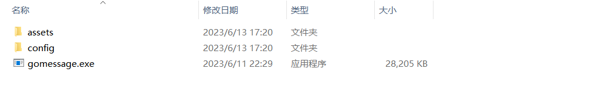
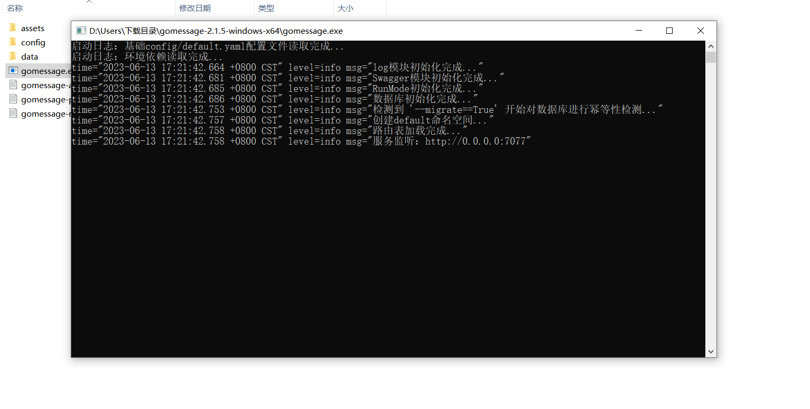
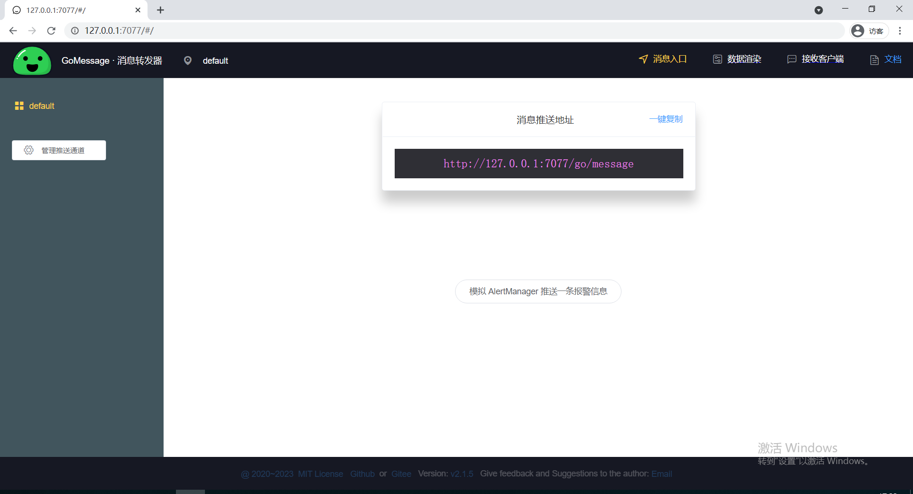

# Windows电脑上如何使用GoMessage
  

## 以exe文件的方式来运行GoMessage

> GoMessage提供了开箱即用的方式，将压缩包拉取到本地进行解压缩后，进入工作目录双击即可运行~
 

### exe包的获取地址：

下载地址（国内）：https://gitee.com/gomessage/gomessage/releases （国内用这个，速度很快~）

下载地址（国外）：https://github.com/gomessage/gomessage/releases

解压之后得到的文件目录结构为：

 

### 启动应用程序：

- 首先，保持以上目录结构不变

- 接着，双击打开gomessage.exe即可启动服务~ （本地访问端口默认为：7077）

打开之后程序界面为：

此时，我们可以通过浏览器访问web界面~（本地访问地址默认为：http://127.0.0.1:7077/ ）

接下来，我们就可以根据使用教程来配置属于自己的消息转发器啦～

[界面上的使用教程](https://github.com/BearQy/gomessage/tree/master#%E7%95%8C%E9%9D%A2%E4%B8%8A%E7%9A%84%E4%BD%BF%E7%94%A8%E6%95%99%E7%A8%8B)
