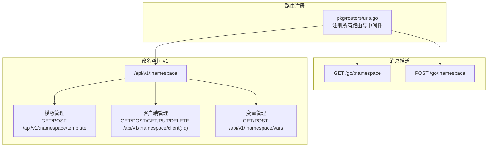
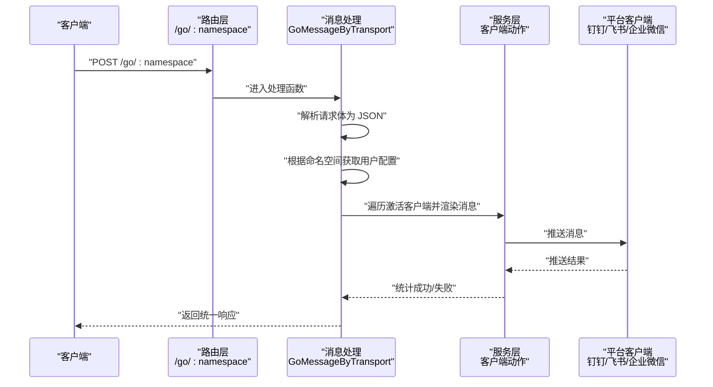
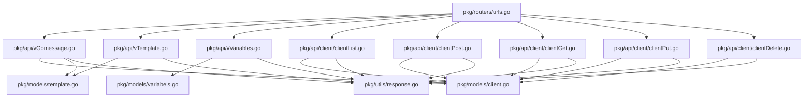

# API 参考文档

<cite>
**本文档引用的文件**
- [pkg/routers/urls.go](file://pkg/routers/urls.go)
- [pkg/api/vGomessage.go](file://pkg/api/vGomessage.go)
- [pkg/api/vTemplate.go](file://pkg/api/vTemplate.go)
- [pkg/api/client/clientPost.go](file://pkg/api/client/clientPost.go)
- [pkg/api/client/clientGet.go](file://pkg/api/client/clientGet.go)
- [pkg/api/client/clientList.go](file://pkg/api/client/clientList.go)
- [pkg/api/client/clientPut.go](file://pkg/api/client/clientPut.go)
- [pkg/api/client/clientDelete.go](file://pkg/api/client/clientDelete.go)
- [pkg/api/vVariables.go](file://pkg/api/vVariables.go)
- [pkg/middleware/auth.go](file://pkg/middleware/auth.go)
- [pkg/models/client.go](file://pkg/models/client.go)
- [pkg/models/template.go](file://pkg/models/template.go)
- [pkg/models/variabels.go](file://pkg/models/variabels.go)
- [pkg/utils/response.go](file://pkg/utils/response.go)
- [assets/docs/swagger.yaml](file://assets/docs/swagger.yaml)
</cite>

## 目录
1. [简介](#简介)
2. [项目结构](#项目结构)
3. [核心组件](#核心组件)
4. [架构总览](#架构总览)
5. [详细组件分析](#详细组件分析)
6. [依赖分析](#依赖分析)
7. [性能考虑](#性能考虑)
8. [故障排查指南](#故障排查指南)
9. [结论](#结论)
10. [附录](#附录)

## 简介
本参考文档面向 GoMessage 的所有公共 API 接口，覆盖以下核心领域：
- 消息推送接口：用于向指定命名空间推送消息
- 模板管理接口：用于维护命名空间的消息模板
- 客户端管理接口：用于维护不同 IM 平台的推送客户端
- 变量管理接口：用于维护命名空间内的键值变量映射

文档将为每个 RESTful API 提供：
- HTTP 方法与 URL 模式
- 请求参数与请求体结构
- 响应格式与状态码说明
- 错误处理与典型失败场景
- 认证方式（JWT）
- 使用示例（curl 与多语言客户端思路）
- API 版本控制与向后兼容性说明

## 项目结构
GoMessage 的 API 路由集中在路由注册文件中，按版本与功能分组，统一通过中间件进行命名空间校验与 JWT 认证。

图表来源
- [pkg/routers/urls.go:21-108](file://pkg/routers/urls.go#L21-L108)

章节来源
- [pkg/routers/urls.go:21-108](file://pkg/routers/urls.go#L21-L108)

## 核心组件
- 路由与中间件
  - 统一 CORS、访问日志中间件
  - 命名空间中间件：确保请求仅作用于当前命名空间
  - JWT 中间件：校验 Authorization 头中的 JWT 令牌
- 数据模型
  - 客户端模型：支持钉钉、飞书、企业微信应用、企业微信机器人等类型
  - 模板模型：命名空间内唯一模板，支持合并策略
  - 变量模型：键值对映射，支持批量更新
- 响应格式
  - 统一响应模板：包含 code、msg、result/error、help 字段

章节来源
- [pkg/middleware/auth.go:12-61](file://pkg/middleware/auth.go#L12-L61)
- [pkg/models/client.go:13-239](file://pkg/models/client.go#L13-L239)
- [pkg/models/template.go:9-72](file://pkg/models/template.go#L9-L72)
- [pkg/models/variabels.go:9-89](file://pkg/models/variabels.go#L9-L89)
- [pkg/utils/response.go:3-28](file://pkg/utils/response.go#L3-L28)

## 架构总览
下图展示消息推送从入口到客户端推送的整体流程，以及各模块之间的调用关系。

图表来源
- [pkg/api/vGomessage.go:20-153](file://pkg/api/vGomessage.go#L20-L153)

章节来源
- [pkg/api/vGomessage.go:20-153](file://pkg/api/vGomessage.go#L20-L153)

## 详细组件分析

### 消息推送接口
- 功能概述
  - 支持 GET 与 POST 两种入口，均受命名空间中间件保护
  - POST 入口会将请求体解析为 JSON，并根据命名空间配置渲染消息后推送到各客户端
- 认证与中间件
  - 需要 Authorization 头携带 JWT 令牌
  - 需满足命名空间中间件要求
- URL 与方法
  - GET /go/:namespace
  - POST /go/:namespace
- 请求参数
  - 路径参数
    - namespace：命名空间名称
  - 请求头
    - Authorization：Bearer <JWT_TOKEN>
  - 请求体（POST）
    - JSON 对象：作为消息内容源，可被模板与变量渲染
- 响应格式
  - 成功：统一响应模板，code=1
  - 部分失败：code=1，但提示部分失败
  - 失败：code=0，包含错误原因
- 状态码
  - 200：成功或部分成功
  - 400：请求体非法、参数错误
  - 500：内部错误（如通道配置获取失败、渲染失败等）
- 错误处理
  - 请求体非 JSON：返回 400
  - 通道配置缺失或渲染结果为空：返回 500
  - 所有客户端推送失败：返回 500
- 使用示例
  - curl
    - POST /go/:namespace
      - 示例命令：curl -X POST http(s)://host/go/:namespace -H "Authorization: Bearer <JWT>" -H "Content-Type: application/json" -d '{"event":"deploy","status":"success"}'
  - 多语言客户端
    - Java/Python/Go：构造 HTTP POST 请求，设置 Authorization 头，发送 JSON 请求体
- 版本与兼容性
  - 当前版本为 v1；消息推送接口保持稳定，建议以路径中的版本号为准进行兼容性管理

章节来源
- [pkg/routers/urls.go:42-48](file://pkg/routers/urls.go#L42-L48)
- [pkg/api/vGomessage.go:20-153](file://pkg/api/vGomessage.go#L20-L153)
- [pkg/middleware/auth.go:12-61](file://pkg/middleware/auth.go#L12-L61)

### 模板管理接口
- 功能概述
  - 在命名空间维度维护唯一模板，支持列表、新增、查询、修改、删除
- URL 与方法
  - GET /api/v1/:namespace/template
  - POST /api/v1/:namespace/template
  - GET /api/v1/:namespace/template/:id
  - PUT /api/v1/:namespace/template/:id
  - DELETE /api/v1/:namespace/template/:id
- 请求参数与请求体
  - 路径参数
    - namespace：命名空间名称
    - id：模板 ID（查询/修改/删除时使用）
  - 请求头
    - Authorization：Bearer <JWT_TOKEN>
  - 请求体（新增/修改）
    - JSON 对象，包含 template_name、template_content、template_is_merge 等字段
- 响应格式
  - 成功：统一响应模板，code=1
  - 失败：统一响应模板，code=0
- 状态码
  - 200：成功
  - 400：参数错误、请求内容错误、模板不属于当前命名空间
  - 500：内部错误
- 错误处理
  - 参数 id 非整数：返回 400
  - 模板不属于当前命名空间：返回 400
  - 查询/更新/删除失败：返回 400 或 500
- 使用示例
  - curl
    - 新增模板：curl -X POST http(s)://host/api/v1/:namespace/template -H "Authorization: Bearer <JWT>" -H "Content-Type: application/json" -d '{"template_name":"...","template_content":"...","template_is_merge":true}'
    - 查询模板：curl -X GET http(s)://host/api/v1/:namespace/template/:id -H "Authorization: Bearer <JWT>"
    - 修改模板：curl -X PUT http(s)://host/api/v1/:namespace/template/:id -H "Authorization: Bearer <JWT>" -H "Content-Type: application/json" -d '{"template_name":"...","template_content":"...","template_is_merge":false}'
    - 删除模板：curl -X DELETE http(s)://host/api/v1/:namespace/template/:id -H "Authorization: Bearer <JWT>"
- 版本与兼容性
  - 当前版本为 v1；模板字段保持稳定，建议以路径中的版本号为准进行兼容性管理

章节来源
- [pkg/routers/urls.go:75-86](file://pkg/routers/urls.go#L75-L86)
- [pkg/api/vTemplate.go:13-147](file://pkg/api/vTemplate.go#L13-L147)
- [pkg/models/template.go:9-72](file://pkg/models/template.go#L9-L72)

### 客户端管理接口
- 功能概述
  - 在命名空间维度维护多种 IM 平台的推送客户端，支持列表、新增、查询、修改（信息/激活状态）、删除
- URL 与方法
  - GET /api/v1/:namespace/client
  - POST /api/v1/:namespace/client
  - GET /api/v1/:namespace/client/:id
  - PUT /api/v1/:namespace/client/:id
  - PUT /api/v1/:namespace/client-info/:id
  - DELETE /api/v1/:namespace/client/:id
- 请求参数与请求体
  - 路径参数
    - namespace：命名空间名称
    - id：客户端 ID（查询/修改/删除时使用）
  - 请求头
    - Authorization：Bearer <JWT_TOKEN>
  - 请求体（新增/修改信息）
    - JSON 对象，包含 client_name、client_description、client_type、client_info 等字段
    - client_type 支持：dingtalk、feishu、wechat_application、wechat_robot
    - client_info 为 JSON 对象，对应各平台的配置字段
- 响应格式
  - 成功：统一响应模板，code=1
  - 失败：统一响应模板，code=0
- 状态码
  - 200：成功
  - 400：参数错误、请求内容错误、客户端不属于当前命名空间
  - 500：内部错误
- 错误处理
  - 参数 id 非整数：返回 400
  - 客户端不属于当前命名空间：返回 400
  - 未知 client_type：返回 400
  - 查询/更新/删除失败：返回 400 或 500
- 使用示例
  - curl
    - 新增客户端：curl -X POST http(s)://host/api/v1/:namespace/client -H "Authorization: Bearer <JWT>" -H "Content-Type: application/json" -d '{"client_name":"...","client_type":"dingtalk","client_info":{"...":"..."}}'
    - 查询客户端：curl -X GET http(s)://host/api/v1/:namespace/client/:id -H "Authorization: Bearer <JWT>"
    - 修改客户端信息：curl -X PUT http(s)://host/api/v1/:namespace/client-info/:id -H "Authorization: Bearer <JWT}" -H "Content-Type: application/json" -d '{"client_name":"...","client_type":"dingtalk","client_info":{"...":"..."}}'
    - 修改客户端激活状态：curl -X PUT http(s)://host/api/v1/:namespace/client/:id -H "Authorization: Bearer <JWT}" -H "Content-Type: application/json" -d '{"is_active":true}'
    - 删除客户端：curl -X DELETE http(s)://host/api/v1/:namespace/client/:id -H "Authorization: Bearer <JWT}"
- 版本与兼容性
  - 当前版本为 v1；客户端类型扩展需谨慎，建议以路径中的版本号为准进行兼容性管理

章节来源
- [pkg/routers/urls.go:79-86](file://pkg/routers/urls.go#L79-L86)
- [pkg/api/client/clientList.go:10-23](file://pkg/api/client/clientList.go#L10-L23)
- [pkg/api/client/clientPost.go:11-50](file://pkg/api/client/clientPost.go#L11-L50)
- [pkg/api/client/clientGet.go:27-93](file://pkg/api/client/clientGet.go#L27-L93)
- [pkg/api/client/clientPut.go:13-110](file://pkg/api/client/clientPut.go#L13-L110)
- [pkg/api/client/clientDelete.go:14-40](file://pkg/api/client/clientDelete.go#L14-L40)
- [pkg/models/client.go:13-239](file://pkg/models/client.go#L13-L239)

### 变量管理接口
- 功能概述
  - 在命名空间维度维护键值变量映射，支持列表、新增（批量）、查询、修改、删除
- URL 与方法
  - GET /api/v1/:namespace/vars
  - POST /api/v1/:namespace/vars
  - GET /api/v1/:namespace/vars/:id
  - PUT /api/v1/:namespace/vars/:id
  - DELETE /api/v1/:namespace/vars/:id
- 请求参数与请求体
  - 路径参数
    - namespace：命名空间名称
    - id：变量 ID（查询/修改/删除时使用）
  - 请求头
    - Authorization：Bearer <JWT_TOKEN>
  - 请求体（新增）
    - JSON 对象，包含 key_value_list 数组，数组元素为键值对映射
- 响应格式
  - 成功：统一响应模板，code=1
  - 失败：统一响应模板，code=0
- 状态码
  - 200：成功
  - 400：参数错误、请求内容错误
  - 500：内部错误
- 错误处理
  - 参数 id 非整数：返回 400
  - 查询/更新/删除失败：返回 400 或 500
- 使用示例
  - curl
    - 新增变量（批量）：curl -X POST http(s)://host/api/v1/:namespace/vars -H "Authorization: Bearer <JWT>" -H "Content-Type: application/json" -d '{"key_value_list":[{"key1":"value1"},{"key2":"value2"}]}'
    - 查询变量：curl -X GET http(s)://host/api/v1/:namespace/vars/:id -H "Authorization: Bearer <JWT}"
    - 修改变量：curl -X PUT http(s)://host/api/v1/:namespace/vars/:id -H "Authorization: Bearer <JWT}" -H "Content-Type: application/json" -d '{"key":"...","value":"..."}'
    - 删除变量：curl -X DELETE http(s)://host/api/v1/:namespace/vars/:id -H "Authorization: Bearer <JWT}"
- 版本与兼容性
  - 当前版本为 v1；变量映射结构保持稳定，建议以路径中的版本号为准进行兼容性管理

章节来源
- [pkg/routers/urls.go:68-74](file://pkg/routers/urls.go#L68-L74)
- [pkg/api/vVariables.go:12-103](file://pkg/api/vVariables.go#L12-L103)
- [pkg/models/variabels.go:9-89](file://pkg/models/variabels.go#L9-L89)

### 认证与安全
- 认证方式
  - JWT（HMAC 签名）
  - 请求头：Authorization: Bearer <JWT_TOKEN>
- 中间件行为
  - 校验 Authorization 头是否存在
  - 校验 JWT 签名与有效性
  - 校验会话状态（令牌是否在会话表中有效）
- 常见错误
  - 缺少 Authorization 头：401
  - 令牌无效/签名异常：401
  - 令牌已过期/未登录：401
- 使用示例
  - curl
    - 登录获取 JWT 后，后续请求带上 Authorization: Bearer <JWT>

章节来源
- [pkg/middleware/auth.go:12-61](file://pkg/middleware/auth.go#L12-L61)

## 依赖分析
- 路由与控制器
  - 路由注册集中于路由文件，按版本分组，统一挂载中间件
- 控制器与模型
  - 控制器负责参数解析、权限校验与调用模型层
  - 模型层负责数据库操作与业务规则
- 统一响应
  - 所有控制器返回统一响应模板，便于前端与客户端处理

图表来源
- [pkg/routers/urls.go:21-108](file://pkg/routers/urls.go#L21-L108)
- [pkg/api/vGomessage.go:1-172](file://pkg/api/vGomessage.go#L1-L172)
- [pkg/api/vTemplate.go:1-147](file://pkg/api/vTemplate.go#L1-L147)
- [pkg/api/vVariables.go:1-103](file://pkg/api/vVariables.go#L1-L103)
- [pkg/api/client/clientList.go:1-23](file://pkg/api/client/clientList.go#L1-L23)
- [pkg/api/client/clientPost.go:1-50](file://pkg/api/client/clientPost.go#L1-L50)
- [pkg/api/client/clientGet.go:1-93](file://pkg/api/client/clientGet.go#L1-L93)
- [pkg/api/client/clientPut.go:1-110](file://pkg/api/client/clientPut.go#L1-L110)
- [pkg/api/client/clientDelete.go:1-40](file://pkg/api/client/clientDelete.go#L1-L40)
- [pkg/models/client.go:1-239](file://pkg/models/client.go#L1-L239)
- [pkg/models/template.go:1-72](file://pkg/models/template.go#L1-L72)
- [pkg/models/variabels.go:1-89](file://pkg/models/variabels.go#L1-L89)
- [pkg/utils/response.go:1-28](file://pkg/utils/response.go#L1-L28)

章节来源
- [pkg/routers/urls.go:21-108](file://pkg/routers/urls.go#L21-L108)
- [pkg/utils/response.go:3-28](file://pkg/utils/response.go#L3-L28)

## 性能考虑
- 命名空间隔离
  - 所有 v1 接口均受命名空间中间件保护，避免跨命名空间资源访问
- 客户端推送
  - 按命名空间激活客户端逐个推送，失败统计有助于快速定位问题
- 模板与变量
  - 模板与变量按命名空间维护，减少全局扫描成本
- 建议
  - 合理设置客户端数量与推送频率，避免瞬时高并发
  - 使用模板与变量进行内容渲染，减少重复请求体

## 故障排查指南
- 通用错误
  - 400：请求体非 JSON、参数错误
  - 500：内部错误（通道配置获取失败、渲染失败、数据库操作失败）
- 认证相关
  - 401：缺少 Authorization 头、令牌无效/签名异常、令牌已过期/未登录
- 模板与变量
  - 模板/变量不属于当前命名空间：返回 400
- 客户端
  - 未知 client_type：返回 400
  - 查询/更新/删除失败：检查 ID 是否正确、命名空间是否匹配

章节来源
- [pkg/api/vGomessage.go:33-42](file://pkg/api/vGomessage.go#L33-L42)
- [pkg/middleware/auth.go:19-59](file://pkg/middleware/auth.go#L19-L59)
- [pkg/api/vTemplate.go:70-85](file://pkg/api/vTemplate.go#L70-L85)
- [pkg/api/vVariables.go:49-60](file://pkg/api/vVariables.go#L49-L60)
- [pkg/api/client/clientPut.go:64-67](file://pkg/api/client/clientPut.go#L64-L67)

## 结论
本参考文档系统梳理了 GoMessage 的公共 API，涵盖消息推送、模板管理、客户端管理与变量管理四大模块。通过统一的 JWT 认证与命名空间中间件，确保接口的安全与隔离。建议在生产环境中：
- 严格遵循路径中的版本号进行兼容性管理
- 使用模板与变量提升消息渲染效率
- 关注失败统计，及时排查客户端与平台配置问题

## 附录
- Swagger 文档
  - 可通过 /swagger/*any 访问交互式文档
- 统一响应模板
  - 字段：code、msg、result、error、help
- 常用 curl 示例
  - 消息推送：POST /go/:namespace
  - 模板管理：GET/POST/PUT/DELETE /api/v1/:namespace/template(:id)
  - 客户端管理：GET/POST/PUT/DELETE /api/v1/:namespace/client(:id)
  - 变量管理：GET/POST/PUT/DELETE /api/v1/:namespace/vars(:id)

章节来源
- [assets/docs/swagger.yaml:1-150](file://assets/docs/swagger.yaml#L1-L150)
- [pkg/utils/response.go:11-27](file://pkg/utils/response.go#L11-L27)