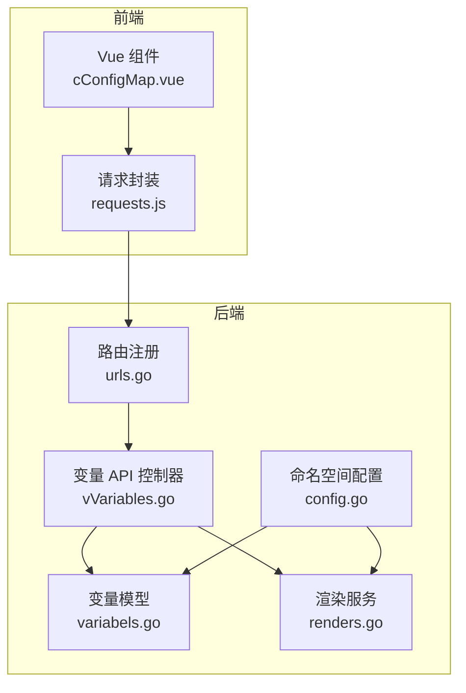
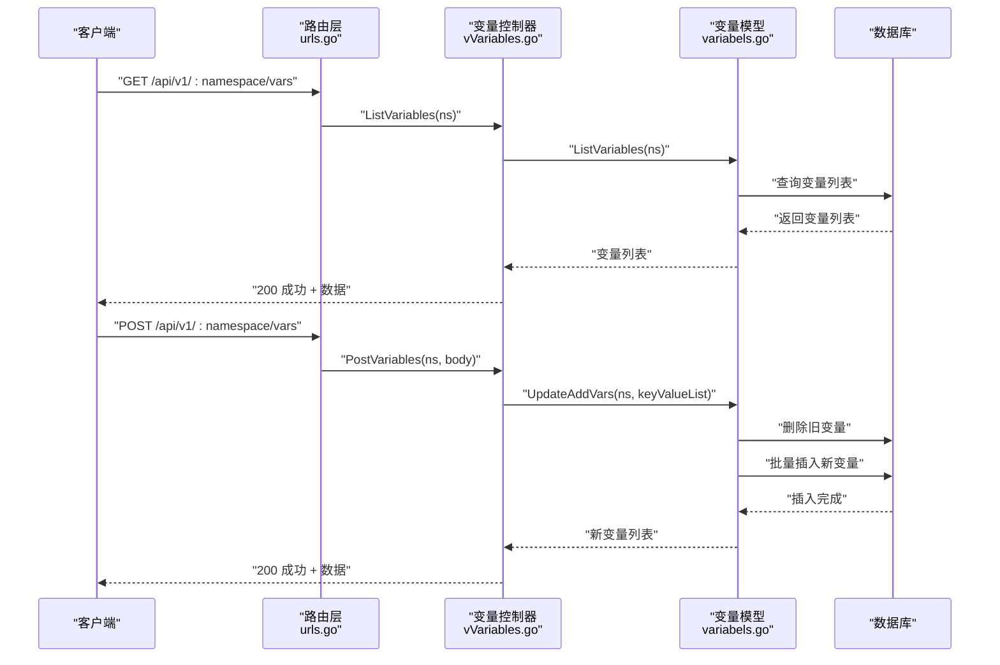
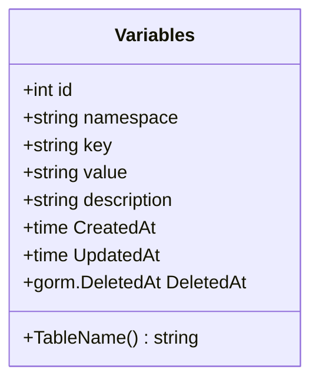
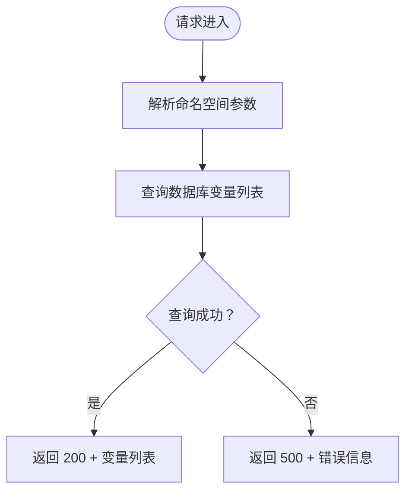
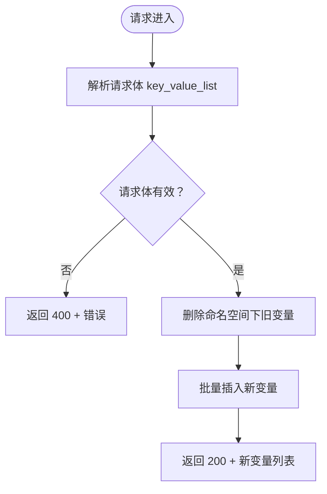
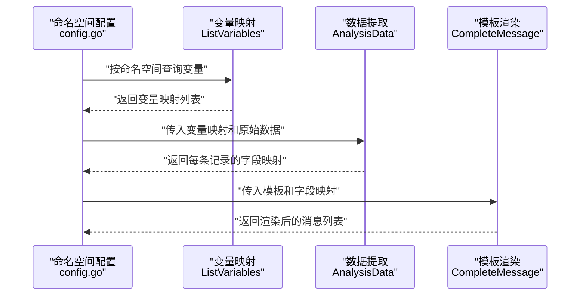
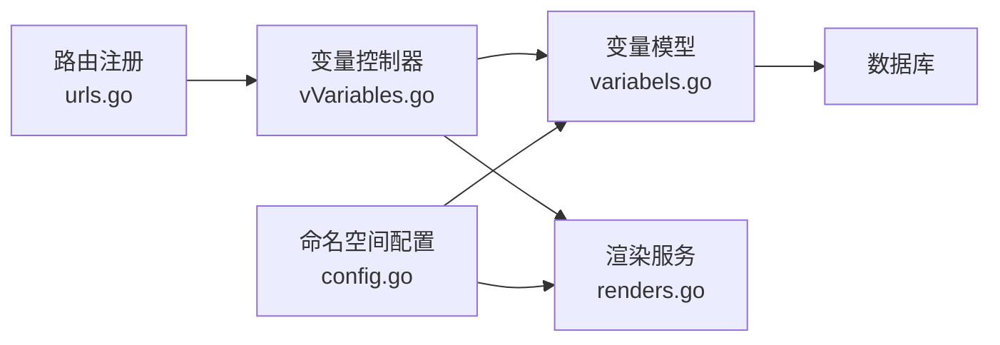

# 变量管理接口

<cite>
**本文引用的文件**
- [vVariables.go](file://pkg/api/vVariables.go)
- [variabels.go](file://pkg/models/variabels.go)
- [urls.go](file://pkg/routers/urls.go)
- [response.go](file://pkg/utils/response.go)
- [renders.go](file://pkg/services/core/v1/renders.go)
- [config.go](file://pkg/services/core/v1/config.go)
- [requests.js](file://vue/src/service/requests.js)
- [cConfigMap.vue](file://vue/src/components/cConfigMap.vue)
- [validate.js](file://vue/src/utils/validate.js)
- [swagger.json](file://assets/docs/swagger.json)
</cite>

## 目录
1. [简介](#简介)
2. [项目结构](#项目结构)
3. [核心组件](#核心组件)
4. [架构概览](#架构概览)
5. [详细组件分析](#详细组件分析)
6. [依赖分析](#依赖分析)
7. [性能考虑](#性能考虑)
8. [故障排除指南](#故障排除指南)
9. [结论](#结论)
10. [附录](#附录)

## 简介
本文档详细说明了变量管理接口的完整 API 规范，重点覆盖 `/api/v1/:namespace/vars` 接口的 GET 和 POST 方法。该接口用于：
- **GET /api/v1/:namespace/vars**：查询指定命名空间下的所有变量映射
- **POST /api/v1/:namespace/vars**：批量创建/更新变量映射（会先删除该命名空间下现有变量，再写入新的映射）

文档还涵盖变量数据结构定义、命名规范、值的数据类型支持、作用域说明、模板中变量的使用与替换机制、最佳实践建议以及批量操作和导入导出的使用场景。

## 项目结构
变量管理接口位于后端服务的 API 层，通过 Gin 路由注册，并与数据模型层交互。前端 Vue 组件负责变量映射的可视化编辑与提交。

**图表来源**
- [urls.go:58-90](file://pkg/routers/urls.go#L58-L90)
- [vVariables.go:12-43](file://pkg/api/vVariables.go#L12-L43)
- [variabels.go:9-22](file://pkg/models/variabels.go#L9-L22)
- [renders.go:15-67](file://pkg/services/core/v1/renders.go#L15-L67)
- [config.go:11-45](file://pkg/services/core/v1/config.go#L11-L45)

**章节来源**
- [urls.go:58-90](file://pkg/routers/urls.go#L58-L90)
- [vVariables.go:12-43](file://pkg/api/vVariables.go#L12-L43)
- [variabels.go:9-22](file://pkg/models/variabels.go#L9-L22)

## 核心组件
- **变量数据结构**：包含标识、命名空间、键、值、描述等字段
- **变量模型**：提供 CRUD 操作与批量更新逻辑
- **变量 API 控制器**：暴露 GET/POST 接口，处理请求与响应
- **渲染服务**：将变量映射应用到模板进行内容生成
- **命名空间配置**：按命名空间加载变量映射供渲染使用

**章节来源**
- [variabels.go:9-22](file://pkg/models/variabels.go#L9-L22)
- [vVariables.go:12-43](file://pkg/api/vVariables.go#L12-L43)
- [renders.go:15-67](file://pkg/services/core/v1/renders.go#L15-L67)
- [config.go:11-45](file://pkg/services/core/v1/config.go#L11-L45)

## 架构概览
变量管理接口的调用流程如下：

**图表来源**
- [urls.go:68-70](file://pkg/routers/urls.go#L68-L70)
- [vVariables.go:16-24](file://pkg/api/vVariables.go#L16-L24)
- [vVariables.go:30-43](file://pkg/api/vVariables.go#L30-L43)
- [variabels.go:59-63](file://pkg/models/variabels.go#L59-L63)
- [variabels.go:65-88](file://pkg/models/variabels.go#L65-L88)

## 详细组件分析

### 变量数据结构定义
变量实体包含以下字段：
- id：主键标识
- namespace：所属命名空间
- key：变量键名
- value：变量值（JSON 路径表达式）
- description：描述信息
- 时间戳字段（CreatedAt/UpdatedAt/DeletedAt）用于 ORM 管理

**图表来源**
- [variabels.go:9-22](file://pkg/models/variabels.go#L9-L22)

**章节来源**
- [variabels.go:9-22](file://pkg/models/variabels.go#L9-L22)

### GET /api/v1/:namespace/vars
- 功能：查询指定命名空间下的所有变量映射
- 请求参数：
  - 路径参数：namespace（命名空间）
- 响应：
  - 成功：返回变量列表
  - 失败：返回错误信息

**图表来源**
- [vVariables.go:16-24](file://pkg/api/vVariables.go#L16-L24)
- [variabels.go:59-63](file://pkg/models/variabels.go#L59-L63)

**章节来源**
- [vVariables.go:16-24](file://pkg/api/vVariables.go#L16-L24)
- [variabels.go:59-63](file://pkg/models/variabels.go#L59-L63)

### POST /api/v1/:namespace/vars
- 功能：批量创建/更新变量映射
- 请求体：
  - key_value_list：数组，每个元素是一个键值对对象
- 行为：
  - 先删除该命名空间下所有现有变量
  - 再批量插入新的变量映射
- 响应：
  - 成功：返回新创建的变量列表
  - 失败：返回错误信息

**图表来源**
- [vVariables.go:30-43](file://pkg/api/vVariables.go#L30-L43)
- [variabels.go:65-88](file://pkg/models/variabels.go#L65-L88)

**章节来源**
- [vVariables.go:30-43](file://pkg/api/vVariables.go#L30-L43)
- [variabels.go:65-88](file://pkg/models/variabels.go#L65-L88)

### 变量命名规范
- 前端表单校验规则：
  - 不能以数字开头
  - 长度不能小于 3 个字符
  - 只能包含字母或数字，不允许特殊符号
- 建议：
  - 使用清晰的业务含义命名
  - 避免使用保留关键字
  - 保持命名一致性（如统一使用驼峰或下划线风格）

**章节来源**
- [validate.js:1-28](file://vue/src/utils/validate.js#L1-L28)
- [cConfigMap.vue:40](file://vue/src/components/cConfigMap.vue#L40)

### 变量值的数据类型支持
- 存储：变量值以字符串形式存储（JSON 路径表达式）
- 渲染：模板渲染时会从原始请求数据中提取对应字段值
- 支持的取值方式：
  - JSON 路径语法（如 alerts.0.labels.alertname）
  - 数组索引占位符（如 alerts.#.labels.alertname，会被替换为具体索引）

**章节来源**
- [renders.go:69-102](file://pkg/services/core/v1/renders.go#L69-L102)
- [config.go:34-45](file://pkg/services/core/v1/config.go#L34-L45)

### 变量作用域说明
- 命名空间作用域：变量仅在所属命名空间内生效
- 路由中间件：API 路由组启用了命名空间检查中间件，确保请求与命名空间一致
- 删除影响：删除命名空间会级联删除其下的变量、模板、客户端等资源

**章节来源**
- [urls.go:58-60](file://pkg/routers/urls.go#L58-L60)
- [urls.go:103](file://pkg/routers/urls.go#L103)

### 模板中的变量使用与替换机制
- 变量映射加载：按命名空间加载变量映射，构建 key->value 的映射表
- 数据提取：使用 gjson 从原始请求数据中提取字段值
- 模板渲染：基于 Go html/template 引擎，将变量映射填充到模板中
- 多条记录处理：当 JSON 路径指向数组时，会按数组长度生成多条渲染结果

**图表来源**
- [config.go:34-45](file://pkg/services/core/v1/config.go#L34-L45)
- [renders.go:69-102](file://pkg/services/core/v1/renders.go#L69-L102)
- [renders.go:15-67](file://pkg/services/core/v1/renders.go#L15-L67)

**章节来源**
- [config.go:34-45](file://pkg/services/core/v1/config.go#L34-L45)
- [renders.go:69-102](file://pkg/services/core/v1/renders.go#L69-L102)
- [renders.go:15-67](file://pkg/services/core/v1/renders.go#L15-L67)

### 前端交互与最佳实践
- 前端组件：
  - cConfigMap.vue：提供变量映射的可视化编辑界面
  - requests.js：封装变量相关 API 调用
- 提交策略：
  - 每次提交都会删除该命名空间下所有变量，然后重新保存当前最新映射
  - 建议在前端进行必要的校验后再提交，避免无效请求

**章节来源**
- [cConfigMap.vue:150-155](file://vue/src/components/cConfigMap.vue#L150-L155)
- [requests.js:12-14](file://vue/src/service/requests.js#L12-L14)

## 依赖分析
- 路由层依赖：urls.go 注册变量 API 路由，并应用命名空间与鉴权中间件
- 控制器依赖：vVariables.go 依赖 models 层进行数据访问
- 模型依赖：variabels.go 依赖数据库连接进行 CRUD 操作
- 渲染依赖：renders.go 与 config.go 依赖变量映射进行模板渲染

**图表来源**
- [urls.go:68-70](file://pkg/routers/urls.go#L68-L70)
- [vVariables.go:16-24](file://pkg/api/vVariables.go#L16-L24)
- [variabels.go:59-63](file://pkg/models/variabels.go#L59-L63)
- [renders.go:15-67](file://pkg/services/core/v1/renders.go#L15-L67)
- [config.go:34-45](file://pkg/services/core/v1/config.go#L34-L45)

**章节来源**
- [urls.go:68-70](file://pkg/routers/urls.go#L68-L70)
- [vVariables.go:16-24](file://pkg/api/vVariables.go#L16-L24)
- [variabels.go:59-63](file://pkg/models/variabels.go#L59-L63)
- [renders.go:15-67](file://pkg/services/core/v1/renders.go#L15-L67)
- [config.go:34-45](file://pkg/services/core/v1/config.go#L34-L45)

## 性能考虑
- 批量操作：POST 接口会先删除再插入，适合全量替换场景；若频繁小范围变更，可考虑使用 PUT/DELETE 单条变量接口
- 数据库查询：ListVariables 按命名空间查询并排序，建议在 namespace 字段建立索引
- 模板渲染：AnalysisData 会计算数组长度并逐条渲染，大数据量时注意模板复杂度与字段数量

[本节为通用性能建议，无需特定文件来源]

## 故障排除指南
- 参数错误：
  - GET/PUT/DELETE 接口的 id 参数必须为整数，否则返回 400
- 请求体错误：
  - POST 接口的请求体必须为有效的 JSON，包含 key_value_list 字段
- 数据库错误：
  - 查询或更新失败时返回 500 或 400，需检查数据库连接与权限
- 响应格式：
  - 所有接口均使用统一响应模板，包含 code、msg、result/error、help 字段

**章节来源**
- [vVariables.go:50-58](file://pkg/api/vVariables.go#L50-L58)
- [vVariables.go:74-83](file://pkg/api/vVariables.go#L74-L83)
- [vVariables.go:91-101](file://pkg/api/vVariables.go#L91-L101)
- [response.go:3-27](file://pkg/utils/response.go#L3-L27)

## 结论
变量管理接口提供了简洁高效的变量映射查询与批量更新能力，结合模板渲染服务实现了灵活的消息内容生成。通过明确的命名规范、统一的响应格式和完善的错误处理，该接口能够满足大多数消息推送场景下的变量管理需求。

[本节为总结性内容，无需特定文件来源]

## 附录

### API 定义总览
- GET /api/v1/:namespace/vars
  - 功能：查询命名空间下所有变量映射
  - 请求参数：namespace（路径参数）
  - 响应：变量列表
- POST /api/v1/:namespace/vars
  - 功能：批量创建/更新变量映射
  - 请求体：key_value_list（数组）
  - 响应：新变量列表

**章节来源**
- [swagger.json:94-109](file://assets/docs/swagger.json#L94-L109)
- [urls.go:68-70](file://pkg/routers/urls.go#L68-L70)

### 变量最佳实践
- 组织结构：
  - 按业务模块划分命名空间
  - 在命名空间内按功能域组织变量键名
- 命名约定：
  - 使用语义化名称，避免缩写
  - 采用统一的大小写风格
- 版本管理：
  - 通过命名空间隔离不同版本的变量
  - 变更前先备份，变更后验证渲染结果

[本节为通用最佳实践建议，无需特定文件来源]

### 批量操作与导入导出
- 批量操作场景：
  - 配置迁移：从旧系统导出变量映射，通过 POST 接口批量导入
  - 环境切换：在不同环境间复制变量映射
- 导入导出建议：
  - 导出：GET 接口返回的变量列表可作为备份
  - 导入：POST 接口会先清空再写入，适合全量替换
  - 注意：导入前确认命名空间正确，避免误覆盖其他环境的变量

**章节来源**
- [vVariables.go:30-43](file://pkg/api/vVariables.go#L30-L43)
- [variabels.go:65-88](file://pkg/models/variabels.go#L65-L88)