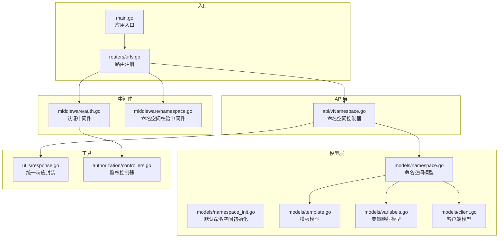
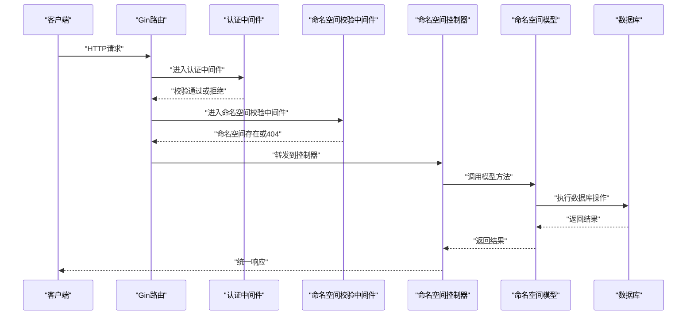
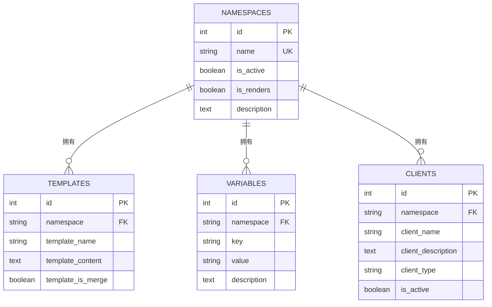
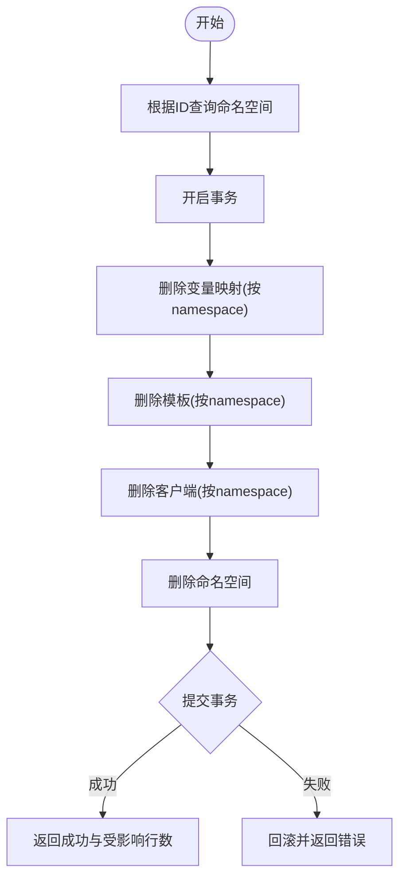
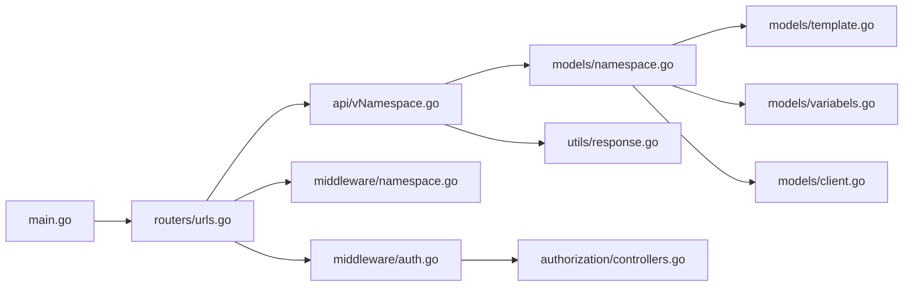

# 命名空间管理接口

<cite>
**本文引用的文件**
- [main.go](file://main.go)
- [urls.go](file://pkg/routers/urls.go)
- [vNamespace.go](file://pkg/api/vNamespace.go)
- [namespace.go](file://pkg/models/namespace.go)
- [namespace_init.go](file://pkg/models/namespace_init.go)
- [namespace.go](file://pkg/middleware/namespace.go)
- [auth.go](file://pkg/middleware/auth.go)
- [response.go](file://pkg/utils/response.go)
- [client.go](file://pkg/models/client.go)
- [template.go](file://pkg/models/template.go)
- [variabels.go](file://pkg/models/variabels.go)
- [controllers.go](file://pkg/authorization/controllers.go)
</cite>

## 目录
1. [简介](#简介)
2. [项目结构](#项目结构)
3. [核心组件](#核心组件)
4. [架构总览](#架构总览)
5. [详细组件分析](#详细组件分析)
6. [依赖关系分析](#依赖关系分析)
7. [性能考虑](#性能考虑)
8. [故障排除指南](#故障排除指南)
9. [结论](#结论)
10. [附录](#附录)

## 简介
本文件为命名空间管理接口的完整API文档，涵盖以下接口：
- 命名空间列表查询（GET /api/v1/namespace）
- 命名空间创建（POST /api/v1/namespace）
- 命名空间详情获取（GET /api/v1/namespace/:id）
- 命名空间更新（PUT /api/v1/namespace/:id）
- 命名空间删除（DELETE /api/v1/namespace/:id）

同时，文档解释命名空间的概念、多租户隔离机制、配置选项、最佳实践、权限分配建议、删除时的级联操作与数据清理机制，以及状态管理与监控指标。

## 项目结构
命名空间管理接口位于后端服务的API层，通过Gin框架路由分发至对应的处理器，并由模型层访问数据库。中间件负责认证与命名空间校验，统一响应格式封装。

图表来源
- [main.go:37-55](file://main.go#L37-L55)
- [urls.go:95-104](file://pkg/routers/urls.go#L95-L104)
- [vNamespace.go:15-148](file://pkg/api/vNamespace.go#L15-L148)
- [namespace.go:12-105](file://pkg/models/namespace.go#L12-L105)
- [namespace_init.go:8-31](file://pkg/models/namespace_init.go#L8-L31)
- [namespace.go:20-46](file://pkg/middleware/namespace.go#L20-L46)
- [auth.go:12-61](file://pkg/middleware/auth.go#L12-L61)
- [response.go:11-27](file://pkg/utils/response.go#L11-L27)
- [client.go:13-239](file://pkg/models/client.go#L13-L239)
- [template.go:9-72](file://pkg/models/template.go#L9-L72)
- [variabels.go:9-89](file://pkg/models/variabels.go#L9-L89)

章节来源
- [main.go:37-55](file://main.go#L37-L55)
- [urls.go:95-104](file://pkg/routers/urls.go#L95-L104)

## 核心组件
- 路由与中间件
  - 命名空间管理接口组在路由中以/v1命名空间组注册，并应用认证中间件与命名空间校验中间件。
  - 认证中间件要求请求携带有效的Authorization头，用于用户身份验证。
  - 命名空间校验中间件确保请求路径中的命名空间存在，否则直接返回404。
- 控制器
  - 提供命名空间的增删改查接口，参数校验与错误处理遵循统一响应格式。
- 模型层
  - 命名空间模型包含名称、激活状态、渲染开关、描述等字段；支持按激活状态过滤查询。
  - 创建命名空间时自动初始化模板与变量映射。
  - 删除命名空间采用事务处理，级联删除模板、变量映射与客户端，并提交事务。
- 工具与鉴权
  - 统一响应封装，返回code/msg/result/error/help字段。
  - 鉴权控制器提供JWT密钥、密码哈希与比较等能力。

章节来源
- [urls.go:95-104](file://pkg/routers/urls.go#L95-L104)
- [vNamespace.go:15-148](file://pkg/api/vNamespace.go#L15-L148)
- [namespace.go:12-105](file://pkg/models/namespace.go#L12-L105)
- [namespace_init.go:33-93](file://pkg/models/namespace_init.go#L33-L93)
- [response.go:11-27](file://pkg/utils/response.go#L11-L27)
- [auth.go:12-61](file://pkg/middleware/auth.go#L12-L61)

## 架构总览
下图展示命名空间管理接口的端到端调用流程，包括路由、中间件、控制器与模型层交互。

图表来源
- [urls.go:95-104](file://pkg/routers/urls.go#L95-L104)
- [auth.go:12-61](file://pkg/middleware/auth.go#L12-L61)
- [namespace.go:20-46](file://pkg/middleware/namespace.go#L20-L46)
- [vNamespace.go:15-148](file://pkg/api/vNamespace.go#L15-L148)
- [namespace.go:28-48](file://pkg/models/namespace.go#L28-L48)

## 详细组件分析

### 命名空间概念与多租户隔离
- 概念
  - 命名空间用于区分不同租户或业务域的数据与配置，是多租户隔离的基本单位。
  - 在系统中，命名空间与模板、变量映射、客户端等资源一一关联，形成独立的“通道”。
- 多租户隔离机制
  - 所有资源均以命名空间为前缀或外键进行存储与查询，避免跨租户数据泄露。
  - 默认命名空间“default”在系统初始化时创建，并自动初始化模板与变量映射。
- 配置选项
  - 名称：唯一标识，不可重复。
  - 激活状态：控制命名空间是否对外提供服务。
  - 渲染开关：控制消息推送时是否启用模板渲染。
  - 描述：对命名空间用途的简要说明。

章节来源
- [namespace.go:12-22](file://pkg/models/namespace.go#L12-L22)
- [namespace_init.go:8-31](file://pkg/models/namespace_init.go#L8-L31)

### 接口定义与行为

#### GET /api/v1/namespace
- 功能：列出命名空间，支持按激活状态过滤。
- 查询参数
  - is_active：可选，true/false/1/0，空表示不过滤。
- 返回
  - 成功：返回命名空间列表。
  - 失败：参数错误或服务器内部错误。

章节来源
- [vNamespace.go:15-32](file://pkg/api/vNamespace.go#L15-L32)
- [namespace.go:63-79](file://pkg/models/namespace.go#L63-L79)

#### POST /api/v1/namespace
- 功能：创建新命名空间。
- 请求体
  - name：必填，唯一。
  - is_active：可选，默认true。
  - is_renders：可选，默认true。
  - description：可选。
- 行为
  - 创建成功后，自动初始化模板与变量映射。
- 返回
  - 成功：返回创建后的命名空间。
  - 失败：命名空间已存在或请求内容错误。

章节来源
- [vNamespace.go:34-55](file://pkg/api/vNamespace.go#L34-L55)
- [namespace_init.go:33-93](file://pkg/models/namespace_init.go#L33-L93)
- [namespace.go:28-38](file://pkg/models/namespace.go#L28-L38)

#### GET /api/v1/namespace/:id
- 功能：根据ID获取命名空间详情。
- 参数
  - id：整数，命名空间ID。
- 返回
  - 成功：返回命名空间对象。
  - 失败：参数错误或查询失败。

章节来源
- [vNamespace.go:57-73](file://pkg/api/vNamespace.go#L57-L73)
- [namespace.go:82-87](file://pkg/models/namespace.go#L82-L87)

#### PUT /api/v1/namespace/:id
- 功能：更新命名空间信息。
- 参数
  - id：整数，命名空间ID。
- 请求体
  - name、is_active、is_renders、description。
- 返回
  - 成功：返回更新后的命名空间。
  - 失败：名称重复或请求内容错误。

章节来源
- [vNamespace.go:75-96](file://pkg/api/vNamespace.go#L75-L96)
- [namespace.go:50-61](file://pkg/models/namespace.go#L50-L61)

#### DELETE /api/v1/namespace/:id
- 功能：删除命名空间及其关联资源。
- 参数
  - id：整数，命名空间ID。
- 行为
  - 使用事务删除：变量映射、模板、客户端、命名空间本身。
  - 提交事务，返回受影响行数。
- 返回
  - 成功：返回删除成功信息与受影响行数。
  - 失败：查询失败、删除失败或服务器内部错误。

章节来源
- [vNamespace.go:98-148](file://pkg/api/vNamespace.go#L98-L148)
- [namespace.go:40-48](file://pkg/models/namespace.go#L40-L48)
- [variabels.go:35-39](file://pkg/models/variabels.go#L35-L39)
- [template.go:35-39](file://pkg/models/template.go#L35-L39)
- [client.go:149-153](file://pkg/models/client.go#L149-L153)

### 数据模型与关系

图表来源
- [namespace.go:12-22](file://pkg/models/namespace.go#L12-L22)
- [template.go:9-18](file://pkg/models/template.go#L9-L18)
- [variabels.go:9-18](file://pkg/models/variabels.go#L9-L18)
- [client.go:13-28](file://pkg/models/client.go#L13-L28)

### 删除流程与级联操作

图表来源
- [vNamespace.go:102-148](file://pkg/api/vNamespace.go#L102-L148)
- [variabels.go:35-39](file://pkg/models/variabels.go#L35-L39)
- [template.go:35-39](file://pkg/models/template.go#L35-L39)
- [client.go:149-153](file://pkg/models/client.go#L149-L153)

## 依赖关系分析

图表来源
- [main.go:37-55](file://main.go#L37-L55)
- [urls.go:95-104](file://pkg/routers/urls.go#L95-L104)
- [auth.go:12-61](file://pkg/middleware/auth.go#L12-L61)
- [namespace.go:20-46](file://pkg/middleware/namespace.go#L20-L46)
- [vNamespace.go:15-148](file://pkg/api/vNamespace.go#L15-L148)
- [namespace.go:12-105](file://pkg/models/namespace.go#L12-L105)
- [template.go:9-72](file://pkg/models/template.go#L9-L72)
- [variabels.go:9-89](file://pkg/models/variabels.go#L9-L89)
- [client.go:13-239](file://pkg/models/client.go#L13-L239)
- [response.go:11-27](file://pkg/utils/response.go#L11-L27)
- [controllers.go:10-12](file://pkg/authorization/controllers.go#L10-L12)

## 性能考虑
- 查询优化
  - 列表查询支持按激活状态过滤，减少不必要的全量扫描。
  - 使用GORM索引字段（如DeletedAt）提升删除与查询效率。
- 写入与事务
  - 删除命名空间使用事务保证一致性，避免部分删除导致的数据不一致。
- 缓存与并发
  - 建议在高并发场景下对命名空间存在性进行缓存校验，降低数据库压力。
- 日志与可观测性
  - 结合访问日志与运行时日志，记录命名空间操作的关键事件，便于追踪与审计。

## 故障排除指南
- 认证失败
  - 现象：返回未授权或需要Authorization请求头。
  - 处理：检查请求头Authorization是否正确传递有效令牌。
- 命名空间不存在
  - 现象：返回中间件拦截与404。
  - 处理：确认命名空间名称正确，或先创建命名空间。
- 参数错误
  - 现象：is_active参数仅允许true/false/1/0，否则返回参数错误。
  - 处理：修正查询参数值。
- 删除失败
  - 现象：删除过程中任一步骤失败，返回删除失败或服务器内部错误。
  - 处理：检查数据库连接与权限，确认事务未被外部中断。

章节来源
- [auth.go:12-61](file://pkg/middleware/auth.go#L12-L61)
- [namespace.go:20-46](file://pkg/middleware/namespace.go#L20-L46)
- [vNamespace.go:19-31](file://pkg/api/vNamespace.go#L19-L31)
- [vNamespace.go:114-144](file://pkg/api/vNamespace.go#L114-L144)

## 结论
命名空间管理接口提供了完整的多租户隔离能力，通过严格的参数校验、事务化的删除流程与自动初始化机制，保障了系统的稳定性与一致性。结合认证中间件与命名空间校验中间件，实现了安全可控的命名空间生命周期管理。

## 附录

### 最佳实践与权限分配建议
- 最佳实践
  - 为每个租户或业务域创建独立命名空间，避免共享敏感数据。
  - 启用渲染开关以满足不同渠道的消息格式需求。
  - 定期清理不再使用的命名空间，释放资源。
- 权限分配
  - 仅授予必要的命名空间操作权限，避免越权访问。
  - 对删除操作实施更严格的审批流程与审计日志。

### 状态管理与监控指标
- 状态字段
  - 激活状态：控制命名空间是否对外提供服务。
  - 渲染开关：控制消息推送时是否启用模板渲染。
- 监控建议
  - 记录命名空间创建/更新/删除事件。
  - 监控删除事务的提交成功率与耗时。
  - 关注命名空间下模板、变量映射、客户端数量变化趋势。