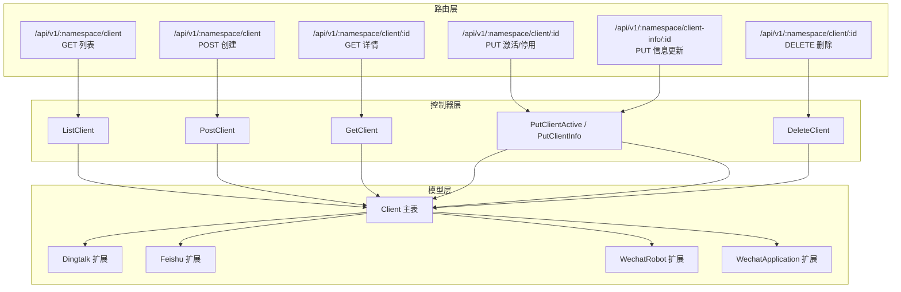
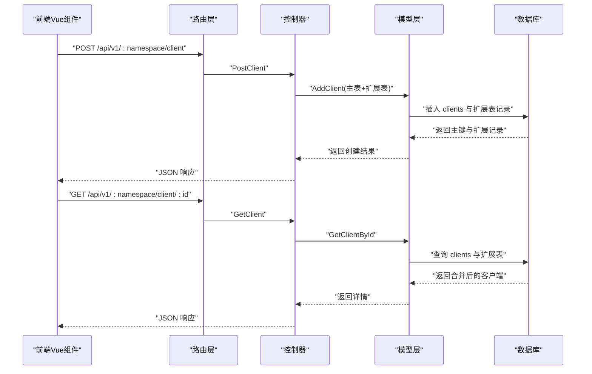
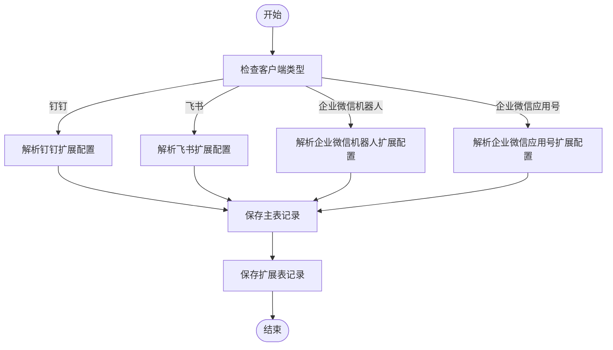

# 客户端管理接口

<cite>
**本文引用的文件**
- [clientList.go](file://pkg/api/client/clientList.go)
- [clientPost.go](file://pkg/api/client/clientPost.go)
- [clientGet.go](file://pkg/api/client/clientGet.go)
- [clientPut.go](file://pkg/api/client/clientPut.go)
- [clientDelete.go](file://pkg/api/client/clientDelete.go)
- [client.go](file://pkg/models/client.go)
- [client_dingtalk.go](file://pkg/models/client_dingtalk.go)
- [client_feishu.go](file://pkg/models/client_feishu.go)
- [client_wechat.go](file://pkg/models/client_wechat.go)
- [client_wechat_application.go](file://pkg/models/client_wechat_application.go)
- [constants.go](file://pkg/utils/constants.go)
- [urls.go](file://pkg/routers/urls.go)
- [global.go](file://pkg/utils/database/global.go)
- [clientDingtalk.vue](file://vue/src/components/clients/clientDingtalk.vue)
- [clientFeishu.vue](file://vue/src/components/clients/clientFeishu.vue)
- [clientWechat.vue](file://vue/src/components/clients/clientWechat.vue)
- [clientEmail.vue](file://vue/src/components/clients/clientEmail.vue)
</cite>

## 目录
1. [简介](#简介)
2. [项目结构](#项目结构)
3. [核心组件](#核心组件)
4. [架构总览](#架构总览)
5. [详细组件分析](#详细组件分析)
6. [依赖分析](#依赖分析)
7. [性能考虑](#性能考虑)
8. [故障排查指南](#故障排查指南)
9. [结论](#结论)
10. [附录](#附录)

## 简介
本文件为客户端管理接口的详细 API 文档，覆盖以下路径与方法：
- GET /api/v1/:namespace/client 客户端列表查询
- POST /api/v1/:namespace/client 客户端创建
- GET /api/v1/:namespace/client/:id 客户端详情获取
- PUT /api/v1/:namespace/client/:id 客户端激活/停用
- PUT /api/v1/:namespace/client-info/:id 客户端信息更新
- DELETE /api/v1/:namespace/client/:id 客户端删除

文档同时说明各客户端类型（钉钉、飞书、企业微信、邮件等）的配置参数、认证方式、状态管理与激活/停用机制，并提供配置示例与最佳实践。

## 项目结构
客户端管理接口位于后端 API 层与模型层之间，路由在 v1 版本命名空间下统一受中间件保护（命名空间校验与鉴权），并按客户端 CRUD 操作拆分控制器文件；模型层负责数据持久化与类型扩展；前端 Vue 组件提供各客户端类型的配置表单与交互。

图表来源
- [urls.go:79-85](file://pkg/routers/urls.go#L79-L85)
- [clientList.go:14](file://pkg/api/client/clientList.go#L14)
- [clientPost.go:15](file://pkg/api/client/clientPost.go#L15)
- [clientGet.go:31](file://pkg/api/client/clientGet.go#L31)
- [clientPut.go:80](file://pkg/api/client/clientPut.go#L80)
- [clientPut.go:13](file://pkg/api/client/clientPut.go#L13)
- [clientDelete.go:17](file://pkg/api/client/clientDelete.go#L17)
- [client.go:13-87](file://pkg/models/client.go#L13-L87)
- [client_dingtalk.go:21-38](file://pkg/models/client_dingtalk.go#L21-L38)
- [client_feishu.go:8-24](file://pkg/models/client_feishu.go#L8-L24)
- [client_wechat.go:9-24](file://pkg/models/client_wechat.go#L9-L24)
- [client_wechat_application.go:9-24](file://pkg/models/client_wechat_application.go#L9-L24)

章节来源
- [urls.go:58-90](file://pkg/routers/urls.go#L58-L90)

## 核心组件
- 路由与中间件
  - v1 命名空间组启用命名空间校验与鉴权中间件，确保每个客户端操作均在指定命名空间内进行且具备访问权限。
  - 客户端相关路由映射至对应的控制器函数，分别处理列表、创建、详情、更新（激活/停用与信息更新）、删除。
- 控制器
  - ListClient：按命名空间查询客户端列表。
  - PostClient：创建客户端，根据客户端类型解析扩展配置并持久化主表与扩展表。
  - GetClient：按 ID 查询客户端详情，返回主表与扩展表合并后的结构。
  - PutClientActive：更新客户端激活状态。
  - PutClientInfo：更新客户端基本信息与扩展配置。
  - DeleteClient：删除客户端及其扩展配置。
- 模型
  - Client 主表：包含命名空间、名称、描述、类型、激活状态以及 JSON 字段承载扩展配置。
  - 各扩展表：钉钉、飞书、企业微信机器人、企业微信应用号，均以 ClientId 关联主表。
- 常量
  - 定义客户端类型字符串常量，用于前后端约定与控制器分支判断。

章节来源
- [urls.go:58-90](file://pkg/routers/urls.go#L58-L90)
- [clientList.go:10-22](file://pkg/api/client/clientList.go#L10-L22)
- [clientPost.go:11-49](file://pkg/api/client/clientPost.go#L11-L49)
- [clientGet.go:27-92](file://pkg/api/client/clientGet.go#L27-L92)
- [clientPut.go:13-109](file://pkg/api/client/clientPut.go#L13-L109)
- [clientDelete.go:14-39](file://pkg/api/client/clientDelete.go#L14-L39)
- [client.go:13-239](file://pkg/models/client.go#L13-L239)
- [constants.go:3-8](file://pkg/utils/constants.go#L3-L8)

## 架构总览
客户端管理接口遵循“路由 -> 控制器 -> 模型 -> 数据库”的分层设计，命名空间作为强约束条件贯穿请求生命周期；控制器通过模型层完成主表与扩展表的读写分离与关联更新；前端 Vue 组件提供各客户端类型的配置表单，提交的数据结构与后端模型严格一致。

图表来源
- [urls.go:79-85](file://pkg/routers/urls.go#L79-L85)
- [clientPost.go:15-49](file://pkg/api/client/clientPost.go#L15-L49)
- [clientGet.go:31-92](file://pkg/api/client/clientGet.go#L31-L92)
- [client.go:40-87](file://pkg/models/client.go#L40-L87)
- [client.go:162-210](file://pkg/models/client.go#L162-L210)

## 详细组件分析

### 客户端类型与配置参数

- 钉钉机器人
  - 关键字段
    - 客户端名称、描述、类型、激活状态
    - 扩展配置：放行关键字、机器人 URL 列表（支持多 URL，内部转换为随机轮询）
  - 认证方式
    - 通过机器人 URL 与平台对接，无需额外鉴权头
  - 最佳实践
    - 多 URL 配置可规避单机器人频率限制；建议至少配置 2 个以上 URL
    - 放行关键字需与钉钉后台一致
  - 前端表单参考
    - [clientDingtalk.vue:46-82](file://vue/src/components/clients/clientDingtalk.vue#L46-L82)

- 飞书机器人
  - 关键字段
    - 客户端名称、描述、类型、激活状态
    - 扩展配置：标题关键字、标题颜色、机器人 URL 列表
  - 认证方式
    - 通过机器人 URL 与平台对接
  - 最佳实践
    - 标题颜色可选多种预设；关键字用于匹配飞书侧放行规则
  - 前端表单参考
    - [clientFeishu.vue:46-74](file://vue/src/components/clients/clientFeishu.vue#L46-L74)

- 企业微信机器人
  - 关键字段
    - 客户端名称、描述、类型、激活状态
    - 扩展配置：放行关键字、机器人 URL 列表
  - 认证方式
    - 通过机器人 URL 与平台对接
  - 最佳实践
    - 多 URL 轮询提升稳定性
  - 前端表单参考
    - [clientWechat.vue:45-69](file://vue/src/components/clients/clientWechat.vue#L45-L69)

- 企业微信应用号
  - 关键字段
    - 客户端名称、描述、类型、激活状态
    - 扩展配置：企业 ID、应用 AgentId、应用 Secret、接收用户（多用户以分隔符拼接）
  - 认证方式
    - 使用 Secret 获取应用凭证，推送时按用户列表发送
  - 最佳实践
    - Secret 长度需满足最小长度要求；接收用户列表建议规范格式
  - 前端表单参考
    - [clientWechat.vue:97-106](file://vue/src/components/clients/clientWechat.vue#L97-L106)

- 邮件
  - 关键字段
    - 客户端名称、描述、类型、激活状态
    - 扩展配置：邮件标题、收件人邮箱列表（可多邮箱）
  - 认证方式
    - 通过 SMTP 配置与平台对接（具体 SMTP 参数由服务端配置决定）
  - 最佳实践
    - 多邮箱配置可实现广播式通知
  - 前端表单参考
    - [clientEmail.vue:22-42](file://vue/src/components/clients/clientEmail.vue#L22-L42)

章节来源
- [client_dingtalk.go:21-38](file://pkg/models/client_dingtalk.go#L21-L38)
- [client_feishu.go:8-24](file://pkg/models/client_feishu.go#L8-L24)
- [client_wechat.go:9-24](file://pkg/models/client_wechat.go#L9-L24)
- [client_wechat_application.go:9-24](file://pkg/models/client_wechat_application.go#L9-L24)
- [clientDingtalk.vue:46-82](file://vue/src/components/clients/clientDingtalk.vue#L46-L82)
- [clientFeishu.vue:46-74](file://vue/src/components/clients/clientFeishu.vue#L46-L74)
- [clientWechat.vue:97-106](file://vue/src/components/clients/clientWechat.vue#L97-L106)
- [clientEmail.vue:22-42](file://vue/src/components/clients/clientEmail.vue#L22-L42)

### API 定义与行为

- GET /api/v1/:namespace/client
  - 功能：列出指定命名空间下的所有客户端
  - 请求参数
    - 路径参数：namespace（命名空间）
  - 返回
    - 成功：返回客户端列表
    - 失败：返回错误信息
  - 控制器与模型
    - [ListClient:10-22](file://pkg/api/client/clientList.go#L10-L22)
    - [ListClient 模型实现:221-228](file://pkg/models/client.go#L221-L228)

- POST /api/v1/:namespace/client
  - 功能：创建新的客户端
  - 请求体
    - 主表字段：client_name、client_description、client_type、is_active
    - 扩展字段：client_info（按类型包含不同配置）
  - 行为
    - 根据 client_type 解析 client_info 至对应扩展结构
    - 创建主表记录并同步创建扩展表记录
  - 控制器与模型
    - [PostClient:11-49](file://pkg/api/client/clientPost.go#L11-L49)
    - [AddClient 模型实现:40-87](file://pkg/models/client.go#L40-L87)

- GET /api/v1/:namespace/client/:id
  - 功能：获取指定客户端详情
  - 请求参数
    - 路径参数：namespace、id
  - 返回
    - 成功：返回主表与扩展表合并后的结构（扩展字段包含机器人 URL 列表）
    - 失败：返回错误信息
  - 控制器与模型
    - [GetClient:27-92](file://pkg/api/client/clientGet.go#L27-L92)
    - [GetClientById 模型实现:162-210](file://pkg/models/client.go#L162-L210)

- PUT /api/v1/:namespace/client/:id
  - 功能：更新客户端激活状态
  - 请求体
    - is_active（布尔）
  - 控制器与模型
    - [PutClientActive:77-109](file://pkg/api/client/clientPut.go#L77-L109)
    - [UpdateClientActive 模型实现:155-159](file://pkg/models/client.go#L155-L159)

- PUT /api/v1/:namespace/client-info/:id
  - 功能：更新客户端信息（名称、描述、激活状态及扩展配置）
  - 请求体
    - 主表字段：client_name、client_description、is_active
    - 扩展字段：client_info（按类型包含不同配置）
  - 行为
    - 根据 client_type 解析 client_info 至对应扩展结构
    - 更新主表与扩展表相应字段
  - 控制器与模型
    - [PutClientInfo:13-75](file://pkg/api/client/clientPut.go#L13-L75)
    - [UpdateClientInfo 模型实现:89-147](file://pkg/models/client.go#L89-L147)

- DELETE /api/v1/:namespace/client/:id
  - 功能：删除客户端
  - 请求参数
    - 路径参数：namespace、id
  - 返回
    - 成功：返回受影响行数
    - 失败：返回错误信息
  - 控制器与模型
    - [DeleteClient:14-39](file://pkg/api/client/clientDelete.go#L14-L39)
    - [DeleteClient 模型实现:149-153](file://pkg/models/client.go#L149-L153)

章节来源
- [clientList.go:10-22](file://pkg/api/client/clientList.go#L10-L22)
- [clientPost.go:11-49](file://pkg/api/client/clientPost.go#L11-L49)
- [clientGet.go:27-92](file://pkg/api/client/clientGet.go#L27-L92)
- [clientPut.go:13-109](file://pkg/api/client/clientPut.go#L13-L109)
- [clientDelete.go:14-39](file://pkg/api/client/clientDelete.go#L14-L39)
- [client.go:40-159](file://pkg/models/client.go#L40-L159)

### 状态管理与激活/停用机制
- 客户端状态
  - is_active 字段表示是否激活，默认创建时为未激活
- 激活/停用流程
  - 通过 PUT /api/v1/:namespace/client/:id 传入 is_active 更新状态
  - 模型层仅更新激活状态字段，不影响扩展配置
- 最佳实践
  - 在启用新客户端前先完善扩展配置并测试推送
  - 对于高可用场景，建议保留备用客户端并配置多 URL

图表来源
- [clientPost.go:26-41](file://pkg/api/client/clientPost.go#L26-L41)
- [client.go:47-84](file://pkg/models/client.go#L47-L84)

章节来源
- [client.go:40-87](file://pkg/models/client.go#L40-L87)
- [clientPut.go:77-109](file://pkg/api/client/clientPut.go#L77-L109)

### 配置验证规则
- 基础字段
  - client_name 必填
- 类型特定字段
  - 企业微信应用号：secret 需满足最小长度要求（前端已做长度校验）
- 命名空间校验
  - 所有操作均需校验客户端所属命名空间与请求路径一致
- 错误处理
  - 参数错误、查询失败、更新失败等均有明确响应码与错误信息

章节来源
- [clientDingtalk.vue:125-129](file://vue/src/components/clients/clientDingtalk.vue#L125-L129)
- [clientWechat.vue:107-111](file://vue/src/components/clients/clientWechat.vue#L107-L111)
- [clientGet.go:37-50](file://pkg/api/client/clientGet.go#L37-L50)
- [clientPut.go:18-31](file://pkg/api/client/clientPut.go#L18-L31)
- [clientDelete.go:19-32](file://pkg/api/client/clientDelete.go#L19-L32)

## 依赖分析
- 路由到控制器
  - v1 命名空间路由直接映射到客户端控制器函数
- 控制器到模型
  - 控制器调用模型层的 CRUD 方法，模型层封装数据库操作
- 模型到数据库
  - 模型层通过全局数据库客户端执行 SQL 操作
- 前端到后端
  - Vue 组件构造与后端一致的 JSON 结构并通过 Axios 发送请求

图表来源
- [urls.go:79-85](file://pkg/routers/urls.go#L79-L85)
- [client.go:13-239](file://pkg/models/client.go#L13-L239)
- [global.go:5-12](file://pkg/utils/database/global.go#L5-L12)

章节来源
- [urls.go:58-90](file://pkg/routers/urls.go#L58-L90)
- [global.go:14-35](file://pkg/utils/database/global.go#L14-L35)

## 性能考虑
- URL 随机轮询
  - 钉钉、飞书、企业微信机器人均支持多 URL，内部转换为随机列表，有助于规避平台频率限制
- 批量推送
  - 邮件类型支持多收件人，可一次性广播通知
- 数据库索引
  - 客户端表包含 DeletedAt 索引，有利于软删除场景的查询性能

章节来源
- [client_dingtalk.go:13-19](file://pkg/models/client_dingtalk.go#L13-L19)
- [client_feishu.go:16-18](file://pkg/models/client_feishu.go#L16-L18)
- [client_wechat.go:17-18](file://pkg/models/client_wechat.go#L17-L18)

## 故障排查指南
- 常见错误与定位
  - 参数错误：检查路径参数 id 是否为整数，命名空间是否匹配
  - 查询失败：确认客户端是否存在且属于当前命名空间
  - 更新失败：检查 client_type 与 client_info 结构是否匹配
  - 删除失败：确认客户端存在且拥有删除权限
- 建议排查步骤
  - 核对路由与中间件是否正确启用命名空间与鉴权
  - 核对客户端类型常量与前端提交的 client_type 是否一致
  - 核对扩展配置字段是否符合模型定义
  - 查看数据库日志确认主表与扩展表写入情况

章节来源
- [clientGet.go:37-50](file://pkg/api/client/clientGet.go#L37-L50)
- [clientPut.go:18-31](file://pkg/api/client/clientPut.go#L18-L31)
- [clientDelete.go:19-32](file://pkg/api/client/clientDelete.go#L19-L32)
- [constants.go:3-8](file://pkg/utils/constants.go#L3-L8)

## 结论
客户端管理接口提供了完整的 CRUD 能力与多平台客户端支持，结合命名空间与鉴权中间件确保了安全性与隔离性。通过扩展表设计实现了不同类型客户端的差异化配置，配合前端表单与随机 URL 轮询机制，能够满足生产环境的高可用与高可靠需求。

## 附录

### 客户端类型常量
- 钉钉：dingtalk
- 飞书：feishu
- 企业微信机器人：wechat_robot
- 企业微信应用号：wechat

章节来源
- [constants.go:3-8](file://pkg/utils/constants.go#L3-L8)