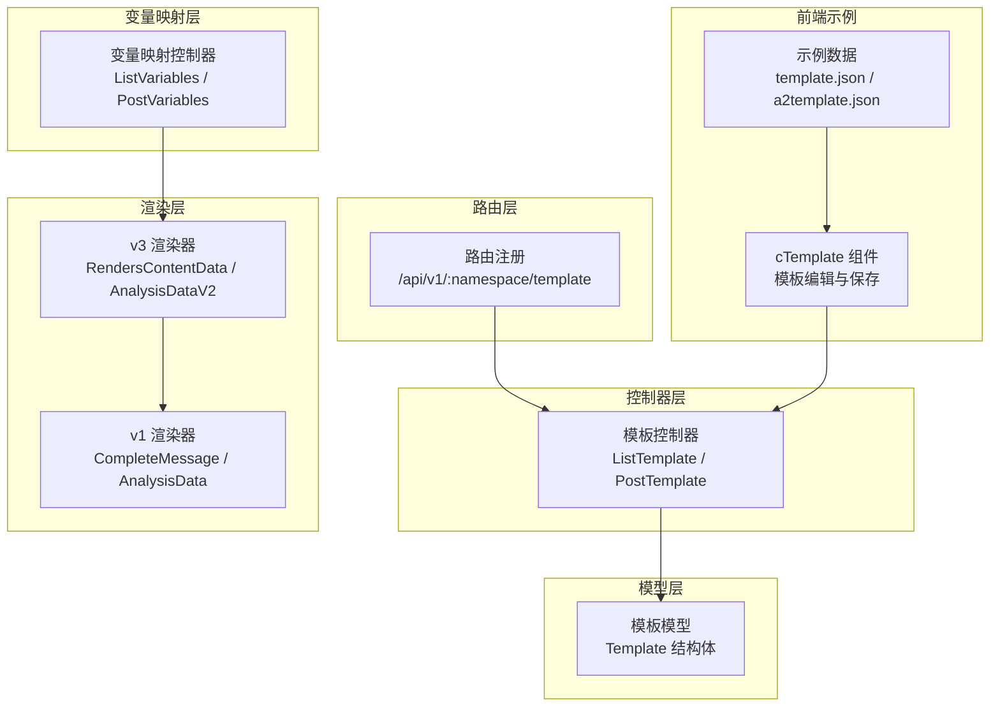
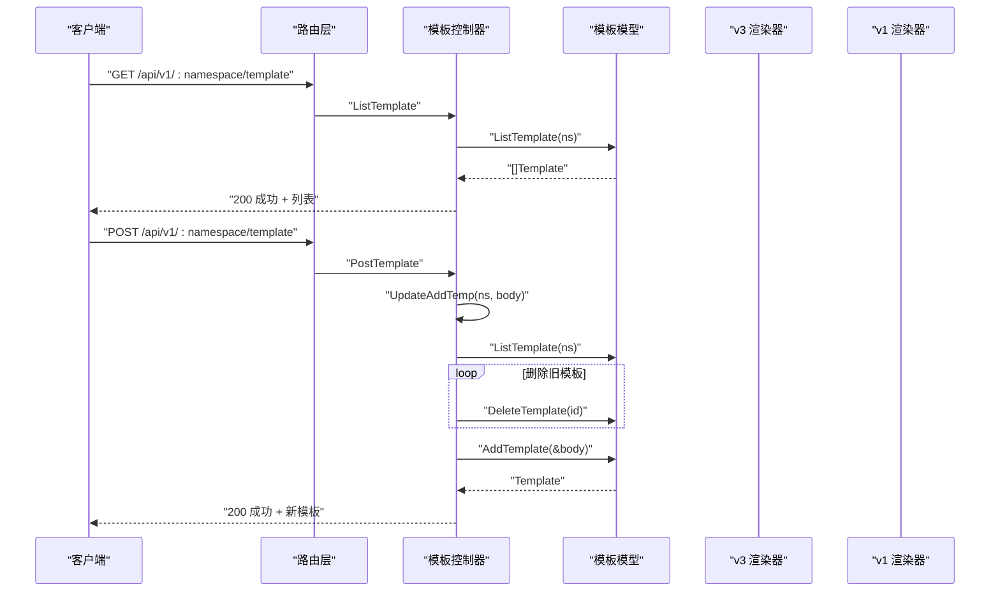
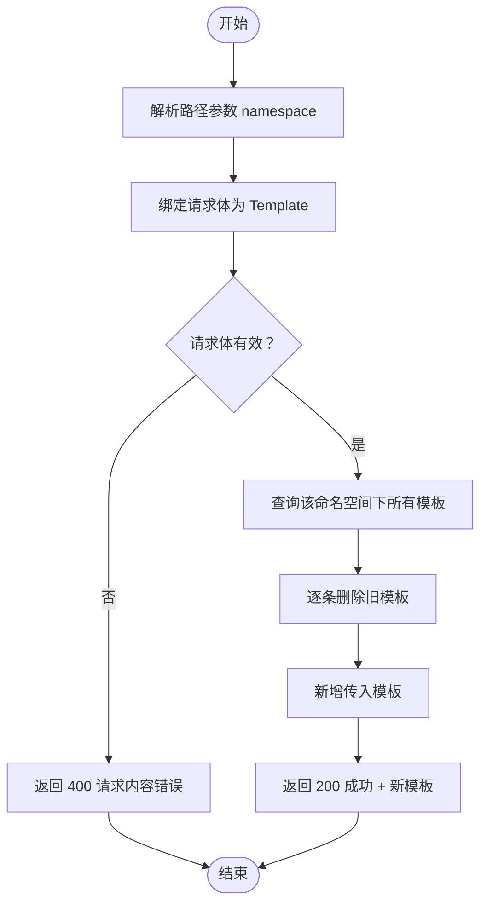
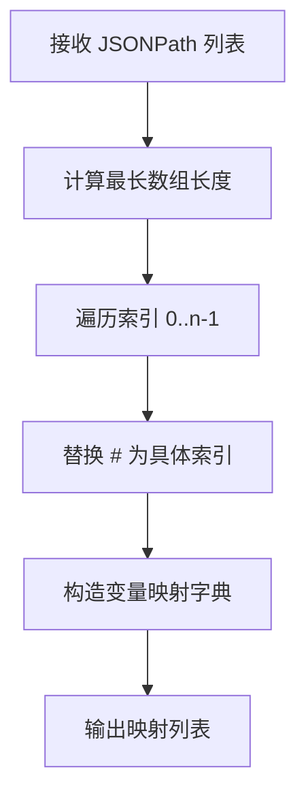
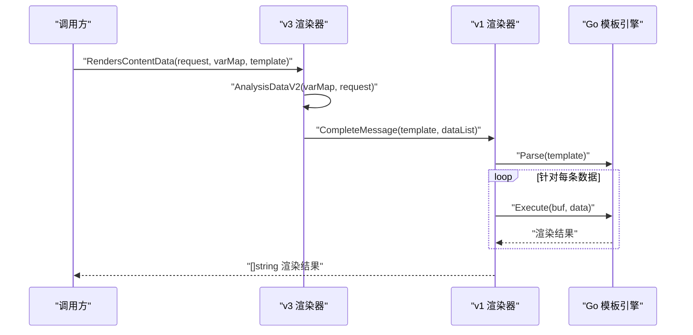
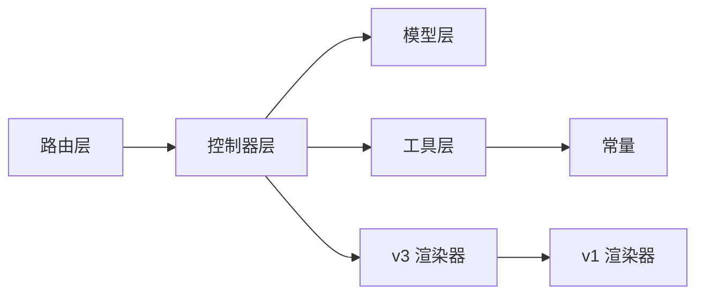

# 模板管理接口

<cite>
**本文引用的文件**
- [pkg/api/vTemplate.go](file://pkg/api/vTemplate.go)
- [pkg/models/template.go](file://pkg/models/template.go)
- [pkg/routers/urls.go](file://pkg/routers/urls.go)
- [pkg/services/core/v1/renders.go](file://pkg/services/core/v1/renders.go)
- [pkg/services/core/v3/renders.go](file://pkg/services/core/v3/renders.go)
- [pkg/api/vVariables.go](file://pkg/api/vVariables.go)
- [pkg/utils/constants.go](file://pkg/utils/constants.go)
- [pkg/utils/template.json](file://pkg/utils/template.json)
- [vue/src/views/main/a2template.json](file://vue/src/views/main/a2template.json)
- [vue/src/components/cTemplate.vue](file://vue/src/components/cTemplate.vue)
</cite>

## 目录
1. [简介](#简介)
2. [项目结构](#项目结构)
3. [核心组件](#核心组件)
4. [架构总览](#架构总览)
5. [详细组件分析](#详细组件分析)
6. [依赖分析](#依赖分析)
7. [性能考虑](#性能考虑)
8. [故障排查指南](#故障排查指南)
9. [结论](#结论)
10. [附录](#附录)

## 简介
本文件为模板管理接口的完整 API 文档，聚焦于 /api/v1/:namespace/template 的 GET 与 POST 方法，涵盖以下内容：
- 模板列表查询与模板创建流程
- 模板数据结构定义与 JSON 模板语法说明
- 变量映射机制与模板渲染过程
- 模板创建最佳实践（设计原则、变量命名规范、验证规则）
- 模板示例（不同消息类型的模板结构）
- 模板生命周期与版本控制机制说明

## 项目结构
围绕模板管理的关键文件与职责如下：
- 路由层：定义 /api/v1/:namespace/template 的 GET/POST 路由，并挂载命名空间中间件
- 控制器层：实现模板列表查询与模板创建（含覆盖写入逻辑）
- 模型层：定义模板数据结构与数据库访问方法
- 渲染层：基于 Go 模板引擎与 gjson 实现变量提取与模板渲染
- 变量映射层：维护命名空间级别的变量映射，供渲染使用
- 前端示例：提供模板与变量映射的示例数据与交互组件

图表来源
- [pkg/routers/urls.go:75-77](file://pkg/routers/urls.go#L75-L77)
- [pkg/api/vTemplate.go:17-47](file://pkg/api/vTemplate.go#L17-L47)
- [pkg/models/template.go:9-18](file://pkg/models/template.go#L9-L18)
- [pkg/services/core/v3/renders.go:10-13](file://pkg/services/core/v3/renders.go#L10-L13)
- [pkg/services/core/v1/renders.go:16-67](file://pkg/services/core/v1/renders.go#L16-L67)
- [pkg/api/vVariables.go:16-43](file://pkg/api/vVariables.go#L16-L43)
- [vue/src/components/cTemplate.vue:94-119](file://vue/src/components/cTemplate.vue#L94-L119)
- [pkg/utils/template.json:1-5](file://pkg/utils/template.json#L1-L5)
- [vue/src/views/main/a2template.json:1-92](file://vue/src/views/main/a2template.json#L1-L92)

章节来源
- [pkg/routers/urls.go:75-77](file://pkg/routers/urls.go#L75-L77)
- [pkg/api/vTemplate.go:17-47](file://pkg/api/vTemplate.go#L17-L47)
- [pkg/models/template.go:9-18](file://pkg/models/template.go#L9-L18)
- [pkg/services/core/v3/renders.go:10-13](file://pkg/services/core/v3/renders.go#L10-L13)
- [pkg/services/core/v1/renders.go:16-67](file://pkg/services/core/v1/renders.go#L16-L67)
- [pkg/api/vVariables.go:16-43](file://pkg/api/vVariables.go#L16-L43)
- [vue/src/components/cTemplate.vue:94-119](file://vue/src/components/cTemplate.vue#L94-L119)
- [pkg/utils/template.json:1-5](file://pkg/utils/template.json#L1-L5)
- [vue/src/views/main/a2template.json:1-92](file://vue/src/views/main/a2template.json#L1-L92)

## 核心组件
- 模板数据结构
  - 字段说明
    - id：模板唯一标识（自增主键）
    - namespace：命名空间标识
    - template_name：模板名称（默认与命名空间一致）
    - template_content：Go 模板语法的字符串内容
    - template_is_merge：是否合并发送（布尔）
  - 关系与约束
    - 数据表：templates
    - 查询条件：按 namespace 过滤
    - 更新策略：POST 时会先删除该命名空间下所有模板，再新增一条

- 变量映射结构
  - key_value_list：数组，每个元素为键值对，键为模板变量名（如 N1、N2），值为 JSONPath 表达式（支持 # 通配符）

- 渲染流程
  - 变量提取：根据 JSONPath 从请求数据中提取字段，支持数组索引替换
  - 模板渲染：使用 Go html/template 引擎，将变量映射注入模板，生成最终文本
  - 时间格式化：对 RFC3339 时间进行时区转换与格式化
  - 多条渲染：针对数组场景，逐条渲染并可选择合并发送

章节来源
- [pkg/models/template.go:9-18](file://pkg/models/template.go#L9-L18)
- [pkg/api/vTemplate.go:49-64](file://pkg/api/vTemplate.go#L49-L64)
- [pkg/api/vVariables.go:30-43](file://pkg/api/vVariables.go#L30-L43)
- [pkg/services/core/v1/renders.go:16-67](file://pkg/services/core/v1/renders.go#L16-L67)
- [pkg/services/core/v3/renders.go:15-58](file://pkg/services/core/v3/renders.go#L15-L58)

## 架构总览
模板管理接口的端到端调用链如下：

图表来源
- [pkg/routers/urls.go:75-77](file://pkg/routers/urls.go#L75-L77)
- [pkg/api/vTemplate.go:17-47](file://pkg/api/vTemplate.go#L17-L47)
- [pkg/api/vTemplate.go:49-64](file://pkg/api/vTemplate.go#L49-L64)
- [pkg/models/template.go:24-39](file://pkg/models/template.go#L24-L39)

## 详细组件分析

### API：GET /api/v1/:namespace/template
- 功能：列出指定命名空间下的所有模板
- 请求参数
  - 路径参数：namespace（必需）
- 返回
  - 成功：返回模板列表
  - 失败：返回错误信息（内部错误或参数错误）

章节来源
- [pkg/routers/urls.go:75-77](file://pkg/routers/urls.go#L75-L77)
- [pkg/api/vTemplate.go:17-25](file://pkg/api/vTemplate.go#L17-L25)
- [pkg/models/template.go:55-59](file://pkg/models/template.go#L55-L59)

### API：POST /api/v1/:namespace/template
- 功能：新增模板（覆盖写入）
- 请求参数
  - 路径参数：namespace（必需）
  - 请求体：Template 对象（除 id 外）
- 处理流程
  - 先查询并删除该命名空间下所有模板
  - 再新增传入模板
- 返回
  - 成功：返回新增模板
  - 失败：返回错误信息（请求内容错误、模板添加失败等）

图表来源
- [pkg/api/vTemplate.go:31-47](file://pkg/api/vTemplate.go#L31-L47)
- [pkg/api/vTemplate.go:49-64](file://pkg/api/vTemplate.go#L49-L64)
- [pkg/models/template.go:24-39](file://pkg/models/template.go#L24-L39)

章节来源
- [pkg/api/vTemplate.go:31-47](file://pkg/api/vTemplate.go#L31-L47)
- [pkg/api/vTemplate.go:49-64](file://pkg/api/vTemplate.go#L49-L64)
- [pkg/models/template.go:24-39](file://pkg/models/template.go#L24-L39)

### 模板数据结构定义
- 字段
  - id：整型，自增主键
  - namespace：字符串，命名空间
  - template_name：字符串，默认与 namespace 一致
  - template_content：字符串，Go 模板语法内容
  - template_is_merge：布尔，是否合并发送
- 表名：templates

章节来源
- [pkg/models/template.go:9-18](file://pkg/models/template.go#L9-L18)
- [pkg/models/template.go:20](file://pkg/models/template.go#L20)

### JSON 模板语法说明
- 使用 Go html/template 语法
  - 变量引用：{{ .N1 }}、{{ .N2 }} 等
  - 条件判断：{{ if eq .N6 "firing" }} ... {{ else }} ... {{ end }}
  - 循环与数组：通过变量映射与渲染器自动展开
- 示例参考
  - 工具模板样例：[pkg/utils/template.json:1-5](file://pkg/utils/template.json#L1-L5)
  - 前端示例模板：[vue/src/components/cTemplate.vue:50-82](file://vue/src/components/cTemplate.vue#L50-L82)

章节来源
- [pkg/utils/template.json:1-5](file://pkg/utils/template.json#L1-L5)
- [vue/src/components/cTemplate.vue:50-82](file://vue/src/components/cTemplate.vue#L50-L82)

### 变量映射机制
- 变量映射结构
  - key_value_list：数组，元素为键值对
  - 键：模板变量名（如 N1、N2、...）
  - 值：JSONPath 表达式（支持 # 通配符）
- 变量提取流程
  - 计算 JSONPath 所能取到的最大数组长度
  - 逐条替换 # 为具体索引，构造每条记录的变量映射
  - 将映射列表传递给渲染器
- 变量映射 API
  - GET /api/v1/:namespace/vars：获取变量映射
  - POST /api/v1/:namespace/vars：新增变量映射（覆盖写入）

图表来源
- [pkg/api/vVariables.go:30-43](file://pkg/api/vVariables.go#L30-L43)
- [pkg/services/core/v1/renders.go:69-102](file://pkg/services/core/v1/renders.go#L69-L102)
- [pkg/services/core/v3/renders.go:15-58](file://pkg/services/core/v3/renders.go#L15-L58)

章节来源
- [pkg/api/vVariables.go:16-43](file://pkg/api/vVariables.go#L16-L43)
- [pkg/services/core/v1/renders.go:69-102](file://pkg/services/core/v1/renders.go#L69-L102)
- [pkg/services/core/v3/renders.go:15-58](file://pkg/services/core/v3/renders.go#L15-L58)

### 模板渲染过程
- 输入
  - msgTemplate：Go 模板字符串
  - analysisDataList：变量映射列表（每条记录为键值对）
- 步骤
  - 解析模板：使用 html/template.Parse
  - 时间格式化：对 RFC3339 时间进行时区转换与格式化
  - 执行模板：将每条变量映射注入模板并渲染
  - 输出：返回渲染后的字符串列表
- 客户端聚合
  - 根据客户端类型（钉钉、飞书、企业微信机器人、企业微信应用）选择不同的连接符进行合并

图表来源
- [pkg/services/core/v3/renders.go:10-13](file://pkg/services/core/v3/renders.go#L10-L13)
- [pkg/services/core/v1/renders.go:16-67](file://pkg/services/core/v1/renders.go#L16-L67)
- [pkg/utils/constants.go:4-8](file://pkg/utils/constants.go#L4-L8)

章节来源
- [pkg/services/core/v3/renders.go:10-13](file://pkg/services/core/v3/renders.go#L10-L13)
- [pkg/services/core/v1/renders.go:16-67](file://pkg/services/core/v1/renders.go#L16-L67)
- [pkg/utils/constants.go:4-8](file://pkg/utils/constants.go#L4-L8)

### 模板创建最佳实践
- 设计原则
  - 模板最小可用：仅包含必要字段，避免冗余
  - 条件分支清晰：使用明确的条件判断区分状态（如 firing/resolved）
  - 可读性优先：合理换行与注释，便于维护
- 变量命名规范
  - 使用语义化前缀（如 N1、N2、...），保持一致性
  - 与变量映射中的键一一对应
- 模板验证规则
  - 语法正确：确保 Go 模板语法合法
  - 变量齐全：渲染时所需变量均已在映射中定义
  - 时间字段：注意时区与时标格式，避免显示异常
- 版本控制建议
  - 采用覆盖写入策略：每次新增即覆盖旧模板，简化版本管理
  - 如需多版本，可在 template_name 中加入版本号或时间戳

章节来源
- [pkg/api/vTemplate.go:49-64](file://pkg/api/vTemplate.go#L49-L64)
- [pkg/api/vVariables.go:30-43](file://pkg/api/vVariables.go#L30-L43)
- [pkg/services/core/v1/renders.go:35-54](file://pkg/services/core/v1/renders.go#L35-L54)

### 模板示例
- 报警类模板（Firing/Resolved 区分）
  - 参考：[pkg/utils/template.json:1-5](file://pkg/utils/template.json#L1-L5)
- Prometheus Alertmanager 示例数据
  - 参考：[vue/src/views/main/a2template.json:1-92](file://vue/src/views/main/a2template.json#L1-L92)
- 前端模板编辑组件
  - 参考：[vue/src/components/cTemplate.vue:94-119](file://vue/src/components/cTemplate.vue#L94-L119)

章节来源
- [pkg/utils/template.json:1-5](file://pkg/utils/template.json#L1-L5)
- [vue/src/views/main/a2template.json:1-92](file://vue/src/views/main/a2template.json#L1-L92)
- [vue/src/components/cTemplate.vue:94-119](file://vue/src/components/cTemplate.vue#L94-L119)

### 生命周期与版本控制
- 生命周期
  - 创建：POST /api/v1/:namespace/template（覆盖写入）
  - 查询：GET /api/v1/:namespace/template（列出当前命名空间下所有模板）
  - 更新：通过再次 POST 覆盖
  - 删除：可通过命名空间删除或单独删除模板（其他接口）
- 版本控制
  - 当前实现采用覆盖写入策略，简化版本管理
  - 若需多版本并存，建议在 template_name 中引入版本标识

章节来源
- [pkg/routers/urls.go:75-77](file://pkg/routers/urls.go#L75-L77)
- [pkg/api/vTemplate.go:49-64](file://pkg/api/vTemplate.go#L49-L64)
- [pkg/models/template.go:24-39](file://pkg/models/template.go#L24-L39)

## 依赖分析
- 组件耦合
  - 路由层依赖控制器层
  - 控制器层依赖模型层与工具层
  - 渲染层依赖变量映射与常量
- 外部依赖
  - Gin 路由框架
  - GORM 数据库 ORM
  - html/template 模板引擎
  - gjson JSONPath 解析

图表来源
- [pkg/routers/urls.go:75-77](file://pkg/routers/urls.go#L75-L77)
- [pkg/api/vTemplate.go:17-47](file://pkg/api/vTemplate.go#L17-L47)
- [pkg/models/template.go:24-39](file://pkg/models/template.go#L24-L39)
- [pkg/services/core/v3/renders.go:10-13](file://pkg/services/core/v3/renders.go#L10-L13)
- [pkg/services/core/v1/renders.go:16-67](file://pkg/services/core/v1/renders.go#L16-L67)
- [pkg/utils/constants.go:4-8](file://pkg/utils/constants.go#L4-L8)

章节来源
- [pkg/routers/urls.go:75-77](file://pkg/routers/urls.go#L75-L77)
- [pkg/api/vTemplate.go:17-47](file://pkg/api/vTemplate.go#L17-L47)
- [pkg/models/template.go:24-39](file://pkg/models/template.go#L24-L39)
- [pkg/services/core/v3/renders.go:10-13](file://pkg/services/core/v3/renders.go#L10-L13)
- [pkg/services/core/v1/renders.go:16-67](file://pkg/services/core/v1/renders.go#L16-L67)
- [pkg/utils/constants.go:4-8](file://pkg/utils/constants.go#L4-L8)

## 性能考虑
- 渲染性能
  - 单条模板渲染开销较小，主要瓶颈在于 JSONPath 提取与模板解析
  - 对于大量数组场景，建议减少不必要的字段提取，仅保留关键变量
- 数据库写入
  - POST 模板时会先删除旧模板，频繁覆盖写入会产生额外删除成本
  - 若模板数量较多，可考虑优化批量删除策略
- 时区与时标
  - 渲染前对时间字段进行格式化，避免重复转换带来的开销

## 故障排查指南
- 常见错误
  - 参数错误：路径参数或请求体格式不正确
  - 查询失败：数据库查询异常
  - 模板添加失败：新增模板失败或覆盖写入过程中删除失败
- 排查步骤
  - 确认命名空间中间件生效，路径参数正确
  - 检查请求体是否符合 Template 结构
  - 查看变量映射是否完整，JSONPath 是否能正确取值
  - 检查模板语法是否合法，变量是否匹配
- 相关接口
  - GET /api/v1/:namespace/template：确认模板是否存在
  - GET /api/v1/:namespace/vars：确认变量映射是否正确

章节来源
- [pkg/api/vTemplate.go:17-25](file://pkg/api/vTemplate.go#L17-L25)
- [pkg/api/vTemplate.go:31-47](file://pkg/api/vTemplate.go#L31-L47)
- [pkg/api/vVariables.go:16-43](file://pkg/api/vVariables.go#L16-L43)

## 结论
模板管理接口提供了简洁高效的模板 CRUD 能力，结合变量映射与渲染器，能够灵活适配多种消息平台。当前实现采用覆盖写入策略，简化了版本管理；若未来需要多版本并存，可在模板命名或元数据中扩展版本标识。

## 附录
- API 定义摘要
  - GET /api/v1/:namespace/template
    - 功能：列出模板
    - 返回：模板列表
  - POST /api/v1/:namespace/template
    - 功能：新增模板（覆盖写入）
    - 请求体：Template 对象
    - 返回：新增模板
- 变量映射 API
  - GET /api/v1/:namespace/vars：获取变量映射
  - POST /api/v1/:namespace/vars：新增变量映射（覆盖写入）

章节来源
- [pkg/routers/urls.go:75-77](file://pkg/routers/urls.go#L75-L77)
- [pkg/api/vTemplate.go:17-47](file://pkg/api/vTemplate.go#L17-L47)
- [pkg/api/vVariables.go:16-43](file://pkg/api/vVariables.go#L16-L43)