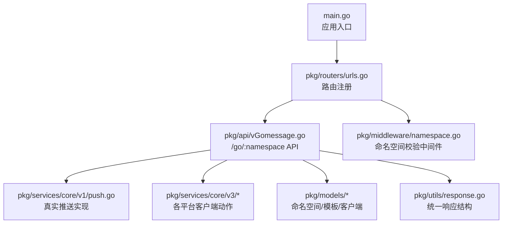
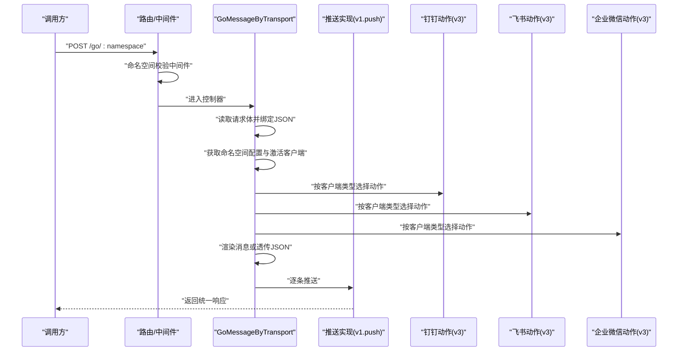
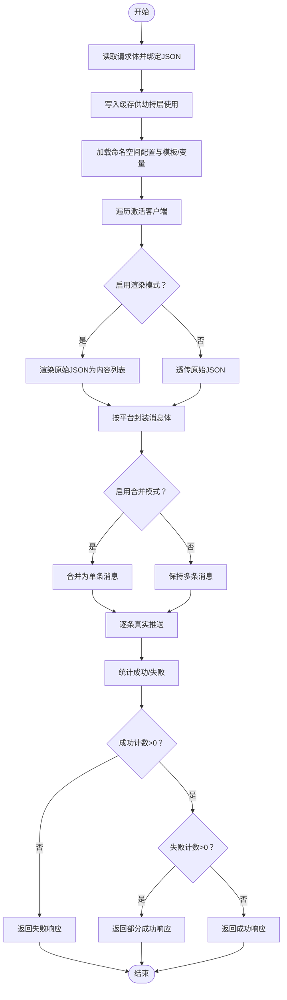
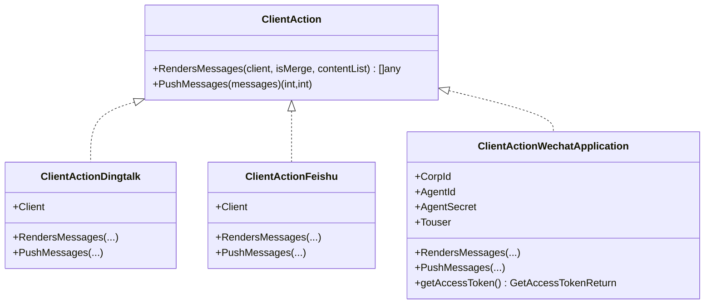
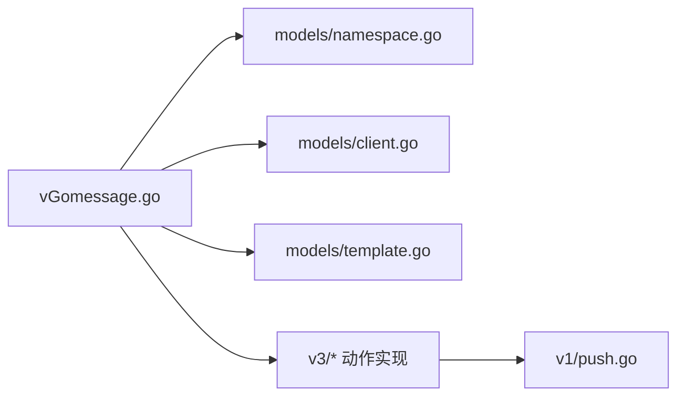

# 消息推送接口

<cite>
**本文引用的文件**
- [main.go](file://main.go)
- [urls.go](file://pkg/routers/urls.go)
- [namespace.go](file://pkg/middleware/namespace.go)
- [vGomessage.go](file://pkg/api/vGomessage.go)
- [push.go](file://pkg/services/core/v1/push.go)
- [dingtalk.go](file://pkg/services/core/v3/dingtalk.go)
- [feishu.go](file://pkg/services/core/v3/feishu.go)
- [wechat.go](file://pkg/services/core/v3/wechat.go)
- [interfaces.go](file://pkg/services/core/v3/interfaces.go)
- [namespace.go](file://pkg/models/namespace.go)
- [client.go](file://pkg/models/client.go)
- [template.go](file://pkg/models/template.go)
- [response.go](file://pkg/utils/response.go)
</cite>

## 目录
1. [简介](#简介)
2. [项目结构](#项目结构)
3. [核心组件](#核心组件)
4. [架构总览](#架构总览)
5. [详细组件分析](#详细组件分析)
6. [依赖分析](#依赖分析)
7. [性能考虑](#性能考虑)
8. [故障排查指南](#故障排查指南)
9. [结论](#结论)
10. [附录](#附录)

## 简介
本文件为消息推送接口的详细 API 文档，聚焦于 /go/:namespace 接口的 GET 与 POST 方法，涵盖以下要点：
- 消息推送核心功能与流程：请求接收、模板解析、客户端选择、消息渲染与最终推送
- 请求参数格式与响应结构
- 错误处理与失败重试策略
- 命名空间作用与配置要求
- 多消息类型示例：文本消息、富文本消息、卡片消息等
- curl 命令示例与多语言客户端调用思路

## 项目结构
消息推送服务基于 Gin 框架构建，路由在统一入口注册，核心逻辑集中在 API 层与服务层，数据模型与配置位于 models 与 utils 包中。

图表来源
- [main.go:37-55](file://main.go#L37-L55)
- [urls.go:21-48](file://pkg/routers/urls.go#L21-L48)
- [vGomessage.go:20-153](file://pkg/api/vGomessage.go#L20-L153)
- [push.go:14-56](file://pkg/services/core/v1/push.go#L14-L56)
- [namespace.go:20-46](file://pkg/middleware/namespace.go#L20-L46)
- [response.go:11-27](file://pkg/utils/response.go#L11-L27)

章节来源
- [main.go:37-55](file://main.go#L37-L55)
- [urls.go:21-48](file://pkg/routers/urls.go#L21-L48)

## 核心组件
- 路由与中间件
  - /go/:namespace 的 GET 与 POST 路由在统一入口注册，并挂载命名空间校验中间件
  - 命名空间校验中间件根据路径动态推导命名空间，若不存在则直接返回 404
- API 控制器
  - POST /go/:namespace：接收 JSON 请求体，读取并绑定请求体，按命名空间配置选择客户端，渲染消息并推送
  - GET /go/:namespace：返回命名空间信息（若为 message 则视为 default）
- 服务层
  - v1.push：负责实际 HTTP 推送，记录日志并返回响应
  - v3.*：各平台客户端动作实现（钉钉、飞书、企业微信应用号、企业微信机器人），包含消息渲染与推送
- 数据模型
  - 命名空间、模板、客户端等模型用于存储配置与状态
- 统一响应
  - 统一响应结构包含 code、msg、result/error、help 字段

章节来源
- [urls.go:42-48](file://pkg/routers/urls.go#L42-L48)
- [namespace.go:20-46](file://pkg/middleware/namespace.go#L20-L46)
- [vGomessage.go:20-153](file://pkg/api/vGomessage.go#L20-L153)
- [push.go:14-56](file://pkg/services/core/v1/push.go#L14-L56)
- [interfaces.go:7-10](file://pkg/services/core/v3/interfaces.go#L7-L10)
- [namespace.go:12-26](file://pkg/models/namespace.go#L12-L26)
- [client.go:13-28](file://pkg/models/client.go#L13-L28)
- [template.go:9-18](file://pkg/models/template.go#L9-L18)
- [response.go:11-27](file://pkg/utils/response.go#L11-L27)

## 架构总览
下图展示 /go/:namespace POST 的端到端流程：请求进入、命名空间校验、请求体解析、模板渲染、客户端选择与推送、响应返回。

图表来源
- [urls.go:42-48](file://pkg/routers/urls.go#L42-L48)
- [namespace.go:20-46](file://pkg/middleware/namespace.go#L20-L46)
- [vGomessage.go:23-153](file://pkg/api/vGomessage.go#L23-L153)
- [push.go:14-56](file://pkg/services/core/v1/push.go#L14-L56)
- [dingtalk.go:14-40](file://pkg/services/core/v3/dingtalk.go#L14-L40)
- [feishu.go:14-39](file://pkg/services/core/v3/feishu.go#L14-L39)
- [wechat.go:55-91](file://pkg/services/core/v3/wechat.go#L55-L91)

## 详细组件分析

### /go/:namespace 接口定义
- 路由与方法
  - GET /go/:namespace：返回命名空间信息；当 namespace 为 message 时视为 default
  - POST /go/:namespace：接收 JSON 请求体，按命名空间配置渲染并推送至各客户端
- 请求头与认证
  - 当前路由未内置鉴权中间件，但 /api/v1 下的路由使用了鉴权中间件；如需鉴权，请参考相应版本路由
- 命名空间作用
  - 命名空间作为“通道”概念，承载模板、变量映射与客户端配置；不同命名空间相互隔离
  - 若未创建目标命名空间，中间件将拦截并返回 404

章节来源
- [urls.go:42-48](file://pkg/routers/urls.go#L42-L48)
- [vGomessage.go:155-171](file://pkg/api/vGomessage.go#L155-L171)
- [namespace.go:20-46](file://pkg/middleware/namespace.go#L20-L46)
- [namespace.go:12-26](file://pkg/models/namespace.go#L12-L26)

### 请求参数与响应结构
- 请求参数
  - POST /go/:namespace：请求体必须为合法 JSON；请求体内容将作为原始消息源数据
  - GET /go/:namespace：路径参数 :namespace 表示命名空间名称
- 响应结构
  - 成功/失败均采用统一响应模板，包含 code、msg、result/error、help 字段
  - code=1 表示成功，code=0 表示失败
- 示例
  - 成功：{"code":1,"msg":"推送完成","result":"ok","help":"..."}
  - 部分失败：{"code":1,"msg":"部分成功：成功X，失败Y","result":"ok","help":"..."}
  - 全部失败：{"code":0,"msg":"推送失败：成功0，失败N","error":"...","help":"..."}

章节来源
- [vGomessage.go:32-42](file://pkg/api/vGomessage.go#L32-L42)
- [response.go:11-27](file://pkg/utils/response.go#L11-L27)

### 消息推送流程详解
- 步骤概览
  1) 请求接收与劫持：读取请求体并回写，绑定为 JSON 结构，同时写入缓存供后续劫持层使用
  2) 命名空间配置：获取命名空间自身配置与用户变量映射、模板
  3) 客户端选择：遍历激活客户端，按类型构造对应动作对象
  4) 模板渲染：若启用渲染模式，将原始 JSON 渲染为多段内容；否则透传原始 JSON
  5) 消息封装：按平台格式封装消息体（支持合并/拆分两种模式）
  6) 推送执行：逐条调用真实推送方法，统计成功/失败数量
  7) 响应返回：根据成功/失败计数返回统一响应
- 关键点
  - 渲染开关：命名空间的渲染开关控制是否对原始 JSON 进行渲染
  - 合并模式：可将多段渲染内容合并为一条消息
  - 平台差异：不同平台的消息体结构与推送方式不同（见下节）

图表来源
- [vGomessage.go:23-153](file://pkg/api/vGomessage.go#L23-L153)

章节来源
- [vGomessage.go:23-153](file://pkg/api/vGomessage.go#L23-L153)

### 客户端动作与消息封装
- 接口契约
  - ClientAction 接口定义两类方法：渲染消息与推送消息
- 实现类
  - 钉钉：按关键字与内容封装消息，支持合并/拆分
  - 飞书：按内容封装消息，支持合并/拆分
  - 企业微信应用号：先获取 access_token，再按 markdown 格式推送
  - 企业微信机器人：按随机机器人 URL 推送
- 推送实现
  - v1.push：序列化消息体并发起 HTTP POST，记录请求/响应日志

图表来源
- [interfaces.go:7-10](file://pkg/services/core/v3/interfaces.go#L7-L10)
- [dingtalk.go:10-40](file://pkg/services/core/v3/dingtalk.go#L10-L40)
- [feishu.go:10-39](file://pkg/services/core/v3/feishu.go#L10-L39)
- [wechat.go:17-91](file://pkg/services/core/v3/wechat.go#L17-L91)

章节来源
- [interfaces.go:7-10](file://pkg/services/core/v3/interfaces.go#L7-L10)
- [dingtalk.go:14-40](file://pkg/services/core/v3/dingtalk.go#L14-L40)
- [feishu.go:14-39](file://pkg/services/core/v3/feishu.go#L14-L39)
- [wechat.go:55-120](file://pkg/services/core/v3/wechat.go#L55-L120)
- [push.go:14-56](file://pkg/services/core/v1/push.go#L14-L56)

### 命名空间与配置
- 命名空间模型
  - 字段：id、name（唯一）、is_active、is_renders、description
  - 作用：作为“通道”，承载模板、变量映射与客户端配置
- 客户端模型
  - 字段：namespace、client_name、client_type、is_active、client_info 及各平台扩展信息
  - 激活客户端：仅对 is_active=true 的客户端进行推送
- 模板模型
  - 字段：namespace、template_name、template_content、template_is_merge
  - 用途：配合变量映射进行消息渲染

章节来源
- [namespace.go:12-26](file://pkg/models/namespace.go#L12-L26)
- [client.go:13-28](file://pkg/models/client.go#L13-L28)
- [template.go:9-18](file://pkg/models/template.go#L9-L18)

### 错误处理与失败重试
- 命名空间不存在：中间件直接返回 404
- 请求体非 JSON：返回 400
- 客户端查询失败/类型错误：计入失败原因并跳过该客户端
- 渲染结果为空：跳过该客户端
- 真实推送失败：计入失败计数，继续处理其他消息
- 响应策略
  - 成功计数为 0：返回失败响应
  - 失败计数大于 0：返回部分成功响应
  - 全部成功：返回成功响应
- 重试策略
  - 当前实现未内置自动重试；建议在调用侧对失败响应进行指数退避重试

章节来源
- [namespace.go:30-44](file://pkg/middleware/namespace.go#L30-L44)
- [vGomessage.go:32-42](file://pkg/api/vGomessage.go#L32-L42)
- [vGomessage.go:67-106](file://pkg/api/vGomessage.go#L67-L106)
- [vGomessage.go:117-134](file://pkg/api/vGomessage.go#L117-L134)
- [push.go:14-56](file://pkg/services/core/v1/push.go#L14-L56)

### curl 命令示例
- 发送 JSON 消息（以默认命名空间为例）
  - curl -X POST "http://localhost:7077/go/default" -H "Content-Type: application/json" -d '{"key":"value"}'
- 获取命名空间信息
  - curl -X GET "http://localhost:7077/go/default"

说明
- 将 localhost:7077 替换为实际服务地址
- 如需鉴权，请在调用 /api/v1 下的路由时携带相应凭证

章节来源
- [urls.go:42-48](file://pkg/routers/urls.go#L42-L48)
- [vGomessage.go:155-171](file://pkg/api/vGomessage.go#L155-L171)

### 多语言客户端实现思路
- Java/Python/Go 等语言均可通过 HTTP 客户端发起 POST 请求
- 构造步骤
  - 准备 JSON 请求体
  - 设置 Content-Type: application/json
  - 发起请求到 /go/:namespace
  - 解析统一响应结构，根据 code 判定成功/失败
- 注意事项
  - 对于失败响应，建议在调用侧实现重试与告警
  - 如需鉴权，请使用 /api/v1 下的受保护路由

章节来源
- [vGomessage.go:23-153](file://pkg/api/vGomessage.go#L23-L153)
- [response.go:11-27](file://pkg/utils/response.go#L11-L27)

### 消息类型与示例
- 文本消息
  - 直接透传 JSON 或渲染为纯文本内容
- 富文本消息
  - 使用渲染模式将结构化数据渲染为富文本片段
- 卡片消息
  - 在渲染阶段生成卡片结构，再由各平台动作封装为对应格式
- 合并/拆分
  - 合并模式：将多段内容合并为一条消息
  - 拆分模式：每段内容独立封装为一条消息

章节来源
- [vGomessage.go:117-129](file://pkg/api/vGomessage.go#L117-L129)
- [dingtalk.go:14-27](file://pkg/services/core/v3/dingtalk.go#L14-L27)
- [feishu.go:14-26](file://pkg/services/core/v3/feishu.go#L14-L26)
- [wechat.go:24-52](file://pkg/services/core/v3/wechat.go#L24-L52)

## 依赖分析
- 组件耦合
  - API 控制器依赖命名空间配置、客户端模型与服务层动作实现
  - 服务层动作实现依赖 v1.push 与格式化模块
- 外部依赖
  - HTTP 推送依赖各平台官方接口（钉钉、飞书、企业微信）
- 潜在风险
  - 平台接口变更可能导致推送失败
  - 客户端配置错误（如 URL、密钥）会导致推送失败

图表来源
- [vGomessage.go:23-153](file://pkg/api/vGomessage.go#L23-L153)
- [namespace.go:12-26](file://pkg/models/namespace.go#L12-L26)
- [client.go:13-28](file://pkg/models/client.go#L13-L28)
- [template.go:9-18](file://pkg/models/template.go#L9-L18)
- [dingtalk.go:14-40](file://pkg/services/core/v3/dingtalk.go#L14-L40)
- [feishu.go:14-39](file://pkg/services/core/v3/feishu.go#L14-L39)
- [wechat.go:55-120](file://pkg/services/core/v3/wechat.go#L55-L120)
- [push.go:14-56](file://pkg/services/core/v1/push.go#L14-L56)

章节来源
- [vGomessage.go:23-153](file://pkg/api/vGomessage.go#L23-L153)

## 性能考虑
- 并发推送
  - 当前实现逐条推送，未并发；如需提升吞吐，可在动作实现中引入并发与限流
- 日志开销
  - 推送日志包含请求/响应体，生产环境建议降低日志级别或采样
- 渲染成本
  - 渲染复杂模板可能带来 CPU 开销，建议缓存常用模板与变量映射

## 故障排查指南
- 常见错误与定位
  - 404 命名空间不存在：检查命名空间是否创建
  - 400 请求体非 JSON：确认 Content-Type 与请求体格式
  - 全部失败：查看失败原因列表，逐一修复客户端配置
- 日志定位
  - 推送日志包含 URL、请求体、响应体与状态码，便于快速定位问题
- 建议流程
  - 先验证 /go/:namespace GET 返回正常
  - 使用最小化 JSON 进行测试
  - 查看服务端日志中的推送记录

章节来源
- [namespace.go:30-44](file://pkg/middleware/namespace.go#L30-L44)
- [vGomessage.go:32-42](file://pkg/api/vGomessage.go#L32-L42)
- [vGomessage.go:143-152](file://pkg/api/vGomessage.go#L143-L152)
- [push.go:44-51](file://pkg/services/core/v1/push.go#L44-L51)

## 结论
- /go/:namespace 接口提供了灵活的消息推送能力，支持多种平台与消息类型
- 通过命名空间与模板/变量映射，可实现高度定制化的消息渲染
- 建议在调用侧实现重试与监控，确保推送可靠性

## 附录
- 统一响应字段说明
  - code：1 成功，0 失败
  - msg：描述信息
  - result：成功时返回结果
  - error：失败时返回错误
  - help：帮助链接

章节来源
- [response.go:11-27](file://pkg/utils/response.go#L11-L27)