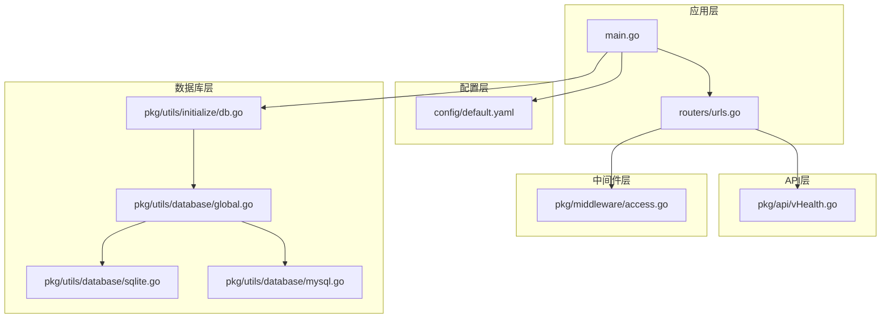
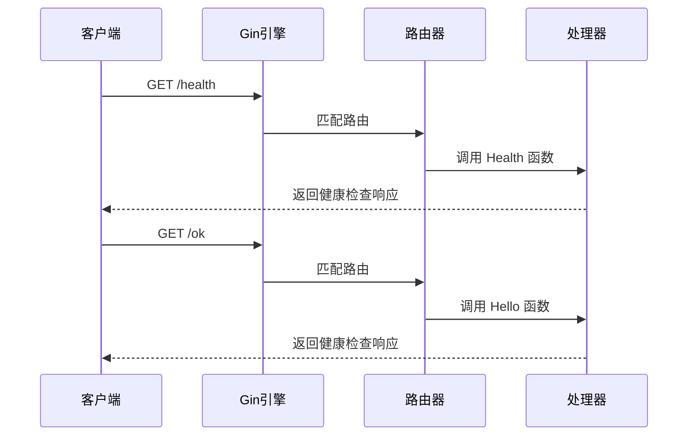
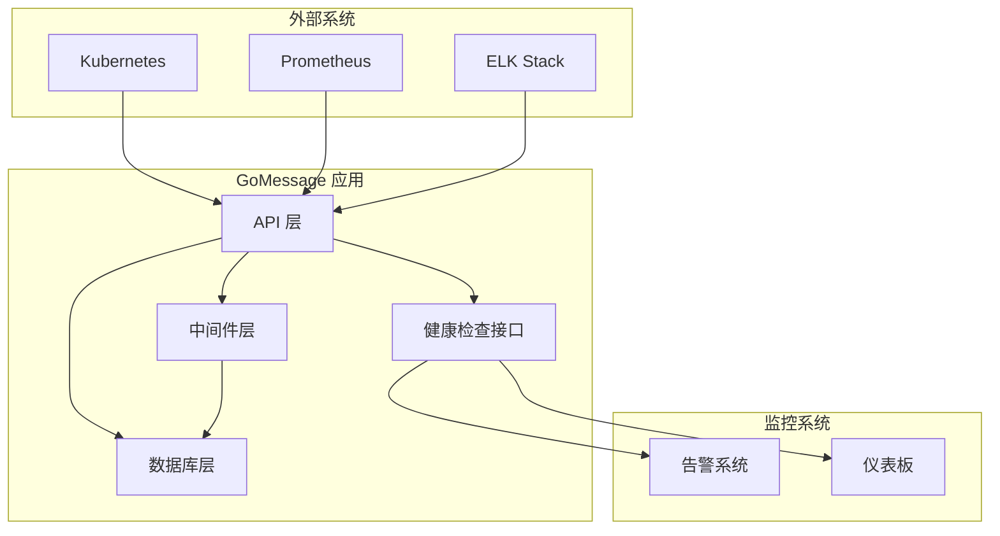
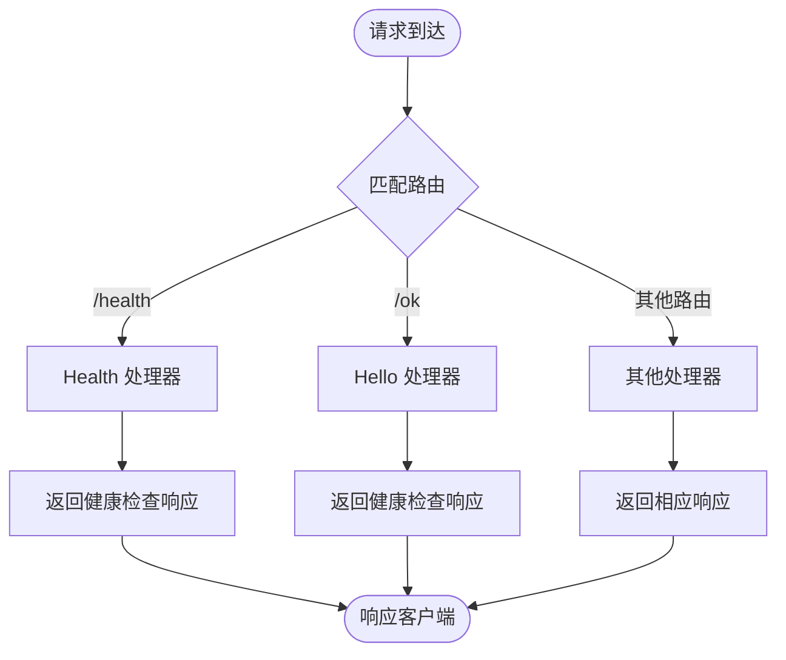
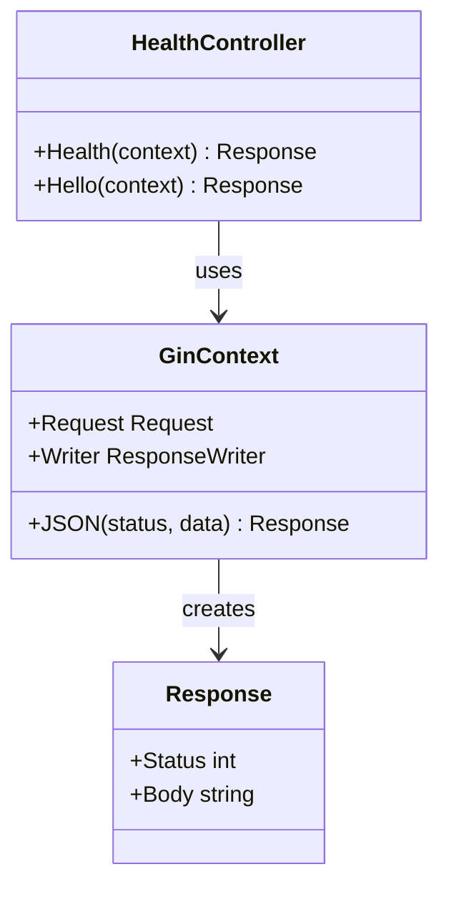
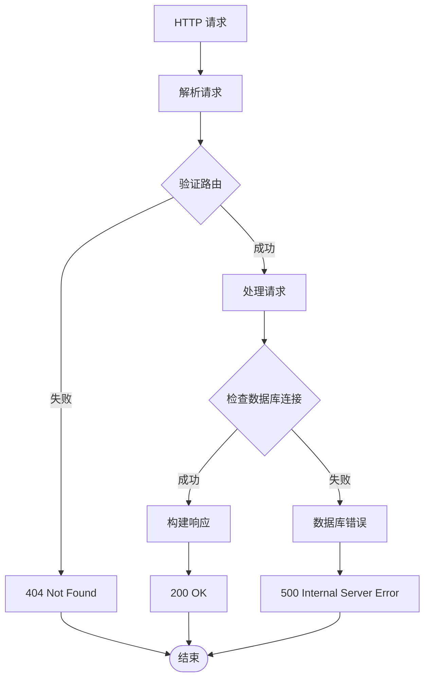
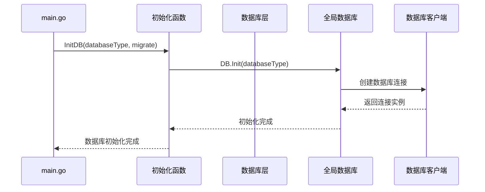
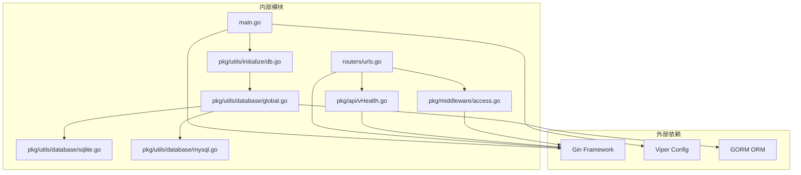
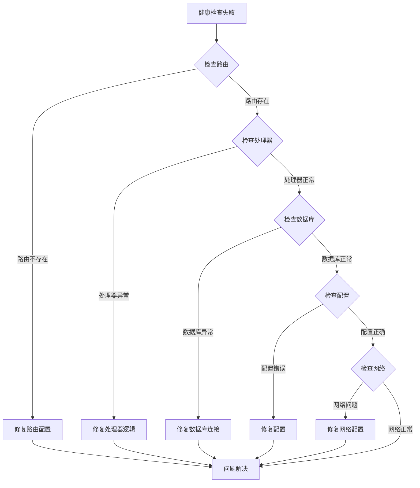
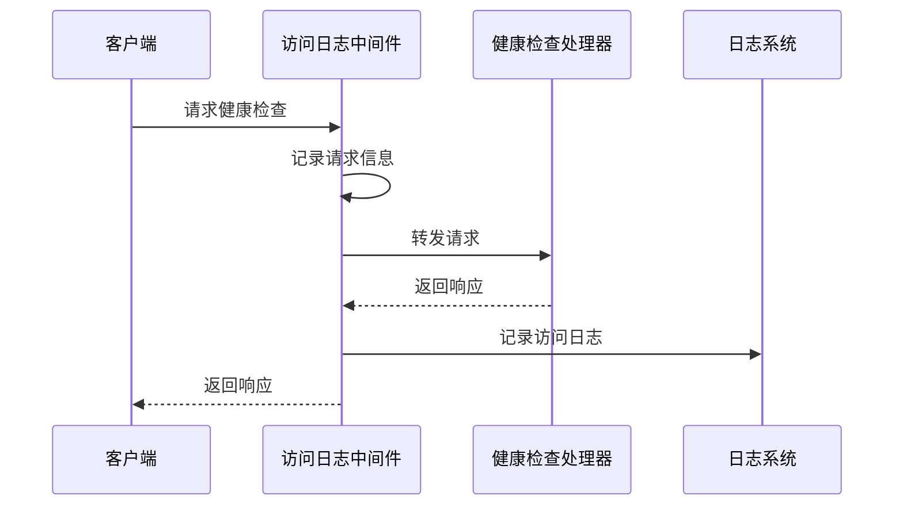

# 系统健康检查接口

<cite>
**本文档引用的文件**
- [vHealth.go](file://pkg/api/vHealth.go)
- [urls.go](file://pkg/routers/urls.go)
- [main.go](file://main.go)
- [default.yaml](file://config/default.yaml)
- [db.go](file://pkg/utils/initialize/db.go)
- [global.go](file://pkg/utils/database/global.go)
- [sqlite.go](file://pkg/utils/database/sqlite.go)
- [mysql.go](file://pkg/utils/database/mysql.go)
- [access.go](file://pkg/middleware/access.go)
- [Deployment.yaml](file://docker/Deployment.yaml)
- [values.yaml](file://docker/helm/values.yaml)
- [swagger.json](file://assets/docs/swagger.json)
- [swagger.yaml](file://assets/docs/swagger.yaml)
</cite>

## 目录
1. [简介](#简介)
2. [项目结构](#项目结构)
3. [核心组件](#核心组件)
4. [架构概览](#架构概览)
5. [详细组件分析](#详细组件分析)
6. [依赖关系分析](#依赖关系分析)
7. [性能考虑](#性能考虑)
8. [故障排查指南](#故障排查指南)
9. [结论](#结论)

## 简介

GoMessage 系统提供了两个健康检查接口：`/ok` 和 `/health`，用于监控系统的运行状态。这两个接口都返回统一的健康检查响应，表明系统监控正常。本文档将详细介绍这两个接口的用途、响应格式、集成方式以及在监控和运维中的应用场景。

## 项目结构

GoMessage 采用分层架构设计，健康检查功能位于 API 层，通过 Gin 框架实现：

**图表来源**
- [main.go:1-56](file://main.go#L1-L56)
- [urls.go:1-109](file://pkg/routers/urls.go#L1-L109)
- [vHealth.go:1-27](file://pkg/api/vHealth.go#L1-L27)

**章节来源**
- [main.go:1-56](file://main.go#L1-L56)
- [urls.go:1-109](file://pkg/routers/urls.go#L1-L109)

## 核心组件

### 健康检查接口实现

系统提供了两个功能相同的健康检查接口：

#### /health 接口
- **路由**: `/health`
- **方法**: GET
- **用途**: 全局健康检测
- **响应**: JSON 格式，内容为 "Health monitoring is normal"

#### /ok 接口  
- **路由**: `/ok`
- **方法**: GET
- **用途**: 命名空间健康检测
- **响应**: JSON 格式，内容为 "Health monitoring is normal"

### 路由配置

健康检查接口在路由配置中定义：

**图表来源**
- [urls.go:30-32](file://pkg/routers/urls.go#L30-L32)
- [vHealth.go:12-26](file://pkg/api/vHealth.go#L12-L26)

**章节来源**
- [vHealth.go:8-26](file://pkg/api/vHealth.go#L8-L26)
- [urls.go:30-32](file://pkg/routers/urls.go#L30-L32)

## 架构概览

### 系统架构图

**图表来源**
- [main.go:37-55](file://main.go#L37-L55)
- [access.go:23-71](file://pkg/middleware/access.go#L23-L71)

### 数据流图

**图表来源**
- [urls.go:30-32](file://pkg/routers/urls.go#L30-L32)
- [vHealth.go:12-26](file://pkg/api/vHealth.go#L12-L26)

## 详细组件分析

### 健康检查接口实现

#### 接口定义

**图表来源**
- [vHealth.go:12-26](file://pkg/api/vHealth.go#L12-L26)

#### 响应格式

两个健康检查接口都返回相同的 JSON 响应格式：

| 字段 | 类型 | 描述 | 示例值 |
|------|------|------|--------|
| 响应体 | string | 健康检查状态消息 | "Health monitoring is normal" |
| 状态码 | integer | HTTP 状态码 | 200 |

#### 错误处理流程

**图表来源**
- [vHealth.go:12-26](file://pkg/api/vHealth.go#L12-L26)
- [db.go:12-19](file://pkg/utils/initialize/db.go#L12-L19)

**章节来源**
- [vHealth.go:12-26](file://pkg/api/vHealth.go#L12-L26)

### 数据库连接状态检查

虽然当前健康检查接口返回固定响应，但系统具备完整的数据库连接管理能力：

#### 数据库初始化流程

**图表来源**
- [db.go:12-19](file://pkg/utils/initialize/db.go#L12-L19)
- [global.go:14-35](file://pkg/utils/database/global.go#L14-L35)

#### 支持的数据库类型

系统支持两种数据库类型：

| 数据库类型 | 配置项 | 特点 |
|------------|--------|------|
| SQLite3 | `sqlite3` | 轻量级，适合存储元数据 |
| MySQL | `mysql` | 企业级数据库，支持高并发 |

**章节来源**
- [db.go:12-19](file://pkg/utils/initialize/db.go#L12-L19)
- [global.go:14-35](file://pkg/utils/database/global.go#L14-L35)

### 中间件集成

健康检查接口通过中间件层进行处理：

#### 访问日志中间件

**图表来源**
- [access.go:23-71](file://pkg/middleware/access.go#L23-L71)

**章节来源**
- [access.go:23-71](file://pkg/middleware/access.go#L23-L71)

## 依赖关系分析

### 组件依赖图

**图表来源**
- [main.go:3-11](file://main.go#L3-L11)
- [urls.go:3-13](file://pkg/routers/urls.go#L3-L13)

### 关键依赖关系

1. **路由依赖**: 路由器依赖 Gin 框架进行 HTTP 请求处理
2. **配置依赖**: 主程序依赖 Viper 进行配置管理
3. **数据库依赖**: 数据库层依赖 GORM 进行 ORM 操作
4. **中间件依赖**: 中间件层依赖 Gin 提供的中间件机制

**章节来源**
- [main.go:3-11](file://main.go#L3-L11)
- [urls.go:3-13](file://pkg/routers/urls.go#L3-L13)

## 性能考虑

### 健康检查性能特征

1. **响应时间**: 健康检查接口为轻量级操作，响应时间极短
2. **资源消耗**: 不涉及数据库查询，内存和 CPU 占用极低
3. **并发处理**: 支持高并发请求，无状态设计

### 监控指标建议

基于当前实现，建议扩展的监控指标：

| 指标类型 | 指标名称 | 描述 | 建议阈值 |
|----------|----------|------|----------|
| 响应时间 | health_check_duration | 健康检查响应时间 | < 100ms |
| 错误率 | health_check_error_rate | 健康检查错误率 | < 1% |
| 状态码 | health_check_status_code | 健康检查状态码分布 | 200: 100% |
| 数据库连接 | db_connection_status | 数据库连接状态 | 正常: 100% |

## 故障排查指南

### 常见问题诊断

#### 健康检查失败排查

#### 数据库连接问题排查

1. **检查数据库配置**
   - 验证数据库类型配置
   - 检查数据库连接参数
   - 确认数据库服务可用性

2. **验证连接池设置**
   - 检查最大连接数配置
   - 验证连接超时设置
   - 监控连接池使用情况

**章节来源**
- [sqlite.go:18-47](file://pkg/utils/database/sqlite.go#L18-L47)
- [mysql.go:25-52](file://pkg/utils/database/mysql.go#L25-L52)

### 日志分析

健康检查接口通过访问日志中间件进行记录，可用于故障排查：

**图表来源**
- [access.go:23-71](file://pkg/middleware/access.go#L23-L71)

## 结论

GoMessage 系统的健康检查接口提供了简单而有效的系统监控能力。当前实现虽然返回固定响应，但具备良好的扩展性，可以轻松集成数据库连接状态检查、外部服务可用性检测等功能。

### 主要特点

1. **简单易用**: 两个接口提供相同功能，便于集成和测试
2. **高性能**: 无状态设计，响应速度快
3. **可扩展**: 基于 Gin 框架，易于添加新的检查逻辑
4. **监控友好**: 标准化的响应格式，便于监控系统集成

### 建议改进

1. **增强检查内容**: 添加数据库连接状态、外部服务可用性检查
2. **指标收集**: 集成 Prometheus 指标收集
3. **告警集成**: 与现有告警系统深度集成
4. **健康检查分级**: 提供不同级别的健康检查选项

通过这些改进，GoMessage 的健康检查接口将成为一个完整的系统监控解决方案的重要组成部分。