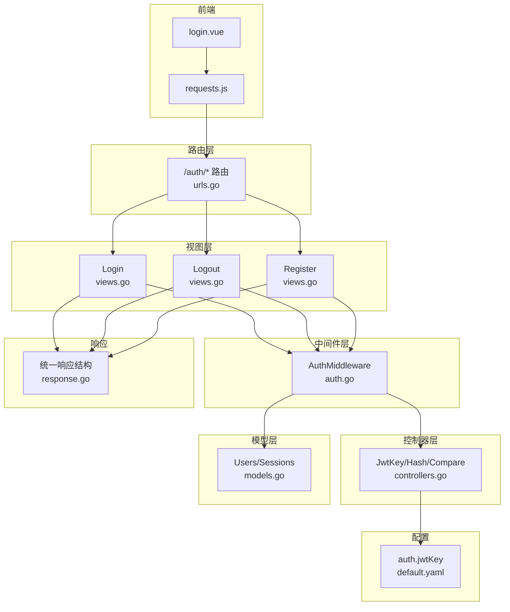
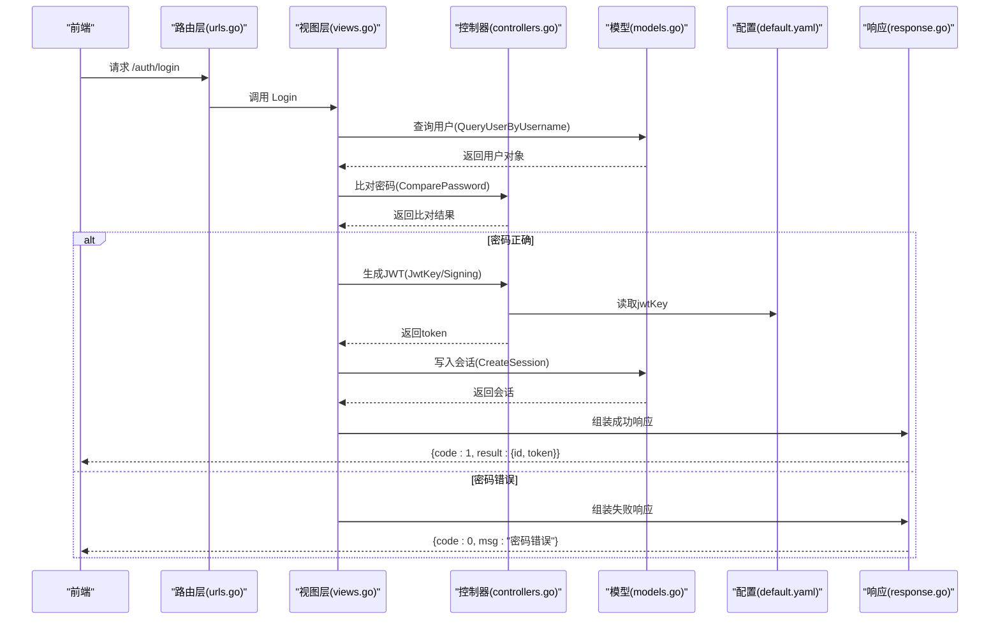
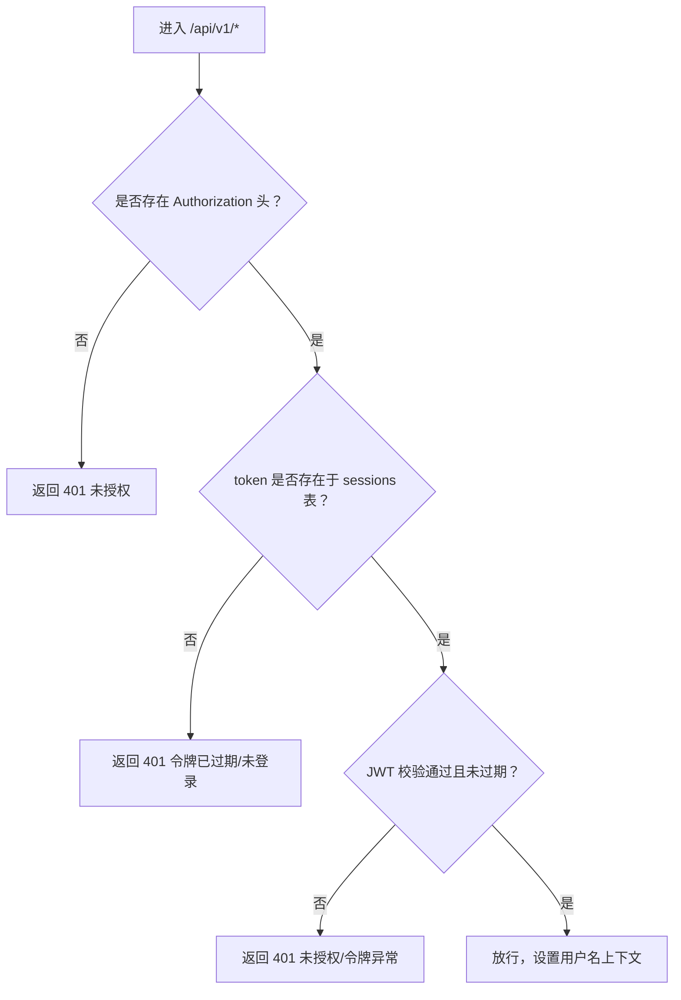
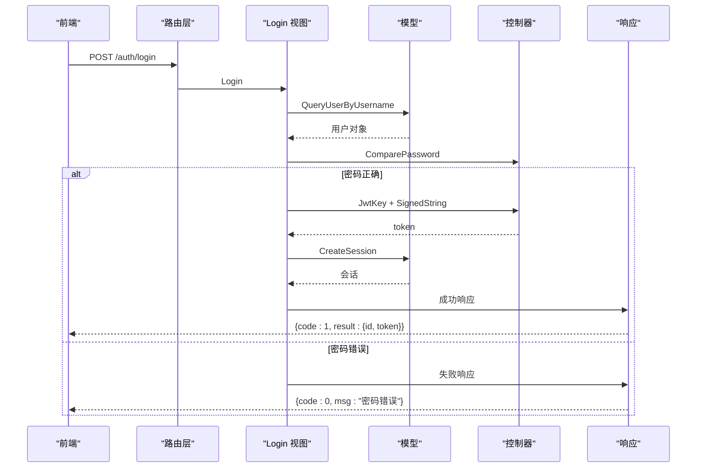
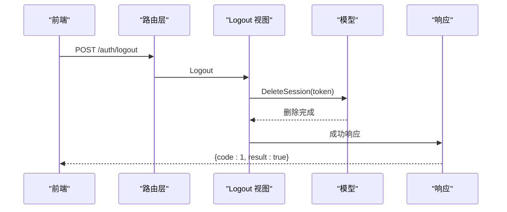
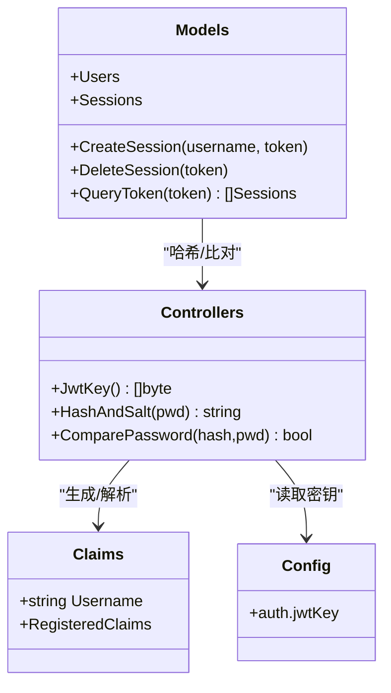
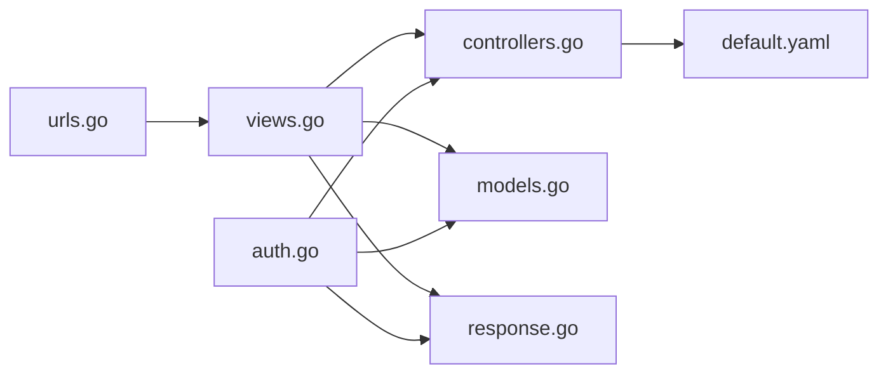

# 认证接口

<cite>
**本文引用的文件列表**
- [pkg/routers/urls.go](file://pkg/routers/urls.go)
- [pkg/middleware/auth.go](file://pkg/middleware/auth.go)
- [pkg/authorization/views.go](file://pkg/authorization/views.go)
- [pkg/authorization/controllers.go](file://pkg/authorization/controllers.go)
- [pkg/authorization/models.go](file://pkg/authorization/models.go)
- [config/default.yaml](file://config/default.yaml)
- [pkg/utils/response.go](file://pkg/utils/response.go)
- [vue/src/service/requests.js](file://vue/src/service/requests.js)
- [vue/src/views/login.vue](file://vue/src/views/login.vue)
</cite>

## 目录
1. [简介](#简介)
2. [项目结构](#项目结构)
3. [核心组件](#核心组件)
4. [架构总览](#架构总览)
5. [详细组件分析](#详细组件分析)
6. [依赖关系分析](#依赖关系分析)
7. [性能考量](#性能考量)
8. [故障排查指南](#故障排查指南)
9. [结论](#结论)
10. [附录](#附录)

## 简介
本文件面向认证接口的使用者与维护者，系统性梳理 /auth/ 前缀下的认证能力，覆盖登录、注销、注册三大接口；深入解析基于 JWT 的认证流程、token 生成与验证机制、密码加密存储策略以及会话管理；提供从“注册 -> 登录获取 token -> 使用 token 访问受保护资源”的完整流程示例；说明认证中间件的工作原理与安全要点，并给出常见错误与异常的处理建议。

## 项目结构
认证相关代码主要分布在如下模块：
- 路由层：定义 /auth/* 接口与中间件挂载点
- 中间件层：实现鉴权中间件，拦截并校验请求头中的 Authorization
- 控制器层：封装 JWT 密钥、密码哈希与比对等通用逻辑
- 视图层：实现注册、登录、注销的具体业务逻辑
- 模型层：用户与会话数据模型及持久化操作
- 配置：JWT 密钥等安全配置项
- 响应：统一的响应体结构
- 前端：登录页与请求封装，演示如何调用认证接口

图表来源
- [pkg/routers/urls.go:50-53](file://pkg/routers/urls.go#L50-L53)
- [pkg/middleware/auth.go:12-61](file://pkg/middleware/auth.go#L12-L61)
- [pkg/authorization/views.go:12-88](file://pkg/authorization/views.go#L12-L88)
- [pkg/authorization/controllers.go:10-40](file://pkg/authorization/controllers.go#L10-L40)
- [pkg/authorization/models.go:99-134](file://pkg/authorization/models.go#L99-L134)
- [config/default.yaml:11-13](file://config/default.yaml#L11-L13)
- [pkg/utils/response.go:11-27](file://pkg/utils/response.go#L11-L27)
- [vue/src/service/requests.js:39-41](file://vue/src/service/requests.js#L39-L41)
- [vue/src/views/login.vue:50-62](file://vue/src/views/login.vue#L50-L62)

章节来源
- [pkg/routers/urls.go:50-53](file://pkg/routers/urls.go#L50-L53)
- [pkg/middleware/auth.go:12-61](file://pkg/middleware/auth.go#L12-L61)
- [pkg/authorization/views.go:12-88](file://pkg/authorization/views.go#L12-L88)
- [pkg/authorization/controllers.go:10-40](file://pkg/authorization/controllers.go#L10-L40)
- [pkg/authorization/models.go:99-134](file://pkg/authorization/models.go#L99-L134)
- [config/default.yaml:11-13](file://config/default.yaml#L11-L13)
- [pkg/utils/response.go:11-27](file://pkg/utils/response.go#L11-L27)
- [vue/src/service/requests.js:39-41](file://vue/src/service/requests.js#L39-L41)
- [vue/src/views/login.vue:50-62](file://vue/src/views/login.vue#L50-L62)

## 核心组件
- 路由绑定：/auth/login、/auth/logout、/auth/register 在路由层完成绑定
- 认证中间件：AuthMiddleware 统一拦截 /api/v1 下受保护资源，校验 Authorization 头与 token 有效性
- 视图控制器：实现注册、登录、注销的业务逻辑
- 控制器工具：提供 JWT 密钥读取、密码哈希与比对
- 模型与会话：Users 表与 sessions 表用于用户与会话持久化
- 响应规范：统一的响应体结构，便于前后端一致处理

章节来源
- [pkg/routers/urls.go:50-53](file://pkg/routers/urls.go#L50-L53)
- [pkg/middleware/auth.go:12-61](file://pkg/middleware/auth.go#L12-L61)
- [pkg/authorization/views.go:12-88](file://pkg/authorization/views.go#L12-L88)
- [pkg/authorization/controllers.go:10-40](file://pkg/authorization/controllers.go#L10-L40)
- [pkg/authorization/models.go:99-134](file://pkg/authorization/models.go#L99-L134)
- [pkg/utils/response.go:11-27](file://pkg/utils/response.go#L11-L27)

## 架构总览
认证接口采用“路由 -> 视图 -> 控制器/模型 -> 响应”的分层架构；JWT 作为无状态认证载体，配合 sessions 表实现“注销即失效”的会话管理。

图表来源
- [pkg/routers/urls.go:50-53](file://pkg/routers/urls.go#L50-L53)
- [pkg/authorization/views.go:31-72](file://pkg/authorization/views.go#L31-L72)
- [pkg/authorization/controllers.go:10-40](file://pkg/authorization/controllers.go#L10-L40)
- [pkg/authorization/models.go:73-77](file://pkg/authorization/models.go#L73-L77)
- [pkg/authorization/models.go:112-119](file://pkg/authorization/models.go#L112-L119)
- [config/default.yaml:11-13](file://config/default.yaml#L11-L13)
- [pkg/utils/response.go:11-27](file://pkg/utils/response.go#L11-L27)

## 详细组件分析

### 路由与中间件
- /auth/* 路由绑定：在路由层将 /auth/login、/auth/logout、/auth/register 映射到对应视图函数
- 受保护资源中间件：在 /api/v1 分组下挂载 AuthMiddleware，拦截请求头 Authorization 并校验 token

图表来源
- [pkg/middleware/auth.go:12-61](file://pkg/middleware/auth.go#L12-L61)
- [pkg/authorization/models.go:130-134](file://pkg/authorization/models.go#L130-L134)

章节来源
- [pkg/routers/urls.go:50-53](file://pkg/routers/urls.go#L50-L53)
- [pkg/middleware/auth.go:12-61](file://pkg/middleware/auth.go#L12-L61)

### 登录接口 /auth/login
- 请求方法：POST
- 请求体：包含用户名与密码
- 校验流程：
  - 反序列化请求体
  - 查询用户并比对密码
  - 生成 JWT，设置过期时间（示例为 60 分钟）
  - 将 token 写入 sessions 表
  - 返回用户 id 与 token
- 错误处理：
  - 请求体错误：返回 400
  - 用户不存在：返回 401
  - 密码错误：返回 401
  - 服务器内部错误：返回 500

图表来源
- [pkg/authorization/views.go:31-72](file://pkg/authorization/views.go#L31-L72)
- [pkg/authorization/controllers.go:10-40](file://pkg/authorization/controllers.go#L10-L40)
- [pkg/authorization/models.go:73-77](file://pkg/authorization/models.go#L73-L77)
- [pkg/authorization/models.go:112-119](file://pkg/authorization/models.go#L112-L119)
- [pkg/utils/response.go:11-27](file://pkg/utils/response.go#L11-L27)

章节来源
- [pkg/authorization/views.go:31-72](file://pkg/authorization/views.go#L31-L72)
- [pkg/authorization/controllers.go:10-40](file://pkg/authorization/controllers.go#L10-L40)
- [pkg/authorization/models.go:73-77](file://pkg/authorization/models.go#L73-L77)
- [pkg/authorization/models.go:112-119](file://pkg/authorization/models.go#L112-L119)
- [pkg/utils/response.go:11-27](file://pkg/utils/response.go#L11-L27)

### 注销接口 /auth/logout
- 请求方法：POST
- 请求头：Authorization（token）
- 处理流程：
  - 从 Authorization 头提取 token
  - 若 token 非空，则删除 sessions 表中对应的记录
  - 返回成功响应
- 安全注意：前端可能传空字符串，后端已做判空处理，避免误删

图表来源
- [pkg/authorization/views.go:74-88](file://pkg/authorization/views.go#L74-L88)
- [pkg/authorization/models.go:121-128](file://pkg/authorization/models.go#L121-L128)
- [pkg/utils/response.go:11-27](file://pkg/utils/response.go#L11-L27)

章节来源
- [pkg/authorization/views.go:74-88](file://pkg/authorization/views.go#L74-L88)
- [pkg/authorization/models.go:121-128](file://pkg/authorization/models.go#L121-L128)
- [pkg/utils/response.go:11-27](file://pkg/utils/response.go#L11-L27)

### 注册接口 /auth/register
- 请求方法：POST
- 请求体：包含用户名、昵称、邮箱、手机号、描述等（密码以明文传入，后端自动哈希）
- 处理流程：
  - 反序列化请求体
  - 对密码进行哈希处理
  - 写入用户表
  - 返回成功响应
- 错误处理：
  - 请求体错误：返回 400
  - 数据入库错误：返回 400

章节来源
- [pkg/authorization/views.go:12-29](file://pkg/authorization/views.go#L12-L29)
- [pkg/authorization/controllers.go:24-30](file://pkg/authorization/controllers.go#L24-L30)
- [pkg/authorization/models.go:28-31](file://pkg/authorization/models.go#L28-L31)
- [pkg/utils/response.go:11-27](file://pkg/utils/response.go#L11-L27)

### JWT 认证流程与会话管理
- JWT 生成：
  - 使用 HS256 签名算法
  - Claims 包含用户名与过期时间
  - 密钥来自配置项 auth.jwtKey
- JWT 验证：
  - 中间件解析并校验签名方法
  - 校验签名与过期时间
  - 通过后将用户名注入上下文供后续使用
- 会话管理：
  - 登录成功写入 sessions 表
  - 注销删除 sessions 表记录
  - 中间件检查 token 是否存在于 sessions 表，实现“注销即失效”

图表来源
- [pkg/authorization/controllers.go:10-40](file://pkg/authorization/controllers.go#L10-L40)
- [pkg/authorization/models.go:99-134](file://pkg/authorization/models.go#L99-L134)
- [config/default.yaml:11-13](file://config/default.yaml#L11-L13)

章节来源
- [pkg/authorization/controllers.go:10-40](file://pkg/authorization/controllers.go#L10-L40)
- [pkg/authorization/models.go:99-134](file://pkg/authorization/models.go#L99-L134)
- [config/default.yaml:11-13](file://config/default.yaml#L11-L13)

### 前端调用示例
- 登录页通过请求封装调用 /auth/login，成功后将 token 与用户 id 存入本地状态并跳转主页面
- 注销通过 /auth/logout 清除会话

章节来源
- [vue/src/service/requests.js:39-41](file://vue/src/service/requests.js#L39-L41)
- [vue/src/views/login.vue:50-62](file://vue/src/views/login.vue#L50-L62)

## 依赖关系分析
- 路由层依赖视图层函数
- 视图层依赖控制器工具与模型层
- 中间件依赖控制器工具与模型层
- 控制器依赖配置中心
- 响应层被视图层与中间件共同使用

图表来源
- [pkg/routers/urls.go:50-53](file://pkg/routers/urls.go#L50-L53)
- [pkg/authorization/views.go:12-88](file://pkg/authorization/views.go#L12-L88)
- [pkg/authorization/controllers.go:10-40](file://pkg/authorization/controllers.go#L10-L40)
- [pkg/authorization/models.go:99-134](file://pkg/authorization/models.go#L99-L134)
- [pkg/middleware/auth.go:12-61](file://pkg/middleware/auth.go#L12-L61)
- [config/default.yaml:11-13](file://config/default.yaml#L11-L13)
- [pkg/utils/response.go:11-27](file://pkg/utils/response.go#L11-L27)

章节来源
- [pkg/routers/urls.go:50-53](file://pkg/routers/urls.go#L50-L53)
- [pkg/authorization/views.go:12-88](file://pkg/authorization/views.go#L12-L88)
- [pkg/authorization/controllers.go:10-40](file://pkg/authorization/controllers.go#L10-L40)
- [pkg/authorization/models.go:99-134](file://pkg/authorization/models.go#L99-L134)
- [pkg/middleware/auth.go:12-61](file://pkg/middleware/auth.go#L12-L61)
- [config/default.yaml:11-13](file://config/default.yaml#L11-L13)
- [pkg/utils/response.go:11-27](file://pkg/utils/response.go#L11-L27)

## 性能考量
- JWT 解析与签名验证开销极低，适合高并发场景
- sessions 表查询为单字段等值查询，索引命中良好
- 建议：
  - 合理设置 token 过期时间，平衡安全性与用户体验
  - 对频繁注销场景，可考虑定期清理过期 sessions 记录
  - 前端缓存 token 时注意安全存储，避免 XSS/CRLF 攻击

## 故障排查指南
- 400 请求体错误
  - 检查请求体字段是否符合预期
  - 章节来源: [pkg/authorization/views.go:15-19](file://pkg/authorization/views.go#L15-L19)
- 401 未授权/令牌异常
  - 确认 Authorization 请求头是否正确传递
  - 确认 jwtKey 配置是否与签发端一致
  - 章节来源: [pkg/middleware/auth.go:18-25](file://pkg/middleware/auth.go#L18-L25), [config/default.yaml:11-13](file://config/default.yaml#L11-L13)
- 401 密码错误/账号不存在
  - 章节来源: [pkg/authorization/views.go:40-44](file://pkg/authorization/views.go#L40-L44), [pkg/authorization/views.go:68-71](file://pkg/authorization/views.go#L68-L71)
- 500 服务器内部错误
  - 章节来源: [pkg/authorization/views.go:56-59](file://pkg/authorization/views.go#L56-L59)
- 注销无效
  - 确认前端是否正确传递 token
  - 章节来源: [pkg/authorization/views.go:75-85](file://pkg/authorization/views.go#L75-L85), [pkg/authorization/models.go:121-128](file://pkg/authorization/models.go#L121-L128)

## 结论
本认证体系以 JWT 为核心，结合 sessions 表实现“注销即失效”的会话控制；通过统一的响应结构与中间件拦截，确保受保护资源的安全访问。建议在生产环境中务必更换默认 jwtKey，并根据业务需求调整 token 过期策略与前端 token 存储方案。

## 附录

### 接口一览
- POST /auth/login
  - 请求体：用户名、密码
  - 响应：用户 id 与 token
  - 章节来源: [pkg/authorization/views.go:31-72](file://pkg/authorization/views.go#L31-L72)
- POST /auth/logout
  - 请求头：Authorization
  - 响应：布尔值表示成功
  - 章节来源: [pkg/authorization/views.go:74-88](file://pkg/authorization/views.go#L74-L88)
- POST /auth/register
  - 请求体：用户名、昵称、邮箱、手机号、描述、密码
  - 响应：新建用户信息
  - 章节来源: [pkg/authorization/views.go:12-29](file://pkg/authorization/views.go#L12-L29)

### 完整认证流程示例
- 注册
  - 调用 /auth/register 提交用户信息，后端自动哈希密码并入库
  - 章节来源: [pkg/authorization/views.go:12-29](file://pkg/authorization/views.go#L12-L29), [pkg/authorization/models.go:28-31](file://pkg/authorization/models.go#L28-L31)
- 登录获取 token
  - 调用 /auth/login，后端生成 JWT 并写入 sessions 表
  - 章节来源: [pkg/authorization/views.go:31-72](file://pkg/authorization/views.go#L31-L72), [pkg/authorization/models.go:112-119](file://pkg/authorization/models.go#L112-L119)
- 使用 token 访问受保护资源
  - 在请求头 Authorization 中携带 token，中间件校验通过后放行
  - 章节来源: [pkg/middleware/auth.go:12-61](file://pkg/middleware/auth.go#L12-L61), [pkg/routers/urls.go:58-90](file://pkg/routers/urls.go#L58-L90)