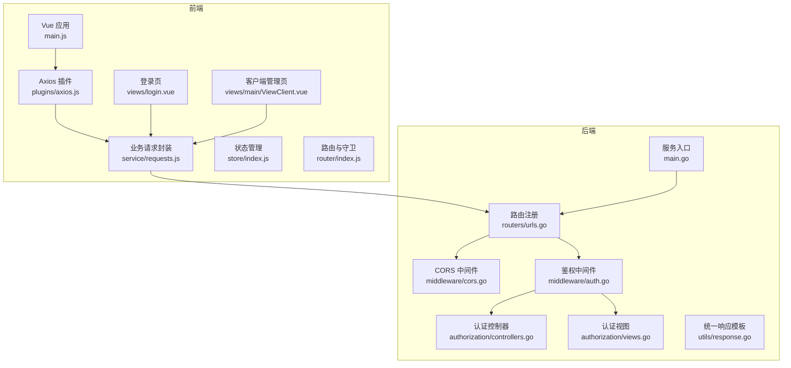
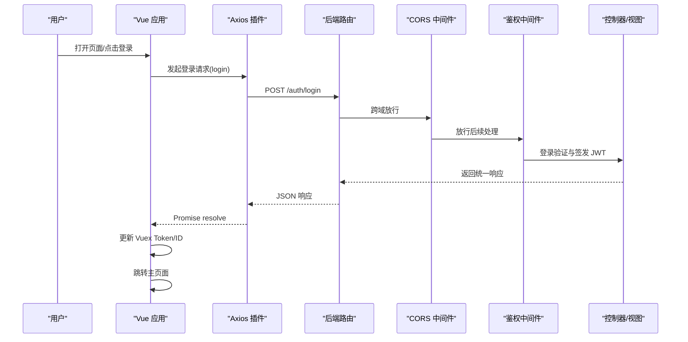
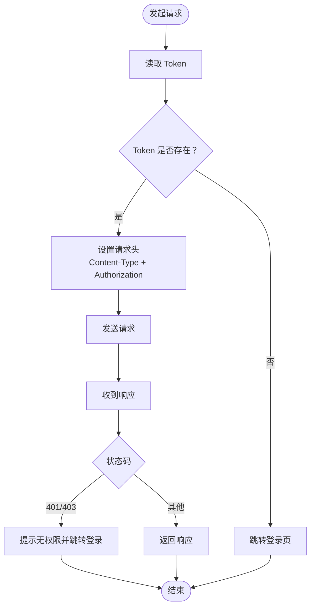
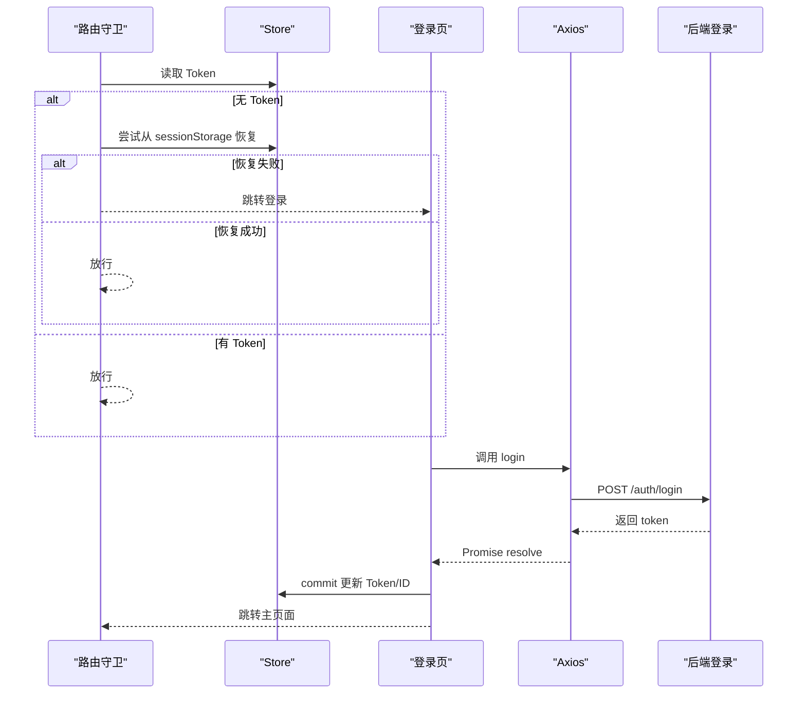
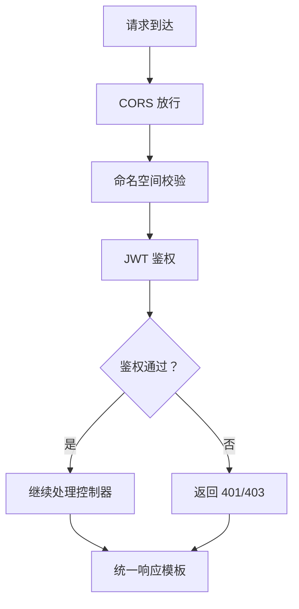
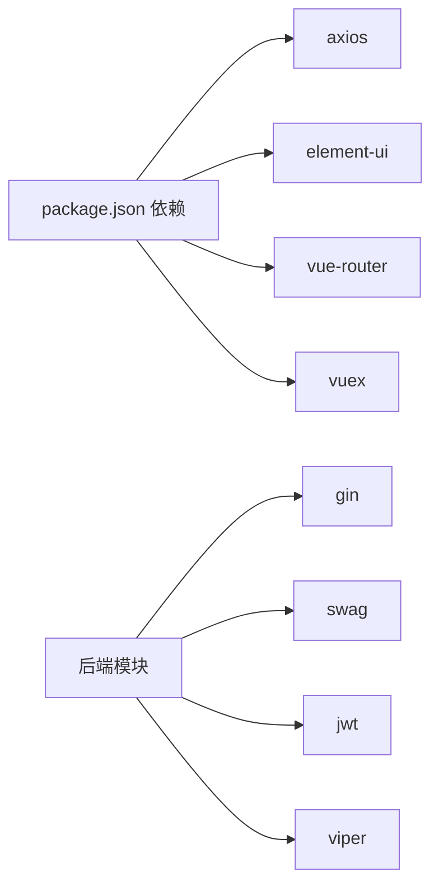

# API 接口集成

<cite>
**本文引用的文件**
- [axios.js](file://vue/src/plugins/axios.js)
- [requests.js](file://vue/src/service/requests.js)
- [index.js](file://vue/src/store/index.js)
- [main.js](file://vue/src/main.js)
- [login.vue](file://vue/src/views/login.vue)
- [ViewClient.vue](file://vue/src/views/main/ViewClient.vue)
- [index.js](file://vue/src/router/index.js)
- [urls.go](file://pkg/routers/urls.go)
- [cors.go](file://pkg/middleware/cors.go)
- [auth.go](file://pkg/middleware/auth.go)
- [controllers.go](file://pkg/authorization/controllers.go)
- [views.go](file://pkg/authorization/views.go)
- [response.go](file://pkg/utils/response.go)
- [main.go](file://main.go)
- [package.json](file://vue/package.json)
</cite>

## 目录
1. [简介](#简介)
2. [项目结构](#项目结构)
3. [核心组件](#核心组件)
4. [架构总览](#架构总览)
5. [详细组件分析](#详细组件分析)
6. [依赖分析](#依赖分析)
7. [性能考量](#性能考量)
8. [故障排查指南](#故障排查指南)
9. [结论](#结论)
10. [附录](#附录)

## 简介
本文件面向前端与后端 API 的集成，系统性阐述以下主题：
- HTTP 请求封装与配置：Axios 实例、拦截器、超时、错误处理
- API 接口调用方式与数据格式：GET、POST、PUT、DELETE 的统一封装与使用
- 状态管理与缓存策略：Vuex Store 的设计与使用
- API 调试与测试：Mock 数据与接口联调技巧
- 认证令牌管理与自动刷新：JWT 登录、鉴权中间件与路由守卫
- 跨域处理与安全：CORS、鉴权中间件、响应格式规范

## 项目结构
前端采用 Vue 2 + Element UI + Vuex + Vue Router 架构，通过 axios 插件统一发起 HTTP 请求；后端采用 Gin 框架，提供 RESTful 路由、CORS 中间件、鉴权中间件与统一响应模板。

**图表来源**
- [main.js:1-32](file://vue/src/main.js#L1-L32)
- [axios.js:1-96](file://vue/src/plugins/axios.js#L1-L96)
- [requests.js:1-42](file://vue/src/service/requests.js#L1-L42)
- [index.js:1-49](file://vue/src/store/index.js#L1-L49)
- [index.js:1-139](file://vue/src/router/index.js#L1-L139)
- [login.vue:1-86](file://vue/src/views/login.vue#L1-L86)
- [ViewClient.vue:1-200](file://vue/src/views/main/ViewClient.vue#L1-L200)
- [main.go:1-56](file://main.go#L1-L56)
- [urls.go:1-109](file://pkg/routers/urls.go#L1-L109)
- [cors.go:1-29](file://pkg/middleware/cors.go#L1-L29)
- [auth.go:1-62](file://pkg/middleware/auth.go#L1-L62)
- [controllers.go:1-41](file://pkg/authorization/controllers.go#L1-L41)
- [views.go:40-228](file://pkg/authorization/views.go#L40-L228)
- [response.go:1-28](file://pkg/utils/response.go#L1-L28)

**章节来源**
- [main.js:1-32](file://vue/src/main.js#L1-L32)
- [main.go:1-56](file://main.go#L1-L56)

## 核心组件
- Axios 封装与拦截器：统一设置 baseURL、超时、请求头注入 Authorization、统一响应错误处理与路由跳转
- 业务请求封装：按模块导出 GET/POST/PUT/DELETE 方法，统一拼接 API 路径
- Vuex Store：集中管理命名空间、Token、用户 ID、抽屉状态等
- 路由守卫：在进入受保护路由前校验 Token，缺失或失效则跳转登录
- 后端路由与中间件：CORS、鉴权、命名空间校验、Swagger 文档
- 统一响应模板：前后端一致的响应结构，便于前端统一处理

**章节来源**
- [axios.js:1-96](file://vue/src/plugins/axios.js#L1-L96)
- [requests.js:1-42](file://vue/src/service/requests.js#L1-L42)
- [index.js:1-49](file://vue/src/store/index.js#L1-L49)
- [index.js:109-136](file://vue/src/router/index.js#L109-L136)
- [urls.go:21-109](file://pkg/routers/urls.go#L21-L109)
- [cors.go:1-29](file://pkg/middleware/cors.go#L1-L29)
- [auth.go:12-61](file://pkg/middleware/auth.go#L12-L61)
- [response.go:1-28](file://pkg/utils/response.go#L1-L28)

## 架构总览
从前端到后端的关键交互链路如下：

**图表来源**
- [login.vue:41-62](file://vue/src/views/login.vue#L41-L62)
- [requests.js:39-41](file://vue/src/service/requests.js#L39-L41)
- [urls.go:50-54](file://pkg/routers/urls.go#L50-L54)
- [cors.go:9-28](file://pkg/middleware/cors.go#L9-L28)
- [auth.go:12-61](file://pkg/middleware/auth.go#L12-L61)
- [views.go:31-72](file://pkg/authorization/views.go#L31-L72)
- [response.go:1-28](file://pkg/utils/response.go#L1-L28)

## 详细组件分析

### Axios 封装与拦截器
- 实例配置
  - baseURL 来自环境变量，确保开发/生产环境可切换
  - 超时设置为 60 秒，避免长时间等待
- 请求拦截器
  - 从 Vuex getter 读取 Token，若为空则跳转登录页
  - 设置 Content-Type 为 application/json，并将 Token 写入 Authorization 请求头
- 响应拦截器
  - 对 401/403 统一处理，提示无权限并跳转登录页
  - 其他错误透传 Promise.reject，供调用方处理
- 导出方法
  - Get/Post/Put/Delete 统一封装，统一传参形式，便于替换与测试

**图表来源**
- [axios.js:19-57](file://vue/src/plugins/axios.js#L19-L57)

**章节来源**
- [axios.js:13-17](file://vue/src/plugins/axios.js#L13-L17)
- [axios.js:19-36](file://vue/src/plugins/axios.js#L19-L36)
- [axios.js:39-57](file://vue/src/plugins/axios.js#L39-L57)
- [axios.js:60-93](file://vue/src/plugins/axios.js#L60-L93)

### 业务请求封装（requests.js）
- 模块化导出常用 API
  - 示例推送、劫持数据、变量映射、模板、客户端、命名空间、登录/登出/改密
- 统一路径前缀与命名空间拼接，便于多命名空间场景
- 调用方仅关心方法名与参数，无需关注底层实现

**章节来源**
- [requests.js:1-42](file://vue/src/service/requests.js#L1-L42)

### Vuex Store 设计与使用
- 状态字段
  - 步骤、抽屉状态、命名空间、命名空间信息、Token、用户 ID
- Getter
  - 提供 Token、命名空间、用户 ID 等便捷访问
- Mutation
  - 提供更新 Token、命名空间、用户 ID 等方法
- 使用场景
  - 登录成功后写入 Token/ID
  - 路由守卫从 sessionStorage 同步恢复状态
  - 组件通过 $store.getters 获取命名空间与 Token

**章节来源**
- [index.js:6-48](file://vue/src/store/index.js#L6-L48)
- [index.js:109-136](file://vue/src/router/index.js#L109-L136)

### 路由守卫与登录流程
- 守卫逻辑
  - 从 Vuex 读取 Token，若为空尝试从 sessionStorage 恢复
  - 非登录路由且未认证则跳转登录
- 登录流程
  - 调用 login 接口，成功后写入 Token/ID，跳转主页面
  - Axios 拦截器自动注入 Authorization 头

**图表来源**
- [index.js:109-136](file://vue/src/router/index.js#L109-L136)
- [login.vue:41-62](file://vue/src/views/login.vue#L41-L62)
- [requests.js:39-41](file://vue/src/service/requests.js#L39-L41)
- [views.go:31-72](file://pkg/authorization/views.go#L31-L72)

**章节来源**
- [index.js:109-136](file://vue/src/router/index.js#L109-L136)
- [login.vue:41-62](file://vue/src/views/login.vue#L41-L62)

### 后端路由、CORS 与鉴权
- 路由注册
  - 静态资源、健康检查、首页、Swagger 文档
  - /go 数据入口（GET/POST）、/auth 登录/登出/注册
  - /api/v1 命名空间相关接口，均需命名空间中间件与鉴权中间件
- CORS 中间件
  - 放行所有方法与常见头，支持 OPTIONS 预检
- 鉴权中间件
  - 校验 Authorization 请求头是否存在
  - 校验 JWT 签名与有效期
  - 校验 Token 是否存在于会话表（未注销）

**图表来源**
- [urls.go:21-109](file://pkg/routers/urls.go#L21-L109)
- [cors.go:9-28](file://pkg/middleware/cors.go#L9-L28)
- [auth.go:12-61](file://pkg/middleware/auth.go#L12-L61)
- [response.go:1-28](file://pkg/utils/response.go#L1-L28)

**章节来源**
- [urls.go:21-109](file://pkg/routers/urls.go#L21-L109)
- [cors.go:9-28](file://pkg/middleware/cors.go#L9-L28)
- [auth.go:12-61](file://pkg/middleware/auth.go#L12-L61)
- [response.go:1-28](file://pkg/utils/response.go#L1-L28)

### 统一响应模板与错误处理
- 响应结构
  - code: 1 成功，0 失败
  - msg: 描述信息
  - result: 成功时返回数据
  - error: 失败时返回错误
  - help: 文档链接
- 前端处理建议
  - 根据 code 判断成功/失败
  - 失败时展示 msg 或 error
  - 401/403 时跳转登录

**章节来源**
- [response.go:3-27](file://pkg/utils/response.go#L3-L27)
- [axios.js:42-56](file://vue/src/plugins/axios.js#L42-L56)

### 前端组件中的 API 调用示例
- 客户端管理页
  - 使用 getClient/getClientOne/postClient/putClientOne/deleteClientOne
  - 自动保存激活状态、删除行数据、打开抽屉等
- 登录页
  - 调用 login 接口，成功后写入 Token/ID 并跳转

**章节来源**
- [ViewClient.vue:147-195](file://vue/src/views/main/ViewClient.vue#L147-L195)
- [login.vue:41-62](file://vue/src/views/login.vue#L41-L62)
- [requests.js:21-41](file://vue/src/service/requests.js#L21-L41)

## 依赖分析
- 前端依赖
  - axios: HTTP 客户端
  - element-ui: UI 组件库
  - vue-router: 路由
  - vuex: 状态管理
- 后端依赖
  - gin: Web 框架
  - swag: Swagger 文档
  - jwt: JWT 鉴权
  - viper: 配置管理

**图表来源**
- [package.json:10-33](file://vue/package.json#L10-L33)
- [main.go:3-11](file://main.go#L3-L11)

**章节来源**
- [package.json:10-33](file://vue/package.json#L10-L33)
- [main.go:3-11](file://main.go#L3-L11)

## 性能考量
- 请求超时：Axios 默认 60 秒，可根据接口特性调整
- 并发控制：避免同时发起大量请求，必要时引入队列或节流
- 缓存策略：Vuex 存储 Token 与命名空间，减少重复请求
- 路由懒加载：Vue Router 已使用动态导入，降低首屏体积
- CORS 放行：允许常见头与方法，减少预检次数

[本节为通用指导，无需特定文件引用]

## 故障排查指南
- 登录后仍提示未登录
  - 检查登录接口返回的 token 是否写入 Vuex
  - 确认 Axios 请求拦截器是否正确注入 Authorization
- 401/403 错误
  - 检查 Token 是否过期或被注销
  - 确认后端鉴权中间件是否正确解析 Authorization 头
- 跨域问题
  - 确认后端 CORS 中间件是否生效
  - 检查浏览器开发者工具 Network 面板中预检请求是否通过
- 命名空间相关接口报错
  - 确认路由是否带有命名空间中间件
  - 检查命名空间是否有效

**章节来源**
- [axios.js:19-36](file://vue/src/plugins/axios.js#L19-L36)
- [axios.js:42-56](file://vue/src/plugins/axios.js#L42-L56)
- [auth.go:14-25](file://pkg/middleware/auth.go#L14-L25)
- [cors.go:13-17](file://pkg/middleware/cors.go#L13-L17)
- [urls.go:58-90](file://pkg/routers/urls.go#L58-L90)

## 结论
本项目通过 Axios 插件统一请求、Vuex 集中状态、路由守卫保障安全、后端中间件实现 CORS 与鉴权，形成前后端协作的清晰边界。遵循统一响应模板与命名空间路由设计，便于扩展与维护。建议在生产环境中进一步完善 Token 自动刷新、接口幂等与重试策略、以及更细粒度的错误分类与提示。

[本节为总结，无需特定文件引用]

## 附录

### API 调用方式与数据格式速查
- GET
  - 用途：查询列表、详情、劫持数据、变量映射、模板、命名空间
  - 参数：params 对象
  - 示例：[requests.js:7-18](file://vue/src/service/requests.js#L7-L18)
- POST
  - 用途：新增数据、登录、劫持推送
  - 参数：data 对象
  - 示例：[requests.js:5-18](file://vue/src/service/requests.js#L5-L18)
- PUT
  - 用途：更新客户端、更新用户密码、更新客户端信息
  - 参数：data 对象
  - 示例：[requests.js:24-27](file://vue/src/service/requests.js#L24-L27)
- DELETE
  - 用途：删除客户端
  - 参数：params 对象
  - 示例：[requests.js](file://vue/src/service/requests.js#L27)

**章节来源**
- [requests.js:5-41](file://vue/src/service/requests.js#L5-L41)

### 认证与会话管理
- 登录
  - 前端：调用 login，成功后写入 Token/ID
  - 后端：签发 JWT，写入会话表
- 鉴权
  - 前端：请求头携带 Authorization
  - 后端：校验头存在、JWT 签名与有效期、会话表状态
- 注销
  - 前端：调用 logout（可选）
  - 后端：从会话表移除对应 Token

**章节来源**
- [login.vue:51-61](file://vue/src/views/login.vue#L51-L61)
- [views.go:31-88](file://pkg/authorization/views.go#L31-L88)
- [auth.go:12-61](file://pkg/middleware/auth.go#L12-L61)