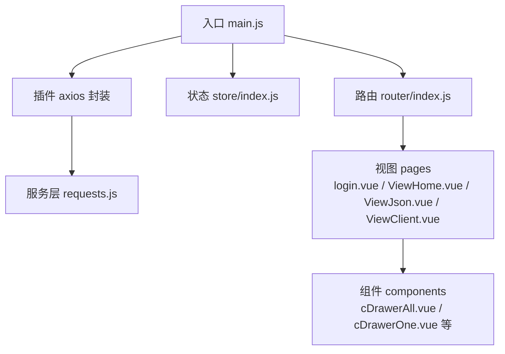
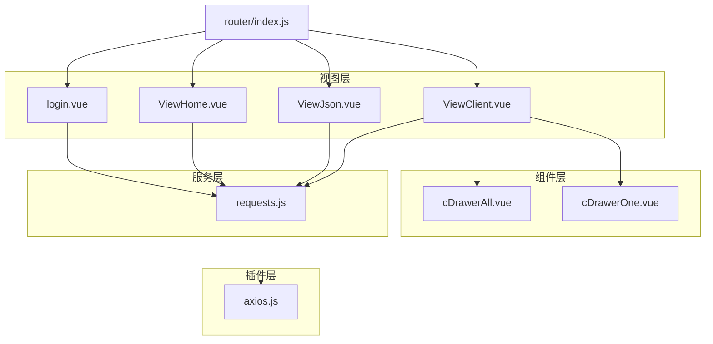
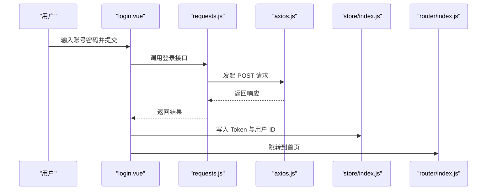
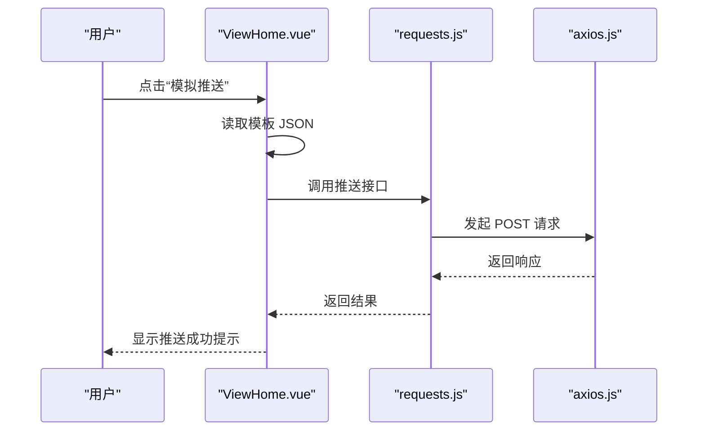
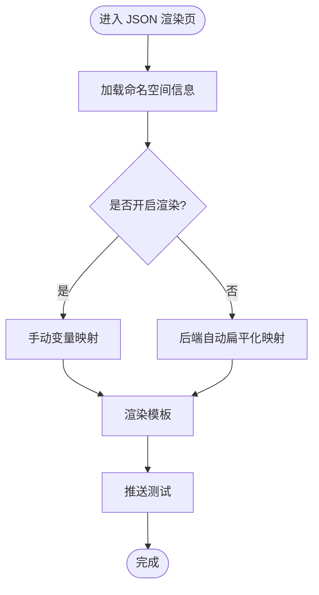
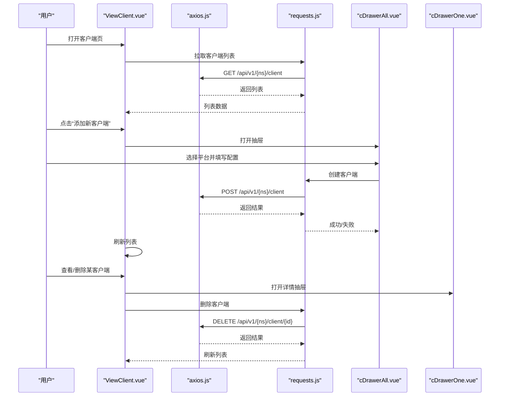
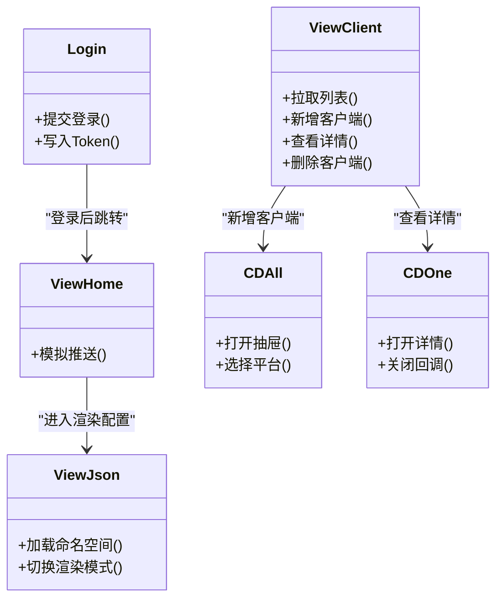
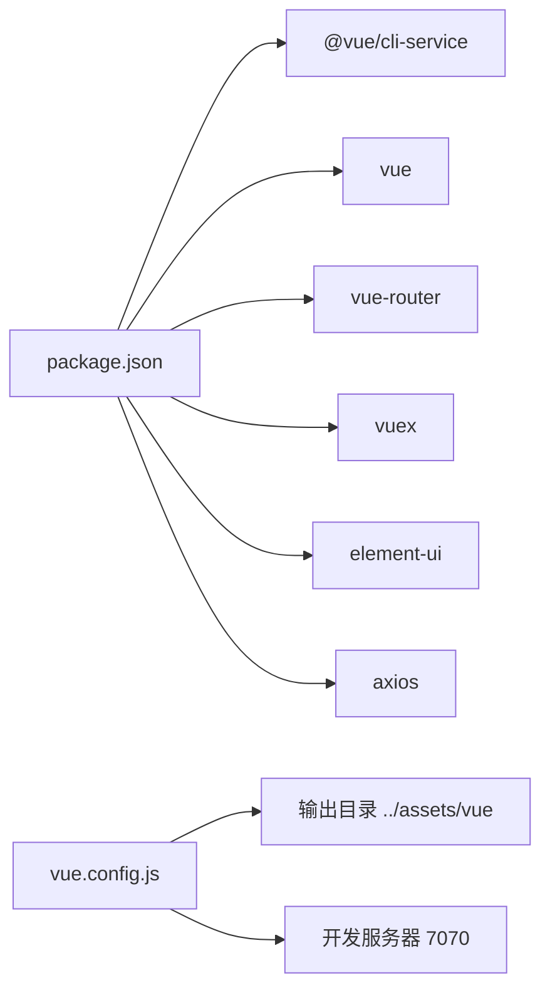

# 前端管理界面

<cite>
**本文引用的文件**   
- [package.json](file://vue/package.json)
- [vue.config.js](file://vue/vue.config.js)
- [main.js](file://vue/src/main.js)
- [router/index.js](file://vue/src/router/index.js)
- [store/index.js](file://vue/src/store/index.js)
- [plugins/axios.js](file://vue/src/plugins/axios.js)
- [service/requests.js](file://vue/src/service/requests.js)
- [views/login.vue](file://vue/src/views/login.vue)
- [views/main/ViewHome.vue](file://vue/src/views/main/ViewHome.vue)
- [views/main/ViewJson.vue](file://vue/src/views/main/ViewJson.vue)
- [views/main/ViewClient.vue](file://vue/src/views/main/ViewClient.vue)
- [components/cDrawerAll.vue](file://vue/src/components/cDrawerAll.vue)
- [components/cDrawerOne.vue](file://vue/src/components/cDrawerOne.vue)
</cite>

## 目录
1. [简介](#简介)
2. [项目结构](#项目结构)
3. [核心组件](#核心组件)
4. [架构总览](#架构总览)
5. [详细组件分析](#详细组件分析)
6. [依赖关系分析](#依赖关系分析)
7. [性能考虑](#性能考虑)
8. [故障排查指南](#故障排查指南)
9. [结论](#结论)
10. [附录](#附录)

## 简介
本文件面向前端管理界面的使用者与开发者，系统性介绍 GoMessage 前端的总体功能、用户工作流程、页面职责、组件架构与数据流，并提供开发环境搭建、与后端 API 的交互方式、以及界面定制与主题配置方法。该界面基于 Vue 2.x + Element UI 技术栈，采用 Vue Router 进行页面路由、Vuex 进行状态管理，Axios 封装统一网络请求。

## 项目结构
前端工程位于 vue/ 目录，核心入口为 main.js，路由定义于 router/index.js，状态管理位于 store/index.js，HTTP 请求封装在 plugins/axios.js 和 service/requests.js。页面主要分布在 views/ 下，组件集中在 components/ 下，构建配置位于 vue.config.js，依赖与脚本在 package.json。

图表来源
- [main.js:1-32](file://vue/src/main.js#L1-L32)
- [router/index.js:1-139](file://vue/src/router/index.js#L1-L139)
- [store/index.js:1-49](file://vue/src/store/index.js#L1-L49)
- [plugins/axios.js:1-96](file://vue/src/plugins/axios.js#L1-L96)
- [service/requests.js:1-42](file://vue/src/service/requests.js#L1-L42)

章节来源
- [package.json:1-54](file://vue/package.json#L1-L54)
- [vue.config.js:1-14](file://vue/vue.config.js#L1-L14)
- [main.js:1-32](file://vue/src/main.js#L1-L32)
- [router/index.js:1-139](file://vue/src/router/index.js#L1-L139)
- [store/index.js:1-49](file://vue/src/store/index.js#L1-L49)

## 核心组件
- 路由与导航：通过 Vue Router 定义页面路由，支持登录页、首页、JSON 渲染页、客户端管理页、定时任务页、用户资料页等。路由守卫负责鉴权与令牌检查。
- 状态管理：Vuex Store 统一存储命名空间、Token、用户 ID、抽屉状态、步骤条等全局状态。
- 网络请求：Axios 实例封装请求与响应拦截器，自动注入 Authorization 头，处理 401/403 场景并跳转登录。
- 页面与组件：登录页、首页（含模拟推送）、JSON 数据渲染与模板配置页、客户端管理页（含抽屉式新增/查看）等。

章节来源
- [router/index.js:1-139](file://vue/src/router/index.js#L1-L139)
- [store/index.js:1-49](file://vue/src/store/index.js#L1-L49)
- [plugins/axios.js:1-96](file://vue/src/plugins/axios.js#L1-L96)
- [service/requests.js:1-42](file://vue/src/service/requests.js#L1-L42)

## 架构总览
前端采用“视图层 + 组件层 + 服务层 + 插件层”的分层架构。视图层承载业务页面，组件层复用通用 UI 与业务组件，服务层封装 API 方法，插件层提供 Axios 封装与第三方库集成。

图表来源
- [router/index.js:1-139](file://vue/src/router/index.js#L1-L139)
- [views/login.vue:1-86](file://vue/src/views/login.vue#L1-L86)
- [views/main/ViewHome.vue:1-47](file://vue/src/views/main/ViewHome.vue#L1-L47)
- [views/main/ViewJson.vue:1-140](file://vue/src/views/main/ViewJson.vue#L1-L140)
- [views/main/ViewClient.vue:1-266](file://vue/src/views/main/ViewClient.vue#L1-L266)
- [components/cDrawerAll.vue:1-64](file://vue/src/components/cDrawerAll.vue#L1-L64)
- [components/cDrawerOne.vue:1-41](file://vue/src/components/cDrawerOne.vue#L1-L41)
- [service/requests.js:1-42](file://vue/src/service/requests.js#L1-L42)
- [plugins/axios.js:1-96](file://vue/src/plugins/axios.js#L1-L96)

## 详细组件分析

### 登录认证流程
- 登录页提供账号密码输入，提交后调用登录接口，成功后写入 Token 与用户 ID 至 Vuex，并跳转首页。
- 路由守卫与 Axios 拦截器共同保障未登录访问将被重定向至登录页。

图表来源
- [views/login.vue:1-86](file://vue/src/views/login.vue#L1-L86)
- [service/requests.js:1-42](file://vue/src/service/requests.js#L1-L42)
- [plugins/axios.js:1-96](file://vue/src/plugins/axios.js#L1-L96)
- [store/index.js:1-49](file://vue/src/store/index.js#L1-L49)
- [router/index.js:1-139](file://vue/src/router/index.js#L1-L139)

章节来源
- [views/login.vue:1-86](file://vue/src/views/login.vue#L1-L86)
- [service/requests.js:1-42](file://vue/src/service/requests.js#L1-L42)
- [plugins/axios.js:1-96](file://vue/src/plugins/axios.js#L1-L96)
- [store/index.js:1-49](file://vue/src/store/index.js#L1-L49)
- [router/index.js:1-139](file://vue/src/router/index.js#L1-L139)

### 首页与推送测试
- 首页提供“模拟 AlertManager 推送”按钮，点击后读取本地模板 JSON 并调用后端接口进行演示推送。
- 该流程不依赖模板编辑，仅用于快速验证通道连通性与渲染效果。

图表来源
- [views/main/ViewHome.vue:1-47](file://vue/src/views/main/ViewHome.vue#L1-L47)
- [service/requests.js:1-42](file://vue/src/service/requests.js#L1-L42)
- [plugins/axios.js:1-96](file://vue/src/plugins/axios.js#L1-L96)

章节来源
- [views/main/ViewHome.vue:1-47](file://vue/src/views/main/ViewHome.vue#L1-L47)
- [service/requests.js:1-42](file://vue/src/service/requests.js#L1-L42)
- [plugins/axios.js:1-96](file://vue/src/plugins/axios.js#L1-L96)

### JSON 渲染与模板配置
- 该页面负责“劫持过境数据”“变量映射”“模板渲染”三大能力，支持手动映射与后端自动扁平化两种模式。
- 支持切换命名空间渲染模式（开启/关闭渲染），并持久化到后端命名空间配置。

图表来源
- [views/main/ViewJson.vue:1-140](file://vue/src/views/main/ViewJson.vue#L1-L140)
- [service/requests.js:1-42](file://vue/src/service/requests.js#L1-L42)

章节来源
- [views/main/ViewJson.vue:1-140](file://vue/src/views/main/ViewJson.vue#L1-L140)
- [service/requests.js:1-42](file://vue/src/service/requests.js#L1-L42)

### 客户端管理
- 客户端列表展示各通道下可用的客户端，支持“是否激活”即时切换、查看详情、删除等操作。
- 新增客户端通过抽屉式多标签页选择具体平台（钉钉/飞书/企微机器人/企微应用号/其它）进行配置。

图表来源
- [views/main/ViewClient.vue:1-266](file://vue/src/views/main/ViewClient.vue#L1-L266)
- [components/cDrawerAll.vue:1-64](file://vue/src/components/cDrawerAll.vue#L1-L64)
- [components/cDrawerOne.vue:1-41](file://vue/src/components/cDrawerOne.vue#L1-L41)
- [service/requests.js:1-42](file://vue/src/service/requests.js#L1-L42)
- [plugins/axios.js:1-96](file://vue/src/plugins/axios.js#L1-L96)

章节来源
- [views/main/ViewClient.vue:1-266](file://vue/src/views/main/ViewClient.vue#L1-L266)
- [components/cDrawerAll.vue:1-64](file://vue/src/components/cDrawerAll.vue#L1-L64)
- [components/cDrawerOne.vue:1-41](file://vue/src/components/cDrawerOne.vue#L1-L41)
- [service/requests.js:1-42](file://vue/src/service/requests.js#L1-L42)
- [plugins/axios.js:1-96](file://vue/src/plugins/axios.js#L1-L96)

### 组件类关系

图表来源
- [views/login.vue:1-86](file://vue/src/views/login.vue#L1-L86)
- [views/main/ViewHome.vue:1-47](file://vue/src/views/main/ViewHome.vue#L1-L47)
- [views/main/ViewJson.vue:1-140](file://vue/src/views/main/ViewJson.vue#L1-L140)
- [views/main/ViewClient.vue:1-266](file://vue/src/views/main/ViewClient.vue#L1-L266)
- [components/cDrawerAll.vue:1-64](file://vue/src/components/cDrawerAll.vue#L1-L64)
- [components/cDrawerOne.vue:1-41](file://vue/src/components/cDrawerOne.vue#L1-L41)

## 依赖关系分析
- 构建与运行：通过 Vue CLI 提供开发与生产构建脚本，静态资源输出至后端 assets/vue 目录，开发服务器端口 7070。
- 依赖生态：Element UI、Vue Router、Vuex、Axios 等核心依赖；ESLint 规范校验。
- 环境变量：Axios 使用环境变量作为基础 URL，便于不同环境切换。

图表来源
- [package.json:1-54](file://vue/package.json#L1-L54)
- [vue.config.js:1-14](file://vue/vue.config.js#L1-L14)

章节来源
- [package.json:1-54](file://vue/package.json#L1-L54)
- [vue.config.js:1-14](file://vue/vue.config.js#L1-L14)

## 性能考虑
- 路由懒加载：路由组件采用动态导入，减少首屏包体积。
- Axios 超时与拦截：统一超时时间与错误处理，避免长时间阻塞。
- 表格与抽屉：Element UI 组件按需使用，避免不必要的重渲染。
- 开发体验：热重载与源码映射，提升调试效率。

## 故障排查指南
- 登录后立即跳转登录：检查 Token 是否写入 Store，确认 Axios 请求头是否正确注入。
- 401/403 错误：确认后端鉴权状态与 Token 有效性，检查路由守卫与拦截器逻辑。
- 客户端列表为空：确认命名空间是否正确，后端是否存在数据。
- 抽屉无法关闭：检查抽屉组件的关闭回调与 Store 状态同步。

章节来源
- [plugins/axios.js:1-96](file://vue/src/plugins/axios.js#L1-L96)
- [router/index.js:1-139](file://vue/src/router/index.js#L1-L139)
- [views/main/ViewClient.vue:1-266](file://vue/src/views/main/ViewClient.vue#L1-L266)

## 结论
该前端管理界面以清晰的分层架构与模块化组件实现了登录认证、推送测试、JSON 渲染与模板配置、客户端管理等核心功能。通过 Vuex 统一状态、Axios 封装网络请求、Element UI 提供交互组件，整体具备良好的可维护性与扩展性。建议后续引入更完善的错误边界与日志上报，进一步完善开发与运维体验。

## 附录

### 开发环境搭建
- 安装依赖：使用 npm/yarn 安装 package.json 中声明的依赖。
- 启动开发：执行开发脚本启动本地服务，端口 7070。
- 构建产物：构建后静态资源输出至 ../assets/vue，供后端统一托管。

章节来源
- [package.json:1-54](file://vue/package.json#L1-L54)
- [vue.config.js:1-14](file://vue/vue.config.js#L1-L14)

### 与后端 API 的交互方式
- 基础地址：通过环境变量注入，Axios 默认携带 Authorization 头。
- 主要接口：
  - 认证：POST /auth/login、POST /auth/logout
  - 命名空间：GET/POST/PUT/DELETE /api/v1/namespace(/:id)
  - 模板：GET/POST /api/v1/:namespace/template
  - 变量映射：GET/POST /api/v1/:namespace/vars、GET /api/v1/:namespace/flattening
  - 客户端：GET/POST/PUT/DELETE /api/v1/:namespace/client(/:id)、PUT /api/v1/:namespace/client-info/:id
  - 推送测试：POST /go/:namespace

章节来源
- [plugins/axios.js:1-96](file://vue/src/plugins/axios.js#L1-L96)
- [service/requests.js:1-42](file://vue/src/service/requests.js#L1-L42)

### 界面定制与主题配置
- Element UI：通过插件引入，可在全局样式中覆盖默认主题变量或引入自定义样式。
- 构建输出：静态资源位于 ../assets/vue/static，可按需替换或扩展。
- 全局工具：已注册全局日期格式化方法，可在组件中直接使用。

章节来源
- [vue.config.js:1-14](file://vue/vue.config.js#L1-L14)
- [main.js:1-32](file://vue/src/main.js#L1-L32)