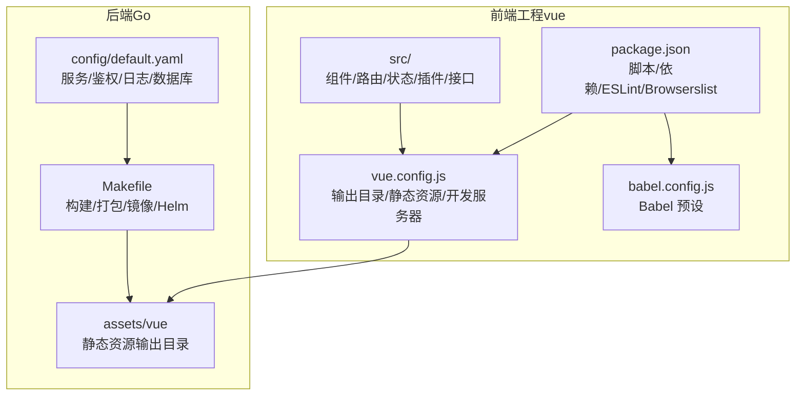
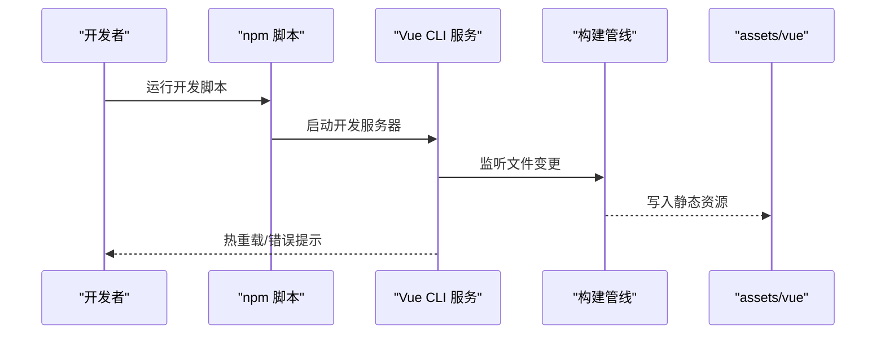

# 开发环境指南

<cite>
**本文引用的文件**
- [package.json](file://vue/package.json)
- [vue.config.js](file://vue/vue.config.js)
- [babel.config.js](file://vue/babel.config.js)
- [README.md](file://vue/README.md)
- [Makefile](file://Makefile)
- [.air.toml](file://.air.toml)
- [default.yaml](file://config/default.yaml)
- [axios.js](file://vue/src/plugins/axios.js)
- [requests.js](file://vue/src/service/requests.js)
- [index.js](file://vue/src/router/index.js)
- [index.js](file://vue/src/store/index.js)
- [install_linux.md](file://wiki/install_linux.md)
</cite>

## 目录
1. [简介](#简介)
2. [项目结构](#项目结构)
3. [核心组件](#核心组件)
4. [架构总览](#架构总览)
5. [详细组件分析](#详细组件分析)
6. [依赖分析](#依赖分析)
7. [性能考虑](#性能考虑)
8. [故障排查指南](#故障排查指南)
9. [结论](#结论)
10. [附录](#附录)

## 简介
本指南面向前端开发者，提供从零搭建与配置开发环境的完整流程，涵盖 Node.js 版本要求、包管理器选择、依赖安装、项目配置文件说明（Webpack/Vite、Babel、ESLint）、开发服务器启动与热重载、构建与部署命令行操作、常见问题与调试技巧，以及版本控制与团队协作最佳实践。

## 项目结构
前端代码位于 vue 目录，采用 Vue CLI 4.x 生成的脚手架工程，结合自定义的构建输出目录与开发服务器配置，最终产物输出至后端 assets/vue 目录，供后端统一发布。

图表来源
- [package.json:1-54](file://vue/package.json#L1-L54)
- [vue.config.js:1-14](file://vue/vue.config.js#L1-L14)
- [babel.config.js:1-6](file://vue/babel.config.js#L1-L6)
- [Makefile:74-82](file://Makefile#L74-L82)
- [default.yaml:1-83](file://config/default.yaml#L1-L83)

章节来源
- [package.json:1-54](file://vue/package.json#L1-L54)
- [vue.config.js:1-14](file://vue/vue.config.js#L1-L14)
- [babel.config.js:1-6](file://vue/babel.config.js#L1-L6)
- [Makefile:74-82](file://Makefile#L74-L82)
- [default.yaml:1-83](file://config/default.yaml#L1-L83)

## 核心组件
- 包管理与脚本
  - 使用 npm 作为包管理器，提供 dev/build/lint 三类脚本，分别对应开发、生产构建与代码检查。
- 构建配置
  - 输出目录指向后端 assets/vue，静态资源目录 static，开发服务器端口 7070，自动打开浏览器。
- 转换与兼容
  - Babel 使用 @vue/cli-plugin-babel/preset，目标浏览器由 browserslist 控制。
- 代码规范
  - ESLint 继承 plugin:vue/essential 与 eslint:recommended，解析器为 babel-eslint，规则可扩展。

章节来源
- [package.json:5-52](file://vue/package.json#L5-L52)
- [vue.config.js:1-14](file://vue/vue.config.js#L1-L14)
- [babel.config.js:1-6](file://vue/babel.config.js#L1-L6)

## 架构总览
前端通过 Vue CLI 提供开发服务器与构建能力，构建产物输出到 assets/vue，由后端统一托管。开发阶段，前端开发服务器与后端服务通过环境变量或配置文件进行通信。

图表来源
- [package.json:5-8](file://vue/package.json#L5-L8)
- [vue.config.js:5-12](file://vue/vue.config.js#L5-L12)

## 详细组件分析

### 1) 依赖与安装
- Node.js 版本建议
  - 使用 npm 与 Vue CLI 4.x，建议 Node.js LTS（如 18.x 或 20.x）以获得稳定生态与性能。
- 包管理器选择
  - 仓库已提供 package-lock.json，推荐使用 npm 进行安装，避免版本漂移。
- 安装步骤
  - 在 vue 目录执行安装，安装生产与开发依赖。
  - 安装完成后可直接运行开发脚本进入热重载开发模式。
- 生产依赖
  - 包含 Vue 2.x、Vue Router、Vuex、Element-UI、Axios、Sentry 等。
- 开发依赖
  - @vue/cli-service、@vue/cli-plugin-*、ESLint 及相关插件、babel-eslint 等。

章节来源
- [package.json:10-33](file://vue/package.json#L10-L33)
- [README.md:3-31](file://vue/README.md#L3-L31)

### 2) 项目配置文件详解

#### Vue 配置（vue.config.js）
- 输出目录 outputDir 指向 ../assets/vue，确保构建产物被后端统一托管。
- 静态资源目录 assetsDir 设置为 static，便于按类型分层。
- 开发服务器 devServer
  - 自动打开浏览器 open: true
  - 端口 port: 7070
  - 历史模式回退注释保留，可根据需要启用
- 可扩展点
  - 可增加代理配置以对接后端服务（见“开发服务器与代理”）

章节来源
- [vue.config.js:1-14](file://vue/vue.config.js#L1-L14)

#### Babel 配置（babel.config.js）
- 使用 @vue/cli-plugin-babel/preset，保证与 Vue CLI 的兼容性与默认行为一致。
- 如需新增 polyfill 或转换规则，可在 preset 外层扩展。

章节来源
- [babel.config.js:1-6](file://vue/babel.config.js#L1-L6)

#### ESLint 配置（package.json 中的 eslintConfig）
- 继承 plugin:vue/essential 与 eslint:recommended，确保基础质量门槛。
- 解析器 parserOptions.parser 使用 babel-eslint，适配 Vue 单文件组件语法。
- rules 字段留空，便于团队统一约定或在 .eslintrc 中扩展。

章节来源
- [package.json:34-47](file://vue/package.json#L34-L47)

#### 浏览器兼容（browserslist）
- 默认包含 > 1%、last 2 versions、not dead，覆盖主流现代浏览器。
- 可根据业务场景调整以平衡体积与兼容性。

章节来源
- [package.json:48-52](file://vue/package.json#L48-L52)

### 3) 开发服务器与热重载
- 启动方式
  - 在 vue 目录执行开发脚本，自动打开浏览器并监听文件变更。
- 端口与自动打开
  - 端口 7070，open: true，便于快速预览。
- 历史模式与回退
  - 若使用 history 模式，可参考注释启用 historyApiFallback，指向 index.html。
- 与后端联调
  - 建议通过环境变量或代理将 API 请求转发至后端服务（见“开发服务器与代理”）。

章节来源
- [vue.config.js:5-12](file://vue/vue.config.js#L5-L12)
- [README.md:9-13](file://vue/README.md#L9-L13)

### 4) 构建与部署命令行
- 本地开发
  - 安装依赖后，执行开发脚本进入热重载模式。
- 生产构建
  - 执行构建脚本，产物输出至 assets/vue。
- 一键构建与打包
  - Makefile 提供 build_frontend 目标，先在 vue 目录执行构建，再由后端统一打包。
  - 支持多平台构建与 Docker 镜像制作，最终生成 tar.gz 包供部署。
- Helm 与镜像
  - Makefile 提供 docker/docker_push 目标，支持多平台镜像构建与推送，并更新 Helm Chart 版本后推送。

章节来源
- [README.md:15-19](file://vue/README.md#L15-L19)
- [Makefile:74-82](file://Makefile#L74-L82)
- [Makefile:169-179](file://Makefile#L169-L179)
- [Makefile:185-204](file://Makefile#L185-L204)

### 5) API 与路由/状态

#### Axios 插件与环境变量
- axios 实例通过环境变量 VUE_APP_BASE_URL 动态配置 baseURL，便于不同环境切换。
- 请求拦截器注入 Authorization 头与 Content-Type，响应拦截器处理 401/403 等状态并跳转登录。
- 建议在 .env.local 中配置 VUE_APP_BASE_URL 指向后端服务地址。

章节来源
- [axios.js:13-17](file://vue/src/plugins/axios.js#L13-L17)
- [axios.js:19-57](file://vue/src/plugins/axios.js#L19-L57)

#### 接口封装
- requests.js 将各模块 API 封装为函数，统一调用 http 实例，便于维护与测试。

章节来源
- [requests.js:1-42](file://vue/src/service/requests.js#L1-L42)

#### 路由与鉴权
- 路由采用 hash 模式（未启用 history），包含登录页与主功能页。
- 导航守卫在进入受保护路由前校验 token，若无 token 则重定向登录。
- 支持从 sessionStorage 恢复 store 状态，增强刷新后的体验。

章节来源
- [index.js:103-136](file://vue/src/router/index.js#L103-L136)

#### 状态管理
- Vuex Store 维护命名空间、Token、用户 ID 等全局状态，提供 getters/mutations。
- 建议在登录成功后通过 mutations 更新 Token 并持久化到 sessionStorage。

章节来源
- [index.js:6-48](file://vue/src/store/index.js#L6-L48)

### 6) 开发服务器与代理（前后端联调）
- 建议在 vue.config.js 的 devServer 中增加 proxy，将 /api 前缀请求转发至后端服务（例如 http://localhost:7077）。
- 代理配置可避免跨域问题，提升联调效率。
- 注意：代理仅在开发模式生效，生产构建后由后端统一托管静态资源。

章节来源
- [vue.config.js:5-12](file://vue/vue.config.js#L5-L12)

### 7) 环境变量与后端配置
- 后端服务监听 0.0.0.0:7077，可通过 config/default.yaml 修改 host/port、JWT 密钥、日志级别与数据库类型等。
- 前端通过 VUE_APP_BASE_URL 指向后端地址，确保开发与生产环境一致。

章节来源
- [default.yaml:19-21](file://config/default.yaml#L19-L21)
- [axios.js:13-17](file://vue/src/plugins/axios.js#L13-L17)

## 依赖分析
- 前端依赖关系
  - Vue CLI 服务依赖 @vue/cli-service 与相关插件，ESLint 与 Babel 作为开发期工具链。
  - Element-UI 与 Axios 为 UI 与网络层核心依赖。
- 构建链路
  - npm run build -> Vue CLI -> Webpack -> assets/vue
  - Makefile -> build_frontend -> 构建前端 -> 打包后端 -> 产出 tar.gz
- 外部集成
  - 后端提供 Swagger 文档与配置文件，前端通过 API 文档与后端接口保持一致性。

图表来源
- [package.json:5-8](file://vue/package.json#L5-L8)
- [Makefile:74-82](file://Makefile#L74-L82)
- [vue.config.js:1-4](file://vue/vue.config.js#L1-L4)

章节来源
- [package.json:5-33](file://vue/package.json#L5-L33)
- [Makefile:74-82](file://Makefile#L74-L82)

## 性能考虑
- 构建优化
  - 合理设置 browserslist，避免为过时浏览器引入不必要的 polyfill。
  - 使用按需引入 Element-UI，减少首屏体积。
- 开发体验
  - devServer 端口 7070 与自动打开浏览器，缩短启动反馈链路。
- 资源组织
  - assetsDir 设为 static，便于 CDN 与缓存策略配置。

## 故障排查指南
- 端口冲突
  - 若 7070 已被占用，可在 vue.config.js 中修改 port。
- 热重载失效
  - 检查文件是否被 .gitignore 排除，确认监听的文件扩展名包含 .js/.vue 等。
- 跨域问题
  - 通过 devServer.proxy 将 /api 前缀转发至后端服务。
- 后端联调失败
  - 确认 VUE_APP_BASE_URL 指向正确地址，后端服务已启动并监听 7077。
- 构建失败
  - 清理 node_modules 与 lock 文件后重装依赖；必要时设置 NODE_OPTIONS=--openssl-legacy-provider（见 Makefile 中的构建命令）。

章节来源
- [vue.config.js:5-12](file://vue/vue.config.js#L5-L12)
- [.air.toml:10-11](file://.air.toml#L10-L11)
- [Makefile:80-81](file://Makefile#L80-L81)

## 结论
本指南提供了从前端开发环境准备到构建部署的全流程说明。遵循上述步骤，可快速搭建稳定、可维护的前端开发与发布体系，并与后端服务高效协同。

## 附录

### A. 开发环境准备清单
- Node.js：建议使用 LTS 版本（如 18.x/20.x）
- 包管理器：npm（与 package-lock.json 保持一致）
- IDE：推荐 VS Code 并安装 Vue/ESLint 插件
- 依赖安装：在 vue 目录执行安装，随后运行开发脚本

章节来源
- [README.md:3-7](file://vue/README.md#L3-L7)

### B. 常用命令速查
- 安装依赖：在 vue 目录执行安装
- 启动开发：运行开发脚本
- 生产构建：运行构建脚本
- 一键构建与打包：执行 Makefile 的 build_frontend 目标
- 制作镜像与推送：执行 docker/docker_push 目标

章节来源
- [README.md:3-31](file://vue/README.md#L3-L31)
- [Makefile:74-82](file://Makefile#L74-L82)
- [Makefile:169-179](file://Makefile#L169-L179)
- [Makefile:185-197](file://Makefile#L185-L197)

### C. 版本控制与团队协作最佳实践
- 分支策略：采用 Git Flow，feature 分支从 develop 拉取，合并回 develop，发布版本从 main 切出。
- 提交规范：使用 Conventional Commits，便于自动生成变更日志。
- 代码审查：PR 必须通过 ESLint 与单元测试，至少一名 reviewer 通过。
- 环境隔离：通过 .env.local 与环境变量区分开发/测试/生产，避免硬编码。
- 依赖锁定：使用 package-lock.json，禁止直接修改 node_modules。
- 文档同步：接口变更需同步更新 API 文档与前端调用。

### D. 后端服务启动与访问（参考）
- 后端服务默认监听 7077 端口，可通过 systemd 封装为守护进程，便于生产环境稳定运行。
- 首次访问界面截图可参考 Linux 安装文档中的说明。

章节来源
- [install_linux.md:67-71](file://wiki/install_linux.md#L67-L71)
- [install_linux.md:85-140](file://wiki/install_linux.md#L85-L140)