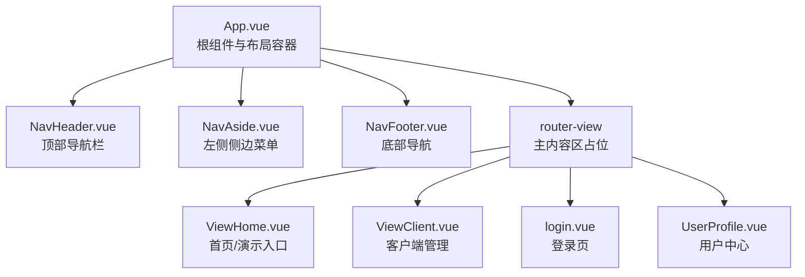
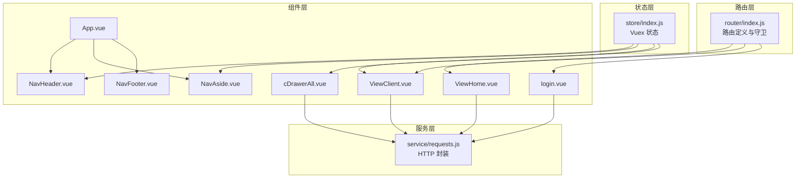
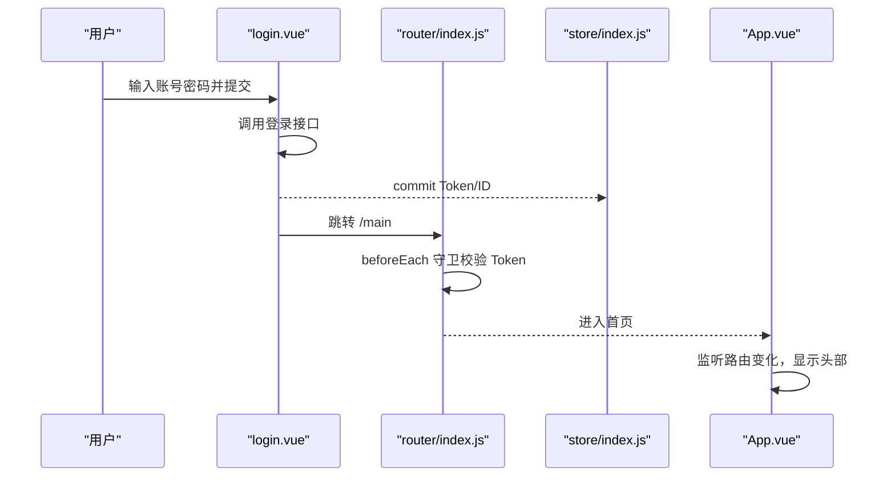
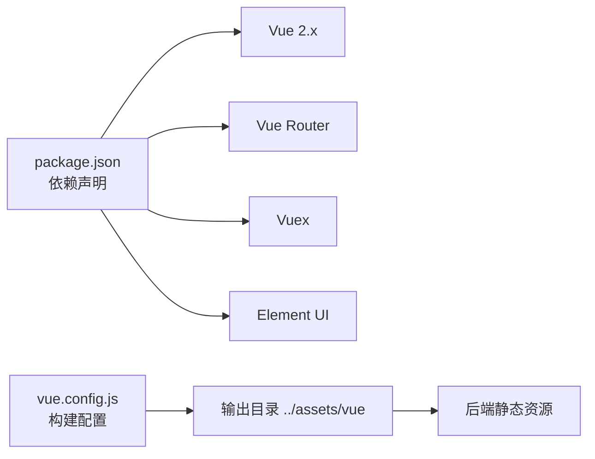

# 界面功能概览

<cite>
**本文引用的文件**
- [App.vue](file://vue/src/App.vue)
- [main.js](file://vue/src/main.js)
- [router/index.js](file://vue/src/router/index.js)
- [store/index.js](file://vue/src/store/index.js)
- [views/navs/NavHeader.vue](file://vue/src/views/navs/NavHeader.vue)
- [views/navs/NavAside.vue](file://vue/src/views/navs/NavAside.vue)
- [views/navs/NavFooter.vue](file://vue/src/views/navs/NavFooter.vue)
- [views/main/ViewClient.vue](file://vue/src/views/main/ViewClient.vue)
- [views/main/ViewHome.vue](file://vue/src/views/main/ViewHome.vue)
- [views/login.vue](file://vue/src/views/login.vue)
- [components/cDrawerAll.vue](file://vue/src/components/cDrawerAll.vue)
- [service/requests.js](file://vue/src/service/requests.js)
- [package.json](file://vue/package.json)
- [vue.config.js](file://vue/vue.config.js)
- [public/index.html](file://vue/public/index.html)
</cite>

## 目录
1. [简介](#简介)
2. [项目结构](#项目结构)
3. [核心组件](#核心组件)
4. [架构总览](#架构总览)
5. [详细组件分析](#详细组件分析)
6. [依赖关系分析](#依赖关系分析)
7. [性能考虑](#性能考虑)
8. [故障排查指南](#故障排查指南)
9. [结论](#结论)
10. [附录](#附录)

## 简介
本文件面向前端管理界面的使用者与维护者，系统性介绍 GoMessage 前端管理界面的整体布局、导航结构、功能模块入口与交互流程。重点覆盖顶部导航栏、侧边菜单、主内容区的设计理念与职责边界；逐项说明客户端管理、模板与变量、数据渲染、用户中心等主要功能区域的作用与使用路径；梳理登录认证流程、页面跳转逻辑与数据展示方式；并给出响应式与多设备兼容性的说明与建议。

## 项目结构
前端采用 Vue 2 + Element UI 技术栈，基于路由驱动的 SPA 架构，结合 Vuex 管理全局状态。项目通过 Vue CLI 构建，开发服务器端口默认 7070，构建产物输出至后端静态资源目录，便于与后端服务统一部署。

图表来源
- [App.vue:1-132](file://vue/src/App.vue#L1-L132)
- [views/navs/NavHeader.vue:1-195](file://vue/src/views/navs/NavHeader.vue#L1-L195)
- [views/navs/NavAside.vue:1-265](file://vue/src/views/navs/NavAside.vue#L1-L265)
- [views/navs/NavFooter.vue:1-54](file://vue/src/views/navs/NavFooter.vue#L1-L54)
- [views/main/ViewHome.vue:1-47](file://vue/src/views/main/ViewHome.vue#L1-L47)
- [views/main/ViewClient.vue:1-266](file://vue/src/views/main/ViewClient.vue#L1-L266)
- [views/login.vue:1-86](file://vue/src/views/login.vue#L1-L86)

章节来源
- [App.vue:1-132](file://vue/src/App.vue#L1-L132)
- [vue.config.js:1-14](file://vue/vue.config.js#L1-L14)
- [package.json:1-54](file://vue/package.json#L1-L54)

## 核心组件
- 根组件与布局容器
  - 采用 Element Container/Aside/Main/Footer 布局，全屏高度，主内容区通过 router-view 动态渲染。
  - 提供全局 reload 注入，用于强制刷新当前路由视图，避免路由级别缓存导致的状态不同步。
  - 监听路由变化以控制头部导航显示（登录页与定时任务页隐藏头部）。
- 顶部导航栏
  - 水平菜单，左侧包含 Logo 与当前命名空间显示；右侧包含“消息入口”“数据渲染”“接收客户端”等入口；右上角提供文档链接与用户下拉菜单（登录/退出/个人信息）。
- 左侧侧边菜单
  - 基于命名空间的“推送通道”管理，支持查看、切换、新增、删除通道；与顶部命名空间联动。
- 主内容区
  - 首页：提供模拟 AlertManager 推送的演示入口。
  - 客户端管理：展示与管理各类 IM 客户端（钉钉/飞书/企业微信/邮箱等），支持抽屉式新增、详情查看、启用/停用切换、删除。
  - 登录页：标准表单登录，提交后写入 Token 并跳转首页。
  - 用户中心：个人信息与密码修改入口。
- 底部导航
  - 展示版权、开源协议、仓库链接与版本号。

章节来源
- [App.vue:1-132](file://vue/src/App.vue#L1-L132)
- [views/navs/NavHeader.vue:1-195](file://vue/src/views/navs/NavHeader.vue#L1-L195)
- [views/navs/NavAside.vue:1-265](file://vue/src/views/navs/NavAside.vue#L1-L265)
- [views/navs/NavFooter.vue:1-54](file://vue/src/views/navs/NavFooter.vue#L1-L54)
- [views/main/ViewHome.vue:1-47](file://vue/src/views/main/ViewHome.vue#L1-L47)
- [views/main/ViewClient.vue:1-266](file://vue/src/views/main/ViewClient.vue#L1-L266)
- [views/login.vue:1-86](file://vue/src/views/login.vue#L1-L86)

## 架构总览
前端采用“路由 + 组件 + 服务”的分层架构：
- 路由层：集中定义页面路径与懒加载组件，前置守卫实现登录态校验与状态恢复。
- 组件层：按功能拆分页面与通用组件（抽屉、表单、列表等），复用性强。
- 服务层：封装 HTTP 请求，统一后端接口前缀与命名空间拼接策略。
- 状态层：Vuex 管理命名空间、Token、抽屉状态等全局状态。

图表来源
- [router/index.js:1-139](file://vue/src/router/index.js#L1-L139)
- [store/index.js:1-49](file://vue/src/store/index.js#L1-L49)
- [service/requests.js:1-42](file://vue/src/service/requests.js#L1-L42)
- [App.vue:1-132](file://vue/src/App.vue#L1-L132)
- [views/main/ViewHome.vue:1-47](file://vue/src/views/main/ViewHome.vue#L1-L47)
- [views/main/ViewClient.vue:1-266](file://vue/src/views/main/ViewClient.vue#L1-L266)
- [views/login.vue:1-86](file://vue/src/views/login.vue#L1-L86)
- [components/cDrawerAll.vue:1-64](file://vue/src/components/cDrawerAll.vue#L1-L64)

## 详细组件分析

### 顶部导航栏（NavHeader）
- 设计理念
  - 顶部主导航采用水平菜单，左侧 Logo 与命名空间标识，右侧功能入口清晰，右上角用户下拉菜单提供登录/退出/个人信息入口。
- 功能要点
  - 命名空间显示：绑定 Store 中的 Namespace，便于用户感知当前通道。
  - 导航入口：消息入口、数据渲染、接收客户端等，均通过 router-link 实现无刷新跳转。
  - 用户下拉菜单：根据 Token 是否存在动态显示登录/退出/个人信息；退出登录调用后端接口并清空本地 Token。
- 交互模式
  - 点击菜单项即路由跳转；点击文档图标打开外部文档站点；点击头像打开下拉菜单。

章节来源
- [views/navs/NavHeader.vue:1-195](file://vue/src/views/navs/NavHeader.vue#L1-L195)
- [store/index.js:1-49](file://vue/src/store/index.js#L1-L49)

### 左侧侧边菜单（NavAside）
- 设计理念
  - 以“命名空间/推送通道”为核心组织单元，支持查看、切换、新增、删除通道，实现多通道并发隔离。
- 功能要点
  - 通道列表：从后端拉取命名空间列表，点击切换当前通道并刷新页面。
  - 新增通道：弹窗表单校验（长度、字符规则等），提交后刷新列表并强制刷新当前路由。
  - 删除通道：调用后端接口删除，提示成功/失败。
- 交互模式
  - 打开弹窗 -> 填写表单 -> 提交 -> 刷新列表 -> 强制刷新当前路由。

章节来源
- [views/navs/NavAside.vue:1-265](file://vue/src/views/navs/NavAside.vue#L1-L265)
- [service/requests.js:30-36](file://vue/src/service/requests.js#L30-L36)

### 主内容区与页面
- 首页（ViewHome）
  - 展示域名配置组件与“模拟 AlertManager 推送”按钮，点击后向后端发送示例数据。
- 客户端管理（ViewClient）
  - 中央卡片展示客户端列表，支持“刷新列表”“添加新客户端”“查看详情”“移除”等操作。
  - 启用/停用状态变更采用失焦自动保存策略，减少用户操作成本。
  - 详情抽屉与新增抽屉分别承载“查看/编辑”与“新增”两种交互形态。
- 登录页（login）
  - 表单输入用户名/密码，提交后写入 Token 并跳转首页。
- 用户中心（UserProfile）
  - 位于“/user”路径，提供用户信息与密码修改入口（具体实现位于对应组件文件）。

章节来源
- [views/main/ViewHome.vue:1-47](file://vue/src/views/main/ViewHome.vue#L1-L47)
- [views/main/ViewClient.vue:1-266](file://vue/src/views/main/ViewClient.vue#L1-L266)
- [views/login.vue:1-86](file://vue/src/views/login.vue#L1-L86)
- [components/cDrawerAll.vue:1-64](file://vue/src/components/cDrawerAll.vue#L1-L64)

### 抽屉与表单组件（cDrawerAll）
- 设计理念
  - 使用抽屉承载多种客户端类型的新增表单，Tab 分类组织，提升可用性。
- 功能要点
  - 内置多个客户端类型 Tab（钉钉/飞书/企微机器人/企微应用号/其它），每个 Tab 对应独立组件。
  - 通过 Store 控制抽屉开关，关闭时销毁内容，避免状态残留。
- 交互模式
  - 点击“添加新客户端”打开抽屉；选择对应 Tab 填写参数；提交后刷新列表并强制刷新当前路由。

章节来源
- [components/cDrawerAll.vue:1-64](file://vue/src/components/cDrawerAll.vue#L1-L64)
- [views/main/ViewClient.vue:161-164](file://vue/src/views/main/ViewClient.vue#L161-L164)

### 登录认证流程与页面跳转
- 登录流程
  - 用户在登录页输入凭据，提交后调用登录接口；成功后写入 Token 与用户 ID，跳转首页。
- 页面跳转与守卫
  - 路由守卫在进入受保护页面前检查 Token；若无 Token 或无效则重定向至登录页。
  - App.vue 在路由变化时动态控制头部显示；登录页与定时任务页隐藏头部。
- 状态持久化
  - 页面刷新时从 sessionStorage 恢复 Vuex 状态，确保 Token 等关键信息不丢失。

图表来源
- [views/login.vue:41-74](file://vue/src/views/login.vue#L41-L74)
- [router/index.js:109-136](file://vue/src/router/index.js#L109-L136)
- [store/index.js:23-44](file://vue/src/store/index.js#L23-L44)
- [App.vue:70-78](file://vue/src/App.vue#L70-L78)

章节来源
- [views/login.vue:1-86](file://vue/src/views/login.vue#L1-L86)
- [router/index.js:1-139](file://vue/src/router/index.js#L1-L139)
- [store/index.js:1-49](file://vue/src/store/index.js#L1-L49)
- [App.vue:1-132](file://vue/src/App.vue#L1-L132)

### 数据展示与交互模式
- 客户端列表
  - 表格展示客户端名称、描述、类型与启用状态；启用状态变更即时保存。
  - 支持“查看详情”打开抽屉查看完整信息；支持“移除”删除客户端。
- 命名空间管理
  - 通过弹窗表格展示通道列表，支持新增/删除；新增时进行表单校验；删除后提示结果。
- 响应式与布局
  - 使用 Element Grid 与 Card 组件适配不同屏幕尺寸；容器采用全高布局，主内容区自适应。

章节来源
- [views/main/ViewClient.vue:30-70](file://vue/src/views/main/ViewClient.vue#L30-L70)
- [views/navs/NavAside.vue:50-124](file://vue/src/views/navs/NavAside.vue#L50-L124)

## 依赖关系分析
- 组件耦合
  - App.vue 作为根容器，聚合导航与主内容区；各页面组件相对独立，通过路由与服务层解耦。
  - NavAside 与 NavHeader 通过 Store 获取命名空间状态，实现跨组件状态共享。
- 外部依赖
  - Element UI 提供布局与交互组件；Axios 封装网络请求；Vue Router/Vuex 提供路由与状态管理。
- 输出与构建
  - 构建产物输出到后端静态资源目录，publicPath 为相对路径，便于与后端统一部署。

图表来源
- [package.json:10-33](file://vue/package.json#L10-L33)
- [vue.config.js:1-14](file://vue/vue.config.js#L1-L14)

章节来源
- [package.json:1-54](file://vue/package.json#L1-L54)
- [vue.config.js:1-14](file://vue/vue.config.js#L1-L14)

## 性能考虑
- 路由懒加载
  - 路由组件采用动态导入，减少首屏包体积，提升初始加载速度。
- 组件按需加载
  - 页面组件与通用组件分离，避免不必要的渲染与计算。
- 状态持久化
  - 刷新时从 sessionStorage 恢复 Vuex 状态，减少重复初始化成本。
- 图标与资源
  - 构建后静态资源放置在相对路径，减少资源请求失败风险。

章节来源
- [router/index.js:16-46](file://vue/src/router/index.js#L16-L46)
- [App.vue:80-88](file://vue/src/App.vue#L80-L88)
- [vue.config.js:1-14](file://vue/vue.config.js#L1-L14)

## 故障排查指南
- 登录后无法进入受保护页面
  - 检查 Token 是否写入 Store；确认路由守卫逻辑与 sessionStorage 状态恢复是否生效。
- 退出登录后仍可访问
  - 确认退出接口返回码与前端分支逻辑；确保 Token 清空与路由跳转顺序正确。
- 命名空间切换无效
  - 检查 NavAside 的命名空间切换逻辑与 reload 调用；确认后端命名空间列表是否正确返回。
- 客户端列表不刷新
  - 确认“刷新列表”按钮调用与后端 getClient 接口；检查 demo 数据过滤逻辑避免误删。
- 抽屉无法关闭或状态残留
  - 检查抽屉关闭 confirm 逻辑与 Store 状态重置；确认 destroy-on-close 配置生效。

章节来源
- [router/index.js:109-136](file://vue/src/router/index.js#L109-L136)
- [views/navs/NavHeader.vue:157-174](file://vue/src/views/navs/NavHeader.vue#L157-L174)
- [views/navs/NavAside.vue:183-192](file://vue/src/views/navs/NavAside.vue#L183-L192)
- [views/main/ViewClient.vue:210-226](file://vue/src/views/main/ViewClient.vue#L210-L226)
- [components/cDrawerAll.vue:50-58](file://vue/src/components/cDrawerAll.vue#L50-L58)

## 结论
该前端管理界面以清晰的布局与导航结构为基础，围绕“命名空间/推送通道”组织核心功能，通过路由守卫与状态管理保障登录态与页面一致性。客户端管理、数据渲染、用户中心等功能模块职责明确、交互简洁，适合多终端使用。建议后续持续优化命名空间切换与列表刷新的反馈体验，并完善更多业务场景的错误提示与日志上报。

## 附录
- 响应式与多设备兼容性
  - 使用 Element UI 的栅格与卡片组件，配合全高布局与相对路径资源，可在桌面与移动设备上获得较好的适配效果。
  - 若需进一步增强移动端体验，可考虑引入媒体查询与移动端专用布局策略。
- 构建与部署
  - 构建产物输出至后端静态资源目录，publicPath 为相对路径，便于与后端统一部署与访问。

章节来源
- [vue.config.js:1-14](file://vue/vue.config.js#L1-L14)
- [public/index.html:1-20](file://vue/public/index.html#L1-L20)