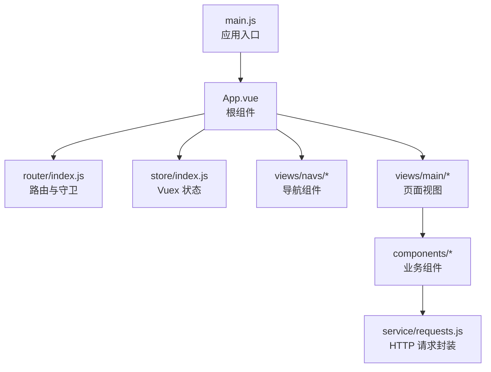
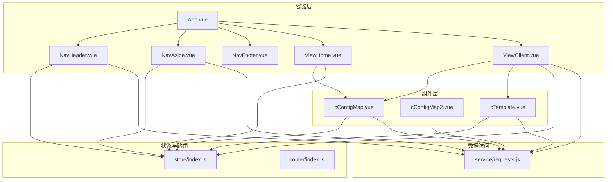
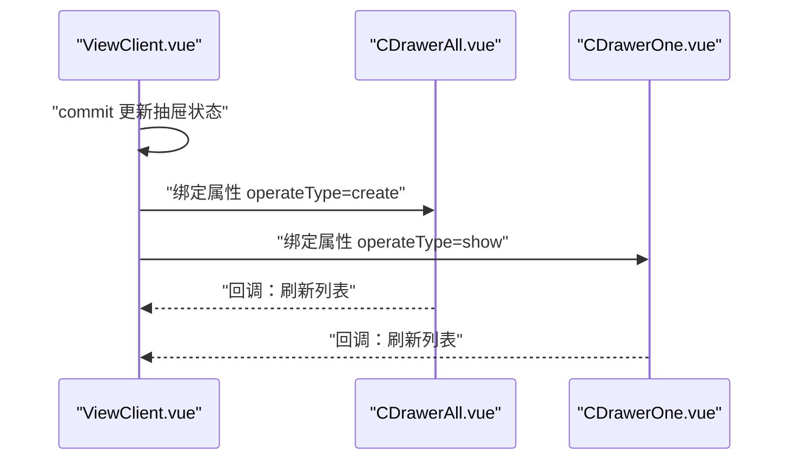
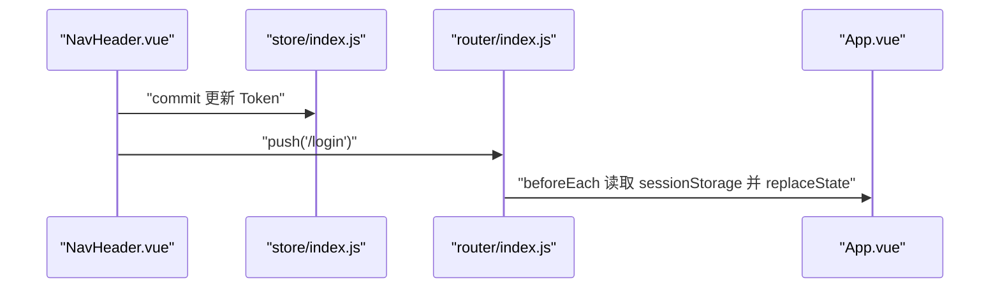
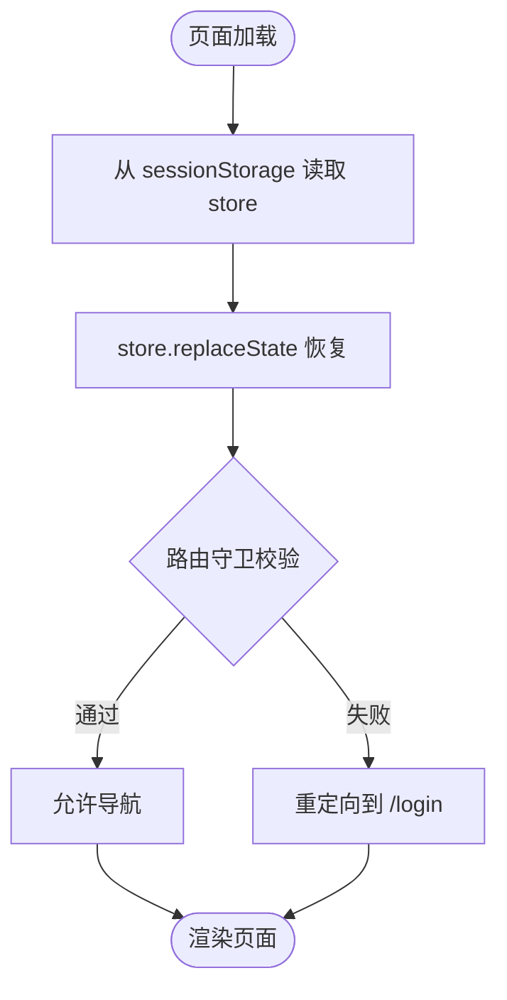
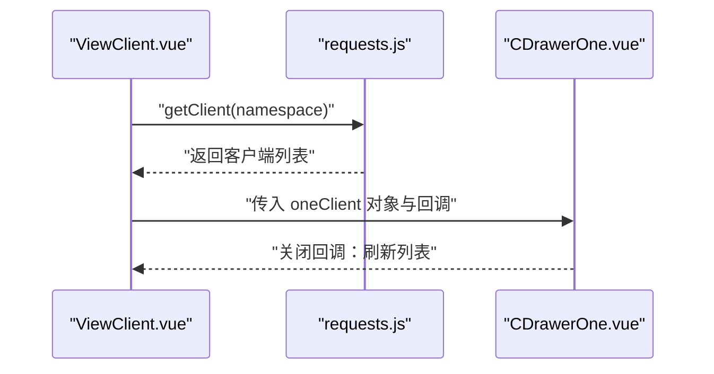
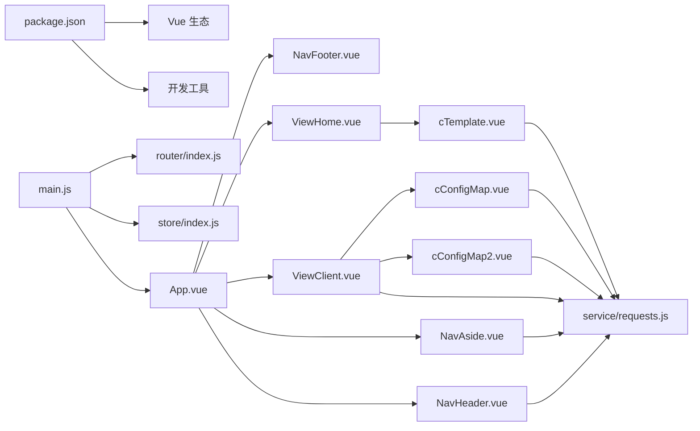

# 组件架构设计

<cite>
**本文引用的文件**
- [main.js](file://vue/src/main.js)
- [App.vue](file://vue/src/App.vue)
- [package.json](file://vue/package.json)
- [vue.config.js](file://vue/vue.config.js)
- [router/index.js](file://vue/src/router/index.js)
- [store/index.js](file://vue/src/store/index.js)
- [views/navs/NavHeader.vue](file://vue/src/views/navs/NavHeader.vue)
- [views/navs/NavAside.vue](file://vue/src/views/navs/NavAside.vue)
- [views/navs/NavFooter.vue](file://vue/src/views/navs/NavFooter.vue)
- [components/cConfigMap.vue](file://vue/src/components/cConfigMap.vue)
- [components/cConfigMap2.vue](file://vue/src/components/cConfigMap2.vue)
- [components/cTemplate.vue](file://vue/src/components/cTemplate.vue)
- [views/main/ViewClient.vue](file://vue/src/views/main/ViewClient.vue)
- [views/main/ViewHome.vue](file://vue/src/views/main/ViewHome.vue)
- [service/requests.js](file://vue/src/service/requests.js)
</cite>

## 目录
1. [简介](#简介)
2. [项目结构](#项目结构)
3. [核心组件](#核心组件)
4. [架构总览](#架构总览)
5. [组件详解](#组件详解)
6. [依赖关系分析](#依赖关系分析)
7. [性能考量](#性能考量)
8. [故障排查指南](#故障排查指南)
9. [结论](#结论)
10. [附录](#附录)

## 简介
本文件面向前端组件架构，系统性梳理 Vue.js 前端工程的组件分类、继承与复用策略、通信机制、状态管理与数据流、最佳实践与测试调试方法。重点覆盖以下主题：
- 组件分类与职责边界：布局导航、业务配置、模板编辑、客户端管理等
- 组件通信：父子、兄弟、跨层级通信与事件总线模式
- 状态管理与数据流：Vuex 状态、路由守卫、本地持久化
- 复用策略：通用组件、混入、插件、工具模块
- 最佳实践：命名规范、错误处理、性能优化、可测试性

## 项目结构
前端采用 Vue CLI 项目组织方式，核心目录与职责如下：
- src/main.js：应用入口，挂载根组件、引入插件与路由
- src/App.vue：根组件，提供全局依赖注入、路由视图重载能力、持久化状态恢复
- src/router/index.js：路由定义与全局前置守卫，基于 Vuex 状态与 sessionStorage 控制鉴权
- src/store/index.js：集中状态管理，维护步骤条、抽屉状态、命名空间、令牌与用户 ID
- src/views/navs/*：顶部、侧边、底部导航组件，负责页面骨架与导航
- src/components/*：可复用业务组件，如变量映射、模板编辑、客户端配置等
- src/views/main/*：主功能页面，如首页、客户端管理、JSON 渲染等
- src/service/requests.js：统一 API 请求封装，按命名空间聚合接口
- vue.config.js：构建配置，输出目录与静态资源路径、开发服务器参数

图表来源
- [main.js:1-32](file://vue/src/main.js#L1-L32)
- [App.vue:1-132](file://vue/src/App.vue#L1-L132)
- [router/index.js:1-139](file://vue/src/router/index.js#L1-L139)
- [store/index.js:1-49](file://vue/src/store/index.js#L1-L49)
- [service/requests.js:1-42](file://vue/src/service/requests.js#L1-L42)

章节来源
- [main.js:1-32](file://vue/src/main.js#L1-L32)
- [App.vue:1-132](file://vue/src/App.vue#L1-L132)
- [router/index.js:1-139](file://vue/src/router/index.js#L1-L139)
- [store/index.js:1-49](file://vue/src/store/index.js#L1-L49)
- [vue.config.js:1-14](file://vue/vue.config.js#L1-L14)
- [package.json:1-54](file://vue/package.json#L1-L54)

## 核心组件
- 根组件与容器
  - App.vue：提供全局依赖注入（如 reload）、根据路由切换头部显示、持久化 Vuex 状态
  - main.js：初始化插件、路由、Vuex，并挂载根组件
- 导航组件
  - NavHeader.vue：顶部导航菜单、命名空间展示、登录/登出、文档链接
  - NavAside.vue：左侧导航菜单、命名空间管理、对话框增删改查
  - NavFooter.vue：底部版权与版本信息
- 页面视图
  - ViewHome.vue：首页入口、模拟推送
  - ViewClient.vue：客户端列表与详情、抽屉交互
- 业务组件
  - cConfigMap.vue：变量映射 CRUD、保存与拉取
  - cConfigMap2.vue：过境数据展开展示
  - cTemplate.vue：模板内容与聚合开关
- 状态与路由
  - store/index.js：集中状态与 getters/mutations
  - router/index.js：路由守卫、鉴权与状态恢复

章节来源
- [App.vue:1-132](file://vue/src/App.vue#L1-L132)
- [main.js:1-32](file://vue/src/main.js#L1-L32)
- [views/navs/NavHeader.vue:1-195](file://vue/src/views/navs/NavHeader.vue#L1-L195)
- [views/navs/NavAside.vue:1-265](file://vue/src/views/navs/NavAside.vue#L1-L265)
- [views/navs/NavFooter.vue:1-54](file://vue/src/views/navs/NavFooter.vue#L1-L54)
- [views/main/ViewHome.vue:1-47](file://vue/src/views/main/ViewHome.vue#L1-L47)
- [views/main/ViewClient.vue:1-266](file://vue/src/views/main/ViewClient.vue#L1-L266)
- [components/cConfigMap.vue:1-245](file://vue/src/components/cConfigMap.vue#L1-L245)
- [components/cConfigMap2.vue:1-180](file://vue/src/components/cConfigMap2.vue#L1-L180)
- [components/cTemplate.vue:1-141](file://vue/src/components/cTemplate.vue#L1-L141)
- [store/index.js:1-49](file://vue/src/store/index.js#L1-L49)
- [router/index.js:1-139](file://vue/src/router/index.js#L1-L139)

## 架构总览
整体采用“容器-组件”分层：
- 容器层：App.vue、导航组件、页面视图
- 组件层：通用业务组件（变量映射、模板、客户端抽屉等）
- 数据层：Vuex 状态、路由守卫、本地持久化、HTTP 服务封装

图表来源
- [App.vue:1-132](file://vue/src/App.vue#L1-L132)
- [views/navs/NavHeader.vue:1-195](file://vue/src/views/navs/NavHeader.vue#L1-L195)
- [views/navs/NavAside.vue:1-265](file://vue/src/views/navs/NavAside.vue#L1-L265)
- [views/main/ViewHome.vue:1-47](file://vue/src/views/main/ViewHome.vue#L1-L47)
- [views/main/ViewClient.vue:1-266](file://vue/src/views/main/ViewClient.vue#L1-L266)
- [components/cConfigMap.vue:1-245](file://vue/src/components/cConfigMap.vue#L1-L245)
- [components/cConfigMap2.vue:1-180](file://vue/src/components/cConfigMap2.vue#L1-L180)
- [components/cTemplate.vue:1-141](file://vue/src/components/cTemplate.vue#L1-L141)
- [store/index.js:1-49](file://vue/src/store/index.js#L1-L49)
- [router/index.js:1-139](file://vue/src/router/index.js#L1-L139)
- [service/requests.js:1-42](file://vue/src/service/requests.js#L1-L42)

## 组件详解

### 组件分类与职责
- 布局与导航
  - App.vue：提供全局依赖注入（reload）、根据路由切换头部显示、持久化 Vuex 状态
  - NavHeader.vue：顶部菜单、命名空间展示、登录/登出、文档链接
  - NavAside.vue：左侧菜单、命名空间管理、对话框增删改查
  - NavFooter.vue：底部版权与版本信息
- 页面视图
  - ViewHome.vue：首页入口、模拟推送
  - ViewClient.vue：客户端列表与详情、抽屉交互
- 业务组件
  - cConfigMap.vue：变量映射 CRUD、保存与拉取
  - cConfigMap2.vue：过境数据展开展示
  - cTemplate.vue：模板内容与聚合开关

章节来源
- [App.vue:1-132](file://vue/src/App.vue#L1-L132)
- [views/navs/NavHeader.vue:1-195](file://vue/src/views/navs/NavHeader.vue#L1-L195)
- [views/navs/NavAside.vue:1-265](file://vue/src/views/navs/NavAside.vue#L1-L265)
- [views/navs/NavFooter.vue:1-54](file://vue/src/views/navs/NavFooter.vue#L1-L54)
- [views/main/ViewHome.vue:1-47](file://vue/src/views/main/ViewHome.vue#L1-L47)
- [views/main/ViewClient.vue:1-266](file://vue/src/views/main/ViewClient.vue#L1-L266)
- [components/cConfigMap.vue:1-245](file://vue/src/components/cConfigMap.vue#L1-L245)
- [components/cConfigMap2.vue:1-180](file://vue/src/components/cConfigMap2.vue#L1-L180)
- [components/cTemplate.vue:1-141](file://vue/src/components/cTemplate.vue#L1-L141)

### 组件通信机制

#### 父子组件通信
- App.vue 通过 provide/inject 向后代组件注入 reload 方法，避免 props 下钻
- ViewClient.vue 作为父组件，向 CDrawerAll、CDrawerOne 传递属性与回调，实现抽屉控制与数据回传
- cConfigMap.vue、cTemplate.vue 通过 props 接收命名空间与初始数据，通过事件或请求与父组件协作

图表来源
- [views/main/ViewClient.vue:1-266](file://vue/src/views/main/ViewClient.vue#L1-L266)

章节来源
- [App.vue:54-69](file://vue/src/App.vue#L54-L69)
- [views/main/ViewClient.vue:1-266](file://vue/src/views/main/ViewClient.vue#L1-L266)

#### 兄弟组件通信
- 通过共享父组件状态与回调函数实现：ViewClient.vue 作为中介，协调抽屉组件与列表数据
- NavAside.vue 与 NavHeader.vue 通过 Vuex 共享命名空间状态，实现跨组件联动

章节来源
- [views/main/ViewClient.vue:1-266](file://vue/src/views/main/ViewClient.vue#L1-L266)
- [views/navs/NavHeader.vue:1-195](file://vue/src/views/navs/NavHeader.vue#L1-L195)
- [views/navs/NavAside.vue:1-265](file://vue/src/views/navs/NavAside.vue#L1-L265)
- [store/index.js:1-49](file://vue/src/store/index.js#L1-L49)

#### 跨层级通信与事件总线
- App.vue 使用 provide/inject 提供 reload，NavAside.vue 注入并调用以刷新当前路由视图
- 登录/登出：NavHeader.vue 触发登出请求并更新 Vuex，随后路由跳转至登录页

图表来源
- [views/navs/NavHeader.vue:153-174](file://vue/src/views/navs/NavHeader.vue#L153-L174)
- [store/index.js:23-44](file://vue/src/store/index.js#L23-L44)
- [router/index.js:109-136](file://vue/src/router/index.js#L109-L136)
- [App.vue:79-88](file://vue/src/App.vue#L79-L88)

### 状态管理与数据流
- Vuex 状态
  - 维护 StepsActive、DrawerStatus、Namespace、Token、UserID 等
  - 通过 getters 获取状态，mutations 修改状态
- 路由守卫
  - 在 beforeEach 中读取 sessionStorage 恢复 store，无 token 时重定向登录
- 本地持久化
  - App.vue 在 created 中从 sessionStorage 恢复状态，在 beforeunload 写回

图表来源
- [router/index.js:109-136](file://vue/src/router/index.js#L109-L136)
- [App.vue:79-88](file://vue/src/App.vue#L79-L88)
- [store/index.js:1-49](file://vue/src/store/index.js#L1-L49)

章节来源
- [store/index.js:1-49](file://vue/src/store/index.js#L1-L49)
- [router/index.js:109-136](file://vue/src/router/index.js#L109-L136)
- [App.vue:79-88](file://vue/src/App.vue#L79-L88)

### 功能组件实现细节

#### 客户端配置组件（ViewClient.vue）
- 职责：展示客户端列表、切换激活状态、打开抽屉新增/查看详情、删除客户端
- 实现要点：
  - 通过请求封装获取/更新客户端数据
  - 抽屉组件通过 props 与回调与父组件交互
  - 对示例数据进行特殊处理，避免误删

图表来源
- [views/main/ViewClient.vue:1-266](file://vue/src/views/main/ViewClient.vue#L1-L266)
- [service/requests.js:21-28](file://vue/src/service/requests.js#L21-L28)

章节来源
- [views/main/ViewClient.vue:1-266](file://vue/src/views/main/ViewClient.vue#L1-L266)
- [service/requests.js:21-28](file://vue/src/service/requests.js#L21-L28)

#### 模板编辑组件（cTemplate.vue）
- 职责：编辑消息模板内容与聚合开关，保存/拉取模板
- 实现要点：
  - 初始化默认模板内容与聚合开关
  - 通过命名空间区分不同通道的数据

章节来源
- [components/cTemplate.vue:1-141](file://vue/src/components/cTemplate.vue#L1-L141)
- [service/requests.js:16-18](file://vue/src/service/requests.js#L16-L18)

#### 配置映射组件（cConfigMap.vue）
- 职责：维护变量映射表，支持新增、删除、保存、拉取
- 实现要点：
  - 表单校验与键值封装
  - 保存时将映射列表上传至后端，拉取时回填到表格

章节来源
- [components/cConfigMap.vue:1-245](file://vue/src/components/cConfigMap.vue#L1-L245)
- [service/requests.js:11-14](file://vue/src/service/requests.js#L11-L14)

#### 过境数据组件（cConfigMap2.vue）
- 职责：展示服务端劫持的过境数据，支持手动刷新
- 实现要点：
  - 将服务端返回的键值映射转换为表格数据

章节来源
- [components/cConfigMap2.vue:1-180](file://vue/src/components/cConfigMap2.vue#L1-L180)
- [service/requests.js:11-14](file://vue/src/service/requests.js#L11-L14)

### 组件继承关系与复用策略
- 组件间无继承关系，主要通过组合与复用实现：
  - 复用：通用业务组件（变量映射、模板、客户端抽屉）在多个页面复用
  - 插槽与 props：通过插槽与属性传递实现灵活复用
  - 工具与服务：统一的请求封装与校验工具提升复用度

章节来源
- [components/cConfigMap.vue:1-245](file://vue/src/components/cConfigMap.vue#L1-L245)
- [components/cTemplate.vue:1-141](file://vue/src/components/cTemplate.vue#L1-L141)
- [views/main/ViewClient.vue:1-266](file://vue/src/views/main/ViewClient.vue#L1-L266)
- [service/requests.js:1-42](file://vue/src/service/requests.js#L1-L42)

## 依赖关系分析
- 外部依赖
  - Vue 生态：Vue 2.6、Vue Router 3、Vuex 3、Element UI
  - 开发工具：@vue/cli-service、eslint、babel
- 内部依赖
  - main.js 依赖 router、store、App
  - App.vue 依赖导航组件、store、provide/inject
  - 各页面与组件依赖 service/requests.js 进行数据访问
  - 路由守卫依赖 store 与 sessionStorage

图表来源
- [package.json:1-54](file://vue/package.json#L1-L54)
- [main.js:1-32](file://vue/src/main.js#L1-L32)
- [router/index.js:1-139](file://vue/src/router/index.js#L1-L139)
- [store/index.js:1-49](file://vue/src/store/index.js#L1-L49)
- [App.vue:1-132](file://vue/src/App.vue#L1-L132)
- [views/navs/NavHeader.vue:1-195](file://vue/src/views/navs/NavHeader.vue#L1-L195)
- [views/navs/NavAside.vue:1-265](file://vue/src/views/navs/NavAside.vue#L1-L265)
- [views/navs/NavFooter.vue:1-54](file://vue/src/views/navs/NavFooter.vue#L1-L54)
- [views/main/ViewHome.vue:1-47](file://vue/src/views/main/ViewHome.vue#L1-L47)
- [views/main/ViewClient.vue:1-266](file://vue/src/views/main/ViewClient.vue#L1-L266)
- [components/cConfigMap.vue:1-245](file://vue/src/components/cConfigMap.vue#L1-L245)
- [components/cConfigMap2.vue:1-180](file://vue/src/components/cConfigMap2.vue#L1-L180)
- [components/cTemplate.vue:1-141](file://vue/src/components/cTemplate.vue#L1-L141)
- [service/requests.js:1-42](file://vue/src/service/requests.js#L1-L42)

章节来源
- [package.json:1-54](file://vue/package.json#L1-L54)
- [main.js:1-32](file://vue/src/main.js#L1-L32)
- [router/index.js:1-139](file://vue/src/router/index.js#L1-L139)
- [store/index.js:1-49](file://vue/src/store/index.js#L1-L49)
- [service/requests.js:1-42](file://vue/src/service/requests.js#L1-L42)

## 性能考量
- 路由视图重载：通过 provide/inject 的 reload 方法避免整页刷新，仅重载 router-view
- 本地持久化：在 beforeunload 时写回 Vuex 状态，减少重复请求
- 组件懒加载：路由按需加载页面组件，降低首屏体积
- 表格与输入：合理使用 Element UI 组件，避免不必要的重渲染

章节来源
- [App.vue:54-69](file://vue/src/App.vue#L54-L69)
- [App.vue:79-88](file://vue/src/App.vue#L79-L88)
- [router/index.js:18-28](file://vue/src/router/index.js#L18-L28)

## 故障排查指南
- 登录/鉴权问题
  - 现象：进入受保护页面被重定向到登录
  - 排查：确认 sessionStorage 是否存在 store；检查路由守卫逻辑
- 命名空间切换无效
  - 现象：切换命名空间后页面未刷新
  - 排查：确认 NavAside.vue 是否调用注入的 reload；检查 Vuex 中 Namespace 是否更新
- 数据未更新
  - 现象：新增/删除/修改后表格未刷新
  - 排查：确认组件是否调用刷新方法（如 PullVarData、GetClientList）；检查请求封装与后端响应
- 登出异常
  - 现象：登出后仍显示登录态
  - 排查：确认 NavHeader.vue 是否正确提交 Token 空值并跳转登录

章节来源
- [router/index.js:109-136](file://vue/src/router/index.js#L109-L136)
- [views/navs/NavAside.vue:183-191](file://vue/src/views/navs/NavAside.vue#L183-L191)
- [views/navs/NavHeader.vue:153-174](file://vue/src/views/navs/NavHeader.vue#L153-L174)
- [components/cConfigMap.vue:183-209](file://vue/src/components/cConfigMap.vue#L183-L209)
- [views/main/ViewClient.vue:210-226](file://vue/src/views/main/ViewClient.vue#L210-L226)

## 结论
本项目采用清晰的容器-组件分层与统一的状态管理，结合路由守卫与本地持久化，实现了良好的可维护性与用户体验。建议持续完善：
- 单元测试与集成测试覆盖关键组件与请求封装
- 统一错误处理与全局提示
- 组件 API 文档与变更日志

## 附录

### 组件开发最佳实践
- 命名规范
  - 组件文件与名称使用帕斯卡命名，如 cConfigMap.vue
  - 属性命名采用驼峰，事件命名使用 kebab-case
- 状态管理
  - 将跨组件共享状态放入 Vuex；局部状态尽量留在组件内部
  - mutations 仅做同步状态变更，异步逻辑放入 actions 或组件内
- 通信约定
  - 父子通信优先使用 props 与 emit；跨层级通信使用 provide/inject
  - 避免深层 props 下钻，必要时通过 store 或插件传递
- 错误处理
  - 统一在请求封装中处理错误并提示
  - 对用户敏感操作增加二次确认
- 性能优化
  - 合理使用计算属性与缓存
  - 表格与大列表使用虚拟滚动或分页
- 可测试性
  - 将副作用（网络请求、本地存储）抽象为可注入的服务
  - 为关键组件提供稳定且明确的 props 与事件契约

### 代码规范与 ESLint
- 项目已配置 ESLint 插件与规则，遵循 Vue essential 规范
- 建议在团队内统一缩进、注释与导入顺序

章节来源
- [package.json:34-47](file://vue/package.json#L34-L47)