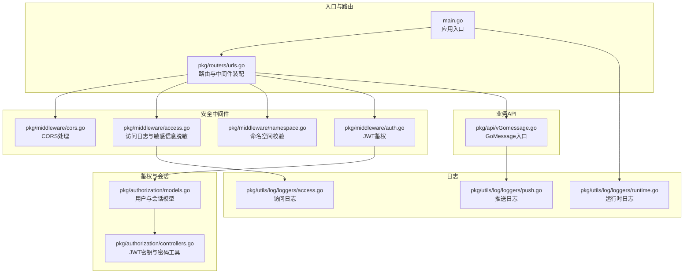
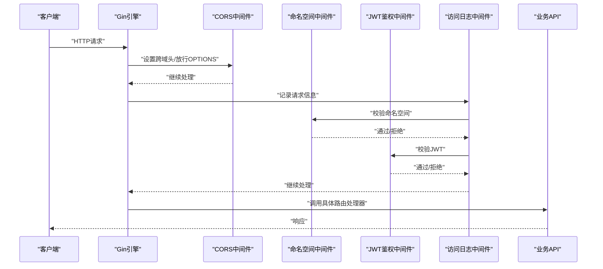
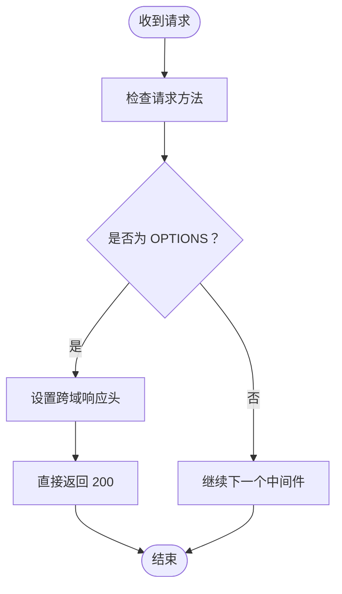
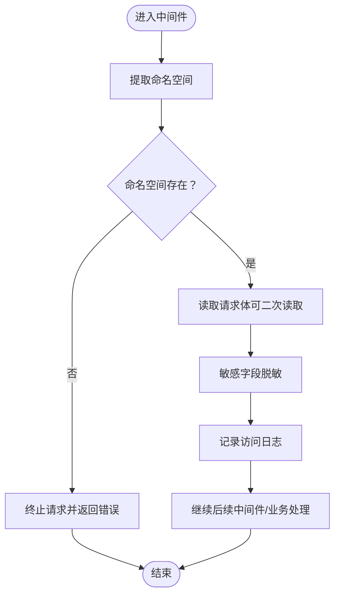
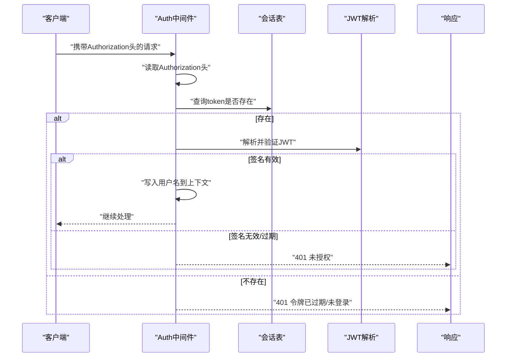
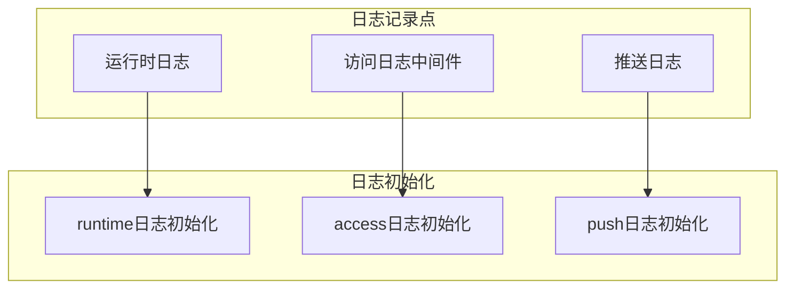
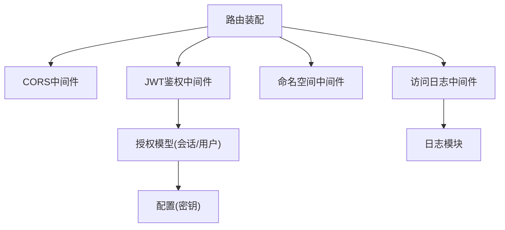

# API 安全防护

<cite>
**本文引用的文件**
- [main.go](file://main.go)
- [pkg/routers/urls.go](file://pkg/routers/urls.go)
- [pkg/middleware/cors.go](file://pkg/middleware/cors.go)
- [pkg/middleware/access.go](file://pkg/middleware/access.go)
- [pkg/middleware/auth.go](file://pkg/middleware/auth.go)
- [pkg/middleware/namespace.go](file://pkg/middleware/namespace.go)
- [pkg/authorization/models.go](file://pkg/authorization/models.go)
- [pkg/authorization/controllers.go](file://pkg/authorization/controllers.go)
- [pkg/utils/response.go](file://pkg/utils/response.go)
- [config/default.yaml](file://config/default.yaml)
- [pkg/utils/log/loggers/access.go](file://pkg/utils/log/loggers/access.go)
- [pkg/utils/log/loggers/push.go](file://pkg/utils/log/loggers/push.go)
- [pkg/utils/log/loggers/runtime.go](file://pkg/utils/log/loggers/runtime.go)
- [pkg/api/vGomessage.go](file://pkg/api/vGomessage.go)
</cite>

## 目录
1. [简介](#简介)
2. [项目结构](#项目结构)
3. [核心组件](#核心组件)
4. [架构总览](#架构总览)
5. [详细组件分析](#详细组件分析)
6. [依赖分析](#依赖分析)
7. [性能考虑](#性能考虑)
8. [故障排查指南](#故障排查指南)
9. [结论](#结论)
10. [附录](#附录)

## 简介
本文件聚焦于本项目的 API 安全防护体系，系统性梳理访问控制、跨域处理、安全中间件、安全头策略、鉴权与会话管理、敏感信息脱敏与日志审计等关键环节。文档以代码为依据，结合架构图与流程图，帮助开发者与运维人员快速理解并优化安全配置。

## 项目结构
后端采用 Gin 框架，通过中间件统一接入安全与可观测性能力；路由按业务域划分，鉴权与命名空间校验作为通用中间件在多组路由上复用；日志模块独立初始化，分别输出访问、运行时与推送日志，便于审计与问题定位。

图表来源
- [main.go:37-55](file://main.go#L37-L55)
- [pkg/routers/urls.go:21-108](file://pkg/routers/urls.go#L21-L108)
- [pkg/middleware/cors.go:8-28](file://pkg/middleware/cors.go#L8-L28)
- [pkg/middleware/access.go:23-71](file://pkg/middleware/access.go#L23-L71)
- [pkg/middleware/auth.go:12-61](file://pkg/middleware/auth.go#L12-L61)
- [pkg/middleware/namespace.go:20-46](file://pkg/middleware/namespace.go#L20-L46)
- [pkg/authorization/models.go:99-134](file://pkg/authorization/models.go#L99-L134)
- [pkg/authorization/controllers.go:10-40](file://pkg/authorization/controllers.go#L10-L40)
- [pkg/utils/log/loggers/access.go:13-58](file://pkg/utils/log/loggers/access.go#L13-L58)
- [pkg/utils/log/loggers/push.go:13-58](file://pkg/utils/log/loggers/push.go#L13-L58)
- [pkg/utils/log/loggers/runtime.go:13-112](file://pkg/utils/log/loggers/runtime.go#L13-L112)
- [pkg/api/vGomessage.go:20-172](file://pkg/api/vGomessage.go#L20-L172)

章节来源
- [main.go:37-55](file://main.go#L37-L55)
- [pkg/routers/urls.go:21-108](file://pkg/routers/urls.go#L21-L108)

## 核心组件
- CORS 中间件：统一设置跨域响应头，放行 OPTIONS 预检请求，允许凭据。
- 访问日志中间件：记录请求耗时、状态码、客户端 IP、方法、路径、路由与脱敏后的请求体。
- JWT 鉴权中间件：校验 Authorization 头、解析并验证 JWT，核对会话表以判定令牌有效性。
- 命名空间中间件：校验命名空间存在性，避免越权或误用。
- 配置与常量：JWT 密钥、服务监听地址、日志路径等集中于配置文件。
- 日志模块：独立初始化访问、运行时与推送日志，支持 JSON 文本格式与 ES 输出钩子。

章节来源
- [pkg/middleware/cors.go:8-28](file://pkg/middleware/cors.go#L8-L28)
- [pkg/middleware/access.go:23-71](file://pkg/middleware/access.go#L23-L71)
- [pkg/middleware/auth.go:12-61](file://pkg/middleware/auth.go#L12-L61)
- [pkg/middleware/namespace.go:20-46](file://pkg/middleware/namespace.go#L20-L46)
- [config/default.yaml:11-21](file://config/default.yaml#L11-L21)
- [pkg/utils/log/loggers/access.go:13-58](file://pkg/utils/log/loggers/access.go#L13-L58)
- [pkg/utils/log/loggers/runtime.go:13-112](file://pkg/utils/log/loggers/runtime.go#L13-L112)
- [pkg/utils/log/loggers/push.go:13-58](file://pkg/utils/log/loggers/push.go#L13-L58)

## 架构总览
下图展示请求在进入业务处理前的关键安全与可观测性链路，以及与鉴权、命名空间校验、CORS 和访问日志的交互关系。

图表来源
- [pkg/routers/urls.go:27-28](file://pkg/routers/urls.go#L27-L28)
- [pkg/middleware/cors.go:9-27](file://pkg/middleware/cors.go#L9-L27)
- [pkg/middleware/namespace.go:21-45](file://pkg/middleware/namespace.go#L21-L45)
- [pkg/middleware/auth.go:12-61](file://pkg/middleware/auth.go#L12-L61)
- [pkg/middleware/access.go:23-71](file://pkg/middleware/access.go#L23-L71)
- [pkg/api/vGomessage.go:20-172](file://pkg/api/vGomessage.go#L20-L172)

## 详细组件分析

### CORS 跨域处理机制
- 统一响应头设置：允许来源、头部、方法、暴露头部与凭据。
- 预检放行：对 OPTIONS 方法直接返回成功，避免重复校验。
- 影响范围：全局中间件，所有路由均受其影响。

图表来源
- [pkg/middleware/cors.go:9-27](file://pkg/middleware/cors.go#L9-L27)

章节来源
- [pkg/middleware/cors.go:8-28](file://pkg/middleware/cors.go#L8-L28)

### 访问控制与安全中间件
- 命名空间校验：根据路径推断默认命名空间或从参数提取，若不存在则中断并返回错误响应。
- 访问日志：记录起止时间、耗时、状态码、客户端 IP、方法、路径、路由与脱敏后的请求体。
- 敏感信息脱敏：对 password、secret、token、authorization 字段进行掩码处理，限制最大长度。

图表来源
- [pkg/middleware/namespace.go:21-45](file://pkg/middleware/namespace.go#L21-L45)
- [pkg/middleware/access.go:23-71](file://pkg/middleware/access.go#L23-L71)

章节来源
- [pkg/middleware/namespace.go:20-46](file://pkg/middleware/namespace.go#L20-L46)
- [pkg/middleware/access.go:13-21](file://pkg/middleware/access.go#L13-L21)
- [pkg/middleware/access.go:23-71](file://pkg/middleware/access.go#L23-L71)

### JWT 鉴权与会话管理
- 请求头校验：要求存在 Authorization 头且非空。
- 会话核验：查询会话表，若不存在则视为未登录或已注销。
- JWT 解析与验证：限定签名算法，使用配置密钥进行签名校验，校验失败返回未授权。
- 成功后注入上下文：将用户名写入上下文供后续处理器使用。

图表来源
- [pkg/middleware/auth.go:12-61](file://pkg/middleware/auth.go#L12-L61)
- [pkg/authorization/models.go:130-134](file://pkg/authorization/models.go#L130-L134)
- [pkg/authorization/controllers.go:10-12](file://pkg/authorization/controllers.go#L10-L12)

章节来源
- [pkg/middleware/auth.go:12-61](file://pkg/middleware/auth.go#L12-L61)
- [pkg/authorization/models.go:99-134](file://pkg/authorization/models.go#L99-L134)
- [pkg/authorization/controllers.go:10-40](file://pkg/authorization/controllers.go#L10-L40)

### 安全日志与审计
- 访问日志：记录请求耗时、状态码、客户端 IP、方法、路径、路由与脱敏请求体，支持输出到文件与 ES。
- 运行时日志：统一输出到标准输出与文件，支持 JSON/文本格式切换。
- 推送日志：记录消息推送过程中的内容，便于追踪与审计。

图表来源
- [pkg/utils/log/loggers/access.go:15-58](file://pkg/utils/log/loggers/access.go#L15-L58)
- [pkg/utils/log/loggers/runtime.go:15-112](file://pkg/utils/log/loggers/runtime.go#L15-L112)
- [pkg/utils/log/loggers/push.go:15-58](file://pkg/utils/log/loggers/push.go#L15-L58)
- [pkg/middleware/access.go:58-68](file://pkg/middleware/access.go#L58-L68)

章节来源
- [pkg/utils/log/loggers/access.go:13-58](file://pkg/utils/log/loggers/access.go#L13-L58)
- [pkg/utils/log/loggers/runtime.go:13-112](file://pkg/utils/log/loggers/runtime.go#L13-L112)
- [pkg/utils/log/loggers/push.go:13-58](file://pkg/utils/log/loggers/push.go#L13-L58)
- [pkg/middleware/access.go:58-68](file://pkg/middleware/access.go#L58-L68)

### API 安全配置最佳实践
- 输入验证与数据绑定：业务入口对请求体进行合法性校验，非法 JSON 返回错误响应。
- SQL 注入防护：ORM 使用参数化查询，避免拼接 SQL；会话与用户模型通过 ORM 访问数据库。
- XSS 防护：前端负责渲染与输出编码，后端对敏感字段进行日志脱敏，降低敏感信息泄露风险。
- 速率限制与 IP 白名单：当前仓库未实现速率限制与 IP 白名单中间件，建议在网关或前置代理层实现，或在 Gin 层增加自定义中间件进行限流与来源校验。
- 请求签名验证：当前仓库未实现签名中间件，建议在网关或前置代理层引入 HMAC 签名校验，或在 Gin 中实现基于密钥的签名中间件。

章节来源
- [pkg/api/vGomessage.go:32-42](file://pkg/api/vGomessage.go#L32-L42)
- [pkg/authorization/models.go:28-48](file://pkg/authorization/models.go#L28-L48)

### 安全头配置与作用
- Content-Security-Policy：用于限制资源加载来源，减少 XSS 风险。
- X-Frame-Options：防止点击劫持，禁止页面被嵌入 iframe。
- X-Content-Type-Options：阻止 MIME 类型嗅探，降低混合内容攻击风险。
- 当前实现：CORS 中间件未设置上述安全头，建议在生产环境补充安全头设置，或在网关/反向代理层统一注入。

章节来源
- [pkg/middleware/cors.go:13-17](file://pkg/middleware/cors.go#L13-L17)

## 依赖分析
- 中间件装配：路由层统一挂载 CORS、访问日志、命名空间与鉴权中间件，形成统一的安全与可观测性边界。
- 鉴权依赖：Auth 中间件依赖会话表与 JWT 密钥配置，会话表由授权模块提供查询接口。
- 日志依赖：访问日志中间件依赖日志初始化模块，日志模块支持文件与 ES 输出。

图表来源
- [pkg/routers/urls.go:27-28](file://pkg/routers/urls.go#L27-L28)
- [pkg/middleware/auth.go:12-61](file://pkg/middleware/auth.go#L12-L61)
- [pkg/authorization/models.go:130-134](file://pkg/authorization/models.go#L130-L134)
- [pkg/authorization/controllers.go:10-12](file://pkg/authorization/controllers.go#L10-L12)
- [pkg/middleware/access.go:58-68](file://pkg/middleware/access.go#L58-L68)
- [pkg/utils/log/loggers/access.go:15-58](file://pkg/utils/log/loggers/access.go#L15-L58)

章节来源
- [pkg/routers/urls.go:27-28](file://pkg/routers/urls.go#L27-L28)
- [pkg/middleware/auth.go:12-61](file://pkg/middleware/auth.go#L12-L61)
- [pkg/authorization/models.go:130-134](file://pkg/authorization/models.go#L130-L134)
- [pkg/authorization/controllers.go:10-12](file://pkg/authorization/controllers.go#L10-L12)
- [pkg/middleware/access.go:58-68](file://pkg/middleware/access.go#L58-L68)
- [pkg/utils/log/loggers/access.go:15-58](file://pkg/utils/log/loggers/access.go#L15-L58)

## 性能考虑
- 中间件顺序：CORS 与访问日志应尽量前置，避免不必要的后续处理开销。
- 请求体读取：访问日志中间件通过 TeeReader 实现一次性读取并恢复流，避免阻塞后续处理器。
- 日志落盘：访问日志与运行时日志同时输出到文件与标准输出，ES 输出为可选钩子，建议在高并发场景谨慎启用 ES 输出以避免 I/O 压力。

章节来源
- [pkg/middleware/access.go:40-46](file://pkg/middleware/access.go#L40-L46)
- [pkg/utils/log/loggers/access.go:52-57](file://pkg/utils/log/loggers/access.go#L52-L57)
- [pkg/utils/log/loggers/runtime.go:51-56](file://pkg/utils/log/loggers/runtime.go#L51-L56)

## 故障排查指南
- 401 未授权
  - 检查 Authorization 头是否缺失或为空。
  - 核对 JWT 签名算法与密钥配置。
  - 确认会话表中是否存在该 token。
- 命名空间错误
  - 检查路径参数 namespace 是否正确。
  - 确认命名空间是否已创建。
- CORS 失败
  - 确认浏览器是否发送了预检请求。
  - 检查响应头是否包含允许的来源、方法与头部。
- 日志问题
  - 检查日志文件路径与权限。
  - 确认日志格式与级别配置。
  - 若启用 ES 输出，检查 ES 连接与索引格式。

章节来源
- [pkg/middleware/auth.go:18-25](file://pkg/middleware/auth.go#L18-L25)
- [pkg/middleware/auth.go:38-50](file://pkg/middleware/auth.go#L38-L50)
- [pkg/authorization/models.go:130-134](file://pkg/authorization/models.go#L130-L134)
- [pkg/middleware/namespace.go:30-41](file://pkg/middleware/namespace.go#L30-L41)
- [pkg/middleware/cors.go:13-17](file://pkg/middleware/cors.go#L13-L17)
- [pkg/utils/log/loggers/access.go:15-58](file://pkg/utils/log/loggers/access.go#L15-L58)
- [pkg/utils/log/loggers/runtime.go:15-112](file://pkg/utils/log/loggers/runtime.go#L15-L112)

## 结论
本项目通过中间件层实现了统一的 CORS、访问日志、命名空间校验与 JWT 鉴权能力，配合独立的日志模块与配置中心，形成了较为完整的 API 安全与可观测性基础。针对速率限制、IP 白名单与请求签名等高级安全需求，建议在网关或前置代理层实现，或在 Gin 层扩展相应中间件，以进一步提升整体安全性与合规性。

## 附录
- 配置项摘要
  - JWT 密钥：用于签发与验证 JWT。
  - 服务监听：主机与端口。
  - 日志路径：访问日志、运行时日志、推送日志文件路径。
- 响应模板
  - 成功/失败统一结构，便于前端与监控系统解析。

章节来源
- [config/default.yaml:11-21](file://config/default.yaml#L11-L21)
- [pkg/utils/response.go:3-27](file://pkg/utils/response.go#L3-L27)