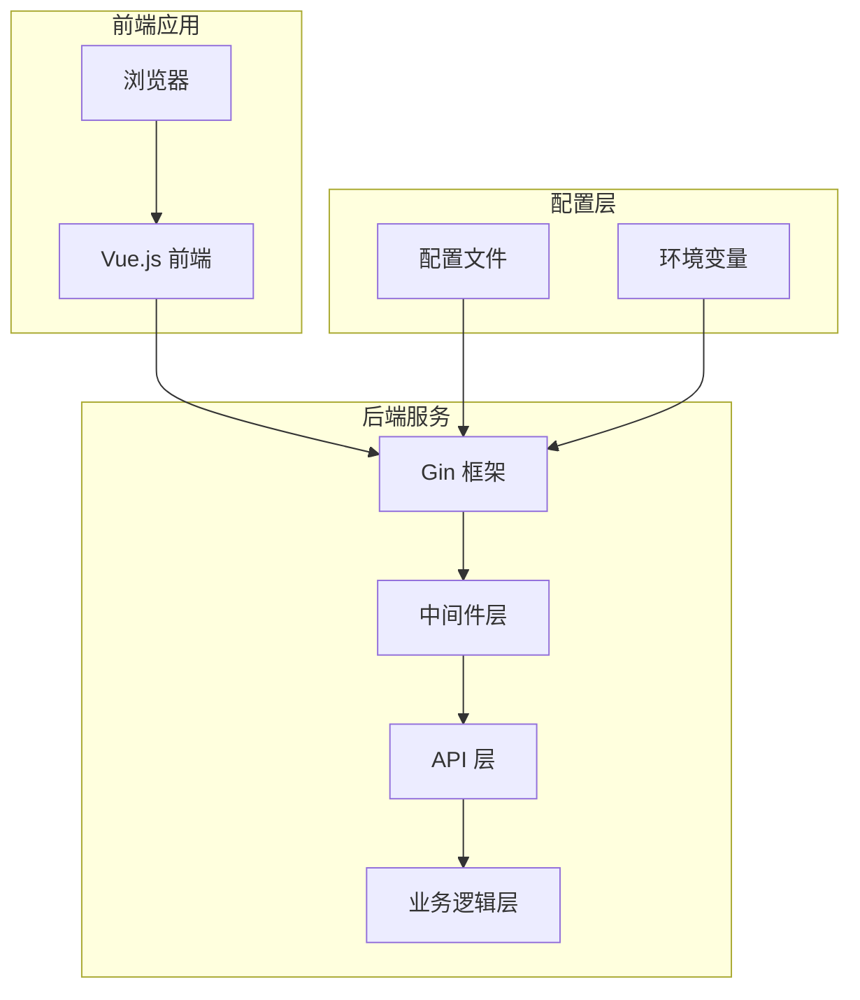
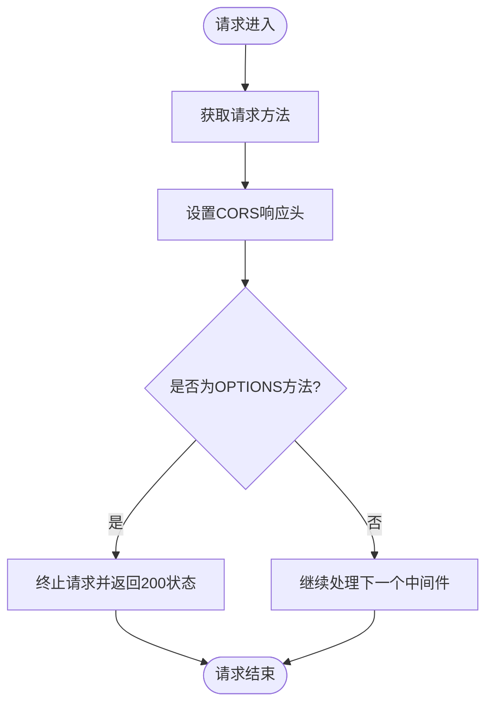
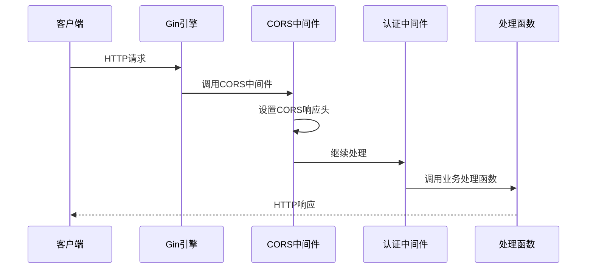
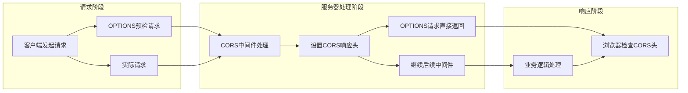
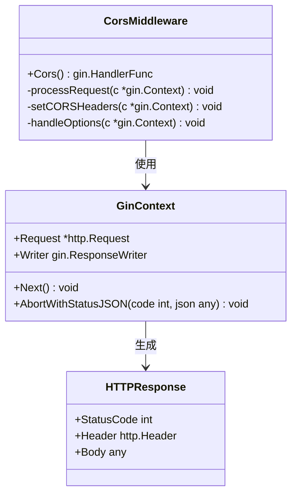
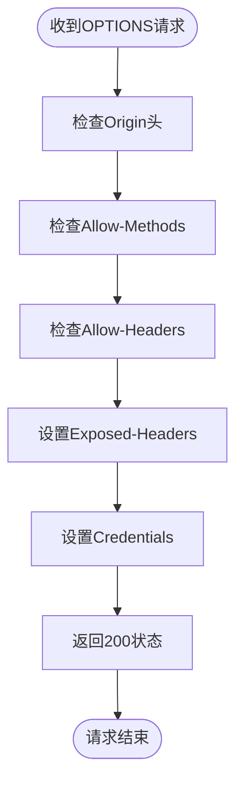
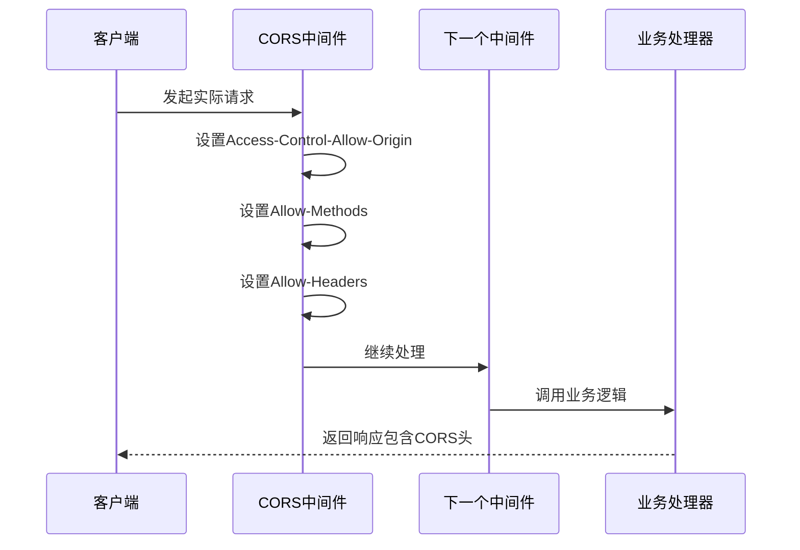
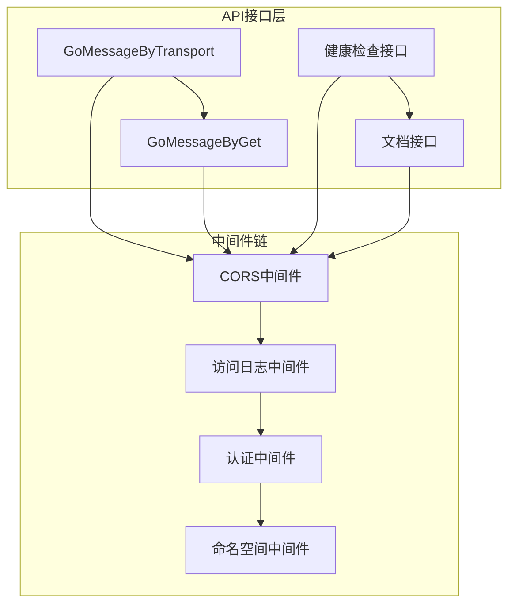
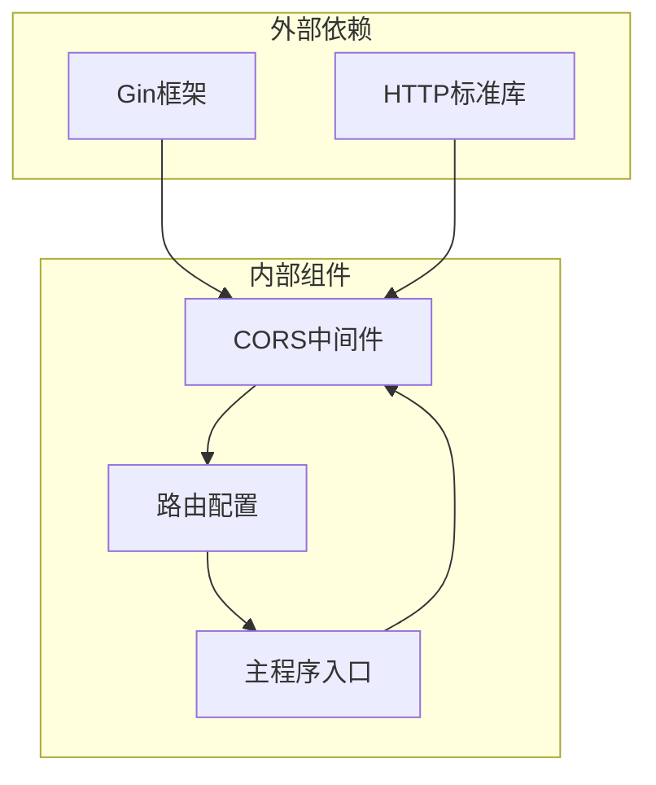
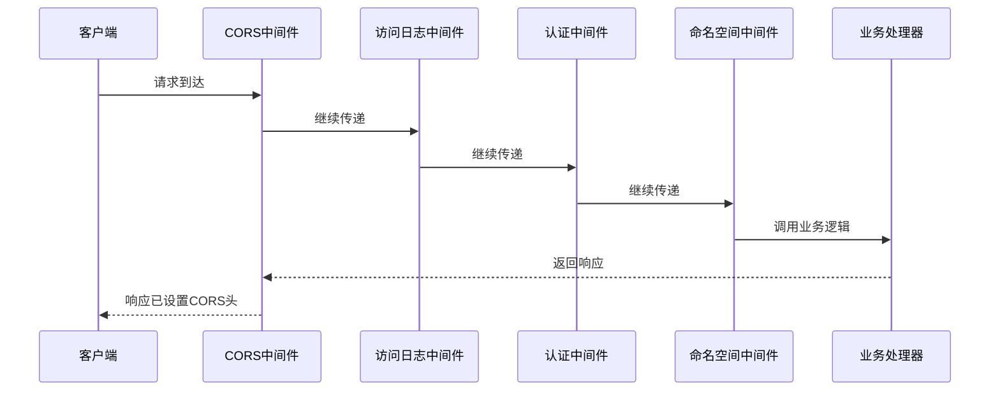

# CORS 跨域处理

<cite>
**本文档引用的文件**
- [cors.go](file://pkg/middleware/cors.go)
- [urls.go](file://pkg/routers/urls.go)
- [main.go](file://main.go)
- [default.yaml](file://config/default.yaml)
- [cmd.go](file://pkg/utils/initialize/cmd.go)
- [response.go](file://pkg/utils/response.go)
- [vGomessage.go](file://pkg/api/vGomessage.go)
</cite>

## 目录
1. [简介](#简介)
2. [项目结构](#项目结构)
3. [核心组件](#核心组件)
4. [架构概览](#架构概览)
5. [详细组件分析](#详细组件分析)
6. [依赖关系分析](#依赖关系分析)
7. [性能考虑](#性能考虑)
8. [故障排除指南](#故障排除指南)
9. [结论](#结论)

## 简介

CORS（跨域资源共享）是一种浏览器安全机制，用于控制来自不同源的 Web 页面对资源的访问权限。在现代 Web 开发中，前后端分离的应用架构越来越普遍，前端应用通常部署在不同的域名或端口上，这就会产生跨域请求场景。

本项目采用 Gin 框架的中间件机制实现了 CORS 跨域处理，通过统一的中间件拦截所有请求，自动添加必要的 CORS 响应头，确保前后端能够正常通信。

## 项目结构

该项目采用典型的三层架构设计，CORS 中间件位于中间层，负责处理所有 HTTP 请求的跨域问题：

**图表来源**
- [main.go:37-55](file://main.go#L37-L55)
- [urls.go:21-29](file://pkg/routers/urls.go#L21-L29)

**章节来源**
- [main.go:1-56](file://main.go#L1-L56)
- [urls.go:1-109](file://pkg/routers/urls.go#L1-L109)

## 核心组件

### CORS 中间件实现

项目的核心 CORS 实现位于 `pkg/middleware/cors.go` 文件中，这是一个标准的 Gin 中间件函数：

**图表来源**
- [cors.go:9-27](file://pkg/middleware/cors.go#L9-L27)

CORS 中间件主要包含以下关键特性：

1. **允许所有源访问**：使用通配符 `*` 允许来自任何源的请求
2. **支持多种请求方法**：包括 GET、POST、PUT、PATCH、DELETE 等
3. **预检请求处理**：自动处理 OPTIONS 预检请求
4. **凭据支持**：允许携带认证信息

**章节来源**
- [cors.go:1-29](file://pkg/middleware/cors.go#L1-L29)

### 路由配置集成

CORS 中间件在路由配置中被全局启用：

**图表来源**
- [urls.go:27-28](file://pkg/routers/urls.go#L27-L28)

**章节来源**
- [urls.go:21-29](file://pkg/routers/urls.go#L21-L29)

## 架构概览

### CORS 处理流程

CORS 在整个请求生命周期中的作用如下：

**图表来源**
- [cors.go:19-26](file://pkg/middleware/cors.go#L19-L26)

### 配置管理

系统通过多种配置方式管理 CORS 设置：

| 配置项 | 默认值 | 说明 |
|--------|--------|------|
| 允许源 | `*` | 允许来自任何域名的请求 |
| 允许方法 | `GET, POST, OPTIONS, PUT, PATCH, DELETE` | 支持的标准 HTTP 方法 |
| 允许头 | `Content-Type, AccessToken, X-CSRF-Token, Authorization, Token` | 允许的自定义请求头 |
| 凭据 | `true` | 允许携带 Cookie 和认证信息 |

**章节来源**
- [default.yaml:19-21](file://config/default.yaml#L19-L21)
- [cmd.go:46-98](file://pkg/utils/initialize/cmd.go#L46-L98)

## 详细组件分析

### CORS 中间件类图

**图表来源**
- [cors.go:9-27](file://pkg/middleware/cors.go#L9-L27)

### 预检请求处理流程

预检请求（OPTIONS）是 CORS 协议的重要组成部分：

**图表来源**
- [cors.go:13-23](file://pkg/middleware/cors.go#L13-L23)

### 实际请求处理流程

对于非预检请求，CORS 中间件主要负责设置响应头：

**图表来源**
- [cors.go:13-17](file://pkg/middleware/cors.go#L13-L17)

**章节来源**
- [cors.go:8-28](file://pkg/middleware/cors.go#L8-L28)

### API 接口与 CORS 集成

项目中的 API 接口都受益于全局 CORS 中间件：

**图表来源**
- [vGomessage.go:24-154](file://pkg/api/vGomessage.go#L24-L154)
- [urls.go:58-90](file://pkg/routers/urls.go#L58-L90)

**章节来源**
- [vGomessage.go:1-173](file://pkg/api/vGomessage.go#L1-L173)
- [urls.go:41-104](file://pkg/routers/urls.go#L41-L104)

## 依赖关系分析

### CORS 中间件依赖图

**图表来源**
- [cors.go:3-6](file://pkg/middleware/cors.go#L3-L6)
- [urls.go:3-12](file://pkg/routers/urls.go#L3-L12)
- [main.go:3-11](file://main.go#L3-L11)

### 中间件执行顺序

CORS 中间件在整个中间件链中的位置决定了其作用范围：

**图表来源**
- [urls.go:27-28](file://pkg/routers/urls.go#L27-L28)

**章节来源**
- [urls.go:26-29](file://pkg/routers/urls.go#L26-L29)

## 性能考虑

### CORS 中间件性能特征

CORS 中间件作为全局中间件，具有以下性能特点：

1. **低开销**：仅设置响应头，无复杂计算逻辑
2. **短路优化**：预检请求直接返回，避免不必要的处理
3. **内存友好**：不缓存请求数据，仅处理响应头
4. **CPU 效率**：字符串比较和头设置操作开销极小

### 性能优化建议

1. **避免过度宽泛的配置**：在生产环境中考虑限制允许的源
2. **合理设置暴露头**：仅暴露必要的响应头
3. **监控中间件链**：确保 CORS 中间件位于合适的位置

## 故障排除指南

### 常见 CORS 错误及解决方案

#### 1. 缺少必要的 CORS 头

**症状**：浏览器控制台出现 CORS 相关错误

**原因**：服务器未正确设置响应头

**解决方案**：检查 CORS 中间件是否正确配置

#### 2. 预检请求失败

**症状**：OPTIONS 预检请求返回 404 或 405

**原因**：预检请求未被正确处理

**解决方案**：确认 CORS 中间件在路由配置中正确启用

#### 3. 凭据相关问题

**症状**：携带 Cookie 的请求被拒绝

**原因**：CORS 配置不允许凭据或源设置为通配符

**解决方案**：在生产环境中设置具体的源，而不是使用通配符

### 调试技巧

1. **检查响应头**：使用浏览器开发者工具查看响应头
2. **查看网络面板**：观察预检请求和实际请求
3. **启用详细日志**：结合访问日志中间件进行调试

**章节来源**
- [response.go:1-28](file://pkg/utils/response.go#L1-L28)

## 结论

本项目的 CORS 实现采用了简洁而有效的中间件模式，通过全局启用的方式确保所有 API 接口都能正确处理跨域请求。这种设计具有以下优势：

1. **简单可靠**：中间件实现简洁，易于维护
2. **全面覆盖**：全局中间件确保所有路由都受益
3. **性能友好**：低开销的设计不影响请求处理速度
4. **易于扩展**：可以根据需要调整 CORS 配置

### 生产环境建议

虽然当前实现使用了宽松的 CORS 配置（允许所有源），但在生产环境中建议：

1. **限制允许源**：将 `Access-Control-Allow-Origin` 设置为具体的域名
2. **最小权限原则**：仅暴露必要的响应头
3. **安全审计**：定期审查 CORS 配置的安全性
4. **监控告警**：建立 CORS 相关的监控和告警机制

通过合理的 CORS 配置，可以在保证安全性的同时，确保前后端应用的正常通信。