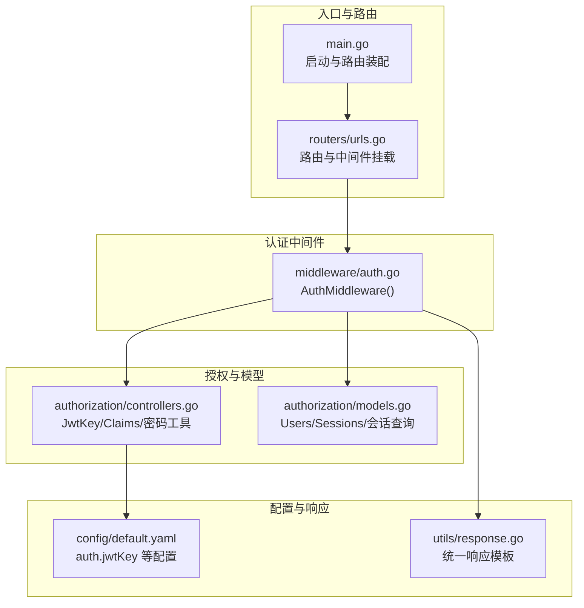
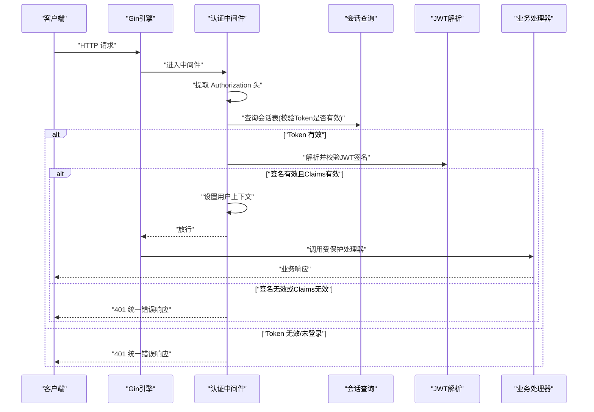
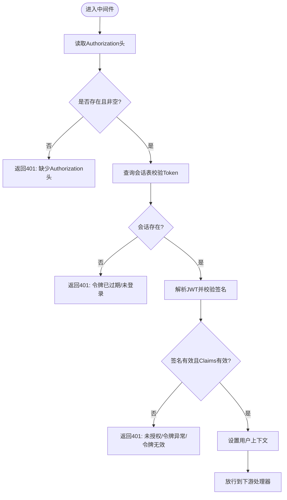
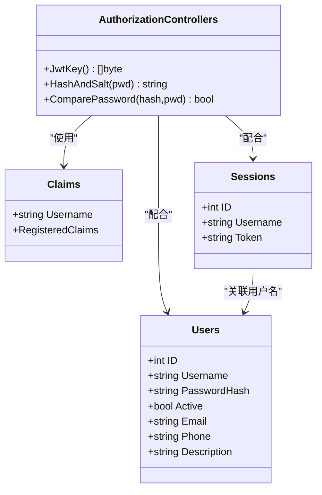
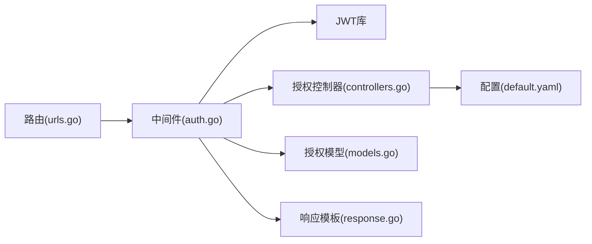
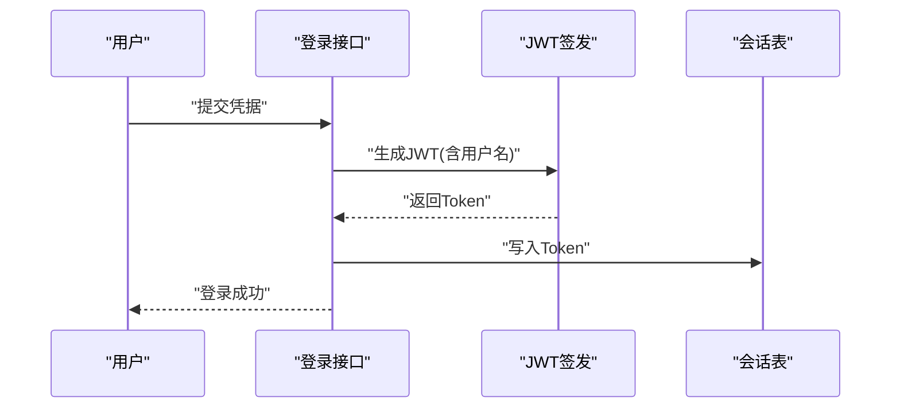

# 认证中间件

<cite>
**本文档引用的文件**
- [pkg/middleware/auth.go](file://pkg/middleware/auth.go)
- [pkg/authorization/controllers.go](file://pkg/authorization/controllers.go)
- [pkg/authorization/models.go](file://pkg/authorization/models.go)
- [pkg/routers/urls.go](file://pkg/routers/urls.go)
- [config/default.yaml](file://config/default.yaml)
- [pkg/utils/response.go](file://pkg/utils/response.go)
- [main.go](file://main.go)
- [pkg/utils/initialize/cmd.go](file://pkg/utils/initialize/cmd.go)
</cite>

## 目录
1. [简介](#简介)
2. [项目结构](#项目结构)
3. [核心组件](#核心组件)
4. [架构总览](#架构总览)
5. [详细组件分析](#详细组件分析)
6. [依赖关系分析](#依赖关系分析)
7. [性能考虑](#性能考虑)
8. [故障排查指南](#故障排查指南)
9. [结论](#结论)
10. [附录](#附录)

## 简介
本文件面向认证中间件的技术文档，围绕基于 JWT 的认证机制进行系统化说明，涵盖以下主题：
- JWT 生成、验证与失效处理流程
- 认证中间件工作流：请求拦截、Token 提取、用户验证、权限检查
- 失败处理机制：错误响应、状态码、日志记录
- 认证缓存与性能优化策略
- 配置最佳实践：密钥管理、过期策略、安全存储

## 项目结构
认证相关能力由“中间件 + 授权模块 + 路由绑定 + 配置”共同构成，整体结构如下：

图表来源
- [main.go:37-55](file://main.go#L37-L55)
- [pkg/routers/urls.go:21-108](file://pkg/routers/urls.go#L21-L108)
- [pkg/middleware/auth.go:12-61](file://pkg/middleware/auth.go#L12-L61)
- [pkg/authorization/controllers.go:10-40](file://pkg/authorization/controllers.go#L10-L40)
- [pkg/authorization/models.go:99-134](file://pkg/authorization/models.go#L99-L134)
- [config/default.yaml:11-14](file://config/default.yaml#L11-L14)
- [pkg/utils/response.go:11-27](file://pkg/utils/response.go#L11-L27)

章节来源
- [main.go:13-35](file://main.go#L13-L35)
- [pkg/routers/urls.go:21-108](file://pkg/routers/urls.go#L21-L108)

## 核心组件
- 认证中间件：负责拦截请求、提取 Authorization 头、校验 JWT 有效性、检查会话状态、注入用户信息并放行或返回错误。
- 授权控制器：提供 JWT 密钥读取、Claims 结构定义、密码哈希与比较工具。
- 授权模型：定义用户与会话表结构，提供会话查询以判断 Token 是否仍有效。
- 路由与挂载：在 API 分组上统一挂载认证中间件，形成受保护资源。
- 配置与响应：集中管理 JWT 密钥、统一响应模板用于错误输出。

章节来源
- [pkg/middleware/auth.go:12-61](file://pkg/middleware/auth.go#L12-L61)
- [pkg/authorization/controllers.go:10-40](file://pkg/authorization/controllers.go#L10-L40)
- [pkg/authorization/models.go:99-134](file://pkg/authorization/models.go#L99-L134)
- [pkg/routers/urls.go:58-90](file://pkg/routers/urls.go#L58-L90)
- [config/default.yaml:11-14](file://config/default.yaml#L11-L14)
- [pkg/utils/response.go:11-27](file://pkg/utils/response.go#L11-L27)

## 架构总览
认证中间件在 Gin 框架中作为全局中间件运行，其职责链如下：
- 请求进入 -> 中间件拦截 -> 提取 Authorization 头 -> 查询会话表判断 Token 是否有效 -> 解析 JWT 并校验签名 -> 设置用户上下文 -> 放行到下游处理器
- 任一环节失败均返回统一错误响应并终止请求

图表来源
- [pkg/middleware/auth.go:14-59](file://pkg/middleware/auth.go#L14-L59)
- [pkg/authorization/models.go:130-134](file://pkg/authorization/models.go#L130-L134)
- [pkg/authorization/controllers.go:19-22](file://pkg/authorization/controllers.go#L19-L22)
- [pkg/utils/response.go:20-27](file://pkg/utils/response.go#L20-L27)

## 详细组件分析

### 认证中间件（AuthMiddleware）
- 请求拦截与头提取
  - 从 Authorization 请求头读取 Token 字符串；若缺失或为空，直接返回 401 错误。
- 会话有效性检查
  - 通过会话查询函数判断 Token 是否存在于会话表中；若不存在，视为未登录或已注销，返回 401。
- JWT 解析与校验
  - 使用 HMAC 签名方法解析并校验 Token；若签名无效或 Claims 不合法，返回 401。
- 上下文注入与放行
  - 将用户名注入到上下文中，继续执行后续处理器。
- 错误处理
  - 统一使用响应模板返回错误信息与帮助链接，便于排障。

图表来源
- [pkg/middleware/auth.go:14-59](file://pkg/middleware/auth.go#L14-L59)
- [pkg/utils/response.go:20-27](file://pkg/utils/response.go#L20-L27)

章节来源
- [pkg/middleware/auth.go:12-61](file://pkg/middleware/auth.go#L12-L61)
- [pkg/utils/response.go:11-27](file://pkg/utils/response.go#L11-L27)

### 授权控制器与模型
- JWT 密钥与 Claims
  - 密钥通过配置中心读取；Claims 包含用户名及标准声明。
- 会话模型与查询
  - 会话表记录 Token 与用户名；查询函数用于判断 Token 是否仍有效。
- 密码处理
  - 提供密码哈希与比较工具，用于登录与密码更新场景。

图表来源
- [pkg/authorization/controllers.go:10-40](file://pkg/authorization/controllers.go#L10-L40)
- [pkg/authorization/models.go:10-26](file://pkg/authorization/models.go#L10-L26)
- [pkg/authorization/models.go:99-134](file://pkg/authorization/models.go#L99-L134)

章节来源
- [pkg/authorization/controllers.go:10-40](file://pkg/authorization/controllers.go#L10-L40)
- [pkg/authorization/models.go:99-134](file://pkg/authorization/models.go#L99-L134)

### 路由与中间件挂载
- 在多个 API 分组上挂载认证中间件，确保受保护资源的统一鉴权。
- 登录、登出、注册等接口不强制要求认证，以便完成会话生命周期管理。

章节来源
- [pkg/routers/urls.go:58-90](file://pkg/routers/urls.go#L58-L90)
- [pkg/routers/urls.go:50-54](file://pkg/routers/urls.go#L50-L54)

### 配置与启动
- 启动顺序：配置初始化 → 命令行参数覆盖 → 日志初始化 → Swagger/Gin 模式 → 数据库初始化。
- JWT 密钥来源于配置文件，建议在生产环境替换为强随机字符串。

章节来源
- [main.go:13-35](file://main.go#L13-L35)
- [pkg/utils/initialize/cmd.go:47-98](file://pkg/utils/initialize/cmd.go#L47-L98)
- [config/default.yaml:11-14](file://config/default.yaml#L11-L14)

## 依赖关系分析
- 中间件依赖
  - 依赖 JWT 解析库进行 Token 校验
  - 依赖授权模块提供的密钥与 Claims 定义
  - 依赖授权模型的会话查询函数
  - 依赖统一响应模板输出错误
- 路由依赖
  - 在多处 API 分组上挂载中间件，形成全局受保护区域
- 配置依赖
  - 生产环境需替换默认密钥，避免硬编码

图表来源
- [pkg/middleware/auth.go:3-10](file://pkg/middleware/auth.go#L3-L10)
- [pkg/authorization/controllers.go:4-12](file://pkg/authorization/controllers.go#L4-L12)
- [pkg/authorization/models.go:99-134](file://pkg/authorization/models.go#L99-L134)
- [pkg/utils/response.go:3-9](file://pkg/utils/response.go#L3-L9)
- [pkg/routers/urls.go:58-90](file://pkg/routers/urls.go#L58-L90)
- [config/default.yaml:11-14](file://config/default.yaml#L11-L14)

章节来源
- [pkg/middleware/auth.go:3-10](file://pkg/middleware/auth.go#L3-L10)
- [pkg/authorization/controllers.go:4-12](file://pkg/authorization/controllers.go#L4-L12)
- [pkg/authorization/models.go:99-134](file://pkg/authorization/models.go#L99-L134)
- [pkg/utils/response.go:3-9](file://pkg/utils/response.go#L3-L9)
- [pkg/routers/urls.go:58-90](file://pkg/routers/urls.go#L58-L90)
- [config/default.yaml:11-14](file://config/default.yaml#L11-L14)

## 性能考虑
- 会话查询开销
  - 中间件每次请求均需查询会话表，建议在数据库层建立索引以降低查询成本。
- JWT 解析成本
  - HMAC 校验为轻量计算，可忽略；建议避免在高频路径重复解析相同 Token。
- 缓存策略
  - 可引入本地缓存（如内存键值缓存）存放近期活跃 Token 的有效性状态，减少数据库访问。
- 并发与锁
  - 缓存更新需考虑并发一致性，必要时采用原子更新或带过期时间的缓存条目。
- 日志与监控
  - 对认证失败事件进行统计与告警，结合访问日志定位异常流量。

## 故障排查指南
- 常见错误与处理
  - 缺少 Authorization 头：返回 401，提示需要 Authorization 请求头。
  - 会话不存在/已注销：返回 401，提示令牌已过期/未登录。
  - 签名无效/Claims 无效：返回 401，提示未授权/令牌异常/令牌无效。
- 统一响应
  - 所有错误使用统一响应模板，包含错误码、消息、错误详情与帮助链接。
- 日志记录
  - 启动阶段完成日志初始化，认证失败与异常可在日志中追踪。

章节来源
- [pkg/middleware/auth.go:18-58](file://pkg/middleware/auth.go#L18-L58)
- [pkg/utils/response.go:20-27](file://pkg/utils/response.go#L20-L27)
- [main.go:29-31](file://main.go#L29-L31)

## 结论
本认证中间件通过“头提取 + 会话校验 + JWT 解析”的三段式流程，实现了对受保护资源的统一鉴权。结合配置中心的密钥管理与统一响应模板，具备良好的可维护性与可观测性。建议在生产环境中启用缓存与索引优化，并完善密钥轮换与审计日志策略。

## 附录

### JWT 生成与刷新流程（概念说明）
- 生成流程
  - 登录成功后签发包含用户名与标准声明的 JWT，同时在会话表中记录 Token。
- 刷新流程
  - 当前实现未提供专用刷新接口；建议在登录接口中返回短期有效期 Token，并在会话表中记录；如需长期在线，可扩展“刷新 Token”机制并在会话表中同步更新。
- 失效处理
  - 登出时删除会话表中的 Token；后续请求因无法通过会话查询而被拒绝。

[本图为概念流程图，不直接映射具体源码文件]