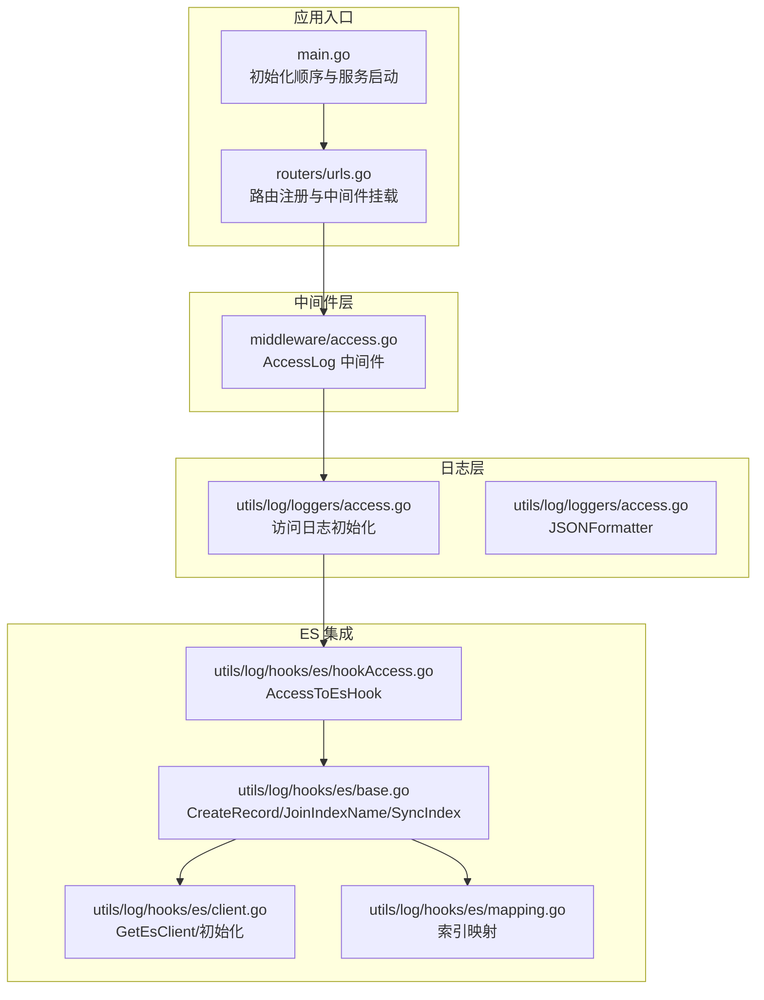
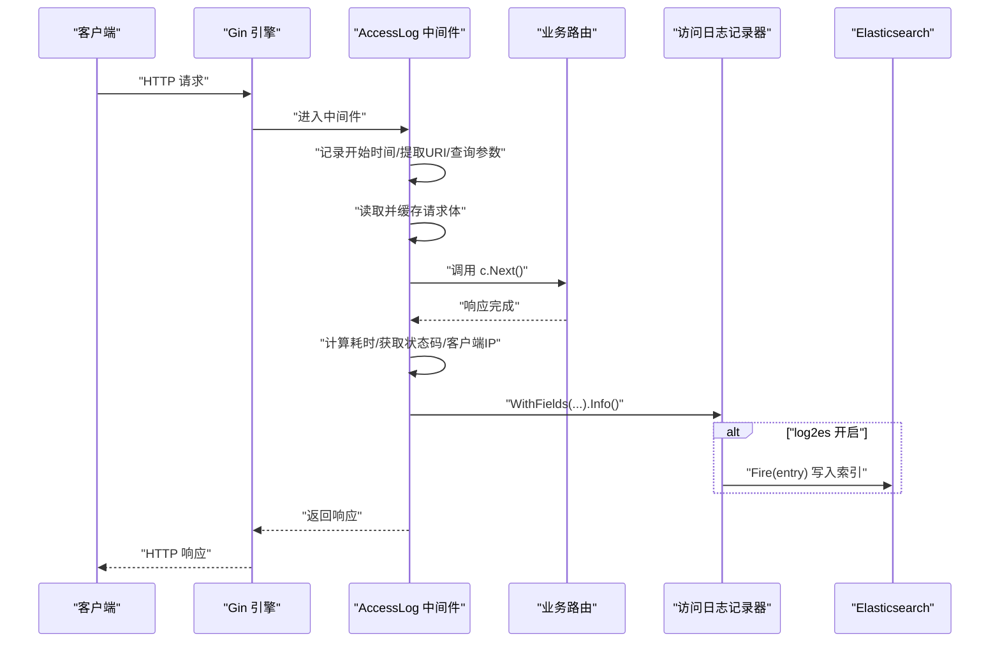
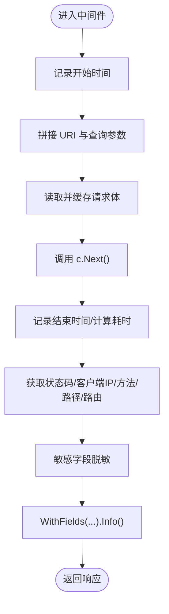
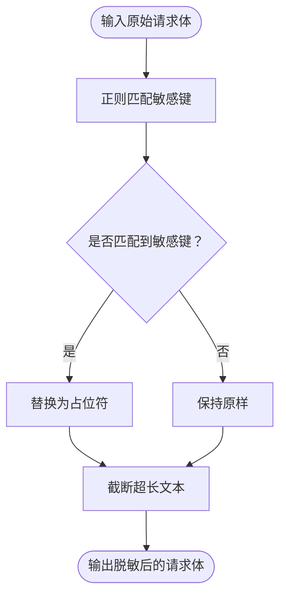
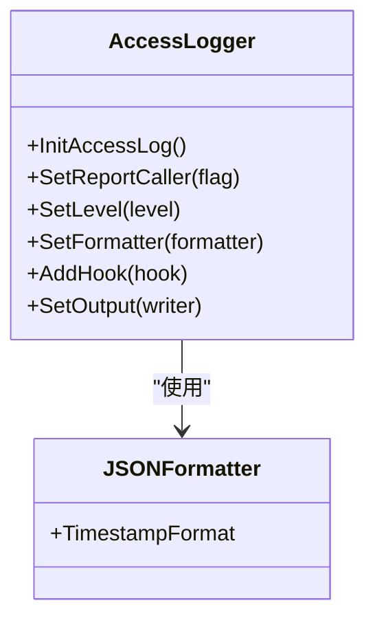
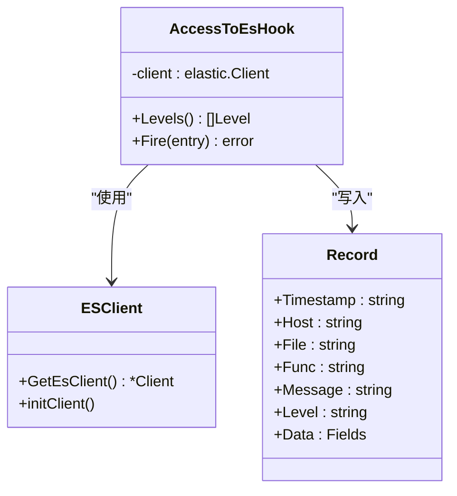
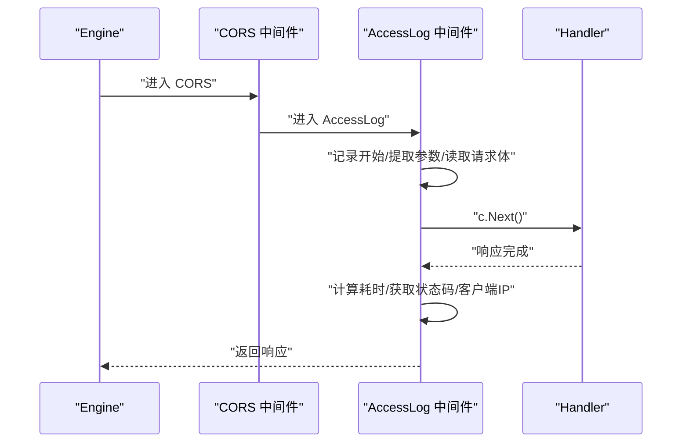
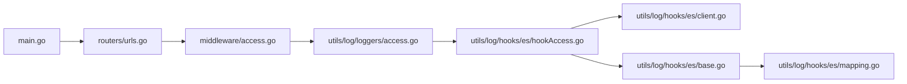

# 访问控制机制

<cite>
**本文档引用的文件**
- [access.go](file://pkg/middleware/access.go)
- [access.go](file://pkg/utils/log/loggers/access.go)
- [hookAccess.go](file://pkg/utils/log/hooks/es/hookAccess.go)
- [base.go](file://pkg/utils/log/hooks/es/base.go)
- [client.go](file://pkg/utils/log/hooks/es/client.go)
- [mapping.go](file://pkg/utils/log/hooks/es/mapping.go)
- [urls.go](file://pkg/routers/urls.go)
- [main.go](file://main.go)
- [default.yaml](file://config/default.yaml)
- [cmd.go](file://pkg/utils/initialize/cmd.go)
</cite>

## 目录
1. [简介](#简介)
2. [项目结构](#项目结构)
3. [核心组件](#核心组件)
4. [架构总览](#架构总览)
5. [详细组件分析](#详细组件分析)
6. [依赖关系分析](#依赖关系分析)
7. [性能考量](#性能考量)
8. [故障排查指南](#故障排查指南)
9. [结论](#结论)
10. [附录](#附录)

## 简介
本文件系统性阐述访问控制机制，重点围绕访问日志中间件的设计与实现，包括请求体敏感信息过滤、日志记录格式、性能监控、以及与 Elasticsearch 的集成方案。文档同时提供敏感字段识别机制（正则表达式匹配、字段名称识别、数据脱敏处理）、请求处理流程（请求拦截、参数提取、响应处理）、日志内容与格式说明，以及访问控制配置的最佳实践（日志级别、性能优化、安全考虑）。

## 项目结构
访问控制相关代码主要分布在以下模块：
- 中间件层：访问日志中间件负责请求拦截、参数提取、响应处理与日志记录
- 日志层：访问日志记录器负责日志初始化、输出目标与格式化
- ES 集成：日志钩子负责将访问日志投递至 Elasticsearch 并维护索引
- 路由层：注册中间件，确保全局生效
- 启动流程：按序初始化配置、命令行参数、日志、Swagger、Gin 模式与数据库

**图表来源**
- [main.go:13-35](file://main.go#L13-L35)
- [urls.go:26-28](file://pkg/routers/urls.go#L26-L28)
- [access.go:23-71](file://pkg/middleware/access.go#L23-L71)
- [access.go:15-58](file://pkg/utils/log/loggers/access.go#L15-L58)
- [hookAccess.go:18-30](file://pkg/utils/log/hooks/es/hookAccess.go#L18-L30)
- [base.go:22-77](file://pkg/utils/log/hooks/es/base.go#L22-L77)
- [client.go:29-69](file://pkg/utils/log/hooks/es/client.go#L29-L69)
- [mapping.go:3-45](file://pkg/utils/log/hooks/es/mapping.go#L3-L45)

**章节来源**
- [main.go:13-35](file://main.go#L13-L35)
- [urls.go:26-28](file://pkg/routers/urls.go#L26-L28)
- [access.go:23-71](file://pkg/middleware/access.go#L23-L71)
- [access.go:15-58](file://pkg/utils/log/loggers/access.go#L15-L58)
- [hookAccess.go:18-30](file://pkg/utils/log/hooks/es/hookAccess.go#L18-L30)
- [base.go:22-77](file://pkg/utils/log/hooks/es/base.go#L22-L77)
- [client.go:29-69](file://pkg/utils/log/hooks/es/client.go#L29-L69)
- [mapping.go:3-45](file://pkg/utils/log/hooks/es/mapping.go#L3-L45)

## 核心组件
- 访问日志中间件：在请求进入后记录开始时间、URI、查询参数、请求体；在处理完成后计算耗时并记录状态码、客户端 IP、方法、路径、路由、脱敏后的请求体
- 敏感信息过滤：通过正则表达式识别 JSON 字段中的敏感键（如 password、secret、token、authorization），并进行脱敏处理
- 日志记录器：初始化访问日志输出目标（文件）、格式（JSON）、级别（Info），并在开启 ES 投递时加载 ES 钩子
- ES 集成：将日志条目转换为标准结构体，按日期动态创建索引并写入 ES

**章节来源**
- [access.go:13-21](file://pkg/middleware/access.go#L13-L21)
- [access.go:23-71](file://pkg/middleware/access.go#L23-L71)
- [access.go:15-58](file://pkg/utils/log/loggers/access.go#L15-L58)
- [hookAccess.go:18-30](file://pkg/utils/log/hooks/es/hookAccess.go#L18-L30)
- [base.go:22-49](file://pkg/utils/log/hooks/es/base.go#L22-L49)

## 架构总览
访问控制机制采用“中间件拦截 + 日志记录 + 可选 ES 投递”的架构。请求从 Gin 引擎进入，经过 CORS、AccessLog 中间件，再进入业务路由处理。中间件在请求前后分别采集关键指标并记录，最终落盘或投递到 ES。

**图表来源**
- [urls.go:26-28](file://pkg/routers/urls.go#L26-L28)
- [access.go:23-71](file://pkg/middleware/access.go#L23-L71)
- [access.go:58-68](file://pkg/middleware/access.go#L58-L68)
- [hookAccess.go:18-24](file://pkg/utils/log/hooks/es/hookAccess.go#L18-L24)

## 详细组件分析

### 访问日志中间件（AccessLog）
- 请求拦截与参数提取
  - 记录开始时间、URI 路径与查询参数（若存在）
  - 使用 TeeReader 将请求体复制到内存缓冲区，以便后续处理仍可读取
- 处理流程
  - 调用 c.Next() 继续处理链路
  - 在回调中计算耗时、获取状态码、客户端 IP、方法、路径、路由全名
- 敏感信息过滤
  - 通过预编译的正则表达式识别敏感字段键名并替换为占位符
  - 对超长请求体进行截断，避免日志膨胀
- 日志记录
  - 使用 logrus.WithFields 输出 JSON 格式日志，包含时间戳、延迟、状态码、客户端 IP、方法、路径、路由、脱敏后的请求体

**图表来源**
- [access.go:23-71](file://pkg/middleware/access.go#L23-L71)
- [access.go:15-21](file://pkg/middleware/access.go#L15-L21)

**章节来源**
- [access.go:23-71](file://pkg/middleware/access.go#L23-L71)
- [access.go:13-21](file://pkg/middleware/access.go#L13-L21)

### 敏感字段识别与脱敏机制
- 正则表达式匹配
  - 预编译正则用于匹配 JSON 键名（不区分大小写），涵盖 password、secret、token、authorization
- 字段名称识别
  - 通过键名匹配实现精准定位，避免误伤非敏感字段
- 数据脱敏处理
  - 将匹配到的敏感值替换为占位符，同时限制最大长度，防止日志过大影响性能与存储

**图表来源**
- [access.go:13-21](file://pkg/middleware/access.go#L13-L21)

**章节来源**
- [access.go:13-21](file://pkg/middleware/access.go#L13-L21)

### 日志记录器与输出格式
- 初始化流程
  - 读取配置中的访问日志文件路径，确保目录与文件存在
  - 设置日志级别为 Info，关闭调用者信息输出
  - 使用 JSONFormatter，指定时间格式
  - 若开启 log2es，则加载 ES 钩子
  - 将输出目标设置为文件多路复用器
- 日志字段
  - 包含起止时间、延迟、状态码、客户端 IP、方法、路径、路由、脱敏后的请求体

**图表来源**
- [access.go:15-58](file://pkg/utils/log/loggers/access.go#L15-L58)

**章节来源**
- [access.go:15-58](file://pkg/utils/log/loggers/access.go#L15-L58)

### Elasticsearch 集成
- 钩子实现
  - AccessToEsHook 实现 Levels 和 Fire 方法，将日志条目写入 ES
  - Fire 中设置超时上下文，动态索引名称（按日期），并调用 ES 客户端写入
- 记录结构
  - CreateRecord 将 logrus 条目转换为统一结构体，包含时间戳、主机、文件、函数、消息、级别与数据
- 客户端与索引
  - GetEsClient 单例初始化 ES 客户端，支持从环境变量覆盖配置
  - SyncIndex 动态检查并创建索引，JoinIndexName 生成带日期的索引名
- 映射
  - mapping.go 提供访问日志字段的映射定义，便于检索与可视化

**图表来源**
- [hookAccess.go:10-30](file://pkg/utils/log/hooks/es/hookAccess.go#L10-L30)
- [base.go:12-49](file://pkg/utils/log/hooks/es/base.go#L12-L49)
- [client.go:19-69](file://pkg/utils/log/hooks/es/client.go#L19-L69)
- [mapping.go:3-45](file://pkg/utils/log/hooks/es/mapping.go#L3-L45)

**章节来源**
- [hookAccess.go:18-24](file://pkg/utils/log/hooks/es/hookAccess.go#L18-L24)
- [base.go:22-77](file://pkg/utils/log/hooks/es/base.go#L22-L77)
- [client.go:29-69](file://pkg/utils/log/hooks/es/client.go#L29-L69)
- [mapping.go:3-45](file://pkg/utils/log/hooks/es/mapping.go#L3-L45)

### 请求处理流程
- 中间件挂载
  - 在路由引擎中挂载 CORS 与 AccessLog 中间件，确保全局生效
- 请求拦截
  - 中间件在 c.Next() 前后分别采集指标，保证统计准确性
- 参数提取
  - 提取 URI、查询参数、请求体、状态码、客户端 IP、方法、路径、路由
- 响应处理
  - 通过 c.Writer.Status() 获取最终状态码，确保日志反映真实响应结果

**图表来源**
- [urls.go:26-28](file://pkg/routers/urls.go#L26-L28)
- [access.go:23-71](file://pkg/middleware/access.go#L23-L71)

**章节来源**
- [urls.go:26-28](file://pkg/routers/urls.go#L26-L28)
- [access.go:23-71](file://pkg/middleware/access.go#L23-L71)

### 日志记录内容与格式
- 字段说明
  - start_time：请求开始时间（格式化字符串）
  - end_time：请求结束时间（格式化字符串）
  - latency：请求耗时（字符串形式）
  - status_code：HTTP 状态码
  - client_ip：客户端 IP
  - method：HTTP 方法
  - path：请求路径与查询参数
  - router：匹配到的路由全名
  - request_body：脱敏后的请求体（JSON 文本）
- 输出格式
  - JSON 格式，时间戳格式可配置

**章节来源**
- [access.go:58-68](file://pkg/middleware/access.go#L58-L68)
- [access.go:46-50](file://pkg/utils/log/loggers/access.go#L46-L50)

## 依赖关系分析
- 中间件依赖日志记录器，日志记录器根据配置决定是否加载 ES 钩子
- ES 钩子依赖 ES 客户端，ES 客户端在首次使用时初始化并创建索引
- 路由层统一挂载中间件，确保全局生效

**图表来源**
- [access.go:23-71](file://pkg/middleware/access.go#L23-L71)
- [access.go:15-58](file://pkg/utils/log/loggers/access.go#L15-L58)
- [hookAccess.go:18-30](file://pkg/utils/log/hooks/es/hookAccess.go#L18-L30)
- [client.go:29-69](file://pkg/utils/log/hooks/es/client.go#L29-L69)
- [base.go:22-77](file://pkg/utils/log/hooks/es/base.go#L22-L77)
- [mapping.go:3-45](file://pkg/utils/log/hooks/es/mapping.go#L3-L45)
- [urls.go:26-28](file://pkg/routers/urls.go#L26-L28)
- [main.go:13-35](file://main.go#L13-L35)

**章节来源**
- [access.go:23-71](file://pkg/middleware/access.go#L23-L71)
- [access.go:15-58](file://pkg/utils/log/loggers/access.go#L15-L58)
- [hookAccess.go:18-30](file://pkg/utils/log/hooks/es/hookAccess.go#L18-L30)
- [client.go:29-69](file://pkg/utils/log/hooks/es/client.go#L29-L69)
- [base.go:22-77](file://pkg/utils/log/hooks/es/base.go#L22-L77)
- [mapping.go:3-45](file://pkg/utils/log/hooks/es/mapping.go#L3-L45)
- [urls.go:26-28](file://pkg/routers/urls.go#L26-L28)
- [main.go:13-35](file://main.go#L13-L35)

## 性能考量
- 请求体读取与缓存
  - 使用 TeeReader 将请求体复制到内存缓冲区，避免一次性读取导致后续处理器无法读取
- 敏感信息过滤
  - 正则匹配与字符串替换在中间件阶段完成，避免重复处理
  - 对超长请求体进行截断，降低日志体积与 IO 压力
- 日志输出
  - JSON 格式便于结构化检索，但需注意字段数量与大小
  - 文件输出与 ES 投递并行时，建议合理设置 ES 超时与批量策略（当前实现为单条写入）
- 中间件顺序
  - 将 AccessLog 放在 CORS 之后，确保跨域处理不影响访问日志统计

**章节来源**
- [access.go:39-46](file://pkg/middleware/access.go#L39-L46)
- [access.go:17-20](file://pkg/middleware/access.go#L17-L20)
- [hookAccess.go:18-24](file://pkg/utils/log/hooks/es/hookAccess.go#L18-L24)

## 故障排查指南
- ES 连接失败
  - 检查 ES 地址、用户名、密码配置，确认网络可达
  - 查看 ES 客户端初始化日志与错误输出
- 索引创建失败
  - 确认 ES 版本兼容性（支持 7.x+），检查权限与索引映射
- 日志文件写入失败
  - 检查 accessLogFile 路径是否存在且具备写权限
- 日志级别与输出
  - 确认 log.level 与 log.format 配置，必要时调整为 debug 以排查问题
- 命令行参数覆盖
  - 通过 --log2es 等参数动态覆盖配置，便于快速切换 ES 投递开关

**章节来源**
- [client.go:29-69](file://pkg/utils/log/hooks/es/client.go#L29-L69)
- [base.go:51-73](file://pkg/utils/log/hooks/es/base.go#L51-L73)
- [access.go:15-58](file://pkg/utils/log/loggers/access.go#L15-L58)
- [default.yaml:27-44](file://config/default.yaml#L27-L44)
- [cmd.go:47-98](file://pkg/utils/initialize/cmd.go#L47-L98)

## 结论
访问控制机制通过中间件拦截、敏感信息脱敏与结构化日志记录，提供了完整的访问审计能力。结合可选的 Elasticsearch 投递，能够实现高效的日志检索与可视化。在生产环境中，建议开启 ES 投递并合理配置日志级别与输出格式，同时关注请求体大小与正则匹配开销，以平衡安全性与性能。

## 附录

### 访问控制配置最佳实践
- 日志级别
  - 生产环境建议使用 info 级别，必要时临时提升至 debug 排查
- 性能优化
  - 控制请求体大小与日志字段数量，避免过度日志化
  - 合理设置 ES 超时与索引策略，减少写入阻塞
- 安全考虑
  - 严格管理敏感字段识别规则，定期审查正则表达式
  - 限制日志文件权限，避免敏感信息泄露
- 配置示例
  - 日志文件路径、ES 开关与 ES 连接参数均在配置文件中集中管理

**章节来源**
- [default.yaml:27-44](file://config/default.yaml#L27-L44)
- [access.go:15-58](file://pkg/utils/log/loggers/access.go#L15-L58)
- [hookAccess.go:18-24](file://pkg/utils/log/hooks/es/hookAccess.go#L18-L24)