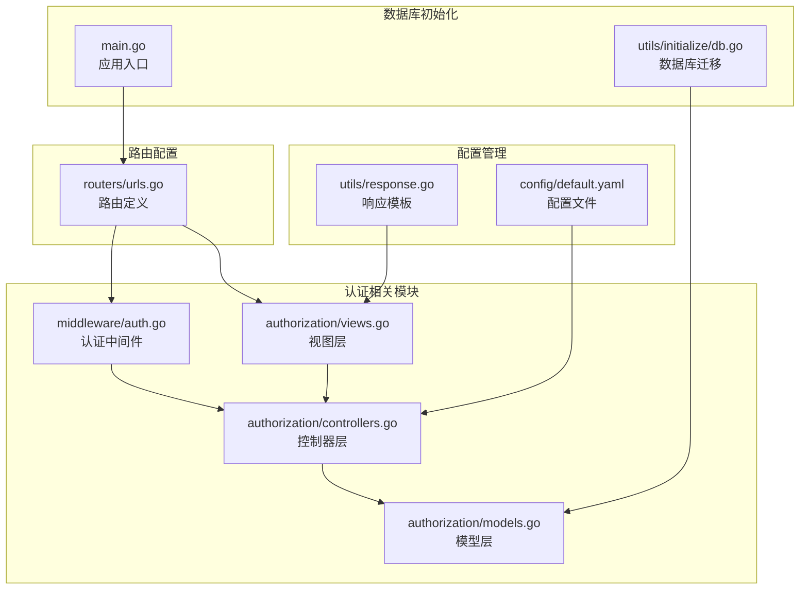
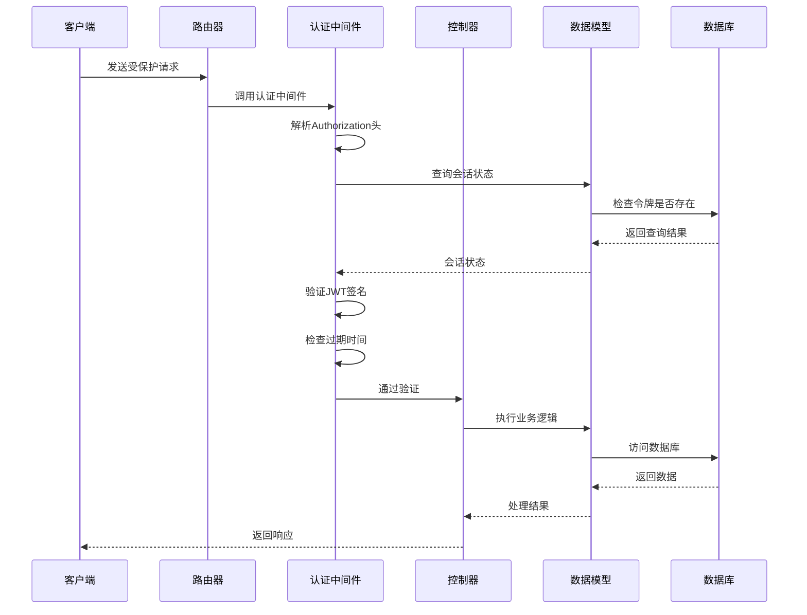
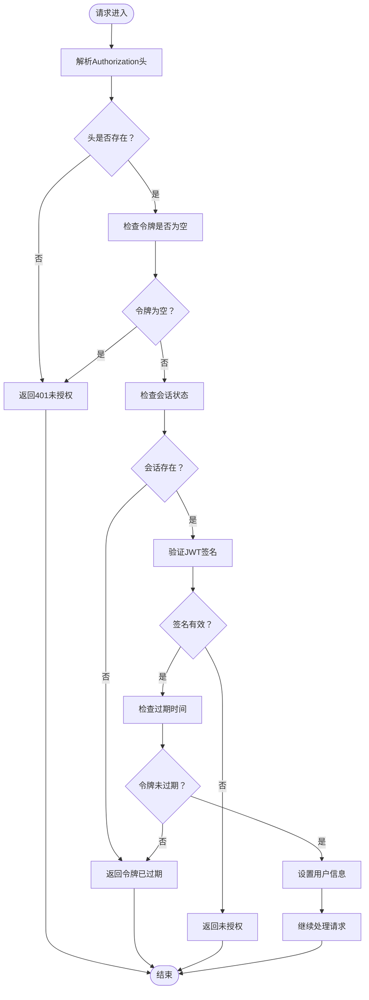
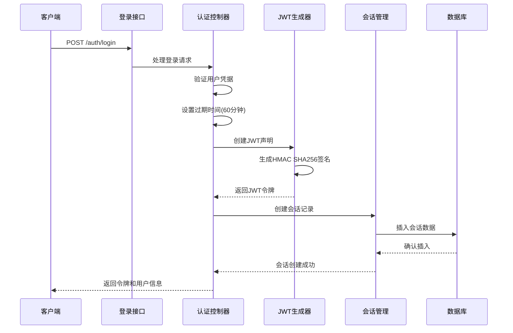
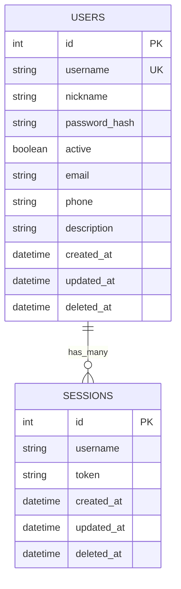
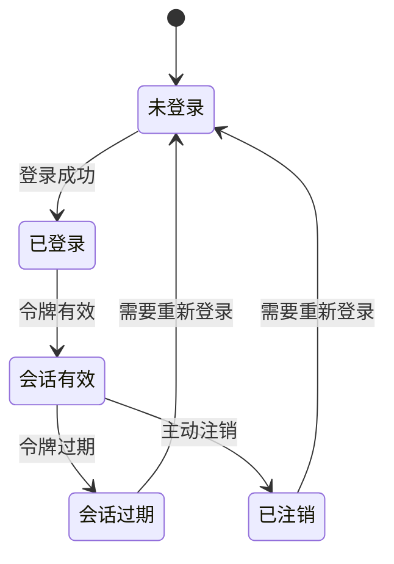
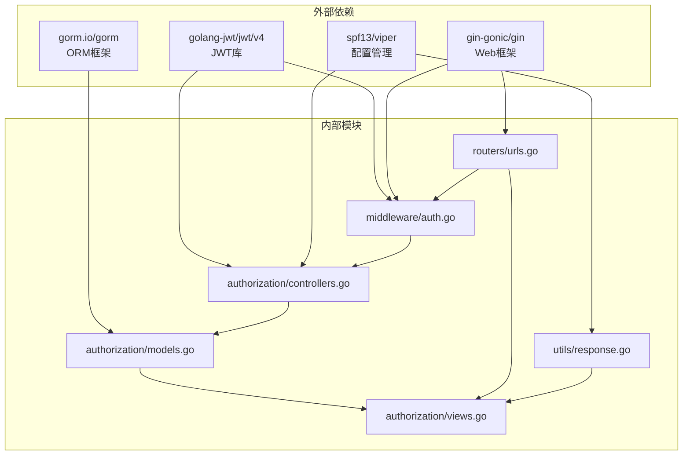

# JWT 认证机制

<cite>
**本文档引用的文件**
- [auth.go](file://pkg/middleware/auth.go)
- [controllers.go](file://pkg/authorization/controllers.go)
- [models.go](file://pkg/authorization/models.go)
- [views.go](file://pkg/authorization/views.go)
- [urls.go](file://pkg/routers/urls.go)
- [response.go](file://pkg/utils/response.go)
- [default.yaml](file://config/default.yaml)
- [db.go](file://pkg/utils/initialize/db.go)
- [main.go](file://main.go)
</cite>

## 目录
1. [简介](#简介)
2. [项目结构](#项目结构)
3. [核心组件](#核心组件)
4. [架构概览](#架构概览)
5. [详细组件分析](#详细组件分析)
6. [依赖关系分析](#依赖关系分析)
7. [性能考虑](#性能考虑)
8. [故障排除指南](#故障排除指南)
9. [最佳实践](#最佳实践)
10. [结论](#结论)

## 简介

本项目实现了一个基于 JWT（JSON Web Token）的认证机制，提供了完整的用户身份验证、授权和会话管理功能。JWT 认证机制通过在客户端和服务器之间传递经过数字签名的令牌来实现无状态的身份验证，避免了服务器端会话存储的需求。

该系统采用 HMAC SHA256 签名算法，支持令牌过期时间控制、黑名单检查、密码哈希等功能，为 Web 应用提供了安全可靠的身份验证解决方案。

## 项目结构

JWT 认证机制在项目中的组织结构如下：



**图表来源**
- [auth.go:1-62](file://pkg/middleware/auth.go#L1-L62)
- [controllers.go:1-41](file://pkg/authorization/controllers.go#L1-L41)
- [models.go:1-135](file://pkg/authorization/models.go#L1-L135)
- [views.go:1-228](file://pkg/authorization/views.go#L1-L228)

**章节来源**
- [auth.go:1-62](file://pkg/middleware/auth.go#L1-L62)
- [controllers.go:1-41](file://pkg/authorization/controllers.go#L1-L41)
- [models.go:1-135](file://pkg/authorization/models.go#L1-L135)
- [views.go:1-228](file://pkg/authorization/views.go#L1-L228)
- [urls.go:1-109](file://pkg/routers/urls.go#L1-L109)

## 核心组件

### 认证中间件

认证中间件是 JWT 认证机制的核心组件，负责拦截所有受保护的请求并验证用户身份。

**主要功能：**
- 请求头解析和令牌提取
- 令牌有效性验证
- 签名验证
- 过期时间检查
- 会话状态检查

### JWT 控制器

JWT 控制器负责处理认证相关的业务逻辑，包括令牌生成、验证和管理。

**关键特性：**
- 使用 HMAC SHA256 签名算法
- 支持自定义过期时间
- 密码哈希和验证
- 会话生命周期管理

### 数据模型

系统使用 GORM ORM 框架管理用户和会话数据，提供类型安全的数据访问层。

**核心模型：**
- Users：用户基本信息和认证数据
- Sessions：用户会话和令牌存储

**章节来源**
- [auth.go:12-61](file://pkg/middleware/auth.go#L12-L61)
- [controllers.go:10-40](file://pkg/authorization/controllers.go#L10-L40)
- [models.go:10-134](file://pkg/authorization/models.go#L10-L134)

## 架构概览

JWT 认证机制的整体架构采用分层设计，确保了代码的可维护性和扩展性：



**图表来源**
- [auth.go:12-61](file://pkg/middleware/auth.go#L12-L61)
- [views.go:31-88](file://pkg/authorization/views.go#L31-L88)
- [models.go:112-134](file://pkg/authorization/models.go#L112-L134)

## 详细组件分析

### 认证中间件实现

认证中间件是整个 JWT 认证系统的关键组件，负责拦截所有受保护的请求并执行身份验证。

#### 核心验证流程



**图表来源**
- [auth.go:14-60](file://pkg/middleware/auth.go#L14-L60)

#### 关键实现细节

1. **请求头解析**：从 Authorization 头部提取 Bearer 令牌
2. **会话状态检查**：验证令牌是否存在于 sessions 表中
3. **JWT 签名验证**：使用 HMAC SHA256 算法验证令牌签名
4. **过期时间检查**：确保令牌未超过预设的有效期
5. **用户信息注入**：将用户名注入到 Gin 上下文中

**章节来源**
- [auth.go:12-61](file://pkg/middleware/auth.go#L12-L61)

### JWT 令牌生成机制

JWT 令牌生成过程涉及多个步骤，确保令牌的安全性和有效性。

#### 令牌生成流程



**图表来源**
- [views.go:31-72](file://pkg/authorization/views.go#L31-L72)
- [controllers.go:19-22](file://pkg/authorization/controllers.go#L19-L22)

#### 令牌结构分析

JWT 令牌包含三个部分：

1. **头部（Header）**：包含签名算法信息（HMAC SHA256）
2. **载荷（Payload）**：包含用户身份信息和注册声明
3. **签名（Signature）**：基于头部和载荷的数字签名

**章节来源**
- [views.go:46-66](file://pkg/authorization/views.go#L46-L66)
- [controllers.go:19-22](file://pkg/authorization/controllers.go#L19-L22)

### 会话管理系统

会话管理系统负责管理用户的登录状态和令牌生命周期。

#### 数据模型设计



**图表来源**
- [models.go:10-26](file://pkg/authorization/models.go#L10-L26)
- [models.go:99-110](file://pkg/authorization/models.go#L99-L110)

#### 会话生命周期



**图表来源**
- [models.go:112-134](file://pkg/authorization/models.go#L112-L134)
- [views.go:74-88](file://pkg/authorization/views.go#L74-L88)

**章节来源**
- [models.go:99-134](file://pkg/authorization/models.go#L99-L134)
- [views.go:74-88](file://pkg/authorization/views.go#L74-L88)

### 路由配置与中间件集成

路由系统将认证中间件集成到应用程序中，确保只有经过身份验证的请求才能访问受保护的资源。

#### 受保护路由配置

| 路由 | 方法 | 中间件 | 功能 |
|------|------|--------|------|
| `/api/v1/*` | GET/POST/PUT/DELETE | `AuthMiddleware()` | 用户管理接口 |
| `/api/v1/namespace/*` | GET/POST/PUT/DELETE | `AuthMiddleware()` | 命名空间管理接口 |
| `/auth/login` | POST | 无 | 用户登录 |
| `/auth/logout` | POST | 无 | 用户登出 |
| `/auth/register` | POST | 无 | 用户注册 |

**章节来源**
- [urls.go:50-104](file://pkg/routers/urls.go#L50-L104)

## 依赖关系分析

JWT 认证机制的依赖关系体现了清晰的分层架构设计：



**图表来源**
- [auth.go:3-10](file://pkg/middleware/auth.go#L3-L10)
- [controllers.go:3-8](file://pkg/authorization/controllers.go#L3-L8)
- [models.go:3-8](file://pkg/authorization/models.go#L3-L8)
- [views.go:3-10](file://pkg/authorization/views.go#L3-L10)

### 组件耦合度分析

- **低耦合设计**：各模块职责明确，相互依赖关系清晰
- **依赖注入**：通过函数参数传递依赖，便于测试和维护
- **接口隔离**：每个模块都有明确的接口边界

**章节来源**
- [auth.go:1-10](file://pkg/middleware/auth.go#L1-L10)
- [controllers.go:1-8](file://pkg/authorization/controllers.go#L1-L8)
- [models.go:1-8](file://pkg/authorization/models.go#L1-L8)

## 性能考虑

### JWT 认证性能特征

1. **无状态特性**：JWT 令牌包含所有必要信息，无需服务器端存储
2. **内存开销**：令牌大小相对较小，网络传输开销低
3. **CPU 使用**：签名和验证操作在客户端和服务器端都有开销
4. **并发处理**：支持高并发场景下的快速身份验证

### 优化建议

1. **令牌缓存**：对于频繁访问的用户，可以考虑本地缓存有效的令牌
2. **批量验证**：在高并发场景下，考虑使用批量令牌验证机制
3. **压缩传输**：对于大型载荷，可以考虑在传输前进行压缩
4. **异步处理**：将非关键的验证操作异步化处理

## 故障排除指南

### 常见问题及解决方案

#### 1. 401 未授权错误

**可能原因：**
- 缺少 Authorization 头部
- 令牌格式不正确
- 令牌已被注销

**解决方案：**
- 确保请求包含正确的 Authorization 头部
- 验证令牌格式符合 JWT 标准
- 检查令牌是否仍在 sessions 表中

#### 2. 令牌验证失败

**可能原因：**
- 签名算法不匹配
- 密钥不正确
- 令牌被篡改

**解决方案：**
- 确保使用相同的签名算法
- 验证 JWT 密钥配置正确
- 检查令牌完整性

#### 3. 令牌过期问题

**可能原因：**
- 过期时间设置过短
- 服务器时间不同步
- 时区配置错误

**解决方案：**
- 合理设置令牌过期时间
- 同步服务器时间
- 检查时区配置

**章节来源**
- [auth.go:38-59](file://pkg/middleware/auth.go#L38-L59)
- [response.go:11-27](file://pkg/utils/response.go#L11-L27)

### 调试技巧

1. **启用详细日志**：在开发环境中启用详细的认证日志
2. **令牌解码**：使用在线工具解码 JWT 令牌查看载荷内容
3. **网络抓包**：使用工具监控 HTTP 请求和响应
4. **数据库检查**：验证 sessions 表中的会话状态

## 最佳实践

### JWT 配置最佳实践

#### 1. 密钥管理

**安全要求：**
- 使用强随机字符串作为 JWT 密钥
- 在生产环境中避免使用默认密钥
- 定期轮换密钥以提高安全性

**配置示例：**
```yaml
auth:
  jwtKey: "请替换为随机字符串"
```

#### 2. 令牌过期策略

**建议设置：**
- 短期令牌：15-60 分钟（用于 API 访问）
- 长期令牌：7-30 天（用于持久登录）
- 自动刷新：实现刷新令牌机制

#### 3. 安全传输

**HTTPS 要求：**
- 始终使用 HTTPS 传输 JWT 令牌
- 避免在 URL 参数中传递令牌
- 使用 HttpOnly Cookie 存储令牌

#### 4. 令牌刷新策略

**实现方案：**
- 使用双令牌模型（访问令牌 + 刷新令牌）
- 刷新令牌存储在安全的 HttpOnly Cookie 中
- 实现令牌撤销和黑名单机制

### 代码实现最佳实践

#### 1. 错误处理

```go
// 建议的错误处理模式
if err != nil {
    if err == jwt.ErrSignatureInvalid {
        return utils.ResponseFailure("未授权", err)
    }
    return utils.ResponseFailure("令牌异常", err)
}
```

#### 2. 日志记录

```go
// 建议的日志记录
loggers.DefaultLogger.Infof("用户 %s 登录成功", username)
loggers.DefaultLogger.Warnf("无效的令牌尝试: %s", tokenString)
```

#### 3. 配置管理

```go
// 建议的配置读取
jwtKey := viper.GetString("auth.jwtKey")
expirationTime := viper.GetDuration("auth.tokenExpiry")
```

**章节来源**
- [default.yaml:11-13](file://config/default.yaml#L11-L13)
- [views.go:47](file://pkg/authorization/views.go#L47)
- [auth.go:38-50](file://pkg/middleware/auth.go#L38-L50)

## 结论

JWT 认证机制为本项目提供了强大而灵活的身份验证解决方案。通过合理的架构设计和实现，系统实现了以下关键特性：

1. **安全性**：使用标准的 HMAC SHA256 签名算法和安全的密钥管理
2. **可扩展性**：模块化设计支持功能扩展和定制
3. **易用性**：简洁的 API 接口和完善的错误处理机制
4. **性能**：无状态设计支持高并发场景

该认证机制为 Web 应用提供了可靠的用户身份验证基础，可以根据具体需求进一步扩展功能，如实现多因素认证、OAuth 集成等高级特性。

通过遵循本文档中的最佳实践和安全建议，开发者可以构建更加安全和可靠的认证系统，为用户提供优质的用户体验。