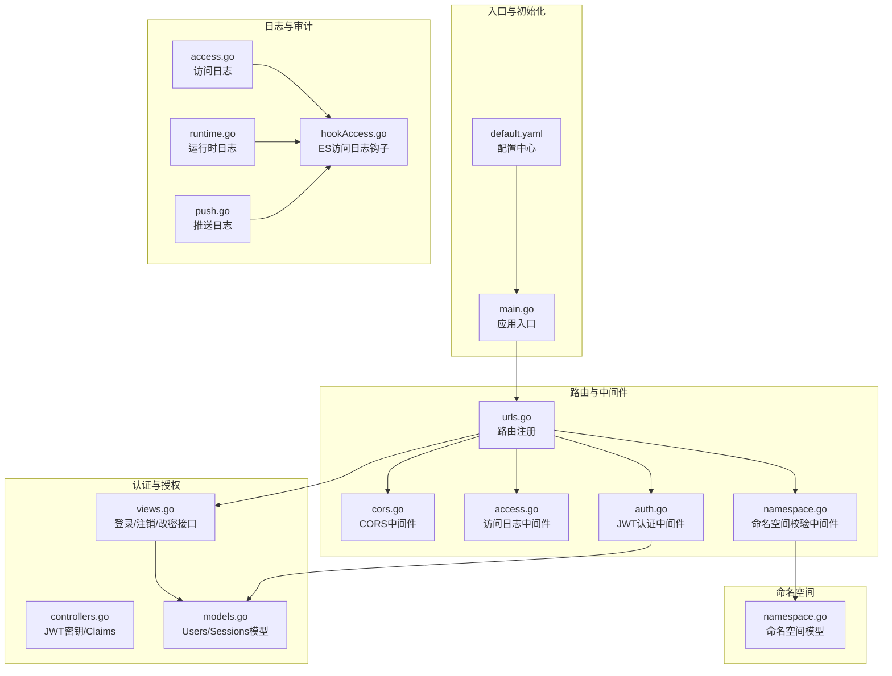
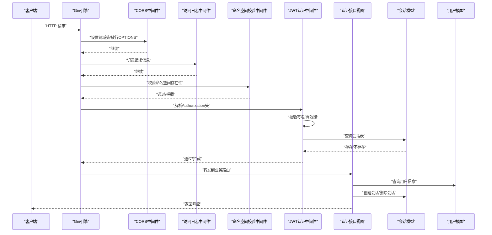
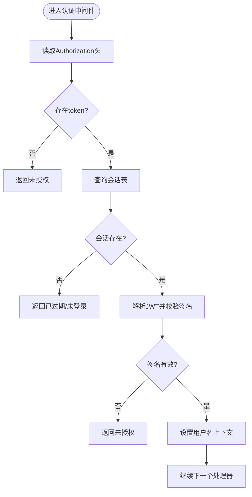
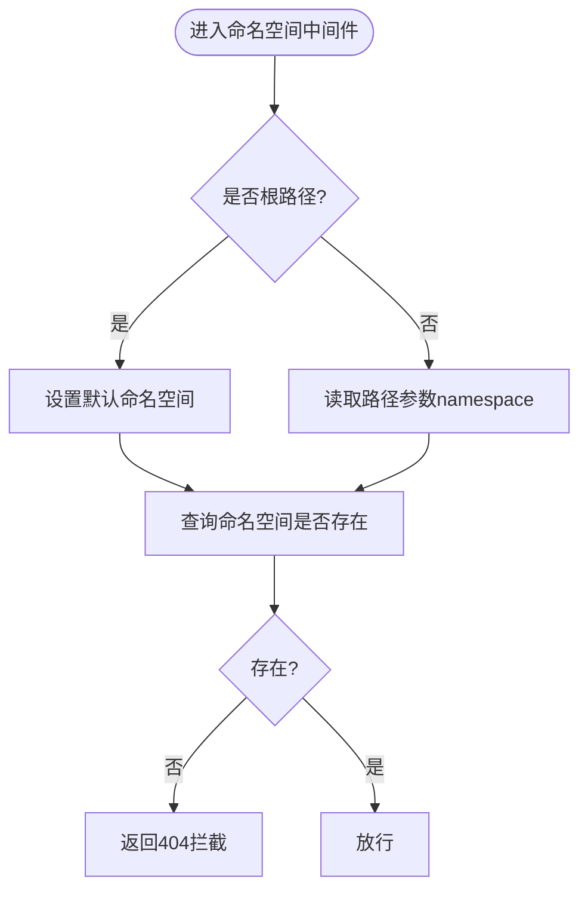
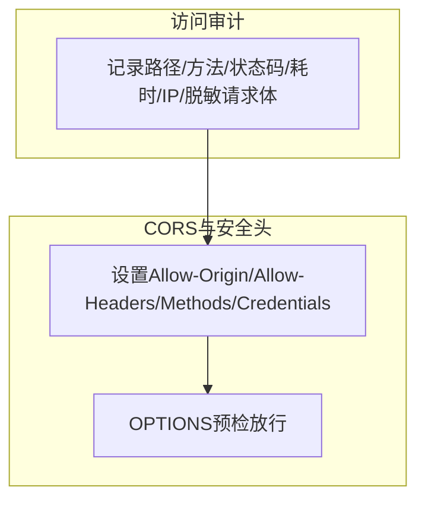
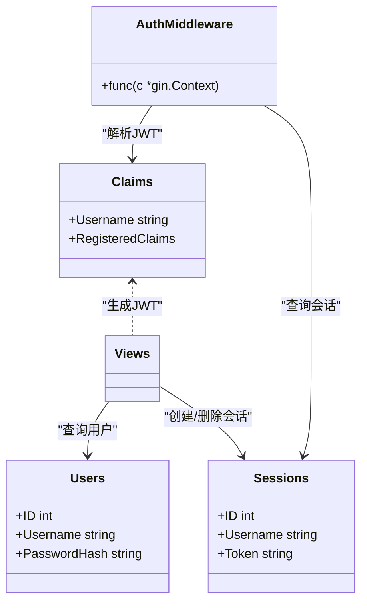
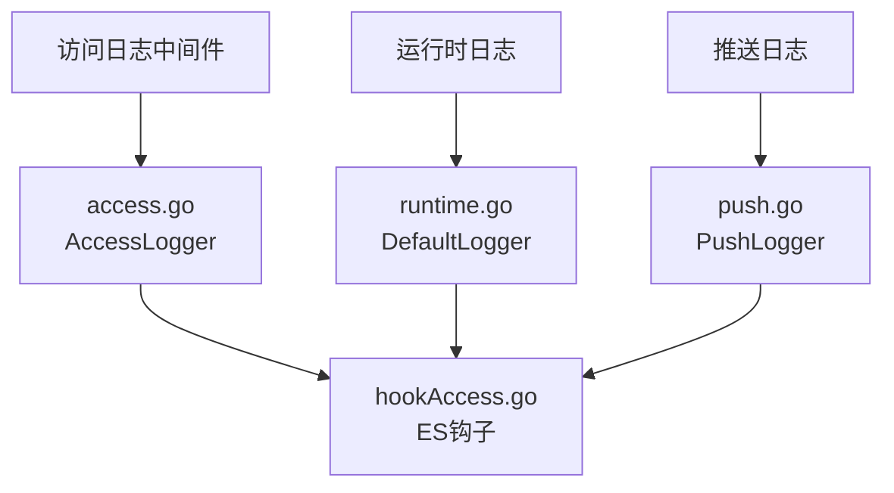
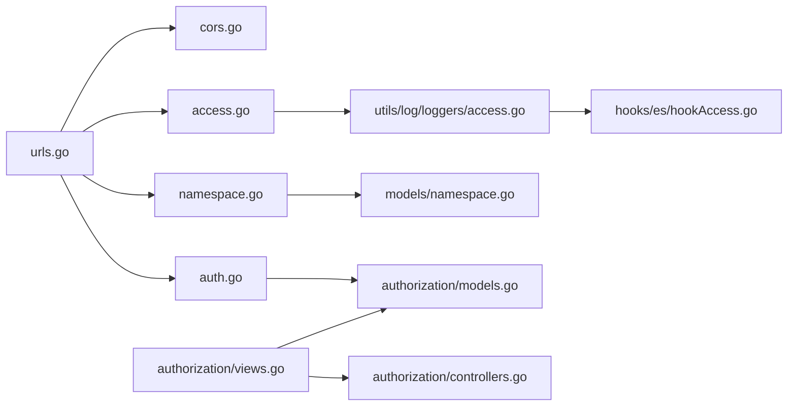

# 安全与认证

<cite>
**本文引用的文件**
- [main.go](file://main.go)
- [default.yaml](file://config/default.yaml)
- [urls.go](file://pkg/routers/urls.go)
- [auth.go](file://pkg/middleware/auth.go)
- [cors.go](file://pkg/middleware/cors.go)
- [namespace.go](file://pkg/middleware/namespace.go)
- [controllers.go](file://pkg/authorization/controllers.go)
- [models.go](file://pkg/authorization/models.go)
- [views.go](file://pkg/authorization/views.go)
- [namespace.go](file://pkg/models/namespace.go)
- [response.go](file://pkg/utils/response.go)
- [access.go](file://pkg/utils/log/loggers/access.go)
- [runtime.go](file://pkg/utils/log/loggers/runtime.go)
- [push.go](file://pkg/utils/log/loggers/push.go)
- [hookAccess.go](file://pkg/utils/log/hooks/es/hookAccess.go)
- [requests.js](file://vue/src/service/requests.js)
- [login.vue](file://vue/src/views/login.vue)
</cite>

## 目录
1. [简介](#简介)
2. [项目结构](#项目结构)
3. [核心组件](#核心组件)
4. [架构总览](#架构总览)
5. [详细组件分析](#详细组件分析)
6. [依赖分析](#依赖分析)
7. [性能考虑](#性能考虑)
8. [故障排查指南](#故障排查指南)
9. [结论](#结论)
10. [附录](#附录)

## 简介
本技术文档围绕安全与认证系统展开，重点解释以下方面：
- JWT 认证机制：token 生成、验证、注销与过期处理
- 命名空间权限控制：多租户隔离、资源访问控制、命名空间存在性校验
- API 访问控制：请求签名、IP 白名单、频率限制（现状与建议）
- CORS 跨域处理与安全头设置
- 安全配置最佳实践与常见威胁防护
- 认证中间件工作原理与自定义认证扩展方法
- 日志审计与监控机制

## 项目结构
后端采用 Gin 框架，安全相关能力主要分布在以下模块：
- 路由与中间件：统一挂载 CORS、访问日志、命名空间校验、认证中间件
- 认证与授权：JWT 密钥管理、用户模型、会话模型、登录/注销/改密接口
- 命名空间：命名空间存在性检查、隔离策略
- 日志与审计：访问日志、运行时日志、推送日志、可选 ES 投递

**图表来源**
- [main.go:13-35](file://main.go#L13-L35)
- [urls.go:21-108](file://pkg/routers/urls.go#L21-L108)
- [cors.go:9-28](file://pkg/middleware/cors.go#L9-L28)
- [access.go:23-71](file://pkg/middleware/access.go#L23-L71)
- [namespace.go:20-46](file://pkg/middleware/namespace.go#L20-L46)
- [auth.go:12-61](file://pkg/middleware/auth.go#L12-L61)
- [controllers.go:10-12](file://pkg/authorization/controllers.go#L10-L12)
- [models.go:109-134](file://pkg/authorization/models.go#L109-L134)
- [views.go:31-88](file://pkg/authorization/views.go#L31-L88)
- [namespace.go:96-105](file://pkg/models/namespace.go#L96-L105)
- [access.go:58-68](file://pkg/middleware/access.go#L58-L68)
- [access.go:15-21](file://pkg/middleware/access.go#L15-L21)
- [hookAccess.go:18-24](file://pkg/utils/log/hooks/es/hookAccess.go#L18-L24)

**章节来源**
- [main.go:13-35](file://main.go#L13-L35)
- [urls.go:21-108](file://pkg/routers/urls.go#L21-L108)

## 核心组件
- JWT 认证中间件：从请求头提取 Authorization，解析并校验签名，结合会话表判定是否“已登录”
- 登录/注销/改密接口：生成 HS256 JWT，写入会话表；注销时删除会话
- 命名空间中间件：根据路径参数校验命名空间是否存在，不存在则拦截
- CORS 中间件：设置跨域响应头，放行 OPTIONS 预检
- 访问日志中间件：记录请求路径、方法、状态码、耗时、客户端 IP、脱敏请求体
- 日志系统：运行时日志、访问日志、推送日志，支持 JSON 文本格式与可选 ES 投递

**章节来源**
- [auth.go:12-61](file://pkg/middleware/auth.go#L12-L61)
- [views.go:31-88](file://pkg/authorization/views.go#L31-L88)
- [namespace.go:20-46](file://pkg/middleware/namespace.go#L20-L46)
- [cors.go:9-28](file://pkg/middleware/cors.go#L9-L28)
- [access.go:23-71](file://pkg/middleware/access.go#L23-L71)
- [access.go:15-21](file://pkg/middleware/access.go#L15-L21)
- [access.go:58-68](file://pkg/middleware/access.go#L58-L68)
- [access.go:13](file://pkg/middleware/access.go#L13)
- [access.go:58-68](file://pkg/middleware/access.go#L58-L68)
- [runtime.go:15-60](file://pkg/utils/log/loggers/runtime.go#L15-L60)
- [push.go:15-59](file://pkg/utils/log/loggers/push.go#L15-L59)
- [hookAccess.go:18-24](file://pkg/utils/log/hooks/es/hookAccess.go#L18-L24)

## 架构总览
JWT 认证链路与命名空间隔离贯穿请求生命周期。

**图表来源**
- [urls.go:27-28](file://pkg/routers/urls.go#L27-L28)
- [urls.go:42-48](file://pkg/routers/urls.go#L42-L48)
- [urls.go:58-90](file://pkg/routers/urls.go#L58-L90)
- [cors.go:9-28](file://pkg/middleware/cors.go#L9-L28)
- [access.go:23-71](file://pkg/middleware/access.go#L23-L71)
- [namespace.go:20-46](file://pkg/middleware/namespace.go#L20-L46)
- [auth.go:12-61](file://pkg/middleware/auth.go#L12-L61)
- [views.go:31-88](file://pkg/authorization/views.go#L31-L88)
- [models.go:109-134](file://pkg/authorization/models.go#L109-L134)

## 详细组件分析

### JWT 认证机制
- 密钥来源：从配置读取，生产环境务必随机化
- 生成：登录成功后创建 Claims（含用户名与过期时间），使用 HS256 签名
- 验证：中间件解析 Authorization 头，校验签名算法与密钥，再校验会话表是否“已登录”
- 注销：删除会话表中的 token 记录，使后续验证失败
- 过期处理：Claims 中设置过期时间，中间件校验无效时返回未授权

**图表来源**
- [auth.go:14-59](file://pkg/middleware/auth.go#L14-L59)
- [views.go:46-61](file://pkg/authorization/views.go#L46-L61)
- [models.go:130-134](file://pkg/authorization/models.go#L130-L134)
- [controllers.go:10-12](file://pkg/authorization/controllers.go#L10-L12)

**章节来源**
- [controllers.go:10-12](file://pkg/authorization/controllers.go#L10-L12)
- [views.go:31-88](file://pkg/authorization/views.go#L31-L88)
- [models.go:109-134](file://pkg/authorization/models.go#L109-L134)
- [auth.go:12-61](file://pkg/middleware/auth.go#L12-L61)

### 命名空间权限控制
- 路径规则：除特定根路径外，其余路由从路径参数提取命名空间
- 存在性校验：若命名空间不存在，直接返回拦截响应
- 多租户隔离：通过命名空间作为资源分组边界，配合路由组中间件实现

**图表来源**
- [namespace.go:20-46](file://pkg/middleware/namespace.go#L20-L46)
- [namespace.go:96-105](file://pkg/models/namespace.go#L96-L105)

**章节来源**
- [namespace.go:20-46](file://pkg/middleware/namespace.go#L20-L46)
- [namespace.go:96-105](file://pkg/models/namespace.go#L96-L105)

### API 访问控制现状与建议
- 现状
  - CORS：统一设置允许来源、头部、方法与凭据，预检放行
  - 访问日志：记录请求路径、方法、状态码、耗时、客户端 IP、脱敏请求体
  - 认证：基于 JWT 的 Bearer 认证
- 建议（增强型）
  - 请求签名：对重要写操作引入 HMAC 签名（需在网关或中间件层实现）
  - IP 白名单：在网关或前置代理层限制来源 IP
  - 频率限制：基于令牌或 IP 的限流中间件（如漏桶/令牌桶）

**图表来源**
- [cors.go:9-28](file://pkg/middleware/cors.go#L9-L28)
- [access.go:23-71](file://pkg/middleware/access.go#L23-L71)

**章节来源**
- [cors.go:9-28](file://pkg/middleware/cors.go#L9-L28)
- [access.go:23-71](file://pkg/middleware/access.go#L23-L71)

### 认证中间件工作原理与扩展
- 工作原理
  - 从 Authorization 头提取 token
  - 使用配置中的密钥与 HS256 校验签名
  - 查询会话表确认“已登录”状态
  - 设置用户名上下文并放行
- 自定义认证扩展
  - 新增中间件：仿照现有结构，实现 gin.HandlerFunc 并在路由注册处挂载
  - 新增鉴权策略：在控制器层增加新接口，返回统一响应结构

**图表来源**
- [auth.go:12-61](file://pkg/middleware/auth.go#L12-L61)
- [controllers.go:19-22](file://pkg/authorization/controllers.go#L19-L22)
- [models.go:109-134](file://pkg/authorization/models.go#L109-L134)
- [views.go:31-88](file://pkg/authorization/views.go#L31-L88)

**章节来源**
- [auth.go:12-61](file://pkg/middleware/auth.go#L12-L61)
- [controllers.go:19-22](file://pkg/authorization/controllers.go#L19-L22)
- [models.go:109-134](file://pkg/authorization/models.go#L109-L134)
- [views.go:31-88](file://pkg/authorization/views.go#L31-L88)

### 日志审计与监控
- 访问日志：记录请求路径、方法、状态码、耗时、客户端 IP、脱敏请求体
- 运行时日志：支持文本/JSON 格式，可选投递至 Elasticsearch
- 推送日志：独立日志通道，便于追踪推送行为
- ES 集成：访问日志钩子自动索引到以日期命名的索引

**图表来源**
- [access.go:58-68](file://pkg/middleware/access.go#L58-L68)
- [access.go:13](file://pkg/middleware/access.go#L13)
- [access.go:15-21](file://pkg/middleware/access.go#L15-L21)
- [runtime.go:15-60](file://pkg/utils/log/loggers/runtime.go#L15-L60)
- [push.go:15-59](file://pkg/utils/log/loggers/push.go#L15-L59)
- [hookAccess.go:18-24](file://pkg/utils/log/hooks/es/hookAccess.go#L18-L24)

**章节来源**
- [access.go:23-71](file://pkg/middleware/access.go#L23-L71)
- [access.go:15-21](file://pkg/middleware/access.go#L15-L21)
- [runtime.go:15-60](file://pkg/utils/log/loggers/runtime.go#L15-L60)
- [push.go:15-59](file://pkg/utils/log/loggers/push.go#L15-L59)
- [hookAccess.go:18-24](file://pkg/utils/log/hooks/es/hookAccess.go#L18-L24)

## 依赖分析
- 组件耦合
  - 路由注册集中挂载中间件，形成清晰的横切关注点
  - 认证中间件依赖会话模型与 JWT 密钥配置
  - 命名空间中间件依赖命名空间模型
- 外部依赖
  - Gin：Web 框架
  - JWT：认证令牌
  - Logrus：日志
  - Viper：配置
  - 可选 Elasticsearch：日志投递

**图表来源**
- [urls.go:27-28](file://pkg/routers/urls.go#L27-L28)
- [urls.go:42-48](file://pkg/routers/urls.go#L42-L48)
- [urls.go:58-90](file://pkg/routers/urls.go#L58-L90)
- [cors.go:9-28](file://pkg/middleware/cors.go#L9-L28)
- [access.go:23-71](file://pkg/middleware/access.go#L23-L71)
- [namespace.go:20-46](file://pkg/middleware/namespace.go#L20-L46)
- [auth.go:12-61](file://pkg/middleware/auth.go#L12-L61)
- [models.go:109-134](file://pkg/authorization/models.go#L109-L134)
- [namespace.go:96-105](file://pkg/models/namespace.go#L96-L105)
- [views.go:31-88](file://pkg/authorization/views.go#L31-L88)
- [controllers.go:10-12](file://pkg/authorization/controllers.go#L10-L12)
- [access.go:58-68](file://pkg/middleware/access.go#L58-L68)
- [hookAccess.go:18-24](file://pkg/utils/log/hooks/es/hookAccess.go#L18-L24)

**章节来源**
- [urls.go:27-28](file://pkg/routers/urls.go#L27-L28)
- [urls.go:42-48](file://pkg/routers/urls.go#L42-L48)
- [urls.go:58-90](file://pkg/routers/urls.go#L58-L90)

## 性能考虑
- JWT 解析与会话查询：建议缓存常用用户信息与会话状态，降低数据库压力
- 日志落盘：访问日志与运行时日志分离，避免 IO 竞争；ES 投递异步化
- CORS 配置：生产环境限制 Allow-Origin，减少浏览器跨域风险与不必要的头字段

## 故障排查指南
- 未携带 Authorization 或为空：返回未授权
- 签名无效或算法不匹配：返回未授权
- 令牌无效或已过期：返回未授权
- 命名空间不存在：返回 404 拦截
- 访问日志缺失：检查日志初始化与配置项
- ES 投递失败：检查 ES 地址、凭据与网络连通性

**章节来源**
- [auth.go:18-59](file://pkg/middleware/auth.go#L18-L59)
- [namespace.go:30-44](file://pkg/middleware/namespace.go#L30-L44)
- [access.go:58-68](file://pkg/middleware/access.go#L58-L68)
- [hookAccess.go:18-24](file://pkg/utils/log/hooks/es/hookAccess.go#L18-L24)

## 结论
本系统通过 JWT + 会话表实现了基础的认证与注销能力，结合命名空间中间件实现了多租户隔离。CORS 与访问日志提供了跨域与审计基础。建议在生产环境中补充请求签名、IP 白名单与频率限制，并完善权限模型与审计留痕，以进一步提升安全性与可观测性。

## 附录

### 安全配置最佳实践
- 生产环境必须修改 JWT 密钥
- 限制 CORS 来源，避免通配符
- 对敏感字段进行日志脱敏
- 启用 HTTPS 与安全传输
- 定期轮换密钥与审计访问

**章节来源**
- [default.yaml:11-13](file://config/default.yaml#L11-L13)
- [cors.go:13-17](file://pkg/middleware/cors.go#L13-L17)
- [access.go:15-21](file://pkg/middleware/access.go#L15-L21)

### 前端集成要点
- 登录成功后将 token 写入 Authorization 头
- 前端示例接口与登录页

**章节来源**
- [requests.js:39-41](file://vue/src/service/requests.js#L39-L41)
- [login.vue:42-48](file://vue/src/views/login.vue#L42-L48)