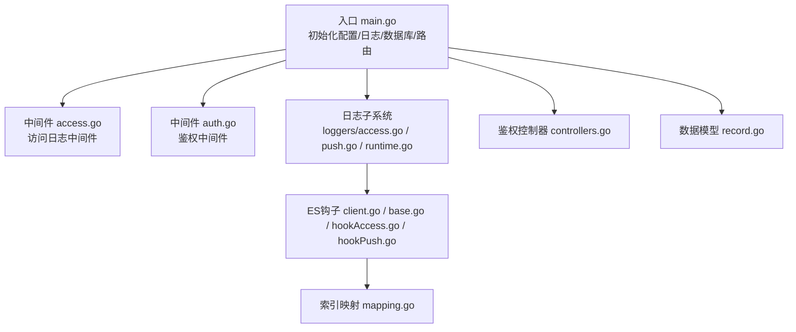
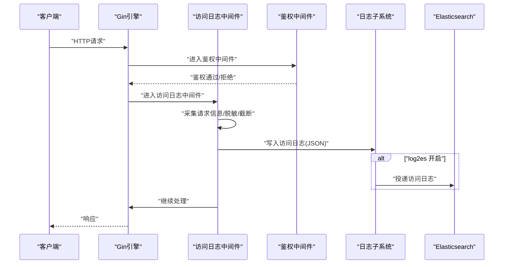
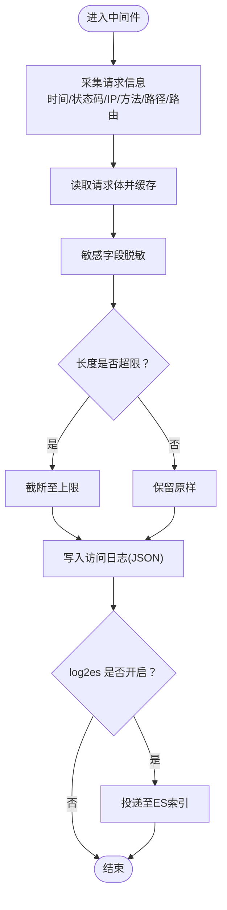
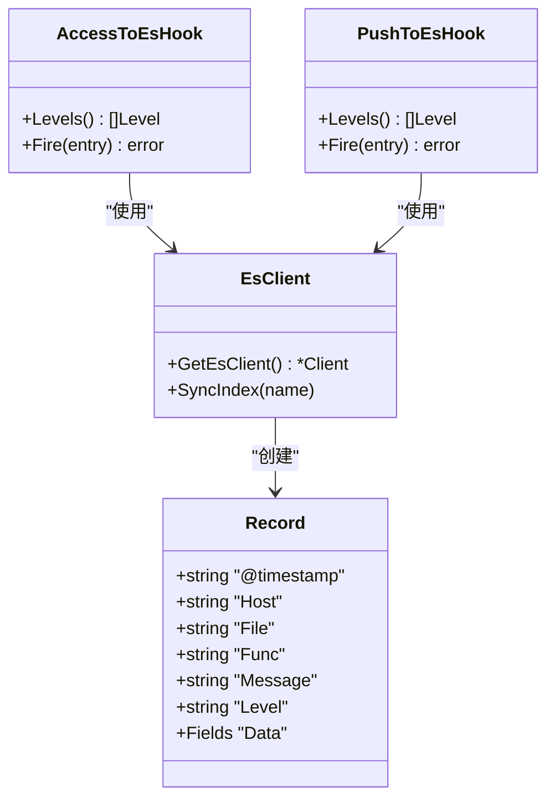
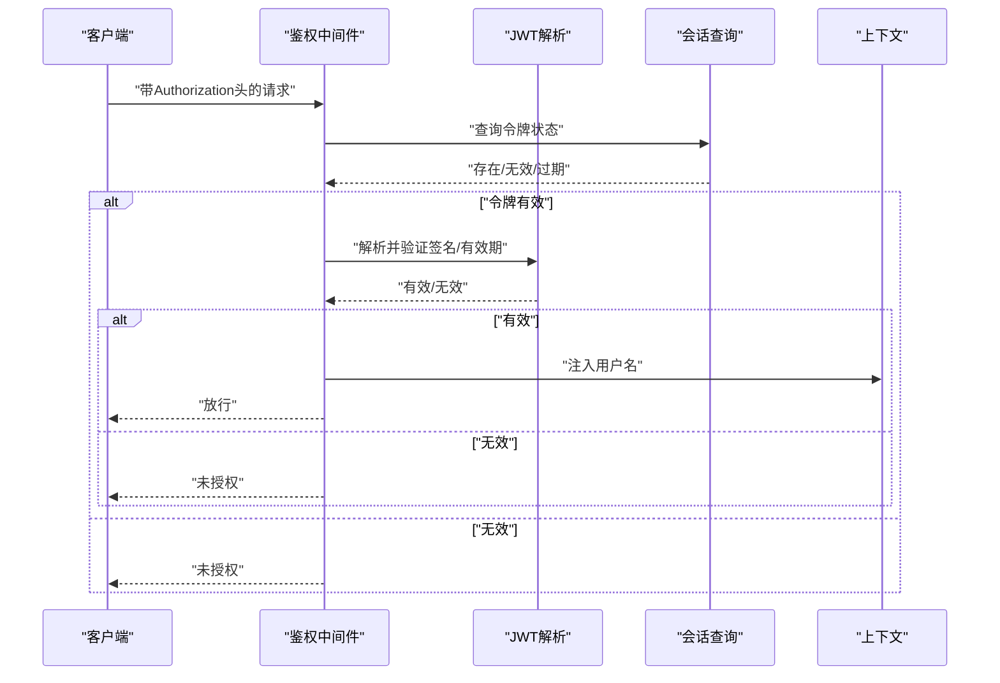
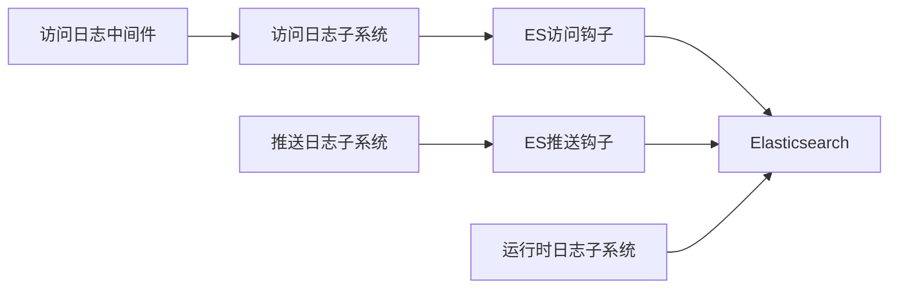

# 安全审计与监控

<cite>
**本文引用的文件**
- [main.go](file://main.go)
- [default.yaml](file://config/default.yaml)
- [access.go](file://pkg/middleware/access.go)
- [auth.go](file://pkg/middleware/auth.go)
- [access.go](file://pkg/utils/log/loggers/access.go)
- [push.go](file://pkg/utils/log/loggers/push.go)
- [runtime.go](file://pkg/utils/log/loggers/runtime.go)
- [client.go](file://pkg/utils/log/hooks/es/client.go)
- [base.go](file://pkg/utils/log/hooks/es/base.go)
- [hookAccess.go](file://pkg/utils/log/hooks/es/hookAccess.go)
- [hookPush.go](file://pkg/utils/log/hooks/es/hookPush.go)
- [mapping.go](file://pkg/utils/log/hooks/es/mapping.go)
- [controllers.go](file://pkg/authorization/controllers.go)
- [record.go](file://pkg/models/record.go)
- [a2template.json](file://vue/src/views/main/a2template.json)
- [vars.json](file://pkg/utils/vars.json)
- [template.json](file://pkg/utils/template.json)
</cite>

## 目录
1. [简介](#简介)
2. [项目结构](#项目结构)
3. [核心组件](#核心组件)
4. [架构总览](#架构总览)
5. [详细组件分析](#详细组件分析)
6. [依赖分析](#依赖分析)
7. [性能考虑](#性能考虑)
8. [故障排查指南](#故障排查指南)
9. [结论](#结论)
10. [附录](#附录)

## 简介
本技术文档面向“安全审计与监控”系统，围绕访问日志、操作日志、安全事件日志的采集、格式化、传输与存储展开，结合鉴权中间件与日志钩子，构建可扩展的审计能力。文档同时涵盖日志监控与告警联动、合规与审计报告生成建议，以及日志管理最佳实践（轮转、压缩归档、隐私保护）。

## 项目结构
系统采用分层组织：入口初始化、路由注册、中间件、日志子系统、ES钩子与索引映射、鉴权模型与数据库模型等。核心启动流程在入口文件中完成配置、日志初始化与数据库初始化，随后注册路由并启动服务。

图表来源
- [main.go:13-35](file://main.go#L13-L35)
- [access.go:23-71](file://pkg/middleware/access.go#L23-L71)
- [auth.go:12-61](file://pkg/middleware/auth.go#L12-L61)
- [access.go:15-58](file://pkg/utils/log/loggers/access.go#L15-L58)
- [push.go:15-58](file://pkg/utils/log/loggers/push.go#L15-L58)
- [runtime.go:15-60](file://pkg/utils/log/loggers/runtime.go#L15-L60)
- [client.go:22-69](file://pkg/utils/log/hooks/es/client.go#L22-L69)
- [base.go:22-78](file://pkg/utils/log/hooks/es/base.go#L22-L78)
- [mapping.go:1-54](file://pkg/utils/log/hooks/es/mapping.go#L1-L54)
- [controllers.go:10-41](file://pkg/authorization/controllers.go#L10-L41)
- [record.go:9-29](file://pkg/models/record.go#L9-L29)

章节来源
- [main.go:13-55](file://main.go#L13-L55)
- [default.yaml:27-44](file://config/default.yaml#L27-L44)

## 核心组件
- 访问日志中间件：拦截请求，采集URI、方法、状态码、耗时、客户端IP、路由、请求体等，并进行敏感字段脱敏与长度截断，最终以JSON格式写入访问日志。
- 操作日志与运行时日志：分别记录推送事件与系统运行信息，支持文本/JSON格式、标准输出与文件双写、可选投递至ES。
- ES钩子与索引：按日期动态创建索引，统一记录结构包含时间戳、主机、调用方、级别、消息与自定义数据；支持访问日志与推送日志两条通道。
- 鉴权中间件：校验Authorization头，解析JWT并验证有效性，将用户名注入上下文，未通过时返回未授权。
- 数据模型：记录发送记录，包含IP、命名空间、URL与目标客户端等字段，便于审计与追踪。

章节来源
- [access.go:23-71](file://pkg/middleware/access.go#L23-L71)
- [access.go:15-58](file://pkg/utils/log/loggers/access.go#L15-L58)
- [push.go:15-58](file://pkg/utils/log/loggers/push.go#L15-L58)
- [runtime.go:15-60](file://pkg/utils/log/loggers/runtime.go#L15-L60)
- [client.go:22-69](file://pkg/utils/log/hooks/es/client.go#L22-L69)
- [base.go:22-78](file://pkg/utils/log/hooks/es/base.go#L22-L78)
- [hookAccess.go:18-24](file://pkg/utils/log/hooks/es/hookAccess.go#L18-L24)
- [hookPush.go:18-24](file://pkg/utils/log/hooks/es/hookPush.go#L18-L24)
- [mapping.go:1-54](file://pkg/utils/log/hooks/es/mapping.go#L1-L54)
- [auth.go:12-61](file://pkg/middleware/auth.go#L12-L61)
- [controllers.go:10-41](file://pkg/authorization/controllers.go#L10-L41)
- [record.go:9-29](file://pkg/models/record.go#L9-L29)

## 架构总览
系统通过中间件在请求链路中采集访问日志，日志子系统负责落盘与可选的ES投递；运行时日志与推送日志分别记录系统运行与消息推送事件；鉴权中间件保障接口访问安全；ES侧通过钩子与映射实现结构化存储与检索。

图表来源
- [access.go:23-71](file://pkg/middleware/access.go#L23-L71)
- [access.go:15-58](file://pkg/utils/log/loggers/access.go#L15-L58)
- [hookAccess.go:18-24](file://pkg/utils/log/hooks/es/hookAccess.go#L18-L24)
- [client.go:22-69](file://pkg/utils/log/hooks/es/client.go#L22-L69)

## 详细组件分析

### 访问日志中间件
- 功能要点
  - 记录请求开始/结束时间、耗时、状态码、客户端IP、方法、路径、路由。
  - 读取并脱敏请求体，屏蔽password、secret、token、authorization等字段，超过长度限制进行截断。
  - 使用JSON格式输出，字段包含起止时间、延迟、状态码、客户端IP、方法、路径、路由、请求体。
- 敏感信息处理
  - 通过正则匹配敏感键，统一替换为占位符，避免明文泄露。
- 输出与传输
  - 写入文件；若启用log2es，通过ES钩子投递至索引“gomessage-access-YYYY.MM.DD”。

图表来源
- [access.go:23-71](file://pkg/middleware/access.go#L23-L71)
- [access.go:15-58](file://pkg/utils/log/loggers/access.go#L15-L58)
- [hookAccess.go:18-24](file://pkg/utils/log/hooks/es/hookAccess.go#L18-L24)

章节来源
- [access.go:13-21](file://pkg/middleware/access.go#L13-L21)
- [access.go:58-68](file://pkg/middleware/access.go#L58-L68)
- [access.go:15-58](file://pkg/utils/log/loggers/access.go#L15-L58)
- [hookAccess.go:18-24](file://pkg/utils/log/hooks/es/hookAccess.go#L18-L24)

### 操作日志与运行时日志
- 运行时日志
  - 支持文本/JSON两种格式，日志级别可配置，输出至标准输出与文件，可选投递至ES。
  - 初始化时根据配置设置级别与格式，并在启用log2es时加载ES钩子。
- 推送日志
  - 专门记录消息推送事件，格式为JSON，可选投递至ES索引“gomessage-push-YYYY.MM.DD”。

章节来源
- [runtime.go:15-60](file://pkg/utils/log/loggers/runtime.go#L15-L60)
- [runtime.go:86-112](file://pkg/utils/log/loggers/runtime.go#L86-L112)
- [push.go:15-58](file://pkg/utils/log/loggers/push.go#L15-L58)
- [hookPush.go:18-24](file://pkg/utils/log/hooks/es/hookPush.go#L18-L24)

### ES钩子与索引映射
- 客户端初始化
  - 单例初始化ES客户端，支持从环境变量覆盖URL、用户名、密码；启用GZIP、关闭嗅探；健康检查间隔可配置。
  - 启动时同步创建三类索引：gomessage-runtime、gomessage-access、gomessage-push。
- 记录结构
  - 统一结构包含时间戳、主机、文件、函数、消息、级别与自定义数据；错误键会被规范化为字符串。
- 索引策略
  - 按日期拼接索引名，如“gomessage-access-YYYY.MM.DD”，映射采用动态属性，便于后续扩展。

图表来源
- [base.go:12-49](file://pkg/utils/log/hooks/es/base.go#L12-L49)
- [hookAccess.go:10-30](file://pkg/utils/log/hooks/es/hookAccess.go#L10-L30)
- [hookPush.go:10-30](file://pkg/utils/log/hooks/es/hookPush.go#L10-L30)
- [client.go:22-69](file://pkg/utils/log/hooks/es/client.go#L22-L69)

章节来源
- [client.go:22-69](file://pkg/utils/log/hooks/es/client.go#L22-L69)
- [base.go:22-78](file://pkg/utils/log/hooks/es/base.go#L22-L78)
- [mapping.go:1-54](file://pkg/utils/log/hooks/es/mapping.go#L1-L54)

### 鉴权中间件与模型
- 鉴权流程
  - 从Authorization头提取令牌，查询会话表确认令牌状态；使用JWT解析并验证签名与有效期；通过后将用户名注入上下文。
- 密钥与哈希
  - JWT密钥来自配置；密码使用bcrypt进行哈希与比对；错误日志通过运行时日志记录。

图表来源
- [auth.go:12-61](file://pkg/middleware/auth.go#L12-L61)
- [controllers.go:10-41](file://pkg/authorization/controllers.go#L10-L41)

章节来源
- [auth.go:12-61](file://pkg/middleware/auth.go#L12-L61)
- [controllers.go:10-41](file://pkg/authorization/controllers.go#L10-L41)

### 数据模型与审计追踪
- 记录模型
  - 包含主键、软删除索引、IP、命名空间、URL与客户端列表等字段；提供新增记录的持久化方法。
- 审计意义
  - 可用于追踪消息发送来源、目标与时间，配合访问日志与推送日志形成闭环审计。

章节来源
- [record.go:9-29](file://pkg/models/record.go#L9-L29)

### 告警联动与模板
- 告警数据结构
  - 提供示例告警JSON，包含状态、标签、注解、开始/结束时间、外部URL等字段，便于与Prometheus/Alertmanager对接。
- 变量映射
  - 定义N1-N9变量映射，用于模板渲染，支持标题、级别、主机、描述、状态、时间、规则与报警详情链接。
- 模板
  - 提供模板内容，支持合并渲染与非合并渲染两种模式，便于适配不同渠道（如钉钉、企业微信机器人等）。

章节来源
- [a2template.json:1-91](file://vue/src/views/main/a2template.json#L1-L91)
- [vars.json:1-28](file://pkg/utils/vars.json#L1-L28)
- [template.json:1-4](file://pkg/utils/template.json#L1-L4)

## 依赖分析
- 组件耦合
  - 中间件与日志子系统松耦合，日志子系统通过钩子与ES交互，便于扩展或禁用。
  - ES钩子依赖ES客户端单例，避免重复初始化。
- 外部依赖
  - Elasticsearch 7.x+；Logrus；Gin；JWT；bcrypt；Viper配置。
- 潜在循环依赖
  - 未发现直接循环导入；日志钩子与客户端通过包内函数解耦。

图表来源
- [access.go:23-71](file://pkg/middleware/access.go#L23-L71)
- [access.go:15-58](file://pkg/utils/log/loggers/access.go#L15-L58)
- [push.go:15-58](file://pkg/utils/log/loggers/push.go#L15-L58)
- [runtime.go:15-60](file://pkg/utils/log/loggers/runtime.go#L15-L60)
- [hookAccess.go:18-24](file://pkg/utils/log/hooks/es/hookAccess.go#L18-L24)
- [hookPush.go:18-24](file://pkg/utils/log/hooks/es/hookPush.go#L18-L24)
- [client.go:22-69](file://pkg/utils/log/hooks/es/client.go#L22-L69)

## 性能考虑
- 日志写入
  - 文件与标准输出双写，避免阻塞；JSON格式便于结构化检索。
- ES投递
  - 超时控制与GZIP压缩降低网络开销；按天索引提升查询效率。
- 中间件开销
  - 请求体读取与脱敏在内存中完成，建议对超长请求体进行截断，避免内存压力。
- 并发与稳定性
  - ES客户端单例初始化，减少连接成本；健康检查与错误日志有助于定位问题。

## 故障排查指南
- ES连接失败
  - 检查ES地址、用户名、密码与可用性；确认log2es开关与环境变量覆盖。
- 日志文件创建失败
  - 检查日志目录权限与路径；确认配置项是否正确。
- 鉴权失败
  - 核对Authorization头格式与令牌有效性；确认会话表中令牌状态；检查JWT密钥配置。
- 日志级别与格式
  - 根据需求调整log.level与log.format；确认是否需要同时输出至标准输出与文件。

章节来源
- [client.go:29-69](file://pkg/utils/log/hooks/es/client.go#L29-L69)
- [runtime.go:16-60](file://pkg/utils/log/loggers/runtime.go#L16-L60)
- [access.go:15-30](file://pkg/utils/log/loggers/access.go#L15-L30)
- [auth.go:12-61](file://pkg/middleware/auth.go#L12-L61)

## 结论
本系统通过中间件采集访问日志、日志子系统落盘与可选ES投递、鉴权中间件保障访问安全，结合ES索引与映射实现结构化存储与检索。配合告警数据结构与模板，可快速对接Prometheus/Alertmanager，形成从“访问审计—运行审计—安全告警”的完整闭环。建议在生产环境中启用ES投递、完善日志轮转与归档策略，并持续优化敏感信息脱敏范围与告警阈值。

## 附录

### 日志记录内容与格式
- 访问日志字段
  - 起止时间、延迟、状态码、客户端IP、方法、路径、路由、请求体（脱敏与截断）。
- 运行时/推送日志字段
  - 时间戳、主机、文件、函数、消息、级别、自定义数据。
- JSON格式
  - 统一时间戳格式与时区；错误键标准化为字符串；数据字段按需扩展。

章节来源
- [access.go:58-68](file://pkg/middleware/access.go#L58-L68)
- [base.go:22-49](file://pkg/utils/log/hooks/es/base.go#L22-L49)

### 日志监控与告警
- 实时监控
  - 通过ES索引聚合与可视化工具（如Kibana）进行实时监控。
- 告警机制
  - 建议基于ES查询与规则引擎（如Prometheus+Alertmanager）建立阈值与异常检测；模板变量映射便于统一渲染。
- 日志聚合
  - 按天索引聚合，结合字段关键词与时间范围进行检索与聚合分析。

章节来源
- [mapping.go:1-54](file://pkg/utils/log/hooks/es/mapping.go#L1-L54)
- [a2template.json:1-91](file://vue/src/views/main/a2template.json#L1-L91)
- [vars.json:1-28](file://pkg/utils/vars.json#L1-L28)
- [template.json:1-4](file://pkg/utils/template.json#L1-L4)

### 安全事件检测与响应
- 异常行为识别
  - 基于访问日志中的异常状态码、高延迟、异常路径与异常请求体进行识别。
- 风险评估
  - 结合鉴权失败次数、异常IP、异常路由等指标进行风险评分。
- 自动响应
  - 通过告警通道（钉钉、企业微信机器人等）自动推送处置建议与处置流程链接。

章节来源
- [access.go:23-71](file://pkg/middleware/access.go#L23-L71)
- [auth.go:12-61](file://pkg/middleware/auth.go#L12-L61)
- [a2template.json:1-91](file://vue/src/views/main/a2template.json#L1-L91)

### 日志管理与存储最佳实践
- 日志轮转
  - 使用系统级轮转工具（如logrotate）按大小或时间轮转，保留历史周期内的日志。
- 压缩归档
  - 对旧日志进行压缩归档，降低存储成本；保留索引以便检索。
- 隐私保护
  - 在日志中屏蔽敏感字段（密码、密钥、令牌等）；对日志内容进行脱敏与截断；最小化日志保留周期。

章节来源
- [access.go:13-21](file://pkg/middleware/access.go#L13-L21)
- [default.yaml:27-44](file://config/default.yaml#L27-L44)

### 合规要求与审计报告
- 合规要求
  - 确保日志完整性、不可否认性与可追溯性；遵循最小可见原则与数据最小化；定期备份与离线归档。
- 审计报告
  - 基于ES索引导出统计报表，包含访问趋势、异常事件、告警统计与处置结果；支持按时间、路由、IP、状态码等维度聚合。

章节来源
- [base.go:22-78](file://pkg/utils/log/hooks/es/base.go#L22-L78)
- [mapping.go:1-54](file://pkg/utils/log/hooks/es/mapping.go#L1-L54)