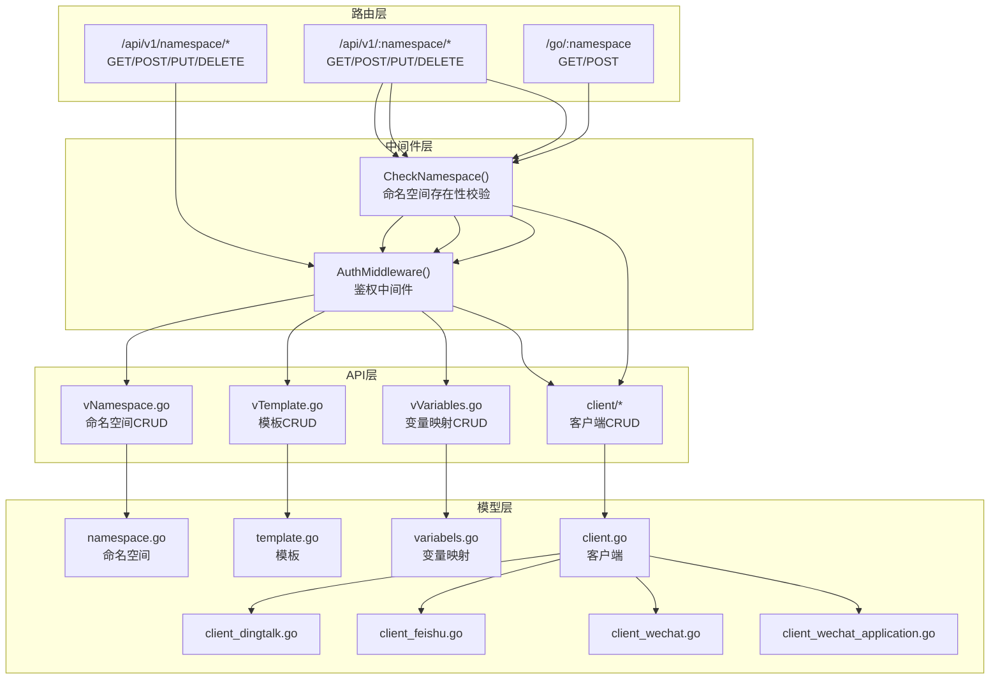
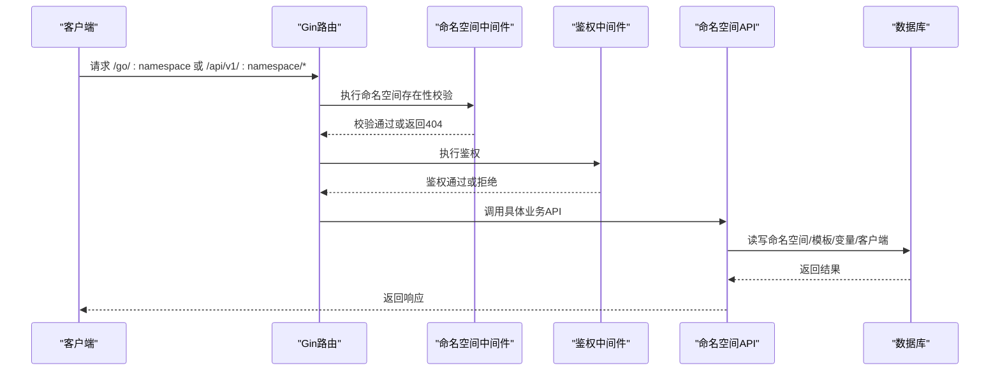
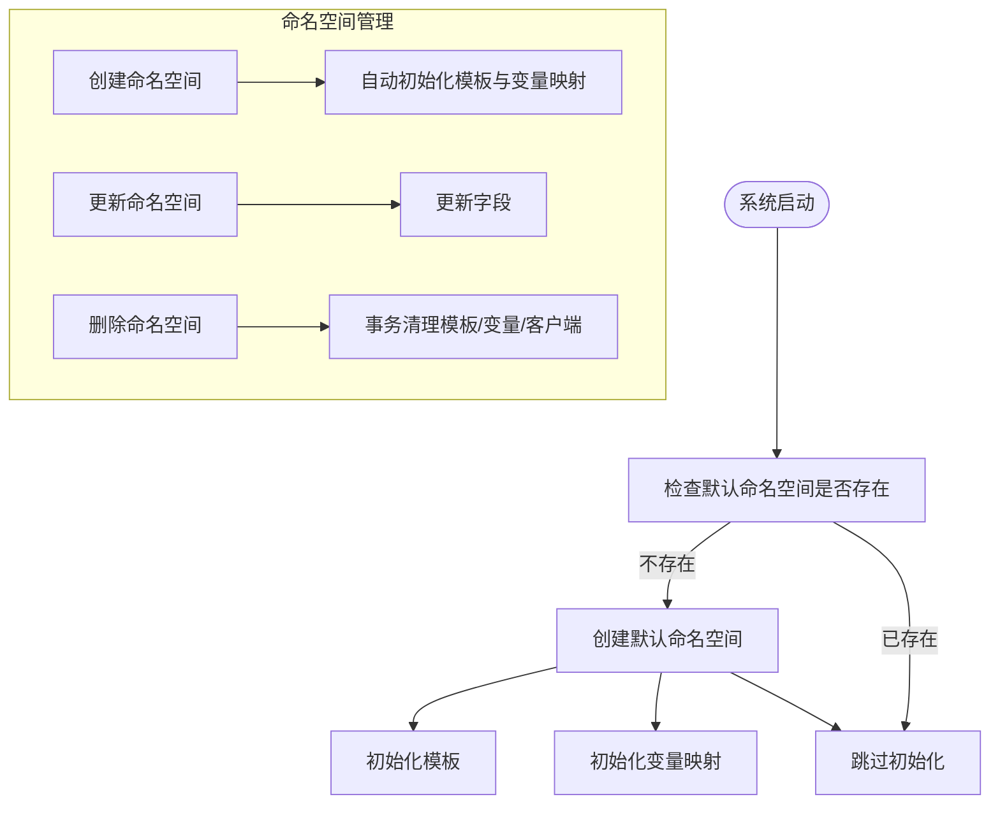
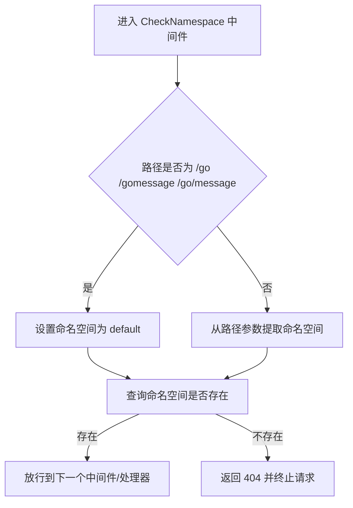
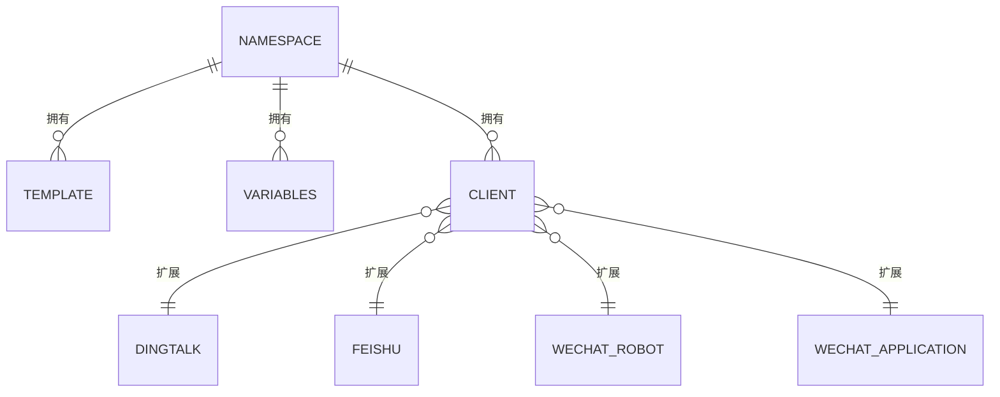
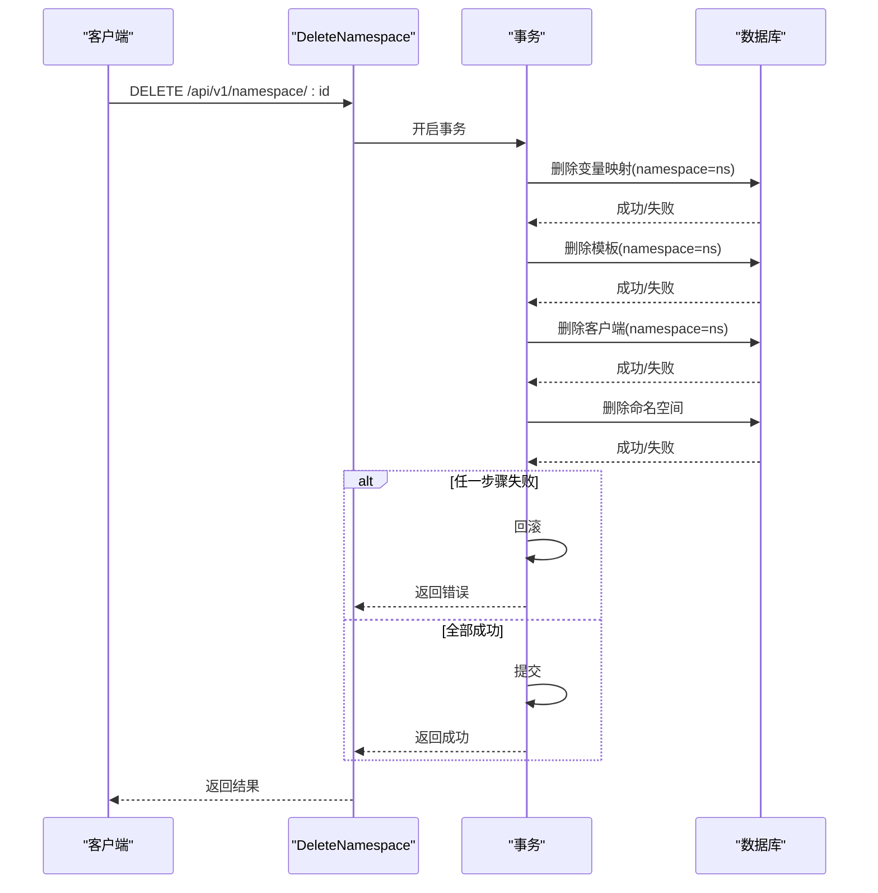
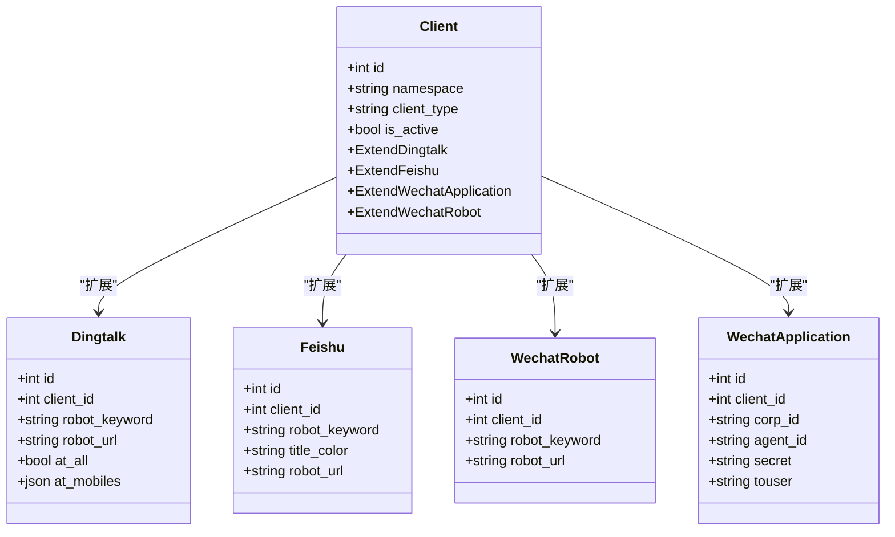
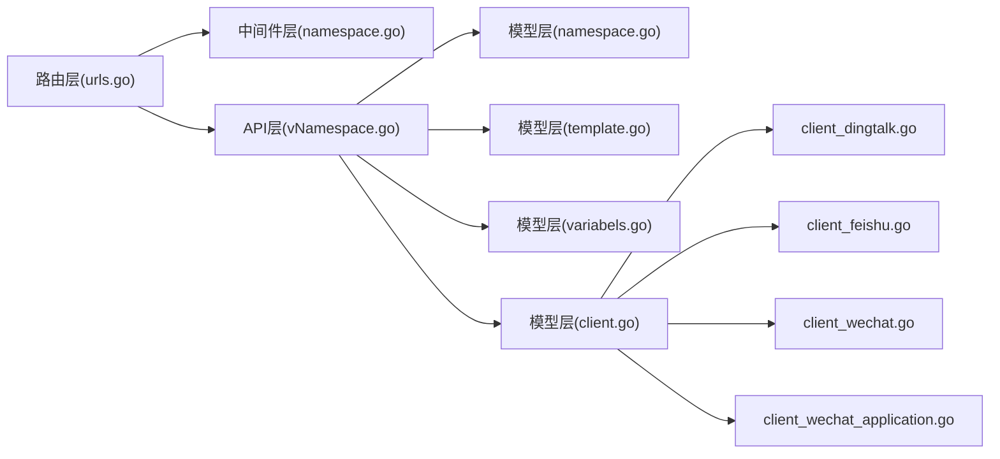

# 命名空间管理

<cite>
**本文引用的文件**
- [main.go](file://main.go)
- [urls.go](file://pkg/routers/urls.go)
- [namespace.go](file://pkg/models/namespace.go)
- [namespace_init.go](file://pkg/models/namespace_init.go)
- [namespace.go](file://pkg/middleware/namespace.go)
- [vNamespace.go](file://pkg/api/vNamespace.go)
- [template.go](file://pkg/models/template.go)
- [variabels.go](file://pkg/models/variabels.go)
- [client.go](file://pkg/models/client.go)
- [client_dingtalk.go](file://pkg/models/client_dingtalk.go)
- [client_feishu.go](file://pkg/models/client_feishu.go)
- [client_wechat.go](file://pkg/models/client_wechat.go)
- [client_wechat_application.go](file://pkg/models/client_wechat_application.go)
- [constants.go](file://pkg/utils/constants.go)
</cite>

## 目录
1. [引言](#引言)
2. [项目结构](#项目结构)
3. [核心组件](#核心组件)
4. [架构总览](#架构总览)
5. [详细组件分析](#详细组件分析)
6. [依赖分析](#依赖分析)
7. [性能考虑](#性能考虑)
8. [故障排查指南](#故障排查指南)
9. [结论](#结论)
10. [附录](#附录)

## 引言
本技术文档围绕“命名空间管理系统”展开，系统通过“命名空间”实现多租户隔离与资源分组，涵盖命名空间的创建、查询、更新、删除与生命周期管理；阐述命名空间在权限控制中的作用（路径级校验、路由级鉴权）、与客户端、模板、变量等资源的关系（绑定、隔离、访问控制）；并提供最佳实践与安全建议，以及扩展与自定义实现思路。

## 项目结构
后端采用 Gin 框架，路由按功能分组，命名空间相关逻辑集中在以下层次：
- 路由层：统一挂载命名空间中间件与鉴权中间件，暴露命名空间 CRUD 接口与命名空间内资源接口
- 中间件层：命名空间存在性校验中间件，确保请求落到存在的命名空间
- API 层：命名空间的增删查改与命名空间内资源的查询与维护
- 模型层：命名空间、模板、变量、客户端及其扩展表的 ORM 定义与 CRUD 方法
- 初始化层：系统启动时创建默认命名空间，并为其初始化模板与变量映射

图表来源
- [urls.go:21-109](file://pkg/routers/urls.go#L21-L109)
- [namespace.go:20-47](file://pkg/middleware/namespace.go#L20-L47)
- [vNamespace.go:15-149](file://pkg/api/vNamespace.go#L15-L149)
- [namespace.go:12-106](file://pkg/models/namespace.go#L12-L106)
- [template.go:9-72](file://pkg/models/template.go#L9-L72)
- [variabels.go:9-89](file://pkg/models/variabels.go#L9-L89)
- [client.go:13-239](file://pkg/models/client.go#L13-L239)
- [client_dingtalk.go:21-38](file://pkg/models/client_dingtalk.go#L21-L38)
- [client_feishu.go:8-24](file://pkg/models/client_feishu.go#L8-L24)
- [client_wechat.go:8-24](file://pkg/models/client_wechat.go#L8-L24)
- [client_wechat_application.go:8-24](file://pkg/models/client_wechat_application.go#L8-L24)

章节来源
- [urls.go:21-109](file://pkg/routers/urls.go#L21-L109)
- [main.go:13-35](file://main.go#L13-L35)

## 核心组件
- 命名空间模型：提供命名空间的增删查改、存在性判断、按激活状态筛选等能力
- 命名空间中间件：在路由层对命名空间进行存在性校验，防止访问不存在的命名空间
- 命名空间 API：提供命名空间的 CRUD 接口，支持创建时自动初始化模板与变量映射
- 初始化流程：系统启动时创建默认命名空间，并初始化模板与变量映射
- 资源模型：模板、变量映射、客户端及其扩展表，均以命名空间作为隔离边界
- 常量：定义客户端类型常量，用于客户端扩展表的区分与处理

章节来源
- [namespace.go:12-106](file://pkg/models/namespace.go#L12-L106)
- [namespace.go:20-47](file://pkg/middleware/namespace.go#L20-L47)
- [vNamespace.go:15-149](file://pkg/api/vNamespace.go#L15-L149)
- [namespace_init.go:8-94](file://pkg/models/namespace_init.go#L8-L94)
- [template.go:9-72](file://pkg/models/template.go#L9-L72)
- [variabels.go:9-89](file://pkg/models/variabels.go#L9-L89)
- [client.go:13-239](file://pkg/models/client.go#L13-L239)
- [constants.go:3-9](file://pkg/utils/constants.go#L3-L9)

## 架构总览
系统通过路由分组与中间件实现“命名空间即租户”的隔离策略：
- 公共入口：/go/:namespace 支持 GET/POST，自动重定向至 /go/message
- 命名空间内资源：/api/v1/:namespace/* 下的所有接口均受 CheckNamespace 与 AuthMiddleware 保护
- 命名空间管理：/api/v1/namespace/* 提供命名空间的 CRUD 管理接口
- 初始化：系统启动时创建默认命名空间，并为其初始化模板与变量映射

图表来源
- [urls.go:41-104](file://pkg/routers/urls.go#L41-L104)
- [namespace.go:20-47](file://pkg/middleware/namespace.go#L20-L47)
- [vNamespace.go:15-149](file://pkg/api/vNamespace.go#L15-L149)

## 详细组件分析

### 命名空间模型与生命周期
- 数据结构：包含唯一名称、激活状态、渲染开关、描述等字段
- 生命周期：
  - 初始化：系统启动时创建默认命名空间，若不存在则创建并初始化模板与变量映射
  - 创建：通过 API 创建新命名空间，同时自动初始化模板与变量映射
  - 更新：可修改名称、激活状态、渲染开关与描述
  - 删除：软删除命名空间，同时事务性清理该命名空间下的模板、变量映射与客户端

图表来源
- [namespace_init.go:8-94](file://pkg/models/namespace_init.go#L8-L94)
- [vNamespace.go:34-55](file://pkg/api/vNamespace.go#L34-L55)
- [vNamespace.go:98-148](file://pkg/api/vNamespace.go#L98-L148)

章节来源
- [namespace.go:12-106](file://pkg/models/namespace.go#L12-L106)
- [namespace_init.go:8-94](file://pkg/models/namespace_init.go#L8-L94)
- [vNamespace.go:15-149](file://pkg/api/vNamespace.go#L15-L149)

### 命名空间中间件与权限边界
- 路径解析：当请求路径为 /go、/gomessage 或 /go/message 时，默认使用命名空间 default；否则从路径参数提取命名空间
- 存在性校验：若命名空间不存在，立即中断请求并返回 404
- 权限边界：结合鉴权中间件，确保仅对已认证用户开放命名空间内资源操作

图表来源
- [namespace.go:20-47](file://pkg/middleware/namespace.go#L20-L47)

章节来源
- [namespace.go:20-47](file://pkg/middleware/namespace.go#L20-L47)
- [urls.go:41-104](file://pkg/routers/urls.go#L41-L104)

### 命名空间与资源关系（模板、变量、客户端）
- 模板：每个命名空间可拥有独立模板，按命名空间过滤查询与更新
- 变量映射：命名空间内的变量键值对，支持批量更新与按命名空间查询
- 客户端：每个客户端绑定到特定命名空间，支持按命名空间列出、按激活状态筛选、更新激活状态等

图表来源
- [namespace.go:12-26](file://pkg/models/namespace.go#L12-L26)
- [template.go:9-22](file://pkg/models/template.go#L9-L22)
- [variabels.go:9-22](file://pkg/models/variabels.go#L9-L22)
- [client.go:13-38](file://pkg/models/client.go#L13-L38)
- [client_dingtalk.go:21-38](file://pkg/models/client_dingtalk.go#L21-L38)
- [client_feishu.go:8-24](file://pkg/models/client_feishu.go#L8-L24)
- [client_wechat.go:8-24](file://pkg/models/client_wechat.go#L8-L24)
- [client_wechat_application.go:8-24](file://pkg/models/client_wechat_application.go#L8-L24)

章节来源
- [template.go:55-72](file://pkg/models/template.go#L55-L72)
- [variabels.go:59-89](file://pkg/models/variabels.go#L59-L89)
- [client.go:221-239](file://pkg/models/client.go#L221-L239)

### 命名空间删除流程（事务性清理）
删除命名空间时，系统以事务方式依次清理该命名空间下的模板、变量映射与客户端，确保一致性。

图表来源
- [vNamespace.go:98-148](file://pkg/api/vNamespace.go#L98-L148)

章节来源
- [vNamespace.go:98-148](file://pkg/api/vNamespace.go#L98-L148)

### 客户端类型与扩展表
- 客户端类型常量：钉钉、飞书、企业微信机器人、企业微信应用
- 客户端模型：包含通用字段与扩展字段，扩展字段根据类型写入对应的扩展表
- 扩展表：钉钉、飞书、企业微信机器人、企业微信应用各自独立表，存储与类型相关的扩展信息

图表来源
- [client.go:13-239](file://pkg/models/client.go#L13-L239)
- [client_dingtalk.go:21-38](file://pkg/models/client_dingtalk.go#L21-L38)
- [client_feishu.go:8-24](file://pkg/models/client_feishu.go#L8-L24)
- [client_wechat.go:8-24](file://pkg/models/client_wechat.go#L8-L24)
- [client_wechat_application.go:8-24](file://pkg/models/client_wechat_application.go#L8-L24)
- [constants.go:3-9](file://pkg/utils/constants.go#L3-L9)

章节来源
- [client.go:40-87](file://pkg/models/client.go#L40-L87)
- [client.go:89-147](file://pkg/models/client.go#L89-L147)
- [client.go:162-210](file://pkg/models/client.go#L162-L210)
- [constants.go:3-9](file://pkg/utils/constants.go#L3-L9)

## 依赖分析
- 路由层依赖中间件层与 API 层；API 层依赖模型层；模型层依赖数据库层
- 命名空间中间件对所有命名空间内资源接口生效，形成统一的命名空间边界
- 命名空间删除接口依赖模板、变量映射、客户端模型，确保删除一致性

图表来源
- [urls.go:21-109](file://pkg/routers/urls.go#L21-L109)
- [namespace.go:20-47](file://pkg/middleware/namespace.go#L20-L47)
- [vNamespace.go:15-149](file://pkg/api/vNamespace.go#L15-L149)
- [namespace.go:12-106](file://pkg/models/namespace.go#L12-L106)
- [template.go:9-72](file://pkg/models/template.go#L9-L72)
- [variabels.go:9-89](file://pkg/models/variabels.go#L9-L89)
- [client.go:13-239](file://pkg/models/client.go#L13-L239)
- [client_dingtalk.go:21-38](file://pkg/models/client_dingtalk.go#L21-L38)
- [client_feishu.go:8-24](file://pkg/models/client_feishu.go#L8-L24)
- [client_wechat.go:8-24](file://pkg/models/client_wechat.go#L8-L24)
- [client_wechat_application.go:8-24](file://pkg/models/client_wechat_application.go#L8-L24)

章节来源
- [urls.go:21-109](file://pkg/routers/urls.go#L21-L109)
- [vNamespace.go:98-148](file://pkg/api/vNamespace.go#L98-L148)

## 性能考虑
- 命名空间存在性校验：在路由层尽早拦截无效命名空间请求，减少后续处理开销
- 事务删除：删除命名空间时使用事务保证一致性，避免部分清理导致的数据不一致
- 模板与变量映射：按命名空间查询时应确保数据库对 namespace 字段建立索引，提升查询效率
- 客户端扩展表：不同类型的客户端扩展表独立存储，便于按需查询与扩展

## 故障排查指南
- 访问 /go/:namespace 返回 404：确认命名空间是否存在，或检查中间件是否正确解析命名空间
- 删除命名空间失败：检查事务回滚原因，确认模板、变量映射、客户端删除是否成功
- 客户端创建失败：检查客户端类型是否在常量定义范围内，扩展表字段是否完整

章节来源
- [namespace.go:20-47](file://pkg/middleware/namespace.go#L20-L47)
- [vNamespace.go:98-148](file://pkg/api/vNamespace.go#L98-L148)
- [constants.go:3-9](file://pkg/utils/constants.go#L3-L9)

## 结论
命名空间管理通过“命名空间即租户”的设计理念，实现了多租户隔离与资源分组。系统在路由层与中间件层统一实施命名空间边界，在 API 层提供完整的 CRUD 能力，并在初始化阶段自动为命名空间注入模板与变量映射。删除命名空间时采用事务性清理，确保数据一致性。通过客户端扩展表与类型常量，系统具备良好的扩展性与可维护性。

## 附录
- 最佳实践
  - 使用默认命名空间作为系统内置通道，避免重复创建同名命名空间
  - 在删除命名空间前，先清理其下模板、变量映射与客户端，确保无残留
  - 对模板与变量映射按命名空间进行严格的权限控制与审计
- 安全考虑
  - 严格启用鉴权中间件，防止未授权访问命名空间内资源
  - 对 /go/:namespace 的访问路径进行白名单与速率限制
  - 客户端扩展表中的敏感字段（如密钥）不应对外暴露
- 扩展与自定义
  - 新增客户端类型：在常量中添加类型标识，在客户端模型与扩展表中增加相应字段与处理逻辑
  - 新增命名空间配置项：在命名空间模型中增加字段，并在初始化与更新流程中同步处理