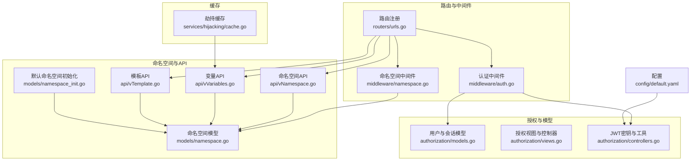
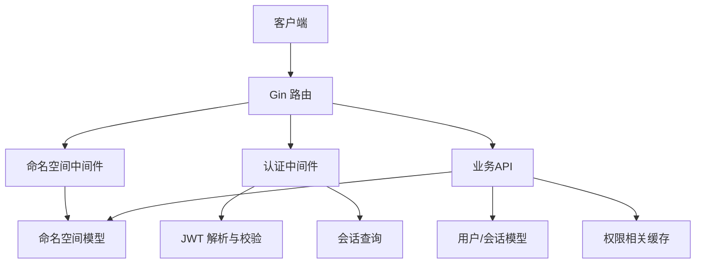
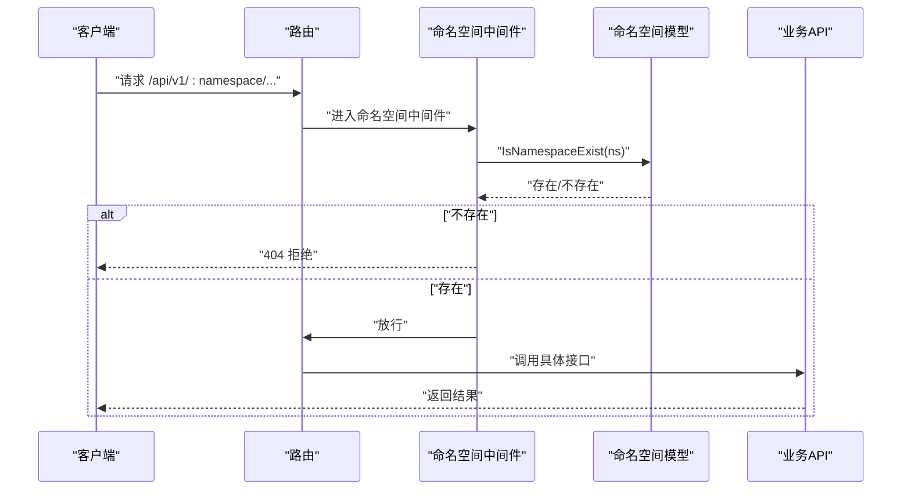
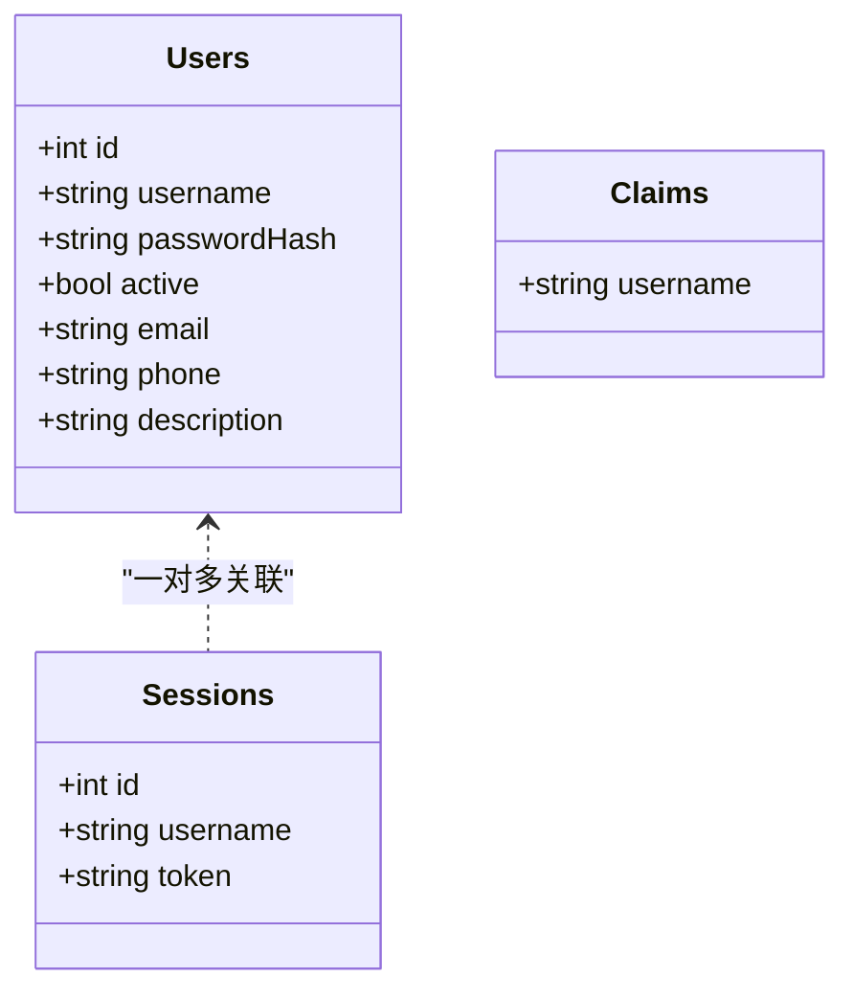
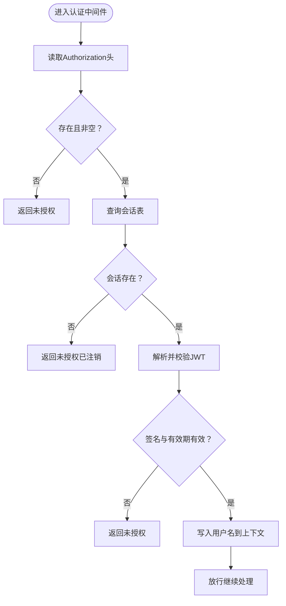
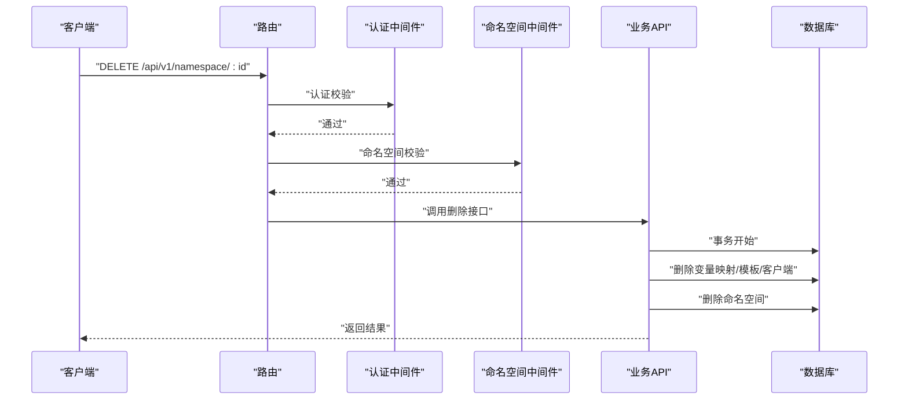
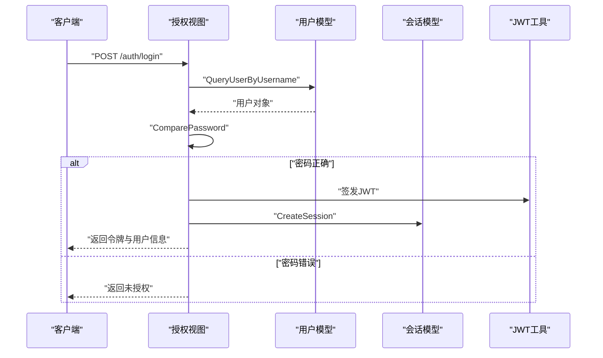
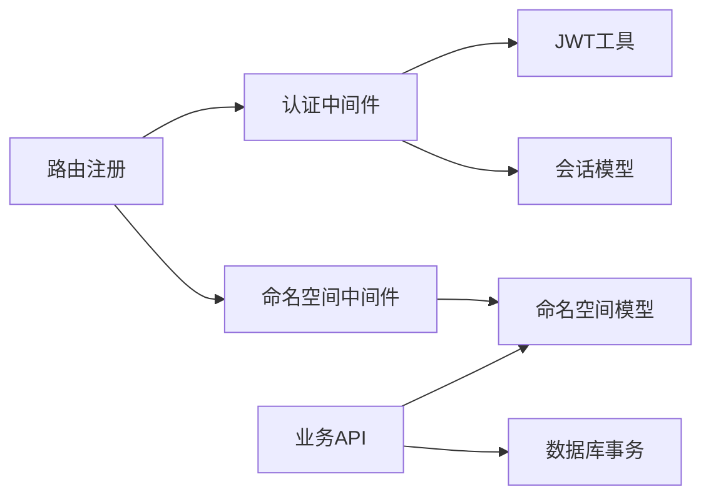

# 权限控制系统

<cite>
**本文引用的文件**
- [controllers.go](file://pkg/authorization/controllers.go)
- [models.go](file://pkg/authorization/models.go)
- [views.go](file://pkg/authorization/views.go)
- [auth.go](file://pkg/middleware/auth.go)
- [namespace.go](file://pkg/middleware/namespace.go)
- [urls.go](file://pkg/routers/urls.go)
- [namespace.go](file://pkg/models/namespace.go)
- [namespace_init.go](file://pkg/models/namespace_init.go)
- [vNamespace.go](file://pkg/api/vNamespace.go)
- [vVariables.go](file://pkg/api/vVariables.go)
- [vTemplate.go](file://pkg/api/vTemplate.go)
- [cache.go](file://pkg/services/hijacking/cache.go)
- [default.yaml](file://config/default.yaml)
</cite>

## 目录
1. [简介](#简介)
2. [项目结构](#项目结构)
3. [核心组件](#核心组件)
4. [架构总览](#架构总览)
5. [详细组件分析](#详细组件分析)
6. [依赖分析](#依赖分析)
7. [性能考量](#性能考量)
8. [故障排查指南](#故障排查指南)
9. [结论](#结论)
10. [附录](#附录)

## 简介
本文件面向权限控制系统，围绕命名空间权限模型、多租户隔离、资源访问控制、权限继承、用户角色与权限定义、API 访问控制、权限控制器工作流、权限缓存策略、最佳实践与安全考虑、扩展与自定义规则等方面进行系统化技术说明。读者可据此理解系统如何通过“命名空间”实现多租户隔离，如何在路由与资源层面对访问进行控制，以及如何在现有基础上扩展权限能力。

## 项目结构
权限控制相关代码主要分布在以下模块：
- 认证与授权：authorization 包（用户模型、会话、JWT 密钥与密码处理）
- 路由与中间件：routers/urls.go（路由注册）、middleware（认证中间件、命名空间中间件）
- 模型与命名空间：models/namespace.*（命名空间 CRUD、默认命名空间初始化）
- API 层：api 包（命名空间、变量、模板等业务接口）
- 缓存：services/hijacking/cache.go（数据劫持缓存，用于权限相关场景的临时数据）

**图表来源**
- [urls.go:21-108](file://pkg/routers/urls.go#L21-L108)
- [auth.go:12-61](file://pkg/middleware/auth.go#L12-L61)
- [namespace.go:20-46](file://pkg/middleware/namespace.go#L20-L46)
- [models.go:10-134](file://pkg/authorization/models.go#L10-L134)
- [controllers.go:10-40](file://pkg/authorization/controllers.go#L10-L40)
- [namespace.go:12-105](file://pkg/models/namespace.go#L12-L105)
- [namespace_init.go:8-31](file://pkg/models/namespace_init.go#L8-L31)
- [vNamespace.go:15-148](file://pkg/api/vNamespace.go#L15-L148)
- [vVariables.go:12-102](file://pkg/api/vVariables.go#L12-L102)
- [vTemplate.go:13-146](file://pkg/api/vTemplate.go#L13-L146)
- [cache.go:12-63](file://pkg/services/hijacking/cache.go#L12-L63)
- [default.yaml:11-13](file://config/default.yaml#L11-L13)

**章节来源**
- [urls.go:21-108](file://pkg/routers/urls.go#L21-L108)
- [namespace.go:20-46](file://pkg/middleware/namespace.go#L20-L46)
- [models.go:10-134](file://pkg/authorization/models.go#L10-L134)
- [controllers.go:10-40](file://pkg/authorization/controllers.go#L10-L40)
- [namespace.go:12-105](file://pkg/models/namespace.go#L12-L105)
- [namespace_init.go:8-31](file://pkg/models/namespace_init.go#L8-L31)
- [vNamespace.go:15-148](file://pkg/api/vNamespace.go#L15-L148)
- [vVariables.go:12-102](file://pkg/api/vVariables.go#L12-L102)
- [vTemplate.go:13-146](file://pkg/api/vTemplate.go#L13-L146)
- [cache.go:12-63](file://pkg/services/hijacking/cache.go#L12-L63)
- [default.yaml:11-13](file://config/default.yaml#L11-L13)

## 核心组件
- 命名空间模型与默认命名空间
  - 命名空间作为“通道”的概念，承担多租户隔离职责；提供增删改查与存在性判断。
  - 默认命名空间在系统初始化时创建，并自动注入模板与变量映射。
- 用户与会话模型
  - 用户实体包含用户名、密码哈希、激活状态等；会话实体保存登录态令牌。
  - 提供用户创建、密码更新、会话创建与查询、令牌查询等能力。
- JWT 与认证中间件
  - 使用 HS256 签名，密钥来自配置；中间件负责从请求头提取令牌、校验签名与有效期、核对会话表状态。
- 命名空间中间件
  - 在路由层对命名空间参数进行存在性校验，拦截非法命名空间请求。
- API 层
  - 命名空间、变量、模板等接口均以命名空间为作用域，确保资源级访问控制。
- 缓存
  - 提供基于内存的简单缓存，用于权限相关场景的临时数据存储。

**章节来源**
- [namespace.go:12-105](file://pkg/models/namespace.go#L12-L105)
- [namespace_init.go:8-31](file://pkg/models/namespace_init.go#L8-L31)
- [models.go:10-134](file://pkg/authorization/models.go#L10-L134)
- [controllers.go:10-40](file://pkg/authorization/controllers.go#L10-L40)
- [auth.go:12-61](file://pkg/middleware/auth.go#L12-L61)
- [namespace.go:20-46](file://pkg/middleware/namespace.go#L20-L46)
- [vNamespace.go:15-148](file://pkg/api/vNamespace.go#L15-L148)
- [vVariables.go:12-102](file://pkg/api/vVariables.go#L12-L102)
- [vTemplate.go:13-146](file://pkg/api/vTemplate.go#L13-L146)
- [cache.go:12-63](file://pkg/services/hijacking/cache.go#L12-L63)

## 架构总览
系统采用“路由 + 中间件 + 模型 + API”的分层架构：
- 路由层：注册公开与受保护接口，按需挂载命名空间中间件与认证中间件。
- 中间件层：统一处理认证（JWT 校验与会话有效性）与命名空间校验。
- 模型层：封装数据访问与业务规则（命名空间存在性、默认命名空间初始化、用户与会话管理）。
- API 层：面向命名空间的资源操作，确保资源级访问控制与一致性。

**图表来源**
- [urls.go:41-104](file://pkg/routers/urls.go#L41-L104)
- [auth.go:12-61](file://pkg/middleware/auth.go#L12-L61)
- [namespace.go:20-46](file://pkg/middleware/namespace.go#L20-L46)
- [namespace.go:96-105](file://pkg/models/namespace.go#L96-L105)
- [models.go:99-134](file://pkg/authorization/models.go#L99-L134)
- [cache.go:38-63](file://pkg/services/hijacking/cache.go#L38-L63)

## 详细组件分析

### 命名空间权限模型与多租户隔离
- 设计要点
  - 命名空间作为租户边界，所有资源（变量、模板、客户端等）均以命名空间为作用域。
  - 默认命名空间在系统初始化时创建，保证最小可用性。
  - 命名空间存在性在路由层强制校验，避免跨租户访问。
- 关键流程
  - 初始化：创建默认命名空间并注入模板与变量映射。
  - 校验：路由匹配后，命名空间中间件查询命名空间是否存在，不存在则直接拒绝。
  - 资源操作：API 层在读写资源时，始终以命名空间为过滤条件，防止越权。

**图表来源**
- [namespace.go:20-46](file://pkg/middleware/namespace.go#L20-L46)
- [namespace.go:96-105](file://pkg/models/namespace.go#L96-L105)
- [urls.go:58-90](file://pkg/routers/urls.go#L58-L90)

**章节来源**
- [namespace_init.go:8-31](file://pkg/models/namespace_init.go#L8-L31)
- [namespace.go:20-46](file://pkg/middleware/namespace.go#L20-L46)
- [namespace.go:96-105](file://pkg/models/namespace.go#L96-L105)
- [urls.go:58-90](file://pkg/routers/urls.go#L58-L90)

### 用户与会话模型、JWT 密钥与密码处理
- 用户模型
  - 字段包含主键、用户名、密码哈希、激活状态、邮箱、电话、描述等。
  - 提供创建、删除、更新、按 ID/用户名查询、初始化管理员等能力。
- 会话模型
  - 存储用户名与令牌，提供创建、删除、查询等。
- JWT 与密码
  - 使用 HS256 签名，密钥来自配置文件。
  - 密码使用 bcrypt 哈希存储，提供哈希生成与比对。

**图表来源**
- [models.go:10-134](file://pkg/authorization/models.go#L10-L134)
- [controllers.go:14-22](file://pkg/authorization/controllers.go#L14-L22)

**章节来源**
- [models.go:10-134](file://pkg/authorization/models.go#L10-L134)
- [controllers.go:10-40](file://pkg/authorization/controllers.go#L10-L40)
- [default.yaml:11-13](file://config/default.yaml#L11-L13)

### 认证中间件与会话校验
- 功能概述
  - 从 Authorization 请求头提取令牌；若缺失或为空，直接返回未授权。
  - 校验令牌签名与有效期；若无效或签名异常，返回未授权。
  - 查询会话表，确认令牌仍处于登录状态；否则视为已注销。
  - 将用户名写入上下文，供后续处理使用。
- 错误处理
  - 统一使用响应工具返回错误信息，便于前端展示与日志追踪。

**图表来源**
- [auth.go:12-61](file://pkg/middleware/auth.go#L12-L61)
- [models.go:120-134](file://pkg/authorization/models.go#L120-L134)

**章节来源**
- [auth.go:12-61](file://pkg/middleware/auth.go#L12-L61)
- [models.go:120-134](file://pkg/authorization/models.go#L120-L134)

### API 访问控制与资源级权限
- 路由级控制
  - 受保护路由组统一挂载认证中间件；命名空间路由组统一挂载命名空间中间件。
- 资源级控制
  - 命名空间、变量、模板等接口均以命名空间为作用域，查询与变更时严格校验命名空间一致性。
  - 删除命名空间时，事务内清理其下所有相关资源（变量映射、模板、客户端），确保数据一致性。

**图表来源**
- [urls.go:95-104](file://pkg/routers/urls.go#L95-L104)
- [vNamespace.go:98-148](file://pkg/api/vNamespace.go#L98-L148)

**章节来源**
- [urls.go:58-104](file://pkg/routers/urls.go#L58-L104)
- [vNamespace.go:98-148](file://pkg/api/vNamespace.go#L98-L148)

### 权限控制器工作流程
- 登录
  - 校验请求体；根据用户名查询用户；比对密码哈希；签发 JWT；创建会话；返回令牌与用户信息。
- 注销
  - 从请求头读取令牌；若非空则删除会话；返回成功。
- 修改密码
  - 校验请求体与用户 ID；更新用户密码哈希；返回成功。

**图表来源**
- [views.go:31-72](file://pkg/authorization/views.go#L31-L72)
- [models.go:73-77](file://pkg/authorization/models.go#L73-L77)
- [models.go:112-119](file://pkg/authorization/models.go#L112-L119)
- [controllers.go:10-12](file://pkg/authorization/controllers.go#L10-L12)

**章节来源**
- [views.go:31-88](file://pkg/authorization/views.go#L31-L88)
- [models.go:73-119](file://pkg/authorization/models.go#L73-L119)
- [controllers.go:10-12](file://pkg/authorization/controllers.go#L10-L12)

### 权限缓存策略
- 现状
  - 提供基于内存的简单缓存结构，支持并发读写锁，用于权限相关场景的临时数据存储。
- 建议
  - 对高频读取的权限元数据（如命名空间配置、变量映射）引入 LRU/带过期时间的缓存。
  - 结合配置热更新与失效策略，避免脏读。

**章节来源**
- [cache.go:12-63](file://pkg/services/hijacking/cache.go#L12-L63)

## 依赖分析
- 路由与中间件
  - 路由注册统一挂载 CORS、访问日志中间件；受保护路由组挂载认证与命名空间中间件。
- 中间件依赖
  - 认证中间件依赖 JWT 工具与会话模型；命名空间中间件依赖命名空间模型。
- API 依赖
  - 命名空间、变量、模板 API 依赖命名空间模型与数据库事务，确保资源级一致性。

**图表来源**
- [urls.go:27-104](file://pkg/routers/urls.go#L27-L104)
- [auth.go:12-61](file://pkg/middleware/auth.go#L12-L61)
- [namespace.go:20-46](file://pkg/middleware/namespace.go#L20-L46)
- [models.go:96-105](file://pkg/models/namespace.go#L96-L105)

**章节来源**
- [urls.go:27-104](file://pkg/routers/urls.go#L27-L104)
- [auth.go:12-61](file://pkg/middleware/auth.go#L12-L61)
- [namespace.go:20-46](file://pkg/middleware/namespace.go#L20-L46)
- [models.go:96-105](file://pkg/models/namespace.go#L96-L105)

## 性能考量
- 中间件链路
  - 认证与命名空间校验均为 O(1)/O(n) 查询，建议在高并发场景下结合连接池与合理的超时设置。
- 缓存
  - 对热点资源（命名空间配置、变量映射）引入缓存可显著降低数据库压力。
- 日志
  - 访问日志包含请求体敏感字段会被脱敏，避免泄露；注意日志落盘与轮转策略。

[本节为通用指导，无需特定文件来源]

## 故障排查指南
- 未授权/令牌无效
  - 检查 Authorization 头是否正确传递；确认 JWT 密钥与签名算法一致；核对会话表中是否存在该令牌。
- 命名空间不存在
  - 确认请求路径中的命名空间参数是否正确；检查命名空间是否存在；默认命名空间是否初始化成功。
- 删除命名空间失败
  - 检查事务是否回滚；确认相关资源是否已清理；查看数据库约束与索引状态。
- 密码修改异常
  - 确认请求体格式与用户 ID；检查密码哈希生成过程；查看数据库更新结果。

**章节来源**
- [auth.go:12-61](file://pkg/middleware/auth.go#L12-L61)
- [namespace.go:20-46](file://pkg/middleware/namespace.go#L20-L46)
- [vNamespace.go:98-148](file://pkg/api/vNamespace.go#L98-L148)
- [views.go:95-126](file://pkg/authorization/views.go#L95-L126)

## 结论
本权限控制系统以“命名空间”为核心隔离单元，结合路由级与资源级访问控制、JWT 认证与会话校验，构建了清晰的多租户权限模型。通过中间件统一处理认证与命名空间校验，API 层确保资源一致性，配合默认命名空间初始化与缓存策略，形成可扩展、可维护的权限体系。建议在生产环境中强化密钥管理、引入细粒度权限与审计日志，并对热点资源增加缓存与限流策略。

[本节为总结，无需特定文件来源]

## 附录

### 最佳实践
- 安全
  - 生产环境务必更换默认 JWT 密钥；对敏感字段进行日志脱敏；启用 HTTPS 与安全响应头。
- 配置
  - 将密钥与敏感配置放入环境变量或安全配置中心；定期轮换密钥。
- 扩展
  - 引入 RBAC 角色与权限矩阵，结合命名空间实现“角色-命名空间-资源”三元权限；在中间件层增加动态权限检查钩子。
- 监控
  - 记录鉴权失败与越权尝试；对异常峰值进行告警；定期审计权限变更。

**章节来源**
- [default.yaml:11-13](file://config/default.yaml#L11-L13)
- [auth.go:12-61](file://pkg/middleware/auth.go#L12-L61)
- [namespace.go:20-46](file://pkg/middleware/namespace.go#L20-L46)