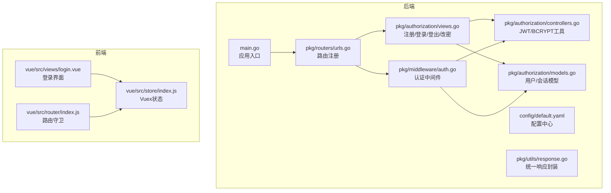
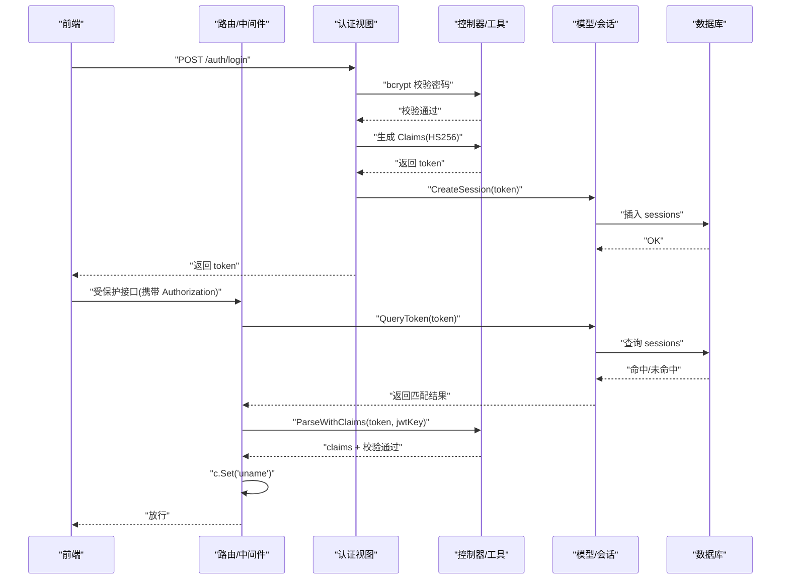
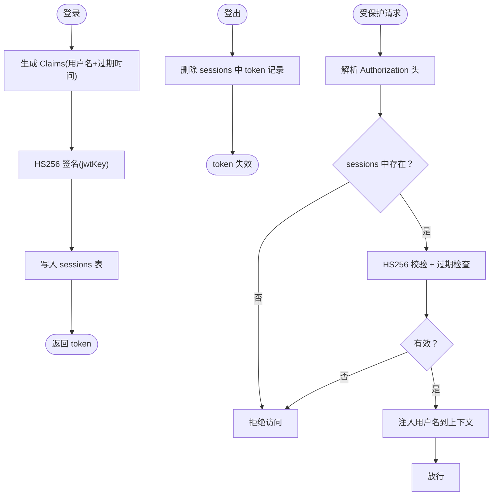
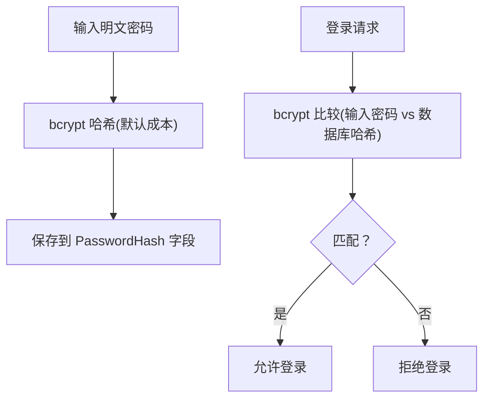
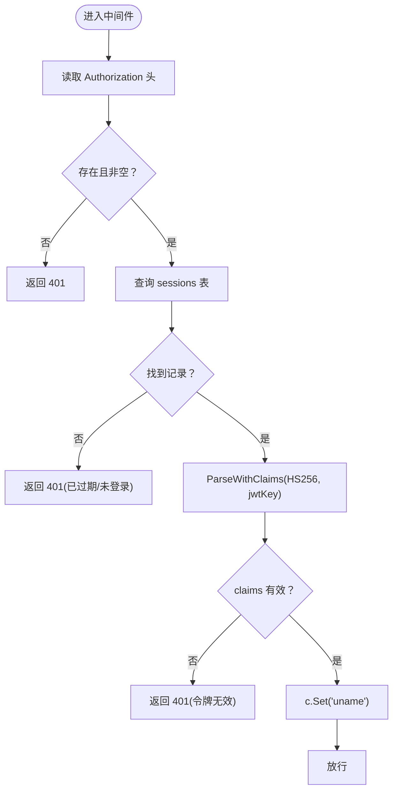
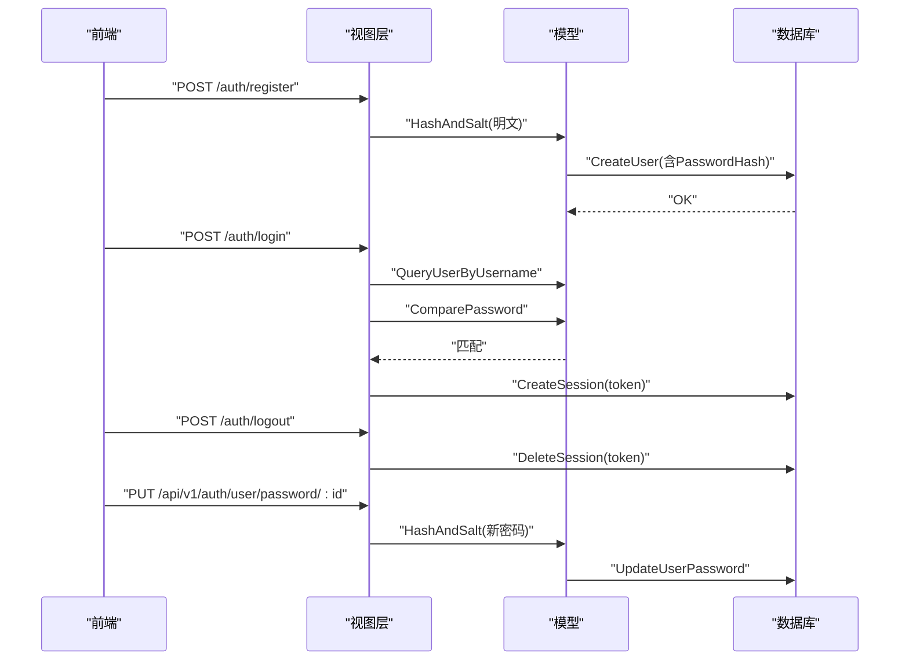
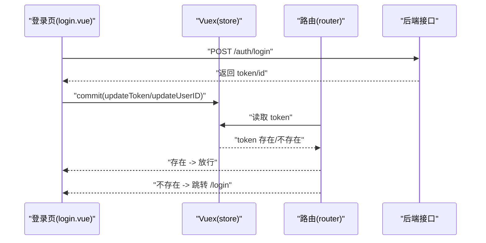
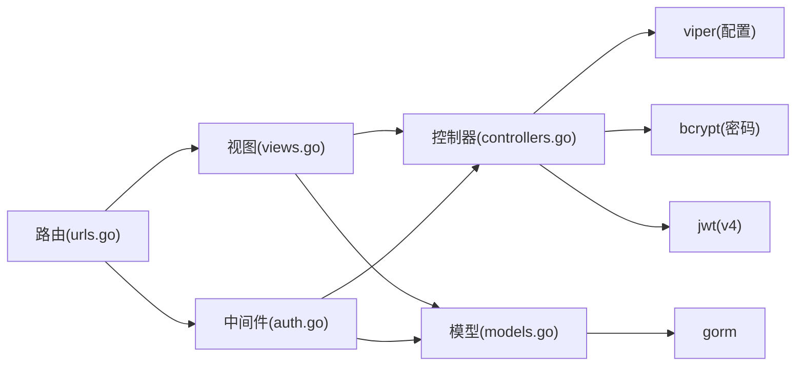

# 用户认证系统

<cite>
**本文引用的文件**
- [main.go](file://main.go)
- [config/default.yaml](file://config/default.yaml)
- [pkg/routers/urls.go](file://pkg/routers/urls.go)
- [pkg/middleware/auth.go](file://pkg/middleware/auth.go)
- [pkg/authorization/controllers.go](file://pkg/authorization/controllers.go)
- [pkg/authorization/models.go](file://pkg/authorization/models.go)
- [pkg/authorization/views.go](file://pkg/authorization/views.go)
- [pkg/utils/response.go](file://pkg/utils/response.go)
- [vue/src/views/login.vue](file://vue/src/views/login.vue)
- [vue/src/store/index.js](file://vue/src/store/index.js)
- [vue/src/router/index.js](file://vue/src/router/index.js)
</cite>

## 目录
1. [简介](#简介)
2. [项目结构](#项目结构)
3. [核心组件](#核心组件)
4. [架构总览](#架构总览)
5. [详细组件分析](#详细组件分析)
6. [依赖分析](#依赖分析)
7. [性能考量](#性能考量)
8. [故障排查指南](#故障排查指南)
9. [结论](#结论)
10. [附录](#附录)

## 简介
本技术文档围绕用户认证系统进行深入解析，涵盖以下主题：
- JWT 认证机制：token 生成、验证、登出（基于会话表的强制失效）。
- 密码存储与验证：bcrypt 哈希算法应用、密码比较流程与安全要点。
- 认证中间件：请求拦截、Authorization 头解析、token 校验、用户信息透传。
- 用户账户管理：注册、登录、登出、密码修改等操作。
- 安全最佳实践：密钥管理、token 存储、防暴力破解、会话管理。
- 扩展与自定义：如何接入自定义认证策略与扩展点。

## 项目结构
后端采用 Go + Gin 框架，认证相关代码集中在 authorization 包与 middleware 包；前端 Vue 单页应用负责登录态与路由守卫。

**图表来源**
- [main.go:1-56](file://main.go#L1-L56)
- [config/default.yaml:1-83](file://config/default.yaml#L1-L83)
- [pkg/routers/urls.go:1-109](file://pkg/routers/urls.go#L1-L109)
- [pkg/middleware/auth.go:1-62](file://pkg/middleware/auth.go#L1-L62)
- [pkg/authorization/controllers.go:1-41](file://pkg/authorization/controllers.go#L1-L41)
- [pkg/authorization/models.go:1-135](file://pkg/authorization/models.go#L1-L135)
- [pkg/authorization/views.go:1-228](file://pkg/authorization/views.go#L1-L228)
- [pkg/utils/response.go:1-28](file://pkg/utils/response.go#L1-L28)
- [vue/src/views/login.vue:1-86](file://vue/src/views/login.vue#L1-L86)
- [vue/src/store/index.js:1-49](file://vue/src/store/index.js#L1-L49)
- [vue/src/router/index.js:101-138](file://vue/src/router/index.js#L101-L138)

**章节来源**
- [main.go:1-56](file://main.go#L1-L56)
- [config/default.yaml:1-83](file://config/default.yaml#L1-L83)
- [pkg/routers/urls.go:1-109](file://pkg/routers/urls.go#L1-L109)

## 核心组件
- 路由与中间件
  - 路由集中于 [pkg/routers/urls.go](file://pkg/routers/urls.go)，注册了认证相关接口与全局中间件（跨域、访问日志），并在特定分组启用认证中间件。
  - 认证中间件位于 [pkg/middleware/auth.go](file://pkg/middleware/auth.go)，负责从 Authorization 头解析 token 并进行校验。
- 认证控制器与工具
  - JWT 密钥、Claims 结构、bcrypt 工具函数位于 [pkg/authorization/controllers.go](file://pkg/authorization/controllers.go)。
  - 用户模型、会话模型、会话 CRUD 与管理员初始化位于 [pkg/authorization/models.go](file://pkg/authorization/models.go)。
- 视图层（接口实现）
  - 注册、登录、登出、修改密码位于 [pkg/authorization/views.go](file://pkg/authorization/views.go)。
- 统一响应
  - 统一响应模板与构造函数位于 [pkg/utils/response.go](file://pkg/utils/response.go)。
- 前端登录态与路由守卫
  - 登录界面、Vuex 状态、路由守卫位于 [vue/src/views/login.vue](file://vue/src/views/login.vue)、[vue/src/store/index.js](file://vue/src/store/index.js)、[vue/src/router/index.js](file://vue/src/router/index.js)。

**章节来源**
- [pkg/routers/urls.go:50-90](file://pkg/routers/urls.go#L50-L90)
- [pkg/middleware/auth.go:12-61](file://pkg/middleware/auth.go#L12-L61)
- [pkg/authorization/controllers.go:10-40](file://pkg/authorization/controllers.go#L10-L40)
- [pkg/authorization/models.go:10-134](file://pkg/authorization/models.go#L10-L134)
- [pkg/authorization/views.go:12-126](file://pkg/authorization/views.go#L12-L126)
- [pkg/utils/response.go:3-27](file://pkg/utils/response.go#L3-L27)
- [vue/src/views/login.vue:26-75](file://vue/src/views/login.vue#L26-L75)
- [vue/src/store/index.js:6-48](file://vue/src/store/index.js#L6-L48)
- [vue/src/router/index.js:109-135](file://vue/src/router/index.js#L109-L135)

## 架构总览
认证系统采用“JWT + 会话表”的双重校验机制：
- 登录成功后签发 JWT，并将 token 写入 sessions 表作为“有效会话”。
- 中间件在每次受保护请求中：
  - 校验 Authorization 头是否存在；
  - 校验 token 是否存在于 sessions 表；
  - 使用 HS256 签名与配置的 jwtKey 解析并验证 claims；
  - 将用户名注入上下文供后续处理器使用。

**图表来源**
- [pkg/authorization/views.go:31-72](file://pkg/authorization/views.go#L31-L72)
- [pkg/middleware/auth.go:12-61](file://pkg/middleware/auth.go#L12-L61)
- [pkg/authorization/controllers.go:10-40](file://pkg/authorization/controllers.go#L10-L40)
- [pkg/authorization/models.go:112-134](file://pkg/authorization/models.go#L112-L134)

## 详细组件分析

### JWT 认证机制
- 生成
  - 登录成功后创建 Claims（含用户名与过期时间），使用 HS256 签名与配置的 jwtKey 生成 token。
  - 同步将 token 写入 sessions 表，作为“有效会话”。
- 验证
  - 中间件从 Authorization 请求头读取 token；
  - 若 token 存在于 sessions 表，解析并校验签名与过期时间；
  - 校验通过后将用户名注入上下文，供后续业务使用。
- 刷新与登出
  - 本仓库未实现专用的“刷新令牌”接口；登出通过前端清理本地 token 或后端删除 sessions 记录实现“强制失效”。

**图表来源**
- [pkg/authorization/views.go:46-71](file://pkg/authorization/views.go#L46-L71)
- [pkg/middleware/auth.go:27-59](file://pkg/middleware/auth.go#L27-L59)
- [pkg/authorization/models.go:112-134](file://pkg/authorization/models.go#L112-L134)

**章节来源**
- [pkg/authorization/views.go:31-72](file://pkg/authorization/views.go#L31-L72)
- [pkg/middleware/auth.go:12-61](file://pkg/middleware/auth.go#L12-L61)
- [pkg/authorization/models.go:99-134](file://pkg/authorization/models.go#L99-L134)

### 密码加密与验证
- 加密
  - 使用 bcrypt 对明文密码进行哈希，成本因子采用默认值。
  - 注册与修改密码均调用哈希函数，将哈希值存入用户表的 PasswordHash 字段。
- 验证
  - 登录时使用 bcrypt 比较输入密码与数据库中哈希值。
- 安全要点
  - bcrypt 自带盐值，无需额外实现；默认成本因子已足够安全。
  - 建议生产环境禁止使用默认 jwtKey，务必替换为强随机密钥。

**图表来源**
- [pkg/authorization/controllers.go:24-40](file://pkg/authorization/controllers.go#L24-L40)
- [pkg/authorization/views.go:21-28](file://pkg/authorization/views.go#L21-L28)
- [pkg/authorization/views.go:119-125](file://pkg/authorization/views.go#L119-L125)
- [pkg/authorization/models.go:50-59](file://pkg/authorization/models.go#L50-L59)

**章节来源**
- [pkg/authorization/controllers.go:24-40](file://pkg/authorization/controllers.go#L24-L40)
- [pkg/authorization/views.go:21-28](file://pkg/authorization/views.go#L21-L28)
- [pkg/authorization/views.go:119-125](file://pkg/authorization/views.go#L119-L125)
- [pkg/authorization/models.go:50-59](file://pkg/authorization/models.go#L50-L59)

### 认证中间件工作流
- 请求拦截
  - 从 Authorization 请求头读取 token；
  - 若缺失或为空，返回未授权。
- token 解析与校验
  - 查询 sessions 表，若不存在则视为未登录；
  - 使用 jwt.ParseWithClaims 解析并校验签名方法与密钥；
  - claims 校验失败或签名异常均返回未授权。
- 用户信息提取
  - 校验通过后将用户名写入上下文，供下游处理器使用。

**图表来源**
- [pkg/middleware/auth.go:12-61](file://pkg/middleware/auth.go#L12-L61)

**章节来源**
- [pkg/middleware/auth.go:12-61](file://pkg/middleware/auth.go#L12-L61)

### 用户账户管理
- 注册
  - 接收用户名与明文密码，生成哈希后入库。
- 登录
  - 校验用户存在性与密码哈希，签发 JWT 并写入 sessions。
- 登出
  - 从 Authorization 头读取 token，删除 sessions 记录，使该 token 失效。
- 修改密码
  - 接收新密码并直接哈希入库，无需校验旧密码。

**图表来源**
- [pkg/authorization/views.go:12-29](file://pkg/authorization/views.go#L12-L29)
- [pkg/authorization/views.go:31-88](file://pkg/authorization/views.go#L31-L88)
- [pkg/authorization/views.go:95-126](file://pkg/authorization/views.go#L95-L126)
- [pkg/authorization/models.go:28-31](file://pkg/authorization/models.go#L28-L31)
- [pkg/authorization/models.go:112-128](file://pkg/authorization/models.go#L112-L128)
- [pkg/authorization/models.go:50-59](file://pkg/authorization/models.go#L50-L59)

**章节来源**
- [pkg/authorization/views.go:12-29](file://pkg/authorization/views.go#L12-L29)
- [pkg/authorization/views.go:31-88](file://pkg/authorization/views.go#L31-L88)
- [pkg/authorization/views.go:95-126](file://pkg/authorization/views.go#L95-L126)
- [pkg/authorization/models.go:28-31](file://pkg/authorization/models.go#L28-L31)
- [pkg/authorization/models.go:112-128](file://pkg/authorization/models.go#L112-L128)
- [pkg/authorization/models.go:50-59](file://pkg/authorization/models.go#L50-L59)

### 前端登录态与路由守卫
- 登录界面
  - 用户输入账号密码后调用登录接口，成功后将 token 与用户 ID 写入 Vuex。
- 路由守卫
  - 在进入受保护路由前，读取 Vuex 中的 token，若不存在则重定向至登录页。
- 注意
  - 本仓库未实现“自动刷新 token”或“静默续期”，需结合后端策略或前端轮询。

**图表来源**
- [vue/src/views/login.vue:42-62](file://vue/src/views/login.vue#L42-L62)
- [vue/src/store/index.js:23-44](file://vue/src/store/index.js#L23-L44)
- [vue/src/router/index.js:109-135](file://vue/src/router/index.js#L109-L135)

**章节来源**
- [vue/src/views/login.vue:26-75](file://vue/src/views/login.vue#L26-L75)
- [vue/src/store/index.js:6-48](file://vue/src/store/index.js#L6-L48)
- [vue/src/router/index.js:109-135](file://vue/src/router/index.js#L109-L135)

## 依赖分析
- 组件耦合
  - 路由层依赖中间件与视图层；中间件依赖控制器与模型；视图层依赖控制器与模型。
- 外部依赖
  - JWT 解析与签名：github.com/golang-jwt/jwt/v4
  - 密码哈希：golang.org/x/crypto/bcrypt
  - 配置读取：github.com/spf13/viper
  - ORM：gorm.io/gorm
- 关键依赖链
  - 登录 → bcrypt 校验 → HS256 签发 → sessions 写入
  - 中间件 → sessions 查询 → jwt 校验 → 上下文注入

**图表来源**
- [pkg/routers/urls.go:1-109](file://pkg/routers/urls.go#L1-L109)
- [pkg/middleware/auth.go:1-10](file://pkg/middleware/auth.go#L1-L10)
- [pkg/authorization/views.go:1-10](file://pkg/authorization/views.go#L1-L10)
- [pkg/authorization/controllers.go:1-8](file://pkg/authorization/controllers.go#L1-L8)
- [pkg/authorization/models.go:1-8](file://pkg/authorization/models.go#L1-L8)

**章节来源**
- [pkg/routers/urls.go:1-109](file://pkg/routers/urls.go#L1-L109)
- [pkg/middleware/auth.go:1-10](file://pkg/middleware/auth.go#L1-L10)
- [pkg/authorization/views.go:1-10](file://pkg/authorization/views.go#L1-L10)
- [pkg/authorization/controllers.go:1-8](file://pkg/authorization/controllers.go#L1-L8)
- [pkg/authorization/models.go:1-8](file://pkg/authorization/models.go#L1-L8)

## 性能考量
- bcrypt 成本因子
  - 默认成本已平衡安全性与性能；如遇高并发登录场景，可评估适当提高成本以增强抗暴力破解能力。
- JWT 解析
  - HS256 解析开销极低；建议避免在高频路径重复解析同一 token。
- sessions 查询
  - 查询 token 是否存在的 SQL 操作简单；建议为 token 字段建立索引以提升命中速度。
- 响应一致性
  - 使用统一响应模板减少前端解析负担，提升整体交互效率。

## 故障排查指南
- 401 未授权
  - 缺少 Authorization 头或为空：检查前端是否正确传递 token。
  - token 不存在于 sessions 表：确认登录成功且未被提前登出。
  - 签名方法不匹配：确保使用 HS256 且 jwtKey 正确。
  - 密钥错误或被篡改：核对配置文件中的 auth.jwtKey。
- 登录失败
  - 用户名不存在或密码错误：确认输入与数据库哈希一致。
- 修改密码失败
  - 参数绑定错误或用户不存在：检查请求体与用户 ID。
- 统一响应
  - 使用统一响应模板，便于定位错误原因与提示信息。

**章节来源**
- [pkg/middleware/auth.go:18-59](file://pkg/middleware/auth.go#L18-L59)
- [pkg/authorization/views.go:16-28](file://pkg/authorization/views.go#L16-L28)
- [pkg/authorization/views.go:42-71](file://pkg/authorization/views.go#L42-L71)
- [pkg/authorization/views.go:100-125](file://pkg/authorization/views.go#L100-L125)
- [pkg/utils/response.go:11-27](file://pkg/utils/response.go#L11-L27)

## 结论
本认证系统通过“JWT + 会话表”的组合实现了基础而稳健的登录态管理：登录签发 token 并持久化会话，中间件统一校验并透传用户信息。密码采用 bcrypt 哈希，具备良好的安全性。建议在生产环境中：
- 替换默认 jwtKey；
- 引入登录失败次数限制与封禁策略；
- 考虑引入 refresh token 与安全存储方案；
- 对敏感接口增加二次校验或动态权限控制。

## 附录

### 安全最佳实践清单
- 密钥管理
  - 生产环境必须替换默认 jwtKey，使用强随机字符串。
- token 存储
  - 前端建议使用 HttpOnly Cookie 或安全存储，避免 XSS 泄露。
- 防暴力破解
  - 登录失败计数、IP/账号锁定、验证码、速率限制。
- 会话管理
  - 登出即刻删除 sessions 记录；定期清理过期会话。
- 传输安全
  - 强制 HTTPS，防止中间人攻击与明文泄露。

**章节来源**
- [config/default.yaml:11-13](file://config/default.yaml#L11-L13)
- [pkg/authorization/views.go:74-88](file://pkg/authorization/views.go#L74-L88)

### 扩展与自定义认证策略
- 自定义签名算法
  - 可替换 HS256 为 RS256，配合公私钥对，提升多节点共享密钥的复杂度。
- 多因子认证(MFA)
  - 在登录流程中增加短信/邮件验证码或TOTP校验。
- 动态权限
  - 在 Claims 中加入角色/权限字段，中间件根据角色放行不同资源。
- 第三方登录
  - 引入 OAuth/OpenID Connect，登录后生成内部 token 并写入 sessions。

[本节为概念性指导，无需代码来源]