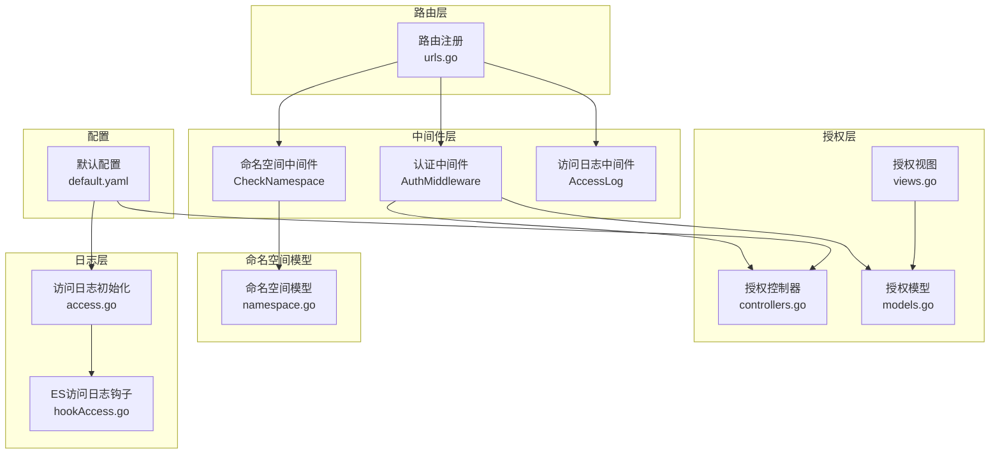
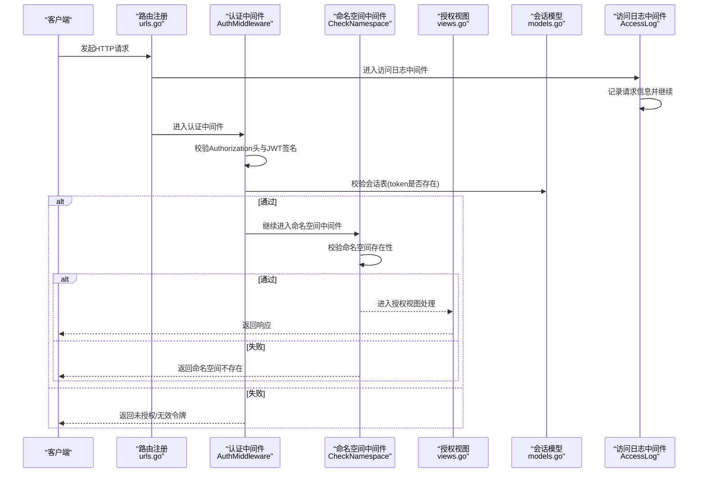
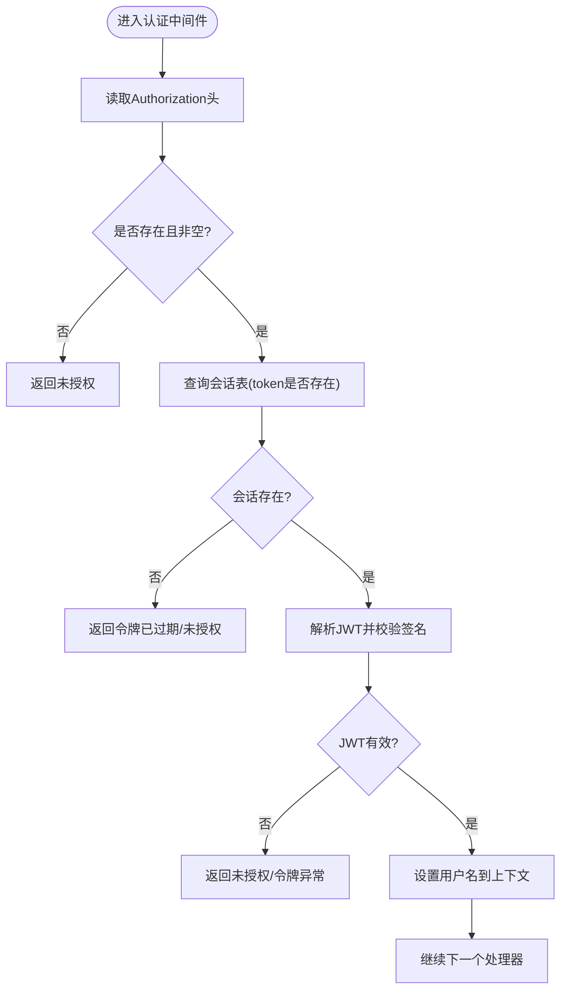
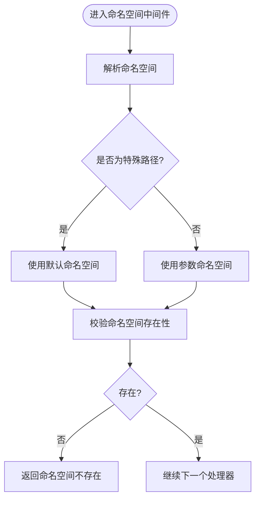
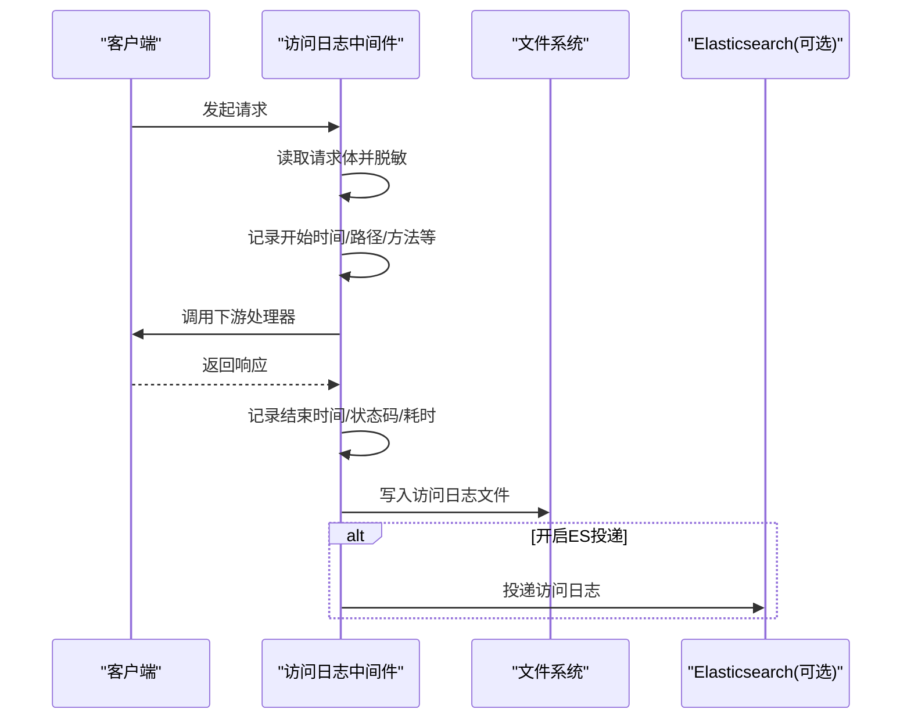
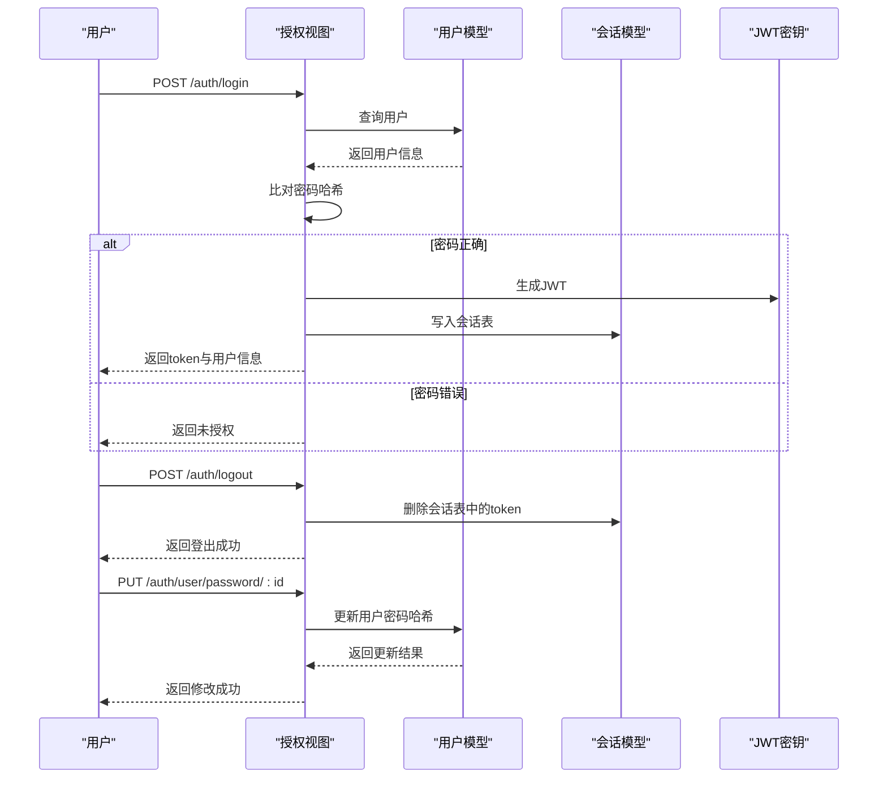
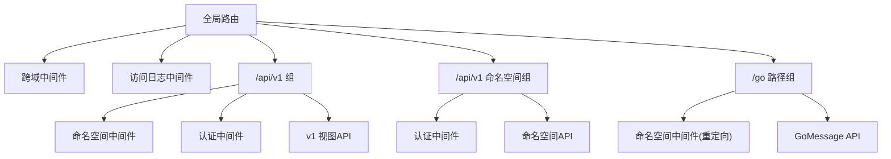
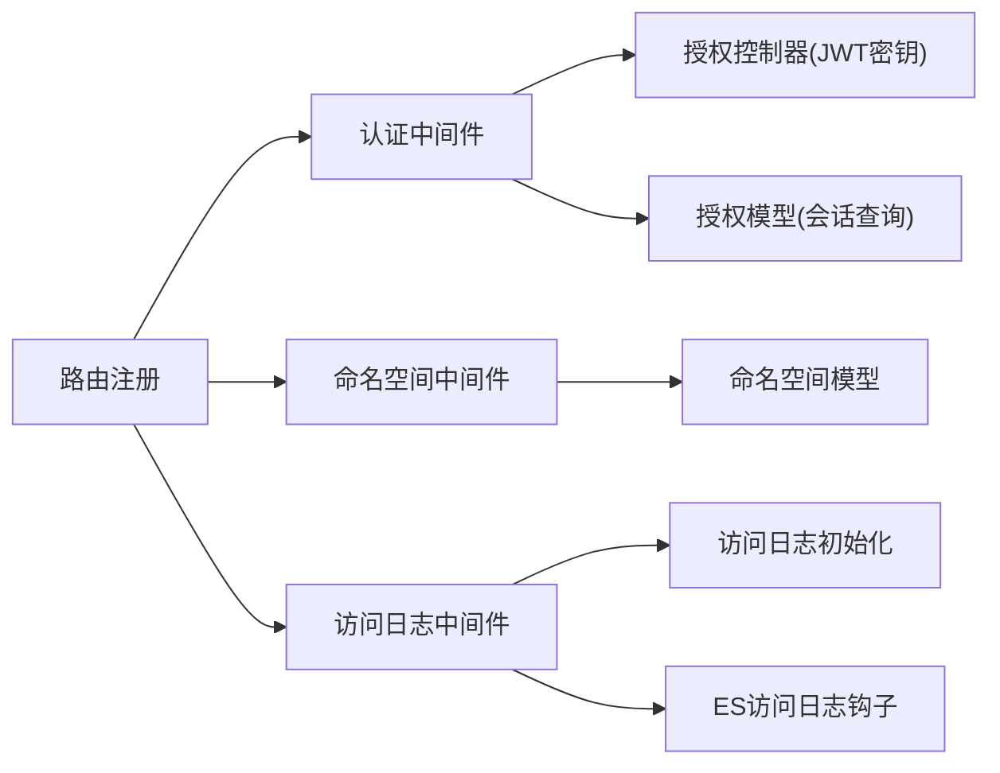

# 访问控制机制

<cite>
**本文引用的文件**
- [pkg/middleware/access.go](file://pkg/middleware/access.go)
- [pkg/middleware/auth.go](file://pkg/middleware/auth.go)
- [pkg/middleware/namespace.go](file://pkg/middleware/namespace.go)
- [pkg/authorization/controllers.go](file://pkg/authorization/controllers.go)
- [pkg/authorization/views.go](file://pkg/authorization/views.go)
- [pkg/authorization/models.go](file://pkg/authorization/models.go)
- [pkg/models/namespace.go](file://pkg/models/namespace.go)
- [pkg/routers/urls.go](file://pkg/routers/urls.go)
- [pkg/utils/response.go](file://pkg/utils/response.go)
- [pkg/utils/log/loggers/access.go](file://pkg/utils/log/loggers/access.go)
- [pkg/utils/log/hooks/es/hookAccess.go](file://pkg/utils/log/hooks/es/hookAccess.go)
- [config/default.yaml](file://config/default.yaml)
</cite>

## 目录
1. [简介](#简介)
2. [项目结构](#项目结构)
3. [核心组件](#核心组件)
4. [架构总览](#架构总览)
5. [详细组件分析](#详细组件分析)
6. [依赖分析](#依赖分析)
7. [性能考量](#性能考量)
8. [故障排查指南](#故障排查指南)
9. [结论](#结论)
10. [附录](#附录)

## 简介
本文件系统性阐述本项目的访问控制机制，覆盖路由级鉴权、命名空间级访问控制、认证中间件、日志审计与错误处理等。重点说明以下方面：
- 路由级别的权限验证与命名空间校验
- 资源级别的访问控制与命名空间隔离
- JWT 认证与会话管理、敏感信息脱敏
- 权限视图的定义与使用（登录、注册、注销、改密）
- 访问控制与命名空间的关系（命名空间隔离与边界管理）
- 配置示例与最佳实践（权限设计、性能优化、安全考虑）
- 扩展方法与自定义权限规则的实现思路

## 项目结构
围绕访问控制的关键模块分布如下：
- 中间件层：认证中间件、命名空间中间件、访问日志中间件
- 授权层：JWT 密钥管理、用户模型与会话模型、授权视图（登录/注册/注销/改密）
- 路由层：统一挂载中间件，按组划分命名空间与非命名空间接口
- 日志层：访问日志记录与可选 ES 投递
- 配置层：JWT 密钥、服务监听、日志落盘路径等

**图表来源**
- [pkg/routers/urls.go:21-108](file://pkg/routers/urls.go#L21-L108)
- [pkg/middleware/auth.go:12-61](file://pkg/middleware/auth.go#L12-L61)
- [pkg/middleware/namespace.go:20-46](file://pkg/middleware/namespace.go#L20-L46)
- [pkg/middleware/access.go:23-71](file://pkg/middleware/access.go#L23-L71)
- [pkg/authorization/controllers.go:10-12](file://pkg/authorization/controllers.go#L10-L12)
- [pkg/authorization/models.go:99-134](file://pkg/authorization/models.go#L99-L134)
- [pkg/models/namespace.go:96-105](file://pkg/models/namespace.go#L96-L105)
- [pkg/utils/log/loggers/access.go:15-58](file://pkg/utils/log/loggers/access.go#L15-L58)
- [pkg/utils/log/hooks/es/hookAccess.go:10-30](file://pkg/utils/log/hooks/es/hookAccess.go#L10-L30)
- [config/default.yaml:11-13](file://config/default.yaml#L11-L13)

**章节来源**
- [pkg/routers/urls.go:21-108](file://pkg/routers/urls.go#L21-L108)
- [pkg/middleware/auth.go:12-61](file://pkg/middleware/auth.go#L12-L61)
- [pkg/middleware/namespace.go:20-46](file://pkg/middleware/namespace.go#L20-L46)
- [pkg/middleware/access.go:23-71](file://pkg/middleware/access.go#L23-L71)
- [pkg/authorization/controllers.go:10-12](file://pkg/authorization/controllers.go#L10-L12)
- [pkg/authorization/models.go:99-134](file://pkg/authorization/models.go#L99-L134)
- [pkg/models/namespace.go:96-105](file://pkg/models/namespace.go#L96-L105)
- [pkg/utils/log/loggers/access.go:15-58](file://pkg/utils/log/loggers/access.go#L15-L58)
- [pkg/utils/log/hooks/es/hookAccess.go:10-30](file://pkg/utils/log/hooks/es/hookAccess.go#L10-L30)
- [config/default.yaml:11-13](file://config/default.yaml#L11-L13)

## 核心组件
- 认证中间件：从请求头提取 Authorization，校验 JWT 签名与有效期，并将用户名注入上下文；同时校验会话表以实现“注销即失效”。
- 命名空间中间件：根据路由参数或预设路径解析命名空间，校验其存在性，不存在则直接返回错误。
- 访问日志中间件：记录请求耗时、状态码、客户端 IP、方法、路径、路由、请求体（敏感字段脱敏）等。
- 授权视图：提供登录、注册、注销、改密等接口，配合 JWT 与会话表实现认证与会话生命周期管理。
- 响应模板：统一返回结构，便于前端与监控系统消费。

**章节来源**
- [pkg/middleware/auth.go:12-61](file://pkg/middleware/auth.go#L12-L61)
- [pkg/middleware/namespace.go:20-46](file://pkg/middleware/namespace.go#L20-L46)
- [pkg/middleware/access.go:23-71](file://pkg/middleware/access.go#L23-L71)
- [pkg/authorization/views.go:13-126](file://pkg/authorization/views.go#L13-L126)
- [pkg/utils/response.go:11-27](file://pkg/utils/response.go#L11-L27)

## 架构总览
访问控制的整体流程如下：
- 路由注册阶段统一挂载跨域、访问日志中间件
- 对需要鉴权的路由组挂载认证中间件
- 对需要命名空间隔离的路由组挂载命名空间中间件
- 认证中间件负责 JWT 校验与会话有效性校验
- 命名空间中间件负责命名空间存在性校验
- 访问日志中间件负责记录请求与响应信息

**图表来源**
- [pkg/routers/urls.go:27-60](file://pkg/routers/urls.go#L27-L60)
- [pkg/middleware/auth.go:12-61](file://pkg/middleware/auth.go#L12-L61)
- [pkg/middleware/namespace.go:20-46](file://pkg/middleware/namespace.go#L20-L46)
- [pkg/authorization/views.go:32-88](file://pkg/authorization/views.go#L32-L88)
- [pkg/authorization/models.go:112-134](file://pkg/authorization/models.go#L112-L134)
- [pkg/middleware/access.go:23-71](file://pkg/middleware/access.go#L23-L71)

## 详细组件分析

### 认证中间件（JWT + 会话）
- 输入：Authorization 请求头
- 校验步骤：
  - 必填校验：若缺失或为空，直接返回未授权
  - 会话校验：查询会话表，不存在即视为已注销
  - JWT 解析与签名校验：使用配置的密钥与 HS256 方法
  - 有效期校验：Claims 有效则放行，否则拒绝
- 输出：通过后将用户名注入上下文，供后续处理器使用

**图表来源**
- [pkg/middleware/auth.go:12-61](file://pkg/middleware/auth.go#L12-L61)
- [pkg/authorization/controllers.go:10-12](file://pkg/authorization/controllers.go#L10-L12)
- [pkg/authorization/models.go:112-134](file://pkg/authorization/models.go#L112-L134)

**章节来源**
- [pkg/middleware/auth.go:12-61](file://pkg/middleware/auth.go#L12-L61)
- [pkg/authorization/controllers.go:10-12](file://pkg/authorization/controllers.go#L10-L12)
- [pkg/authorization/models.go:112-134](file://pkg/authorization/models.go#L112-L134)

### 命名空间中间件（命名空间隔离）
- 输入：路由参数 namespace 或预设路径
- 校验逻辑：
  - 特殊路径映射：/go、/gomessage、/go/message 映射到默认命名空间
  - 普通路径：从参数解析命名空间
  - 存在性校验：调用命名空间模型查询是否存在
- 输出：存在则放行，否则返回“命名空间不存在”的错误响应

**图表来源**
- [pkg/middleware/namespace.go:20-46](file://pkg/middleware/namespace.go#L20-L46)
- [pkg/models/namespace.go:96-105](file://pkg/models/namespace.go#L96-L105)

**章节来源**
- [pkg/middleware/namespace.go:20-46](file://pkg/middleware/namespace.go#L20-L46)
- [pkg/models/namespace.go:96-105](file://pkg/models/namespace.go#L96-L105)

### 访问日志中间件（审计与脱敏）
- 功能要点：
  - 记录请求开始时间、结束时间、耗时、状态码、客户端 IP、方法、路径、路由
  - 请求体读取与脱敏：对 password、secret、token、authorization 字段进行掩码处理
  - 将日志输出到本地文件，可选投递至 Elasticsearch
- 安全注意：对敏感字段进行脱敏，避免日志泄露

**图表来源**
- [pkg/middleware/access.go:23-71](file://pkg/middleware/access.go#L23-L71)
- [pkg/utils/log/loggers/access.go:15-58](file://pkg/utils/log/loggers/access.go#L15-L58)
- [pkg/utils/log/hooks/es/hookAccess.go:18-24](file://pkg/utils/log/hooks/es/hookAccess.go#L18-L24)

**章节来源**
- [pkg/middleware/access.go:23-71](file://pkg/middleware/access.go#L23-L71)
- [pkg/utils/log/loggers/access.go:15-58](file://pkg/utils/log/loggers/access.go#L15-L58)
- [pkg/utils/log/hooks/es/hookAccess.go:18-24](file://pkg/utils/log/hooks/es/hookAccess.go#L18-L24)

### 授权视图（登录/注册/注销/改密）
- 登录：接收用户名与密码，查询用户，比对哈希，签发 JWT，写入会话表
- 注册：绑定请求体，生成密码哈希，入库
- 注销：从请求头读取 Authorization，若非空则删除会话表中的对应 token
- 改密：接收旧密码与新密码，按用户 ID 更新密码哈希

**图表来源**
- [pkg/authorization/views.go:32-126](file://pkg/authorization/views.go#L32-L126)
- [pkg/authorization/models.go:28-77](file://pkg/authorization/models.go#L28-L77)
- [pkg/authorization/models.go:112-134](file://pkg/authorization/models.go#L112-L134)
- [pkg/authorization/controllers.go:10-12](file://pkg/authorization/controllers.go#L10-L12)

**章节来源**
- [pkg/authorization/views.go:32-126](file://pkg/authorization/views.go#L32-L126)
- [pkg/authorization/models.go:28-77](file://pkg/authorization/models.go#L28-L77)
- [pkg/authorization/models.go:112-134](file://pkg/authorization/models.go#L112-L134)
- [pkg/authorization/controllers.go:10-12](file://pkg/authorization/controllers.go#L10-L12)

### 路由与中间件挂载策略
- 全局中间件：跨域、访问日志
- v1 视图组：按命名空间分组，统一挂载命名空间中间件与认证中间件
- v1 命名空间组：仅挂载认证中间件，不强制命名空间（用于命名空间 CRUD）
- 特殊路径：/go、/gomessage、/go/message 自动重定向到 /go/message 并应用命名空间中间件

**图表来源**
- [pkg/routers/urls.go:27-104](file://pkg/routers/urls.go#L27-L104)

**章节来源**
- [pkg/routers/urls.go:21-108](file://pkg/routers/urls.go#L21-L108)

## 依赖分析
- 认证中间件依赖授权控制器提供的 JWT 密钥与授权模型的会话查询
- 命名空间中间件依赖命名空间模型的存在性查询
- 访问日志中间件依赖日志初始化与可选 ES 钩子
- 路由层统一挂载中间件，形成清晰的控制流

**图表来源**
- [pkg/middleware/auth.go:12-61](file://pkg/middleware/auth.go#L12-L61)
- [pkg/authorization/controllers.go:10-12](file://pkg/authorization/controllers.go#L10-L12)
- [pkg/authorization/models.go:112-134](file://pkg/authorization/models.go#L112-L134)
- [pkg/middleware/namespace.go:20-46](file://pkg/middleware/namespace.go#L20-L46)
- [pkg/models/namespace.go:96-105](file://pkg/models/namespace.go#L96-L105)
- [pkg/middleware/access.go:23-71](file://pkg/middleware/access.go#L23-L71)
- [pkg/utils/log/loggers/access.go:15-58](file://pkg/utils/log/loggers/access.go#L15-L58)
- [pkg/utils/log/hooks/es/hookAccess.go:18-24](file://pkg/utils/log/hooks/es/hookAccess.go#L18-L24)
- [pkg/routers/urls.go:27-60](file://pkg/routers/urls.go#L27-L60)

**章节来源**
- [pkg/middleware/auth.go:12-61](file://pkg/middleware/auth.go#L12-L61)
- [pkg/authorization/controllers.go:10-12](file://pkg/authorization/controllers.go#L10-L12)
- [pkg/authorization/models.go:112-134](file://pkg/authorization/models.go#L112-L134)
- [pkg/middleware/namespace.go:20-46](file://pkg/middleware/namespace.go#L20-L46)
- [pkg/models/namespace.go:96-105](file://pkg/models/namespace.go#L96-L105)
- [pkg/middleware/access.go:23-71](file://pkg/middleware/access.go#L23-L71)
- [pkg/utils/log/loggers/access.go:15-58](file://pkg/utils/log/loggers/access.go#L15-L58)
- [pkg/utils/log/hooks/es/hookAccess.go:18-24](file://pkg/utils/log/hooks/es/hookAccess.go#L18-L24)
- [pkg/routers/urls.go:27-60](file://pkg/routers/urls.go#L27-L60)

## 性能考量
- 中间件顺序：将访问日志置于靠前位置，避免后续中间件异常导致日志缺失；认证与命名空间中间件按需挂载，减少不必要的校验开销
- 请求体读取：访问日志中间件使用 TeeReader 读取一次请求体并回放，避免阻塞下游
- 敏感字段脱敏：正则替换与长度限制，降低日志体积与风险
- 会话查询：认证中间件对会话表的查询为 O(1) 级别（基于 token 唯一索引），建议保持该设计
- JWT 解析：仅在必要时解析，避免对匿名接口造成额外负担

[本节为通用性能建议，无需特定文件引用]

## 故障排查指南
- 未携带 Authorization 头或为空：认证中间件直接返回未授权
- JWT 签名无效或过期：认证中间件返回未授权/令牌异常
- 令牌已注销：会话表中无对应 token，认证中间件返回未授权
- 命名空间不存在：命名空间中间件返回“命名空间不存在”
- 登录失败：用户名不存在或密码错误
- 注销无效：Authorization 为空时不会删除会话表中的 token
- 日志未落盘：检查访问日志初始化与文件路径配置
- ES 投递失败：检查 ES 配置与网络连通性

**章节来源**
- [pkg/middleware/auth.go:18-59](file://pkg/middleware/auth.go#L18-L59)
- [pkg/middleware/namespace.go:30-44](file://pkg/middleware/namespace.go#L30-L44)
- [pkg/authorization/views.go:40-71](file://pkg/authorization/views.go#L40-L71)
- [pkg/utils/log/loggers/access.go:15-58](file://pkg/utils/log/loggers/access.go#L15-L58)
- [pkg/utils/log/hooks/es/hookAccess.go:18-24](file://pkg/utils/log/hooks/es/hookAccess.go#L18-L24)

## 结论
本项目通过“路由组 + 中间件”的方式实现了清晰的访问控制分层：命名空间中间件负责资源级隔离，认证中间件负责身份与会话校验，访问日志中间件提供审计能力。整体设计简洁、可扩展性强，适合在多租户或多命名空间场景下部署。

[本节为总结性内容，无需特定文件引用]

## 附录

### 配置示例与最佳实践
- JWT 密钥：生产环境务必修改默认密钥，确保随机性与保密性
- 日志落盘：确保 access 日志文件与目录存在，避免启动失败
- ES 投递：如启用，需正确配置 ES 地址与凭据
- 路由挂载：将认证与命名空间中间件按需挂载到路由组，避免对公开接口造成性能与安全负担
- 敏感信息：统一采用脱敏策略，防止日志泄露

**章节来源**
- [config/default.yaml:11-13](file://config/default.yaml#L11-L13)
- [pkg/utils/log/loggers/access.go:15-58](file://pkg/utils/log/loggers/access.go#L15-L58)
- [pkg/middleware/access.go:15-21](file://pkg/middleware/access.go#L15-L21)

### 扩展方法与自定义权限规则
- 自定义权限规则：可在认证中间件中增加角色/权限矩阵校验，结合上下文中的用户名进行细粒度授权
- 权限继承：通过命名空间维度的权限集合进行继承与覆盖，结合路由组进行差异化挂载
- 缓存优化：对频繁查询的会话与用户权限进行缓存，降低数据库压力
- 审计增强：在访问日志中增加用户标识、资源标识、操作类型等字段，便于追踪

[本节为概念性扩展建议，无需特定文件引用]