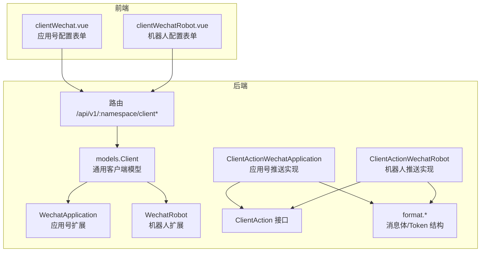
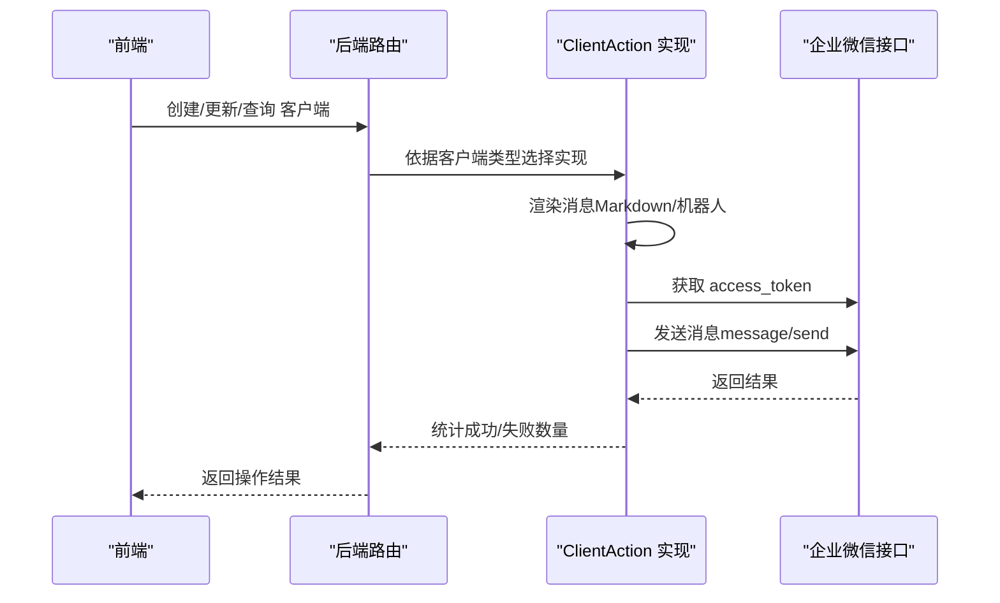
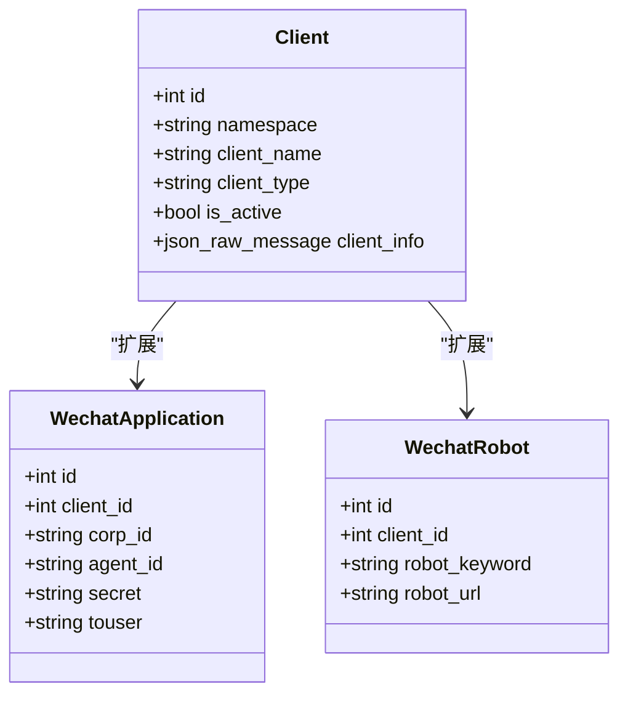
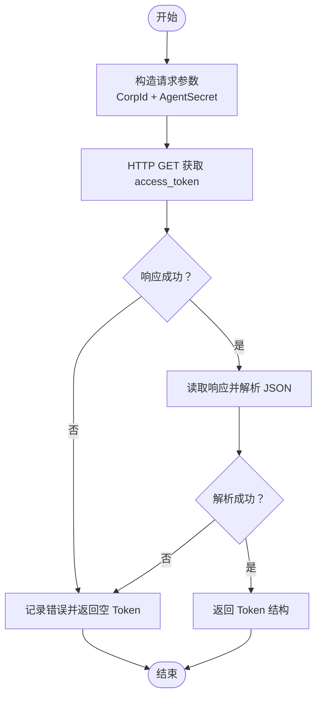
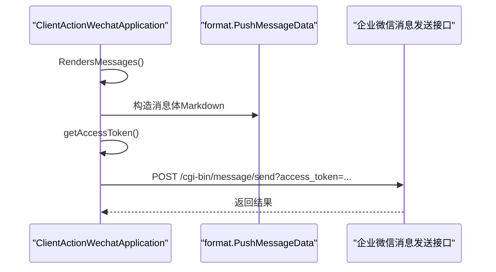
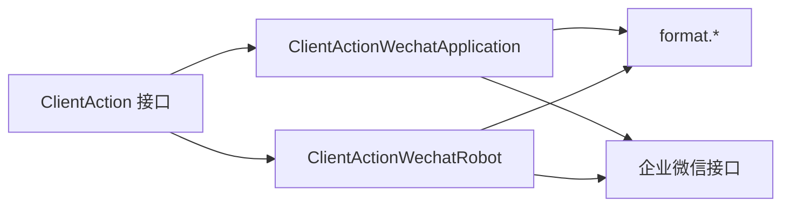

# 企业微信应用

<cite>
**本文引用的文件**
- [pkg/models/client_wechat_application.go](file://pkg/models/client_wechat_application.go)
- [pkg/models/client_wechat.go](file://pkg/models/client_wechat.go)
- [pkg/models/client.go](file://pkg/models/client.go)
- [pkg/services/core/v3/wechat.go](file://pkg/services/core/v3/wechat.go)
- [pkg/services/format/wechat.go](file://pkg/services/format/wechat.go)
- [pkg/services/core/v3/interfaces.go](file://pkg/services/core/v3/interfaces.go)
- [pkg/services/core/v3/wechat_robot.go](file://pkg/services/core/v3/wechat_robot.go)
- [vue/src/components/clients/clientWechat.vue](file://vue/src/components/clients/clientWechat.vue)
- [vue/src/components/clients/clientWechatRobot.vue](file://vue/src/components/clients/clientWechatRobot.vue)
- [pkg/utils/constants.go](file://pkg/utils/constants.go)
- [pkg/services/core/v1/config.go](file://pkg/services/core/v1/config.go)
- [pkg/routers/urls.go](file://pkg/routers/urls.go)
- [config/default.yaml](file://config/default.yaml)
- [pkg/utils/log/loggers/runtime.go](file://pkg/utils/log/loggers/runtime.go)
- [pkg/utils/log/loggers/access.go](file://pkg/utils/log/loggers/access.go)
- [pkg/utils/log/loggers/push.go](file://pkg/utils/log/loggers/push.go)
</cite>

## 目录
1. [简介](#简介)
2. [项目结构](#项目结构)
3. [核心组件](#核心组件)
4. [架构总览](#架构总览)
5. [详细组件分析](#详细组件分析)
6. [依赖分析](#依赖分析)
7. [性能考虑](#性能考虑)
8. [故障排查指南](#故障排查指南)
9. [结论](#结论)
10. [附录](#附录)

## 简介
本文件面向企业微信应用客户端的使用者与维护者，系统性说明以下内容：
- 企业微信应用的配置参数与模型结构（CorpId、AgentId、Secret、Touser 等）
- 认证流程与 Token 获取机制
- 消息推送接口与内容格式要求
- 配置步骤与集成方法
- 权限管理与用户指定功能
- 错误处理与调试方法
- 与企业微信“机器人推送”的区别与适用场景

## 项目结构
围绕企业微信应用客户端，后端采用分层设计：
- 模型层：定义客户端实体与扩展字段（应用号与机器人）
- 服务层：v3 核心动作接口与具体实现（应用号与机器人）
- 格式层：统一消息体与 Token 返回结构
- 前端组件：可视化配置表单与交互
- 配置与路由：命名空间、客户端 CRUD 接口、日志与运行参数

图表来源
- [vue/src/components/clients/clientWechat.vue:1-203](file://vue/src/components/clients/clientWechat.vue#L1-L203)
- [vue/src/components/clients/clientWechatRobot.vue:1-227](file://vue/src/components/clients/clientWechatRobot.vue#L1-L227)
- [pkg/models/client.go:13-28](file://pkg/models/client.go#L13-L28)
- [pkg/models/client_wechat_application.go:8-24](file://pkg/models/client_wechat_application.go#L8-L24)
- [pkg/models/client_wechat.go:8-24](file://pkg/models/client_wechat.go#L8-L24)
- [pkg/services/core/v3/interfaces.go:7-11](file://pkg/services/core/v3/interfaces.go#L7-L11)
- [pkg/services/core/v3/wechat.go:17-22](file://pkg/services/core/v3/wechat.go#L17-L22)
- [pkg/services/core/v3/wechat_robot.go:10-12](file://pkg/services/core/v3/wechat_robot.go#L10-L12)
- [pkg/services/format/wechat.go:13-39](file://pkg/services/format/wechat.go#L13-L39)
- [pkg/routers/urls.go:79-85](file://pkg/routers/urls.go#L79-L85)

章节来源
- [pkg/models/client.go:13-28](file://pkg/models/client.go#L13-L28)
- [pkg/models/client_wechat_application.go:8-24](file://pkg/models/client_wechat_application.go#L8-L24)
- [pkg/models/client_wechat.go:8-24](file://pkg/models/client_wechat.go#L8-L24)
- [pkg/services/core/v3/interfaces.go:7-11](file://pkg/services/core/v3/interfaces.go#L7-L11)
- [pkg/services/core/v3/wechat.go:17-22](file://pkg/services/core/v3/wechat.go#L17-L22)
- [pkg/services/core/v3/wechat_robot.go:10-12](file://pkg/services/core/v3/wechat_robot.go#L10-L12)
- [pkg/services/format/wechat.go:13-39](file://pkg/services/format/wechat.go#L13-L39)
- [vue/src/components/clients/clientWechat.vue:1-203](file://vue/src/components/clients/clientWechat.vue#L1-L203)
- [vue/src/components/clients/clientWechatRobot.vue:1-227](file://vue/src/components/clients/clientWechatRobot.vue#L1-L227)
- [pkg/routers/urls.go:79-85](file://pkg/routers/urls.go#L79-L85)

## 核心组件
- 客户端模型与扩展
  - 通用客户端模型包含命名空间、名称、描述、类型、激活状态以及 JSON 扩展字段
  - 应用号扩展包含 CorpId、AgentId、Secret、Touser
  - 机器人扩展包含机器人关键字与 URL 列表
- 动作接口
  - 定义渲染消息与推送消息两个方法，便于多平台统一调用
- 应用号推送实现
  - 渲染：将多条内容按规则合并或拆分，生成 Markdown 类型消息体
  - 推送：获取 Token，构造请求体，调用企业微信消息发送接口
- 机器人推送实现
  - 渲染：将内容包装为机器人消息格式
  - 推送：从 URL 列表中随机选择一个地址进行推送

章节来源
- [pkg/models/client.go:13-28](file://pkg/models/client.go#L13-L28)
- [pkg/models/client_wechat_application.go:8-24](file://pkg/models/client_wechat_application.go#L8-L24)
- [pkg/models/client_wechat.go:8-24](file://pkg/models/client_wechat.go#L8-L24)
- [pkg/services/core/v3/interfaces.go:7-11](file://pkg/services/core/v3/interfaces.go#L7-L11)
- [pkg/services/core/v3/wechat.go:24-91](file://pkg/services/core/v3/wechat.go#L24-L91)
- [pkg/services/core/v3/wechat_robot.go:14-39](file://pkg/services/core/v3/wechat_robot.go#L14-L39)

## 架构总览
企业微信应用客户端的调用链路如下：
- 前端通过 REST 接口创建/更新/查询客户端
- 后端根据客户端类型选择对应动作实现
- 动作实现负责渲染消息与调用企业微信 API
- 日志系统记录运行、访问与推送日志

图表来源
- [pkg/routers/urls.go:79-85](file://pkg/routers/urls.go#L79-L85)
- [pkg/services/core/v3/wechat.go:55-91](file://pkg/services/core/v3/wechat.go#L55-L91)
- [pkg/services/format/wechat.go:42-68](file://pkg/services/format/wechat.go#L42-L68)

章节来源
- [pkg/routers/urls.go:79-85](file://pkg/routers/urls.go#L79-L85)
- [pkg/services/core/v3/wechat.go:55-91](file://pkg/services/core/v3/wechat.go#L55-L91)
- [pkg/services/format/wechat.go:42-68](file://pkg/services/format/wechat.go#L42-L68)

## 详细组件分析

### 配置参数与模型结构
- 企业微信应用号关键参数
  - CorpId：企业 ID
  - AgentId：应用 ID
  - Secret：应用密钥
  - Touser：接收用户（支持多用户，以分隔符拼接）
- 模型映射
  - 通用客户端模型包含扩展字段，分别挂载应用号与机器人扩展
  - 应用号扩展模型包含上述四个参数与关联客户端 ID
  - 机器人扩展模型包含关键字与 URL 列表

图表来源
- [pkg/models/client.go:13-28](file://pkg/models/client.go#L13-L28)
- [pkg/models/client_wechat_application.go:8-24](file://pkg/models/client_wechat_application.go#L8-L24)
- [pkg/models/client_wechat.go:8-24](file://pkg/models/client_wechat.go#L8-L24)

章节来源
- [pkg/models/client.go:13-28](file://pkg/models/client.go#L13-L28)
- [pkg/models/client_wechat_application.go:8-24](file://pkg/models/client_wechat_application.go#L8-L24)
- [pkg/models/client_wechat.go:8-24](file://pkg/models/client_wechat.go#L8-L24)

### 认证流程与 Token 获取机制
- 获取 Token 的请求地址与参数
  - 地址：企业微信官方接口
  - 参数：CorpId、AgentSecret（即应用密钥）
- 返回结构
  - 包含 errcode、errmsg、access_token、expires_in
- 失败处理
  - 若请求失败、读取响应失败、解析失败，均记录错误并返回空 Token
- 使用策略
  - 在推送前先获取 Token，若为空则中断后续推送

图表来源
- [pkg/services/format/wechat.go:42-68](file://pkg/services/format/wechat.go#L42-L68)
- [pkg/services/core/v3/wechat.go:93-120](file://pkg/services/core/v3/wechat.go#L93-L120)

章节来源
- [pkg/services/format/wechat.go:13-19](file://pkg/services/format/wechat.go#L13-L19)
- [pkg/services/format/wechat.go:42-68](file://pkg/services/format/wechat.go#L42-L68)
- [pkg/services/core/v3/wechat.go:93-120](file://pkg/services/core/v3/wechat.go#L93-L120)

### 消息推送接口与内容格式
- 推送接口
  - 地址：企业微信官方消息发送接口
  - 查询参数：access_token
- 消息体结构（应用号）
  - 字段：touser、msgtype、agentid、markdown.content
  - msgtype 固定为 markdown
  - touser 支持多用户（分隔符拼接）
  - agentid 由 AgentId 转换为整数
- 渲染策略
  - 支持合并与拆分两种模式
  - 合并：将多条内容按规则拼接为单一 Markdown
  - 拆分：逐条生成独立消息体
- 机器人模式
  - 将内容包装为机器人消息格式
  - 从 URL 列表中随机选择一个地址推送

图表来源
- [pkg/services/core/v3/wechat.go:24-53](file://pkg/services/core/v3/wechat.go#L24-L53)
- [pkg/services/core/v3/wechat.go:55-91](file://pkg/services/core/v3/wechat.go#L55-L91)
- [pkg/services/format/wechat.go:21-29](file://pkg/services/format/wechat.go#L21-L29)

章节来源
- [pkg/services/core/v3/wechat.go:24-53](file://pkg/services/core/v3/wechat.go#L24-L53)
- [pkg/services/core/v3/wechat.go:55-91](file://pkg/services/core/v3/wechat.go#L55-L91)
- [pkg/services/format/wechat.go:21-29](file://pkg/services/format/wechat.go#L21-L29)
- [pkg/services/core/v3/wechat_robot.go:14-39](file://pkg/services/core/v3/wechat_robot.go#L14-L39)

### 配置步骤与集成方法
- 前端配置步骤
  - 应用号：填写 CorpId、AgentId、Secret、接收用户（多用户以分隔符拼接）
  - 机器人：可配置多个机器人 URL，用于随机选择推送，规避频率限制
- 后端集成要点
  - 客户端类型常量：应用号类型标识与机器人类型标识
  - 路由接口：创建/更新/查询客户端
  - 数据持久化：根据类型写入对应扩展表
- 命名空间与激活
  - 通过命名空间隔离客户端
  - 仅激活状态的客户端参与推送

章节来源
- [vue/src/components/clients/clientWechat.vue:45-69](file://vue/src/components/clients/clientWechat.vue#L45-L69)
- [vue/src/components/clients/clientWechatRobot.vue:50-88](file://vue/src/components/clients/clientWechatRobot.vue#L50-L88)
- [pkg/utils/constants.go:3-8](file://pkg/utils/constants.go#L3-L8)
- [pkg/routers/urls.go:79-85](file://pkg/routers/urls.go#L79-L85)
- [pkg/models/client.go:40-87](file://pkg/models/client.go#L40-L87)
- [pkg/models/client.go:230-238](file://pkg/models/client.go#L230-L238)

### 权限管理与用户指定
- 权限与激活
  - 客户端具备 is_active 字段，仅激活客户端参与推送
- 用户指定
  - touser 字段支持多用户，按分隔符拼接
  - 后端在渲染阶段将多条内容合并或拆分为多条消息，分别指向相同或不同的用户集合

章节来源
- [pkg/models/client.go:230-238](file://pkg/models/client.go#L230-L238)
- [pkg/models/client_wechat_application.go:18](file://pkg/models/client_wechat_application.go#L18)
- [pkg/services/core/v3/wechat.go:27-51](file://pkg/services/core/v3/wechat.go#L27-L51)

### 错误处理与调试方法
- 日志系统
  - 运行日志、访问日志、推送日志分别配置与初始化
  - 可选将日志投递到 Elasticsearch
- 常见错误点
  - Token 获取失败、响应读取失败、JSON 解析失败
  - 消息序列化失败、HTTP 请求失败、响应关闭失败
- 建议排查步骤
  - 检查 CorpId、AgentId、Secret 是否正确
  - 检查网络连通性与企业微信接口可用性
  - 查看日志文件定位错误发生阶段
  - 对照返回结构核对 errcode/errmsg

章节来源
- [pkg/utils/log/loggers/runtime.go:13-112](file://pkg/utils/log/loggers/runtime.go#L13-L112)
- [pkg/utils/log/loggers/access.go:13-58](file://pkg/utils/log/loggers/access.go#L13-L58)
- [pkg/utils/log/loggers/push.go:13-58](file://pkg/utils/log/loggers/push.go#L13-L58)
- [pkg/services/core/v3/wechat.go:55-91](file://pkg/services/core/v3/wechat.go#L55-L91)
- [pkg/services/format/wechat.go:42-68](file://pkg/services/format/wechat.go#L42-L68)

## 依赖分析
- 组件耦合
  - ClientAction 接口解耦了不同平台的推送实现
  - 应用号与机器人实现各自持有必要参数（CorpId、AgentId、Secret、Touser 或 URL 列表）
- 外部依赖
  - 企业微信官方接口（获取 Token 与发送消息）
  - 日志系统（本地文件与可选 ES）

图表来源
- [pkg/services/core/v3/interfaces.go:7-11](file://pkg/services/core/v3/interfaces.go#L7-L11)
- [pkg/services/core/v3/wechat.go:17-22](file://pkg/services/core/v3/wechat.go#L17-L22)
- [pkg/services/core/v3/wechat_robot.go:10-12](file://pkg/services/core/v3/wechat_robot.go#L10-L12)
- [pkg/services/format/wechat.go:13-39](file://pkg/services/format/wechat.go#L13-L39)

章节来源
- [pkg/services/core/v3/interfaces.go:7-11](file://pkg/services/core/v3/interfaces.go#L7-L11)
- [pkg/services/core/v3/wechat.go:17-22](file://pkg/services/core/v3/wechat.go#L17-L22)
- [pkg/services/core/v3/wechat_robot.go:10-12](file://pkg/services/core/v3/wechat_robot.go#L10-L12)
- [pkg/services/format/wechat.go:13-39](file://pkg/services/format/wechat.go#L13-L39)

## 性能考虑
- Token 复用
  - 当前实现每次推送前重新获取 Token，建议在业务允许范围内缓存并复用，减少重复请求
- 并发与批量
  - 推送循环逐条处理，可评估并发优化与批量发送策略
- 日志开销
  - 日志级别与输出介质（文件/ES）会影响性能，建议按环境调整

## 故障排查指南
- Token 获取失败
  - 检查 CorpId 与 AgentSecret 是否正确
  - 确认网络可达与企业微信接口状态
- 消息推送失败
  - 核对 touser 与 agentid 的合法性
  - 检查消息体序列化是否成功
- 响应读取/关闭失败
  - 关注资源释放与异常分支处理

章节来源
- [pkg/services/core/v3/wechat.go:55-91](file://pkg/services/core/v3/wechat.go#L55-L91)
- [pkg/services/format/wechat.go:42-68](file://pkg/services/format/wechat.go#L42-L68)

## 结论
本项目提供了企业微信应用号与机器人的完整配置与推送能力。通过统一的动作接口与清晰的模型结构，能够快速集成并扩展到更多平台。建议在生产环境中加强 Token 缓存、并发优化与日志治理，以提升稳定性与性能。

## 附录

### 企业微信应用与机器人推送的区别与适用场景
- 企业微信应用号
  - 需要 CorpId、AgentId、Secret
  - 使用官方 Token 机制与消息发送接口
  - 支持 Markdown 内容与用户指定
  - 适合需要较高权限与稳定推送的企业内部场景
- 企业微信机器人
  - 通过预设 URL 推送消息
  - 可配置多个 URL，随机选择以规避频率限制
  - 适合对外或轻量级推送场景

章节来源
- [pkg/models/client_wechat_application.go:15-18](file://pkg/models/client_wechat_application.go#L15-L18)
- [pkg/models/client_wechat.go:14-18](file://pkg/models/client_wechat.go#L14-L18)
- [vue/src/components/clients/clientWechat.vue:45-69](file://vue/src/components/clients/clientWechat.vue#L45-L69)
- [vue/src/components/clients/clientWechatRobot.vue:50-88](file://vue/src/components/clients/clientWechatRobot.vue#L50-L88)