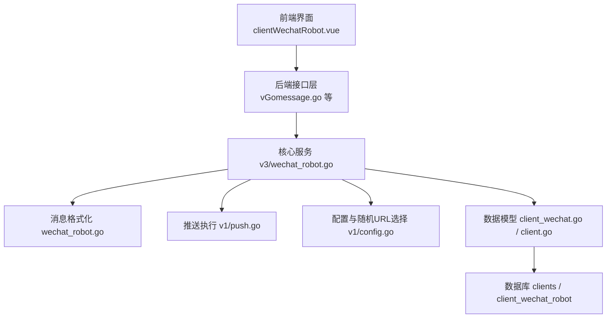
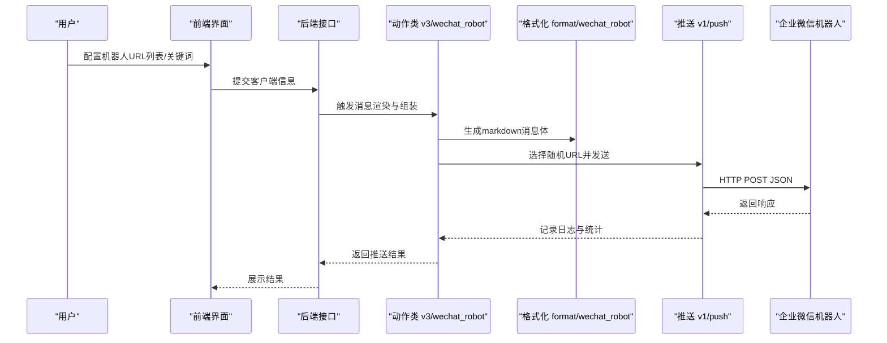
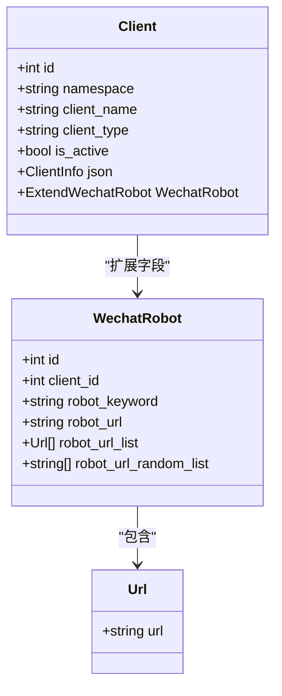
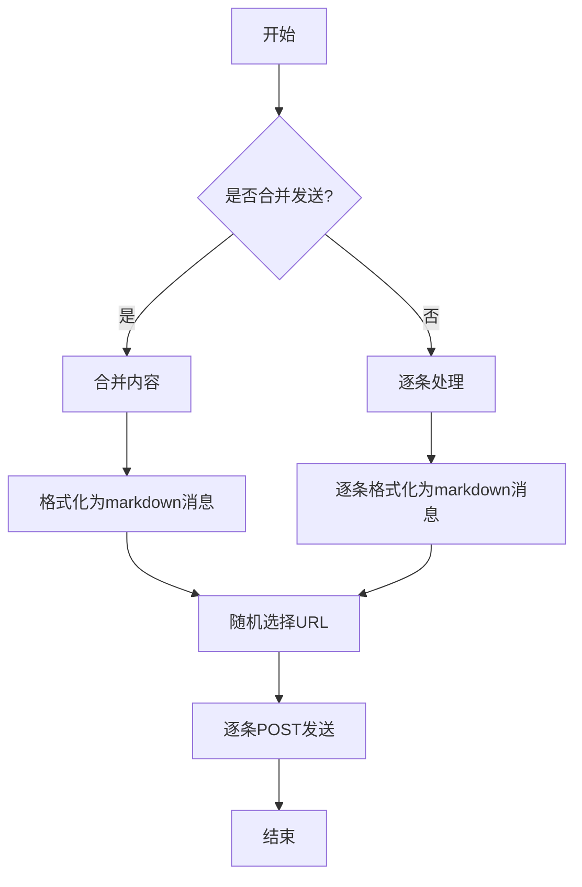
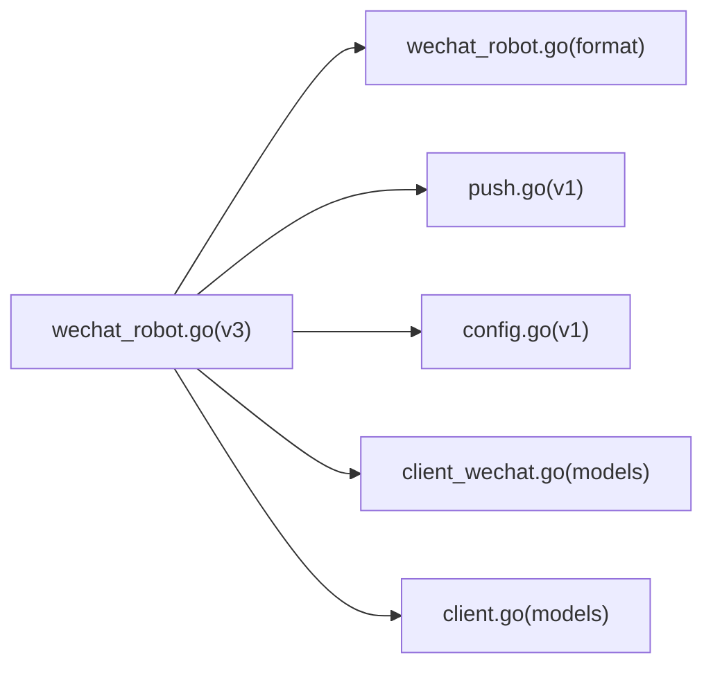

# 企业微信机器人

<cite>
**本文引用的文件**
- [pkg/models/client_wechat.go](file://pkg/models/client_wechat.go)
- [pkg/models/client.go](file://pkg/models/client.go)
- [pkg/services/core/v3/wechat_robot.go](file://pkg/services/core/v3/wechat_robot.go)
- [pkg/services/format/wechat_robot.go](file://pkg/services/format/wechat_robot.go)
- [vue/src/components/clients/clientWechatRobot.vue](file://vue/src/components/clients/clientWechatRobot.vue)
- [pkg/services/core/v1/push.go](file://pkg/services/core/v1/push.go)
- [pkg/services/core/v1/config.go](file://pkg/services/core/v1/config.go)
- [pkg/services/core/v1/format.go](file://pkg/services/core/v1/format.go)
- [pkg/services/core/v2/interfaces.go](file://pkg/services/core/v2/interfaces.go)
- [pkg/utils/constants.go](file://pkg/utils/constants.go)
- [pkg/models/client_dingtalk.go](file://pkg/models/client_dingtalk.go)
- [pkg/models/client_wechat_application.go](file://pkg/models/client_wechat_application.go)
</cite>

## 目录
1. [简介](#简介)
2. [项目结构](#项目结构)
3. [核心组件](#核心组件)
4. [架构总览](#架构总览)
5. [详细组件分析](#详细组件分析)
6. [依赖分析](#依赖分析)
7. [性能考虑](#性能考虑)
8. [故障排查指南](#故障排查指南)
9. [结论](#结论)
10. [附录](#附录)

## 简介
本文件面向“企业微信机器人”客户端的使用者与维护者，系统性说明以下内容：
- 企业微信机器人配置参数：机器人URL、关键词设置、URL管理策略
- 消息推送机制与内容格式要求
- 权限控制与使用限制
- 配置步骤与测试方法
- 错误处理与性能优化建议
- 与其他微信推送方式（如应用号）的区别

## 项目结构
企业微信机器人能力由后端服务与前端界面共同实现：
- 前端负责配置项录入与展示（机器人URL列表、是否激活等）
- 后端负责消息渲染、组装、推送与日志记录
- 数据模型层负责持久化与扩展字段（如机器人URL列表、关键词）

图表来源
- [vue/src/components/clients/clientWechatRobot.vue:1-227](file://vue/src/components/clients/clientWechatRobot.vue#L1-L227)
- [pkg/services/core/v3/wechat_robot.go:1-40](file://pkg/services/core/v3/wechat_robot.go#L1-L40)
- [pkg/services/format/wechat_robot.go:1-22](file://pkg/services/format/wechat_robot.go#L1-L22)
- [pkg/services/core/v1/push.go:1-57](file://pkg/services/core/v1/push.go#L1-L57)
- [pkg/services/core/v1/config.go:1-79](file://pkg/services/core/v1/config.go#L1-L79)
- [pkg/models/client_wechat.go:1-24](file://pkg/models/client_wechat.go#L1-L24)
- [pkg/models/client.go:1-239](file://pkg/models/client.go#L1-L239)

章节来源
- [vue/src/components/clients/clientWechatRobot.vue:1-227](file://vue/src/components/clients/clientWechatRobot.vue#L1-L227)
- [pkg/models/client_wechat.go:1-24](file://pkg/models/client_wechat.go#L1-L24)
- [pkg/models/client.go:1-239](file://pkg/models/client.go#L1-L239)

## 核心组件
- 客户端模型与扩展字段
  - 客户端基础信息：命名空间、名称、类型、是否激活
  - 扩展字段：企业微信机器人（关键词、机器人URL列表、随机URL列表）
- 企业微信机器人动作类
  - 渲染消息：支持按条拆分或合并发送
  - 推送消息：随机选择URL并逐条发送
- 消息格式化
  - 输出符合企业微信机器人接口的JSON结构（markdown类型）
- 推送执行
  - 统一HTTP POST发送，记录请求/响应与耗时
- 配置与URL管理
  - 随机选择URL，避免单点限流风险

章节来源
- [pkg/models/client.go:1-239](file://pkg/models/client.go#L1-L239)
- [pkg/models/client_wechat.go:1-24](file://pkg/models/client_wechat.go#L1-L24)
- [pkg/services/core/v3/wechat_robot.go:1-40](file://pkg/services/core/v3/wechat_robot.go#L1-L40)
- [pkg/services/format/wechat_robot.go:1-22](file://pkg/services/format/wechat_robot.go#L1-L22)
- [pkg/services/core/v1/push.go:1-57](file://pkg/services/core/v1/push.go#L1-L57)
- [pkg/services/core/v1/config.go:1-79](file://pkg/services/core/v1/config.go#L1-L79)

## 架构总览
企业微信机器人在系统中的位置与交互如下：

图表来源
- [vue/src/components/clients/clientWechatRobot.vue:1-227](file://vue/src/components/clients/clientWechatRobot.vue#L1-L227)
- [pkg/services/core/v3/wechat_robot.go:1-40](file://pkg/services/core/v3/wechat_robot.go#L1-L40)
- [pkg/services/format/wechat_robot.go:1-22](file://pkg/services/format/wechat_robot.go#L1-L22)
- [pkg/services/core/v1/push.go:1-57](file://pkg/services/core/v1/push.go#L1-L57)

## 详细组件分析

### 数据模型与URL管理
- WechatRobot 扩展模型
  - 关键字段：关键词、机器人URL（存储为多行文本）、URL列表、随机URL列表
  - 作用：承载前端配置的机器人URL集合，并在运行时进行随机选择
- 客户端模型与持久化
  - AddClient/UpdateClientInfo：根据客户端类型写入扩展表（含URL随机化）
  - GetClientById：按类型加载扩展字段，展开URL为随机列表
- URL结构与拼接
  - Url 结构体用于接收前端提交的URL数组
  - JoinUrl 将Url数组转为字符串切片，供随机选择使用

图表来源
- [pkg/models/client.go:1-239](file://pkg/models/client.go#L1-L239)
- [pkg/models/client_wechat.go:1-24](file://pkg/models/client_wechat.go#L1-L24)
- [pkg/models/client_dingtalk.go:1-37](file://pkg/models/client_dingtalk.go#L1-L37)

章节来源
- [pkg/models/client_wechat.go:1-24](file://pkg/models/client_wechat.go#L1-L24)
- [pkg/models/client.go:1-239](file://pkg/models/client.go#L1-L239)
- [pkg/models/client_dingtalk.go:1-37](file://pkg/models/client_dingtalk.go#L1-L37)

### 消息渲染与推送流程
- 渲染阶段
  - 支持“合并发送”和“逐条发送”
  - 合并时将多条内容合并后一次性打包；逐条时对每条内容分别打包
- 格式化阶段
  - 输出标准JSON结构，msgtype为markdown，content为消息正文
- 推送阶段
  - 从扩展字段的随机URL列表中随机选择一个URL
  - 对每个消息体发起HTTP POST请求，记录请求/响应与状态码

图表来源
- [pkg/services/core/v3/wechat_robot.go:14-39](file://pkg/services/core/v3/wechat_robot.go#L14-L39)
- [pkg/services/format/wechat_robot.go:6-21](file://pkg/services/format/wechat_robot.go#L6-L21)
- [pkg/services/core/v1/push.go:15-56](file://pkg/services/core/v1/push.go#L15-L56)

章节来源
- [pkg/services/core/v3/wechat_robot.go:14-39](file://pkg/services/core/v3/wechat_robot.go#L14-L39)
- [pkg/services/format/wechat_robot.go:6-21](file://pkg/services/format/wechat_robot.go#L6-L21)
- [pkg/services/core/v1/push.go:15-56](file://pkg/services/core/v1/push.go#L15-L56)

### 前端配置与交互
- 表单项
  - 客户端名称、描述、类型、是否激活
  - 机器人URL列表：支持动态增删
- 提示信息
  - 多URL可降低单点限流风险，避免重要报警漏送
- 提交与修改
  - 创建/更新通过统一接口完成，返回状态提示

章节来源
- [vue/src/components/clients/clientWechatRobot.vue:1-227](file://vue/src/components/clients/clientWechatRobot.vue#L1-L227)

### 与其他微信推送方式的区别
- 企业微信机器人（应用号）
  - 使用 CorpId、AgentId、Secret、Touser 等参数进行认证与定向发送
  - 适合更严格的权限控制与定向投递场景
- 企业微信机器人（群机器人）
  - 通过Webhook URL直接推送，无需应用级凭证
  - 适合快速接入与广播场景，但权限控制较弱

章节来源
- [pkg/models/client_wechat_application.go:1-24](file://pkg/models/client_wechat_application.go#L1-L24)

## 依赖分析
- 组件耦合
  - v3/wechat_robot 依赖 format/wechat_robot 进行消息体封装
  - v3/wechat_robot 依赖 v1/push 执行HTTP推送
  - v1/config 提供随机URL选择与命名空间配置
- 外部依赖
  - HTTP客户端用于POST请求
  - 日志模块记录推送过程的关键指标

图表来源
- [pkg/services/core/v3/wechat_robot.go:1-40](file://pkg/services/core/v3/wechat_robot.go#L1-L40)
- [pkg/services/format/wechat_robot.go:1-22](file://pkg/services/format/wechat_robot.go#L1-L22)
- [pkg/services/core/v1/push.go:1-57](file://pkg/services/core/v1/push.go#L1-L57)
- [pkg/services/core/v1/config.go:1-79](file://pkg/services/core/v1/config.go#L1-L79)
- [pkg/models/client_wechat.go:1-24](file://pkg/models/client_wechat.go#L1-L24)
- [pkg/models/client.go:1-239](file://pkg/models/client.go#L1-L239)

章节来源
- [pkg/services/core/v3/wechat_robot.go:1-40](file://pkg/services/core/v3/wechat_robot.go#L1-L40)
- [pkg/services/core/v1/config.go:60-65](file://pkg/services/core/v1/config.go#L60-L65)

## 性能考虑
- URL轮换策略
  - 通过随机选择URL分散请求压力，降低单点限流概率
- 合并发送
  - 在保证业务语义的前提下，合并发送可减少HTTP请求数量
- 异步与并发
  - 当前实现逐条发送；若需提升吞吐，可在上层引入并发队列与重试策略
- 超时与重试
  - 建议在推送层增加超时控制与指数退避重试，以应对网络抖动
- 日志与监控
  - 利用现有日志记录请求体、响应体与状态，便于定位问题

## 故障排查指南
- 常见问题
  - 机器人URL无效或被禁用：检查URL是否正确、是否仍在有效期内
  - 消息未送达：确认关键词匹配、消息格式为markdown
  - 单点限流：通过多URL配置与随机选择缓解
- 排查步骤
  - 查看推送日志：核对请求/响应与状态码
  - 校验客户端配置：关键词、URL列表、是否激活
  - 测试单URL直连：排除系统级问题
- 错误处理
  - 推送失败时返回错误并计入失败计数，便于统计与告警

章节来源
- [pkg/services/core/v1/push.go:15-56](file://pkg/services/core/v1/push.go#L15-L56)
- [pkg/services/core/v3/wechat_robot.go:29-39](file://pkg/services/core/v3/wechat_robot.go#L29-L39)

## 结论
企业微信机器人通过“多URL配置+随机选择”的策略，有效规避单点限流风险；结合“合并/逐条”两种推送模式，满足不同业务场景的需求。前端提供直观的配置入口，后端提供标准化的消息格式与可靠的推送链路。与应用号相比，机器人更适合快速广播与低门槛接入；若需更强的权限控制与定向能力，可选用应用号方案。

## 附录

### 配置步骤与测试方法
- 配置步骤
  - 在前端界面填写客户端名称、描述、类型（wechat_robot）
  - 填写机器人URL列表（可多条）
  - 设置是否激活
  - 提交后在后端持久化并生成随机URL列表
- 测试方法
  - 使用“合并发送”与“逐条发送”两种模式分别验证
  - 更换URL以验证随机选择逻辑
  - 观察日志输出与推送结果

章节来源
- [vue/src/components/clients/clientWechatRobot.vue:127-172](file://vue/src/components/clients/clientWechatRobot.vue#L127-L172)
- [pkg/models/client.go:66-86](file://pkg/models/client.go#L66-L86)

### 权限控制与使用限制
- 权限控制
  - 机器人URL本身不包含应用级鉴权，主要通过URL有效性与关键词匹配进行访问控制
  - 若需严格权限，建议采用应用号方案
- 使用限制
  - 企业微信对群机器人存在频率限制；多URL配置可降低被限流的概率
  - 建议在高并发场景下配合合并发送与异步重试策略

章节来源
- [vue/src/components/clients/clientWechatRobot.vue:70-75](file://vue/src/components/clients/clientWechatRobot.vue#L70-L75)
- [pkg/services/core/v1/config.go:60-65](file://pkg/services/core/v1/config.go#L60-L65)

### 内容格式要求
- 消息类型
  - msgtype：markdown
- 消息体
  - markdown.content：消息正文
- 其他
  - 字段名与类型需与企业微信机器人接口要求一致

章节来源
- [pkg/services/format/wechat_robot.go:6-21](file://pkg/services/format/wechat_robot.go#L6-L21)