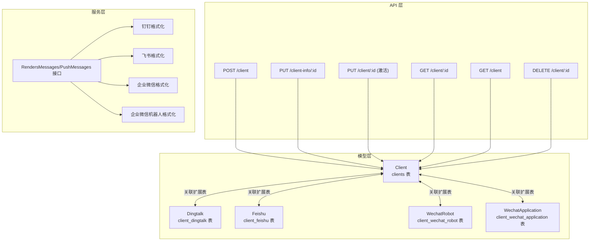
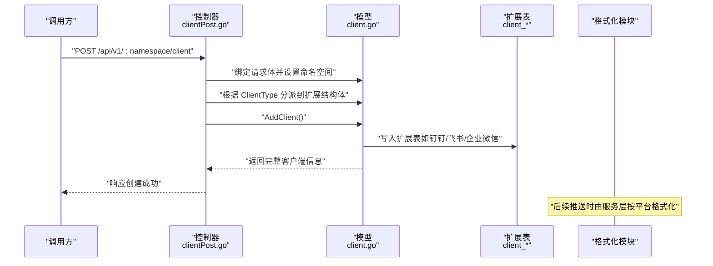
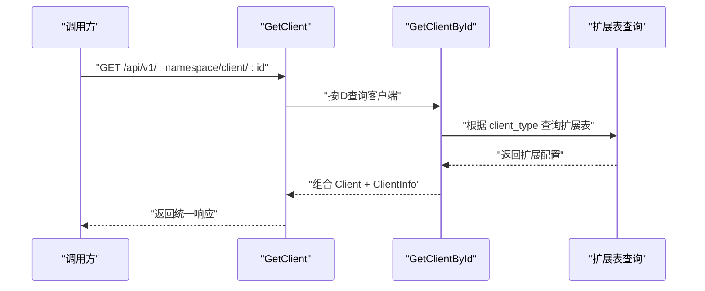
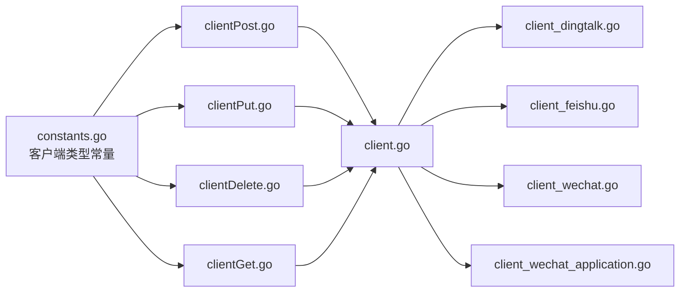

# 其他客户端

<cite>
**本文引用的文件**
- [pkg/models/client.go](file://pkg/models/client.go)
- [pkg/models/client_dingtalk.go](file://pkg/models/client_dingtalk.go)
- [pkg/models/client_feishu.go](file://pkg/models/client_feishu.go)
- [pkg/models/client_wechat.go](file://pkg/models/client_wechat.go)
- [pkg/models/client_wechat_application.go](file://pkg/models/client_wechat_application.go)
- [pkg/api/client/clientPost.go](file://pkg/api/client/clientPost.go)
- [pkg/api/client/clientPut.go](file://pkg/api/client/clientPut.go)
- [pkg/api/client/clientDelete.go](file://pkg/api/client/clientDelete.go)
- [pkg/api/client/clientGet.go](file://pkg/api/client/clientGet.go)
- [pkg/api/client/clientList.go](file://pkg/api/client/clientList.go)
- [pkg/utils/constants.go](file://pkg/utils/constants.go)
- [pkg/services/core/v3/interfaces.go](file://pkg/services/core/v3/interfaces.go)
- [pkg/services/format/dingtalk.go](file://pkg/services/format/dingtalk.go)
- [pkg/services/format/feishu.go](file://pkg/services/format/feishu.go)
- [pkg/services/format/wechat.go](file://pkg/services/format/wechat.go)
- [pkg/services/format/wechat_robot.go](file://pkg/services/format/wechat_robot.go)
- [vue/src/components/clients/clientOther.vue](file://vue/src/components/clients/clientOther.vue)
</cite>

## 目录
1. [简介](#简介)
2. [项目结构](#项目结构)
3. [核心组件](#核心组件)
4. [架构总览](#架构总览)
5. [详细组件分析](#详细组件分析)
6. [依赖分析](#依赖分析)
7. [性能考量](#性能考量)
8. [故障排查指南](#故障排查指南)
9. [结论](#结论)
10. [附录](#附录)

## 简介
本章节面向“其他客户端”的扩展与集成，系统已内置钉钉、飞书、企业微信机器人与企业微信应用等客户端类型。本文档旨在帮助开发者理解现有客户端模型与扩展机制，提供新增客户端类型的接口规范、实现步骤、兼容性与版本管理建议、配置与安全注意事项，以及客户端管理的API扩展点与自定义开发指南。

## 项目结构
围绕“客户端”主题的关键目录与文件如下：
- 模型层：定义统一的客户端实体与各平台扩展表
- API 层：提供客户端的增删改查与状态切换接口
- 服务层：消息格式化与推送能力（按平台适配）
- 前端组件：展示“其他客户端”提示页，引导贡献与反馈



图表来源
- [pkg/models/client.go:13-28](file://pkg/models/client.go#L13-L28)
- [pkg/models/client_dingtalk.go:21-33](file://pkg/models/client_dingtalk.go#L21-L33)
- [pkg/models/client_feishu.go:8-19](file://pkg/models/client_feishu.go#L8-L19)
- [pkg/models/client_wechat.go:9-19](file://pkg/models/client_wechat.go#L9-L19)
- [pkg/models/client_wechat_application.go:9-19](file://pkg/models/client_wechat_application.go#L9-L19)
- [pkg/api/client/clientPost.go:11-49](file://pkg/api/client/clientPost.go#L11-L49)
- [pkg/api/client/clientPut.go:13-75](file://pkg/api/client/clientPut.go#L13-L75)
- [pkg/api/client/clientDelete.go:14-39](file://pkg/api/client/clientDelete.go#L14-L39)
- [pkg/api/client/clientGet.go:27-92](file://pkg/api/client/clientGet.go#L27-L92)
- [pkg/api/client/clientList.go:10-22](file://pkg/api/client/clientList.go#L10-L22)
- [pkg/services/core/v3/interfaces.go:7-10](file://pkg/services/core/v3/interfaces.go#L7-L10)
- [pkg/services/format/dingtalk.go:3-29](file://pkg/services/format/dingtalk.go#L3-L29)
- [pkg/services/format/feishu.go:7-60](file://pkg/services/format/feishu.go#L7-L60)
- [pkg/services/format/wechat.go:41-114](file://pkg/services/format/wechat.go#L41-L114)
- [pkg/services/format/wechat_robot.go:5-21](file://pkg/services/format/wechat_robot.go#L5-L21)

章节来源
- [pkg/models/client.go:13-28](file://pkg/models/client.go#L13-L28)
- [pkg/api/client/clientPost.go:11-49](file://pkg/api/client/clientPost.go#L11-L49)
- [pkg/api/client/clientPut.go:13-75](file://pkg/api/client/clientPut.go#L13-L75)
- [pkg/api/client/clientDelete.go:14-39](file://pkg/api/client/clientDelete.go#L14-L39)
- [pkg/api/client/clientGet.go:27-92](file://pkg/api/client/clientGet.go#L27-L92)
- [pkg/api/client/clientList.go:10-22](file://pkg/api/client/clientList.go#L10-L22)
- [pkg/utils/constants.go:3-8](file://pkg/utils/constants.go#L3-L8)
- [pkg/services/core/v3/interfaces.go:7-10](file://pkg/services/core/v3/interfaces.go#L7-L10)
- [pkg/services/format/dingtalk.go:3-29](file://pkg/services/format/dingtalk.go#L3-L29)
- [pkg/services/format/feishu.go:7-60](file://pkg/services/format/feishu.go#L7-L60)
- [pkg/services/format/wechat.go:41-114](file://pkg/services/format/wechat.go#L41-L114)
- [pkg/services/format/wechat_robot.go:5-21](file://pkg/services/format/wechat_robot.go#L5-L21)

## 核心组件
- 统一客户端模型：包含基础元信息与多态扩展字段，支持按类型动态绑定扩展表
- 平台扩展模型：分别维护各平台的机器人URL、关键词、应用凭证等差异化配置
- API 控制器：提供客户端的创建、更新、删除、查询与激活状态切换
- 服务接口：定义消息渲染与推送的统一接口，便于按平台实现
- 格式化模块：针对不同平台的消息体进行打包与适配

章节来源
- [pkg/models/client.go:13-28](file://pkg/models/client.go#L13-L28)
- [pkg/models/client_dingtalk.go:21-33](file://pkg/models/client_dingtalk.go#L21-L33)
- [pkg/models/client_feishu.go:8-19](file://pkg/models/client_feishu.go#L8-L19)
- [pkg/models/client_wechat.go:9-19](file://pkg/models/client_wechat.go#L9-L19)
- [pkg/models/client_wechat_application.go:9-19](file://pkg/models/client_wechat_application.go#L9-L19)
- [pkg/api/client/clientPost.go:11-49](file://pkg/api/client/clientPost.go#L11-L49)
- [pkg/api/client/clientPut.go:13-75](file://pkg/api/client/clientPut.go#L13-L75)
- [pkg/api/client/clientDelete.go:14-39](file://pkg/api/client/clientDelete.go#L14-L39)
- [pkg/api/client/clientGet.go:27-92](file://pkg/api/client/clientGet.go#L27-L92)
- [pkg/api/client/clientList.go:10-22](file://pkg/api/client/clientList.go#L10-L22)
- [pkg/services/core/v3/interfaces.go:7-10](file://pkg/services/core/v3/interfaces.go#L7-L10)
- [pkg/services/format/dingtalk.go:3-29](file://pkg/services/format/dingtalk.go#L3-L29)
- [pkg/services/format/feishu.go:7-60](file://pkg/services/format/feishu.go#L7-L60)
- [pkg/services/format/wechat.go:41-114](file://pkg/services/format/wechat.go#L41-L114)
- [pkg/services/format/wechat_robot.go:5-21](file://pkg/services/format/wechat_robot.go#L5-L21)

## 架构总览
系统通过“统一客户端模型 + 多态扩展表 + API 控制器 + 服务接口 + 平台格式化”的分层设计，实现对多种即时通讯平台的统一管理与扩展。新增客户端类型只需在模型、API、服务层与格式化模块中按规范扩展即可。



图表来源
- [pkg/api/client/clientPost.go:11-49](file://pkg/api/client/clientPost.go#L11-L49)
- [pkg/models/client.go:40-87](file://pkg/models/client.go#L40-L87)
- [pkg/models/client_dingtalk.go:21-33](file://pkg/models/client_dingtalk.go#L21-L33)
- [pkg/models/client_feishu.go:8-19](file://pkg/models/client_feishu.go#L8-L19)
- [pkg/models/client_wechat.go:9-19](file://pkg/models/client_wechat.go#L9-L19)
- [pkg/models/client_wechat_application.go:9-19](file://pkg/models/client_wechat_application.go#L9-L19)

## 详细组件分析

### 统一客户端模型与扩展机制
- 统一模型包含基础字段（命名空间、名称、描述、类型、是否激活）与多态扩展指针
- 扩展表按平台拆分，避免跨平台冗余字段，提升可维护性
- 创建/更新/查询流程中按 ClientType 进行分支处理，确保扩展表一致性

```mermaid
classDiagram
class Client {
+int id
+string namespace
+string client_name
+string client_description
+string client_type
+bool is_active
+ClientInfo client_info
+ExtendDingtalk
+ExtendFeishu
+ExtendWechatApplication
+ExtendWechatRobot
}
class Dingtalk {
+int id
+int client_id
+string robot_keyword
+string robot_url
+bool at_all
+at_mobiles
+robot_url_list
+robot_url_random_list
}
class Feishu {
+int id
+int client_id
+string robot_keyword
+string title_color
+string robot_url
+robot_url_list
+robot_url_random_list
}
class WechatRobot {
+int id
+int client_id
+string robot_keyword
+string robot_url
+robot_url_list
+robot_url_random_list
}
class WechatApplication {
+int id
+int client_id
+string corp_id
+string agent_id
+string secret
+string touser
}
Client --> Dingtalk : "1 : 1"
Client --> Feishu : "1 : 1"
Client --> WechatRobot : "1 : 1"
Client --> WechatApplication : "1 : 1"
```

图表来源
- [pkg/models/client.go:13-28](file://pkg/models/client.go#L13-L28)
- [pkg/models/client_dingtalk.go:21-33](file://pkg/models/client_dingtalk.go#L21-L33)
- [pkg/models/client_feishu.go:8-19](file://pkg/models/client_feishu.go#L8-L19)
- [pkg/models/client_wechat.go:9-19](file://pkg/models/client_wechat.go#L9-L19)
- [pkg/models/client_wechat_application.go:9-19](file://pkg/models/client_wechat_application.go#L9-L19)

章节来源
- [pkg/models/client.go:13-28](file://pkg/models/client.go#L13-L28)
- [pkg/models/client_dingtalk.go:21-33](file://pkg/models/client_dingtalk.go#L21-L33)
- [pkg/models/client_feishu.go:8-19](file://pkg/models/client_feishu.go#L8-L19)
- [pkg/models/client_wechat.go:9-19](file://pkg/models/client_wechat.go#L9-L19)
- [pkg/models/client_wechat_application.go:9-19](file://pkg/models/client_wechat_application.go#L9-L19)

### API 控制器与命名空间校验
- 创建/更新/删除/查询均进行命名空间校验，防止越权访问
- 更新激活状态与更新信息分别提供独立接口，职责清晰
- 查询接口按类型组装响应体，将扩展表字段与统一字段合并返回



图表来源
- [pkg/api/client/clientGet.go:27-92](file://pkg/api/client/clientGet.go#L27-L92)
- [pkg/models/client.go:162-210](file://pkg/models/client.go#L162-L210)

章节来源
- [pkg/api/client/clientGet.go:27-92](file://pkg/api/client/clientGet.go#L27-L92)
- [pkg/api/client/clientPut.go:13-75](file://pkg/api/client/clientPut.go#L13-L75)
- [pkg/api/client/clientDelete.go:14-39](file://pkg/api/client/clientDelete.go#L14-L39)
- [pkg/api/client/clientList.go:10-22](file://pkg/api/client/clientList.go#L10-L22)
- [pkg/models/client.go:162-210](file://pkg/models/client.go#L162-L210)

### 服务接口与消息格式化
- 服务层定义统一接口：渲染消息与推送消息
- 平台格式化模块按各自协议打包消息体，保证与平台API一致
- 可扩展点：新增平台时实现该接口并在推送调度处接入

```mermaid
classDiagram
class ClientAction {
+RendersMessages(client, isMerge, contentList) []any
+PushMessages(messages) (int,int)
}
class DingtalkFormatter {
+PackDingtalkMessage(keyword, message, atAll, mobiles) interface{}
}
class FeishuFormatter {
+PackFeishuMessage(userConfigInfo, message) interface{}
}
class WeChatFormatter {
+getAccessToken() GetAccessTokenReturn
+PushMessage()
}
class WechatRobotFormatter {
+PackWechatRobotMessage(keyword, message) interface{}
}
ClientAction <|.. DingtalkFormatter
ClientAction <|.. FeishuFormatter
ClientAction <|.. WeChatFormatter
ClientAction <|.. WechatRobotFormatter
```

图表来源
- [pkg/services/core/v3/interfaces.go:7-10](file://pkg/services/core/v3/interfaces.go#L7-L10)
- [pkg/services/format/dingtalk.go:3-29](file://pkg/services/format/dingtalk.go#L3-L29)
- [pkg/services/format/feishu.go:7-60](file://pkg/services/format/feishu.go#L7-L60)
- [pkg/services/format/wechat.go:41-114](file://pkg/services/format/wechat.go#L41-L114)
- [pkg/services/format/wechat_robot.go:5-21](file://pkg/services/format/wechat_robot.go#L5-L21)

章节来源
- [pkg/services/core/v3/interfaces.go:7-10](file://pkg/services/core/v3/interfaces.go#L7-L10)
- [pkg/services/format/dingtalk.go:3-29](file://pkg/services/format/dingtalk.go#L3-L29)
- [pkg/services/format/feishu.go:7-60](file://pkg/services/format/feishu.go#L7-L60)
- [pkg/services/format/wechat.go:41-114](file://pkg/services/format/wechat.go#L41-L114)
- [pkg/services/format/wechat_robot.go:5-21](file://pkg/services/format/wechat_robot.go#L5-L21)

### 前端“其他客户端”提示页
- 提供“其他客户端”占位页面，鼓励社区贡献与反馈
- 展示作者联系方式，便于扩展需求沟通

章节来源
- [vue/src/components/clients/clientOther.vue:1-56](file://vue/src/components/clients/clientOther.vue#L1-L56)

## 依赖分析
- 客户端类型常量集中定义，便于统一识别与扩展
- API 层对命名空间与客户端存在性进行严格校验
- 模型层通过 switch 分支处理扩展表，避免硬编码耦合



图表来源
- [pkg/utils/constants.go:3-8](file://pkg/utils/constants.go#L3-L8)
- [pkg/api/client/clientPost.go:26-41](file://pkg/api/client/clientPost.go#L26-L41)
- [pkg/api/client/clientPut.go:39-67](file://pkg/api/client/clientPut.go#L39-L67)
- [pkg/api/client/clientDelete.go:24-32](file://pkg/api/client/clientDelete.go#L24-L32)
- [pkg/api/client/clientGet.go:53-89](file://pkg/api/client/clientGet.go#L53-L89)
- [pkg/models/client.go:47-84](file://pkg/models/client.go#L47-L84)
- [pkg/models/client_dingtalk.go:21-33](file://pkg/models/client_dingtalk.go#L21-L33)
- [pkg/models/client_feishu.go:8-19](file://pkg/models/client_feishu.go#L8-L19)
- [pkg/models/client_wechat.go:9-19](file://pkg/models/client_wechat.go#L9-L19)
- [pkg/models/client_wechat_application.go:9-19](file://pkg/models/client_wechat_application.go#L9-L19)

章节来源
- [pkg/utils/constants.go:3-8](file://pkg/utils/constants.go#L3-L8)
- [pkg/api/client/clientPost.go:26-41](file://pkg/api/client/clientPost.go#L26-L41)
- [pkg/api/client/clientPut.go:39-67](file://pkg/api/client/clientPut.go#L39-L67)
- [pkg/api/client/clientDelete.go:24-32](file://pkg/api/client/clientDelete.go#L24-L32)
- [pkg/api/client/clientGet.go:53-89](file://pkg/api/client/clientGet.go#L53-L89)
- [pkg/models/client.go:47-84](file://pkg/models/client.go#L47-L84)

## 性能考量
- 扩展表分离存储，减少单表宽度，有利于查询与索引优化
- URL 列表采用随机化存储策略，提升可用性与容灾能力
- 建议对扩展表增加必要的索引（如 client_id），以降低查询成本
- 对于高并发推送，建议在服务层引入队列与重试机制

## 故障排查指南
- 参数校验失败：确认命名空间与客户端ID匹配，检查请求体 JSON 结构
- 未知客户端类型：核对客户端类型常量，确保与平台一致
- 查询不到扩展配置：确认扩展表是否正确创建，client_id 是否与主键一致
- 推送失败：检查平台凭证与URL有效性，关注网络与限流限制

章节来源
- [pkg/api/client/clientPut.go:18-31](file://pkg/api/client/clientPut.go#L18-L31)
- [pkg/api/client/clientDelete.go:19-32](file://pkg/api/client/clientDelete.go#L19-L32)
- [pkg/models/client.go:169-207](file://pkg/models/client.go#L169-L207)

## 结论
系统通过“统一模型 + 多态扩展 + 明确的API + 可插拔的服务接口”，提供了完善的客户端扩展框架。新增客户端类型仅需在模型、API、服务与格式化模块中按规范扩展，即可快速完成集成与上线。

## 附录

### 客户端类型与扩展规范
- 支持类型
  - 钉钉：机器人关键词、机器人URL列表、@所有人与@手机号集合
  - 飞书：机器人关键词、标题颜色、机器人URL列表
  - 企业微信机器人：机器人关键词、机器人URL列表
  - 企业微信应用：企业ID、应用AgentId、Secret、默认接收人
- 扩展字段建议
  - 保持与平台官方API一致的字段命名
  - 对敏感字段（如 Secret）遵循最小暴露原则，避免在前端展示
  - URL 列表建议支持多地址与随机轮询，提升可用性

章节来源
- [pkg/utils/constants.go:3-8](file://pkg/utils/constants.go#L3-L8)
- [pkg/models/client_dingtalk.go:21-33](file://pkg/models/client_dingtalk.go#L21-L33)
- [pkg/models/client_feishu.go:8-19](file://pkg/models/client_feishu.go#L8-L19)
- [pkg/models/client_wechat.go:9-19](file://pkg/models/client_wechat.go#L9-L19)
- [pkg/models/client_wechat_application.go:9-19](file://pkg/models/client_wechat_application.go#L9-L19)

### 自定义客户端开发与集成步骤
- 模型层
  - 在统一模型中预留扩展字段或新增扩展表
  - 在创建/更新/查询逻辑中增加对应分支
- API 层
  - 在控制器中增加类型分支，绑定扩展结构体
  - 保持命名空间与存在性校验
- 服务层
  - 实现服务接口，完成消息渲染与推送
  - 在推送调度处接入新平台
- 格式化模块
  - 按平台协议打包消息体，确保字段与签名规则正确
- 前端
  - 如需UI支持，可在客户端组件中增加对应表单与校验

章节来源
- [pkg/models/client.go:40-87](file://pkg/models/client.go#L40-L87)
- [pkg/api/client/clientPost.go:26-41](file://pkg/api/client/clientPost.go#L26-L41)
- [pkg/services/core/v3/interfaces.go:7-10](file://pkg/services/core/v3/interfaces.go#L7-L10)
- [pkg/services/format/dingtalk.go:3-29](file://pkg/services/format/dingtalk.go#L3-L29)
- [pkg/services/format/feishu.go:7-60](file://pkg/services/format/feishu.go#L7-L60)
- [pkg/services/format/wechat.go:41-114](file://pkg/services/format/wechat.go#L41-L114)
- [pkg/services/format/wechat_robot.go:5-21](file://pkg/services/format/wechat_robot.go#L5-L21)

### 第三方客户端集成示例与最佳实践
- 示例思路
  - 以“企业微信应用”为例，先在模型层定义扩展表，再在API层绑定扩展结构体，最后在服务层实现消息推送
- 最佳实践
  - 使用随机URL列表与健康检查，提升可用性
  - 对凭证进行加密存储与最小权限授权
  - 记录推送日志与失败重试，便于排障
  - 对外暴露只读接口，避免误操作

章节来源
- [pkg/models/client_wechat_application.go:9-19](file://pkg/models/client_wechat_application.go#L9-L19)
- [pkg/api/client/clientPost.go:26-41](file://pkg/api/client/clientPost.go#L26-L41)
- [pkg/services/format/wechat.go:41-114](file://pkg/services/format/wechat.go#L41-L114)

### 客户端兼容性检查与版本管理
- 兼容性检查
  - 新增字段时保留向后兼容，旧字段可标记为非必填
  - 对扩展表进行迁移脚本管理，避免破坏现有数据
- 版本管理
  - 将客户端类型与扩展结构体版本化，配合API版本控制
  - 对不兼容变更提供迁移工具与降级策略

### 客户端配置的通用原则与安全考虑
- 通用原则
  - 命名空间隔离、客户端唯一标识、最小权限原则
  - URL 列表与凭证分项配置，支持批量导入导出
- 安全考虑
  - 凭证类字段不落库明文，必要时使用加密存储与密钥管理
  - 对外接口进行鉴权与限流，记录审计日志
  - 对敏感字段在响应体中做脱敏处理

### 客户端管理的API扩展点与自定义开发指南
- API 扩展点
  - 新增客户端类型时，在控制器与模型层增加类型分支
  - 对查询/列表/激活状态等接口进行统一校验与返回
- 自定义开发指南
  - 保持与现有风格一致：命名空间校验、错误码与响应结构
  - 在服务层实现统一接口，便于后续扩展与测试

章节来源
- [pkg/api/client/clientPost.go:26-41](file://pkg/api/client/clientPost.go#L26-L41)
- [pkg/api/client/clientPut.go:39-67](file://pkg/api/client/clientPut.go#L39-L67)
- [pkg/api/client/clientGet.go:53-89](file://pkg/api/client/clientGet.go#L53-L89)
- [pkg/api/client/clientList.go:10-22](file://pkg/api/client/clientList.go#L10-L22)
- [pkg/services/core/v3/interfaces.go:7-10](file://pkg/services/core/v3/interfaces.go#L7-L10)