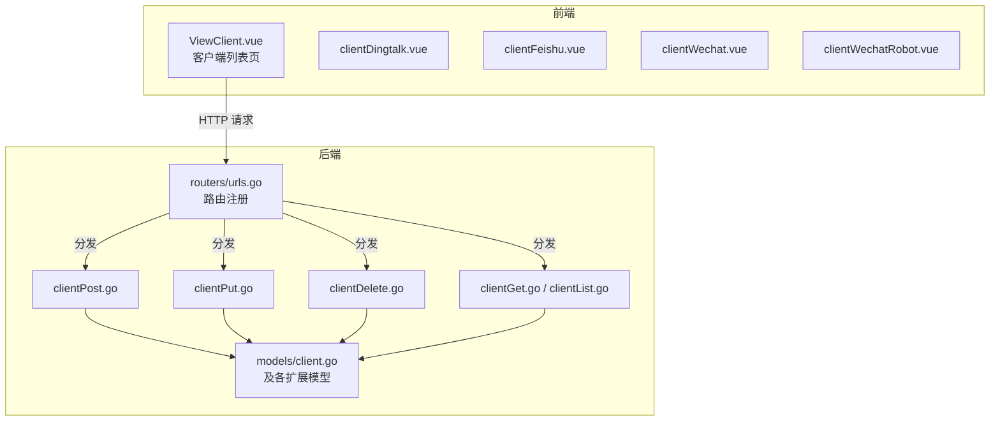
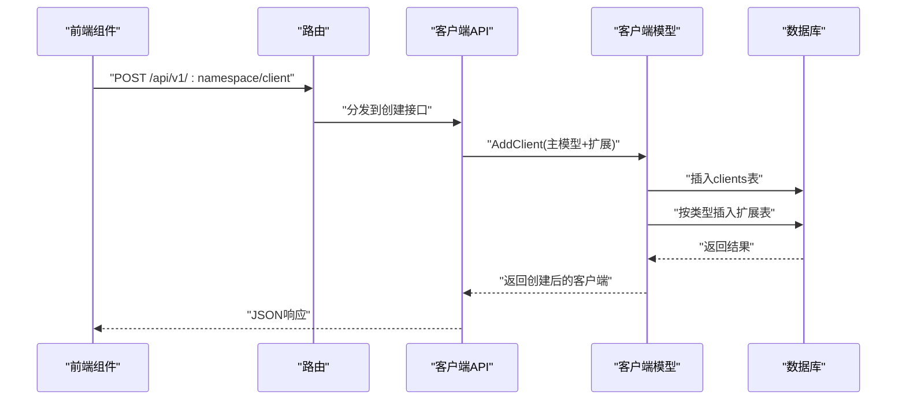
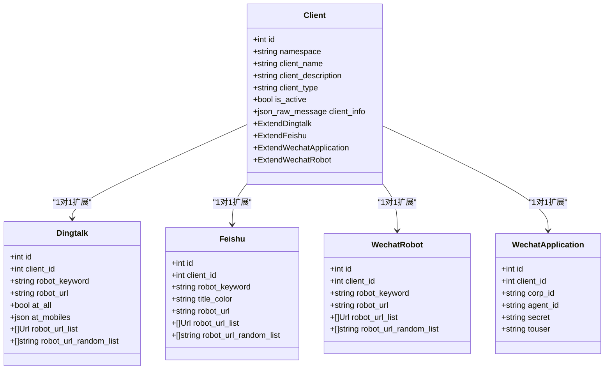
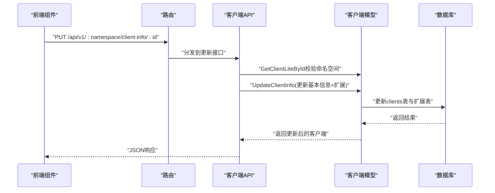
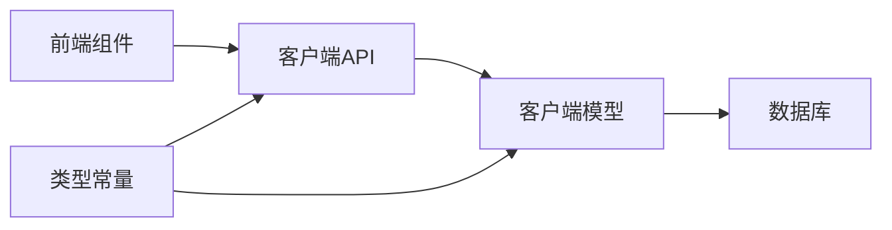

# 客户端概览

<cite>
**本文引用的文件**
- [pkg/models/client.go](file://pkg/models/client.go)
- [pkg/models/client_dingtalk.go](file://pkg/models/client_dingtalk.go)
- [pkg/models/client_feishu.go](file://pkg/models/client_feishu.go)
- [pkg/models/client_wechat.go](file://pkg/models/client_wechat.go)
- [pkg/models/client_wechat_application.go](file://pkg/models/client_wechat_application.go)
- [pkg/api/client/clientPost.go](file://pkg/api/client/clientPost.go)
- [pkg/api/client/clientPut.go](file://pkg/api/client/clientPut.go)
- [pkg/api/client/clientDelete.go](file://pkg/api/client/clientDelete.go)
- [pkg/api/client/clientGet.go](file://pkg/api/client/clientGet.go)
- [pkg/api/client/clientList.go](file://pkg/api/client/clientList.go)
- [pkg/routers/urls.go](file://pkg/routers/urls.go)
- [pkg/utils/constants.go](file://pkg/utils/constants.go)
- [vue/src/views/main/ViewClient.vue](file://vue/src/views/main/ViewClient.vue)
- [vue/src/components/clients/clientDingtalk.vue](file://vue/src/components/clients/clientDingtalk.vue)
- [vue/src/components/clients/clientFeishu.vue](file://vue/src/components/clients/clientFeishu.vue)
- [vue/src/components/clients/clientWechat.vue](file://vue/src/components/clients/clientWechat.vue)
- [vue/src/components/clients/clientWechatRobot.vue](file://vue/src/components/clients/clientWechatRobot.vue)
- [config/default.yaml](file://config/default.yaml)
</cite>

## 目录
1. [简介](#简介)
2. [项目结构](#项目结构)
3. [核心组件](#核心组件)
4. [架构总览](#架构总览)
5. [详细组件分析](#详细组件分析)
6. [依赖分析](#依赖分析)
7. [性能考量](#性能考量)
8. [故障排查指南](#故障排查指南)
9. [结论](#结论)
10. [附录](#附录)

## 简介
本文件面向“客户端管理”在消息推送系统中的角色与实现，围绕以下目标展开：
- 解释客户端在消息推送系统中的核心作用与架构设计
- 明确客户端与命名空间的关系、生命周期与状态控制
- 详解客户端基本属性（ID、名称、描述、类型、激活状态等）及扩展字段
- 阐述客户端的增删改查接口与使用方法
- 提供最佳实践与常见问题解决方案
- 总结客户端配置的通用原则与安全注意事项

## 项目结构
客户端管理由后端模型与API、前端视图与组件构成，前后端通过REST接口交互，统一受命名空间隔离与鉴权中间件保护。

图表来源
- [pkg/routers/urls.go:79-85](file://pkg/routers/urls.go#L79-L85)
- [pkg/api/client/clientPost.go:14](file://pkg/api/client/clientPost.go#L14)
- [pkg/api/client/clientPut.go:16](file://pkg/api/client/clientPut.go#L16)
- [pkg/api/client/clientDelete.go:17](file://pkg/api/client/clientDelete.go#L17)
- [pkg/api/client/clientGet.go:30](file://pkg/api/client/clientGet.go#L30)
- [pkg/api/client/clientList.go:13](file://pkg/api/client/clientList.go#L13)
- [pkg/models/client.go:13-28](file://pkg/models/client.go#L13-L28)

章节来源
- [pkg/routers/urls.go:79-85](file://pkg/routers/urls.go#L79-L85)
- [vue/src/views/main/ViewClient.vue:1-266](file://vue/src/views/main/ViewClient.vue#L1-L266)

## 核心组件
- 客户端模型与扩展模型
  - 主模型：包含基础字段与扩展信息指针
  - 扩展模型：按平台拆分（钉钉、飞书、企业微信机器人、企业微信应用号）
- API 控制器：提供客户端的增删改查与状态切换接口
- 路由注册：统一挂载到命名空间组，受中间件保护
- 前端视图与组件：提供客户端列表、详情、创建/编辑、删除等交互

章节来源
- [pkg/models/client.go:13-28](file://pkg/models/client.go#L13-L28)
- [pkg/models/client_dingtalk.go:21-33](file://pkg/models/client_dingtalk.go#L21-L33)
- [pkg/models/client_feishu.go:8-19](file://pkg/models/client_feishu.go#L8-L19)
- [pkg/models/client_wechat.go:9-19](file://pkg/models/client_wechat.go#L9-L19)
- [pkg/models/client_wechat_application.go:9-19](file://pkg/models/client_wechat_application.go#L9-L19)
- [pkg/api/client/clientPost.go:11-49](file://pkg/api/client/clientPost.go#L11-L49)
- [pkg/api/client/clientPut.go:13-109](file://pkg/api/client/clientPut.go#L13-L109)
- [pkg/api/client/clientDelete.go:14-39](file://pkg/api/client/clientDelete.go#L14-L39)
- [pkg/api/client/clientGet.go:27-92](file://pkg/api/client/clientGet.go#L27-L92)
- [pkg/api/client/clientList.go:10-22](file://pkg/api/client/clientList.go#L10-L22)
- [pkg/routers/urls.go:79-85](file://pkg/routers/urls.go#L79-L85)

## 架构总览
客户端管理遵循“命名空间隔离 + 平台扩展”的设计：
- 命名空间隔离：所有客户端均属于某个命名空间；API在命名空间组内注册，且控制器在运行时校验客户端归属
- 平台扩展：主模型通过扩展字段承载各平台特有配置，创建/更新时按类型分别持久化到对应扩展表
- 生命周期：创建即入库，状态可独立控制；查询时合并扩展信息返回；删除影响主表与扩展表

图表来源
- [pkg/routers/urls.go:81](file://pkg/routers/urls.go#L81)
- [pkg/api/client/clientPost.go:15-48](file://pkg/api/client/clientPost.go#L15-L48)
- [pkg/models/client.go:40-87](file://pkg/models/client.go#L40-L87)

章节来源
- [pkg/routers/urls.go:58-90](file://pkg/routers/urls.go#L58-L90)
- [pkg/models/client.go:40-87](file://pkg/models/client.go#L40-L87)

## 详细组件分析

### 模型与数据结构
- 主模型字段
  - 基础字段：标识、时间戳、软删除索引、命名空间、名称、描述、类型、激活状态
  - 扩展字段：以JSON原始消息承载扩展信息；同时以结构体指针持有平台扩展对象
- 平台扩展模型
  - 钉钉：关键字、机器人URL、@配置、URL列表与随机列表
  - 飞书：关键字、标题颜色、机器人URL、URL列表与随机列表
  - 企业微信机器人：关键字、机器人URL、URL列表与随机列表
  - 企业微信应用号：企业ID、AgentId、Secret、接收用户
- 关键函数
  - 创建：AddClient，按类型插入扩展表并生成随机URL列表
  - 更新：UpdateClientInfo，更新主表基本信息与扩展表特定字段
  - 查询：GetClientById，按类型关联扩展表并展开随机URL列表
  - 列表：ListClient、GetActiveClient，按命名空间过滤
  - 删除：DeleteClient，删除主表记录

图表来源
- [pkg/models/client.go:13-28](file://pkg/models/client.go#L13-L28)
- [pkg/models/client_dingtalk.go:21-33](file://pkg/models/client_dingtalk.go#L21-L33)
- [pkg/models/client_feishu.go:8-19](file://pkg/models/client_feishu.go#L8-L19)
- [pkg/models/client_wechat.go:9-19](file://pkg/models/client_wechat.go#L9-L19)
- [pkg/models/client_wechat_application.go:9-19](file://pkg/models/client_wechat_application.go#L9-L19)

章节来源
- [pkg/models/client.go:13-28](file://pkg/models/client.go#L13-L28)
- [pkg/models/client_dingtalk.go:21-33](file://pkg/models/client_dingtalk.go#L21-L33)
- [pkg/models/client_feishu.go:8-19](file://pkg/models/client_feishu.go#L8-L19)
- [pkg/models/client_wechat.go:9-19](file://pkg/models/client_wechat.go#L9-L19)
- [pkg/models/client_wechat_application.go:9-19](file://pkg/models/client_wechat_application.go#L9-L19)

### 接口与使用方法
- 路由与中间件
  - 客户端相关路由统一挂载于命名空间组，受命名空间检查与鉴权中间件保护
  - 支持 GET/POST/PUT/DELETE 对应列表、创建、更新、删除
- 创建客户端
  - 请求体包含基础字段与平台扩展信息；后端按类型解析并持久化到扩展表
- 更新客户端
  - 支持两类更新：更新基本信息与扩展字段；更新激活状态
- 查询客户端
  - 支持按ID查询并返回合并后的扩展信息；支持按命名空间列出
- 删除客户端
  - 校验命名空间归属后删除

图表来源
- [pkg/routers/urls.go:83](file://pkg/routers/urls.go#L83)
- [pkg/api/client/clientPut.go:69](file://pkg/api/client/clientPut.go#L69)
- [pkg/models/client.go:89-147](file://pkg/models/client.go#L89-L147)

章节来源
- [pkg/routers/urls.go:79-85](file://pkg/routers/urls.go#L79-L85)
- [pkg/api/client/clientPost.go:11-49](file://pkg/api/client/clientPost.go#L11-L49)
- [pkg/api/client/clientPut.go:13-109](file://pkg/api/client/clientPut.go#L13-L109)
- [pkg/api/client/clientDelete.go:14-39](file://pkg/api/client/clientDelete.go#L14-L39)
- [pkg/api/client/clientGet.go:27-92](file://pkg/api/client/clientGet.go#L27-L92)
- [pkg/api/client/clientList.go:10-22](file://pkg/api/client/clientList.go#L10-L22)

### 前端交互与最佳实践
- 列表页
  - 展示客户端名称、描述、类型、激活状态；支持一键查看详情与删除
  - 激活状态变更采用失焦自动保存策略，提升体验
- 创建/编辑
  - 针对不同平台提供专用表单组件，支持多机器人URL输入与动态增删
  - 钉钉/飞书支持关键字与标题颜色等差异化配置
  - 企业微信应用号需填写企业ID、AgentId、Secret与接收用户
- 最佳实践
  - 多URL配置：为避免单机器人频率限制，建议至少配置2个以上URL并启用随机轮换
  - 关键字一致性：确保关键字与平台侧设置一致，避免消息被拦截
  - 密钥安全：Secret类敏感字段建议在前端隐藏输入，后端严格校验长度与格式
  - 命名空间隔离：确保操作的客户端与当前命名空间一致，避免越权访问

章节来源
- [vue/src/views/main/ViewClient.vue:135-226](file://vue/src/views/main/ViewClient.vue#L135-L226)
- [vue/src/components/clients/clientDingtalk.vue:138-209](file://vue/src/components/clients/clientDingtalk.vue#L138-L209)
- [vue/src/components/clients/clientFeishu.vue:177-248](file://vue/src/components/clients/clientFeishu.vue#L177-L248)
- [vue/src/components/clients/clientWechat.vue:118-196](file://vue/src/components/clients/clientWechat.vue#L118-L196)
- [vue/src/components/clients/clientWechatRobot.vue:125-194](file://vue/src/components/clients/clientWechatRobot.vue#L125-L194)

## 依赖分析
- 组件耦合
  - API层依赖模型层；模型层依赖数据库层；前端组件依赖API层
  - 各平台扩展模型与主模型弱耦合，通过类型字段与外键关联
- 命名空间约束
  - API在运行时校验客户端是否属于当前命名空间，防止跨命名空间访问
- 类型常量
  - 客户端类型常量集中定义，便于前后端统一约定

图表来源
- [pkg/utils/constants.go:3-8](file://pkg/utils/constants.go#L3-L8)
- [pkg/api/client/clientPut.go:23-31](file://pkg/api/client/clientPut.go#L23-L31)
- [pkg/models/client.go:40-87](file://pkg/models/client.go#L40-L87)

章节来源
- [pkg/utils/constants.go:3-8](file://pkg/utils/constants.go#L3-L8)
- [pkg/api/client/clientPut.go:23-31](file://pkg/api/client/clientPut.go#L23-L31)
- [pkg/models/client.go:40-87](file://pkg/models/client.go#L40-L87)

## 性能考量
- URL随机轮换
  - 通过随机列表减少单点压力，提高可用性与稳定性
- 查询优化
  - 列表与激活客户端查询按命名空间与状态过滤，避免全表扫描
- 扩展表分离
  - 将平台特有配置拆分至扩展表，降低主表冗余与锁竞争

章节来源
- [pkg/models/client_dingtalk.go:13-19](file://pkg/models/client_dingtalk.go#L13-L19)
- [pkg/models/client_feishu.go:17-18](file://pkg/models/client_feishu.go#L17-L18)
- [pkg/models/client_wechat.go:17-18](file://pkg/models/client_wechat.go#L17-L18)
- [pkg/models/client_wechat_application.go:17-18](file://pkg/models/client_wechat_application.go#L17-L18)
- [pkg/models/client.go:231-238](file://pkg/models/client.go#L231-L238)

## 故障排查指南
- 参数错误
  - ID解析失败、命名空间不匹配、请求体格式错误
- 查询失败
  - 客户端不存在、扩展表关联异常
- 更新失败
  - 类型不支持、扩展字段解析失败
- 删除失败
  - 客户端不存在、命名空间不匹配

处理建议
- 校验请求参数与命名空间归属
- 检查客户端类型与扩展字段映射
- 关注扩展表的外键一致性与随机URL生成逻辑

章节来源
- [pkg/api/client/clientPut.go:18-31](file://pkg/api/client/clientPut.go#L18-L31)
- [pkg/api/client/clientDelete.go:19-32](file://pkg/api/client/clientDelete.go#L19-L32)
- [pkg/api/client/clientGet.go:37-50](file://pkg/api/client/clientGet.go#L37-L50)
- [pkg/models/client.go:89-147](file://pkg/models/client.go#L89-L147)

## 结论
客户端管理以“命名空间隔离 + 平台扩展”为核心设计，通过清晰的模型与API边界，配合前端友好交互，实现了对多平台推送通道的统一管理。遵循多URL轮换、关键字一致、密钥安全等最佳实践，可显著提升系统的可靠性与安全性。

## 附录

### 客户端基本属性说明
- id：客户端唯一标识
- namespace：所属命名空间
- client_name：客户端名称
- client_description：客户端描述
- client_type：客户端类型（钉钉、飞书、企业微信应用号、企业微信机器人）
- is_active：是否激活
- client_info：扩展信息（JSON原始消息）

章节来源
- [pkg/models/client.go:13-28](file://pkg/models/client.go#L13-L28)
- [pkg/utils/constants.go:3-8](file://pkg/utils/constants.go#L3-L8)

### 接口一览
- 列表：GET /api/v1/:namespace/client
- 创建：POST /api/v1/:namespace/client
- 详情：GET /api/v1/:namespace/client/:id
- 更新信息：PUT /api/v1/:namespace/client-info/:id
- 更新激活状态：PUT /api/v1/:namespace/client/:id
- 删除：DELETE /api/v1/:namespace/client/:id

章节来源
- [pkg/routers/urls.go:79-85](file://pkg/routers/urls.go#L79-L85)

### 安全与配置通用原则
- JWT密钥：生产环境务必更换默认密钥
- 服务监听：主机与端口按部署环境配置
- 数据库：推荐SQLite3用于轻量元数据存储
- 日志：按需开启ES写入，注意索引与权限

章节来源
- [config/default.yaml:11-13](file://config/default.yaml#L11-L13)
- [config/default.yaml:19-21](file://config/default.yaml#L19-L21)
- [config/default.yaml:52](file://config/default.yaml#L52)
- [config/default.yaml:39-43](file://config/default.yaml#L39-L43)