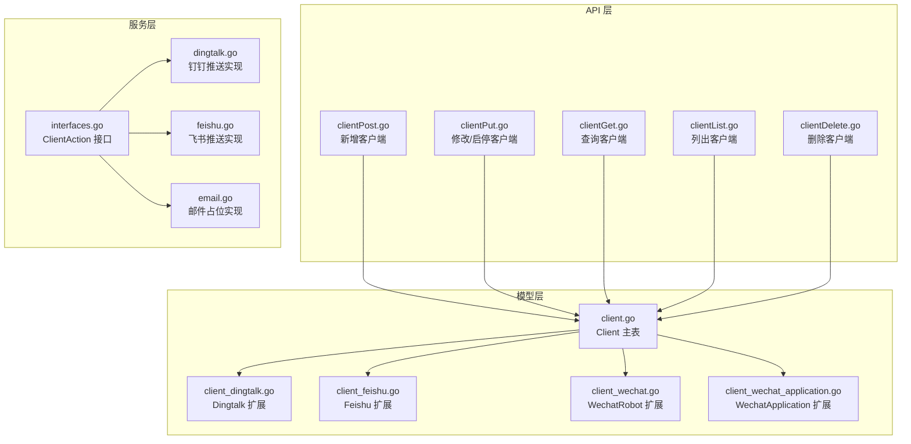
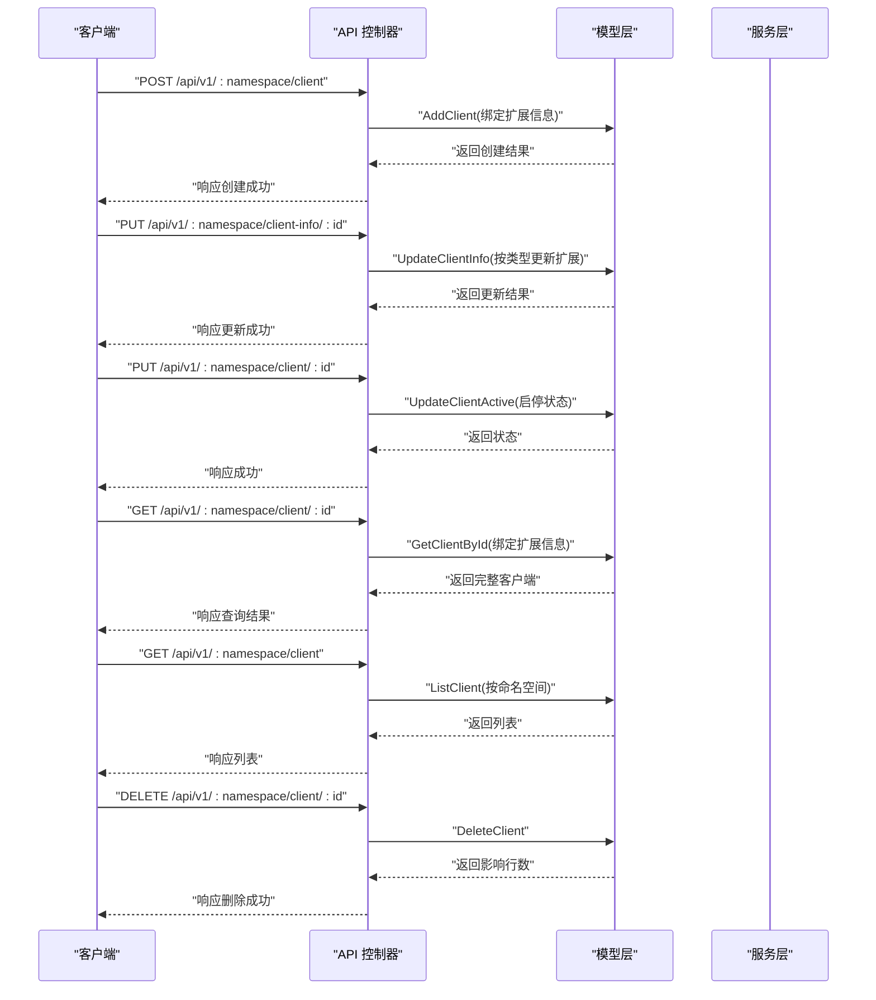
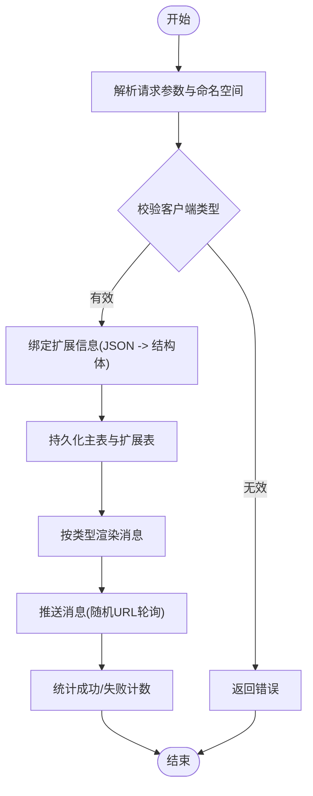
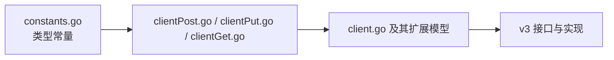

# 客户端管理

<cite>
**本文引用的文件**
- [pkg/models/client.go](file://pkg/models/client.go)
- [pkg/models/client_dingtalk.go](file://pkg/models/client_dingtalk.go)
- [pkg/models/client_feishu.go](file://pkg/models/client_feishu.go)
- [pkg/models/client_wechat.go](file://pkg/models/client_wechat.go)
- [pkg/models/client_wechat_application.go](file://pkg/models/client_wechat_application.go)
- [pkg/api/client/clientPost.go](file://pkg/api/client/clientPost.go)
- [pkg/api/client/clientPut.go](file://pkg/api/client/clientPut.go)
- [pkg/api/client/clientGet.go](file://pkg/api/client/clientGet.go)
- [pkg/api/client/clientDelete.go](file://pkg/api/client/clientDelete.go)
- [pkg/api/client/clientList.go](file://pkg/api/client/clientList.go)
- [pkg/utils/constants.go](file://pkg/utils/constants.go)
- [pkg/services/core/v3/interfaces.go](file://pkg/services/core/v3/interfaces.go)
- [pkg/services/core/v3/dingtalk.go](file://pkg/services/core/v3/dingtalk.go)
- [pkg/services/core/v3/feishu.go](file://pkg/services/core/v3/feishu.go)
- [pkg/services/core/v3/email.go](file://pkg/services/core/v3/email.go)
</cite>

## 目录
1. [简介](#简介)
2. [项目结构](#项目结构)
3. [核心组件](#核心组件)
4. [架构总览](#架构总览)
5. [详细组件分析](#详细组件分析)
6. [依赖分析](#依赖分析)
7. [性能考虑](#性能考虑)
8. [故障排查指南](#故障排查指南)
9. [结论](#结论)
10. [附录](#附录)

## 简介
本文件面向“客户端管理系统”的使用者与维护者，系统支持多种即时通讯客户端类型，包括但不限于钉钉机器人、飞书机器人、企业微信机器人、企业微信应用以及邮件客户端。本文档从架构、数据模型、API 接口、状态管理、权限控制、最佳实践与安全建议等方面进行系统化说明，并给出可视化图示帮助理解。

## 项目结构
客户端管理功能主要由以下层次构成：
- 数据模型层：定义客户端主表与各类型扩展表，统一持久化与查询。
- API 层：提供客户端的增删改查与状态切换接口，绑定命名空间实现隔离。
- 服务层：按客户端类型实现渲染消息与推送逻辑，支持合并推送与随机 URL 轮询。
- 常量层：集中定义客户端类型常量，保证前后端与服务层一致。



图表来源
- [pkg/api/client/clientPost.go:1-50](file://pkg/api/client/clientPost.go#L1-L50)
- [pkg/api/client/clientPut.go:1-110](file://pkg/api/client/clientPut.go#L1-L110)
- [pkg/api/client/clientGet.go:1-93](file://pkg/api/client/clientGet.go#L1-L93)
- [pkg/api/client/clientList.go:1-23](file://pkg/api/client/clientList.go#L1-L23)
- [pkg/api/client/clientDelete.go:1-40](file://pkg/api/client/clientDelete.go#L1-L40)
- [pkg/models/client.go:1-239](file://pkg/models/client.go#L1-L239)
- [pkg/models/client_dingtalk.go:1-38](file://pkg/models/client_dingtalk.go#L1-L38)
- [pkg/models/client_feishu.go:1-24](file://pkg/models/client_feishu.go#L1-L24)
- [pkg/models/client_wechat.go:1-24](file://pkg/models/client_wechat.go#L1-L24)
- [pkg/models/client_wechat_application.go:1-24](file://pkg/models/client_wechat_application.go#L1-L24)
- [pkg/services/core/v3/interfaces.go:1-11](file://pkg/services/core/v3/interfaces.go#L1-L11)
- [pkg/services/core/v3/dingtalk.go:1-41](file://pkg/services/core/v3/dingtalk.go#L1-L41)
- [pkg/services/core/v3/feishu.go:1-40](file://pkg/services/core/v3/feishu.go#L1-L40)
- [pkg/services/core/v3/email.go:1-18](file://pkg/services/core/v3/email.go#L1-L18)

章节来源
- [pkg/models/client.go:1-239](file://pkg/models/client.go#L1-L239)
- [pkg/api/client/clientPost.go:1-50](file://pkg/api/client/clientPost.go#L1-L50)
- [pkg/api/client/clientPut.go:1-110](file://pkg/api/client/clientPut.go#L1-L110)
- [pkg/api/client/clientGet.go:1-93](file://pkg/api/client/clientGet.go#L1-L93)
- [pkg/api/client/clientList.go:1-23](file://pkg/api/client/clientList.go#L1-L23)
- [pkg/api/client/clientDelete.go:1-40](file://pkg/api/client/clientDelete.go#L1-L40)
- [pkg/utils/constants.go:1-9](file://pkg/utils/constants.go#L1-L9)

## 核心组件
- 客户端主表 Client：统一存储客户端基础信息（命名空间、名称、描述、类型、启用状态）与扩展信息 JSON 字段；通过扩展字段在运行时绑定具体类型的扩展对象。
- 各类型扩展表：
  - 钉钉扩展 Dingtalk：机器人关键词、@ 规则、机器人 URL 列表（持久化为单列字符串，运行时拆分为随机列表）。
  - 飞书扩展 Feishu：机器人关键词、标题颜色、机器人 URL 列表。
  - 企业微信机器人扩展 WechatRobot：机器人关键词、机器人 URL 列表。
  - 企业微信应用扩展 WechatApplication：企业 ID、应用 AgentId、Secret、默认接收人。
- API 控制器：提供新增、修改、查询、列表、删除、启停等操作，并强制校验命名空间一致性。
- 服务接口：定义统一的渲染与推送接口，不同客户端类型实现各自渲染策略与推送策略。

章节来源
- [pkg/models/client.go:13-28](file://pkg/models/client.go#L13-L28)
- [pkg/models/client_dingtalk.go:21-33](file://pkg/models/client_dingtalk.go#L21-L33)
- [pkg/models/client_feishu.go:8-19](file://pkg/models/client_feishu.go#L8-L19)
- [pkg/models/client_wechat.go:9-19](file://pkg/models/client_wechat.go#L9-L19)
- [pkg/models/client_wechat_application.go:9-19](file://pkg/models/client_wechat_application.go#L9-L19)
- [pkg/utils/constants.go:3-8](file://pkg/utils/constants.go#L3-L8)

## 架构总览
系统采用“模型-接口-服务”分层设计，API 层负责参数解析与权限校验，模型层负责数据持久化与扩展绑定，服务层负责消息渲染与推送执行。



图表来源
- [pkg/api/client/clientPost.go:11-49](file://pkg/api/client/clientPost.go#L11-L49)
- [pkg/api/client/clientPut.go:13-109](file://pkg/api/client/clientPut.go#L13-L109)
- [pkg/api/client/clientGet.go:27-92](file://pkg/api/client/clientGet.go#L27-L92)
- [pkg/api/client/clientList.go:10-22](file://pkg/api/client/clientList.go#L10-L22)
- [pkg/api/client/clientDelete.go:14-39](file://pkg/api/client/clientDelete.go#L14-L39)
- [pkg/models/client.go:40-87](file://pkg/models/client.go#L40-L87)
- [pkg/models/client.go:89-147](file://pkg/models/client.go#L89-L147)
- [pkg/models/client.go:155-160](file://pkg/models/client.go#L155-L160)
- [pkg/models/client.go:162-210](file://pkg/models/client.go#L162-L210)
- [pkg/models/client.go:221-228](file://pkg/models/client.go#L221-L228)
- [pkg/models/client.go:149-153](file://pkg/models/client.go#L149-L153)

## 详细组件分析

### 支持的客户端类型与配置要求
- 钉钉机器人
  - 关键配置：机器人关键词、@ 规则、机器人 URL 列表（持久化为单列字符串，运行时拆分为随机列表）。
  - 认证方式：通过机器人 Webhook URL 发送消息，无需额外鉴权。
  - 权限范围与限制：受钉钉平台限制，消息格式需符合官方规范；URL 列表用于高可用轮询。
- 飞书机器人
  - 关键配置：机器人关键词、标题颜色、机器人 URL 列表。
  - 认证方式：通过机器人 Webhook URL 发送消息。
  - 权限范围与限制：受飞书平台限制，消息格式需符合官方规范；URL 列表用于高可用轮询。
- 企业微信机器人
  - 关键配置：机器人关键词、机器人 URL 列表。
  - 认证方式：通过机器人 Webhook URL 发送消息。
  - 权限范围与限制：受企业微信平台限制，消息格式需符合官方规范；URL 列表用于高可用轮询。
- 企业微信应用
  - 关键配置：企业 ID、应用 AgentId、Secret、默认接收人。
  - 认证方式：通过企业微信 API 获取访问凭证，再调用应用消息接口。
  - 权限范围与限制：需在企业微信管理后台正确配置应用与可见范围；Secret 需妥善保管。
- 邮件客户端
  - 当前服务层存在占位实现，尚未完成具体推送逻辑。

章节来源
- [pkg/models/client_dingtalk.go:21-33](file://pkg/models/client_dingtalk.go#L21-L33)
- [pkg/models/client_feishu.go:8-19](file://pkg/models/client_feishu.go#L8-L19)
- [pkg/models/client_wechat.go:9-19](file://pkg/models/client_wechat.go#L9-L19)
- [pkg/models/client_wechat_application.go:9-19](file://pkg/models/client_wechat_application.go#L9-L19)
- [pkg/services/core/v3/email.go:1-18](file://pkg/services/core/v3/email.go#L1-L18)

### 状态管理机制
- 启用/禁用：通过 UpdateClientActive 接口切换 is_active 字段，仅允许同命名空间内的客户端被修改。
- 健康检查与连接测试：当前未提供专用的健康检查或连接测试接口；可通过“查询客户端”确认扩展字段加载正常，结合日志与错误码进行诊断。
- 消息推送策略：服务层按客户端类型实现渲染与推送，支持合并推送与随机 URL 轮询，提升可靠性。

章节来源
- [pkg/api/client/clientPut.go:77-109](file://pkg/api/client/clientPut.go#L77-L109)
- [pkg/models/client.go:155-160](file://pkg/models/client.go#L155-L160)
- [pkg/services/core/v3/dingtalk.go:29-40](file://pkg/services/core/v3/dingtalk.go#L29-L40)
- [pkg/services/core/v3/feishu.go:29-39](file://pkg/services/core/v3/feishu.go#L29-L39)

### 客户端与命名空间的关系与权限控制
- 命名空间隔离：所有客户端均绑定 namespace 字段；API 在新增、修改、查询、删除时均校验客户端所属命名空间与请求路径中的命名空间一致。
- 权限控制：通过命名空间实现天然的租户隔离；若需要更细粒度的 RBAC，可在中间件层扩展用户与角色校验。

章节来源
- [pkg/models/client.go:18](file://pkg/models/client.go#L18)
- [pkg/api/client/clientPut.go:23-31](file://pkg/api/client/clientPut.go#L23-L31)
- [pkg/api/client/clientGet.go:47-50](file://pkg/api/client/clientGet.go#L47-L50)
- [pkg/api/client/clientDelete.go:24-32](file://pkg/api/client/clientDelete.go#L24-L32)

### API 接口说明与使用示例
- 新增客户端
  - 方法与路径：POST /api/v1/:namespace/client
  - 请求体：包含客户端基础信息与 client_info（JSON），client_type 决定绑定到哪个扩展对象。
  - 返回：创建成功与客户端详情。
- 修改客户端信息
  - 方法与路径：PUT /api/v1/:namespace/client-info/:id
  - 请求体：包含客户端基础信息与 client_info（JSON），按 client_type 绑定扩展对象。
  - 返回：更新成功与客户端详情。
- 修改客户端启用状态
  - 方法与路径：PUT /api/v1/:namespace/client/:id
  - 请求体：包含 is_active 字段。
  - 返回：状态更新成功。
- 查询客户端
  - 方法与路径：GET /api/v1/:namespace/client/:id
  - 返回：包含扩展信息的完整客户端详情。
- 列出客户端
  - 方法与路径：GET /api/v1/:namespace/client
  - 返回：当前命名空间下所有客户端列表。
- 删除客户端
  - 方法与路径：DELETE /api/v1/:namespace/client/:id
  - 返回：删除成功与受影响行数。

章节来源
- [pkg/api/client/clientPost.go:11-49](file://pkg/api/client/clientPost.go#L11-L49)
- [pkg/api/client/clientPut.go:13-75](file://pkg/api/client/clientPut.go#L13-L75)
- [pkg/api/client/clientPut.go:77-109](file://pkg/api/client/clientPut.go#L77-L109)
- [pkg/api/client/clientGet.go:27-92](file://pkg/api/client/clientGet.go#L27-L92)
- [pkg/api/client/clientList.go:10-22](file://pkg/api/client/clientList.go#L10-L22)
- [pkg/api/client/clientDelete.go:14-39](file://pkg/api/client/clientDelete.go#L14-L39)

### 数据模型与类关系
```mermaid
classDiagram
class Client {
+int id
+string namespace
+string client_name
+string client_description
+string client_type
+bool is_active
+json_raw_message client_info
+Dingtalk extend_dingtalk
+Feishu extend_feishu
+WechatApplication extend_wechat_application
+WechatRobot extend_wechat_robot
}
class Dingtalk {
+int id
+int client_id
+string robot_keyword
+string robot_url
+bool at_all
+json at_mobiles
+Url[] robot_url_list
+string[] robot_url_random_list
}
class Feishu {
+int id
+int client_id
+string robot_keyword
+string title_color
+string robot_url
+Url[] robot_url_list
+string[] robot_url_random_list
}
class WechatRobot {
+int id
+int client_id
+string robot_keyword
+string robot_url
+Url[] robot_url_list
+string[] robot_url_random_list
}
class WechatApplication {
+int id
+int client_id
+string corp_id
+string agent_id
+string secret
+string touser
}
Client --> Dingtalk : "1 : 1 扩展"
Client --> Feishu : "1 : 1 扩展"
Client --> WechatRobot : "1 : 1 扩展"
Client --> WechatApplication : "1 : 1 扩展"
```

图表来源
- [pkg/models/client.go:13-28](file://pkg/models/client.go#L13-L28)
- [pkg/models/client_dingtalk.go:21-33](file://pkg/models/client_dingtalk.go#L21-L33)
- [pkg/models/client_feishu.go:8-19](file://pkg/models/client_feishu.go#L8-L19)
- [pkg/models/client_wechat.go:9-19](file://pkg/models/client_wechat.go#L9-L19)
- [pkg/models/client_wechat_application.go:9-19](file://pkg/models/client_wechat_application.go#L9-L19)

### 处理流程与算法
- URL 随机化与轮询
  - 将 URL 列表转换为随机顺序列表，每次推送随机选择一个 URL，提高可用性。
- 消息渲染与推送
  - 不同客户端类型实现各自的渲染策略；支持将多条消息合并为一条消息发送，减少 API 调用次数。
- 错误处理
  - API 层对参数校验、命名空间校验、数据库操作错误进行统一返回；服务层在推送失败时统计失败数量。



图表来源
- [pkg/api/client/clientPost.go:26-41](file://pkg/api/client/clientPost.go#L26-L41)
- [pkg/models/client.go:40-87](file://pkg/models/client.go#L40-L87)
- [pkg/services/core/v3/dingtalk.go:14-28](file://pkg/services/core/v3/dingtalk.go#L14-L28)
- [pkg/services/core/v3/feishu.go:14-27](file://pkg/services/core/v3/feishu.go#L14-L27)

## 依赖分析
- 类型常量集中管理：客户端类型常量在 utils 中统一定义，避免硬编码带来的不一致。
- 接口契约：服务层通过 ClientAction 接口约束实现类，便于扩展新类型客户端。
- 模块耦合：API 层仅依赖模型层；模型层仅依赖数据库层；服务层独立于 API 层，降低耦合度。



图表来源
- [pkg/utils/constants.go:3-8](file://pkg/utils/constants.go#L3-L8)
- [pkg/api/client/clientPost.go:26-41](file://pkg/api/client/clientPost.go#L26-L41)
- [pkg/models/client.go:40-87](file://pkg/models/client.go#L40-L87)
- [pkg/services/core/v3/interfaces.go:7-10](file://pkg/services/core/v3/interfaces.go#L7-L10)

章节来源
- [pkg/utils/constants.go:3-8](file://pkg/utils/constants.go#L3-L8)
- [pkg/services/core/v3/interfaces.go:1-11](file://pkg/services/core/v3/interfaces.go#L1-L11)

## 性能考虑
- URL 随机化：通过随机选择推送 URL 提升可用性，避免单点故障。
- 合并推送：当 isMerge 为真时，将多条消息合并为一条，减少 API 调用次数与网络开销。
- 批量查询：列表与活跃客户端查询按命名空间过滤，避免跨命名空间扫描。
- 建议：对高频推送场景可引入本地缓存与重试队列，结合异步任务优化吞吐。

## 故障排查指南
- 参数错误
  - 现象：请求参数解析失败或命名空间不匹配。
  - 处理：检查请求路径中的命名空间与客户端所属命名空间一致；确保 client_info 的 JSON 结构与 client_type 匹配。
- 查询失败
  - 现象：查询客户端或扩展信息为空。
  - 处理：确认客户端 ID 存在且扩展表已创建；检查数据库连接与表结构。
- 更新失败
  - 现象：修改客户端信息或状态失败。
  - 处理：确认客户端属于当前命名空间；检查扩展字段映射是否正确。
- 删除失败
  - 现象：删除客户端返回失败。
  - 处理：确认客户端存在且扩展表级联删除策略生效。

章节来源
- [pkg/api/client/clientPut.go:18-31](file://pkg/api/client/clientPut.go#L18-L31)
- [pkg/api/client/clientGet.go:37-50](file://pkg/api/client/clientGet.go#L37-L50)
- [pkg/api/client/clientDelete.go:19-32](file://pkg/api/client/clientDelete.go#L19-L32)
- [pkg/models/client.go:89-147](file://pkg/models/client.go#L89-L147)

## 结论
该客户端管理系统以清晰的分层架构实现了多类型即时通讯客户端的统一管理，通过命名空间实现租户隔离，通过扩展模型适配不同平台特性，并提供统一的渲染与推送接口。建议后续补充健康检查与连接测试接口、邮件客户端的具体实现，并在生产环境引入缓存与重试机制以提升稳定性与性能。

## 附录
- 最佳实践
  - 使用 URL 列表进行高可用轮询，避免单点故障。
  - 对敏感字段（如 Secret）进行加密存储与最小权限访问。
  - 合并推送策略适用于大量短消息场景，减少 API 调用频率。
  - 严格校验命名空间与客户端归属，防止越权操作。
- 安全建议
  - 限制客户端类型与扩展字段的可写范围，避免注入非法配置。
  - 对外暴露的 Webhook URL 应设置访问白名单与频率限制。
  - 定期轮换 Secret 与令牌，监控异常调用行为。