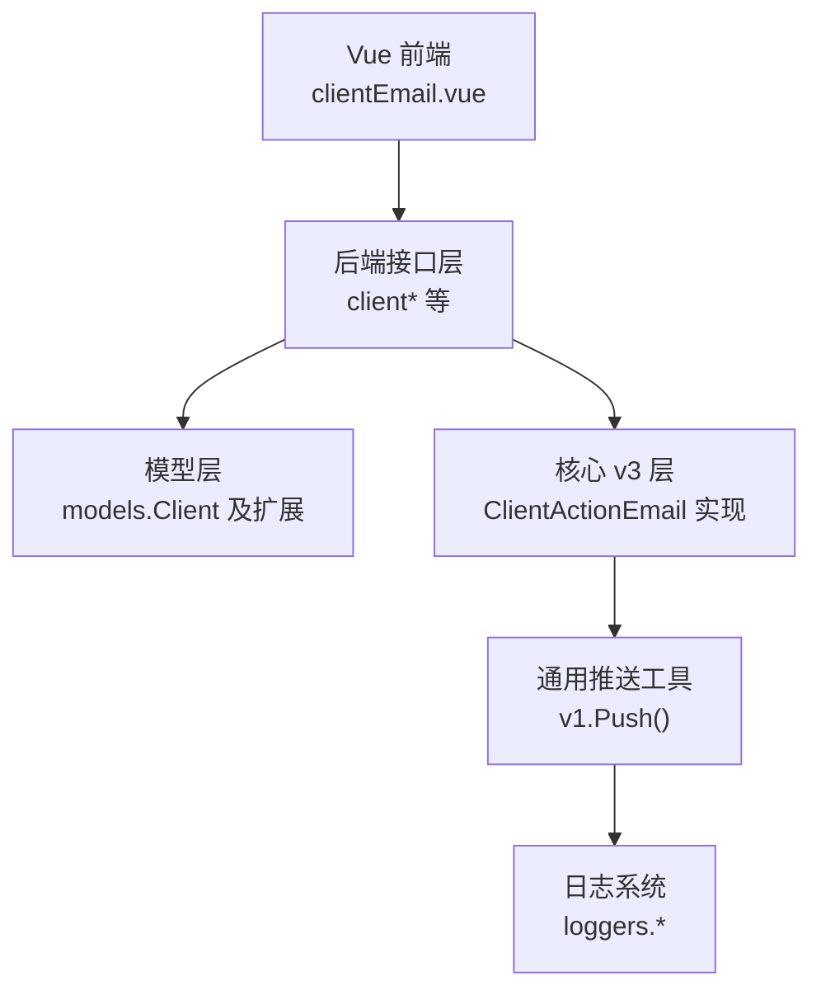
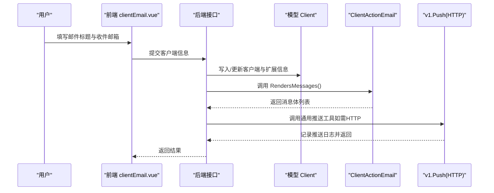
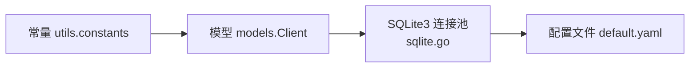

# 邮件客户端

<cite>
**本文引用的文件**
- [pkg/services/core/v3/email.go](file://pkg/services/core/v3/email.go)
- [pkg/services/core/v3/interfaces.go](file://pkg/services/core/v3/interfaces.go)
- [pkg/models/client.go](file://pkg/models/client.go)
- [vue/src/components/clients/clientEmail.vue](file://vue/src/components/clients/clientEmail.vue)
- [pkg/services/core/v1/push.go](file://pkg/services/core/v1/push.go)
- [config/default.yaml](file://config/default.yaml)
- [pkg/utils/constants.go](file://pkg/utils/constants.go)
- [pkg/utils/database/sqlite.go](file://pkg/utils/database/sqlite.go)
</cite>

## 目录
1. [简介](#简介)
2. [项目结构](#项目结构)
3. [核心组件](#核心组件)
4. [架构总览](#架构总览)
5. [详细组件分析](#详细组件分析)
6. [依赖分析](#依赖分析)
7. [性能考虑](#性能考虑)
8. [故障排查指南](#故障排查指南)
9. [结论](#结论)
10. [附录](#附录)

## 简介
本文件面向“邮件客户端”能力，系统性说明邮件推送的配置参数、消息格式与内容要求、安全与加密传输、配置示例与测试方法、错误处理与重试机制、性能优化与批量发送注意事项，并对比其与即时通讯平台（钉钉、飞书、企业微信机器人/应用）的差异。当前仓库中邮件客户端的渲染与推送逻辑尚处于占位实现，本文在不泄露未实现细节的前提下，基于现有代码与界面定义，给出可落地的配置与实践建议。

## 项目结构
邮件客户端能力由前后端协同实现：
- 前端 Vue 组件负责收集用户输入（客户端名称、描述、邮件标题、多个收件邮箱），并通过接口提交到后端。
- 后端模型与接口定义了客户端类型、扩展信息结构以及邮件渲染/推送的接口契约。
- 当前邮件渲染与推送的具体实现位于 v3 包中，目前为占位实现；通用的推送 HTTP 发送逻辑位于 v1 包中，供其他平台复用。

图表来源
- [vue/src/components/clients/clientEmail.vue:1-137](file://vue/src/components/clients/clientEmail.vue#L1-L137)
- [pkg/models/client.go:13-28](file://pkg/models/client.go#L13-L28)
- [pkg/services/core/v3/email.go:8-17](file://pkg/services/core/v3/email.go#L8-L17)
- [pkg/services/core/v1/push.go:15-57](file://pkg/services/core/v1/push.go#L15-L57)

章节来源
- [vue/src/components/clients/clientEmail.vue:1-137](file://vue/src/components/clients/clientEmail.vue#L1-L137)
- [pkg/models/client.go:13-28](file://pkg/models/client.go#L13-L28)
- [pkg/services/core/v3/email.go:8-17](file://pkg/services/core/v3/email.go#L8-L17)
- [pkg/services/core/v1/push.go:15-57](file://pkg/services/core/v1/push.go#L15-L57)

## 核心组件
- 客户端模型与扩展
  - 模型包含基础字段（命名空间、名称、描述、类型、是否启用）与扩展信息字段，用于承载各平台的差异化配置。
  - 邮件客户端的扩展信息通过 client_info 字段承载，前端表单中包含“邮件标题（robot_keyword）”和“收件邮箱列表（robot_url_list）”。

- 接口契约（v3）
  - 定义了 RendersMessages 与 PushMessages 的接口方法，用于将内容渲染为消息体并执行推送。

- 占位实现（v3 邮件）
  - 当前邮件实现仅输出提示信息，实际渲染与推送逻辑需后续完善。

- 通用推送工具（v1）
  - 提供 HTTP POST 推送封装，统一序列化、发送、读取响应与记录推送日志。

章节来源
- [pkg/models/client.go:13-28](file://pkg/models/client.go#L13-L28)
- [pkg/services/core/v3/interfaces.go:7-10](file://pkg/services/core/v3/interfaces.go#L7-L10)
- [pkg/services/core/v3/email.go:8-17](file://pkg/services/core/v3/email.go#L8-L17)
- [pkg/services/core/v1/push.go:15-57](file://pkg/services/core/v1/push.go#L15-L57)

## 架构总览
邮件客户端的调用链路如下：
- 前端收集配置并提交至后端。
- 后端根据客户端类型加载对应扩展信息。
- 调用 v3 的 ClientActionEmail 渲染消息体。
- 若需要对外部 SMTP/IMAP 服务进行调用，可参考通用推送工具 v1 的 HTTP 发送流程进行扩展。

图表来源
- [vue/src/components/clients/clientEmail.vue:58-126](file://vue/src/components/clients/clientEmail.vue#L58-L126)
- [pkg/models/client.go:40-87](file://pkg/models/client.go#L40-L87)
- [pkg/services/core/v3/email.go:10-17](file://pkg/services/core/v3/email.go#L10-L17)
- [pkg/services/core/v1/push.go:15-57](file://pkg/services/core/v1/push.go#L15-L57)

## 详细组件分析

### 前端组件：邮件客户端配置表单
- 字段说明
  - 客户端名称：必填，用于标识该邮件客户端。
  - 客户端描述：选填，便于团队维护。
  - 客户端类型：固定为邮件类型（由前端常量或后端常量约定）。
  - 邮件标题（robot_keyword）：作为邮件主题使用。
  - 收件邮箱列表（robot_url_list）：可添加多个邮箱，系统将向所有邮箱推送。

- 表单交互
  - 支持动态增删邮箱条目。
  - 提交成功后刷新客户端列表并关闭抽屉。

章节来源
- [vue/src/components/clients/clientEmail.vue:58-126](file://vue/src/components/clients/clientEmail.vue#L58-L126)

### 后端模型：客户端与扩展信息
- Client 结构
  - 基础字段：命名空间、名称、描述、类型、是否启用。
  - 扩展字段：client_info（JSON Raw）用于承载平台特定配置。
  - 通过 ClientType 判断具体扩展类型（如钉钉、飞书、企业微信机器人/应用）。

- 邮件扩展
  - 通过 client_info 承载“邮件标题（robot_keyword）”和“收件邮箱列表（robot_url_list）”。

- 客户端生命周期
  - 新增/更新/删除/查询均通过统一接口完成，内部按 ClientType 分派到对应扩展表。

章节来源
- [pkg/models/client.go:13-28](file://pkg/models/client.go#L13-L28)
- [pkg/models/client.go:40-87](file://pkg/models/client.go#L40-L87)
- [pkg/models/client.go:162-210](file://pkg/models/client.go#L162-L210)

### v3 接口与邮件实现
- 接口契约
  - RendersMessages：将内容列表渲染为消息体数组。
  - PushMessages：执行推送并返回成功/失败计数。

- 邮件实现现状
  - 当前实现为占位，仅输出提示信息，实际 SMTP/IMAP 调用需后续补充。

章节来源
- [pkg/services/core/v3/interfaces.go:7-10](file://pkg/services/core/v3/interfaces.go#L7-L10)
- [pkg/services/core/v3/email.go:8-17](file://pkg/services/core/v3/email.go#L8-L17)

### 通用推送工具（v1）
- 功能
  - 将任意数据结构序列化为 JSON，以 POST 方式发送到指定 URL。
  - 统一读取响应体、关闭连接并记录推送日志（含请求/响应体、状态码等）。

- 使用场景
  - 可作为外部 SMTP/IMAP 服务的 HTTP 化桥接（若未来采用 HTTP API 形式的邮件服务）。
  - 对于直接 SMTP/IMAP，可在 PushMessages 中自行实现相应协议栈。

章节来源
- [pkg/services/core/v1/push.go:15-57](file://pkg/services/core/v1/push.go#L15-L57)

## 依赖分析
- 类型常量
  - 定义了各平台的客户端类型常量，邮件客户端类型通过常量约定。

- 数据库与连接池
  - 默认使用 SQLite3，可通过配置文件调整路径与连接池大小。

图表来源
- [pkg/utils/constants.go:3-8](file://pkg/utils/constants.go#L3-L8)
- [pkg/models/client.go:13-28](file://pkg/models/client.go#L13-L28)
- [pkg/utils/database/sqlite.go:18-47](file://pkg/utils/database/sqlite.go#L18-L47)
- [config/default.yaml:52-62](file://config/default.yaml#L52-L62)

章节来源
- [pkg/utils/constants.go:3-8](file://pkg/utils/constants.go#L3-L8)
- [pkg/utils/database/sqlite.go:18-47](file://pkg/utils/database/sqlite.go#L18-L47)
- [config/default.yaml:52-62](file://config/default.yaml#L52-L62)

## 性能考虑
- 批量发送
  - 前端允许配置多个收件邮箱，系统应支持批量发送策略（如并发限制、速率控制、队列缓冲）。
- 连接池与资源
  - SQLite3 连接池参数可在配置文件中调整，避免高并发下的连接争用。
- 日志与可观测性
  - v1 推送工具会记录请求/响应体与状态码，建议在生产环境开启日志落盘与归档。

章节来源
- [vue/src/components/clients/clientEmail.vue:37-42](file://vue/src/components/clients/clientEmail.vue#L37-L42)
- [pkg/utils/database/sqlite.go:42-44](file://pkg/utils/database/sqlite.go#L42-L44)
- [pkg/services/core/v1/push.go:45-52](file://pkg/services/core/v1/push.go#L45-L52)

## 故障排查指南
- 常见问题
  - 邮件标题为空：检查前端表单是否填写 robot_keyword。
  - 收件邮箱无效：确认邮箱格式正确且可访问。
  - 推送失败：查看 v1 推送工具日志，定位网络/鉴权/目标服务异常。
- 日志定位
  - 运行时日志、访问日志、推送日志分别记录在配置文件中指定路径，按需开启 log2es 将日志同步到 Elasticsearch。

章节来源
- [pkg/services/core/v1/push.go:20-52](file://pkg/services/core/v1/push.go#L20-L52)
- [config/default.yaml:27-44](file://config/default.yaml#L27-L44)

## 结论
- 当前邮件客户端的前端配置与模型扩展已就绪，v3 的渲染与推送接口亦已完成契约定义。
- 实际 SMTP/IMAP 集成需在 PushMessages 中补充具体实现；若采用 HTTP API 形式的邮件服务，可复用 v1 的通用推送工具。
- 建议在生产环境中完善错误处理、重试机制、限流与日志归档，并结合批量发送策略提升吞吐。

## 附录

### 配置参数与消息格式说明
- 客户端类型
  - 邮件客户端类型由常量约定，前端与后端保持一致。
- 邮件标题（robot_keyword）
  - 作为邮件主题使用。
- 收件邮箱列表（robot_url_list）
  - 支持多邮箱，系统将向每个邮箱推送。

章节来源
- [pkg/utils/constants.go:3-8](file://pkg/utils/constants.go#L3-L8)
- [vue/src/components/clients/clientEmail.vue:22-42](file://vue/src/components/clients/clientEmail.vue#L22-L42)

### 安全与加密传输
- 传输安全
  - 如采用 HTTP API 形式的邮件服务，建议通过 HTTPS 保障传输加密。
- 鉴权
  - 在调用外部邮件服务时，确保在请求头或签名中携带必要的鉴权信息。
- 存储安全
  - 配置文件中的敏感信息（如 JWT Key）应妥善保管，避免硬编码在仓库中。

章节来源
- [config/default.yaml:11-13](file://config/default.yaml#L11-L13)

### 配置示例与测试方法
- 示例步骤
  - 在前端填写“客户端名称”、“邮件标题”和至少一个“收件邮箱”，提交后在后端查看客户端记录。
  - 若后续实现 SMTP/IMAP，可在 PushMessages 中接入相应协议栈并进行单元测试与集成测试。
- 测试建议
  - 使用最小可用目标（如本地邮件服务或模拟器）验证消息格式与鉴权流程。
  - 对批量发送场景进行压力测试，观察日志与性能指标。

章节来源
- [vue/src/components/clients/clientEmail.vue:89-104](file://vue/src/components/clients/clientEmail.vue#L89-L104)

### 错误处理与重试机制
- v1 推送工具
  - 序列化失败、请求失败、响应读取失败均有明确错误记录与返回。
- 建议
  - 在 PushMessages 中实现指数退避重试、最大重试次数、超时控制与熔断保护。
  - 对不同类型的错误（网络、鉴权、业务校验）进行分类处理与告警。

章节来源
- [pkg/services/core/v1/push.go:20-52](file://pkg/services/core/v1/push.go#L20-L52)

### 与其他即时通讯平台的区别
- 平台差异
  - 钉钉、飞书、企业微信机器人/应用均通过各自 Webhook 或 API 推送消息，而邮件客户端通过收件邮箱列表进行广播。
- 配置差异
  - 邮件客户端更关注“主题”和“收件人列表”的配置；其他平台通常关注“群组/用户”、“关键词”、“富文本样式”等。

章节来源
- [pkg/models/client.go:47-84](file://pkg/models/client.go#L47-L84)
- [pkg/models/client.go:169-207](file://pkg/models/client.go#L169-L207)