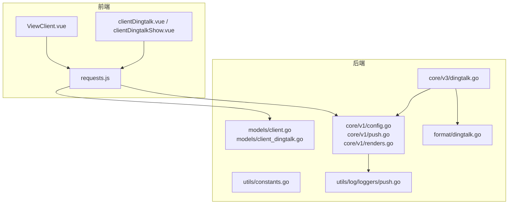
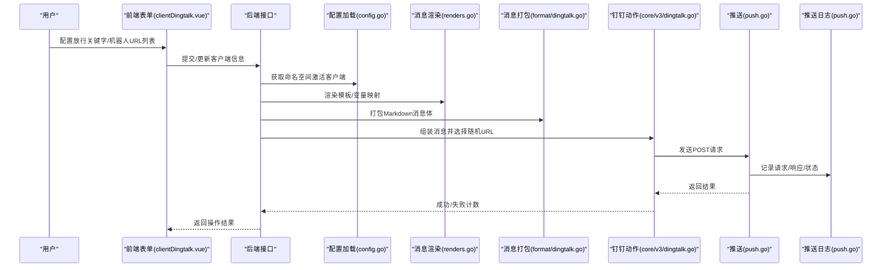
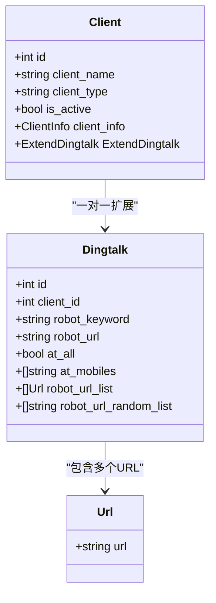
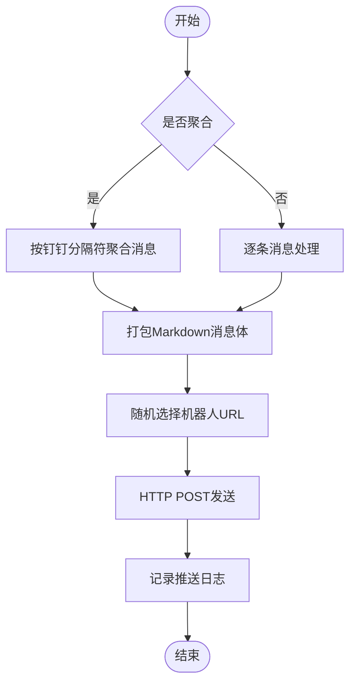
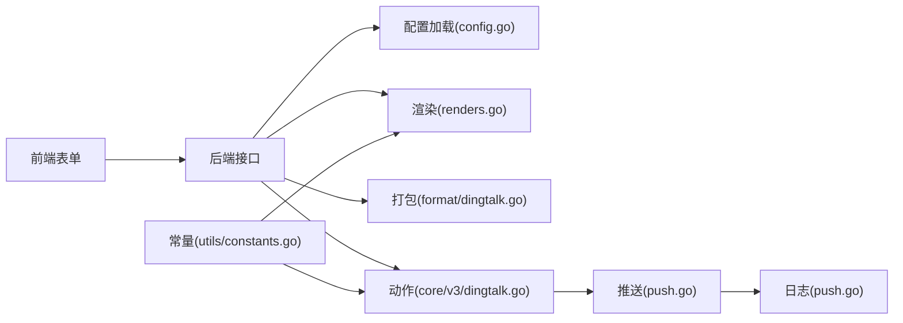

# 钉钉客户端

<cite>
**本文引用的文件**
- [pkg/models/client_dingtalk.go](file://pkg/models/client_dingtalk.go)
- [pkg/models/client.go](file://pkg/models/client.go)
- [pkg/services/core/v3/dingtalk.go](file://pkg/services/core/v3/dingtalk.go)
- [pkg/services/format/dingtalk.go](file://pkg/services/format/dingtalk.go)
- [pkg/services/core/v1/push.go](file://pkg/services/core/v1/push.go)
- [pkg/services/core/v1/config.go](file://pkg/services/core/v1/config.go)
- [pkg/services/core/v1/renders.go](file://pkg/services/core/v1/renders.go)
- [vue/src/components/clients/clientDingtalk.vue](file://vue/src/components/clients/clientDingtalk.vue)
- [vue/src/components/clientDingtalkShow.vue](file://vue/src/components/clientDingtalkShow.vue)
- [vue/src/views/main/ViewClient.vue](file://vue/src/views/main/ViewClient.vue)
- [vue/src/service/requests.js](file://vue/src/service/requests.js)
- [pkg/utils/constants.go](file://pkg/utils/constants.go)
- [config/default.yaml](file://config/default.yaml)
- [pkg/utils/log/loggers/push.go](file://pkg/utils/log/loggers/push.go)
</cite>

## 目录
1. [简介](#简介)
2. [项目结构](#项目结构)
3. [核心组件](#核心组件)
4. [架构总览](#架构总览)
5. [详细组件分析](#详细组件分析)
6. [依赖分析](#依赖分析)
7. [性能考虑](#性能考虑)
8. [故障排查指南](#故障排查指南)
9. [结论](#结论)
10. [附录](#附录)

## 简介
本文件面向“钉钉客户端”的配置与使用，围绕以下目标展开：
- 钉钉机器人配置参数：机器人URL、放行关键字、URL列表管理与随机轮询策略
- 认证机制、权限范围与使用限制
- 推送消息格式要求、支持的内容类型与样式选项
- 配置步骤与测试方法
- 错误处理与故障排查
- 与其他平台（如飞书、企业微信）的差异与注意事项

## 项目结构
本项目采用前后端分离架构，前端基于 Vue，后端基于 Go。与钉钉客户端相关的前后端关键文件如下：
- 前端：用于配置“钉钉·机器人”客户端的表单组件与页面视图
- 后端：模型定义、消息组装、推送执行、随机URL选择与日志记录

**图表来源**
- [vue/src/views/main/ViewClient.vue:1-266](file://vue/src/views/main/ViewClient.vue#L1-L266)
- [vue/src/components/clients/clientDingtalk.vue:1-240](file://vue/src/components/clients/clientDingtalk.vue#L1-L240)
- [vue/src/components/clientDingtalkShow.vue:1-131](file://vue/src/components/clientDingtalkShow.vue#L1-L131)
- [vue/src/service/requests.js:1-42](file://vue/src/service/requests.js#L1-L42)
- [pkg/models/client.go:1-239](file://pkg/models/client.go#L1-L239)
- [pkg/models/client_dingtalk.go:1-38](file://pkg/models/client_dingtalk.go#L1-L38)
- [pkg/services/core/v1/config.go:1-79](file://pkg/services/core/v1/config.go#L1-L79)
- [pkg/services/core/v1/push.go:1-57](file://pkg/services/core/v1/push.go#L1-L57)
- [pkg/services/core/v1/renders.go:1-127](file://pkg/services/core/v1/renders.go#L1-L127)
- [pkg/services/core/v3/dingtalk.go:1-41](file://pkg/services/core/v3/dingtalk.go#L1-L41)
- [pkg/services/format/dingtalk.go:1-30](file://pkg/services/format/dingtalk.go#L1-L30)
- [pkg/utils/constants.go:1-9](file://pkg/utils/constants.go#L1-L9)
- [pkg/utils/log/loggers/push.go:1-59](file://pkg/utils/log/loggers/push.go#L1-L59)

**章节来源**
- [vue/src/views/main/ViewClient.vue:1-266](file://vue/src/views/main/ViewClient.vue#L1-L266)
- [vue/src/components/clients/clientDingtalk.vue:1-240](file://vue/src/components/clients/clientDingtalk.vue#L1-L240)
- [vue/src/components/clientDingtalkShow.vue:1-131](file://vue/src/components/clientDingtalkShow.vue#L1-L131)
- [vue/src/service/requests.js:1-42](file://vue/src/service/requests.js#L1-L42)
- [pkg/models/client.go:1-239](file://pkg/models/client.go#L1-L239)
- [pkg/models/client_dingtalk.go:1-38](file://pkg/models/client_dingtalk.go#L1-L38)
- [pkg/services/core/v1/config.go:1-79](file://pkg/services/core/v1/config.go#L1-L79)
- [pkg/services/core/v1/push.go:1-57](file://pkg/services/core/v1/push.go#L1-L57)
- [pkg/services/core/v1/renders.go:1-127](file://pkg/services/core/v1/renders.go#L1-L127)
- [pkg/services/core/v3/dingtalk.go:1-41](file://pkg/services/core/v3/dingtalk.go#L1-L41)
- [pkg/services/format/dingtalk.go:1-30](file://pkg/services/format/dingtalk.go#L1-L30)
- [pkg/utils/constants.go:1-9](file://pkg/utils/constants.go#L1-L9)
- [pkg/utils/log/loggers/push.go:1-59](file://pkg/utils/log/loggers/push.go#L1-L59)

## 核心组件
- 钉钉客户端模型与URL管理
  - 放行关键字、机器人URL列表、随机URL列表、@全体/按手机号@等字段
  - URL列表在创建/更新时会被展开为随机列表，用于推送时轮询
- 消息组装与推送
  - 按客户端类型聚合消息，生成Markdown消息体
  - 随机选择URL并发起HTTP POST推送
- 前端配置表单
  - 支持多URL输入、动态增删、展示与编辑
- 日志与错误处理
  - 推送日志记录请求/响应、状态与时间戳；错误统一记录

**章节来源**
- [pkg/models/client_dingtalk.go:9-37](file://pkg/models/client_dingtalk.go#L9-L37)
- [pkg/models/client.go:40-87](file://pkg/models/client.go#L40-L87)
- [pkg/services/core/v3/dingtalk.go:14-40](file://pkg/services/core/v3/dingtalk.go#L14-L40)
- [pkg/services/format/dingtalk.go:3-29](file://pkg/services/format/dingtalk.go#L3-L29)
- [vue/src/components/clients/clientDingtalk.vue:45-82](file://vue/src/components/clients/clientDingtalk.vue#L45-L82)
- [pkg/services/core/v1/push.go:14-56](file://pkg/services/core/v1/push.go#L14-L56)
- [pkg/utils/log/loggers/push.go:13-58](file://pkg/utils/log/loggers/push.go#L13-L58)

## 架构总览
下图展示了从“前端配置”到“后端组装与推送”的整体流程。

**图表来源**
- [vue/src/components/clients/clientDingtalk.vue:140-154](file://vue/src/components/clients/clientDingtalk.vue#L140-L154)
- [vue/src/service/requests.js:22-27](file://vue/src/service/requests.js#L22-L27)
- [pkg/services/core/v1/config.go:20-57](file://pkg/services/core/v1/config.go#L20-L57)
- [pkg/services/core/v1/renders.go:15-67](file://pkg/services/core/v1/renders.go#L15-L67)
- [pkg/services/format/dingtalk.go:3-29](file://pkg/services/format/dingtalk.go#L3-L29)
- [pkg/services/core/v3/dingtalk.go:14-40](file://pkg/services/core/v3/dingtalk.go#L14-L40)
- [pkg/services/core/v1/push.go:14-56](file://pkg/services/core/v1/push.go#L14-L56)
- [pkg/utils/log/loggers/push.go:44-51](file://pkg/utils/log/loggers/push.go#L44-L51)

## 详细组件分析

### 钉钉客户端模型与URL管理
- 字段说明
  - 放行关键字：用于匹配钉钉机器人界面设置的“关键词”
  - 机器人URL列表：前端允许添加多个URL，后端将其展开为随机列表
  - 随机URL列表：推送时随机选取一个URL，提升可用性与稳定性
  - @全体/按手机号@：支持两种@方式，@全体时手机号列表清空
- 创建/更新流程
  - 创建：将URL列表转为随机列表并持久化
  - 更新：重新计算随机列表并更新数据库
- 表单行为
  - 前端支持动态增删URL输入框，提示“避免单个机器人每分钟次数限制”

**图表来源**
- [pkg/models/client.go:13-28](file://pkg/models/client.go#L13-L28)
- [pkg/models/client_dingtalk.go:21-33](file://pkg/models/client_dingtalk.go#L21-L33)

**章节来源**
- [pkg/models/client_dingtalk.go:9-37](file://pkg/models/client_dingtalk.go#L9-L37)
- [pkg/models/client.go:40-87](file://pkg/models/client.go#L40-L87)
- [vue/src/components/clients/clientDingtalk.vue:45-82](file://vue/src/components/clients/clientDingtalk.vue#L45-L82)

### 消息格式与推送流程
- 消息格式
  - 类型：Markdown
  - 标题：由“放行关键字+固定后缀”组成
  - 文本：渲染后的消息内容
  - @选项：支持@全体或按手机号@，@全体时手机号列表为空
- 聚合策略
  - 按钉钉类型使用特定分隔符进行消息拼接
- 推送策略
  - 从随机URL列表中随机选择一个URL
  - 使用HTTP POST发送JSON负载
  - 记录请求/响应、状态与时间戳

**图表来源**
- [pkg/services/core/v1/renders.go:104-126](file://pkg/services/core/v1/renders.go#L104-L126)
- [pkg/services/format/dingtalk.go:3-29](file://pkg/services/format/dingtalk.go#L3-L29)
- [pkg/services/core/v3/dingtalk.go:14-40](file://pkg/services/core/v3/dingtalk.go#L14-L40)
- [pkg/services/core/v1/push.go:14-56](file://pkg/services/core/v1/push.go#L14-L56)
- [pkg/utils/log/loggers/push.go:44-51](file://pkg/utils/log/loggers/push.go#L44-L51)

**章节来源**
- [pkg/services/format/dingtalk.go:3-29](file://pkg/services/format/dingtalk.go#L3-L29)
- [pkg/services/core/v1/renders.go:104-126](file://pkg/services/core/v1/renders.go#L104-L126)
- [pkg/services/core/v3/dingtalk.go:14-40](file://pkg/services/core/v3/dingtalk.go#L14-L40)
- [pkg/services/core/v1/push.go:14-56](file://pkg/services/core/v1/push.go#L14-L56)

### 前端配置与测试
- 配置页面
  - 支持创建/更新“钉钉·机器人”客户端
  - 放行关键字与机器人URL列表可编辑
  - 动态增删URL输入框，提示避免单机器人限流
- 测试入口
  - 页面提供“添加新客户端”入口，通过抽屉式表单完成配置
  - 通过后端接口提交/更新客户端信息

**章节来源**
- [vue/src/components/clients/clientDingtalk.vue:1-240](file://vue/src/components/clients/clientDingtalk.vue#L1-L240)
- [vue/src/components/clientDingtalkShow.vue:1-131](file://vue/src/components/clientDingtalkShow.vue#L1-L131)
- [vue/src/views/main/ViewClient.vue:161-226](file://vue/src/views/main/ViewClient.vue#L161-L226)
- [vue/src/service/requests.js:22-27](file://vue/src/service/requests.js#L22-L27)

## 依赖分析
- 平台常量
  - 定义了“钉钉”等平台标识，用于消息聚合与类型分支
- 组件耦合
  - 前端通过统一请求模块与后端交互
  - 后端核心流程：配置加载 → 渲染 → 打包 → 组装 → 推送 → 日志
- 外部依赖
  - HTTP客户端用于POST推送
  - 日志系统记录推送详情

**图表来源**
- [vue/src/service/requests.js:1-42](file://vue/src/service/requests.js#L1-L42)
- [pkg/services/core/v1/config.go:1-79](file://pkg/services/core/v1/config.go#L1-L79)
- [pkg/services/core/v1/renders.go:1-127](file://pkg/services/core/v1/renders.go#L1-L127)
- [pkg/services/format/dingtalk.go:1-30](file://pkg/services/format/dingtalk.go#L1-L30)
- [pkg/services/core/v3/dingtalk.go:1-41](file://pkg/services/core/v3/dingtalk.go#L1-L41)
- [pkg/services/core/v1/push.go:1-57](file://pkg/services/core/v1/push.go#L1-L57)
- [pkg/utils/constants.go:3-8](file://pkg/utils/constants.go#L3-L8)

**章节来源**
- [pkg/utils/constants.go:3-8](file://pkg/utils/constants.go#L3-L8)
- [vue/src/service/requests.js:1-42](file://vue/src/service/requests.js#L1-L42)
- [pkg/services/core/v1/config.go:1-79](file://pkg/services/core/v1/config.go#L1-L79)
- [pkg/services/core/v1/renders.go:1-127](file://pkg/services/core/v1/renders.go#L1-L127)
- [pkg/services/format/dingtalk.go:1-30](file://pkg/services/format/dingtalk.go#L1-L30)
- [pkg/services/core/v3/dingtalk.go:1-41](file://pkg/services/core/v3/dingtalk.go#L1-L41)
- [pkg/services/core/v1/push.go:1-57](file://pkg/services/core/v1/push.go#L1-L57)

## 性能考虑
- URL轮询策略
  - 将URL列表展开为随机列表，推送时随机选择，有助于分散单机器人限流压力
- 消息聚合
  - 在聚合模式下减少请求次数，降低网络开销
- 日志与可观测性
  - 推送日志包含请求/响应、状态与时间戳，便于定位问题

[本节为通用建议，无需特定文件引用]

## 故障排查指南
- 常见问题与定位
  - 序列化失败：检查消息体结构与编码
  - 请求失败：检查网络连通性与URL有效性
  - 响应读取失败：检查远端服务状态与超时设置
  - 推送日志：查看推送日志文件，确认请求/响应与状态
- 关键日志字段
  - 请求/响应体、状态、时间戳、内容类型
- 配置核对
  - 放行关键字需与钉钉机器人界面一致
  - URL列表至少保留一个有效地址

**章节来源**
- [pkg/services/core/v1/push.go:19-56](file://pkg/services/core/v1/push.go#L19-L56)
- [pkg/utils/log/loggers/push.go:44-51](file://pkg/utils/log/loggers/push.go#L44-L51)
- [config/default.yaml:27-38](file://config/default.yaml#L27-L38)

## 结论
- 钉钉客户端通过“放行关键字+机器人URL列表+随机轮询”实现高可用推送
- 消息以Markdown格式发送，支持@全体或按手机号@两种方式
- 前端提供直观的配置入口，后端负责渲染、打包、推送与日志记录
- 建议在生产环境配置多个机器人URL并定期轮换，避免单点限流风险

[本节为总结，无需特定文件引用]

## 附录

### 配置步骤与测试方法
- 配置步骤
  - 在“客户端·列表”页面打开“添加新客户端”，选择“钉钉·机器人”
  - 填写客户端名称与描述，选择“是否激活”
  - 填写“放行关键字”，添加至少一个“机器人URL”
  - 点击“立即创建”，完成后可在列表中查看与编辑
- 测试方法
  - 使用后端提供的演示数据接口触发一次推送，观察推送日志与钉钉端消息
  - 如需验证多URL轮询，可在URL列表中添加多个地址并观察日志中的URL变化

**章节来源**
- [vue/src/views/main/ViewClient.vue:161-226](file://vue/src/views/main/ViewClient.vue#L161-L226)
- [vue/src/components/clients/clientDingtalk.vue:140-154](file://vue/src/components/clients/clientDingtalk.vue#L140-L154)
- [vue/src/service/requests.js:4-5](file://vue/src/service/requests.js#L4-L5)

### 与其他平台的区别与注意事项
- 区别
  - 钉钉：Markdown消息体，支持@全体/按手机号@
  - 飞书：消息体结构与分隔符不同，详见飞书相关实现
  - 企业微信：应用号与机器人两类，接口与字段不同
- 注意事项
  - 放行关键字需与钉钉机器人界面设置保持一致
  - URL列表建议多于一个，避免单机器人限流导致漏推
  - @全体与按手机号@互斥，@全体时手机号列表应为空

**章节来源**
- [pkg/services/format/dingtalk.go:3-29](file://pkg/services/format/dingtalk.go#L3-L29)
- [pkg/services/core/v1/renders.go:104-126](file://pkg/services/core/v1/renders.go#L104-L126)
- [pkg/utils/constants.go:3-8](file://pkg/utils/constants.go#L3-L8)