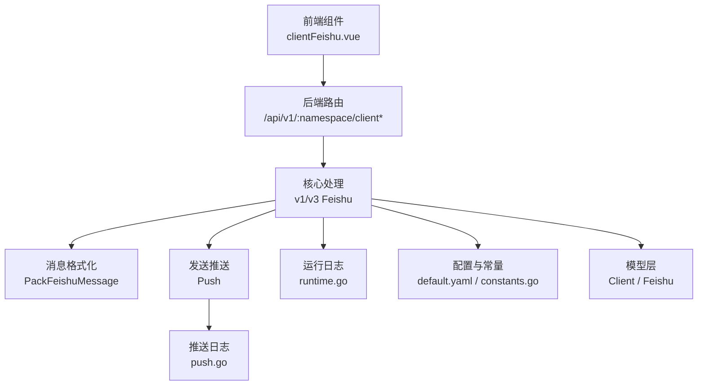
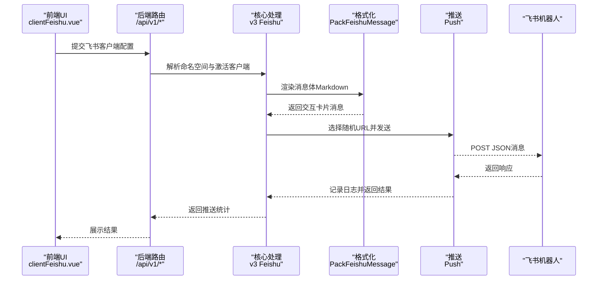
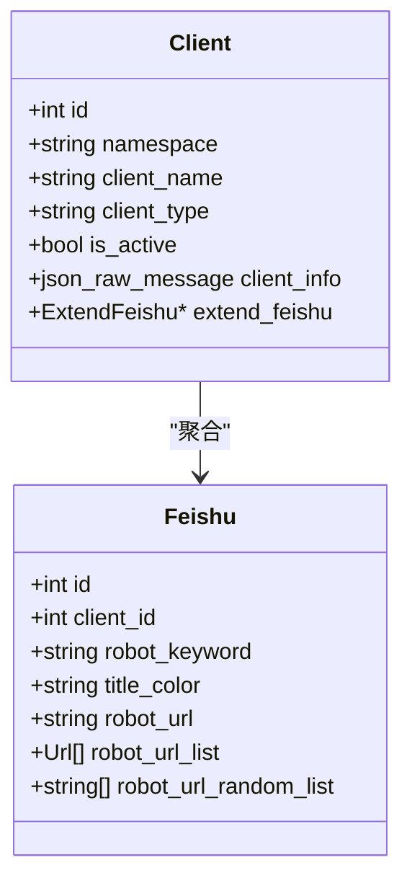
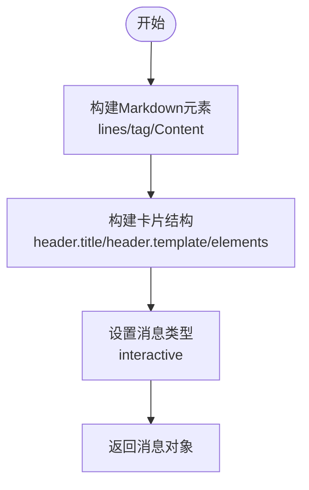
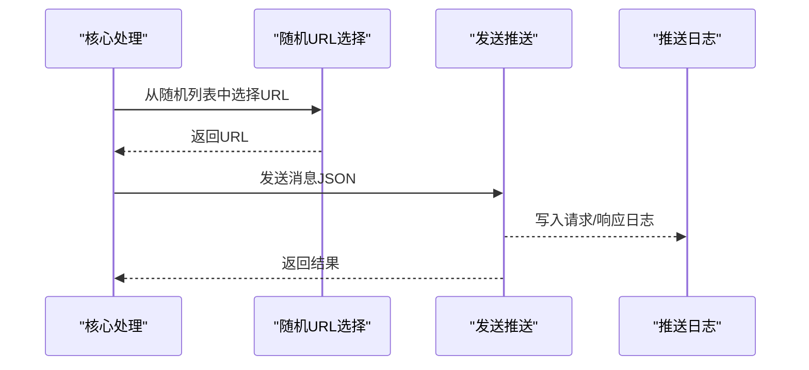
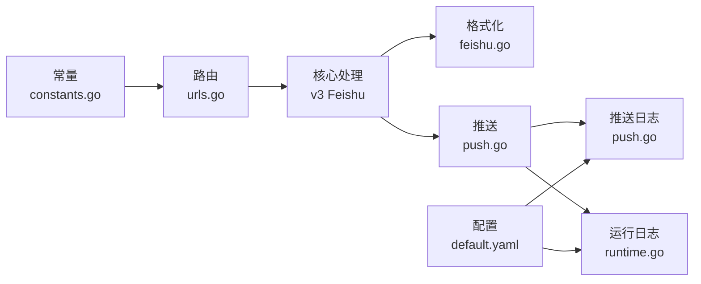

# 飞书客户端

<cite>
**本文引用的文件**
- [pkg/models/client_feishu.go](file://pkg/models/client_feishu.go)
- [pkg/models/client.go](file://pkg/models/client.go)
- [pkg/services/format/feishu.go](file://pkg/services/format/feishu.go)
- [pkg/services/core/v3/feishu.go](file://pkg/services/core/v3/feishu.go)
- [pkg/services/core/v1/push.go](file://pkg/services/core/v1/push.go)
- [pkg/services/core/v1/config.go](file://pkg/services/core/v1/config.go)
- [vue/src/components/clients/clientFeishu.vue](file://vue/src/components/clients/clientFeishu.vue)
- [config/default.yaml](file://config/default.yaml)
- [pkg/utils/constants.go](file://pkg/utils/constants.go)
- [pkg/utils/log/loggers/push.go](file://pkg/utils/log/loggers/push.go)
- [pkg/utils/log/loggers/runtime.go](file://pkg/utils/log/loggers/runtime.go)
- [pkg/routers/urls.go](file://pkg/routers/urls.go)
</cite>

## 目录
1. [简介](#简介)
2. [项目结构](#项目结构)
3. [核心组件](#核心组件)
4. [架构总览](#架构总览)
5. [详细组件分析](#详细组件分析)
6. [依赖关系分析](#依赖关系分析)
7. [性能考量](#性能考量)
8. [故障排查指南](#故障排查指南)
9. [结论](#结论)
10. [附录](#附录)

## 简介
本文件面向飞书客户端的配置与使用，覆盖以下主题：
- 飞书机器人配置项：机器人URL、关键词、标题颜色等
- 消息格式与富文本支持：交互卡片与Markdown元素
- 认证与调用流程：鉴权、路由、推送链路
- API调用限制与规避策略：多URL轮换
- 配置示例与最佳实践：前端表单与后端模型
- 样式定制与内容格式化：标题模板与颜色
- 错误处理与调试：日志记录与排障建议

## 项目结构
围绕飞书客户端的关键文件组织如下：
- 模型层：定义飞书客户端配置与通用客户端结构
- 渲染层：将内容打包为飞书交互卡片消息
- 核心层：消息组装、推送与随机URL选择
- 前端：飞书客户端配置表单与颜色选项
- 配置与日志：全局配置、推送日志与运行日志
- 路由：对外HTTP接口与鉴权中间件

图表来源
- [vue/src/components/clients/clientFeishu.vue:1-278](file://vue/src/components/clients/clientFeishu.vue#L1-L278)
- [pkg/routers/urls.go:58-90](file://pkg/routers/urls.go#L58-L90)
- [pkg/services/core/v3/feishu.go:1-40](file://pkg/services/core/v3/feishu.go#L1-L40)
- [pkg/services/format/feishu.go:1-61](file://pkg/services/format/feishu.go#L1-L61)
- [pkg/services/core/v1/push.go:1-57](file://pkg/services/core/v1/push.go#L1-L57)
- [pkg/utils/log/loggers/push.go:1-59](file://pkg/utils/log/loggers/push.go#L1-L59)
- [pkg/utils/log/loggers/runtime.go:1-113](file://pkg/utils/log/loggers/runtime.go#L1-L113)
- [config/default.yaml:1-83](file://config/default.yaml#L1-L83)
- [pkg/utils/constants.go:1-9](file://pkg/utils/constants.go#L1-L9)
- [pkg/models/client.go:1-239](file://pkg/models/client.go#L1-L239)
- [pkg/models/client_feishu.go:1-24](file://pkg/models/client_feishu.go#L1-L24)

章节来源
- [vue/src/components/clients/clientFeishu.vue:1-278](file://vue/src/components/clients/clientFeishu.vue#L1-L278)
- [pkg/routers/urls.go:58-90](file://pkg/routers/urls.go#L58-L90)

## 核心组件
- 飞书模型与客户端聚合
  - 飞书配置模型包含关键词、标题颜色、机器人URL列表及随机URL缓存
  - 客户端模型聚合各扩展配置并提供增删改查与激活状态管理
- 消息格式化
  - 将内容包装为飞书交互卡片消息，使用Markdown元素承载正文
  - 设置消息类型、标题模板与标题内容
- 推送与随机URL
  - 组装消息后随机选择一个机器人URL进行推送
  - 发送过程记录请求与响应，便于排障

章节来源
- [pkg/models/client_feishu.go:8-19](file://pkg/models/client_feishu.go#L8-L19)
- [pkg/models/client.go:13-28](file://pkg/models/client.go#L13-L28)
- [pkg/services/format/feishu.go:8-60](file://pkg/services/format/feishu.go#L8-L60)
- [pkg/services/core/v3/feishu.go:14-39](file://pkg/services/core/v3/feishu.go#L14-L39)
- [pkg/services/core/v1/push.go:15-56](file://pkg/services/core/v1/push.go#L15-L56)

## 架构总览
飞书客户端的配置与推送流程如下：

图表来源
- [vue/src/components/clients/clientFeishu.vue:178-247](file://vue/src/components/clients/clientFeishu.vue#L178-L247)
- [pkg/routers/urls.go:79-85](file://pkg/routers/urls.go#L79-L85)
- [pkg/services/core/v3/feishu.go:14-39](file://pkg/services/core/v3/feishu.go#L14-L39)
- [pkg/services/format/feishu.go:8-60](file://pkg/services/format/feishu.go#L8-L60)
- [pkg/services/core/v1/push.go:15-56](file://pkg/services/core/v1/push.go#L15-L56)

## 详细组件分析

### 飞书配置模型与前端表单
- 飞书配置模型字段
  - 关键词：用于标题中匹配放行条件
  - 标题颜色：支持多种颜色模板
  - 机器人URL列表：可配置多个URL以规避频率限制
  - 随机URL缓存：后端生成随机列表供推送使用
- 前端表单能力
  - 支持动态增删机器人URL输入框
  - 提供标题颜色下拉选择
  - 表单校验与提交/修改/删除操作

图表来源
- [pkg/models/client.go:13-28](file://pkg/models/client.go#L13-L28)
- [pkg/models/client_feishu.go:8-19](file://pkg/models/client_feishu.go#L8-L19)

章节来源
- [pkg/models/client_feishu.go:8-19](file://pkg/models/client_feishu.go#L8-L19)
- [vue/src/components/clients/clientFeishu.vue:45-74](file://vue/src/components/clients/clientFeishu.vue#L45-L74)

### 消息格式化与富文本支持
- 消息类型与结构
  - 消息类型：交互卡片
  - 卡片头部：标题内容与模板颜色
  - 元素：Markdown数组，承载正文
- 富文本支持
  - 使用Markdown标签与内容字段
  - 可通过模板与变量渲染生成Markdown内容

图表来源
- [pkg/services/format/feishu.go:22-60](file://pkg/services/format/feishu.go#L22-L60)

章节来源
- [pkg/services/format/feishu.go:8-60](file://pkg/services/format/feishu.go#L8-L60)

### 推送流程与API调用限制规避
- 随机URL选择
  - 后端维护随机URL列表，每次推送随机选取一个URL
- 推送实现
  - 序列化消息体为JSON
  - 以POST方式发送至飞书机器人URL
  - 记录请求与响应，便于排障
- 限制规避策略
  - 多URL配置：在前端表单中可添加多个机器人URL
  - 推送时随机选择，降低单点频率限制风险

图表来源
- [pkg/services/core/v3/feishu.go:29-39](file://pkg/services/core/v3/feishu.go#L29-L39)
- [pkg/services/core/v1/push.go:15-56](file://pkg/services/core/v1/push.go#L15-L56)
- [pkg/services/core/v1/config.go:60-65](file://pkg/services/core/v1/config.go#L60-L65)

章节来源
- [pkg/services/core/v3/feishu.go:29-39](file://pkg/services/core/v3/feishu.go#L29-L39)
- [pkg/services/core/v1/push.go:15-56](file://pkg/services/core/v1/push.go#L15-L56)
- [vue/src/components/clients/clientFeishu.vue:67-74](file://vue/src/components/clients/clientFeishu.vue#L67-L74)

### 配置示例与最佳实践
- 前端配置要点
  - 标题名称：填写关键词，用于标题匹配
  - 标题颜色：选择合适的颜色模板
  - 机器人URL：至少配置一个；建议配置多个以规避频率限制
- 最佳实践
  - 多URL配置：在前端“再添加一个机器人”按钮处增加多个URL
  - 颜色选择：根据告警级别选择颜色（如红色表示紧急）
  - 关键词设置：确保关键词能唯一识别目标群组或房间

章节来源
- [vue/src/components/clients/clientFeishu.vue:45-74](file://vue/src/components/clients/clientFeishu.vue#L45-L74)

### 样式定制与内容格式化
- 标题模板与颜色
  - 标题模板来自配置的颜色值，影响卡片头部颜色
  - 标题内容来自关键词，作为标题展示
- 内容格式化
  - 使用Markdown元素承载正文
  - 可结合模板与变量渲染生成丰富内容

章节来源
- [pkg/services/format/feishu.go:52-58](file://pkg/services/format/feishu.go#L52-L58)

## 依赖关系分析
- 组件耦合
  - 前端表单依赖后端常量与路由
  - 核心处理依赖格式化与推送模块
  - 推送模块依赖日志系统
- 外部依赖
  - HTTP客户端用于向飞书机器人发送消息
  - 配置文件提供日志与服务参数

图表来源
- [pkg/utils/constants.go:3-8](file://pkg/utils/constants.go#L3-L8)
- [pkg/routers/urls.go:58-90](file://pkg/routers/urls.go#L58-L90)
- [pkg/services/core/v3/feishu.go:1-40](file://pkg/services/core/v3/feishu.go#L1-L40)
- [pkg/services/format/feishu.go:1-61](file://pkg/services/format/feishu.go#L1-L61)
- [pkg/services/core/v1/push.go:1-57](file://pkg/services/core/v1/push.go#L1-L57)
- [pkg/utils/log/loggers/push.go:1-59](file://pkg/utils/log/loggers/push.go#L1-L59)
- [pkg/utils/log/loggers/runtime.go:1-113](file://pkg/utils/log/loggers/runtime.go#L1-L113)
- [config/default.yaml:27-44](file://config/default.yaml#L27-L44)

章节来源
- [pkg/utils/constants.go:3-8](file://pkg/utils/constants.go#L3-L8)
- [pkg/routers/urls.go:58-90](file://pkg/routers/urls.go#L58-L90)

## 性能考量
- 多URL轮换
  - 通过随机选择URL分散请求压力，降低单点限流风险
- 日志开销
  - 推送日志与运行日志分别输出，便于定位问题且避免日志冗余
- 序列化与网络
  - 消息体序列化为JSON后再发送，减少解析成本

## 故障排查指南
- 常见问题
  - 机器人URL无效：检查URL是否正确、是否已启用交互卡片权限
  - 关键词不匹配：确认关键词与飞书群组设置一致
  - 频率限制：增加机器人URL数量并启用随机轮换
- 调试步骤
  - 查看推送日志：确认请求体、响应体与状态码
  - 查看运行日志：定位异常与错误堆栈
  - 核对配置：确认命名空间、客户端类型与激活状态
- 相关日志与配置
  - 推送日志：记录请求/响应与时间戳
  - 运行日志：统一日志等级与格式
  - 配置文件：日志路径、ES投递开关等

章节来源
- [pkg/utils/log/loggers/push.go:15-58](file://pkg/utils/log/loggers/push.go#L15-L58)
- [pkg/utils/log/loggers/runtime.go:15-60](file://pkg/utils/log/loggers/runtime.go#L15-L60)
- [config/default.yaml:27-44](file://config/default.yaml#L27-L44)

## 结论
飞书客户端通过“配置—渲染—推送”的清晰分层，提供了灵活的样式定制与内容格式化能力。前端表单直观地支持多URL配置与颜色选择，后端通过随机URL轮换规避频率限制，并以完善的日志体系支撑排障。结合模板与变量渲染，可实现丰富的消息样式与内容格式化。

## 附录
- 鉴权与路由
  - 鉴权中间件保护API访问
  - 客户端管理接口支持增删改查与激活状态切换
- 常量与类型
  - 客户端类型常量统一管理
- 配置项速览
  - 日志级别、格式、文件路径
  - ES投递开关与地址

章节来源
- [pkg/routers/urls.go:50-90](file://pkg/routers/urls.go#L50-L90)
- [pkg/utils/constants.go:3-8](file://pkg/utils/constants.go#L3-L8)
- [config/default.yaml:27-44](file://config/default.yaml#L27-L44)