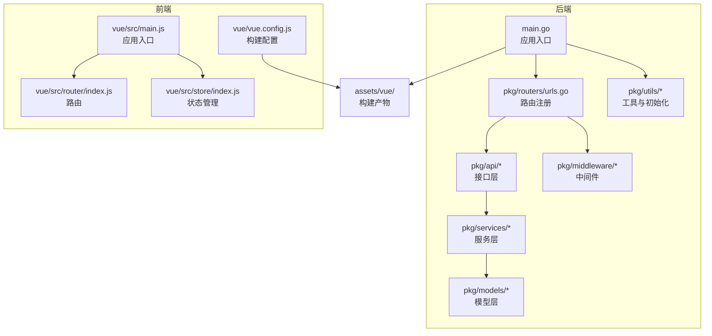
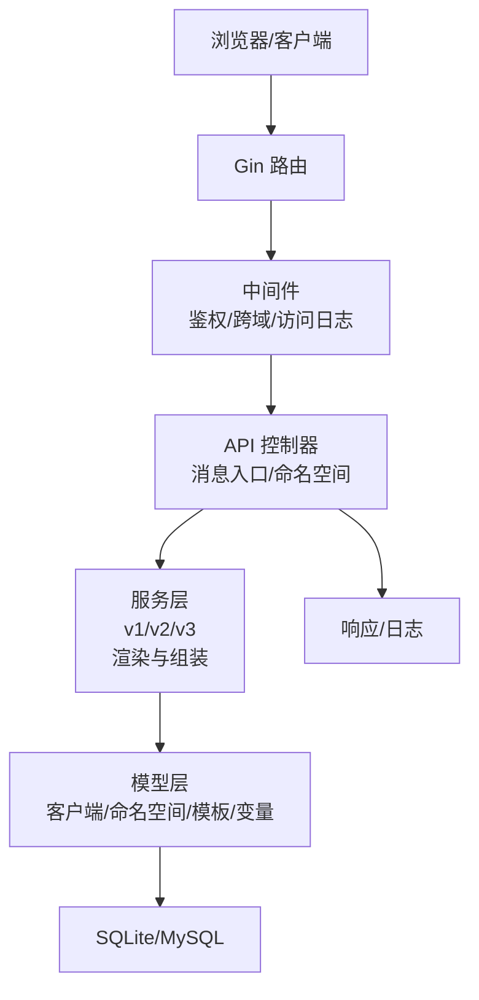
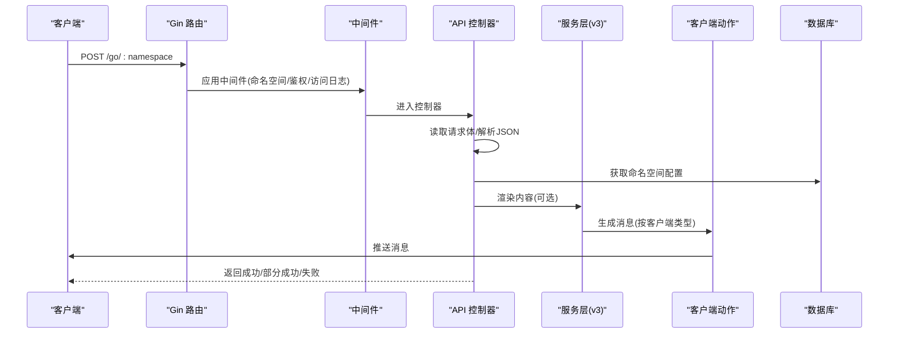
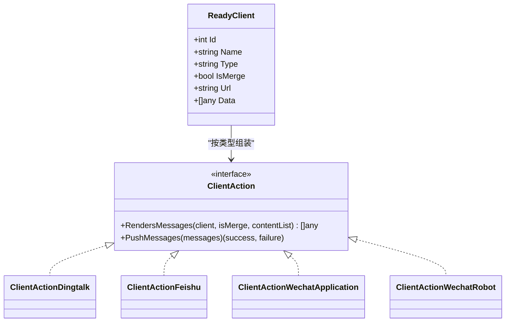
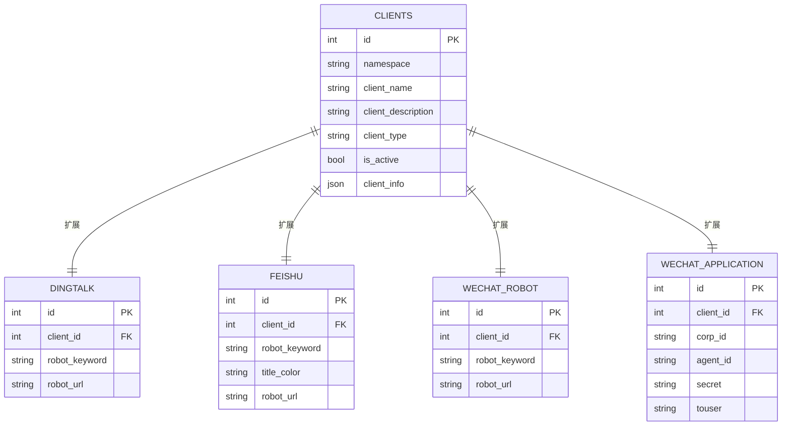
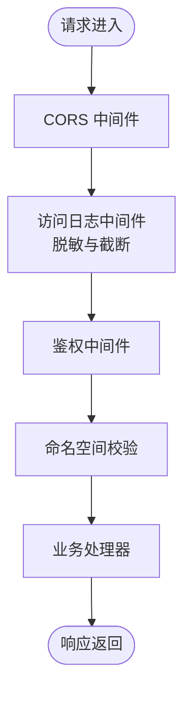
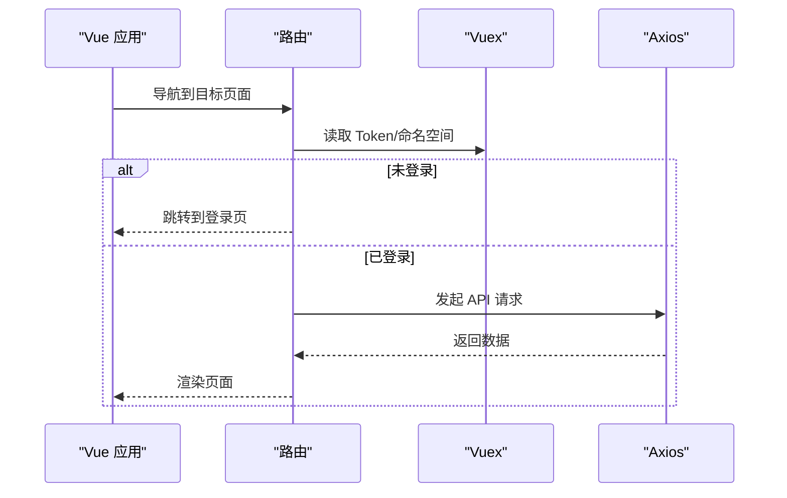
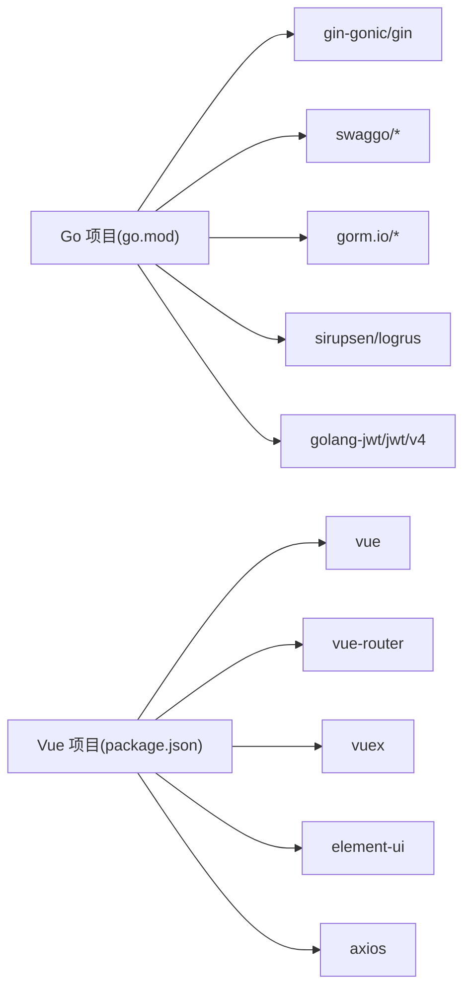

# 代码结构说明

<cite>
**本文档引用的文件**
- [main.go](file://main.go)
- [cmd/uploads/main.go](file://cmd/uploads/main.go)
- [go.mod](file://go.mod)
- [config/default.yaml](file://config/default.yaml)
- [Makefile](file://Makefile)
- [pkg/routers/urls.go](file://pkg/routers/urls.go)
- [pkg/api/vGomessage.go](file://pkg/api/vGomessage.go)
- [pkg/models/client.go](file://pkg/models/client.go)
- [pkg/services/core/v1/core.go](file://pkg/services/core/v1/core.go)
- [pkg/middleware/access.go](file://pkg/middleware/access.go)
- [vue/src/router/index.js](file://vue/src/router/index.js)
- [vue/src/store/index.js](file://vue/src/store/index.js)
- [vue/src/main.js](file://vue/src/main.js)
- [vue/package.json](file://vue/package.json)
- [vue/vue.config.js](file://vue/vue.config.js)
</cite>

## 目录
1. [简介](#简介)
2. [项目结构](#项目结构)
3. [核心组件](#核心组件)
4. [架构总览](#架构总览)
5. [详细组件分析](#详细组件分析)
6. [依赖分析](#依赖分析)
7. [性能考虑](#性能考虑)
8. [故障排查指南](#故障排查指南)
9. [结论](#结论)
10. [附录](#附录)

## 简介
本项目是一个消息推送与渲染平台，提供统一的消息入口、命名空间隔离、多渠道客户端适配（钉钉、飞书、企业微信、邮箱等）、模板与变量映射、以及前后端一体化的可视化管理界面。后端采用 Go + Gin 构建 API 层，结合 Swagger 文档与日志系统；前端使用 Vue 2 + Element UI 提供管理与配置界面。

## 项目结构
项目采用“分层+按功能域”的组织方式：
- 后端核心位于 pkg/ 下，按层次与功能域划分：
  - API 层：pkg/api/，负责对外接口定义与路由绑定
  - 服务层：pkg/services/，包含核心业务逻辑与多版本适配
  - 模型层：pkg/models/，数据模型与数据库访问
  - 中间件层：pkg/middleware/，跨切面能力（鉴权、跨域、访问日志等）
  - 工具与初始化：pkg/utils/，日志、常量、数据库、Swagger 初始化等
  - 路由：pkg/routers/urls.go，集中注册路由与静态资源
- 前端位于 vue/，采用 Vue CLI 4.x，构建产物输出至后端 assets/vue/ 供服务端直出
- 构建与发布：根目录 Makefile 提供多平台打包、Docker 镜像与 Helm Chart 打包、GitHub Release 上传工具

图表来源
- [main.go:1-56](file://main.go#L1-L56)
- [pkg/routers/urls.go:1-109](file://pkg/routers/urls.go#L1-L109)
- [vue/src/main.js:1-32](file://vue/src/main.js#L1-L32)
- [vue/vue.config.js:1-14](file://vue/vue.config.js#L1-L14)

章节来源
- [main.go:1-56](file://main.go#L1-L56)
- [pkg/routers/urls.go:1-109](file://pkg/routers/urls.go#L1-L109)
- [vue/src/main.js:1-32](file://vue/src/main.js#L1-L32)
- [vue/vue.config.js:1-14](file://vue/vue.config.js#L1-L14)

## 核心组件
- 应用入口与初始化
  - main.go：初始化配置、命令行参数、日志、Swagger、Gin 模式、数据库，启动 HTTP 服务
  - config/default.yaml：全局配置（运行环境、服务监听、日志、数据库类型与连接、鉴权密钥等）
  - go.mod：依赖管理
  - Makefile：多平台打包、Docker 镜像、Helm Chart、GitHub Release 上传
- 路由与中间件
  - pkg/routers/urls.go：注册静态资源、健康检查、Swagger、命名空间与鉴权中间件、API v1 路由组
  - pkg/middleware/access.go：访问日志中间件，敏感字段脱敏与请求体截断
- API 层
  - pkg/api/vGomessage.go：消息入口（GET/POST）、命名空间校验、劫持与渲染、客户端分发与推送统计
- 服务层
  - pkg/services/core/v1/core.go：组装消息结构（ReadyClient），按客户端类型格式化消息
  - 多版本适配：v1/v2/v3 分层，v3 实现具体客户端动作与渲染
- 模型层
  - pkg/models/client.go：客户端模型与 CRUD，按客户端类型扩展信息（钉钉、飞书、企业微信、机器人）
- 前端
  - vue/src/router/index.js：路由定义与鉴权守卫
  - vue/src/store/index.js：Vuex 状态（命名空间、抽屉、Token、用户 ID）
  - vue/src/main.js：挂载路由、状态、插件
  - vue/vue.config.js：构建输出目录与静态资源目录，开发服务器端口

章节来源
- [main.go:13-35](file://main.go#L13-L35)
- [config/default.yaml:1-83](file://config/default.yaml#L1-L83)
- [go.mod:1-75](file://go.mod#L1-L75)
- [Makefile:1-217](file://Makefile#L1-L217)
- [pkg/routers/urls.go:21-109](file://pkg/routers/urls.go#L21-L109)
- [pkg/middleware/access.go:23-72](file://pkg/middleware/access.go#L23-L72)
- [pkg/api/vGomessage.go:20-172](file://pkg/api/vGomessage.go#L20-L172)
- [pkg/services/core/v1/core.go:25-65](file://pkg/services/core/v1/core.go#L25-L65)
- [pkg/models/client.go:13-239](file://pkg/models/client.go#L13-L239)
- [vue/src/router/index.js:1-139](file://vue/src/router/index.js#L1-L139)
- [vue/src/store/index.js:1-49](file://vue/src/store/index.js#L1-L49)
- [vue/src/main.js:1-32](file://vue/src/main.js#L1-L32)
- [vue/vue.config.js:1-14](file://vue/vue.config.js#L1-L14)

## 架构总览
后端采用“路由 -> 中间件 -> API 控制器 -> 服务层 -> 模型层 -> 数据库/外部服务”的典型分层架构。前端通过 Axios 发起请求，经由后端中间件与鉴权，进入 API 层处理业务，服务层负责消息渲染与客户端适配，模型层负责数据持久化。

图表来源
- [pkg/routers/urls.go:21-109](file://pkg/routers/urls.go#L21-L109)
- [pkg/middleware/access.go:23-72](file://pkg/middleware/access.go#L23-L72)
- [pkg/api/vGomessage.go:20-172](file://pkg/api/vGomessage.go#L20-L172)
- [pkg/services/core/v1/core.go:25-65](file://pkg/services/core/v1/core.go#L25-L65)
- [pkg/models/client.go:13-239](file://pkg/models/client.go#L13-L239)

## 详细组件分析

### API 层：消息入口与命名空间处理
- 功能职责
  - GET /go/:namespace：校验命名空间并返回状态
  - POST /go/:namespace：劫持请求体、解析 JSON、根据命名空间配置渲染消息、按客户端类型组装消息并推送
  - 支持渲染开关：当命名空间开启渲染时，使用模板与变量映射生成内容体，否则透传原始 JSON
  - 成功/失败计数与聚合：统计各客户端推送结果，返回聚合状态
- 关键流程
  - 读取请求体并回写，防止一次性读取丢失
  - 获取命名空间用户配置（活动客户端、合并策略、模板、变量映射）
  - 根据客户端类型选择动作对象（v3.ClientAction），渲染或透传消息
  - 推送并统计结果，返回统一响应

图表来源
- [pkg/routers/urls.go:42-48](file://pkg/routers/urls.go#L42-L48)
- [pkg/api/vGomessage.go:20-153](file://pkg/api/vGomessage.go#L20-L153)

章节来源
- [pkg/api/vGomessage.go:20-172](file://pkg/api/vGomessage.go#L20-L172)
- [pkg/routers/urls.go:42-48](file://pkg/routers/urls.go#L42-L48)

### 服务层：消息组装与渲染
- 功能职责
  - v1.AssembledMessage：遍历活动客户端，按类型格式化消息与 URL
  - v3 接口族：实现不同客户端的动作（渲染、消息体生成、推送）
- 设计要点
  - ReadyClient 结构体承载客户端 ID、名称、类型、是否合并、URL 与数据
  - 通过接口抽象（ClientAction）解耦不同客户端的实现细节

图表来源
- [pkg/services/core/v1/core.go:25-65](file://pkg/services/core/v1/core.go#L25-L65)
- [pkg/api/vGomessage.go:77-106](file://pkg/api/vGomessage.go#L77-L106)

章节来源
- [pkg/services/core/v1/core.go:25-65](file://pkg/services/core/v1/core.go#L25-L65)
- [pkg/api/vGomessage.go:77-106](file://pkg/api/vGomessage.go#L77-L106)

### 模型层：客户端与命名空间
- 功能职责
  - 客户端模型：统一字段 + 按类型扩展（钉钉、飞书、企业微信、机器人）
  - CRUD：新增、更新、删除、按 ID 查询、按命名空间列出、获取激活客户端
- 设计要点
  - 使用 GORM 进行 ORM 映射，按 ClientType 分支处理扩展信息
  - 对 URL 列表进行随机化与回写，增强可用性

图表来源
- [pkg/models/client.go:13-239](file://pkg/models/client.go#L13-L239)

章节来源
- [pkg/models/client.go:13-239](file://pkg/models/client.go#L13-L239)

### 中间件层：跨域、访问日志与命名空间校验
- CORS：允许跨域请求
- AccessLog：记录请求路径、方法、状态码、耗时、客户端 IP、路由、请求体（敏感字段脱敏与长度限制）
- CheckNamespace：在路由级别校验命名空间有效性

图表来源
- [pkg/routers/urls.go:27-29](file://pkg/routers/urls.go#L27-L29)
- [pkg/middleware/access.go:23-72](file://pkg/middleware/access.go#L23-L72)

章节来源
- [pkg/routers/urls.go:27-29](file://pkg/routers/urls.go#L27-L29)
- [pkg/middleware/access.go:23-72](file://pkg/middleware/access.go#L23-L72)

### 前端：路由、状态管理与构建
- 路由
  - 定义首页、JSON 渲染、客户端管理、定时任务、登录、用户配置等页面
  - 导航守卫：未登录自动跳转登录页，登录后恢复 Vuex 状态
- 状态管理
  - 管理步骤条、抽屉状态、命名空间、Token、用户 ID
- 构建
  - 输出目录 assets/vue，静态资源目录 static
  - 开发服务器端口 7070

图表来源
- [vue/src/router/index.js:109-136](file://vue/src/router/index.js#L109-L136)
- [vue/src/store/index.js:6-49](file://vue/src/store/index.js#L6-L49)
- [vue/src/main.js:1-32](file://vue/src/main.js#L1-L32)
- [vue/vue.config.js:1-14](file://vue/vue.config.js#L1-L14)

章节来源
- [vue/src/router/index.js:1-139](file://vue/src/router/index.js#L1-L139)
- [vue/src/store/index.js:1-49](file://vue/src/store/index.js#L1-L49)
- [vue/src/main.js:1-32](file://vue/src/main.js#L1-L32)
- [vue/vue.config.js:1-14](file://vue/vue.config.js#L1-L14)

## 依赖分析
- 后端依赖
  - Web 框架：gin-gonic/gin
  - 配置与命令行：spf13/viper、spf13/pflag
  - 文档：swaggo/gin-swagger、swaggo/swag
  - ORM：gorm.io/gorm 及驱动
  - 日志：sirupsen/logrus
  - JWT：golang-jwt/jwt/v4
- 前端依赖
  - Vue 2、Vue Router、Vuex、Element UI、Axios

图表来源
- [go.mod:5-21](file://go.mod#L5-L21)
- [vue/package.json:10-32](file://vue/package.json#L10-L32)

章节来源
- [go.mod:1-75](file://go.mod#L1-L75)
- [vue/package.json:1-54](file://vue/package.json#L1-L54)

## 性能考虑
- 日志与 IO
  - 访问日志中间件对请求体进行脱敏与截断，避免大体积日志影响性能
  - 建议在高并发场景下启用异步日志或限流
- 数据库
  - SQLite 适合轻量元数据存储；建议合理设置连接池参数
  - 对高频查询建立索引（如按命名空间与激活状态查询客户端）
- 推送链路
  - 客户端推送采用并发策略，建议增加重试与熔断机制
  - 模板渲染与消息组装应尽量避免重复计算，必要时引入缓存
- 前端
  - 构建产物输出至 assets/vue，减少额外的静态资源服务开销
  - 开发服务器端口与后端服务分离，避免端口冲突

## 故障排查指南
- 启动与配置
  - 检查 config/default.yaml 中服务监听地址、端口、日志路径、数据库类型与连接
  - 确认初始化顺序：配置 -> 命令行 -> 日志 -> Swagger -> Gin 模式 -> 数据库
- 路由与中间件
  - 若访问日志缺失，确认中间件顺序与敏感字段正则是否正确
  - 健康检查 /ok 与 /health 应返回正常状态
- API 推送
  - 若推送失败，查看 API 返回的失败原因集合，逐项排查客户端配置与模板变量
  - 确认命名空间是否开启渲染，模板与变量映射是否正确
- 前端登录与状态
  - 登录后无法跳转：检查路由守卫逻辑与 Vuex Token 状态
  - 页面空白：确认构建产物已生成至 assets/vue，静态资源路径正确

章节来源
- [config/default.yaml:19-44](file://config/default.yaml#L19-L44)
- [main.go:13-35](file://main.go#L13-L35)
- [pkg/middleware/access.go:13-21](file://pkg/middleware/access.go#L13-L21)
- [pkg/routers/urls.go:30-33](file://pkg/routers/urls.go#L30-L33)
- [pkg/api/vGomessage.go:143-152](file://pkg/api/vGomessage.go#L143-L152)
- [vue/src/router/index.js:109-136](file://vue/src/router/index.js#L109-L136)

## 结论
本项目以清晰的分层架构与模块化设计，实现了消息入口、命名空间隔离、多客户端适配与可视化管理。后端通过中间件与日志体系保障可观测性，前端通过路由与状态管理提供良好的用户体验。建议在生产环境中进一步完善错误处理、缓存与限流策略，并持续优化模板渲染与推送链路的稳定性。

## 附录

### 目录与文件命名规范（最佳实践）
- 后端
  - pkg/api/：按资源与功能命名，如 vGomessage.go、vTemplate.go
  - pkg/services/core/v*/：按版本分层，v1/v2/v3 明确演进路径
  - pkg/models/：按实体命名，如 client.go、namespace.go
  - pkg/middleware/：按职责命名，如 access.go、auth.go、cors.go、namespace.go
  - pkg/utils/：按功能命名，如 database/、initialize/、log/、response.go
- 前端
  - vue/src/components/：按功能域拆分子目录，如 clients/
  - vue/src/views/：页面级组件，按模块划分
  - vue/src/router/index.js：集中管理路由与导航守卫
  - vue/src/store/index.js：集中管理状态与 getter/mutation

### 代码导航指南
- 快速定位消息入口：[pkg/api/vGomessage.go:20-153](file://pkg/api/vGomessage.go#L20-L153)
- 快速定位路由注册：[pkg/routers/urls.go:21-109](file://pkg/routers/urls.go#L21-L109)
- 快速定位客户端模型：[pkg/models/client.go:13-239](file://pkg/models/client.go#L13-L239)
- 快速定位消息组装逻辑：[pkg/services/core/v1/core.go:34-65](file://pkg/services/core/v1/core.go#L34-L65)
- 快速定位访问日志中间件：[pkg/middleware/access.go:23-72](file://pkg/middleware/access.go#L23-72)
- 快速定位前端路由与状态：[vue/src/router/index.js:1-139](file://vue/src/router/index.js#L1-L139)、[vue/src/store/index.js:1-49](file://vue/src/store/index.js#L1-L49)
- 快速定位构建配置：[vue/vue.config.js:1-14](file://vue/vue.config.js#L1-L14)