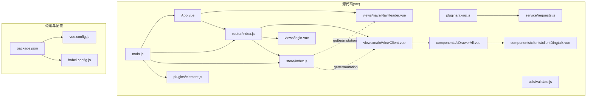
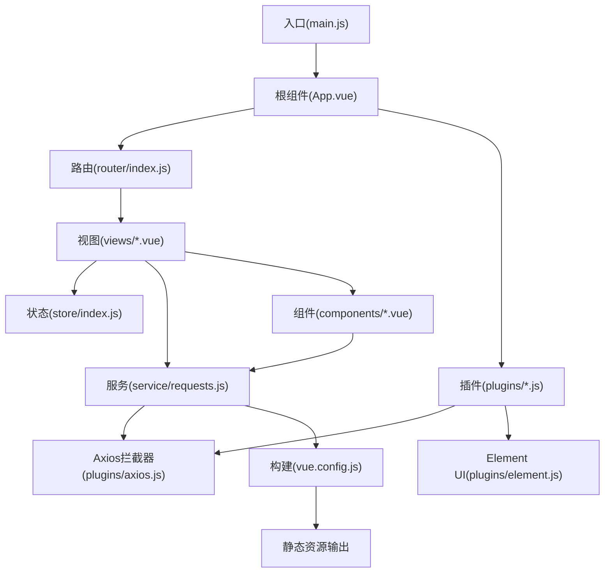
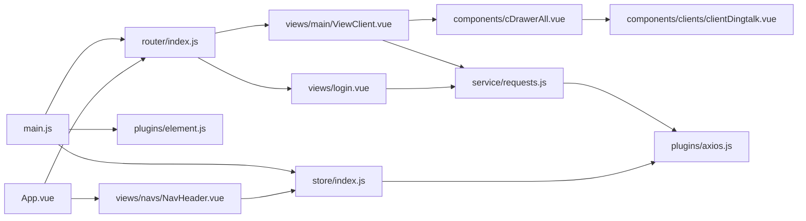
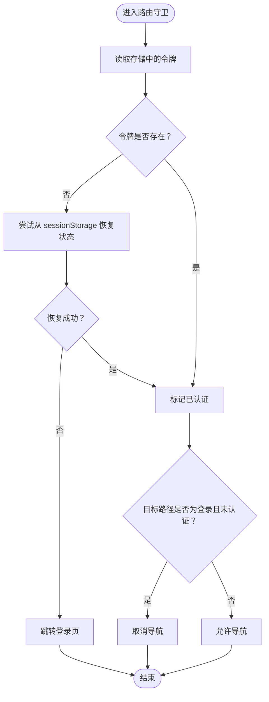
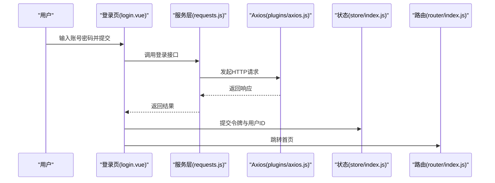
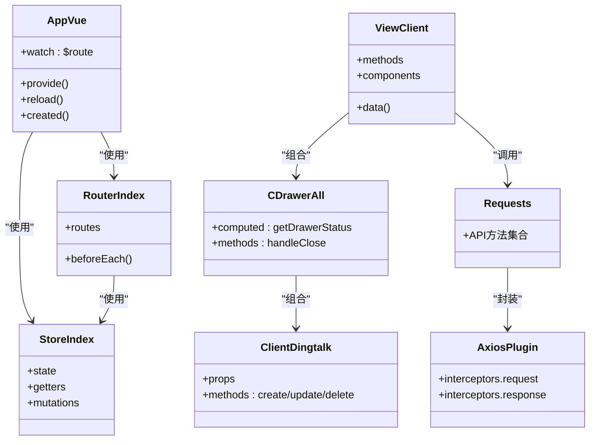

# 前端代码组织

<cite>
**本文引用的文件**
- [main.js](file://vue/src/main.js)
- [App.vue](file://vue/src/App.vue)
- [router/index.js](file://vue/src/router/index.js)
- [store/index.js](file://vue/src/store/index.js)
- [package.json](file://vue/package.json)
- [vue.config.js](file://vue/vue.config.js)
- [plugins/axios.js](file://vue/src/plugins/axios.js)
- [plugins/element.js](file://vue/src/plugins/element.js)
- [service/requests.js](file://vue/src/service/requests.js)
- [utils/validate.js](file://vue/src/utils/validate.js)
- [views/main/ViewClient.vue](file://vue/src/views/main/ViewClient.vue)
- [views/navs/NavHeader.vue](file://vue/src/views/navs/NavHeader.vue)
- [views/login.vue](file://vue/src/views/login.vue)
- [components/cDrawerAll.vue](file://vue/src/components/cDrawerAll.vue)
- [components/clients/clientDingtalk.vue](file://vue/src/components/clients/clientDingtalk.vue)
- [babel.config.js](file://vue/babel.config.js)
</cite>

## 目录
1. [简介](#简介)
2. [项目结构](#项目结构)
3. [核心组件](#核心组件)
4. [架构总览](#架构总览)
5. [详细组件分析](#详细组件分析)
6. [依赖关系分析](#依赖关系分析)
7. [性能考量](#性能考量)
8. [故障排查指南](#故障排查指南)
9. [结论](#结论)
10. [附录](#附录)

## 简介
本文件面向开发者，系统梳理该 Vue.js 前端工程的代码组织方式与最佳实践，覆盖目录结构、组件组织原则、单文件组件规范、组件通信与状态管理、路由守卫策略、构建配置与依赖管理、以及可复用组件与复杂状态管理的设计模式。文档同时提供可视化图示与定位到具体源码位置的“章节来源”和“图表来源”，便于快速查阅与落地实践。

## 项目结构
该前端工程位于 vue/ 目录，采用按职责分层的组织方式：
- src/assets：静态资源（本项目主要通过打包产物输出至后端 assets 目录）
- src/components：可复用组件库，按功能域细分（如 clients 子目录）
- src/views：页面级视图，包含主布局导航与业务页面
- src/router：路由配置，支持懒加载与前置守卫
- src/store：Vuex 状态管理，集中维护命名空间、令牌、抽屉状态等
- src/plugins：插件扩展（Element UI、Axios 封装）
- src/service：HTTP 请求封装，统一对外暴露 API 方法
- src/utils：通用工具（如表单校验规则）
- 构建与开发：vue.config.js 控制输出目录与开发服务器；package.json 定义脚本与依赖；babel.config.js 配置 Babel

图表来源
- [main.js:1-32](file://vue/src/main.js#L1-L32)
- [App.vue:1-132](file://vue/src/App.vue#L1-L132)
- [router/index.js:1-139](file://vue/src/router/index.js#L1-L139)
- [store/index.js:1-49](file://vue/src/store/index.js#L1-L49)
- [plugins/axios.js:1-96](file://vue/src/plugins/axios.js#L1-L96)
- [plugins/element.js:1-6](file://vue/src/plugins/element.js#L1-L6)
- [service/requests.js:1-42](file://vue/src/service/requests.js#L1-L42)
- [utils/validate.js:1-29](file://vue/src/utils/validate.js#L1-L29)
- [views/main/ViewClient.vue:1-266](file://vue/src/views/main/ViewClient.vue#L1-L266)
- [views/navs/NavHeader.vue:1-195](file://vue/src/views/navs/NavHeader.vue#L1-L195)
- [views/login.vue:1-86](file://vue/src/views/login.vue#L1-L86)
- [components/cDrawerAll.vue:1-64](file://vue/src/components/cDrawerAll.vue#L1-L64)
- [components/clients/clientDingtalk.vue:1-240](file://vue/src/components/clients/clientDingtalk.vue#L1-L240)
- [package.json:1-54](file://vue/package.json#L1-L54)
- [vue.config.js:1-14](file://vue/vue.config.js#L1-L14)
- [babel.config.js:1-6](file://vue/babel.config.js#L1-L6)

章节来源
- [main.js:1-32](file://vue/src/main.js#L1-L32)
- [App.vue:1-132](file://vue/src/App.vue#L1-L132)
- [router/index.js:1-139](file://vue/src/router/index.js#L1-L139)
- [store/index.js:1-49](file://vue/src/store/index.js#L1-L49)
- [package.json:1-54](file://vue/package.json#L1-L54)
- [vue.config.js:1-14](file://vue/vue.config.js#L1-L14)
- [babel.config.js:1-6](file://vue/babel.config.js#L1-L6)

## 核心组件
- 应用入口与全局挂载：在入口文件中引入插件、路由、状态，并挂载根组件。
- 根组件与布局：根组件负责全局布局容器、侧边/头部/底部导航、路由视图容器与路由刷新机制。
- 路由与守卫：集中定义路由表与前置守卫，结合状态管理实现鉴权与会话恢复。
- 状态管理：集中维护命名空间、令牌、抽屉状态等，提供 getter/mutation。
- 插件体系：Axios 封装统一拦截器与错误处理；Element UI 插件按需引入主题样式。
- 页面与组件：页面组件负责业务编排与数据流，可复用组件负责 UI 与交互细节。

章节来源
- [main.js:1-32](file://vue/src/main.js#L1-L32)
- [App.vue:1-132](file://vue/src/App.vue#L1-L132)
- [router/index.js:1-139](file://vue/src/router/index.js#L1-L139)
- [store/index.js:1-49](file://vue/src/store/index.js#L1-L49)
- [plugins/axios.js:1-96](file://vue/src/plugins/axios.js#L1-L96)
- [plugins/element.js:1-6](file://vue/src/plugins/element.js#L1-L6)

## 架构总览
整体采用“入口 -> 路由 -> 视图 -> 组件 -> 服务”的数据流，Axios 作为 HTTP 适配层，统一处理鉴权与错误；Vuex 集中管理跨组件共享状态；Element UI 提供 UI 基础能力。

图表来源
- [main.js:1-32](file://vue/src/main.js#L1-L32)
- [App.vue:1-132](file://vue/src/App.vue#L1-L132)
- [router/index.js:1-139](file://vue/src/router/index.js#L1-L139)
- [store/index.js:1-49](file://vue/src/store/index.js#L1-L49)
- [plugins/axios.js:1-96](file://vue/src/plugins/axios.js#L1-L96)
- [plugins/element.js:1-6](file://vue/src/plugins/element.js#L1-L6)
- [service/requests.js:1-42](file://vue/src/service/requests.js#L1-L42)
- [vue.config.js:1-14](file://vue/vue.config.js#L1-L14)

## 详细组件分析

### 单文件组件结构规范
- 模板区：使用 Element UI 布局与表单组件，遵循语义化标签与可读性。
- 脚本区：导出默认选项对象，声明 data、computed、methods、components 等；props 仅用于父子通信。
- 样式区：scoped 样式隔离，必要时使用深度选择器或全局样式。

示例定位
- [views/main/ViewClient.vue:1-266](file://vue/src/views/main/ViewClient.vue#L1-L266)
- [components/clients/clientDingtalk.vue:1-240](file://vue/src/components/clients/clientDingtalk.vue#L1-L240)

章节来源
- [views/main/ViewClient.vue:1-266](file://vue/src/views/main/ViewClient.vue#L1-L266)
- [components/clients/clientDingtalk.vue:1-240](file://vue/src/components/clients/clientDingtalk.vue#L1-L240)

### 组件间通信模式
- 父子通信：通过 props 下发数据与回调，通过事件向上反馈。
- 全局状态：通过 Vuex 提供的 getter/mutation 实现跨层级共享。
- 注入/提供：根组件通过 provide/inject 向后代提供方法（如路由视图重载）。

示例定位
- [components/cDrawerAll.vue:1-64](file://vue/src/components/cDrawerAll.vue#L1-L64)
- [components/clients/clientDingtalk.vue:132-137](file://vue/src/components/clients/clientDingtalk.vue#L132-L137)
- [App.vue:54-78](file://vue/src/App.vue#L54-L78)

章节来源
- [components/cDrawerAll.vue:1-64](file://vue/src/components/cDrawerAll.vue#L1-L64)
- [components/clients/clientDingtalk.vue:132-137](file://vue/src/components/clients/clientDingtalk.vue#L132-L137)
- [App.vue:54-78](file://vue/src/App.vue#L54-L78)

### 状态管理模式
- 集中式状态：命名空间、令牌、抽屉状态、步骤索引等。
- 计算属性：视图层通过计算属性读取状态，减少重复逻辑。
- 本地持久化：页面刷新时从 sessionStorage 恢复状态，beforeunload 时保存。

示例定位
- [store/index.js:1-49](file://vue/src/store/index.js#L1-L49)
- [App.vue:79-88](file://vue/src/App.vue#L79-L88)
- [views/navs/NavHeader.vue:144-152](file://vue/src/views/navs/NavHeader.vue#L144-L152)

章节来源
- [store/index.js:1-49](file://vue/src/store/index.js#L1-L49)
- [App.vue:79-88](file://vue/src/App.vue#L79-L88)
- [views/navs/NavHeader.vue:144-152](file://vue/src/views/navs/NavHeader.vue#L144-L152)

### 路由与导航
- 路由表：定义首页、渲染页、客户端管理、定时任务、登录、用户配置等页面。
- 懒加载：异步导入视图组件，优化首屏体积。
- 前置守卫：校验令牌，若无令牌则跳转登录；刷新时从 sessionStorage 恢复状态。

示例定位
- [router/index.js:8-101](file://vue/src/router/index.js#L8-L101)
- [router/index.js:109-136](file://vue/src/router/index.js#L109-L136)

章节来源
- [router/index.js:8-101](file://vue/src/router/index.js#L8-L101)
- [router/index.js:109-136](file://vue/src/router/index.js#L109-L136)

### HTTP 与拦截器
- Axios 实例：基于环境变量配置基础 URL 与超时。
- 请求拦截：携带 Authorization 头；空令牌时跳转登录。
- 响应拦截：统一处理 401/403 等错误码，跳转登录。

示例定位
- [plugins/axios.js:13-57](file://vue/src/plugins/axios.js#L13-L57)
- [service/requests.js:1-42](file://vue/src/service/requests.js#L1-L42)

章节来源
- [plugins/axios.js:13-57](file://vue/src/plugins/axios.js#L13-L57)
- [service/requests.js:1-42](file://vue/src/service/requests.js#L1-L42)

### 登录与会话管理
- 登录页：收集用户名与密码，调用登录接口，成功后写入令牌并跳转首页。
- 注销：调用注销接口，清除令牌并提示结果。

示例定位
- [views/login.vue:26-75](file://vue/src/views/login.vue#L26-L75)
- [views/navs/NavHeader.vue:157-174](file://vue/src/views/navs/NavHeader.vue#L157-L174)

章节来源
- [views/login.vue:26-75](file://vue/src/views/login.vue#L26-L75)
- [views/navs/NavHeader.vue:157-174](file://vue/src/views/navs/NavHeader.vue#L157-L174)

### 可复用组件设计
- 抽屉组件：统一承载多种客户端类型的创建/编辑表单，通过 tabs 切换。
- 表单组件：接收父组件传入的数据与回调，内部完成校验与提交。

示例定位
- [components/cDrawerAll.vue:1-64](file://vue/src/components/cDrawerAll.vue#L1-L64)
- [components/clients/clientDingtalk.vue:101-200](file://vue/src/components/clients/clientDingtalk.vue#L101-L200)

章节来源
- [components/cDrawerAll.vue:1-64](file://vue/src/components/cDrawerAll.vue#L1-L64)
- [components/clients/clientDingtalk.vue:101-200](file://vue/src/components/clients/clientDingtalk.vue#L101-L200)

### 页面级视图编排
- 客户端列表页：展示表格、抽屉、操作按钮；与抽屉组件配合实现 CRUD。
- 导航栏：顶部菜单、命名空间切换、用户下拉菜单、登录/注销。

示例定位
- [views/main/ViewClient.vue:1-266](file://vue/src/views/main/ViewClient.vue#L1-L266)
- [views/navs/NavHeader.vue:1-195](file://vue/src/views/navs/NavHeader.vue#L1-L195)

章节来源
- [views/main/ViewClient.vue:1-266](file://vue/src/views/main/ViewClient.vue#L1-L266)
- [views/navs/NavHeader.vue:1-195](file://vue/src/views/navs/NavHeader.vue#L1-L195)

### 数据校验与表单规则
- 工具函数：提供字符串长度、字符集、数字开头等校验规则。
- 表单组件：在模板中绑定 rules 并在提交时触发校验。

示例定位
- [utils/validate.js:1-29](file://vue/src/utils/validate.js#L1-L29)
- [components/clients/clientDingtalk.vue:124-129](file://vue/src/components/clients/clientDingtalk.vue#L124-L129)

章节来源
- [utils/validate.js:1-29](file://vue/src/utils/validate.js#L1-L29)
- [components/clients/clientDingtalk.vue:124-129](file://vue/src/components/clients/clientDingtalk.vue#L124-L129)

## 依赖关系分析

图表来源
- [main.js:1-32](file://vue/src/main.js#L1-L32)
- [App.vue:1-132](file://vue/src/App.vue#L1-L132)
- [router/index.js:1-139](file://vue/src/router/index.js#L1-L139)
- [store/index.js:1-49](file://vue/src/store/index.js#L1-L49)
- [plugins/element.js:1-6](file://vue/src/plugins/element.js#L1-L6)
- [views/main/ViewClient.vue:1-266](file://vue/src/views/main/ViewClient.vue#L1-L266)
- [views/navs/NavHeader.vue:1-195](file://vue/src/views/navs/NavHeader.vue#L1-L195)
- [views/login.vue:1-86](file://vue/src/views/login.vue#L1-L86)
- [components/cDrawerAll.vue:1-64](file://vue/src/components/cDrawerAll.vue#L1-L64)
- [components/clients/clientDingtalk.vue:1-240](file://vue/src/components/clients/clientDingtalk.vue#L1-L240)
- [service/requests.js:1-42](file://vue/src/service/requests.js#L1-L42)
- [plugins/axios.js:1-96](file://vue/src/plugins/axios.js#L1-L96)

章节来源
- [main.js:1-32](file://vue/src/main.js#L1-L32)
- [router/index.js:1-139](file://vue/src/router/index.js#L1-L139)
- [store/index.js:1-49](file://vue/src/store/index.js#L1-L49)
- [plugins/axios.js:1-96](file://vue/src/plugins/axios.js#L1-L96)
- [service/requests.js:1-42](file://vue/src/service/requests.js#L1-L42)

## 性能考量
- 路由懒加载：通过动态导入减少首屏包体，提升初始加载速度。
- 组件拆分：将复杂页面拆分为可复用组件，降低重复渲染与逻辑耦合。
- 状态集中：避免多处分散状态，减少不必要的响应式开销。
- 构建优化：合理配置输出目录与静态资源路径，确保后端正确托管。

章节来源
- [router/index.js:18-28](file://vue/src/router/index.js#L18-L28)
- [vue.config.js:1-14](file://vue/vue.config.js#L1-L14)

## 故障排查指南
- 登录后无法跳转：检查路由守卫中令牌读取与状态恢复逻辑。
- 401/403 错误：确认 Axios 请求拦截器是否正确设置 Authorization 头，响应拦截器是否跳转登录。
- 抽屉不显示：确认全局抽屉状态是否通过 mutation 更新，组件是否监听 store 状态。
- 路由刷新丢失状态：确认 beforeunload 保存与 created 恢复逻辑是否生效。

章节来源
- [router/index.js:109-136](file://vue/src/router/index.js#L109-L136)
- [plugins/axios.js:19-57](file://vue/src/plugins/axios.js#L19-L57)
- [store/index.js:23-44](file://vue/src/store/index.js#L23-L44)
- [App.vue:79-88](file://vue/src/App.vue#L79-L88)

## 结论
该前端工程遵循清晰的分层与职责划分，通过路由懒加载、Axios 统一拦截、Vuex 集中式状态与可复用组件，实现了高内聚、低耦合的组织方式。建议在后续迭代中持续完善表单校验、错误边界与国际化支持，并保持组件抽象的一致性与可测试性。

## 附录

### 路由守卫流程图

图表来源
- [router/index.js:109-136](file://vue/src/router/index.js#L109-L136)

### 登录序列图

图表来源
- [views/login.vue:41-62](file://vue/src/views/login.vue#L41-L62)
- [service/requests.js:39-40](file://vue/src/service/requests.js#L39-L40)
- [plugins/axios.js:13-36](file://vue/src/plugins/axios.js#L13-L36)
- [store/index.js:23-44](file://vue/src/store/index.js#L23-L44)
- [router/index.js:109-136](file://vue/src/router/index.js#L109-L136)

### 组件类图（代码级）

图表来源
- [App.vue:38-89](file://vue/src/App.vue#L38-L89)
- [router/index.js:1-139](file://vue/src/router/index.js#L1-L139)
- [store/index.js:1-49](file://vue/src/store/index.js#L1-L49)
- [plugins/axios.js:1-96](file://vue/src/plugins/axios.js#L1-L96)
- [service/requests.js:1-42](file://vue/src/service/requests.js#L1-L42)
- [views/main/ViewClient.vue:77-133](file://vue/src/views/main/ViewClient.vue#L77-L133)
- [components/cDrawerAll.vue:28-60](file://vue/src/components/cDrawerAll.vue#L28-L60)
- [components/clients/clientDingtalk.vue:101-185](file://vue/src/components/clients/clientDingtalk.vue#L101-L185)