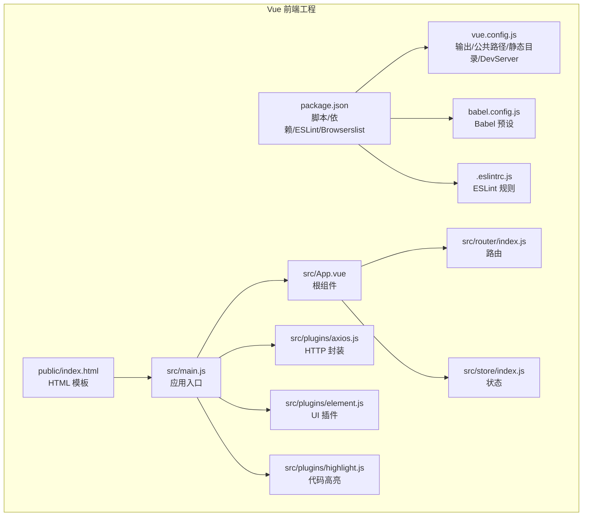
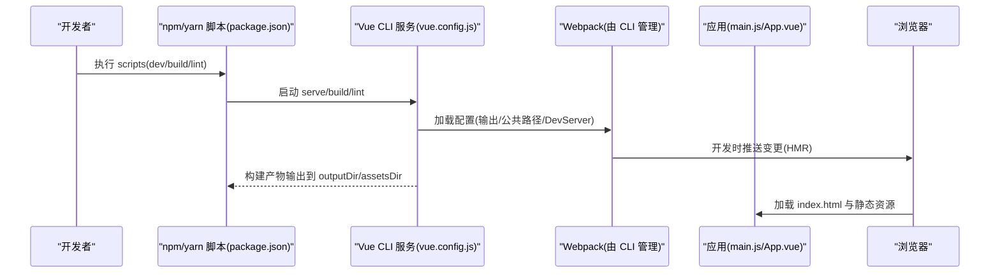
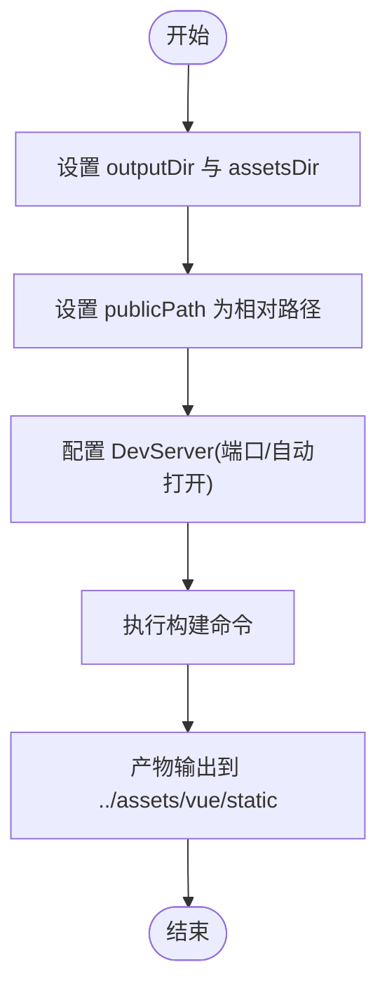
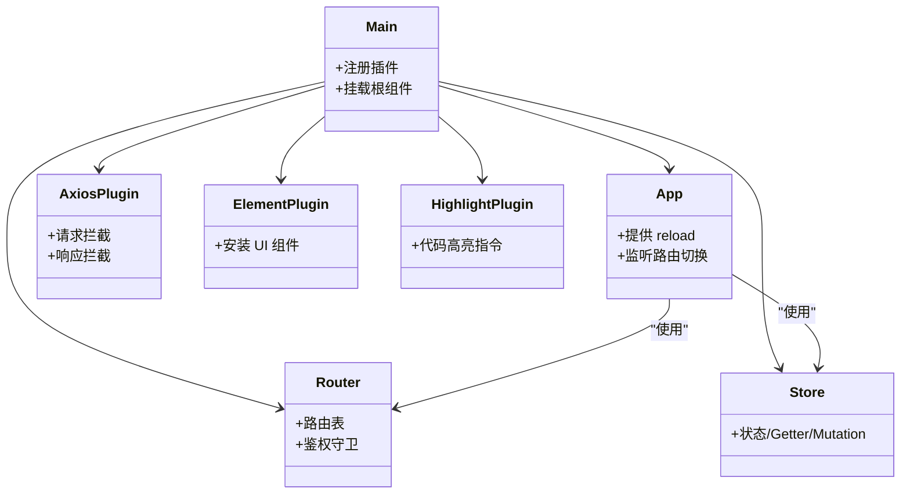
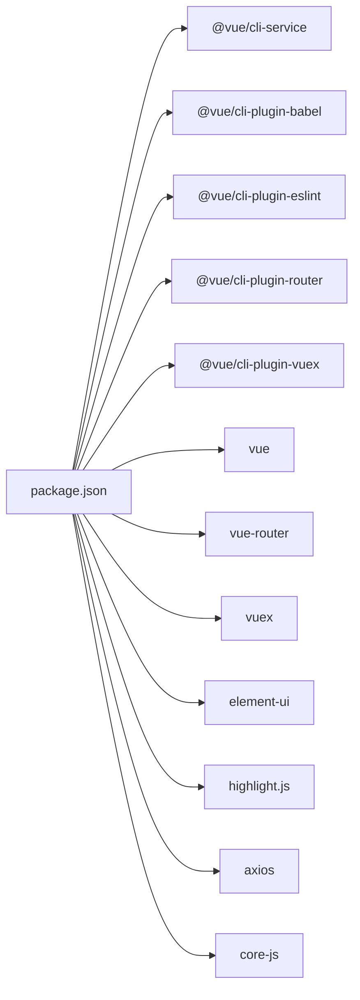

# 构建配置与工具链

<cite>
**本文引用的文件**
- [package.json](file://vue/package.json)
- [vue.config.js](file://vue/vue.config.js)
- [babel.config.js](file://vue/babel.config.js)
- [.eslintrc.js](file://vue/.eslintrc.js)
- [src/main.js](file://vue/src/main.js)
- [src/App.vue](file://vue/src/App.vue)
- [src/router/index.js](file://vue/src/router/index.js)
- [src/store/index.js](file://vue/src/store/index.js)
- [public/index.html](file://vue/public/index.html)
- [src/plugins/axios.js](file://vue/src/plugins/axios.js)
- [src/plugins/element.js](file://vue/src/plugins/element.js)
- [src/plugins/highlight.js](file://vue/src/plugins/highlight.js)
- [.gitignore](file://vue/.gitignore)
</cite>

## 目录
1. [简介](#简介)
2. [项目结构](#项目结构)
3. [核心组件](#核心组件)
4. [架构总览](#架构总览)
5. [详细组件分析](#详细组件分析)
6. [依赖分析](#依赖分析)
7. [性能考虑](#性能考虑)
8. [故障排查指南](#故障排查指南)
9. [结论](#结论)
10. [附录](#附录)

## 简介
本文件面向开发者，系统梳理基于 Vue CLI 的前端工程在本仓库中的构建配置与工具链，覆盖以下主题：
- 构建配置：输出目录、公共资源路径、静态资源目录、开发服务器参数
- 工具链：webpack 配置来源、Babel 转译策略、ESLint 规则与插件、浏览器兼容性
- 开发与生产差异：热重载、代码压缩、资源优化、Source Map 策略
- 开发工具：Vue DevTools、ESLint 插件、浏览器调试技巧
- 构建优化：代码分割、资源打包、CDN 集成建议
- 常见问题与解决方案

## 项目结构
Vue 前端位于 vue/ 目录，采用标准 Vue CLI 结构：
- 配置文件：vue.config.js、babel.config.js、package.json、.eslintrc.js
- 源码入口：src/main.js、public/index.html
- 功能模块：router、store、plugins、views、components 等
- 输出产物：构建后静态资源输出至 ../assets/vue/static 下

图表来源
- [package.json:1-54](file://vue/package.json#L1-L54)
- [vue.config.js:1-14](file://vue/vue.config.js#L1-L14)
- [babel.config.js:1-6](file://vue/babel.config.js#L1-L6)
- [.eslintrc.js](file://vue/.eslintrc.js)
- [public/index.html:1-20](file://vue/public/index.html#L1-L20)
- [src/main.js:1-32](file://vue/src/main.js#L1-L32)
- [src/App.vue:1-132](file://vue/src/App.vue#L1-L132)
- [src/router/index.js:1-139](file://vue/src/router/index.js#L1-L139)
- [src/store/index.js:1-49](file://vue/src/store/index.js#L1-L49)
- [src/plugins/axios.js:1-96](file://vue/src/plugins/axios.js#L1-L96)
- [src/plugins/element.js:1-6](file://vue/src/plugins/element.js#L1-L6)
- [src/plugins/highlight.js:1-47](file://vue/src/plugins/highlight.js#L1-L47)

章节来源
- [package.json:1-54](file://vue/package.json#L1-L54)
- [vue.config.js:1-14](file://vue/vue.config.js#L1-L14)
- [babel.config.js:1-6](file://vue/babel.config.js#L1-L6)
- [.eslintrc.js](file://vue/.eslintrc.js)
- [public/index.html:1-20](file://vue/public/index.html#L1-L20)
- [src/main.js:1-32](file://vue/src/main.js#L1-L32)
- [src/App.vue:1-132](file://vue/src/App.vue#L1-L132)
- [src/router/index.js:1-139](file://vue/src/router/index.js#L1-L139)
- [src/store/index.js:1-49](file://vue/src/store/index.js#L1-L49)
- [src/plugins/axios.js:1-96](file://vue/src/plugins/axios.js#L1-L96)
- [src/plugins/element.js:1-6](file://vue/src/plugins/element.js#L1-L6)
- [src/plugins/highlight.js:1-47](file://vue/src/plugins/highlight.js#L1-L47)

## 核心组件
- 构建配置核心
  - 输出目录与静态资源目录：通过 vue.config.js 指定 outputDir 与 assetsDir，确保构建产物统一输出到后端可服务的目录
  - 开发服务器：启用自动打开浏览器与自定义端口，便于本地联调
  - 公共路径：publicPath 设为相对路径，适配嵌套部署场景
- 转译与兼容
  - Babel 预设：使用 @vue/cli-plugin-babel/preset，保证对 Vue 单文件组件与现代语法的正确转译
  - 浏览器兼容：browserslist 指定目标范围，影响 polyfill 与语法降级
- 代码规范
  - ESLint：通过 package.json 内 eslintConfig 定义 extends 与 parserOptions，结合 @vue/cli-plugin-eslint 使用
- 应用入口与运行时
  - main.js：注册插件、挂载根组件
  - App.vue：提供全局布局与路由视图容器，实现视图重载能力
  - router/index.js：定义路由表与鉴权守卫
  - store/index.js：集中状态管理
  - plugins：axios 封装网络请求，element 与 highlight 提供 UI 与代码高亮能力

章节来源
- [vue.config.js:1-14](file://vue/vue.config.js#L1-L14)
- [babel.config.js:1-6](file://vue/babel.config.js#L1-L6)
- [package.json:34-52](file://vue/package.json#L34-L52)
- [src/main.js:1-32](file://vue/src/main.js#L1-L32)
- [src/App.vue:1-132](file://vue/src/App.vue#L1-L132)
- [src/router/index.js:1-139](file://vue/src/router/index.js#L1-L139)
- [src/store/index.js:1-49](file://vue/src/store/index.js#L1-L49)
- [src/plugins/axios.js:1-96](file://vue/src/plugins/axios.js#L1-L96)
- [src/plugins/element.js:1-6](file://vue/src/plugins/element.js#L1-L6)
- [src/plugins/highlight.js:1-47](file://vue/src/plugins/highlight.js#L1-L47)

## 架构总览
下图展示从开发到构建的关键流程与组件交互。

图表来源
- [package.json:5-8](file://vue/package.json#L5-L8)
- [vue.config.js:1-14](file://vue/vue.config.js#L1-L14)
- [src/main.js:1-32](file://vue/src/main.js#L1-L32)
- [public/index.html:1-20](file://vue/public/index.html#L1-L20)

## 详细组件分析

### 构建配置与输出策略
- 输出目录与静态资源
  - outputDir 指向 ../assets/vue，使构建产物进入后端可服务目录
  - assetsDir 为 static，统一存放 js/css/img/fonts
  - publicPath 为 ./，确保资源按相对路径加载
- 开发服务器
  - open=true：启动时自动打开浏览器
  - port=7070：避免与后端或其他服务冲突
  - 可选 historyApiFallback 注释项用于 SPA 路由回退
- 生产构建
  - 通过 npm scripts 调用 vue-cli-service build，遵循 CLI 默认优化策略

图表来源
- [vue.config.js:1-14](file://vue/vue.config.js#L1-L14)

章节来源
- [vue.config.js:1-14](file://vue/vue.config.js#L1-L14)

### Babel 转译与浏览器兼容
- 预设来源
  - 使用 @vue/cli-plugin-babel/preset，确保对 Vue SFC、JSX、动态导入等的支持
- 浏览器兼容
  - browserslist 指定目标范围，影响 polyfill 与语法降级策略
- 实践建议
  - 如需更严格的兼容性，可在 browserslist 中增加目标版本
  - 若引入新语法特性，确保 preset 或相关插件已启用

章节来源
- [babel.config.js:1-6](file://vue/babel.config.js#L1-L6)
- [package.json:48-52](file://vue/package.json#L48-L52)

### ESLint 代码规范与插件
- 规则来源
  - eslintConfig 在 package.json 中定义，extends 包含 plugin:vue/essential 与 eslint:recommended
  - parserOptions 指定 babel-eslint 作为解析器
- 插件
  - @vue/cli-plugin-eslint 提供 lint 脚本与默认规则
- 使用方式
  - 通过 npm scripts 执行 lint 命令，IDE 可配合 ESLint 插件实时检查

章节来源
- [package.json:34-47](file://vue/package.json#L34-L47)

### 应用入口与运行时
- 入口文件
  - main.js 引入 axios 插件、App、router、store，并注册 Element 与 Highlight 插件
- 根组件
  - App.vue 提供容器布局与全局样式，实现路由视图重载能力
- 路由与鉴权
  - router/index.js 定义路由表与 beforeEach 鉴权逻辑，未登录跳转登录页
- 状态管理
  - store/index.js 提供命名空间、Token、Drawer 状态等集中管理
- 插件体系
  - axios 封装统一请求与响应拦截
  - element 提供 UI 组件库
  - highlight 提供代码高亮指令

图表来源
- [src/main.js:1-32](file://vue/src/main.js#L1-L32)
- [src/App.vue:1-132](file://vue/src/App.vue#L1-L132)
- [src/router/index.js:1-139](file://vue/src/router/index.js#L1-L139)
- [src/store/index.js:1-49](file://vue/src/store/index.js#L1-L49)
- [src/plugins/axios.js:1-96](file://vue/src/plugins/axios.js#L1-L96)
- [src/plugins/element.js:1-6](file://vue/src/plugins/element.js#L1-L6)
- [src/plugins/highlight.js:1-47](file://vue/src/plugins/highlight.js#L1-L47)

章节来源
- [src/main.js:1-32](file://vue/src/main.js#L1-L32)
- [src/App.vue:1-132](file://vue/src/App.vue#L1-L132)
- [src/router/index.js:1-139](file://vue/src/router/index.js#L1-L139)
- [src/store/index.js:1-49](file://vue/src/store/index.js#L1-L49)
- [src/plugins/axios.js:1-96](file://vue/src/plugins/axios.js#L1-L96)
- [src/plugins/element.js:1-6](file://vue/src/plugins/element.js#L1-L6)
- [src/plugins/highlight.js:1-47](file://vue/src/plugins/highlight.js#L1-L47)

### 开发工具链与调试
- Vue DevTools
  - 在浏览器中安装 Vue DevTools，用于检查组件树、状态与路由
- ESLint 插件
  - 在 IDE 中启用 ESLint 插件，结合 package.json 中的规则即时发现问题
- 浏览器调试
  - 利用断点、Network 面板查看请求与响应头、Console 查看错误
  - 使用 Application 面板检查 localStorage/sessionStorage 与缓存资源
- 环境变量
  - axios 使用环境变量 VUE_APP_BASE_URL 作为基础地址，确保开发与生产可分离

章节来源
- [src/plugins/axios.js:13-17](file://vue/src/plugins/axios.js#L13-L17)

## 依赖分析
- 构建与工具
  - @vue/cli-service、@vue/cli-plugin-babel、@vue/cli-plugin-eslint、@vue/cli-plugin-router、@vue/cli-plugin-vuex
- 运行时依赖
  - vue、vue-router、vuex、element-ui、highlight.js、axios、core-js
- 开发依赖
  - eslint、eslint-plugin-vue、babel-eslint、vue-template-compiler 等

图表来源
- [package.json:10-33](file://vue/package.json#L10-L33)

章节来源
- [package.json:10-33](file://vue/package.json#L10-L33)

## 性能考虑
- 代码分割
  - 路由级懒加载（动态 import）已在路由中使用，有助于首屏加载优化
- 资源优化
  - 生产构建默认启用压缩与 Tree Shaking；可结合 CDN 对第三方库进行外部化
- Source Map
  - 开发环境可开启 Source Map 以提升调试体验；生产环境建议关闭或使用廉价 Source Map
- 缓存策略
  - 静态资源输出到独立目录，便于浏览器缓存与版本控制
- 体积监控
  - 建议集成 webpack-bundle-analyzer 分析包体构成

章节来源
- [src/router/index.js:16-40](file://vue/src/router/index.js#L16-L40)
- [vue.config.js:1-14](file://vue/vue.config.js#L1-L14)

## 故障排查指南
- 构建产物未更新
  - 确认 outputDir 与 assetsDir 配置正确，清理旧产物后重新构建
- 路由历史模式 404
  - 若使用 history 模式，需在后端配置回退至 index.html；当前配置注释了该选项
- 环境变量无效
  - axios 使用 VUE_APP_BASE_URL，请确认 .env 文件与脚本模式正确
- ESLint 报错
  - 检查 package.json 中 eslintConfig 的 extends 与 parserOptions 是否符合当前项目
- 浏览器无法热更新
  - 检查 DevServer 端口占用与网络代理设置，必要时更换端口

章节来源
- [vue.config.js:5-12](file://vue/vue.config.js#L5-L12)
- [src/plugins/axios.js:13-17](file://vue/src/plugins/axios.js#L13-L17)
- [package.json:34-47](file://vue/package.json#L34-L47)
- [.gitignore:1-28](file://vue/.gitignore#L1-L28)

## 结论
本项目基于 Vue CLI 提供了清晰的构建与工具链配置：明确的输出目录与静态资源组织、合理的开发服务器参数、统一的转译与兼容策略、以及完善的 ESLint 规范。结合路由懒加载与插件化扩展，满足中型前端工程的开发与运维需求。建议后续根据业务增长引入 CDN 外链、Source Map 策略与体积分析工具，持续优化构建性能与用户体验。

## 附录
- 常用命令
  - 开发：npm run dev
  - 构建：npm run build
  - 代码检查：npm run lint
- 关键配置参考路径
  - 构建：[vue.config.js:1-14](file://vue/vue.config.js#L1-L14)
  - 转译：[babel.config.js:1-6](file://vue/babel.config.js#L1-L6)
  - 规范：[package.json:34-47](file://vue/package.json#L34-L47)
  - 兼容：[package.json:48-52](file://vue/package.json#L48-L52)
  - 入口：[src/main.js:1-32](file://vue/src/main.js#L1-L32)
  - 根组件：[src/App.vue:1-132](file://vue/src/App.vue#L1-L132)
  - 路由：[src/router/index.js:1-139](file://vue/src/router/index.js#L1-L139)
  - 状态：[src/store/index.js:1-49](file://vue/src/store/index.js#L1-L49)
  - 插件：[src/plugins/axios.js:1-96](file://vue/src/plugins/axios.js#L1-L96)、[src/plugins/element.js:1-6](file://vue/src/plugins/element.js#L1-L6)、[src/plugins/highlight.js:1-47](file://vue/src/plugins/highlight.js#L1-L47)
  - 模板：[public/index.html:1-20](file://vue/public/index.html#L1-L20)
  - 忽略：[.gitignore:1-28](file://vue/.gitignore#L1-L28)