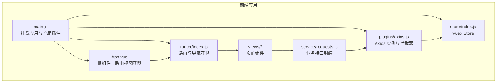
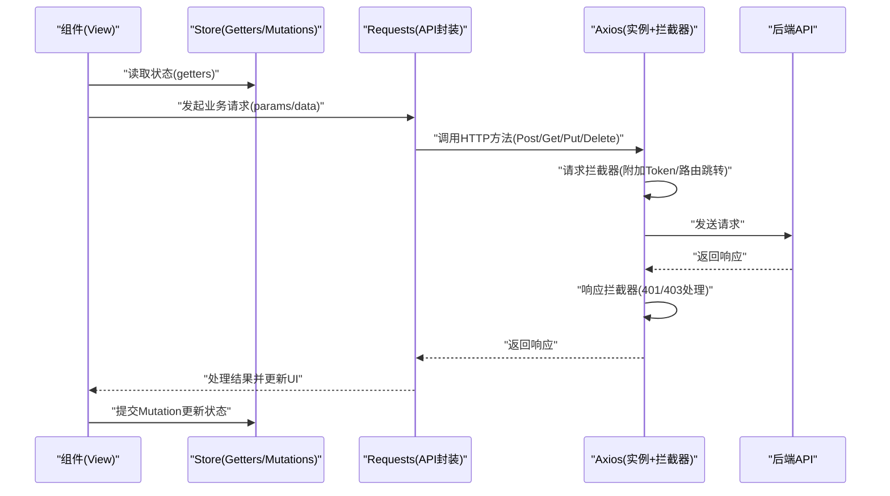
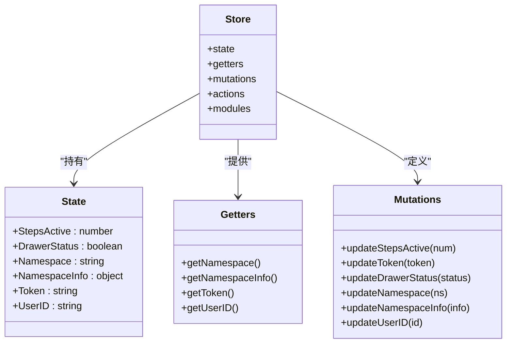
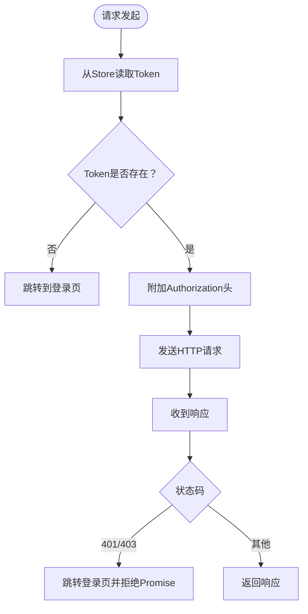
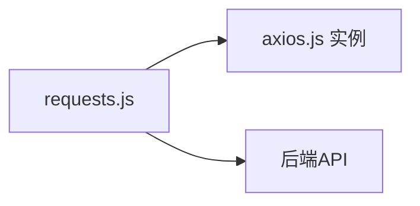
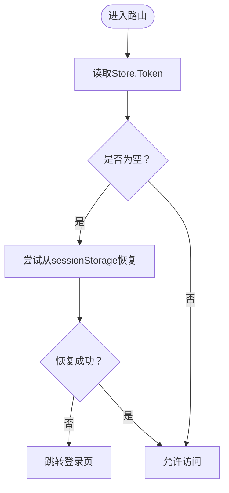
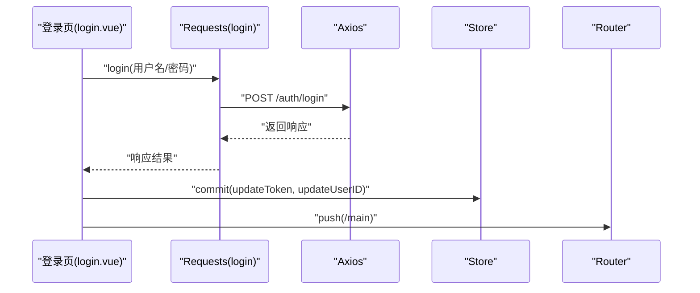
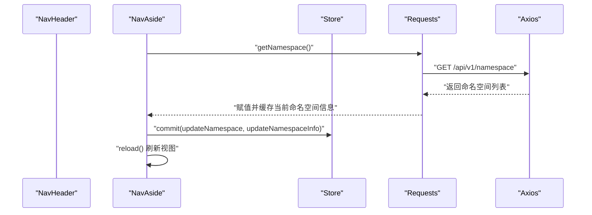
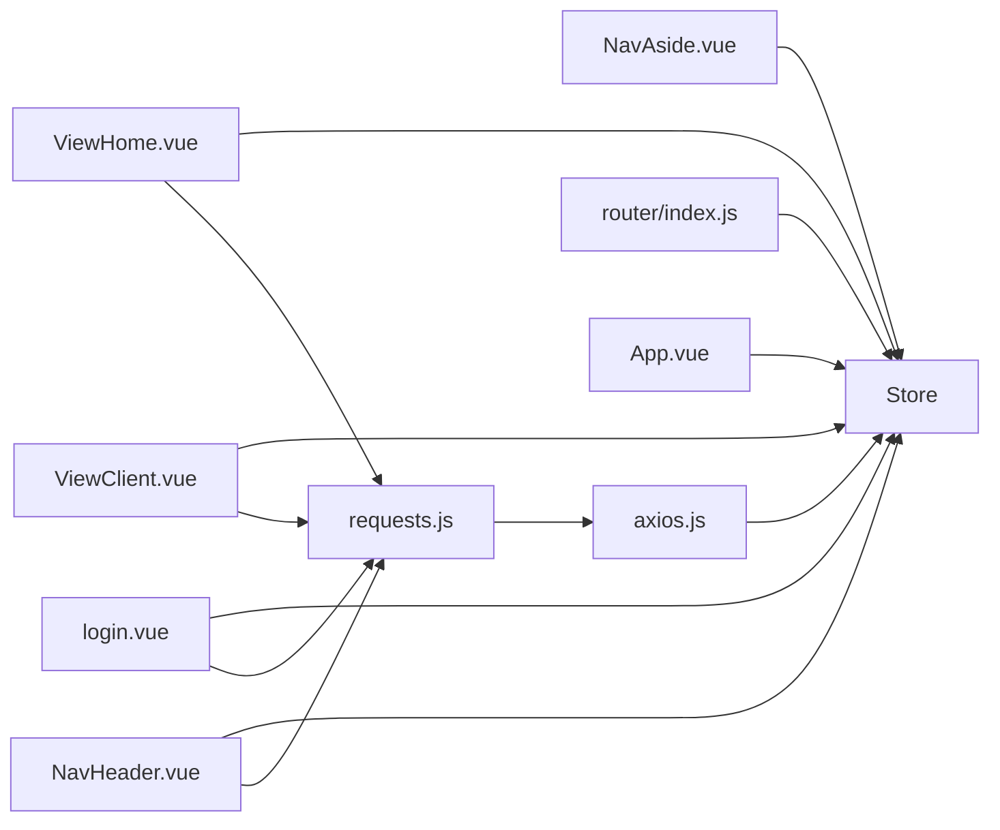

# 状态管理架构

<cite>
**本文引用的文件**
- [vue/src/store/index.js](file://vue/src/store/index.js)
- [vue/src/plugins/axios.js](file://vue/src/plugins/axios.js)
- [vue/src/service/requests.js](file://vue/src/service/requests.js)
- [vue/src/main.js](file://vue/src/main.js)
- [vue/src/router/index.js](file://vue/src/router/index.js)
- [vue/src/views/login.vue](file://vue/src/views/login.vue)
- [vue/src/views/main/ViewHome.vue](file://vue/src/views/main/ViewHome.vue)
- [vue/src/views/main/ViewClient.vue](file://vue/src/views/main/ViewClient.vue)
- [vue/src/App.vue](file://vue/src/App.vue)
- [vue/src/views/navs/NavHeader.vue](file://vue/src/views/navs/NavHeader.vue)
- [vue/src/views/navs/NavAside.vue](file://vue/src/views/navs/NavAside.vue)
- [vue/package.json](file://vue/package.json)
- [vue/vue.config.js](file://vue/vue.config.js)
</cite>

## 目录
1. [简介](#简介)
2. [项目结构](#项目结构)
3. [核心组件](#核心组件)
4. [架构总览](#架构总览)
5. [详细组件分析](#详细组件分析)
6. [依赖关系分析](#依赖关系分析)
7. [性能考虑](#性能考虑)
8. [故障排查指南](#故障排查指南)
9. [结论](#结论)
10. [附录](#附录)

## 简介
本文件面向开发者，系统性阐述本项目的前端状态管理架构，围绕 Vuex Store 的结构设计、State 状态定义、Mutations 同步修改、Actions 异步操作、Getters 计算属性进行深入解析，并结合实际业务场景（用户登录、命名空间切换、页面数据管理）说明最佳实践，涵盖模块化设计、状态持久化、异步数据处理、与后端 API 的交互方式（Axios 配置、请求/响应拦截器、错误处理）、性能优化与调试技巧。

## 项目结构
前端采用 Vue 2 + Vue Router + Vuex + Element-UI 技术栈，状态管理集中在 Vuex Store，HTTP 请求通过 Axios 封装统一处理，路由守卫负责鉴权与状态恢复。

图表来源
- [vue/src/main.js:1-32](file://vue/src/main.js#L1-L32)
- [vue/src/App.vue:1-132](file://vue/src/App.vue#L1-L132)
- [vue/src/router/index.js:1-139](file://vue/src/router/index.js#L1-L139)
- [vue/src/store/index.js:1-49](file://vue/src/store/index.js#L1-L49)
- [vue/src/plugins/axios.js:1-96](file://vue/src/plugins/axios.js#L1-L96)
- [vue/src/service/requests.js:1-42](file://vue/src/service/requests.js#L1-L42)

章节来源
- [vue/src/main.js:1-32](file://vue/src/main.js#L1-L32)
- [vue/src/App.vue:1-132](file://vue/src/App.vue#L1-L132)
- [vue/src/router/index.js:1-139](file://vue/src/router/index.js#L1-L139)
- [vue/src/store/index.js:1-49](file://vue/src/store/index.js#L1-L49)
- [vue/src/plugins/axios.js:1-96](file://vue/src/plugins/axios.js#L1-L96)
- [vue/src/service/requests.js:1-42](file://vue/src/service/requests.js#L1-L42)

## 核心组件
- Store：集中管理应用状态，包含命名空间、抽屉状态、Token、用户ID等。
- Getters：对外暴露状态的计算属性，便于组件以只读方式访问。
- Mutations：同步修改状态，保证状态变更的可追踪性。
- Actions：暂未使用，建议用于复杂异步流程编排。
- Axios 插件：统一配置 baseURL、超时、请求/响应拦截器。
- Requests 服务：按业务域封装 API 调用，复用 Axios 实例。
- 路由守卫：基于 Token 控制访问，结合 sessionStorage 实现状态持久化。

章节来源
- [vue/src/store/index.js:6-48](file://vue/src/store/index.js#L6-L48)
- [vue/src/plugins/axios.js:13-57](file://vue/src/plugins/axios.js#L13-L57)
- [vue/src/service/requests.js:1-42](file://vue/src/service/requests.js#L1-L42)
- [vue/src/router/index.js:109-136](file://vue/src/router/index.js#L109-L136)

## 架构总览
下图展示了从组件到 Store、Axios、后端 API 的完整调用链路与职责边界。

图表来源
- [vue/src/views/login.vue:51-61](file://vue/src/views/login.vue#L51-L61)
- [vue/src/views/main/ViewHome.vue:29-34](file://vue/src/views/main/ViewHome.vue#L29-L34)
- [vue/src/views/main/ViewClient.vue:151-157](file://vue/src/views/main/ViewClient.vue#L151-L157)
- [vue/src/service/requests.js:5-41](file://vue/src/service/requests.js#L5-L41)
- [vue/src/plugins/axios.js:19-57](file://vue/src/plugins/axios.js#L19-L57)
- [vue/src/store/index.js:16-44](file://vue/src/store/index.js#L16-L44)

## 详细组件分析

### Store 设计与状态模型
- 状态结构
  - 步骤条状态、抽屉开关、命名空间名称、命名空间信息、Token、用户ID。
- Getters
  - 提供命名空间、命名空间信息、Token、用户ID的只读访问。
- Mutations
  - 提供对上述状态的同步修改，确保状态变更可追踪、可回溯。
- Actions/Modules
  - 当前为空，建议按业务域拆分 Modules，将异步流程放入 Actions，避免组件内直接处理副作用。

图表来源
- [vue/src/store/index.js:6-48](file://vue/src/store/index.js#L6-L48)

章节来源
- [vue/src/store/index.js:6-48](file://vue/src/store/index.js#L6-L48)

### Axios 配置与拦截器
- 实例配置
  - 基础 URL 来自环境变量，超时时间 60 秒。
- 请求拦截器
  - 从 Store 获取 Token 并注入 Authorization 头；若 Token 为空则跳转至登录页。
- 响应拦截器
  - 对 401/403 状态码进行统一处理，跳转至登录页并拒绝后续处理。
- 导出方法
  - 封装 Get/Delete/Post/Put 方法，供业务层调用。

图表来源
- [vue/src/plugins/axios.js:13-57](file://vue/src/plugins/axios.js#L13-L57)
- [vue/src/store/index.js:16-22](file://vue/src/store/index.js#L16-L22)

章节来源
- [vue/src/plugins/axios.js:13-57](file://vue/src/plugins/axios.js#L13-L57)

### Requests 服务封装
- 按业务域导出方法，统一前缀与命名，便于组件调用。
- 支持命名空间拼接，便于多通道隔离。
- 与 Axios 实例解耦，便于替换与测试。

图表来源
- [vue/src/service/requests.js:1-42](file://vue/src/service/requests.js#L1-L42)
- [vue/src/plugins/axios.js:60-93](file://vue/src/plugins/axios.js#L60-L93)

章节来源
- [vue/src/service/requests.js:1-42](file://vue/src/service/requests.js#L1-L42)

### 路由守卫与鉴权
- 导航前置守卫
  - 读取 Store 中 Token，若为空尝试从 sessionStorage 恢复。
  - 非登录页且未认证时，重定向到登录页。
- 页面刷新与持久化
  - App.vue 在 created 钩子读取 sessionStorage 恢复 Store，beforeunload 写入 sessionStorage，实现跨刷新的状态持久化。

图表来源
- [vue/src/router/index.js:109-136](file://vue/src/router/index.js#L109-L136)
- [vue/src/App.vue:80-87](file://vue/src/App.vue#L80-L87)

章节来源
- [vue/src/router/index.js:109-136](file://vue/src/router/index.js#L109-L136)
- [vue/src/App.vue:80-87](file://vue/src/App.vue#L80-L87)

### 登录流程与状态更新
- 登录页
  - 调用登录接口，成功后提交 Token 与用户ID到 Store，并跳转主页。
- 注销流程
  - 调用注销接口，成功后清空 Token 并跳转登录页。

图表来源
- [vue/src/views/login.vue:51-61](file://vue/src/views/login.vue#L51-L61)
- [vue/src/service/requests.js:39-41](file://vue/src/service/requests.js#L39-L41)
- [vue/src/store/index.js:27-44](file://vue/src/store/index.js#L27-L44)
- [vue/src/router/index.js:36-40](file://vue/src/router/index.js#L36-L40)

章节来源
- [vue/src/views/login.vue:51-61](file://vue/src/views/login.vue#L51-L61)
- [vue/src/service/requests.js:39-41](file://vue/src/service/requests.js#L39-L41)

### 命名空间与页面数据管理
- 命名空间选择
  - 左侧导航读取命名空间列表，选择后提交到 Store，并通过注入的 reload 方法刷新当前路由视图。
- 页面数据
  - 主页与客户端页通过 Store 的命名空间信息构造请求，提交 Mutation 更新本地状态，提升交互一致性。

图表来源
- [vue/src/views/navs/NavAside.vue:164-191](file://vue/src/views/navs/NavAside.vue#L164-L191)
- [vue/src/views/navs/NavHeader.vue:144-151](file://vue/src/views/navs/NavHeader.vue#L144-L151)
- [vue/src/service/requests.js:31-35](file://vue/src/service/requests.js#L31-L35)
- [vue/src/store/index.js:33-44](file://vue/src/store/index.js#L33-L44)

章节来源
- [vue/src/views/navs/NavAside.vue:164-191](file://vue/src/views/navs/NavAside.vue#L164-L191)
- [vue/src/views/navs/NavHeader.vue:144-151](file://vue/src/views/navs/NavHeader.vue#L144-L151)

### 组件内状态使用示例
- 主页
  - 使用 Store 的命名空间进行模拟推送，创建时同步更新步骤条。
- 客户端列表
  - 通过 Store 的命名空间与 Token 发起 CRUD 请求，提交 Mutation 更新抽屉状态与列表数据。

章节来源
- [vue/src/views/main/ViewHome.vue:29-40](file://vue/src/views/main/ViewHome.vue#L29-L40)
- [vue/src/views/main/ViewClient.vue:151-157](file://vue/src/views/main/ViewClient.vue#L151-L157)

## 依赖关系分析
- 组件依赖 Store 的 Getters 与 Mutations，通过 Requests 服务间接依赖 Axios。
- 路由守卫依赖 Store 的 Token 与 sessionStorage 实现鉴权与状态恢复。
- Axios 依赖 Store 的 Token 注入请求头，形成闭环。

图表来源
- [vue/src/views/main/ViewHome.vue:19-40](file://vue/src/views/main/ViewHome.vue#L19-L40)
- [vue/src/views/main/ViewClient.vue:80-235](file://vue/src/views/main/ViewClient.vue#L80-L235)
- [vue/src/views/login.vue:27-61](file://vue/src/views/login.vue#L27-L61)
- [vue/src/views/navs/NavHeader.vue:134-186](file://vue/src/views/navs/NavHeader.vue#L134-L186)
- [vue/src/views/navs/NavAside.vue:131-244](file://vue/src/views/navs/NavAside.vue#L131-L244)
- [vue/src/service/requests.js:1-42](file://vue/src/service/requests.js#L1-L42)
- [vue/src/plugins/axios.js:1-96](file://vue/src/plugins/axios.js#L1-L96)
- [vue/src/router/index.js:1-139](file://vue/src/router/index.js#L1-L139)
- [vue/src/App.vue:80-87](file://vue/src/App.vue#L80-L87)

章节来源
- [vue/src/views/main/ViewHome.vue:19-40](file://vue/src/views/main/ViewHome.vue#L19-L40)
- [vue/src/views/main/ViewClient.vue:80-235](file://vue/src/views/main/ViewClient.vue#L80-L235)
- [vue/src/views/login.vue:27-61](file://vue/src/views/login.vue#L27-L61)
- [vue/src/views/navs/NavHeader.vue:134-186](file://vue/src/views/navs/NavHeader.vue#L134-L186)
- [vue/src/views/navs/NavAside.vue:131-244](file://vue/src/views/navs/NavAside.vue#L131-L244)
- [vue/src/service/requests.js:1-42](file://vue/src/service/requests.js#L1-L42)
- [vue/src/plugins/axios.js:1-96](file://vue/src/plugins/axios.js#L1-L96)
- [vue/src/router/index.js:1-139](file://vue/src/router/index.js#L1-L139)
- [vue/src/App.vue:80-87](file://vue/src/App.vue#L80-L87)

## 性能考虑
- 状态粒度
  - 将大对象拆分为细粒度状态，减少不必要的响应式开销。
- 计算属性与缓存
  - 使用计算属性缓存派生数据，避免重复计算。
- 请求合并与节流
  - 对高频请求进行防抖/节流，减少网络压力。
- 懒加载与按需加载
  - 路由组件懒加载，减少首屏体积。
- 缓存策略
  - 对不频繁变动的数据使用 sessionStorage 或 IndexedDB 缓存，结合 Store 的持久化机制。
- 开发工具
  - 使用 Vue DevTools/Vuex DevTools 进行状态监控与时间旅行调试。

## 故障排查指南
- 登录后立即跳转登录页
  - 检查请求拦截器是否正确注入 Token，确认 Store 的 Token 是否在提交后生效。
- 401/403 错误
  - 检查响应拦截器是否触发跳转登录页，确认后端返回的 Token 是否有效。
- 路由无法访问
  - 检查路由守卫逻辑与 sessionStorage 恢复流程，确认 Token 与命名空间状态一致。
- 数据未更新
  - 确认组件是否正确提交 Mutation，以及是否使用了正确的命名空间参数。

章节来源
- [vue/src/plugins/axios.js:19-57](file://vue/src/plugins/axios.js#L19-L57)
- [vue/src/router/index.js:109-136](file://vue/src/router/index.js#L109-L136)
- [vue/src/App.vue:80-87](file://vue/src/App.vue#L80-L87)

## 结论
本项目采用轻量级的 Vuex Store 管理前端状态，配合 Axios 拦截器实现统一鉴权与错误处理，路由守卫保障访问安全与状态持久化。建议后续引入 Actions 与 Modules，进一步规范异步流程与业务域划分，提升可维护性与扩展性。

## 附录
- 环境变量
  - 基础 URL 通过环境变量注入，便于不同环境部署。
- 构建配置
  - 输出目录与静态资源路径配置，确保后端可正确加载前端资源。

章节来源
- [vue/vue.config.js:1-14](file://vue/vue.config.js#L1-L14)
- [vue/package.json:10-33](file://vue/package.json#L10-L33)