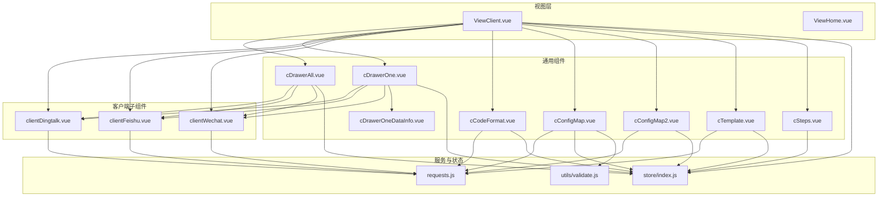
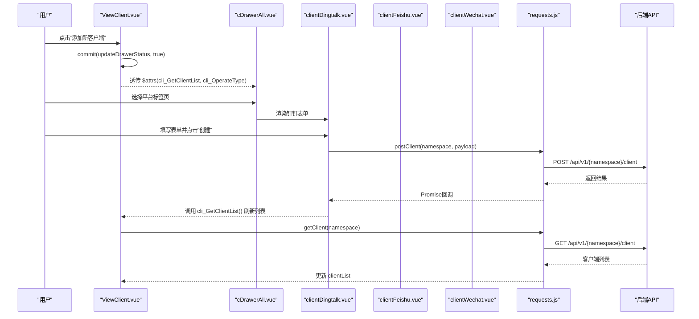
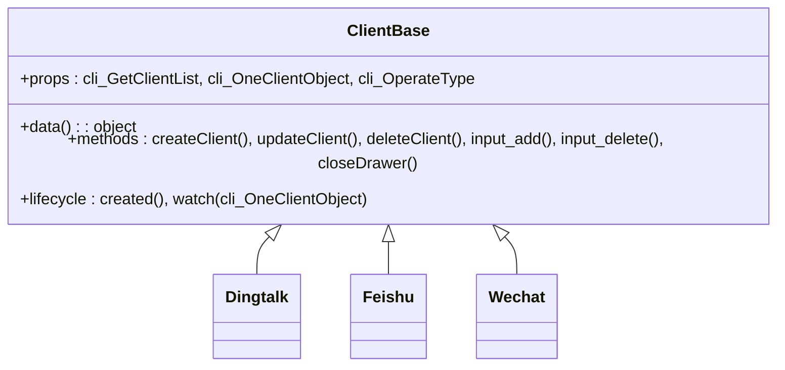
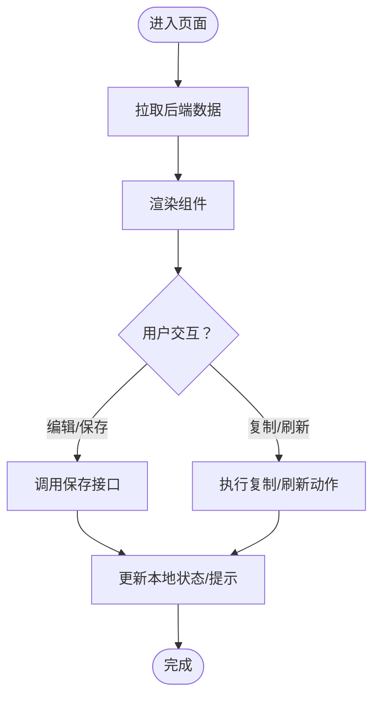
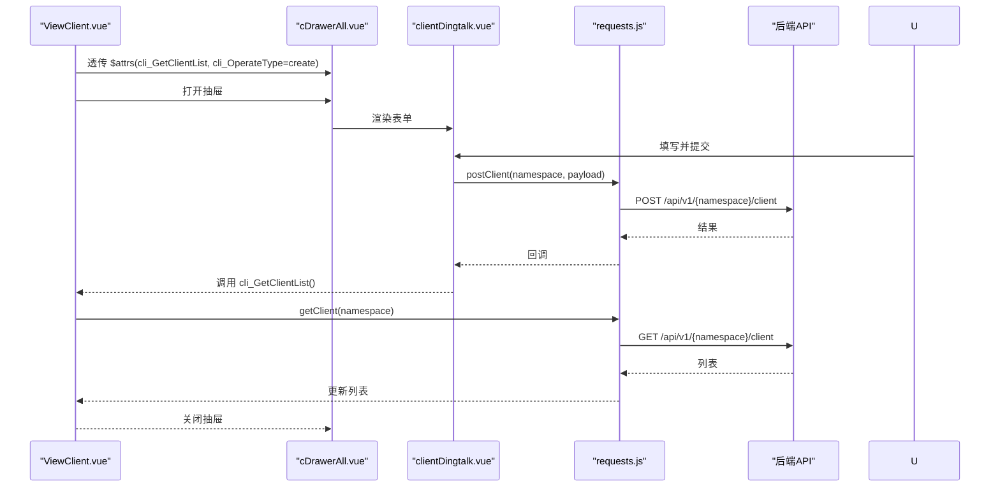
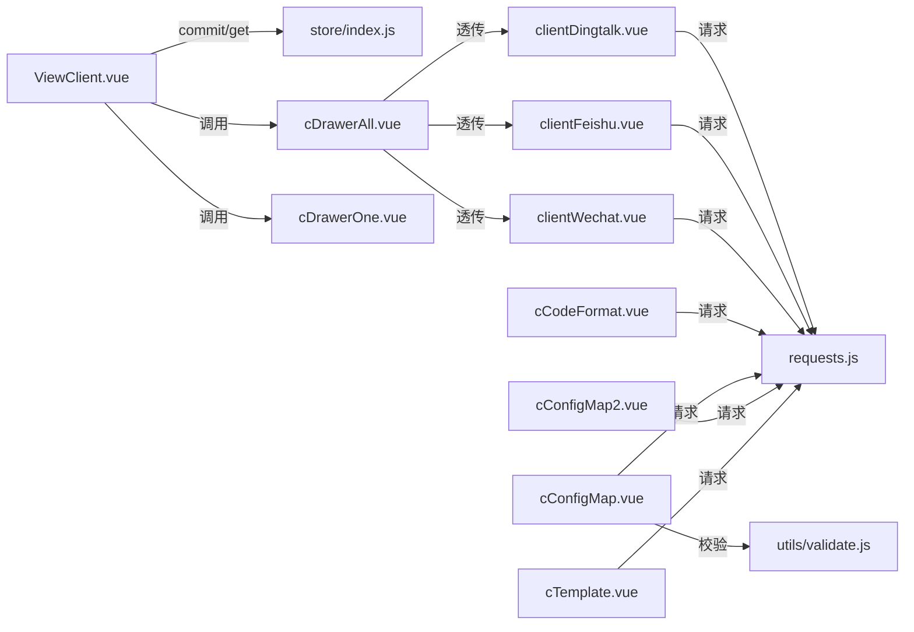

# 组件系统架构

<cite>
**本文引用的文件**
- [clientDingtalk.vue](file://vue/src/components/clients/clientDingtalk.vue)
- [clientFeishu.vue](file://vue/src/components/clients/clientFeishu.vue)
- [clientWechat.vue](file://vue/src/components/clients/clientWechat.vue)
- [cCodeFormat.vue](file://vue/src/components/cCodeFormat.vue)
- [cConfigMap.vue](file://vue/src/components/cConfigMap.vue)
- [cConfigMap2.vue](file://vue/src/components/cConfigMap2.vue)
- [cDrawerAll.vue](file://vue/src/components/cDrawerAll.vue)
- [cDrawerOne.vue](file://vue/src/components/cDrawerOne.vue)
- [cDrawerOneDataInfo.vue](file://vue/src/components/cDrawerOneDataInfo.vue)
- [cSteps.vue](file://vue/src/components/cSteps.vue)
- [cTemplate.vue](file://vue/src/components/cTemplate.vue)
- [requests.js](file://vue/src/service/requests.js)
- [index.js](file://vue/src/store/index.js)
- [validate.js](file://vue/src/utils/validate.js)
- [ViewClient.vue](file://vue/src/views/main/ViewClient.vue)
- [ViewHome.vue](file://vue/src/views/main/ViewHome.vue)
</cite>

## 目录
1. [简介](#简介)
2. [项目结构](#项目结构)
3. [核心组件](#核心组件)
4. [架构总览](#架构总览)
5. [详细组件分析](#详细组件分析)
6. [依赖分析](#依赖分析)
7. [性能考虑](#性能考虑)
8. [故障排查指南](#故障排查指南)
9. [结论](#结论)
10. [附录](#附录)

## 简介
本文件面向开发者，系统性梳理 Vue.js 组件系统的设计原则与组织方式，重点覆盖以下方面：
- 客户端组件（钉钉、飞书、企业微信）的实现细节与差异点
- 通用组件（变量映射、模板、劫持数据、抽屉容器等）的职责边界与复用策略
- Props 接口设计、事件通信机制、插槽使用模式
- 组件间组合关系、生命周期管理与性能优化技巧
- 实战建议：如何创建可复用组件（数据传递、事件处理、样式封装）

## 项目结构
Vue 前端位于 vue/src 目录，采用按功能域分层的组织方式：
- components：通用组件与业务子组件（clients 子目录下为多平台客户端表单）
- views：页面级视图，负责编排与状态协调
- service：HTTP 请求封装
- store：Vuex 全局状态
- utils：校验与工具函数
- plugins：第三方插件（如 Element UI、Axios）

图表来源
- [ViewClient.vue](file://vue/src/views/main/ViewClient.vue)
- [cDrawerAll.vue](file://vue/src/components/cDrawerAll.vue)
- [cDrawerOne.vue](file://vue/src/components/cDrawerOne.vue)
- [cDrawerOneDataInfo.vue](file://vue/src/components/cDrawerOneDataInfo.vue)
- [clientDingtalk.vue](file://vue/src/components/clients/clientDingtalk.vue)
- [clientFeishu.vue](file://vue/src/components/clients/clientFeishu.vue)
- [clientWechat.vue](file://vue/src/components/clients/clientWechat.vue)
- [cCodeFormat.vue](file://vue/src/components/cCodeFormat.vue)
- [cConfigMap.vue](file://vue/src/components/cConfigMap.vue)
- [cConfigMap2.vue](file://vue/src/components/cConfigMap2.vue)
- [cTemplate.vue](file://vue/src/components/cTemplate.vue)
- [cSteps.vue](file://vue/src/components/cSteps.vue)
- [requests.js](file://vue/src/service/requests.js)
- [index.js](file://vue/src/store/index.js)
- [validate.js](file://vue/src/utils/validate.js)

章节来源
- [ViewClient.vue](file://vue/src/views/main/ViewClient.vue)
- [ViewHome.vue](file://vue/src/views/main/ViewHome.vue)

## 核心组件
本节聚焦通用组件与客户端组件的关键接口、行为与复用策略。

- cCodeFormat.vue
  - 职责：展示并格式化“劫持”的过境数据，支持一键复制与手动刷新
  - 关键 Props：无（通过 store 获取命名空间）
  - 关键事件：无（内部通过按钮触发刷新）
  - 插槽：使用 Element Card 的 header 插槽
  - 复用点：独立卡片组件，可嵌入任意页面；数据来源于后端劫持接口
  - 性能注意：频繁刷新需控制频率，避免重复请求

- cConfigMap.vue
  - 职责：维护变量映射表（Key → 原始数据索引），支持增删改查与持久化
  - 关键 Props：无
  - 关键事件：无
  - 插槽：无
  - 复用点：表格 + 表单 + 校验器组合，适合配置型页面
  - 校验：基于 validate.js 的自定义校验规则

- cConfigMap2.vue
  - 职责：展示“扁平化”后的键值对，用于调试与可视化
  - 关键 Props：无
  - 关键事件：无
  - 插槽：无
  - 复用点：只读展示，适合临时调试

- cTemplate.vue
  - 职责：编辑与保存消息渲染模板（支持聚合发送开关）
  - 关键 Props：无
  - 关键事件：无
  - 插槽：无
  - 复用点：卡片 + 文本域 + 开关组合，适合编辑类页面

- cDrawerAll.vue
  - 职责：统一的“添加客户端”抽屉容器，内含多标签页切换各平台客户端表单
  - 关键 Props：通过 $attrs 透传给子组件（cli_GetClientList、cli_OneClientObject、cli_OperateType）
  - 关键事件：无
  - 插槽：无
  - 复用点：集中式入口，减少页面重复代码

- cDrawerOne.vue
  - 职责：按类型渲染单一客户端详情/编辑表单的抽屉
  - 关键 Props：cd_isShow、cd_closeBeforeFunc、cd_clientType
  - 关键事件：无
  - 插槽：无
  - 复用点：按类型分支渲染，避免重复抽屉模板

- cDrawerOneDataInfo.vue
  - 职责：只读展示单个客户端详情
  - 关键 Props：oneClientInfo、visibleStatus、thisClose
  - 关键事件：无
  - 插槽：无
  - 复用点：只读详情弹窗，避免重复表单

- cSteps.vue
  - 职责：引导用户完成“进入数据 → 创建模板变量 → 编写模板 → 设定客户端”的流程
  - 关键 Props：无
  - 关键事件：无
  - 插槽：无
  - 复用点：跨页面复用的步骤条

章节来源
- [cCodeFormat.vue](file://vue/src/components/cCodeFormat.vue)
- [cConfigMap.vue](file://vue/src/components/cConfigMap.vue)
- [cConfigMap2.vue](file://vue/src/components/cConfigMap2.vue)
- [cTemplate.vue](file://vue/src/components/cTemplate.vue)
- [cDrawerAll.vue](file://vue/src/components/cDrawerAll.vue)
- [cDrawerOne.vue](file://vue/src/components/cDrawerOne.vue)
- [cDrawerOneDataInfo.vue](file://vue/src/components/cDrawerOneDataInfo.vue)
- [cSteps.vue](file://vue/src/components/cSteps.vue)

## 架构总览
组件系统围绕“页面视图 + 通用组件 + 客户端子组件 + 服务层 + 状态层”构建，形成清晰的职责分层与数据流。

图表来源
- [ViewClient.vue](file://vue/src/views/main/ViewClient.vue)
- [cDrawerAll.vue](file://vue/src/components/cDrawerAll.vue)
- [clientDingtalk.vue](file://vue/src/components/clients/clientDingtalk.vue)
- [requests.js](file://vue/src/service/requests.js)

## 详细组件分析

### 客户端组件（clientDingtalk、clientFeishu、clientWechat）
- 设计原则
  - 统一的表单结构：均包含基础信息（名称、描述、类型、激活状态）与平台特有字段
  - 操作模式：通过 cli_OperateType 区分“新建”与“查看/编辑”，并在 created 中根据传入对象填充表单
  - 数据校验：各自定义表单规则，确保必填项与格式正确
  - 动态字段：支持动态增删 URL 列表，增强灵活性
- Props 接口设计
  - cli_GetClientList: Function（用于刷新父级列表）
  - cli_OneClientObject: Object（传入单个客户端对象，用于“查看/编辑”）
  - cli_OperateType: String（取值 "show" 或 "create"）
- 事件通信机制
  - 子组件通过调用父组件传入的函数完成列表刷新与抽屉状态控制
  - 抽屉关闭时，统一通过 store 更新 DrawerStatus
- 插槽使用模式
  - 未使用具名插槽，采用默认插槽与 Element UI 组件组合
- 生命周期管理
  - created：根据 cli_OperateType 决定是否填充表单
  - watch：监听 cli_OneClientObject 的深变更，保证外部数据更新时同步到表单
- 性能优化
  - 避免不必要的重渲染：仅在必要时更新 client 对象
  - 动态增删列表时，尽量减少无关字段的响应式追踪

图表来源
- [clientDingtalk.vue](file://vue/src/components/clients/clientDingtalk.vue)
- [clientFeishu.vue](file://vue/src/components/clients/clientFeishu.vue)
- [clientWechat.vue](file://vue/src/components/clients/clientWechat.vue)

章节来源
- [clientDingtalk.vue](file://vue/src/components/clients/clientDingtalk.vue)
- [clientFeishu.vue](file://vue/src/components/clients/clientFeishu.vue)
- [clientWechat.vue](file://vue/src/components/clients/clientWechat.vue)

### 通用组件（cCodeFormat、cConfigMap、cConfigMap2、cTemplate、cSteps）
- cCodeFormat
  - 通过 store 获取命名空间，调用 queryJson 获取最新劫持数据，格式化后展示
  - 支持一键复制，提升调试效率
- cConfigMap
  - 维护变量映射表，提供新增、删除、保存能力
  - 使用 validate.js 校验 Key/Value 规则，确保输入合法
- cConfigMap2
  - 展示扁平化后的键值对，便于直观查看
- cTemplate
  - 编辑模板内容与聚合发送开关，支持保存与拉取
- cSteps
  - 跨页面复用的步骤条，点击可导航至对应页面

图表来源
- [cCodeFormat.vue](file://vue/src/components/cCodeFormat.vue)
- [cConfigMap.vue](file://vue/src/components/cConfigMap.vue)
- [cConfigMap2.vue](file://vue/src/components/cConfigMap2.vue)
- [cTemplate.vue](file://vue/src/components/cTemplate.vue)
- [cSteps.vue](file://vue/src/components/cSteps.vue)

章节来源
- [cCodeFormat.vue](file://vue/src/components/cCodeFormat.vue)
- [cConfigMap.vue](file://vue/src/components/cConfigMap.vue)
- [cConfigMap2.vue](file://vue/src/components/cConfigMap2.vue)
- [cTemplate.vue](file://vue/src/components/cTemplate.vue)
- [cSteps.vue](file://vue/src/components/cSteps.vue)

### 抽屉容器组件（cDrawerAll、cDrawerOne、cDrawerOneDataInfo）
- cDrawerAll
  - 作为“添加客户端”的统一入口，内部通过标签页切换不同平台表单
  - 通过 $attrs 将公共属性透传给子组件，减少重复绑定
- cDrawerOne
  - 根据 cd_clientType 渲染对应子组件，支持“查看/编辑”两种模式
  - 通过 cd_closeBeforeFunc 回写父级状态，保证状态一致性
- cDrawerOneDataInfo
  - 以只读形式展示客户端详情，避免误操作

图表来源
- [ViewClient.vue](file://vue/src/views/main/ViewClient.vue)
- [cDrawerAll.vue](file://vue/src/components/cDrawerAll.vue)
- [clientDingtalk.vue](file://vue/src/components/clients/clientDingtalk.vue)
- [requests.js](file://vue/src/service/requests.js)

章节来源
- [cDrawerAll.vue](file://vue/src/components/cDrawerAll.vue)
- [cDrawerOne.vue](file://vue/src/components/cDrawerOne.vue)
- [cDrawerOneDataInfo.vue](file://vue/src/components/cDrawerOneDataInfo.vue)

## 依赖分析
- 组件到服务层
  - 客户端组件与通用组件均通过 requests.js 发起 HTTP 请求，统一管理 API 路径与命名空间
- 组件到状态层
  - 通过 store 获取命名空间、步骤状态、抽屉状态等，实现跨组件共享
- 组件到工具层
  - cConfigMap 使用 validate.js 的校验规则，保证输入合法性
- 页面到组件
  - ViewClient 作为编排者，负责状态管理、列表刷新与抽屉控制

图表来源
- [ViewClient.vue](file://vue/src/views/main/ViewClient.vue)
- [cDrawerAll.vue](file://vue/src/components/cDrawerAll.vue)
- [cDrawerOne.vue](file://vue/src/components/cDrawerOne.vue)
- [clientDingtalk.vue](file://vue/src/components/clients/clientDingtalk.vue)
- [clientFeishu.vue](file://vue/src/components/clients/clientFeishu.vue)
- [clientWechat.vue](file://vue/src/components/clients/clientWechat.vue)
- [cCodeFormat.vue](file://vue/src/components/cCodeFormat.vue)
- [cConfigMap.vue](file://vue/src/components/cConfigMap.vue)
- [cConfigMap2.vue](file://vue/src/components/cConfigMap2.vue)
- [cTemplate.vue](file://vue/src/components/cTemplate.vue)
- [requests.js](file://vue/src/service/requests.js)
- [index.js](file://vue/src/store/index.js)
- [validate.js](file://vue/src/utils/validate.js)

章节来源
- [requests.js](file://vue/src/service/requests.js)
- [index.js](file://vue/src/store/index.js)
- [validate.js](file://vue/src/utils/validate.js)

## 性能考虑
- 避免过度响应式
  - 在客户端组件中，仅对必要的字段建立响应式，减少不必要的 watcher 与 diff
- 合理使用计算属性
  - cCodeFormat 与 cConfigMap 使用计算属性获取命名空间，避免重复读取
- 控制网络请求频率
  - cCodeFormat 与 cConfigMap2 的刷新应限制频率，避免频繁拉取导致抖动
- 列表渲染优化
  - 使用 v-for 的稳定 key，避免整表重排
- 抽屉销毁策略
  - cDrawerAll 设置 destroy-on-close，减少内存占用

## 故障排查指南
- 表单提交失败
  - 检查 cli_OperateType 是否正确传入（"show"/"create"）
  - 确认命名空间是否正确（store.getters.getNamespace）
  - 查看请求返回码与错误日志
- 抽屉状态异常
  - 确保通过 store.commit("updateDrawerStatus", false/true) 控制
  - 在关闭前回调中同步父级状态
- 变量映射校验失败
  - 检查 validate.js 的规则是否满足（Key 不能以数字开头、仅允许字母数字等）
- 数据为空或未更新
  - 确认后端劫持数据是否正常，检查 queryJson/queryFlattening 的返回
  - 确认命名空间切换后是否重新拉取数据

章节来源
- [clientDingtalk.vue](file://vue/src/components/clients/clientDingtalk.vue)
- [clientFeishu.vue](file://vue/src/components/clients/clientFeishu.vue)
- [clientWechat.vue](file://vue/src/components/clients/clientWechat.vue)
- [cConfigMap.vue](file://vue/src/components/cConfigMap.vue)
- [cCodeFormat.vue](file://vue/src/components/cCodeFormat.vue)
- [cConfigMap2.vue](file://vue/src/components/cConfigMap2.vue)
- [index.js](file://vue/src/store/index.js)

## 结论
该组件系统通过“页面视图 + 通用组件 + 客户端子组件 + 服务层 + 状态层”的分层设计，实现了高内聚、低耦合的可维护架构。客户端组件遵循统一的 Props 接口与生命周期策略，配合抽屉容器实现高复用；通用组件承担配置、展示与调试职责，形成完整的开发工作流。建议在后续迭代中进一步完善事件驱动与错误边界处理，持续优化网络请求与渲染性能。

## 附录
- 最佳实践清单
  - 统一 Props 命名与类型约束，明确父子通信契约
  - 使用 $attrs/$listeners 透传属性与事件，减少重复绑定
  - 将 UI 与业务逻辑分离，保持组件的纯净与可测试性
  - 合理划分职责，避免“上帝组件”，优先拆分子组件
  - 为关键流程增加 loading 与错误提示，提升用户体验