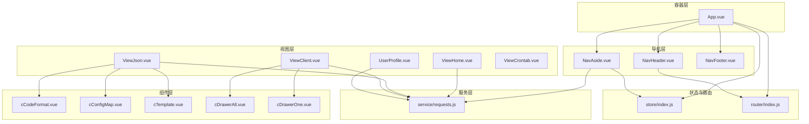
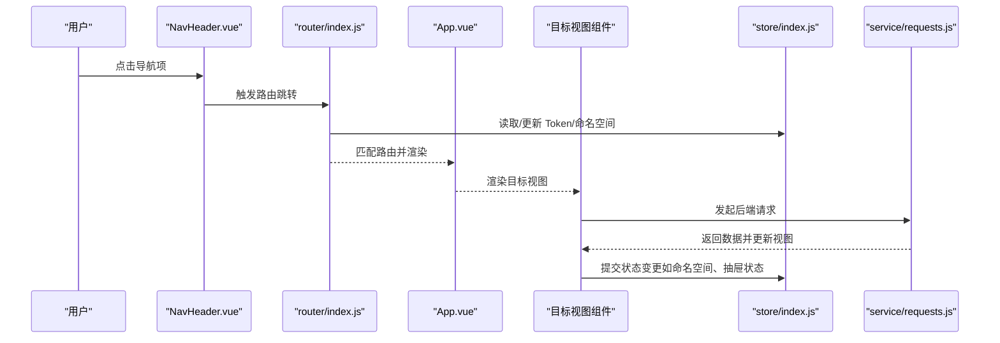
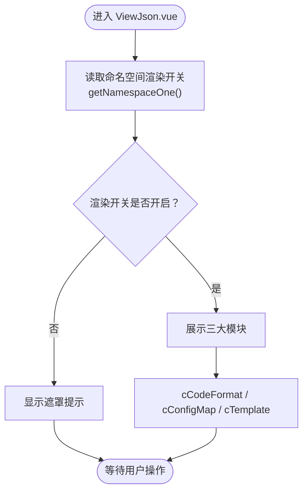
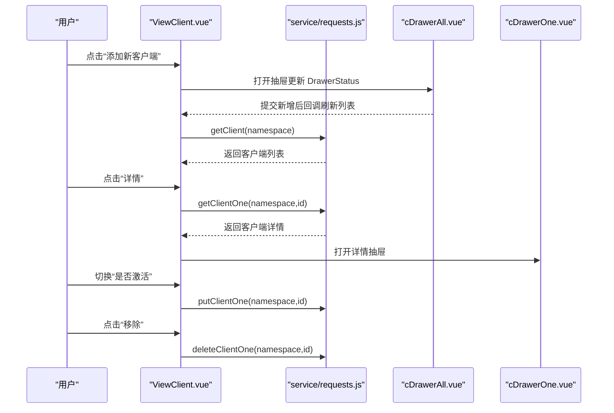
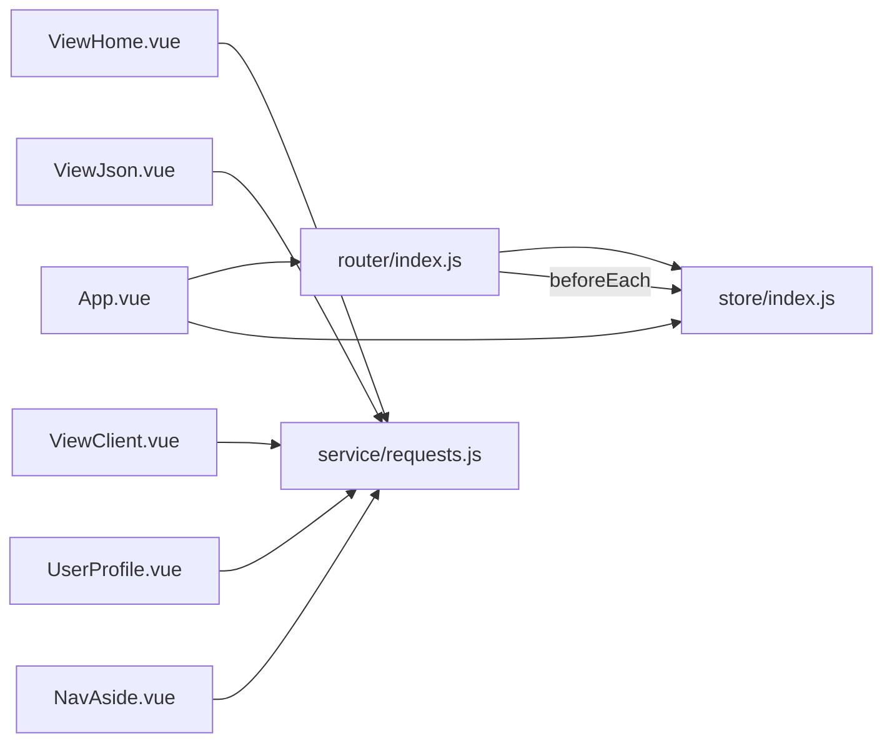

# 视图页面结构

<cite>
**本文引用的文件**
- [App.vue](file://vue/src/App.vue)
- [router/index.js](file://vue/src/router/index.js)
- [store/index.js](file://vue/src/store/index.js)
- [views/main/ViewHome.vue](file://vue/src/views/main/ViewHome.vue)
- [views/main/ViewJson.vue](file://vue/src/views/main/ViewJson.vue)
- [views/main/ViewClient.vue](file://vue/src/views/main/ViewClient.vue)
- [views/cron/ViewCrontab.vue](file://vue/src/views/cron/ViewCrontab.vue)
- [views/navs/NavHeader.vue](file://vue/src/views/navs/NavHeader.vue)
- [views/navs/NavAside.vue](file://vue/src/views/navs/NavAside.vue)
- [views/navs/NavFooter.vue](file://vue/src/views/navs/NavFooter.vue)
- [views/users/UserProfile.vue](file://vue/src/views/users/UserProfile.vue)
- [components/cDrawerAll.vue](file://vue/src/components/cDrawerAll.vue)
- [components/cDrawerOne.vue](file://vue/src/components/cDrawerOne.vue)
- [components/cCodeFormat.vue](file://vue/src/components/cCodeFormat.vue)
- [components/cConfigMap.vue](file://vue/src/components/cConfigMap.vue)
- [components/cTemplate.vue](file://vue/src/components/cTemplate.vue)
- [service/requests.js](file://vue/src/service/requests.js)
</cite>

## 目录
1. [简介](#简介)
2. [项目结构](#项目结构)
3. [核心组件](#核心组件)
4. [架构总览](#架构总览)
5. [详细组件分析](#详细组件分析)
6. [依赖分析](#依赖分析)
7. [性能考虑](#性能考虑)
8. [故障排查指南](#故障排查指南)
9. [结论](#结论)
10. [附录](#附录)

## 简介
本文件面向开发者，系统性梳理该 Vue.js 单页应用的视图页面结构与导航体系，重点覆盖以下方面：
- 主页面：ViewHome、ViewJson、ViewClient 的职责与数据流
- 导航组件：NavHeader、NavAside、NavFooter 的协作与状态管理
- 用户管理：UserProfile 的密码修改流程
- 定时任务：ViewCrontab 的占位与扩展建议
- 页面间导航关系、布局设计、响应式适配与用户体验优化
- 页面开发最佳实践与复杂页面组件的状态管理策略

## 项目结构
该应用采用“容器 + 多视图 + 导航 + 组件库”的分层组织方式：
- 容器层：App.vue 负责全局布局与路由视图容器
- 导航层：NavHeader、NavAside、NavFooter 提供顶部导航、侧边通道管理、底部版权信息
- 视图层：主页面（ViewHome、ViewJson、ViewClient）、用户页面（UserProfile）、定时任务（ViewCrontab）
- 组件层：通用业务组件（cCodeFormat、cConfigMap、cTemplate、cDrawerAll、cDrawerOne）复用在视图中
- 状态与路由：Vuex Store 管理命名空间、Token、抽屉状态等；Vue Router 管理页面路由与鉴权守卫

图表来源
- [App.vue:1-132](file://vue/src/App.vue#L1-L132)
- [router/index.js:1-139](file://vue/src/router/index.js#L1-L139)
- [store/index.js:1-49](file://vue/src/store/index.js#L1-L49)
- [views/main/ViewHome.vue:1-47](file://vue/src/views/main/ViewHome.vue#L1-L47)
- [views/main/ViewJson.vue:1-140](file://vue/src/views/main/ViewJson.vue#L1-L140)
- [views/main/ViewClient.vue:1-266](file://vue/src/views/main/ViewClient.vue#L1-L266)
- [views/users/UserProfile.vue:1-140](file://vue/src/views/users/UserProfile.vue#L1-L140)
- [views/cron/ViewCrontab.vue:1-14](file://vue/src/views/cron/ViewCrontab.vue#L1-L14)
- [components/cCodeFormat.vue:1-136](file://vue/src/components/cCodeFormat.vue#L1-L136)
- [components/cConfigMap.vue:1-245](file://vue/src/components/cConfigMap.vue#L1-L245)
- [components/cTemplate.vue:1-141](file://vue/src/components/cTemplate.vue#L1-L141)
- [components/cDrawerAll.vue:1-64](file://vue/src/components/cDrawerAll.vue#L1-L64)
- [components/cDrawerOne.vue:1-41](file://vue/src/components/cDrawerOne.vue#L1-L41)
- [service/requests.js:1-42](file://vue/src/service/requests.js#L1-L42)

章节来源
- [App.vue:1-132](file://vue/src/App.vue#L1-L132)
- [router/index.js:1-139](file://vue/src/router/index.js#L1-L139)
- [store/index.js:1-49](file://vue/src/store/index.js#L1-L49)

## 核心组件
- 容器与布局：App.vue 提供全局 el-container 结构，按需显示侧边栏与底部，提供路由视图容器与全局状态持久化方案
- 导航组件：
  - NavHeader：顶部横向导航，集成 Logo、通道名展示、文档链接、用户下拉菜单与登出
  - NavAside：左侧通道管理菜单，支持新增/删除命名空间、切换当前命名空间并触发视图重载
  - NavFooter：底部版权与版本信息
- 视图组件：
  - ViewHome：首页入口，提供模拟推送按钮与域名配置区域
  - ViewJson：数据渲染工作区，包含“劫持数据”、“变量映射”、“模板渲染”三大模块
  - ViewClient：客户端管理，支持抽屉式新增、详情查看、激活状态切换、删除
  - UserProfile：用户资料与密码修改
  - ViewCrontab：定时任务占位页（当前为空）

章节来源
- [App.vue:1-132](file://vue/src/App.vue#L1-L132)
- [views/navs/NavHeader.vue:1-195](file://vue/src/views/navs/NavHeader.vue#L1-L195)
- [views/navs/NavAside.vue:1-265](file://vue/src/views/navs/NavAside.vue#L1-L265)
- [views/navs/NavFooter.vue:1-54](file://vue/src/views/navs/NavFooter.vue#L1-L54)
- [views/main/ViewHome.vue:1-47](file://vue/src/views/main/ViewHome.vue#L1-L47)
- [views/main/ViewJson.vue:1-140](file://vue/src/views/main/ViewJson.vue#L1-L140)
- [views/main/ViewClient.vue:1-266](file://vue/src/views/main/ViewClient.vue#L1-L266)
- [views/users/UserProfile.vue:1-140](file://vue/src/views/users/UserProfile.vue#L1-L140)
- [views/cron/ViewCrontab.vue:1-14](file://vue/src/views/cron/ViewCrontab.vue#L1-L14)

## 架构总览
应用采用“容器 + 导航 + 视图 + 组件 + 服务”的分层架构，数据流主要通过 Vuex Store 与 Axios 封装的请求模块协同完成。

图表来源
- [router/index.js:109-136](file://vue/src/router/index.js#L109-L136)
- [App.vue:54-89](file://vue/src/App.vue#L54-L89)
- [store/index.js:6-48](file://vue/src/store/index.js#L6-L48)
- [service/requests.js:1-42](file://vue/src/service/requests.js#L1-L42)

## 详细组件分析

### 容器与导航层

#### App.vue：全局布局与状态持久化
- 责任：提供 el-container 布局，按路由条件显示侧边栏与底部；提供 reload 注入以支持视图强制刷新；在 beforeunload 时持久化 Vuex 状态到 sessionStorage
- 关键点：
  - provide/inject 的 reload 机制用于跨层级刷新视图
  - watch 监听路由，控制侧边栏与底部显示
  - sessionStorage 与 store 替换状态实现刷新后状态恢复

章节来源
- [App.vue:1-132](file://vue/src/App.vue#L1-L132)

#### NavHeader.vue：顶部导航与用户态
- 责任：顶部横向菜单，包含 Logo、当前通道名、功能入口（消息入口、数据渲染、接收客户端）、文档链接、用户下拉菜单
- 关键点：
  - 通过 store.getters 获取当前命名空间与 Token
  - 登出流程：调用 logout 接口、清理 Token 并跳转登录页
  - 下拉菜单根据 Token 显示“个人信息”或“用户登录”

章节来源
- [views/navs/NavHeader.vue:1-195](file://vue/src/views/navs/NavHeader.vue#L1-L195)
- [service/requests.js:39-41](file://vue/src/service/requests.js#L39-L41)

#### NavAside.vue：左侧通道管理与命名空间切换
- 责任：列出所有命名空间，支持新增/删除命名空间；点击切换当前命名空间并刷新视图
- 关键点：
  - 通过请求获取命名空间列表并缓存当前命名空间信息
  - 使用 dialog 表格展示命名空间，表单校验规则由工具模块提供
  - 切换命名空间后调用 reload 注入方法刷新当前视图

章节来源
- [views/navs/NavAside.vue:1-265](file://vue/src/views/navs/NavAside.vue#L1-L265)
- [service/requests.js:30-35](file://vue/src/service/requests.js#L30-L35)

#### NavFooter.vue：底部版权与版本
- 责任：展示版权、开源协议、仓库链接与版本号
- 关键点：版本号来自环境变量

章节来源
- [views/navs/NavFooter.vue:1-54](file://vue/src/views/navs/NavFooter.vue#L1-L54)

### 主页面层

#### ViewHome.vue：首页与模拟推送
- 责任：首页入口，提供模拟推送按钮，点击后向后端发送示例数据
- 关键点：
  - 读取本地模板 JSON 并调用 postDemoData 推送
  - 切换步骤条到首页

章节来源
- [views/main/ViewHome.vue:1-47](file://vue/src/views/main/ViewHome.vue#L1-L47)
- [service/requests.js:4](file://vue/src/service/requests.js#L4)

#### ViewJson.vue：数据渲染工作区
- 责任：整合“劫持数据”、“变量映射”、“模板渲染”三大功能，支持通道渲染开关与遮罩提示
- 关键点：
  - 通过 getNamespaceOne 查询当前通道渲染开关，putNamespaceOne 更新
  - 使用 v-loading 与遮罩提示渲染开关状态
  - 通过 cCodeFormat、cConfigMap、cTemplate 三个组件分别承载功能

图表来源
- [views/main/ViewJson.vue:84-105](file://vue/src/views/main/ViewJson.vue#L84-L105)
- [components/cCodeFormat.vue:64-84](file://vue/src/components/cCodeFormat.vue#L64-L84)
- [components/cConfigMap.vue:157-181](file://vue/src/components/cConfigMap.vue#L157-L181)
- [components/cTemplate.vue:93-119](file://vue/src/components/cTemplate.vue#L93-L119)

章节来源
- [views/main/ViewJson.vue:1-140](file://vue/src/views/main/ViewJson.vue#L1-L140)
- [components/cCodeFormat.vue:1-136](file://vue/src/components/cCodeFormat.vue#L1-L136)
- [components/cConfigMap.vue:1-245](file://vue/src/components/cConfigMap.vue#L1-L245)
- [components/cTemplate.vue:1-141](file://vue/src/components/cTemplate.vue#L1-L141)

#### ViewClient.vue：客户端管理
- 责任：展示与管理客户端列表，支持抽屉式新增、详情查看、激活状态切换、删除
- 关键点：
  - 通过 getClient 拉取列表，getClientOne 获取详情，putClientOne 更新激活状态，deleteClientOne 删除
  - 抽屉组件 cDrawerAll 与 cDrawerOne 分别负责“新增”和“详情”
  - demo 数据字段避免误删示例数据

图表来源
- [views/main/ViewClient.vue:161-226](file://vue/src/views/main/ViewClient.vue#L161-L226)
- [components/cDrawerAll.vue:1-64](file://vue/src/components/cDrawerAll.vue#L1-L64)
- [components/cDrawerOne.vue:1-41](file://vue/src/components/cDrawerOne.vue#L1-L41)
- [service/requests.js:21-27](file://vue/src/service/requests.js#L21-L27)

章节来源
- [views/main/ViewClient.vue:1-266](file://vue/src/views/main/ViewClient.vue#L1-L266)
- [components/cDrawerAll.vue:1-64](file://vue/src/components/cDrawerAll.vue#L1-L64)
- [components/cDrawerOne.vue:1-41](file://vue/src/components/cDrawerOne.vue#L1-L41)

#### UserProfile.vue：用户资料与密码修改
- 责任：提供旧密码、新密码、确认新密码的表单，提交后调用更新密码接口并清空 Token 跳转登录
- 关键点：
  - 自定义校验规则：密码非空、两次输入一致
  - 成功后清理 Token 并提示重新登录

章节来源
- [views/users/UserProfile.vue:1-140](file://vue/src/views/users/UserProfile.vue#L1-L140)
- [service/requests.js:41](file://vue/src/service/requests.js#L41)

#### ViewCrontab.vue：定时任务占位页
- 责任：当前为空页面，预留定时任务功能扩展位置
- 建议：结合 NavHeader 的路由入口，后续可接入 crontab 服务与可视化编辑器

章节来源
- [views/cron/ViewCrontab.vue:1-14](file://vue/src/views/cron/ViewCrontab.vue#L1-L14)

### 通用组件层

#### cCodeFormat.vue：劫持数据展示
- 责任：从后端获取最新过境数据并格式化展示，支持一键复制
- 关键点：queryJson 获取数据，格式化后展示

章节来源
- [components/cCodeFormat.vue:1-136](file://vue/src/components/cCodeFormat.vue#L1-L136)
- [service/requests.js:7-8](file://vue/src/service/requests.js#L7-L8)

#### cConfigMap.vue：变量映射
- 责任：维护 Key-Value 映射，支持新增、删除、保存与拉取
- 关键点：提交时将前端结构转换为后端期望的数据结构，统一保存

章节来源
- [components/cConfigMap.vue:1-245](file://vue/src/components/cConfigMap.vue#L1-L245)
- [service/requests.js:11-14](file://vue/src/service/requests.js#L11-L14)

#### cTemplate.vue：消息模板
- 责任：维护渲染模板内容与聚合发送开关，支持保存与拉取
- 关键点：默认模板示例，支持打开外部教程链接

章节来源
- [components/cTemplate.vue:1-141](file://vue/src/components/cTemplate.vue#L1-L141)
- [service/requests.js:16-18](file://vue/src/service/requests.js#L16-L18)

#### cDrawerAll.vue 与 cDrawerOne.vue：抽屉式交互
- 责任：cDrawerAll 提供多种客户端类型的新增抽屉；cDrawerOne 根据客户端类型动态渲染对应组件
- 关键点：基于 store 的 DrawerStatus 控制显示；before-close 时同步关闭状态

章节来源
- [components/cDrawerAll.vue:1-64](file://vue/src/components/cDrawerAll.vue#L1-L64)
- [components/cDrawerOne.vue:1-41](file://vue/src/components/cDrawerOne.vue#L1-L41)

## 依赖分析
- 路由与鉴权：router/index.js 在 beforeEach 中读取 store 中的 Token，未认证且非登录页时重定向至登录
- 状态管理：store/index.js 统一管理命名空间、Token、抽屉状态、命名空间信息等
- 服务封装：service/requests.js 对后端接口进行统一封装，视图组件仅关注业务逻辑

图表来源
- [router/index.js:109-136](file://vue/src/router/index.js#L109-L136)
- [store/index.js:6-48](file://vue/src/store/index.js#L6-L48)
- [service/requests.js:1-42](file://vue/src/service/requests.js#L1-L42)

章节来源
- [router/index.js:1-139](file://vue/src/router/index.js#L1-L139)
- [store/index.js:1-49](file://vue/src/store/index.js#L1-L49)
- [service/requests.js:1-42](file://vue/src/service/requests.js#L1-L42)

## 性能考虑
- 路由懒加载：路由采用动态导入，减少首屏体积
- 组件拆分：将复杂页面拆分为多个小组件，提升可维护性与可测试性
- 状态持久化：App.vue 在刷新时将 store 状态持久化到 sessionStorage，避免重复初始化
- 请求封装：统一的请求模块减少重复代码，便于集中处理错误与拦截器

## 故障排查指南
- 登录态异常
  - 现象：进入受保护页面被重定向至登录页
  - 排查：检查 sessionStorage 中 store 是否存在，确认 router.beforeEach 是否正确读取 Token
- 命名空间切换无效
  - 现象：切换通道后页面未刷新
  - 排查：确认 NavAside.vue 是否调用 reload 注入方法并刷新视图
- 客户端删除误删示例数据
  - 现象：删除示例数据导致后端误删
  - 排查：ViewClient.vue 中对 demo_data 字段进行判断，避免向后端发送删除请求
- 抽屉状态不同步
  - 现象：抽屉关闭后状态未回写
  - 排查：cDrawerAll.vue 的 before-close 中应同步 commit DrawerStatus

章节来源
- [router/index.js:109-136](file://vue/src/router/index.js#L109-L136)
- [views/navs/NavAside.vue:183-192](file://vue/src/views/navs/NavAside.vue#L183-L192)
- [views/main/ViewClient.vue:172-195](file://vue/src/views/main/ViewClient.vue#L172-L195)
- [components/cDrawerAll.vue:49-58](file://vue/src/components/cDrawerAll.vue#L49-L58)

## 结论
该应用通过清晰的容器-导航-视图-组件分层，配合 Vuex 与路由守卫，实现了稳定的页面组织与良好的用户体验。主页面与导航组件职责明确，数据流通过统一的服务封装与状态管理串联，具备良好的可扩展性。建议后续在定时任务、权限控制、国际化等方面持续演进。

## 附录

### 页面开发最佳实践
- 页面布局设计
  - 使用 App.vue 的 el-container 作为全局骨架，按需显示侧边栏与底部
  - 通过 NavHeader 与 NavAside 统一导航入口，减少重复逻辑
- 响应式适配
  - 使用 Element UI 的栅格系统与卡片组件，确保在不同屏幕尺寸下保持良好可读性
- 用户体验优化
  - 使用 v-loading 与消息提示反馈用户操作结果
  - 对关键操作（如删除）增加二次确认
- 状态管理
  - 将共享状态收敛到 store，避免跨层级传递过多 props
  - 对复杂页面（如 ViewJson）拆分为多个小组件，降低耦合度

### 复杂页面组件与状态管理示例思路
- 多模块联动页面（如 ViewJson）
  - 将“劫持数据”“变量映射”“模板渲染”拆分为独立组件，通过 props 与事件通信
  - 使用 computed 与 watch 同步 store 中的命名空间信息与渲染开关
- 抽屉式交互（如 ViewClient）
  - 通过 store 的 DrawerStatus 控制抽屉显示，before-close 同步关闭状态
  - 子组件通过 $emit 或回调函数通知父组件刷新列表