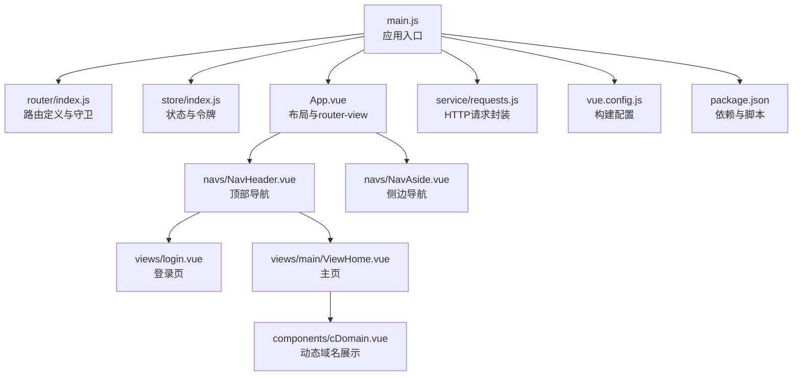
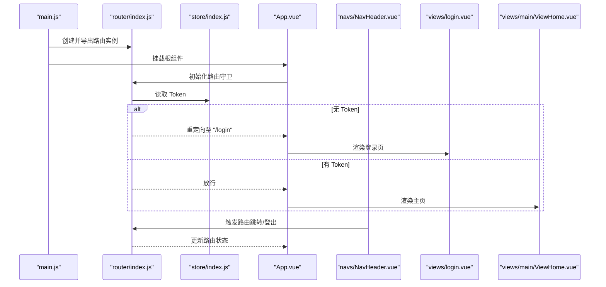
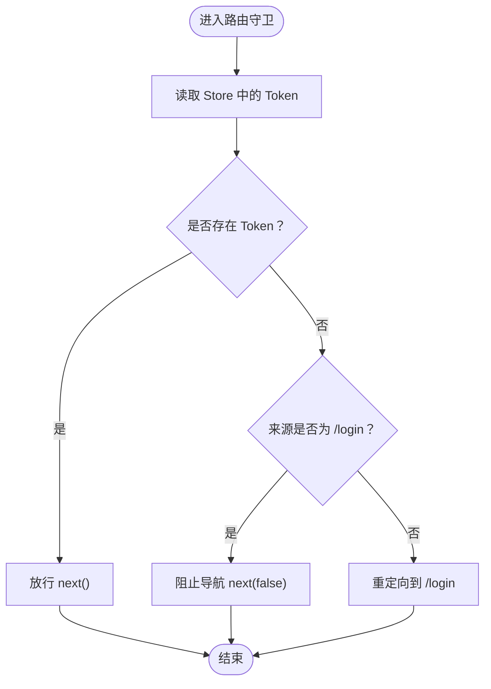
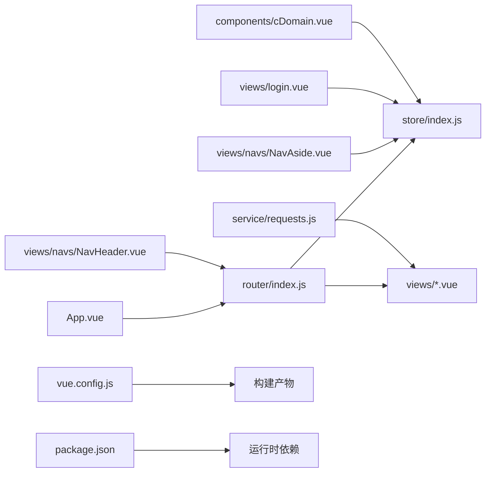

# 路由配置管理

<cite>
**本文引用的文件**
- [vue/src/router/index.js](file://vue/src/router/index.js)
- [vue/src/main.js](file://vue/src/main.js)
- [vue/src/store/index.js](file://vue/src/store/index.js)
- [vue/src/App.vue](file://vue/src/App.vue)
- [vue/src/views/login.vue](file://vue/src/views/login.vue)
- [vue/src/views/main/ViewHome.vue](file://vue/src/views/main/ViewHome.vue)
- [vue/src/components/cDomain.vue](file://vue/src/components/cDomain.vue)
- [vue/src/views/navs/NavHeader.vue](file://vue/src/views/navs/NavHeader.vue)
- [vue/src/views/navs/NavAside.vue](file://vue/src/views/navs/NavAside.vue)
- [vue/src/service/requests.js](file://vue/src/service/requests.js)
- [vue/vue.config.js](file://vue/vue.config.js)
- [vue/package.json](file://vue/package.json)
</cite>

## 目录
1. [简介](#简介)
2. [项目结构](#项目结构)
3. [核心组件](#核心组件)
4. [架构总览](#架构总览)
5. [详细组件分析](#详细组件分析)
6. [依赖分析](#依赖分析)
7. [性能考虑](#性能考虑)
8. [故障排查指南](#故障排查指南)
9. [结论](#结论)
10. [附录](#附录)

## 简介
本文件面向开发者，系统性梳理前端路由配置与导航守卫机制，覆盖路由表定义、嵌套路由、动态路由、参数与查询处理、路由元信息、守卫（beforeEnter、beforeLeave）实现与应用、最佳实践（懒加载、权限控制、错误处理）以及复杂路由逻辑与页面跳转控制的示例路径。本文以仓库中实际存在的 Vue Router 配置与导航组件为依据，帮助读者快速理解并扩展现有路由体系。

## 项目结构
前端路由位于 Vue 应用的路由模块中，配合 Vuex 状态管理、全局布局与导航组件共同构成完整的导航体验。关键文件与职责如下：
- 路由定义与守卫：vue/src/router/index.js
- 应用入口与挂载：vue/src/main.js
- 全局状态与令牌：vue/src/store/index.js
- 布局与导航：vue/src/App.vue、vue/src/views/navs/NavHeader.vue、vue/src/views/navs/NavAside.vue
- 登录与主页视图：vue/src/views/login.vue、vue/src/views/main/ViewHome.vue
- 动态域名展示组件：vue/src/components/cDomain.vue
- 请求封装：vue/src/service/requests.js
- 构建配置：vue/vue.config.js
- 依赖与版本：vue/package.json

图表来源
- [vue/src/main.js:1-32](file://vue/src/main.js#L1-L32)
- [vue/src/router/index.js:1-139](file://vue/src/router/index.js#L1-L139)
- [vue/src/store/index.js:1-49](file://vue/src/store/index.js#L1-L49)
- [vue/src/App.vue:1-132](file://vue/src/App.vue#L1-L132)
- [vue/src/views/navs/NavHeader.vue:1-195](file://vue/src/views/navs/NavHeader.vue#L1-L195)
- [vue/src/views/navs/NavAside.vue:1-265](file://vue/src/views/navs/NavAside.vue#L1-L265)
- [vue/src/views/login.vue:1-86](file://vue/src/views/login.vue#L1-L86)
- [vue/src/views/main/ViewHome.vue:1-47](file://vue/src/views/main/ViewHome.vue#L1-L47)
- [vue/src/components/cDomain.vue:1-92](file://vue/src/components/cDomain.vue#L1-L92)
- [vue/src/service/requests.js:1-42](file://vue/src/service/requests.js#L1-L42)
- [vue/vue.config.js:1-14](file://vue/vue.config.js#L1-L14)
- [vue/package.json:1-54](file://vue/package.json#L1-L54)

章节来源
- [vue/src/main.js:1-32](file://vue/src/main.js#L1-L32)
- [vue/src/router/index.js:1-139](file://vue/src/router/index.js#L1-L139)
- [vue/src/store/index.js:1-49](file://vue/src/store/index.js#L1-L49)
- [vue/src/App.vue:1-132](file://vue/src/App.vue#L1-L132)
- [vue/vue.config.js:1-14](file://vue/vue.config.js#L1-L14)

## 核心组件
- 路由表与守卫
  - 路由表定义于路由模块，采用按需加载（懒加载）的方式引入视图组件，减少首屏体积。
  - 使用全局前置守卫进行权限校验，基于 Vuex 中的 Token 判断是否放行，未认证且非登录页则重定向至登录页。
  - 参考路径：[vue/src/router/index.js:8-101](file://vue/src/router/index.js#L8-L101)、[vue/src/router/index.js:109-136](file://vue/src/router/index.js#L109-L136)

- 状态与令牌
  - Vuex Store 维护 Token、用户 ID、命名空间等全局状态，提供 getters 供组件与守卫读取。
  - 参考路径：[vue/src/store/index.js:6-48](file://vue/src/store/index.js#L6-L48)

- 应用布局与视图
  - App.vue 包裹全局容器与导航，使用 router-view 渲染当前路由组件，并提供视图重载能力。
  - 参考路径：[vue/src/App.vue:1-132](file://vue/src/App.vue#L1-L132)

- 导航组件
  - NavHeader.vue 作为顶部导航，内置登录/退出、路由跳转与文档链接。
  - NavAside.vue 作为侧边导航，负责命名空间切换与视图重载。
  - 参考路径：[vue/src/views/navs/NavHeader.vue:1-195](file://vue/src/views/navs/NavHeader.vue#L1-L195)、[vue/src/views/navs/NavAside.vue:1-265](file://vue/src/views/navs/NavAside.vue#L1-L265)

- 登录与主页
  - login.vue 处理登录流程，成功后写入 Token 并跳转主页。
  - ViewHome.vue 展示主页内容，包含演示推送与命名空间展示。
  - 参考路径：[vue/src/views/login.vue:1-86](file://vue/src/views/login.vue#L1-L86)、[vue/src/views/main/ViewHome.vue:1-47](file://vue/src/views/main/ViewHome.vue#L1-L47)

- 动态域名展示
  - cDomain.vue 动态计算并展示当前域名与命名空间组合的推送地址。
  - 参考路径：[vue/src/components/cDomain.vue:1-92](file://vue/src/components/cDomain.vue#L1-L92)

- 请求封装
  - requests.js 将 API 调用统一封装，便于在视图与服务间复用。
  - 参考路径：[vue/src/service/requests.js:1-42](file://vue/src/service/requests.js#L1-L42)

章节来源
- [vue/src/router/index.js:8-101](file://vue/src/router/index.js#L8-L101)
- [vue/src/router/index.js:109-136](file://vue/src/router/index.js#L109-L136)
- [vue/src/store/index.js:6-48](file://vue/src/store/index.js#L6-L48)
- [vue/src/App.vue:1-132](file://vue/src/App.vue#L1-L132)
- [vue/src/views/navs/NavHeader.vue:1-195](file://vue/src/views/navs/NavHeader.vue#L1-L195)
- [vue/src/views/navs/NavAside.vue:1-265](file://vue/src/views/navs/NavAside.vue#L1-L265)
- [vue/src/views/login.vue:1-86](file://vue/src/views/login.vue#L1-L86)
- [vue/src/views/main/ViewHome.vue:1-47](file://vue/src/views/main/ViewHome.vue#L1-L47)
- [vue/src/components/cDomain.vue:1-92](file://vue/src/components/cDomain.vue#L1-L92)
- [vue/src/service/requests.js:1-42](file://vue/src/service/requests.js#L1-L42)

## 架构总览
下图展示了从应用入口到路由守卫、状态管理与视图渲染的整体流程，以及导航组件与登录流程的交互。

图表来源
- [vue/src/main.js:1-32](file://vue/src/main.js#L1-L32)
- [vue/src/router/index.js:109-136](file://vue/src/router/index.js#L109-L136)
- [vue/src/store/index.js:6-48](file://vue/src/store/index.js#L6-L48)
- [vue/src/App.vue:1-132](file://vue/src/App.vue#L1-L132)
- [vue/src/views/navs/NavHeader.vue:1-195](file://vue/src/views/navs/NavHeader.vue#L1-L195)
- [vue/src/views/login.vue:1-86](file://vue/src/views/login.vue#L1-L86)
- [vue/src/views/main/ViewHome.vue:1-47](file://vue/src/views/main/ViewHome.vue#L1-L47)

## 详细组件分析

### 路由表与嵌套路由
- 路由表定义
  - 路由表包含首页、数据渲染、客户端、定时任务、登录、用户配置等页面，均采用按需加载组件。
  - 存在一段被注释的嵌套路由示例，展示了父子路由与子视图的组织方式。
  - 参考路径：[vue/src/router/index.js:8-101](file://vue/src/router/index.js#L8-L101)

- 嵌套路由实现
  - 注释中的嵌套路由示例展示了父路由与子路由的关系，以及子视图的注册方式。
  - 参考路径：[vue/src/router/index.js:53-85](file://vue/src/router/index.js#L53-L85)

- 动态路由处理
  - 当前路由表未体现动态段（如 :id）的定义；如需动态路由，可在路由表中增加对应路径参数并在组件内通过 this.$route.params 获取。
  - 参考路径：[vue/src/router/index.js:8-101](file://vue/src/router/index.js#L8-L101)

章节来源
- [vue/src/router/index.js:8-101](file://vue/src/router/index.js#L8-L101)
- [vue/src/router/index.js:53-85](file://vue/src/router/index.js#L53-L85)

### 路由参数传递、查询字符串与路由元信息
- 参数传递
  - 可通过 this.$route.params 获取动态段参数；当前路由表未定义动态段，如需使用请在路由表中补充。
  - 参考路径：[vue/src/router/index.js:8-101](file://vue/src/router/index.js#L8-L101)

- 查询字符串
  - 可通过 this.$route.query 获取查询参数；在导航时可传入 query 对象实现参数传递。
  - 参考路径：[vue/src/views/navs/NavHeader.vue:39-56](file://vue/src/views/navs/NavHeader.vue#L39-L56)

- 路由元信息
  - 当前路由表未使用 meta 字段；如需在守卫中区分页面类型或权限标识，可在路由定义中加入 meta 并在守卫中读取。
  - 参考路径：[vue/src/router/index.js:8-101](file://vue/src/router/index.js#L8-L101)

章节来源
- [vue/src/router/index.js:8-101](file://vue/src/router/index.js#L8-L101)
- [vue/src/views/navs/NavHeader.vue:39-56](file://vue/src/views/navs/NavHeader.vue#L39-L56)

### 路由守卫机制
- 全局前置守卫
  - 在进入任意路由前检查 Token，若为空则尝试从 sessionStorage 恢复 Store 状态；若仍为空且目标不是登录页，则重定向至登录页；否则放行。
  - 参考路径：[vue/src/router/index.js:109-136](file://vue/src/router/index.js#L109-L136)

- 登出与重定向
  - 登出成功后清除 Token 并跳转至登录页；NavHeader.vue 内部也提供了登出与跳转逻辑。
  - 参考路径：[vue/src/views/navs/NavHeader.vue:157-174](file://vue/src/views/navs/NavHeader.vue#L157-L174)、[vue/src/views/login.vue:50-62](file://vue/src/views/login.vue#L50-L62)

- beforeLeave 的实现
  - 当前未实现 beforeLeave；如需在离开路由前进行确认或清理，可在具体组件中使用 beforeRouteLeave 钩子。
  - 参考路径：[vue/src/views/main/ViewHome.vue:1-47](file://vue/src/views/main/ViewHome.vue#L1-L47)

图表来源
- [vue/src/router/index.js:109-136](file://vue/src/router/index.js#L109-L136)

章节来源
- [vue/src/router/index.js:109-136](file://vue/src/router/index.js#L109-L136)
- [vue/src/views/navs/NavHeader.vue:157-174](file://vue/src/views/navs/NavHeader.vue#L157-L174)
- [vue/src/views/login.vue:50-62](file://vue/src/views/login.vue#L50-L62)
- [vue/src/views/main/ViewHome.vue:1-47](file://vue/src/views/main/ViewHome.vue#L1-L47)

### 页面跳转控制与导航组件
- 顶部导航跳转
  - NavHeader.vue 使用 router-link 与 el-menu-item 实现点击跳转，结合默认活动项与命名索引，提升导航一致性。
  - 参考路径：[vue/src/views/navs/NavHeader.vue:39-56](file://vue/src/views/navs/NavHeader.vue#L39-L56)

- 侧边导航与命名空间切换
  - NavAside.vue 通过点击菜单项更新 Store 中的命名空间并触发视图重载，确保页面内容与命名空间一致。
  - 参考路径：[vue/src/views/navs/NavAside.vue:183-192](file://vue/src/views/navs/NavAside.vue#L183-L192)

- 登录页跳转
  - login.vue 登录成功后写入 Token 并跳转主页；同时 App.vue 在刷新时恢复 Store 状态，保障会话连续性。
  - 参考路径：[vue/src/views/login.vue:50-62](file://vue/src/views/login.vue#L50-L62)、[vue/src/App.vue:80-87](file://vue/src/App.vue#L80-L87)

章节来源
- [vue/src/views/navs/NavHeader.vue:39-56](file://vue/src/views/navs/NavHeader.vue#L39-L56)
- [vue/src/views/navs/NavAside.vue:183-192](file://vue/src/views/navs/NavAside.vue#L183-L192)
- [vue/src/views/login.vue:50-62](file://vue/src/views/login.vue#L50-L62)
- [vue/src/App.vue:80-87](file://vue/src/App.vue#L80-L87)

### 动态域名与命名空间展示
- 动态域名计算
  - cDomain.vue 在创建时计算当前域名，并根据命名空间动态拼接推送地址，便于复制与使用。
  - 参考路径：[vue/src/components/cDomain.vue:42-59](file://vue/src/components/cDomain.vue#L42-L59)

- 命名空间联动
  - NavAside.vue 与 cDomain.vue 均依赖 Store 中的命名空间状态，确保全局一致。
  - 参考路径：[vue/src/views/navs/NavAside.vue:170-177](file://vue/src/views/navs/NavAside.vue#L170-L177)、[vue/src/components/cDomain.vue:28-40](file://vue/src/components/cDomain.vue#L28-L40)

章节来源
- [vue/src/components/cDomain.vue:42-59](file://vue/src/components/cDomain.vue#L42-L59)
- [vue/src/views/navs/NavAside.vue:170-177](file://vue/src/views/navs/NavAside.vue#L170-L177)
- [vue/src/components/cDomain.vue:28-40](file://vue/src/components/cDomain.vue#L28-L40)

## 依赖分析
- 路由与状态
  - 路由守卫依赖 Store 的 Token；App.vue 在刷新时恢复 Store，避免会话丢失。
  - 参考路径：[vue/src/router/index.js:109-136](file://vue/src/router/index.js#L109-L136)、[vue/src/App.vue:80-87](file://vue/src/App.vue#L80-L87)

- 导航组件与路由
  - NavHeader.vue 使用 router-link 与 el-menu-item，直接与路由表中的 path/name 对应。
  - 参考路径：[vue/src/views/navs/NavHeader.vue:39-56](file://vue/src/views/navs/NavHeader.vue#L39-L56)

- 构建与运行
  - vue.config.js 配置输出目录与静态资源路径，确保打包产物正确部署。
  - 参考路径：[vue/vue.config.js:1-14](file://vue/vue.config.js#L1-L14)

- 依赖版本
  - package.json 明确了 Vue 2.x、Vue Router 3.x 与 Vuex 的版本关系，确保兼容性。
  - 参考路径：[vue/package.json:10-33](file://vue/package.json#L10-L33)

图表来源
- [vue/src/router/index.js:1-139](file://vue/src/router/index.js#L1-L139)
- [vue/src/store/index.js:1-49](file://vue/src/store/index.js#L1-L49)
- [vue/src/App.vue:1-132](file://vue/src/App.vue#L1-L132)
- [vue/src/views/navs/NavHeader.vue:1-195](file://vue/src/views/navs/NavHeader.vue#L1-L195)
- [vue/src/views/navs/NavAside.vue:1-265](file://vue/src/views/navs/NavAside.vue#L1-L265)
- [vue/src/views/login.vue:1-86](file://vue/src/views/login.vue#L1-L86)
- [vue/src/components/cDomain.vue:1-92](file://vue/src/components/cDomain.vue#L1-L92)
- [vue/src/service/requests.js:1-42](file://vue/src/service/requests.js#L1-L42)
- [vue/vue.config.js:1-14](file://vue/vue.config.js#L1-L14)
- [vue/package.json:1-54](file://vue/package.json#L1-L54)

章节来源
- [vue/src/router/index.js:1-139](file://vue/src/router/index.js#L1-L139)
- [vue/src/store/index.js:1-49](file://vue/src/store/index.js#L1-L49)
- [vue/src/App.vue:1-132](file://vue/src/App.vue#L1-L132)
- [vue/src/views/navs/NavHeader.vue:1-195](file://vue/src/views/navs/NavHeader.vue#L1-L195)
- [vue/src/views/navs/NavAside.vue:1-265](file://vue/src/views/navs/NavAside.vue#L1-L265)
- [vue/src/views/login.vue:1-86](file://vue/src/views/login.vue#L1-L86)
- [vue/src/components/cDomain.vue:1-92](file://vue/src/components/cDomain.vue#L1-L92)
- [vue/src/service/requests.js:1-42](file://vue/src/service/requests.js#L1-L42)
- [vue/vue.config.js:1-14](file://vue/vue.config.js#L1-L14)
- [vue/package.json:1-54](file://vue/package.json#L1-L54)

## 性能考虑
- 路由懒加载
  - 路由表已采用按需加载组件，有效降低首屏包体与加载时间。
  - 参考路径：[vue/src/router/index.js:18, 23, 28, 33, 45](file://vue/src/router/index.js#L18,L23,L28,L33,L45)

- 构建输出与静态资源
  - vue.config.js 将静态资源输出到指定目录，配合相对路径 publicPath，便于部署与缓存策略。
  - 参考路径：[vue/vue.config.js:1-14](file://vue/vue.config.js#L1-L14)

- 视图重载与内存占用
  - App.vue 提供视图重载能力，但频繁重载可能带来额外开销；建议仅在必要时触发。
  - 参考路径：[vue/src/App.vue:57-69](file://vue/src/App.vue#L57-L69)

章节来源
- [vue/src/router/index.js:18, 23, 28, 33, 45](file://vue/src/router/index.js#L18,L23,L28,L33,L45)
- [vue/vue.config.js:1-14](file://vue/vue.config.js#L1-L14)
- [vue/src/App.vue:57-69](file://vue/src/App.vue#L57-L69)

## 故障排查指南
- 登录后无法跳转或白屏
  - 检查 Store 中 Token 是否写入成功，以及路由守卫是否放行。
  - 参考路径：[vue/src/views/login.vue:50-62](file://vue/src/views/login.vue#L50-L62)、[vue/src/router/index.js:109-136](file://vue/src/router/index.js#L109-L136)

- 刷新后状态丢失
  - 确认 App.vue 是否在刷新时从 sessionStorage 恢复 Store。
  - 参考路径：[vue/src/App.vue:80-87](file://vue/src/App.vue#L80-L87)

- 导航重复报错 NavigationDuplicated
  - NavHeader.vue 已对重复导航进行捕获处理；如仍有问题，检查路由跳转逻辑与目标路径。
  - 参考路径：[vue/src/views/navs/NavHeader.vue:175-185](file://vue/src/views/navs/NavHeader.vue#L175-L185)

- 命名空间切换无效
  - 确认 NavAside.vue 是否正确提交命名空间变更并触发视图重载。
  - 参考路径：[vue/src/views/navs/NavAside.vue:183-192](file://vue/src/views/navs/NavAside.vue#L183-L192)

章节来源
- [vue/src/views/login.vue:50-62](file://vue/src/views/login.vue#L50-L62)
- [vue/src/router/index.js:109-136](file://vue/src/router/index.js#L109-L136)
- [vue/src/App.vue:80-87](file://vue/src/App.vue#L80-L87)
- [vue/src/views/navs/NavHeader.vue:175-185](file://vue/src/views/navs/NavHeader.vue#L175-L185)
- [vue/src/views/navs/NavAside.vue:183-192](file://vue/src/views/navs/NavAside.vue#L183-L192)

## 结论
本项目基于 Vue Router 3.x 与 Vuex 实现了清晰的路由与权限控制：通过全局前置守卫结合 Store 的 Token 实现登录态校验；通过懒加载优化首屏性能；通过导航组件与命名空间联动提升用户体验。后续可在路由表中引入动态段与 meta 字段，进一步增强路由的灵活性与可维护性。

## 附录
- 最佳实践清单
  - 使用 meta 字段标识页面权限与类型，在守卫中统一处理。
  - 在组件中使用 beforeRouteLeave 进行离开确认与清理。
  - 合理使用路由懒加载与分包策略，避免单页过大。
  - 在刷新场景下确保 Store 状态的持久化与恢复。
  - 对重复导航错误进行统一捕获与提示。

- 示例路径参考
  - 路由表定义与懒加载：[vue/src/router/index.js:8-101](file://vue/src/router/index.js#L8-L101)
  - 全局守卫与权限控制：[vue/src/router/index.js:109-136](file://vue/src/router/index.js#L109-L136)
  - Store 状态与 Token：[vue/src/store/index.js:6-48](file://vue/src/store/index.js#L6-L48)
  - 登录流程与跳转：[vue/src/views/login.vue:50-62](file://vue/src/views/login.vue#L50-L62)
  - 顶部导航跳转：[vue/src/views/navs/NavHeader.vue:39-56](file://vue/src/views/navs/NavHeader.vue#L39-L56)
  - 侧边导航与命名空间切换：[vue/src/views/navs/NavAside.vue:183-192](file://vue/src/views/navs/NavAside.vue#L183-L192)
  - 视图重载与布局：[vue/src/App.vue:57-69](file://vue/src/App.vue#L57-L69)
  - 动态域名展示：[vue/src/components/cDomain.vue:42-59](file://vue/src/components/cDomain.vue#L42-L59)
  - 请求封装与 API 调用：[vue/src/service/requests.js:1-42](file://vue/src/service/requests.js#L1-L42)
  - 构建配置与输出目录：[vue/vue.config.js:1-14](file://vue/vue.config.js#L1-L14)
  - 依赖与版本约束：[vue/package.json:10-33](file://vue/package.json#L10-L33)