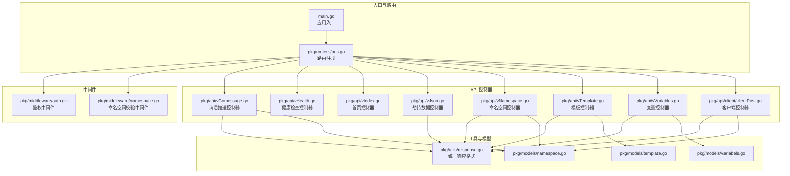
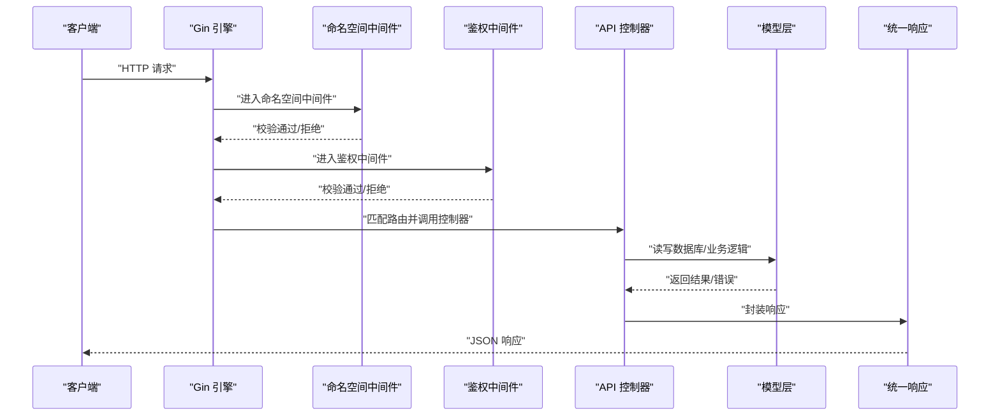
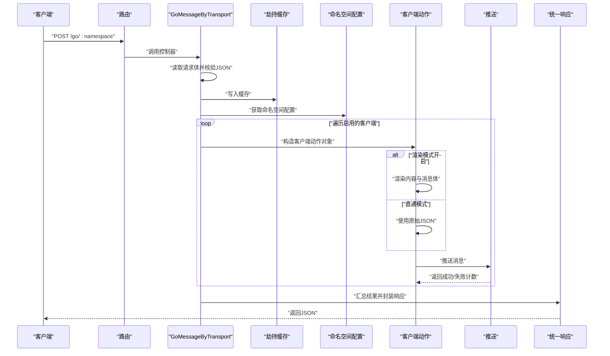
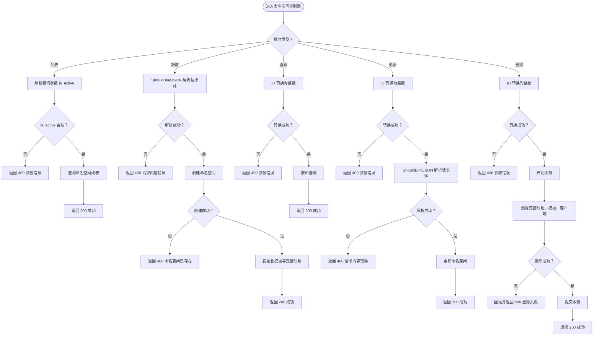
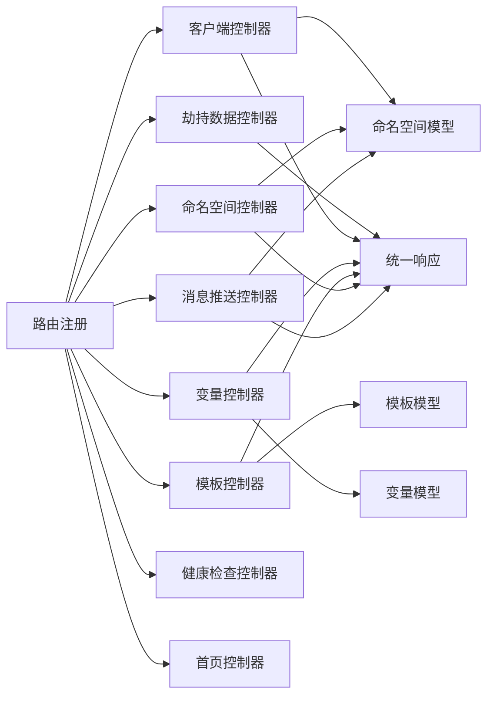

# API 层

<cite>
**本文引用的文件**
- [main.go](file://main.go)
- [pkg/routers/urls.go](file://pkg/routers/urls.go)
- [pkg/api/vGomessage.go](file://pkg/api/vGomessage.go)
- [pkg/api/vHealth.go](file://pkg/api/vHealth.go)
- [pkg/api/vIndex.go](file://pkg/api/vIndex.go)
- [pkg/api/vJson.go](file://pkg/api/vJson.go)
- [pkg/api/vNamespace.go](file://pkg/api/vNamespace.go)
- [pkg/api/vTemplate.go](file://pkg/api/vTemplate.go)
- [pkg/api/vVariables.go](file://pkg/api/vVariables.go)
- [pkg/api/client/clientPost.go](file://pkg/api/client/clientPost.go)
- [pkg/middleware/auth.go](file://pkg/middleware/auth.go)
- [pkg/middleware/namespace.go](file://pkg/middleware/namespace.go)
- [pkg/utils/response.go](file://pkg/utils/response.go)
- [pkg/models/namespace.go](file://pkg/models/namespace.go)
- [pkg/models/template.go](file://pkg/models/template.go)
- [pkg/models/variabels.go](file://pkg/models/variabels.go)
</cite>

## 目录
1. [简介](#简介)
2. [项目结构](#项目结构)
3. [核心组件](#核心组件)
4. [架构总览](#架构总览)
5. [详细组件分析](#详细组件分析)
6. [依赖分析](#依赖分析)
7. [性能考虑](#性能考虑)
8. [故障排查指南](#故障排查指南)
9. [结论](#结论)
10. [附录](#附录)

## 简介
本文件面向开发者，系统性梳理 API 层的设计与实现，涵盖控制器模式、HTTP 请求处理流程、响应格式化机制、参数校验与错误处理、状态码策略，以及与模型层、服务层、中间件层的交互关系。重点说明以下控制器的职责与实现要点：
- 消息推送控制器：负责接收外部数据、按命名空间配置进行渲染与推送
- 模板管理控制器：提供模板的增删改查
- 变量管理控制器：提供命名空间变量的增删改查
- 命名空间控制器：提供命名空间的增删改查
- 客户端控制器：提供客户端的增删改查
- 健康检查与首页控制器：提供健康状态与静态首页
- 劫持数据控制器：提供命名空间级数据劫持与扁平化展示

## 项目结构
API 层位于 pkg/api 下，按功能划分为多个控制器文件；路由注册集中在 pkg/routers/urls.go；统一响应格式定义于 pkg/utils/response.go；鉴权与命名空间校验通过中间件 pkg/middleware 实现；数据模型位于 pkg/models。

图表来源
- [main.go:37-55](file://main.go#L37-L55)
- [pkg/routers/urls.go:21-108](file://pkg/routers/urls.go#L21-L108)
- [pkg/api/vGomessage.go:24-154](file://pkg/api/vGomessage.go#L24-L154)
- [pkg/api/vHealth.go:12-26](file://pkg/api/vHealth.go#L12-L26)
- [pkg/api/vIndex.go:12-14](file://pkg/api/vIndex.go#L12-L14)
- [pkg/api/vJson.go:10-32](file://pkg/api/vJson.go#L10-L32)
- [pkg/api/vNamespace.go:15-148](file://pkg/api/vNamespace.go#L15-L148)
- [pkg/api/vTemplate.go:13-146](file://pkg/api/vTemplate.go#L13-L146)
- [pkg/api/vVariables.go:12-102](file://pkg/api/vVariables.go#L12-L102)
- [pkg/api/client/clientPost.go:11-49](file://pkg/api/client/clientPost.go#L11-L49)
- [pkg/utils/response.go:11-27](file://pkg/utils/response.go#L11-L27)
- [pkg/models/namespace.go:12-105](file://pkg/models/namespace.go#L12-L105)
- [pkg/models/template.go:9-71](file://pkg/models/template.go#L9-L71)
- [pkg/models/variabels.go:9-88](file://pkg/models/variabels.go#L9-L88)

章节来源
- [main.go:37-55](file://main.go#L37-L55)
- [pkg/routers/urls.go:21-108](file://pkg/routers/urls.go#L21-L108)

## 核心组件
- 统一响应格式：所有控制器返回统一结构，包含状态码、消息、结果或错误信息，并附带帮助链接，便于排障。
- 控制器模式：每个控制器函数接收 gin.Context，完成参数解析、业务调用、错误处理与响应生成。
- 中间件链路：鉴权中间件负责 JWT 校验与会话有效性；命名空间中间件负责命名空间存在性校验。
- 数据模型：命名空间、模板、变量等模型提供 CRUD 能力，控制器通过模型层访问数据库。

章节来源
- [pkg/utils/response.go:11-27](file://pkg/utils/response.go#L11-L27)
- [pkg/middleware/auth.go:12-61](file://pkg/middleware/auth.go#L12-L61)
- [pkg/middleware/namespace.go:20-46](file://pkg/middleware/namespace.go#L20-L46)
- [pkg/models/namespace.go:28-105](file://pkg/models/namespace.go#L28-L105)
- [pkg/models/template.go:24-71](file://pkg/models/template.go#L24-L71)
- [pkg/models/variabels.go:24-88](file://pkg/models/variabels.go#L24-L88)

## 架构总览
下图展示了请求从进入 Gin 引擎到控制器处理、中间件校验、模型层访问与响应生成的整体流程。

图表来源
- [pkg/routers/urls.go:27-108](file://pkg/routers/urls.go#L27-L108)
- [pkg/middleware/namespace.go:20-46](file://pkg/middleware/namespace.go#L20-L46)
- [pkg/middleware/auth.go:12-61](file://pkg/middleware/auth.go#L12-L61)
- [pkg/api/vGomessage.go:24-154](file://pkg/api/vGomessage.go#L24-L154)
- [pkg/utils/response.go:11-27](file://pkg/utils/response.go#L11-L27)

## 详细组件分析

### 消息推送控制器（GoMessageByTransport）
职责与流程
- 接收 POST /go/:namespace 请求，读取请求体并校验为合法 JSON
- 将请求体写入缓存以便劫持层读取
- 读取命名空间配置，按客户端类型构造动作对象
- 若开启渲染模式，根据模板与变量渲染消息体；否则直接使用原始 JSON
- 针对每个启用的客户端推送消息，统计成功/失败数量
- 返回统一响应，依据成功/失败比例返回不同状态码

图表来源
- [pkg/api/vGomessage.go:24-154](file://pkg/api/vGomessage.go#L24-L154)

章节来源
- [pkg/api/vGomessage.go:24-154](file://pkg/api/vGomessage.go#L24-L154)

### 健康检查与首页控制器
- /health：全局健康检测
- /ok：命名空间健康检测
- /：返回 Vue 首页 HTML

章节来源
- [pkg/api/vHealth.go:12-26](file://pkg/api/vHealth.go#L12-L26)
- [pkg/api/vIndex.go:12-14](file://pkg/api/vIndex.go#L12-L14)

### 劫持数据控制器（GetNamespaceJson / GetNamespaceFlatteningJson）
- /api/v1/:namespace/json：获取指定命名空间的最新劫持数据
- /api/v1/:namespace/flattening：获取指定命名空间的扁平化劫持数据

章节来源
- [pkg/api/vJson.go:10-32](file://pkg/api/vJson.go#L10-L32)

### 命名空间控制器（vNamespace）
职责与流程
- GET /api/v1/namespace：支持按 is_active 过滤查询
- POST /api/v1/namespace：新增命名空间，同时初始化模板与变量映射
- GET /api/v1/namespace/:id：按 ID 查询
- PUT /api/v1/namespace/:id：按 ID 更新
- DELETE /api/v1/namespace/:id：按 ID 删除，级联删除模板、变量、客户端

参数校验与错误处理
- 对 is_active 参数进行布尔值校验
- 对 ID 参数进行整型转换校验
- 删除操作使用事务保证一致性

图表来源
- [pkg/api/vNamespace.go:15-148](file://pkg/api/vNamespace.go#L15-L148)

章节来源
- [pkg/api/vNamespace.go:15-148](file://pkg/api/vNamespace.go#L15-L148)

### 模板管理控制器（vTemplate）
职责与流程
- GET /api/v1/:namespace/template：列出模板
- POST /api/v1/:namespace/template：新增模板（先清理同命名空间旧模板，再新增）
- GET /api/v1/:namespace/template/:id：按 ID 查询并校验命名空间归属
- PUT /api/v1/:namespace/template/:id：按 ID 更新并校验命名空间归属
- DELETE /api/v1/:namespace/template/:id：按 ID 删除并校验命名空间归属

章节来源
- [pkg/api/vTemplate.go:13-146](file://pkg/api/vTemplate.go#L13-L146)

### 变量管理控制器（vVariables）
职责与流程
- GET /api/v1/:namespace/vars：列出变量
- POST /api/v1/:namespace/vars：批量新增变量映射（先清空旧映射，再批量写入）
- GET /api/v1/:namespace/vars/:id：按 ID 查询
- PUT /api/v1/:namespace/vars/:id：按 ID 更新
- DELETE /api/v1/:namespace/vars/:id：按 ID 删除

章节来源
- [pkg/api/vVariables.go:12-102](file://pkg/api/vVariables.go#L12-L102)

### 客户端控制器（clientPost）
职责与流程
- POST /api/v1/:namespace/client：新增客户端，根据客户端类型解析扩展信息并保存

章节来源
- [pkg/api/client/clientPost.go:11-49](file://pkg/api/client/clientPost.go#L11-L49)

### 路由与中间件集成
- 路由注册集中于 pkg/routers/urls.go，统一加载静态资源、Swagger 文档、健康检查、首页、API v1 分组等
- 中间件：
  - CORS 与访问日志：全局中间件
  - 命名空间校验：对 /go/* 与 /api/v1/* 路由生效
  - 鉴权中间件：对 /api/v1/* 路由生效

章节来源
- [pkg/routers/urls.go:15-108](file://pkg/routers/urls.go#L15-L108)
- [pkg/middleware/namespace.go:20-46](file://pkg/middleware/namespace.go#L20-L46)
- [pkg/middleware/auth.go:12-61](file://pkg/middleware/auth.go#L12-L61)

## 依赖分析
- 控制器依赖统一响应格式与模型层
- 路由注册依赖中间件与控制器
- 消息推送控制器依赖命名空间配置与客户端动作接口
- 命名空间控制器依赖模型层的 CRUD 与事务控制

图表来源
- [pkg/routers/urls.go:21-108](file://pkg/routers/urls.go#L21-L108)
- [pkg/api/vGomessage.go:24-154](file://pkg/api/vGomessage.go#L24-L154)
- [pkg/api/vNamespace.go:15-148](file://pkg/api/vNamespace.go#L15-L148)
- [pkg/api/vTemplate.go:13-146](file://pkg/api/vTemplate.go#L13-L146)
- [pkg/api/vVariables.go:12-102](file://pkg/api/vVariables.go#L12-L102)
- [pkg/api/client/clientPost.go:11-49](file://pkg/api/client/clientPost.go#L11-L49)
- [pkg/utils/response.go:11-27](file://pkg/utils/response.go#L11-L27)
- [pkg/models/namespace.go:28-105](file://pkg/models/namespace.go#L28-L105)
- [pkg/models/template.go:24-71](file://pkg/models/template.go#L24-L71)
- [pkg/models/variabels.go:24-88](file://pkg/models/variabels.go#L24-L88)

章节来源
- [pkg/routers/urls.go:21-108](file://pkg/routers/urls.go#L21-L108)

## 性能考虑
- 请求体读取与 JSON 绑定：在消息推送控制器中，一次性读取请求体并进行 JSON 校验，避免重复 IO
- 缓存写入：将请求体写入缓存以供劫持层复用，减少重复解析成本
- 客户端推送并行：循环内逐个客户端推送，若后续需要提升吞吐，可在客户端动作层引入并发与限流
- 命名空间查询：命名空间中间件仅做存在性校验，避免不必要的复杂查询
- 模板与变量批量更新：命名空间删除时，模板与变量删除采用批量方式，降低多次往返开销

## 故障排查指南
- 统一响应格式：所有失败响应均包含错误信息与帮助链接，便于快速定位问题
- 中间件拦截：
  - 命名空间中间件：当命名空间不存在时，返回 404 并附带请求上下文信息
  - 鉴权中间件：缺少 Authorization 头、令牌无效或已过期时，返回 401
- 常见错误场景
  - 参数错误：如 ID 非法、is_active 不是布尔值
  - 数据不存在：如模板不属于当前命名空间
  - 服务器内部错误：数据库操作失败或事务回滚

章节来源
- [pkg/utils/response.go:11-27](file://pkg/utils/response.go#L11-L27)
- [pkg/middleware/namespace.go:30-44](file://pkg/middleware/namespace.go#L30-L44)
- [pkg/middleware/auth.go:18-59](file://pkg/middleware/auth.go#L18-L59)
- [pkg/api/vNamespace.go:29-31](file://pkg/api/vNamespace.go#L29-L31)
- [pkg/api/vTemplate.go:81-84](file://pkg/api/vTemplate.go#L81-L84)

## 结论
API 层通过清晰的控制器模式与中间件链路，实现了从请求接入、参数校验、业务处理到统一响应的完整闭环。命名空间、模板、变量与客户端的 CRUD 能力完善，消息推送控制器具备灵活的渲染与多客户端推送能力。建议在高并发场景下对客户端推送环节引入异步与限流策略，并持续完善前端对接以发挥完整能力。

## 附录
- 请求与响应规范
  - 统一响应结构包含 code、msg、result 或 error、help 字段
  - 成功返回 200，失败返回 4xx/5xx，具体语义由 code 与 msg 描述
- 路由与中间件
  - 路由注册集中于路由文件，中间件按需挂载
  - 命名空间与鉴权中间件确保安全与一致性