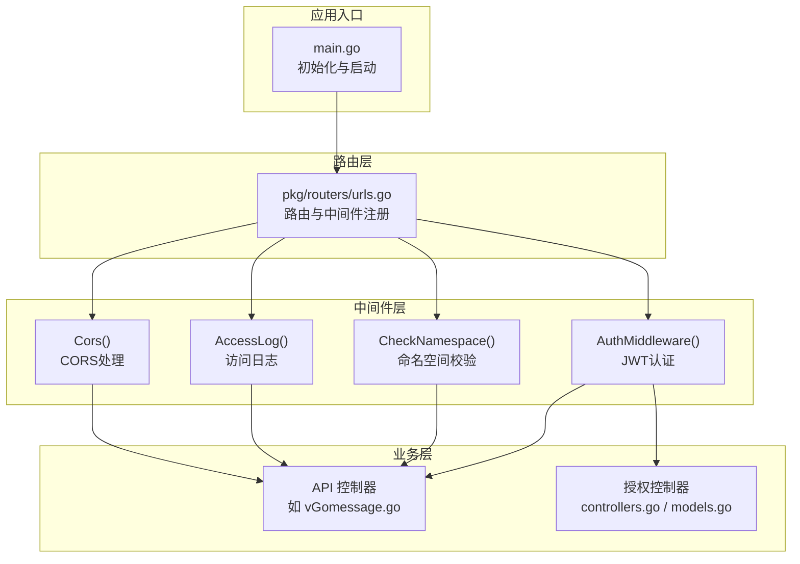
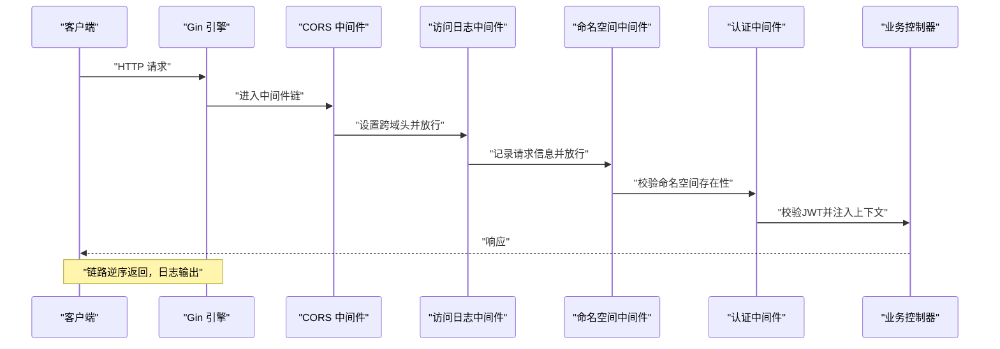
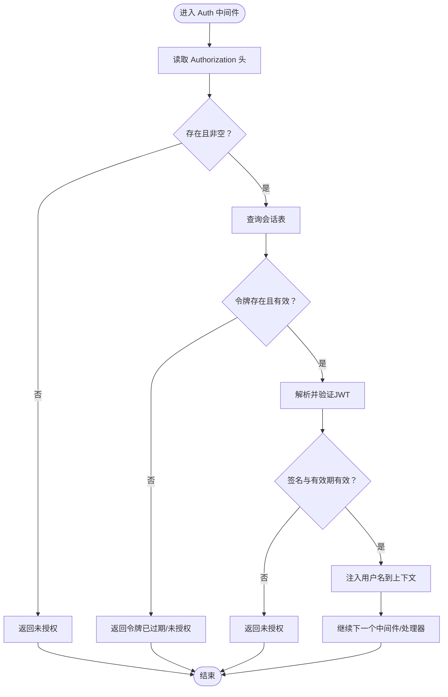
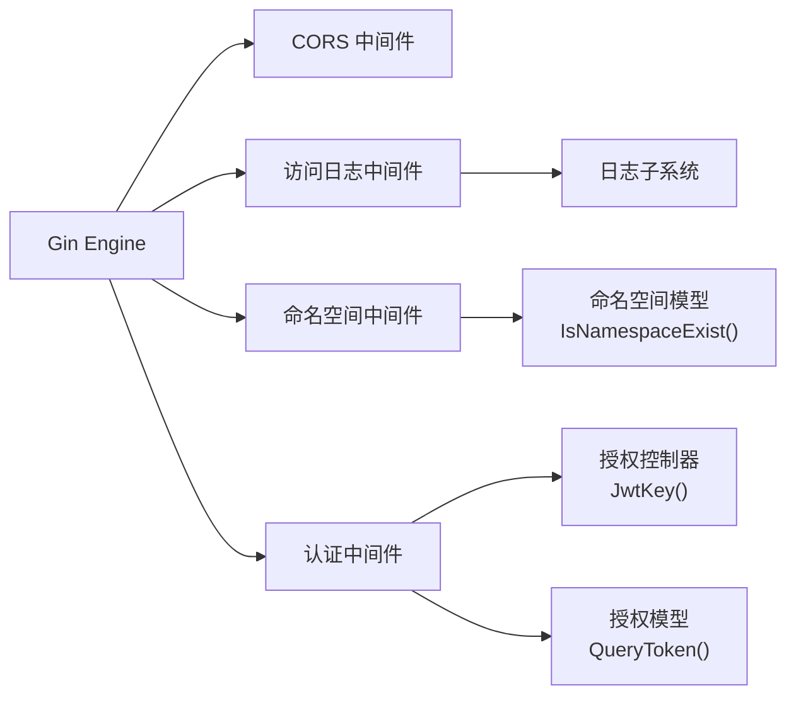

# 中间件层

<cite>
**本文引用的文件列表**
- [main.go](file://main.go)
- [urls.go](file://pkg/routers/urls.go)
- [auth.go](file://pkg/middleware/auth.go)
- [cors.go](file://pkg/middleware/cors.go)
- [access.go](file://pkg/middleware/access.go)
- [namespace.go](file://pkg/middleware/namespace.go)
- [controllers.go](file://pkg/authorization/controllers.go)
- [models.go](file://pkg/authorization/models.go)
- [namespace.go](file://pkg/models/namespace.go)
- [response.go](file://pkg/utils/response.go)
- [default.yaml](file://config/default.yaml)
</cite>

## 目录
1. [简介](#简介)
2. [项目结构](#项目结构)
3. [核心组件](#核心组件)
4. [架构总览](#架构总览)
5. [详细组件分析](#详细组件分析)
6. [依赖关系分析](#依赖关系分析)
7. [性能考量](#性能考量)
8. [故障排查指南](#故障排查指南)
9. [结论](#结论)
10. [附录](#附录)

## 简介
本文件面向开发者，系统性梳理中间件层的设计与实现，重点覆盖以下横切关注点：
- 认证中间件：基于 JWT 的鉴权与会话校验
- CORS 中间件：跨域资源共享处理与预检放行
- 访问日志中间件：敏感字段脱敏与请求体安全读取
- 命名空间中间件：多租户命名空间校验与隔离

文档将详细说明中间件的执行顺序、链式调用机制、上下文传递方式；解释各中间件职责与实现要点；提供注册方式、配置项与错误处理策略；并说明与 Gin 框架的集成方式及性能优化建议。

## 项目结构
中间件层位于 pkg/middleware 目录，围绕 Gin Engine 的中间件链路组织，配合路由层统一注册，形成从外到内的处理流水线。

图表来源
- [main.go:37-55](file://main.go#L37-L55)
- [urls.go:21-108](file://pkg/routers/urls.go#L21-L108)
- [cors.go:8-28](file://pkg/middleware/cors.go#L8-L28)
- [access.go:23-71](file://pkg/middleware/access.go#L23-L71)
- [namespace.go:20-46](file://pkg/middleware/namespace.go#L20-L46)
- [auth.go:12-61](file://pkg/middleware/auth.go#L12-L61)

章节来源
- [main.go:37-55](file://main.go#L37-L55)
- [urls.go:21-108](file://pkg/routers/urls.go#L21-L108)

## 核心组件
- CORS 中间件：统一设置跨域响应头，对 OPTIONS 预检请求快速放行，确保前后端联调顺畅。
- 访问日志中间件：在请求进入后、响应前收集关键指标，对敏感字段进行脱敏，避免日志泄露。
- 命名空间中间件：根据请求路径解析命名空间，校验其存在性，不存在则直接中断并返回错误。
- 认证中间件：从请求头提取 JWT，校验签名与有效性，核对会话表以判断是否已注销，通过后将用户名注入上下文供后续处理器使用。

章节来源
- [cors.go:8-28](file://pkg/middleware/cors.go#L8-L28)
- [access.go:23-71](file://pkg/middleware/access.go#L23-L71)
- [namespace.go:20-46](file://pkg/middleware/namespace.go#L20-L46)
- [auth.go:12-61](file://pkg/middleware/auth.go#L12-L61)

## 架构总览
中间件链路遵循“先注册者先执行”的原则，按注册顺序从外到内依次执行，再逆序返回。典型链路如下：
- 全局中间件：CORS、访问日志
- 分组中间件：命名空间校验、认证
- 路由处理器：业务控制器

图表来源
- [urls.go:27-28](file://pkg/routers/urls.go#L27-L28)
- [urls.go:58-60](file://pkg/routers/urls.go#L58-L60)
- [urls.go:59](file://pkg/routers/urls.go#L59)
- [urls.go:95-96](file://pkg/routers/urls.go#L95-L96)
- [cors.go:9-27](file://pkg/middleware/cors.go#L9-L27)
- [access.go:23-68](file://pkg/middleware/access.go#L23-L68)
- [namespace.go:20-44](file://pkg/middleware/namespace.go#L20-L44)
- [auth.go:12-54](file://pkg/middleware/auth.go#L12-L54)

## 详细组件分析

### CORS 中间件
- 职责
  - 设置允许来源、头部、方法、凭据等跨域响应头
  - 对 OPTIONS 预检请求直接返回成功，减少浏览器往返
- 关键点
  - 使用通配符允许来源，便于本地联调
  - 统一暴露必要头部，避免前端跨域读取受限
- 性能与安全
  - 生产环境建议将来源限制为可信域名
  - 凭据允许需谨慎，避免 CSRF 风险

章节来源
- [cors.go:8-28](file://pkg/middleware/cors.go#L8-L28)

### 访问日志中间件
- 职责
  - 在请求进入后、响应前采集时间、状态码、客户端 IP、方法、路径、路由、请求体等
  - 对请求体进行敏感字段脱敏，限制最大长度，避免日志膨胀
- 关键点
  - 使用 TeeReader 将 Body 读取后回写，保证下游仍可读取
  - 通过正则匹配敏感字段，统一替换为占位符
- 性能与安全
  - 脱敏与截断降低日志体积
  - 建议结合异步日志与滚动策略

章节来源
- [access.go:13-21](file://pkg/middleware/access.go#L13-L21)
- [access.go:23-71](file://pkg/middleware/access.go#L23-L71)

### 命名空间中间件
- 职责
  - 解析请求路径中的命名空间参数
  - 校验命名空间是否存在，不存在则中断并返回错误
- 关键点
  - 特殊路径“/go”“/gomessage”“/go/message”映射为默认命名空间
  - 使用统一响应模板返回错误信息
- 安全与隔离
  - 通过命名空间实现多租户隔离，防止越权访问

章节来源
- [namespace.go:20-46](file://pkg/middleware/namespace.go#L20-L46)
- [namespace.go:11-18](file://pkg/middleware/namespace.go#L11-L18)
- [namespace.go:96-105](file://pkg/models/namespace.go#L96-L105)

### 认证中间件（JWT）
- 职责
  - 从 Authorization 请求头提取 JWT
  - 校验签名算法与密钥，验证令牌有效性
  - 核对会话表，确保令牌未被注销
  - 成功后将用户名注入上下文，供后续处理器使用
- 关键点
  - 密钥来源于配置中心，避免硬编码
  - 会话表用于强制注销与黑名单控制
- 安全与错误处理
  - 对签名无效、令牌异常、已过期等情况统一返回未授权
  - 建议结合刷新令牌与短有效期策略

图表来源
- [auth.go:12-61](file://pkg/middleware/auth.go#L12-L61)
- [controllers.go:10-12](file://pkg/authorization/controllers.go#L10-L12)
- [models.go:130-134](file://pkg/authorization/models.go#L130-L134)

章节来源
- [auth.go:12-61](file://pkg/middleware/auth.go#L12-L61)
- [controllers.go:10-12](file://pkg/authorization/controllers.go#L10-L12)
- [models.go:130-134](file://pkg/authorization/models.go#L130-L134)

## 依赖关系分析
- 中间件与框架
  - 所有中间件均返回 gin.HandlerFunc，与 Gin Engine 的 Use/Group 机制无缝集成
- 中间件与业务
  - 认证中间件依赖授权模块的 JWT 密钥与会话表
  - 命名空间中间件依赖命名空间模型的校验逻辑
  - 访问日志中间件依赖日志子系统
- 路由与中间件
  - 全局中间件在引擎级别注册，作用于所有路由
  - 分组中间件在 Group 上注册，仅作用于该分组下的路由

图表来源
- [urls.go:27-28](file://pkg/routers/urls.go#L27-L28)
- [urls.go:58-60](file://pkg/routers/urls.go#L58-L60)
- [urls.go:95-96](file://pkg/routers/urls.go#L95-L96)
- [auth.go:12-61](file://pkg/middleware/auth.go#L12-L61)
- [controllers.go:10-12](file://pkg/authorization/controllers.go#L10-L12)
- [models.go:130-134](file://pkg/authorization/models.go#L130-L134)
- [namespace.go:20-46](file://pkg/middleware/namespace.go#L20-L46)
- [namespace.go:96-105](file://pkg/models/namespace.go#L96-L105)

## 性能考量
- 中间件顺序
  - 将高开销中间件（如访问日志）置于链路靠前位置，尽早决定是否放行，减少后续处理成本
- 请求体读取
  - 访问日志中间件采用 TeeReader 读取并回写，避免下游无法读取请求体
- 敏感信息脱敏
  - 对请求体敏感字段进行脱敏与长度限制，降低日志体积与泄露风险
- CORS 配置
  - 生产环境建议限制允许来源与方法，减少不必要的预检请求
- 认证与会话
  - 会话查询应使用索引字段，避免全表扫描
  - JWT 密钥与算法需保持一致，避免重复解析失败

[本节为通用性能建议，无需特定文件引用]

## 故障排查指南
- 未授权/401
  - 检查 Authorization 请求头是否正确传递
  - 确认令牌未过期且未在会话表中被注销
  - 核对 JWT 密钥配置是否与签发一致
- CORS 失败
  - 确认浏览器是否发送 OPTIONS 预检
  - 检查响应头是否包含允许的来源、方法与头部
- 命名空间不存在
  - 检查请求路径中的命名空间参数
  - 确认命名空间已在数据库中存在
- 访问日志异常
  - 检查日志子系统配置与权限
  - 确认请求体读取与回写逻辑未被下游覆盖

章节来源
- [auth.go:12-61](file://pkg/middleware/auth.go#L12-L61)
- [cors.go:8-28](file://pkg/middleware/cors.go#L8-L28)
- [namespace.go:20-46](file://pkg/middleware/namespace.go#L20-L46)
- [access.go:23-71](file://pkg/middleware/access.go#L23-L71)

## 结论
中间件层通过明确的职责划分与严格的执行顺序，为系统提供了统一的安全边界与可观测性。CORS、访问日志、命名空间与认证四类中间件协同工作，既保障了多租户隔离与跨域联调体验，又提升了系统的安全性与可维护性。建议在生产环境中进一步收紧 CORS 来源、完善会话管理与审计日志，并持续监控中间件链路的性能表现。

[本节为总结性内容，无需特定文件引用]

## 附录

### 中间件注册与使用示例
- 全局中间件注册
  - 在引擎级别注册 CORS 与访问日志中间件，作用于所有路由
- 分组中间件注册
  - 在 API v1 分组注册命名空间校验与认证中间件
  - 单个路由可单独追加命名空间中间件
- 示例路径
  - [全局中间件注册:27-28](file://pkg/routers/urls.go#L27-L28)
  - [分组中间件注册:58-60](file://pkg/routers/urls.go#L58-L60)
  - [单路由中间件追加:42-48](file://pkg/routers/urls.go#L42-L48)
  - [命名空间分组注册:95-96](file://pkg/routers/urls.go#L95-L96)

章节来源
- [urls.go:27-28](file://pkg/routers/urls.go#L27-L28)
- [urls.go:58-60](file://pkg/routers/urls.go#L58-L60)
- [urls.go:42-48](file://pkg/routers/urls.go#L42-L48)
- [urls.go:95-96](file://pkg/routers/urls.go#L95-L96)

### 配置项与密钥
- JWT 密钥
  - 配置项：auth.jwtKey
  - 默认值：示例值，生产环境必须修改
- 服务监听
  - 配置项：service.host, service.port
- 日志路径
  - 配置项：log.accessLogFile 等
- 示例路径
  - [默认配置文件:11-13](file://config/default.yaml#L11-L13)
  - [服务监听配置:19-21](file://config/default.yaml#L19-L21)
  - [日志配置:27-38](file://config/default.yaml#L27-L38)

章节来源
- [default.yaml:11-13](file://config/default.yaml#L11-L13)
- [default.yaml:19-21](file://config/default.yaml#L19-L21)
- [default.yaml:27-38](file://config/default.yaml#L27-L38)

### 错误响应模板
- 统一响应结构
  - 字段：code、msg、result、error、help
- 使用场景
  - 中间件与控制器在错误时返回统一格式
- 示例路径
  - [响应模板定义:3-9](file://pkg/utils/response.go#L3-L9)
  - [失败响应构造:20-27](file://pkg/utils/response.go#L20-L27)

章节来源
- [response.go:3-9](file://pkg/utils/response.go#L3-L9)
- [response.go:20-27](file://pkg/utils/response.go#L20-L27)