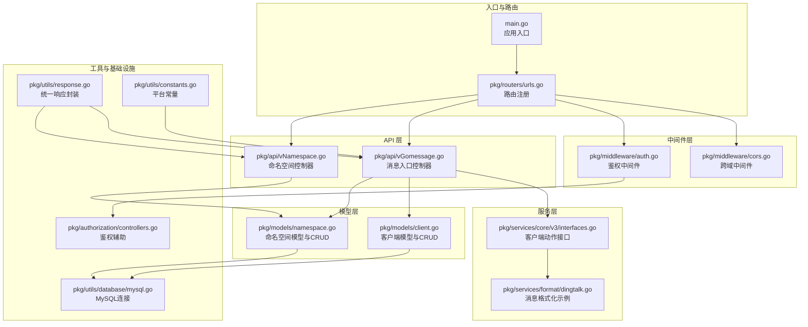
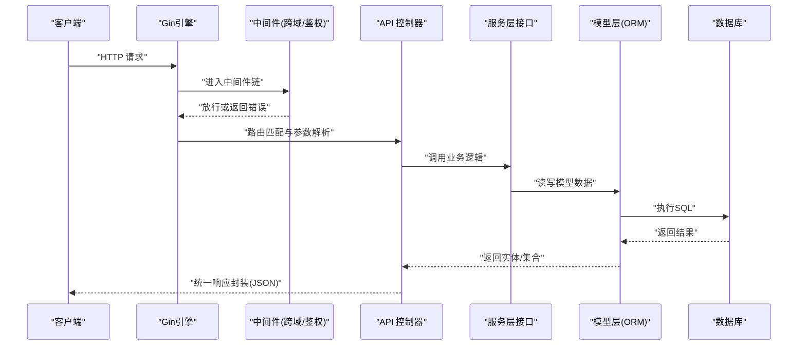
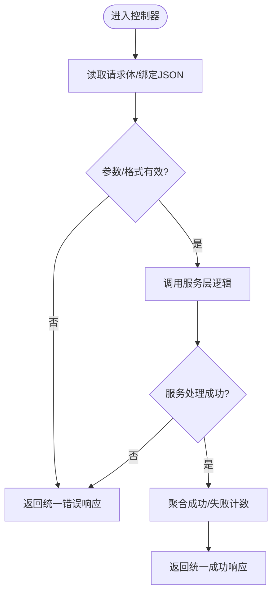
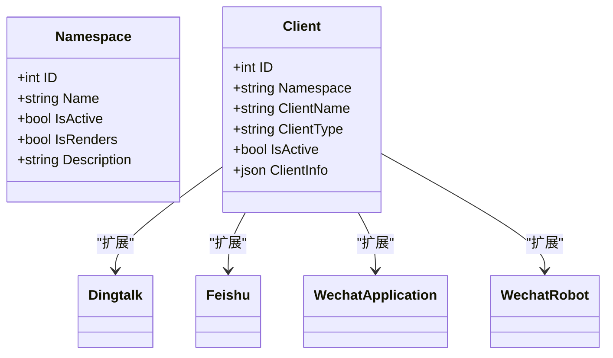
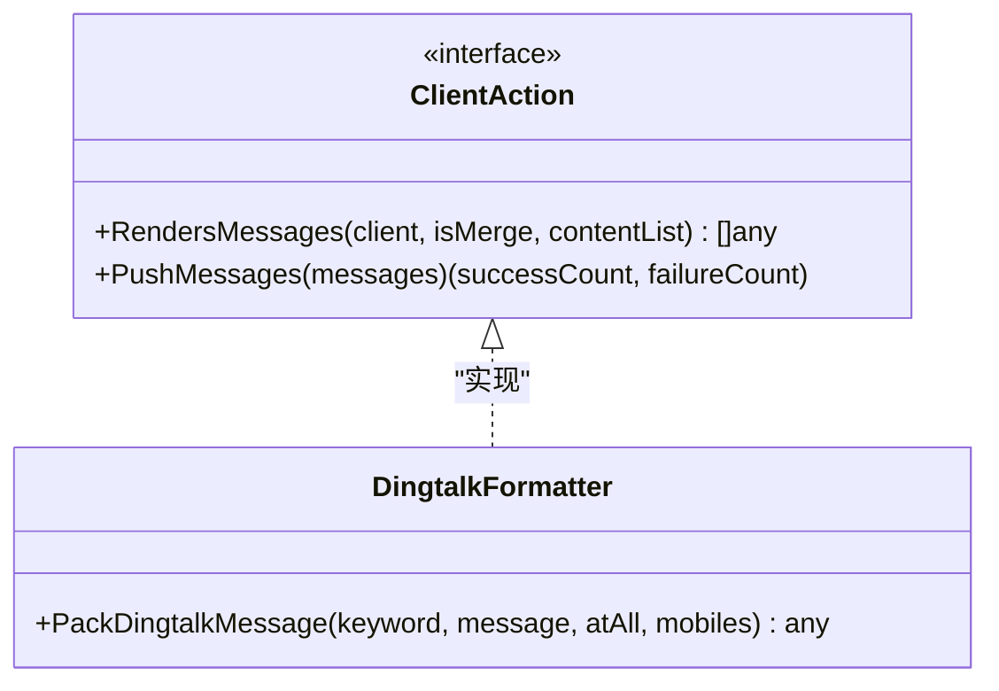
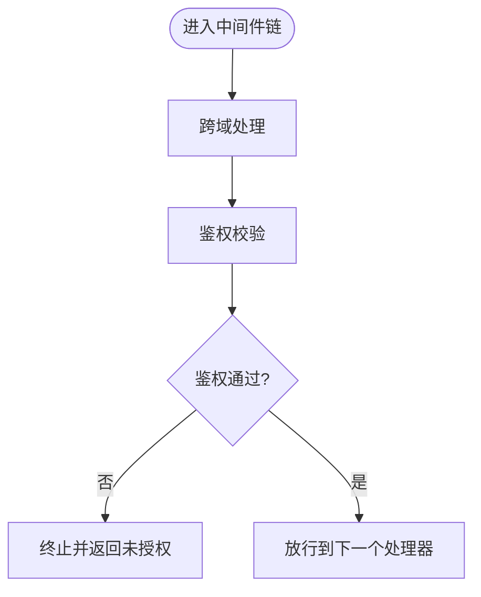
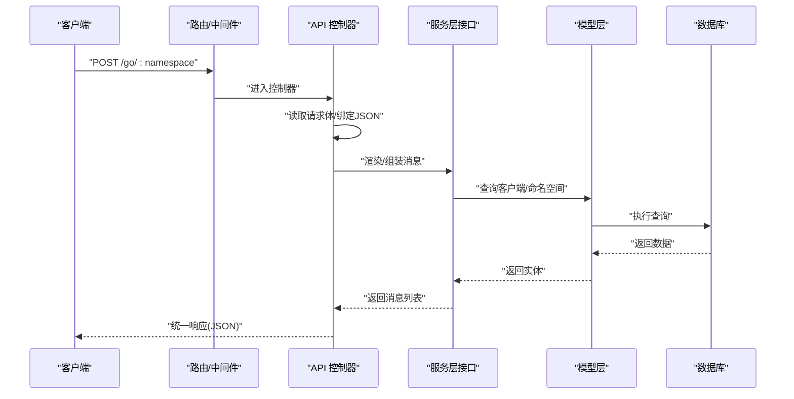
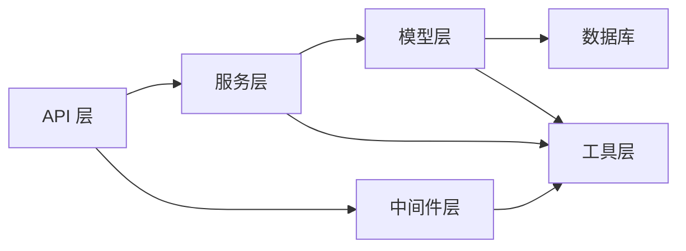

# 后端分层架构

<cite>
**本文引用的文件**
- [main.go](file://main.go)
- [urls.go](file://pkg/routers/urls.go)
- [auth.go](file://pkg/middleware/auth.go)
- [cors.go](file://pkg/middleware/cors.go)
- [client.go](file://pkg/models/client.go)
- [namespace.go](file://pkg/models/namespace.go)
- [vGomessage.go](file://pkg/api/vGomessage.go)
- [vNamespace.go](file://pkg/api/vNamespace.go)
- [controllers.go](file://pkg/authorization/controllers.go)
- [mysql.go](file://pkg/utils/database/mysql.go)
- [response.go](file://pkg/utils/response.go)
- [constants.go](file://pkg/utils/constants.go)
- [interfaces.go](file://pkg/services/core/v3/interfaces.go)
- [dingtalk.go](file://pkg/services/format/dingtalk.go)
</cite>

## 目录
1. [引言](#引言)
2. [项目结构](#项目结构)
3. [核心组件](#核心组件)
4. [架构总览](#架构总览)
5. [详细组件分析](#详细组件分析)
6. [依赖分析](#依赖分析)
7. [性能考虑](#性能考虑)
8. [故障排查指南](#故障排查指南)
9. [结论](#结论)
10. [附录](#附录)

## 引言
本文件面向开发者系统化阐述 GoMessage 的后端分层架构设计，围绕四层模型展开：API 层、模型层、服务层、中间件层。文档将明确每层职责边界、依赖关系与交互模式，并结合实际代码路径说明请求流转、错误处理与数据传递机制，帮助读者快速理解与高效维护。

## 项目结构
后端以 Gin 作为 Web 框架入口，通过路由注册组织 API；中间件统一处理跨域、鉴权、访问日志等横切关注点；模型层负责数据实体与数据库操作；服务层承载核心业务逻辑与多版本策略；工具层提供数据库连接、响应封装、常量定义等通用能力。

图表来源
- [main.go:37-55](file://main.go#L37-L55)
- [urls.go:21-108](file://pkg/routers/urls.go#L21-L108)
- [cors.go:8-28](file://pkg/middleware/cors.go#L8-L28)
- [auth.go:12-61](file://pkg/middleware/auth.go#L12-L61)
- [vGomessage.go:21-173](file://pkg/api/vGomessage.go#L21-L173)
- [vNamespace.go:15-149](file://pkg/api/vNamespace.go#L15-L149)
- [client.go:40-239](file://pkg/models/client.go#L40-L239)
- [namespace.go:28-106](file://pkg/models/namespace.go#L28-L106)
- [interfaces.go:7-11](file://pkg/services/core/v3/interfaces.go#L7-L11)
- [dingtalk.go:3-30](file://pkg/services/format/dingtalk.go#L3-L30)
- [mysql.go:12-53](file://pkg/utils/database/mysql.go#L12-L53)
- [response.go:11-27](file://pkg/utils/response.go#L11-L27)
- [constants.go:3-9](file://pkg/utils/constants.go#L3-L9)
- [controllers.go:10-41](file://pkg/authorization/controllers.go#L10-L41)

章节来源
- [main.go:1-56](file://main.go#L1-L56)
- [urls.go:1-109](file://pkg/routers/urls.go#L1-L109)

## 核心组件
- API 层：负责 HTTP 接口定义与请求处理，承担参数解析、调用服务层、组装统一响应的任务。例如消息入口控制器与命名空间控制器。
- 模型层：封装数据实体与数据库操作，提供 CRUD 方法与关联查询，屏蔽底层 ORM 细节。
- 服务层：承载核心业务逻辑，包含渲染、组装消息、推送等策略，通过接口抽象不同客户端动作。
- 中间件层：处理跨域、鉴权、访问日志等横切关注点，统一拦截请求与响应。
- 工具与基础设施：提供数据库连接、响应封装、常量定义、日志钩子等支撑能力。

章节来源
- [vGomessage.go:21-173](file://pkg/api/vGomessage.go#L21-L173)
- [vNamespace.go:15-149](file://pkg/api/vNamespace.go#L15-L149)
- [client.go:40-239](file://pkg/models/client.go#L40-L239)
- [namespace.go:28-106](file://pkg/models/namespace.go#L28-L106)
- [interfaces.go:7-11](file://pkg/services/core/v3/interfaces.go#L7-L11)
- [cors.go:8-28](file://pkg/middleware/cors.go#L8-L28)
- [auth.go:12-61](file://pkg/middleware/auth.go#L12-L61)
- [mysql.go:12-53](file://pkg/utils/database/mysql.go#L12-L53)
- [response.go:11-27](file://pkg/utils/response.go#L11-L27)
- [constants.go:3-9](file://pkg/utils/constants.go#L3-L9)
- [controllers.go:10-41](file://pkg/authorization/controllers.go#L10-L41)

## 架构总览
下图展示了典型请求从入口到落库与服务处理的关键流转，体现四层职责与依赖方向：

图表来源
- [urls.go:21-108](file://pkg/routers/urls.go#L21-L108)
- [cors.go:8-28](file://pkg/middleware/cors.go#L8-L28)
- [auth.go:12-61](file://pkg/middleware/auth.go#L12-L61)
- [vGomessage.go:21-173](file://pkg/api/vGomessage.go#L21-L173)
- [client.go:40-239](file://pkg/models/client.go#L40-L239)
- [mysql.go:12-53](file://pkg/utils/database/mysql.go#L12-L53)

## 详细组件分析

### API 层：请求入口与统一响应
- 职责边界
  - 解析路由参数与请求体，校验输入。
  - 协调服务层与模型层，组装统一响应。
  - 对外暴露消息入口与管理接口。
- 关键交互
  - 消息入口控制器在 POST /go/:namespace 中读取请求体、绑定 JSON、调用服务层渲染与推送，并聚合统计成功/失败计数。
  - 命名空间控制器提供命名空间的增删改查，删除时使用事务级联清理变量映射、模板与客户端。
- 错误处理
  - 使用统一响应封装函数输出错误码、消息与帮助链接，便于前端与运维定位问题。
- 数据传递
  - 通过结构体与接口在控制器与服务层之间传递，避免直接操作 ORM。

图表来源
- [vGomessage.go:24-154](file://pkg/api/vGomessage.go#L24-L154)
- [vNamespace.go:38-148](file://pkg/api/vNamespace.go#L38-L148)
- [response.go:11-27](file://pkg/utils/response.go#L11-L27)

章节来源
- [vGomessage.go:21-173](file://pkg/api/vGomessage.go#L21-L173)
- [vNamespace.go:15-149](file://pkg/api/vNamespace.go#L15-L149)
- [response.go:11-27](file://pkg/utils/response.go#L11-L27)

### 模型层：数据实体与数据库操作
- 职责边界
  - 定义数据结构与表映射，提供 CRUD 与关联查询方法。
  - 封装与 ORM 的交互细节，向上提供稳定接口。
- 关键实体
  - 命名空间：通道概念，包含是否激活、是否渲染等配置。
  - 客户端：支持钉钉、飞书、微信机器人与企业微信应用等类型，按类型扩展不同字段。
- 数据库连接
  - 提供 MySQL 连接工厂，设置连接池参数与日志级别，保证高并发下的稳定性。

图表来源
- [namespace.go:12-26](file://pkg/models/namespace.go#L12-L26)
- [client.go:13-28](file://pkg/models/client.go#L13-L28)
- [mysql.go:12-53](file://pkg/utils/database/mysql.go#L12-L53)

章节来源
- [namespace.go:28-106](file://pkg/models/namespace.go#L28-L106)
- [client.go:40-239](file://pkg/models/client.go#L40-L239)
- [mysql.go:12-53](file://pkg/utils/database/mysql.go#L12-L53)

### 服务层：核心业务逻辑与接口抽象
- 职责边界
  - 承载渲染、消息组装、推送等核心流程。
  - 通过接口抽象不同客户端的动作，便于扩展新平台。
- 关键接口
  - 客户端动作接口定义“渲染消息”与“推送消息”的两阶段流程，控制器仅依赖该接口，降低耦合。
- 示例实现
  - 钉钉消息格式化示例展示如何将内容打包为平台可识别的消息结构。

图表来源
- [interfaces.go:7-11](file://pkg/services/core/v3/interfaces.go#L7-L11)
- [dingtalk.go:3-30](file://pkg/services/format/dingtalk.go#L3-L30)

章节来源
- [interfaces.go:7-11](file://pkg/services/core/v3/interfaces.go#L7-L11)
- [dingtalk.go:3-30](file://pkg/services/format/dingtalk.go#L3-L30)

### 中间件层：横切关注点
- 跨域中间件
  - 统一设置允许的 Origin、Headers、Methods 等，对 OPTIONS 预检请求直接放行。
- 鉴权中间件
  - 从请求头提取 Authorization，校验 JWT 有效性与会话状态，通过后注入用户信息并放行。
- 访问日志
  - 在路由注册处统一挂载，记录请求与响应摘要，便于审计与排障。

图表来源
- [cors.go:8-28](file://pkg/middleware/cors.go#L8-L28)
- [auth.go:12-61](file://pkg/middleware/auth.go#L12-L61)

章节来源
- [cors.go:8-28](file://pkg/middleware/cors.go#L8-L28)
- [auth.go:12-61](file://pkg/middleware/auth.go#L12-L61)

### 分层协作示例：消息入口请求流
以下序列图展示一次完整的消息入口请求如何在四层之间流转，包括参数解析、服务处理、模型读写与统一响应：

图表来源
- [urls.go:42-48](file://pkg/routers/urls.go#L42-L48)
- [vGomessage.go:24-154](file://pkg/api/vGomessage.go#L24-L154)
- [client.go:231-239](file://pkg/models/client.go#L231-L239)
- [namespace.go:89-94](file://pkg/models/namespace.go#L89-L94)
- [response.go:11-27](file://pkg/utils/response.go#L11-L27)

章节来源
- [urls.go:21-108](file://pkg/routers/urls.go#L21-L108)
- [vGomessage.go:21-173](file://pkg/api/vGomessage.go#L21-L173)

## 依赖分析
- 层内低耦合：API 层仅依赖服务层接口与模型层查询；服务层依赖模型层与工具层；模型层依赖数据库连接；中间件独立于业务逻辑。
- 层间依赖方向：自顶向下，API → 服务 → 模型 → 数据库；中间件贯穿所有层。
- 可能的循环依赖：当前结构清晰，未见循环导入；若后续扩展，应避免服务层反向依赖 API 层。

图表来源
- [main.go:37-55](file://main.go#L37-L55)
- [urls.go:21-108](file://pkg/routers/urls.go#L21-L108)
- [vGomessage.go:21-173](file://pkg/api/vGomessage.go#L21-L173)
- [client.go:40-239](file://pkg/models/client.go#L40-L239)
- [mysql.go:12-53](file://pkg/utils/database/mysql.go#L12-L53)

章节来源
- [main.go:1-56](file://main.go#L1-L56)
- [urls.go:1-109](file://pkg/routers/urls.go#L1-L109)

## 性能考虑
- 连接池与日志：数据库连接池参数与日志级别已在工具层配置，建议根据并发与延迟目标调整最大连接数与超时。
- 中间件顺序：跨域与鉴权中间件应尽量前置，减少后续处理开销。
- 服务层解耦：通过接口抽象与按类型分派，避免在控制器中引入复杂分支，提升可维护性与测试性。
- 响应封装：统一响应模板减少重复逻辑，利于前端消费与监控埋点。

## 故障排查指南
- 鉴权失败
  - 现象：返回未授权或令牌无效。
  - 排查：确认 Authorization 请求头是否存在、JWT 是否签名校验通过、会话是否仍有效。
- 参数错误
  - 现象：统一响应提示参数错误或请求体非合法 JSON。
  - 排查：检查请求体格式、必填字段与枚举值（如平台类型常量）。
- 数据库异常
  - 现象：创建/更新/删除失败或事务回滚。
  - 排查：查看模型层返回的错误与事务链路，确认唯一约束与外键关系。
- 跨域问题
  - 现象：浏览器报跨域错误。
  - 排查：确认中间件已挂载、允许的源与方法配置正确。

章节来源
- [auth.go:12-61](file://pkg/middleware/auth.go#L12-L61)
- [vGomessage.go:34-43](file://pkg/api/vGomessage.go#L34-L43)
- [vNamespace.go:114-144](file://pkg/api/vNamespace.go#L114-L144)
- [cors.go:8-28](file://pkg/middleware/cors.go#L8-L28)
- [constants.go:3-9](file://pkg/utils/constants.go#L3-L9)

## 结论
GoMessage 的四层架构清晰划分职责、降低耦合，使代码具备良好的可复用性、可测试性与可维护性。通过中间件统一处理横切关注点，通过接口抽象服务层策略，通过模型层封装数据访问，整体结构既满足当前需求，也为未来扩展提供了稳定基础。

## 附录
- 常用平台类型常量：用于区分客户端类型，确保服务层按类型分派与格式化。
- 统一响应模板：规范错误与成功返回，便于前端与监控系统消费。

章节来源
- [constants.go:3-9](file://pkg/utils/constants.go#L3-L9)
- [response.go:11-27](file://pkg/utils/response.go#L11-L27)