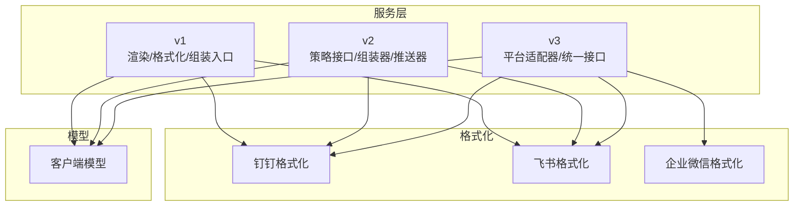
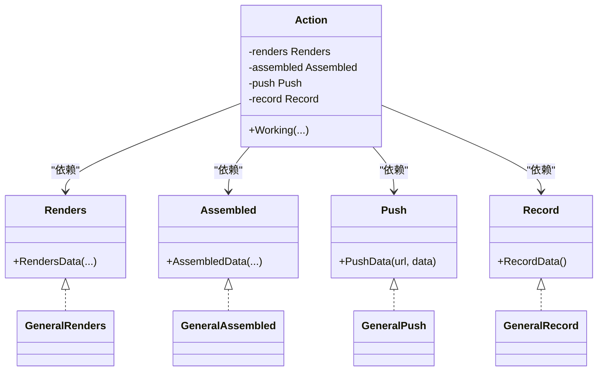
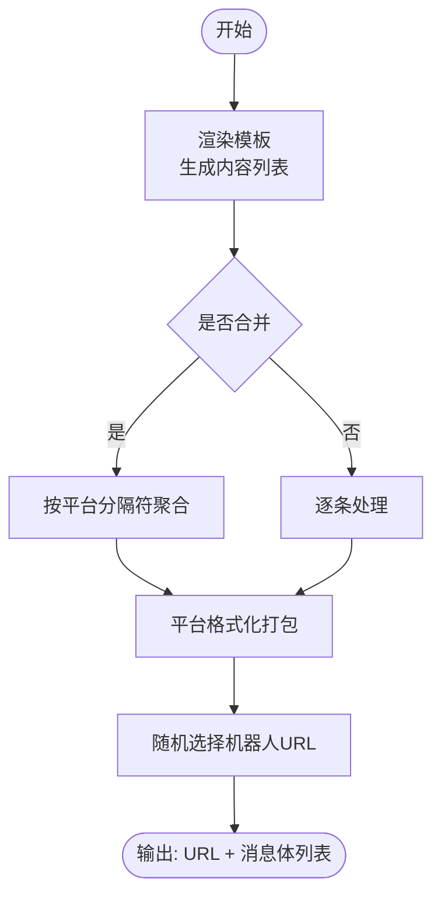
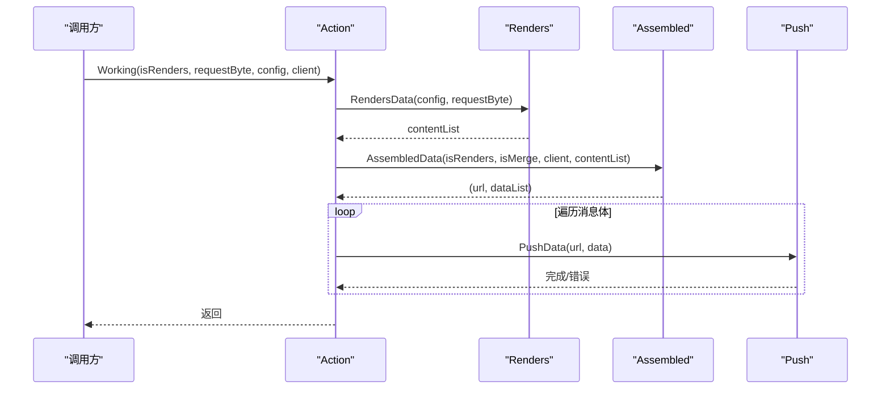
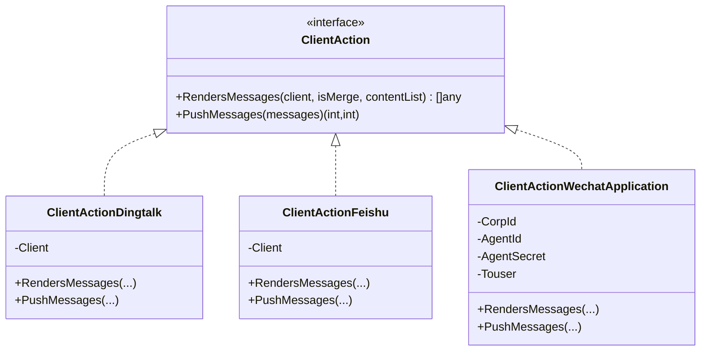
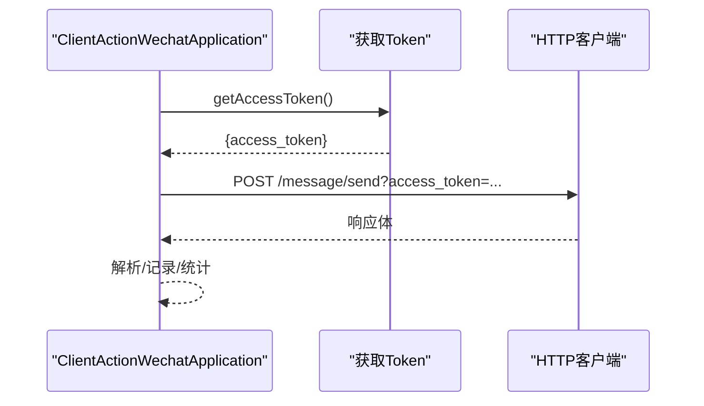
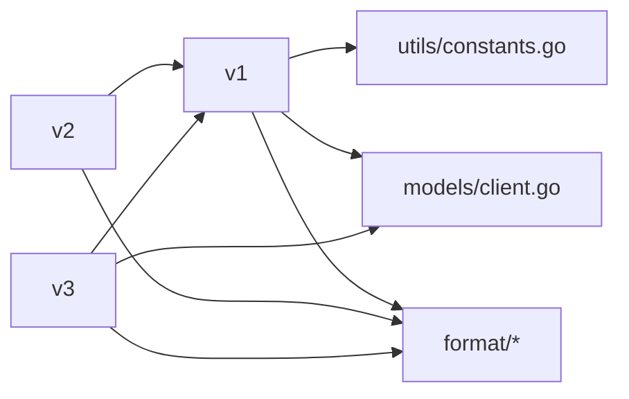

# 服务层

<cite>
**本文引用的文件**
- [pkg/services/core/v1/core.go](file://pkg/services/core/v1/core.go)
- [pkg/services/core/v1/format.go](file://pkg/services/core/v1/format.go)
- [pkg/services/core/v1/renders.go](file://pkg/services/core/v1/renders.go)
- [pkg/services/core/v2/assembled.go](file://pkg/services/core/v2/assembled.go)
- [pkg/services/core/v2/interfaces.go](file://pkg/services/core/v2/interfaces.go)
- [pkg/services/core/v2/push.go](file://pkg/services/core/v2/push.go)
- [pkg/services/core/v3/interfaces.go](file://pkg/services/core/v3/interfaces.go)
- [pkg/services/core/v3/dingtalk.go](file://pkg/services/core/v3/dingtalk.go)
- [pkg/services/core/v3/feishu.go](file://pkg/services/core/v3/feishu.go)
- [pkg/services/core/v3/wechat.go](file://pkg/services/core/v3/wechat.go)
- [pkg/services/format/dingtalk.go](file://pkg/services/format/dingtalk.go)
- [pkg/services/format/feishu.go](file://pkg/services/format/feishu.go)
- [pkg/services/format/wechat.go](file://pkg/services/format/wechat.go)
- [pkg/models/client.go](file://pkg/models/client.go)
- [pkg/utils/constants.go](file://pkg/utils/constants.go)
</cite>

## 目录
1. [简介](#简介)
2. [项目结构](#项目结构)
3. [核心组件](#核心组件)
4. [架构总览](#架构总览)
5. [详细组件分析](#详细组件分析)
6. [依赖分析](#依赖分析)
7. [性能考虑](#性能考虑)
8. [故障排查指南](#故障排查指南)
9. [结论](#结论)
10. [附录](#附录)

## 简介
本文件面向开发者，系统性梳理服务层的设计与实现，重点覆盖以下主题：
- 版本演进历程：v1 的基础格式化与渲染、v2 的组装模式与策略接口、v3 的平台适配器与统一接口
- 策略模式的应用：通过接口抽象渲染、组装、推送与记录，实现可插拔的处理链路
- 平台适配器设计：针对钉钉、飞书、企业微信等平台的消息格式化与推送
- 核心推送引擎工作原理：消息格式化、推送调度、错误处理与重试机制
- 不同版本服务层的差异与升级策略
- 扩展性设计与插件化机制

## 项目结构
服务层位于 pkg/services 下，按版本划分 v1/v2/v3，并在 v3 中引入统一的 ClientAction 接口；消息格式化位于 pkg/services/format；平台配置模型位于 pkg/models。

图表来源
- [pkg/services/core/v1/core.go:1-65](file://pkg/services/core/v1/core.go#L1-L65)
- [pkg/services/core/v2/assembled.go:1-140](file://pkg/services/core/v2/assembled.go#L1-L140)
- [pkg/services/core/v3/dingtalk.go:1-41](file://pkg/services/core/v3/dingtalk.go#L1-L41)
- [pkg/services/core/v3/feishu.go:1-40](file://pkg/services/core/v3/feishu.go#L1-L40)
- [pkg/services/core/v3/wechat.go:1-121](file://pkg/services/core/v3/wechat.go#L1-L121)
- [pkg/services/format/dingtalk.go:1-30](file://pkg/services/format/dingtalk.go#L1-L30)
- [pkg/services/format/feishu.go:1-61](file://pkg/services/format/feishu.go#L1-L61)
- [pkg/services/format/wechat.go:1-115](file://pkg/services/format/wechat.go#L1-L115)
- [pkg/models/client.go:1-239](file://pkg/models/client.go#L1-L239)

章节来源
- [pkg/services/core/v1/core.go:1-65](file://pkg/services/core/v1/core.go#L1-L65)
- [pkg/services/core/v2/assembled.go:1-140](file://pkg/services/core/v2/assembled.go#L1-L140)
- [pkg/services/core/v3/dingtalk.go:1-41](file://pkg/services/core/v3/dingtalk.go#L1-L41)
- [pkg/services/core/v3/feishu.go:1-40](file://pkg/services/core/v3/feishu.go#L1-L40)
- [pkg/services/core/v3/wechat.go:1-121](file://pkg/services/core/v3/wechat.go#L1-L121)
- [pkg/services/format/dingtalk.go:1-30](file://pkg/services/format/dingtalk.go#L1-L30)
- [pkg/services/format/feishu.go:1-61](file://pkg/services/format/feishu.go#L1-L61)
- [pkg/services/format/wechat.go:1-115](file://pkg/services/format/wechat.go#L1-L115)
- [pkg/models/client.go:1-239](file://pkg/models/client.go#L1-L239)

## 核心组件
- v1：提供基础渲染与格式化能力，按客户端类型进行消息组装与 URL 选择。
- v2：引入策略接口（Renders/Assembled/Push/Record），通过 Action 组合形成可插拔的处理链。
- v3：定义统一的 ClientAction 接口，按平台实现适配器（钉钉/飞书/企业微信），并在适配器内完成消息渲染与推送。
- format：各平台的消息体打包函数，输出符合平台要求的 JSON 结构。
- models：客户端配置与扩展字段，承载各平台的机器人或应用参数。

章节来源
- [pkg/services/core/v1/core.go:25-64](file://pkg/services/core/v1/core.go#L25-L64)
- [pkg/services/core/v2/interfaces.go:9-60](file://pkg/services/core/v2/interfaces.go#L9-L60)
- [pkg/services/core/v3/interfaces.go:7-11](file://pkg/services/core/v3/interfaces.go#L7-L11)
- [pkg/services/format/dingtalk.go:3-30](file://pkg/services/format/dingtalk.go#L3-L30)
- [pkg/services/format/feishu.go:7-61](file://pkg/services/format/feishu.go#L7-L61)
- [pkg/services/format/wechat.go:13-115](file://pkg/services/format/wechat.go#L13-L115)
- [pkg/models/client.go:13-28](file://pkg/models/client.go#L13-L28)

## 架构总览
服务层采用“策略+适配器”的组合架构：
- v1：集中式组装与推送，按客户端类型分支处理
- v2：通过接口解耦渲染、组装、推送与记录，Action 统一编排
- v3：平台适配器实现统一接口，内部复用 v1 的推送与格式化工具

图表来源
- [pkg/services/core/v2/interfaces.go:9-60](file://pkg/services/core/v2/interfaces.go#L9-L60)

章节来源
- [pkg/services/core/v2/interfaces.go:9-60](file://pkg/services/core/v2/interfaces.go#L9-L60)

## 详细组件分析

### v1：基础渲染与格式化
- 渲染与聚合
  - 渲染：基于模板与变量映射生成内容列表
  - 聚合：按客户端类型选择分隔符合并多条消息
- 格式化
  - 钉钉/飞书：根据关键字、是否@所有人、手机号列表等参数打包消息体
  - URL 选择：从客户端配置的机器人 URL 列表中随机挑选
- 组装
  - 遍历激活客户端，按类型调用对应格式化函数，产出 URL 与消息体列表

图表来源
- [pkg/services/core/v1/renders.go:15-127](file://pkg/services/core/v1/renders.go#L15-L127)
- [pkg/services/core/v1/format.go:10-62](file://pkg/services/core/v1/format.go#L10-L62)
- [pkg/services/core/v1/core.go:34-64](file://pkg/services/core/v1/core.go#L34-L64)

章节来源
- [pkg/services/core/v1/renders.go:15-127](file://pkg/services/core/v1/renders.go#L15-L127)
- [pkg/services/core/v1/format.go:10-62](file://pkg/services/core/v1/format.go#L10-L62)
- [pkg/services/core/v1/core.go:34-64](file://pkg/services/core/v1/core.go#L34-L64)

### v2：策略接口与组装器
- 接口
  - Renders：负责渲染请求数据为内容列表
  - Assembled：负责按客户端类型组装消息体与 URL
  - Push：负责推送单条消息
  - Record：负责记录推送结果
- Action 工作流
  - 调用 Renders 生成内容列表
  - 调用 Assembled 生成 URL 与消息体集合
  - 遍历消息体调用 Push 推送
  - 调用 Record 记录

图表来源
- [pkg/services/core/v2/interfaces.go:48-60](file://pkg/services/core/v2/interfaces.go#L48-L60)
- [pkg/services/core/v2/assembled.go:17-29](file://pkg/services/core/v2/assembled.go#L17-L29)
- [pkg/services/core/v2/push.go:19-22](file://pkg/services/core/v2/push.go#L19-L22)

章节来源
- [pkg/services/core/v2/interfaces.go:9-60](file://pkg/services/core/v2/interfaces.go#L9-L60)
- [pkg/services/core/v2/assembled.go:17-29](file://pkg/services/core/v2/assembled.go#L17-L29)
- [pkg/services/core/v2/push.go:19-22](file://pkg/services/core/v2/push.go#L19-L22)

### v3：平台适配器与统一接口
- 统一接口
  - ClientAction：定义 RendersMessages 与 PushMessages 两个方法
- 适配器实现
  - 钉钉：按关键字与是否合并生成消息体，随机选择 URL 推送
  - 飞书：按标题颜色与关键字生成卡片消息体，随机选择 URL 推送
  - 企业微信应用：按 AgentId/Touser 等参数生成 markdown 消息体，获取 token 后推送
- 与 v1 的关系
  - 适配器内部仍可复用 v1 的聚合与推送工具函数

图表来源
- [pkg/services/core/v3/interfaces.go:7-11](file://pkg/services/core/v3/interfaces.go#L7-L11)
- [pkg/services/core/v3/dingtalk.go:10-41](file://pkg/services/core/v3/dingtalk.go#L10-L41)
- [pkg/services/core/v3/feishu.go:10-40](file://pkg/services/core/v3/feishu.go#L10-L40)
- [pkg/services/core/v3/wechat.go:17-121](file://pkg/services/core/v3/wechat.go#L17-L121)

章节来源
- [pkg/services/core/v3/interfaces.go:7-11](file://pkg/services/core/v3/interfaces.go#L7-L11)
- [pkg/services/core/v3/dingtalk.go:10-41](file://pkg/services/core/v3/dingtalk.go#L10-L41)
- [pkg/services/core/v3/feishu.go:10-40](file://pkg/services/core/v3/feishu.go#L10-L40)
- [pkg/services/core/v3/wechat.go:17-121](file://pkg/services/core/v3/wechat.go#L17-L121)

### 消息格式化与平台集成
- 钉钉
  - 输入：关键字、消息正文、是否@所有人、手机号列表
  - 输出：包含 msgtype/markdown/at 的 JSON 对象
- 飞书
  - 输入：客户端配置（关键字、标题颜色）、消息正文
  - 输出：包含 msg_type/card/header/elements 的卡片消息
- 企业微信应用
  - 输入：CorpId/AgentId/Secret/Touser、消息正文
  - 流程：获取 access_token -> 序列化消息体 -> 发送消息 -> 处理响应

图表来源
- [pkg/services/core/v3/wechat.go:94-120](file://pkg/services/core/v3/wechat.go#L94-L120)
- [pkg/services/format/wechat.go:42-115](file://pkg/services/format/wechat.go#L42-L115)

章节来源
- [pkg/services/format/dingtalk.go:3-30](file://pkg/services/format/dingtalk.go#L3-L30)
- [pkg/services/format/feishu.go:7-61](file://pkg/services/format/feishu.go#L7-L61)
- [pkg/services/format/wechat.go:13-115](file://pkg/services/format/wechat.go#L13-L115)
- [pkg/services/core/v3/wechat.go:94-120](file://pkg/services/core/v3/wechat.go#L94-L120)

### 错误处理与重试机制
- v1/v2/v3 均在关键步骤记录日志并短路返回，避免级联错误
- 企业微信应用适配器在推送失败时增加失败计数，便于统计
- 建议在生产环境引入指数退避与幂等键，以实现可靠重试

章节来源
- [pkg/services/core/v2/push.go:32-78](file://pkg/services/core/v2/push.go#L32-L78)
- [pkg/services/core/v3/wechat.go:55-91](file://pkg/services/core/v3/wechat.go#L55-L91)
- [pkg/services/format/wechat.go:42-115](file://pkg/services/format/wechat.go#L42-L115)

### 版本差异与升级策略
- v1 → v2
  - 从集中式组装转向策略接口，提升可测试性与可扩展性
  - 引入 Action 编排器，统一处理链路
- v2 → v3
  - 抽象统一接口 ClientAction，按平台实现适配器
  - 适配器内部可复用 v1 的聚合与推送工具，降低重复实现
- 升级建议
  - 优先迁移至 v3，利用统一接口与适配器隔离平台差异
  - 保持 v1/v2 的兼容期，逐步替换调用方

章节来源
- [pkg/services/core/v2/assembled.go:17-29](file://pkg/services/core/v2/assembled.go#L17-L29)
- [pkg/services/core/v3/interfaces.go:7-11](file://pkg/services/core/v3/interfaces.go#L7-L11)
- [pkg/services/core/v3/dingtalk.go:14-40](file://pkg/services/core/v3/dingtalk.go#L14-L40)
- [pkg/services/core/v3/feishu.go:14-40](file://pkg/services/core/v3/feishu.go#L14-L40)
- [pkg/services/core/v3/wechat.go:24-91](file://pkg/services/core/v3/wechat.go#L24-L91)

## 依赖分析
- v1 依赖 models 与 utils 常量，格式化依赖 format 包
- v2 在 v1 基础上引入 format 包用于消息体构造
- v3 依赖 v1 的聚合与推送工具，同时依赖 format 包与 models

图表来源
- [pkg/services/core/v1/core.go:3-7](file://pkg/services/core/v1/core.go#L3-L7)
- [pkg/services/core/v2/assembled.go:3-10](file://pkg/services/core/v2/assembled.go#L3-L10)
- [pkg/services/core/v3/dingtalk.go:3-8](file://pkg/services/core/v3/dingtalk.go#L3-L8)
- [pkg/utils/constants.go:3-9](file://pkg/utils/constants.go#L3-L9)
- [pkg/models/client.go:13-28](file://pkg/models/client.go#L13-L28)

章节来源
- [pkg/services/core/v1/core.go:3-7](file://pkg/services/core/v1/core.go#L3-L7)
- [pkg/services/core/v2/assembled.go:3-10](file://pkg/services/core/v2/assembled.go#L3-L10)
- [pkg/services/core/v3/dingtalk.go:3-8](file://pkg/services/core/v3/dingtalk.go#L3-L8)
- [pkg/utils/constants.go:3-9](file://pkg/utils/constants.go#L3-L9)
- [pkg/models/client.go:13-28](file://pkg/models/client.go#L13-L28)

## 性能考虑
- 消息聚合
  - v1/v3 使用分隔符聚合多条消息，减少推送次数；注意控制单次聚合大小，避免超过平台限制
- URL 随机选择
  - v1/v3 从多机器人 URL 中随机选择，有助于分散压力；建议结合健康检查与降级策略
- 序列化与网络
  - 企业微信应用适配器在推送前进行序列化与 token 获取，建议缓存 token 并设置过期时间
- 日志与可观测性
  - 在关键路径增加埋点与指标采集，便于定位性能瓶颈

## 故障排查指南
- 模板渲染失败
  - 检查模板语法与变量映射，确认时区与时钟同步
- 平台推送失败
  - 核对 access_token 获取与有效期；检查消息体结构与必填字段
- URL 选择异常
  - 确认客户端配置的机器人 URL 列表是否正确；检查随机算法与回退策略
- 记录与统计
  - 使用 v2 的 Record 接口或 v3 的返回值统计成功/失败数量，辅助问题定位

章节来源
- [pkg/services/core/v1/renders.go:26-60](file://pkg/services/core/v1/renders.go#L26-L60)
- [pkg/services/core/v3/wechat.go:55-91](file://pkg/services/core/v3/wechat.go#L55-L91)

## 结论
服务层通过 v1→v2→v3 的演进，实现了从集中式到策略化再到适配器化的架构升级。v3 的统一接口与平台适配器显著提升了扩展性与可维护性，配合 format 包与 models 的清晰职责划分，形成了高内聚低耦合的消息推送体系。建议在生产环境中结合日志、监控与重试策略，确保稳定性与可靠性。

## 附录
- 关键常量
  - 平台类型常量：钉钉、飞书、企业微信机器人、企业微信应用
- 数据模型
  - 客户端模型包含基础信息与各平台扩展字段，支撑多平台配置

章节来源
- [pkg/utils/constants.go:3-9](file://pkg/utils/constants.go#L3-L9)
- [pkg/models/client.go:13-28](file://pkg/models/client.go#L13-L28)