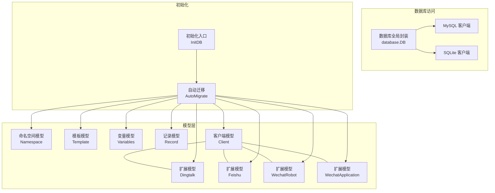
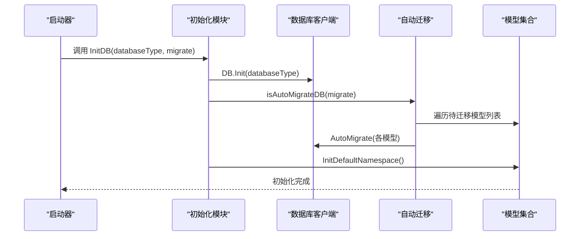
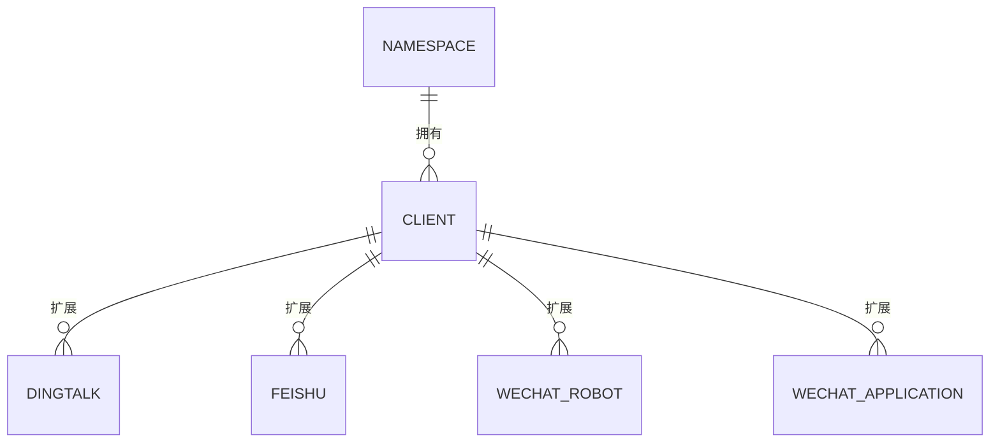
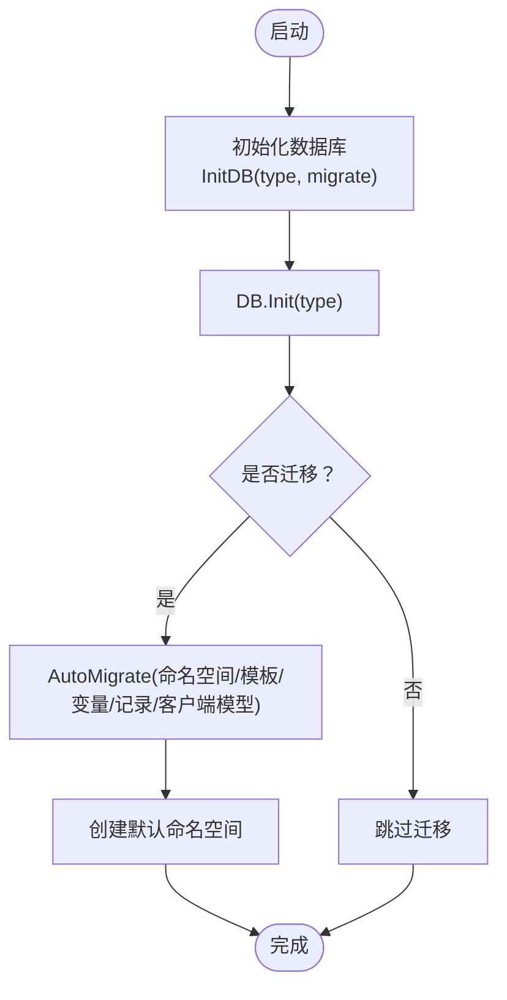
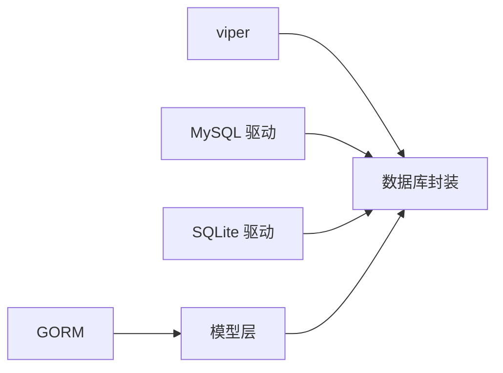

# 模型层

<cite>
**本文引用的文件**
- [pkg/models/client.go](file://pkg/models/client.go)
- [pkg/models/client_dingtalk.go](file://pkg/models/client_dingtalk.go)
- [pkg/models/client_feishu.go](file://pkg/models/client_feishu.go)
- [pkg/models/client_wechat.go](file://pkg/models/client_wechat.go)
- [pkg/models/client_wechat_application.go](file://pkg/models/client_wechat_application.go)
- [pkg/models/namespace.go](file://pkg/models/namespace.go)
- [pkg/models/namespace_init.go](file://pkg/models/namespace_init.go)
- [pkg/models/template.go](file://pkg/models/template.go)
- [pkg/models/record.go](file://pkg/models/record.go)
- [pkg/models/variabels.go](file://pkg/models/variabels.go)
- [pkg/utils/database/global.go](file://pkg/utils/database/global.go)
- [pkg/utils/database/mysql.go](file://pkg/utils/database/mysql.go)
- [pkg/utils/database/sqlite.go](file://pkg/utils/database/sqlite.go)
- [pkg/utils/initialize/db.go](file://pkg/utils/initialize/db.go)
- [pkg/utils/constants.go](file://pkg/utils/constants.go)
</cite>

## 目录
1. [简介](#简介)
2. [项目结构](#项目结构)
3. [核心组件](#核心组件)
4. [架构总览](#架构总览)
5. [详细组件分析](#详细组件分析)
6. [依赖分析](#依赖分析)
7. [性能考虑](#性能考虑)
8. [故障排查指南](#故障排查指南)
9. [结论](#结论)
10. [附录](#附录)

## 简介
本文件面向开发者，系统梳理模型层的数据持久化设计与 ORM 映射机制，重点围绕 GORM 的使用方式、数据库表结构设计、实体关系映射、字段与约束、索引设计、生命周期管理、数据校验与关联查询方式进行深入说明。文档覆盖以下模型：客户端模型、命名空间模型、模板模型、记录模型、变量模型，以及与之配套的扩展客户端模型（钉钉、飞书、企业微信机器人、企业微信应用）。同时给出 CRUD、复杂查询与事务处理的实践建议，并总结模型层与数据库的交互模式与性能优化策略。

## 项目结构
模型层位于 pkg/models，采用“按领域分层 + 聚合模型”的组织方式：
- 基础模型：命名空间、模板、变量、记录
- 客户端模型：Client 及其扩展模型（钉钉、飞书、企业微信机器人、企业微信应用）
- 数据访问：通过统一的数据库客户端封装，支持 MySQL 与 SQLite
- 初始化：在启动阶段执行数据库迁移与默认数据初始化

图表来源
- [pkg/models/client.go:13-28](file://pkg/models/client.go#L13-L28)
- [pkg/models/client_dingtalk.go:21-33](file://pkg/models/client_dingtalk.go#L21-L33)
- [pkg/models/client_feishu.go:8-18](file://pkg/models/client_feishu.go#L8-L18)
- [pkg/models/client_wechat.go:8-18](file://pkg/models/client_wechat.go#L8-L18)
- [pkg/models/client_wechat_application.go:8-18](file://pkg/models/client_wechat_application.go#L8-L18)
- [pkg/models/namespace.go:12-22](file://pkg/models/namespace.go#L12-L22)
- [pkg/models/template.go:9-18](file://pkg/models/template.go#L9-L18)
- [pkg/models/variabels.go:9-18](file://pkg/models/variabels.go#L9-L18)
- [pkg/models/record.go:9-18](file://pkg/models/record.go#L9-L18)
- [pkg/utils/database/global.go:5-12](file://pkg/utils/database/global.go#L5-L12)
- [pkg/utils/database/mysql.go:12-52](file://pkg/utils/database/mysql.go#L12-L52)
- [pkg/utils/database/sqlite.go:13-47](file://pkg/utils/database/sqlite.go#L13-L47)
- [pkg/utils/initialize/db.go:11-48](file://pkg/utils/initialize/db.go#L11-L48)

章节来源
- [pkg/models/client.go:1-239](file://pkg/models/client.go#L1-L239)
- [pkg/models/namespace.go:1-106](file://pkg/models/namespace.go#L1-L106)
- [pkg/models/template.go:1-72](file://pkg/models/template.go#L1-L72)
- [pkg/models/variabels.go:1-89](file://pkg/models/variabels.go#L1-L89)
- [pkg/models/record.go:1-29](file://pkg/models/record.go#L1-L29)
- [pkg/models/client_dingtalk.go:1-38](file://pkg/models/client_dingtalk.go#L1-L38)
- [pkg/models/client_feishu.go:1-24](file://pkg/models/client_feishu.go#L1-L24)
- [pkg/models/client_wechat.go:1-24](file://pkg/models/client_wechat.go#L1-L24)
- [pkg/models/client_wechat_application.go:1-24](file://pkg/models/client_wechat_application.go#L1-L24)
- [pkg/utils/database/global.go:1-36](file://pkg/utils/database/global.go#L1-L36)
- [pkg/utils/database/mysql.go:1-53](file://pkg/utils/database/mysql.go#L1-L53)
- [pkg/utils/database/sqlite.go:1-48](file://pkg/utils/database/sqlite.go#L1-L48)
- [pkg/utils/initialize/db.go:1-60](file://pkg/utils/initialize/db.go#L1-L60)

## 核心组件
- 数据库客户端封装：统一暴露 Default/Mysql/Sqlite3 客户端，便于切换与扩展
- 模型与表映射：每个模型均实现 TableName()，确保与实际表名一致
- 自动迁移：在启动时按需迁移命名空间、模板、变量、记录及各类客户端相关表
- 默认数据初始化：首次运行自动创建默认命名空间、内置模板与变量映射

章节来源
- [pkg/utils/database/global.go:5-12](file://pkg/utils/database/global.go#L5-L12)
- [pkg/utils/initialize/db.go:22-48](file://pkg/utils/initialize/db.go#L22-L48)
- [pkg/models/namespace_init.go:8-31](file://pkg/models/namespace_init.go#L8-L31)

## 架构总览
模型层通过 GORM 与数据库交互，遵循“模型即表”的约定，结合常量与扩展模型实现多平台客户端的统一管理。初始化流程负责数据库连接、迁移与默认数据注入。

图表来源
- [pkg/utils/initialize/db.go:11-48](file://pkg/utils/initialize/db.go#L11-L48)
- [pkg/utils/database/global.go:14-35](file://pkg/utils/database/global.go#L14-L35)
- [pkg/models/namespace_init.go:8-31](file://pkg/models/namespace_init.go#L8-L31)

## 详细组件分析

### 命名空间模型（Namespace）
- 表名：namespaces
- 关键字段与约束
  - 名称唯一且非空
  - 是否激活，默认 true
  - 是否启用渲染，默认 true
- 生命周期与操作
  - 创建：AddNamespace
  - 更新：UpdateNamespace
  - 删除：DeleteNamespace（软删除前重命名）
  - 查询：ListNamespace、GetNamespaceById、GetNamespaceByName、IsNamespaceExist
- 索引与性能
  - DeletedAt 建有索引，支持软删除场景的高效查询
- 默认数据
  - 启动时创建默认命名空间并初始化模板与变量映射

章节来源
- [pkg/models/namespace.go:12-22](file://pkg/models/namespace.go#L12-L22)
- [pkg/models/namespace.go:28-105](file://pkg/models/namespace.go#L28-L105)
- [pkg/models/namespace_init.go:8-31](file://pkg/models/namespace_init.go#L8-L31)
- [pkg/models/namespace_init.go:33-93](file://pkg/models/namespace_init.go#L33-L93)

### 模板模型（Template）
- 表名：templates
- 关键字段与约束
  - 命名空间分区字段
  - 模板名称
  - 模板内容（JSON/文本）
  - 是否合并标志位
- 生命周期与操作
  - 创建、更新、删除、按命名空间或 ID 查询
- 索引与性能
  - DeletedAt 建有索引；建议在 namespace 上建立索引以提升按命名空间查询性能

章节来源
- [pkg/models/template.go:9-18](file://pkg/models/template.go#L9-L18)
- [pkg/models/template.go:24-71](file://pkg/models/template.go#L24-L71)

### 变量模型（Variables）
- 表名：variables
- 关键字段与约束
  - 命名空间分区字段
  - 键值对
  - 描述
- 生命周期与操作
  - 创建、更新、删除、按命名空间列出、按 ID 查询
  - 批量写入：UpdateAddVars
- 索引与性能
  - DeletedAt 建有索引；建议在 namespace 上建立索引以提升按命名空间查询性能

章节来源
- [pkg/models/variabels.go:9-18](file://pkg/models/variabels.go#L9-L18)
- [pkg/models/variabels.go:24-88](file://pkg/models/variabels.go#L24-L88)

### 记录模型（Record）
- 表名：records
- 关键字段与约束
  - 发送来源 IP
  - 命名空间
  - 请求 URL
  - 客户端信息
- 生命周期与操作
  - 新增记录：AddRecord
- 索引与性能
  - DeletedAt 建有索引；建议在 namespace 与 createdAt 上建立复合索引以支持审计与统计

章节来源
- [pkg/models/record.go:9-18](file://pkg/models/record.go#L9-L18)
- [pkg/models/record.go:24-28](file://pkg/models/record.go#L24-L28)

### 客户端模型（Client）与扩展模型
- 表名
  - 主表：clients
  - 扩展表：client_dingtalk、client_feishu、client_wechat_robot、client_wechat_application
- 关键字段与约束
  - 主表包含命名空间、名称、描述、类型、激活状态、扩展 JSON 字段
  - 扩展表按平台存储平台特有配置（如机器人关键字、机器人 URL、应用号 CorpId/AgentId/Secret 等）
- 生命周期与操作
  - 创建：AddClient（根据类型分别写入主表与扩展表）
  - 更新：UpdateClientInfo（更新主表与对应扩展表）
  - 删除：DeleteClient（物理删除）
  - 查询：GetClientById、GetClientLiteById、ListClient、GetActiveClient
- 关系映射
  - 扩展模型通过 ClientId 与主表关联
  - 主表 ClientType 决定扩展模型类型
- 索引与性能
  - DeletedAt 建有索引；建议在 clients.namespace 与 clients.client_type 建索引以提升筛选性能
- 平台常量
  - 使用统一常量标识平台类型，避免魔法字符串

图表来源
- [pkg/models/client.go:13-28](file://pkg/models/client.go#L13-L28)
- [pkg/models/client_dingtalk.go:21-33](file://pkg/models/client_dingtalk.go#L21-L33)
- [pkg/models/client_feishu.go:8-18](file://pkg/models/client_feishu.go#L8-L18)
- [pkg/models/client_wechat.go:8-18](file://pkg/models/client_wechat.go#L8-L18)
- [pkg/models/client_wechat_application.go:8-18](file://pkg/models/client_wechat_application.go#L8-L18)

章节来源
- [pkg/models/client.go:13-239](file://pkg/models/client.go#L13-L239)
- [pkg/models/client_dingtalk.go:9-33](file://pkg/models/client_dingtalk.go#L9-L33)
- [pkg/models/client_feishu.go:8-18](file://pkg/models/client_feishu.go#L8-L18)
- [pkg/models/client_wechat.go:8-18](file://pkg/models/client_wechat.go#L8-L18)
- [pkg/models/client_wechat_application.go:8-18](file://pkg/models/client_wechat_application.go#L8-L18)
- [pkg/utils/constants.go:3-8](file://pkg/utils/constants.go#L3-L8)

### 数据库连接与初始化
- 数据库客户端
  - 支持 MySQL 与 SQLite，统一通过 database.DB.Default 访问
  - MySQL 连接参数来自配置中心，连接池参数可调
  - SQLite 连接参数来自配置中心，自动确保存储目录存在
- 初始化流程
  - InitDB：初始化数据库客户端并可选执行自动迁移
  - isAutoMigrateDB：对命名空间、模板、变量、记录及各类客户端模型执行迁移
  - InitDefaultNamespace：创建默认命名空间并初始化模板与变量映射

图表来源
- [pkg/utils/initialize/db.go:11-48](file://pkg/utils/initialize/db.go#L11-L48)
- [pkg/utils/database/global.go:14-35](file://pkg/utils/database/global.go#L14-L35)
- [pkg/utils/database/mysql.go:12-52](file://pkg/utils/database/mysql.go#L12-L52)
- [pkg/utils/database/sqlite.go:13-47](file://pkg/utils/database/sqlite.go#L13-L47)
- [pkg/models/namespace_init.go:8-31](file://pkg/models/namespace_init.go#L8-L31)

章节来源
- [pkg/utils/database/global.go:5-35](file://pkg/utils/database/global.go#L5-L35)
- [pkg/utils/database/mysql.go:12-52](file://pkg/utils/database/mysql.go#L12-L52)
- [pkg/utils/database/sqlite.go:13-47](file://pkg/utils/database/sqlite.go#L13-L47)
- [pkg/utils/initialize/db.go:11-60](file://pkg/utils/initialize/db.go#L11-L60)
- [pkg/models/namespace_init.go:8-31](file://pkg/models/namespace_init.go#L8-L31)

## 依赖分析
- 组件耦合
  - 模型层仅依赖 GORM 与数据库封装，低耦合
  - 扩展模型通过 ClientId 与主表弱耦合，避免强外键约束
- 外部依赖
  - GORM：ORM 框架
  - MySQL/SQLite 驱动：数据库驱动
  - viper：配置中心
- 循环依赖
  - 未发现循环依赖

图表来源
- [pkg/utils/database/mysql.go:3-21](file://pkg/utils/database/mysql.go#L3-L21)
- [pkg/utils/database/sqlite.go:13-47](file://pkg/utils/database/sqlite.go#L13-L47)
- [pkg/utils/database/global.go:5-12](file://pkg/utils/database/global.go#L5-L12)

章节来源
- [pkg/utils/database/mysql.go:1-53](file://pkg/utils/database/mysql.go#L1-L53)
- [pkg/utils/database/sqlite.go:1-48](file://pkg/utils/database/sqlite.go#L1-L48)
- [pkg/utils/database/global.go:1-36](file://pkg/utils/database/global.go#L1-L36)

## 性能考虑
- 连接池
  - MySQL：最大空闲连接、最大活跃连接、连接生命周期可配置
  - SQLite：最大空闲连接、最大活跃连接可配置
- 索引策略
  - 已在 DeletedAt 建索引，建议在 namespace、client_type、createdAt 等高频查询字段上补充索引
- 查询优化
  - 使用 Select 精简字段（如 ClientLite）
  - 使用 Where 条件与 Order 提升查询效率
  - 批量写入使用 Omit 与 Updates 减少冗余字段更新
- 迁移幂等
  - AutoMigrate 保证结构变更幂等，避免重复字段

章节来源
- [pkg/utils/database/mysql.go:38-51](file://pkg/utils/database/mysql.go#L38-L51)
- [pkg/utils/database/sqlite.go:35-46](file://pkg/utils/database/sqlite.go#L35-L46)
- [pkg/models/client.go:212-218](file://pkg/models/client.go#L212-L218)
- [pkg/utils/initialize/db.go:50-59](file://pkg/utils/initialize/db.go#L50-L59)

## 故障排查指南
- 连接失败
  - 检查数据库类型与配置项是否正确
  - 查看连接池参数与日志输出
- 迁移失败
  - 确认 AutoMigrate 的模型列表包含目标表
  - 检查权限与数据库版本兼容性
- 查询异常
  - 校验 DeletedAt 索引与自定义索引是否生效
  - 使用最小字段集查询（Select）定位问题
- 数据不一致
  - 对于扩展模型，确认 ClientId 与主表 ID 匹配
  - 校验 ClientType 与扩展模型类型一致

章节来源
- [pkg/utils/database/mysql.go:30-36](file://pkg/utils/database/mysql.go#L30-L36)
- [pkg/utils/database/sqlite.go:28-33](file://pkg/utils/database/sqlite.go#L28-L33)
- [pkg/utils/initialize/db.go:50-59](file://pkg/utils/initialize/db.go#L50-L59)
- [pkg/models/client.go:40-87](file://pkg/models/client.go#L40-L87)

## 结论
模型层通过清晰的表结构设计与 GORM 映射，实现了多平台客户端的统一管理与默认数据初始化。配合可配置的数据库连接与自动迁移机制，满足开发与运维的灵活性需求。建议在生产环境中进一步完善索引策略与监控告警，持续优化查询与写入性能。

## 附录
- 常用操作参考路径
  - 创建命名空间：[AddNamespace:28-38](file://pkg/models/namespace.go#L28-L38)
  - 更新模板：[UpdateTemplate:41-53](file://pkg/models/template.go#L41-L53)
  - 批量写入变量：[UpdateAddVars:65-88](file://pkg/models/variabels.go#L65-L88)
  - 创建客户端并写入扩展表：[AddClient:40-87](file://pkg/models/client.go#L40-L87)
  - 查询激活客户端：[GetActiveClient:230-238](file://pkg/models/client.go#L230-L238)
  - 添加发送记录：[AddRecord:24-28](file://pkg/models/record.go#L24-L28)
  - 初始化默认命名空间：[InitDefaultNamespace:8-31](file://pkg/models/namespace_init.go#L8-L31)
  - 初始化模板与变量映射：[InitTemplate/InitVarMap:33-93](file://pkg/models/namespace_init.go#L33-L93)
  - 数据库初始化与迁移：[InitDB/isAutoMigrateDB:11-48](file://pkg/utils/initialize/db.go#L11-L48)
  - 数据库客户端初始化：[DB.Init:14-35](file://pkg/utils/database/global.go#L14-L35)
  - MySQL 连接与连接池：[mysqlClient/openMysqlConnector:12-52](file://pkg/utils/database/mysql.go#L12-L52)
  - SQLite 连接与连接池：[sqlite3Client/openSqlite3Connector:13-47](file://pkg/utils/database/sqlite.go#L13-L47)