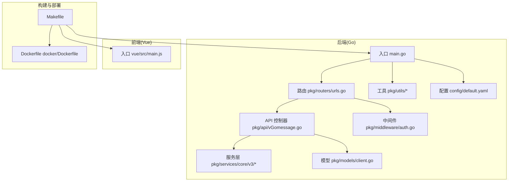
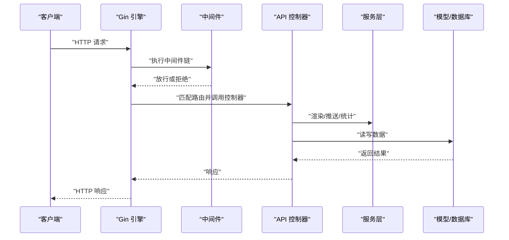
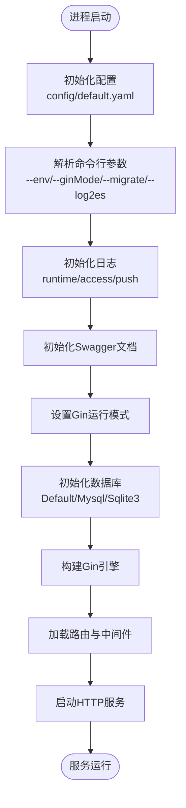
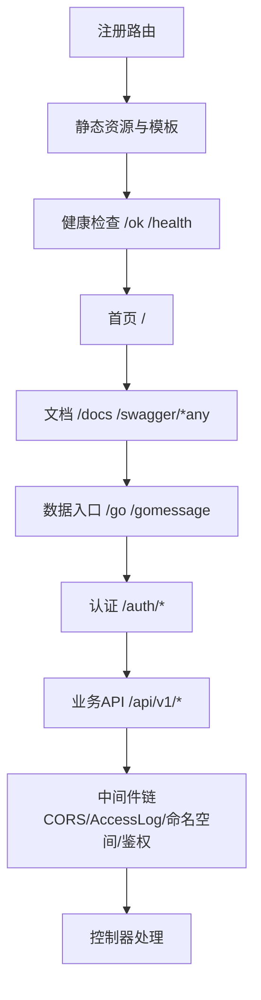
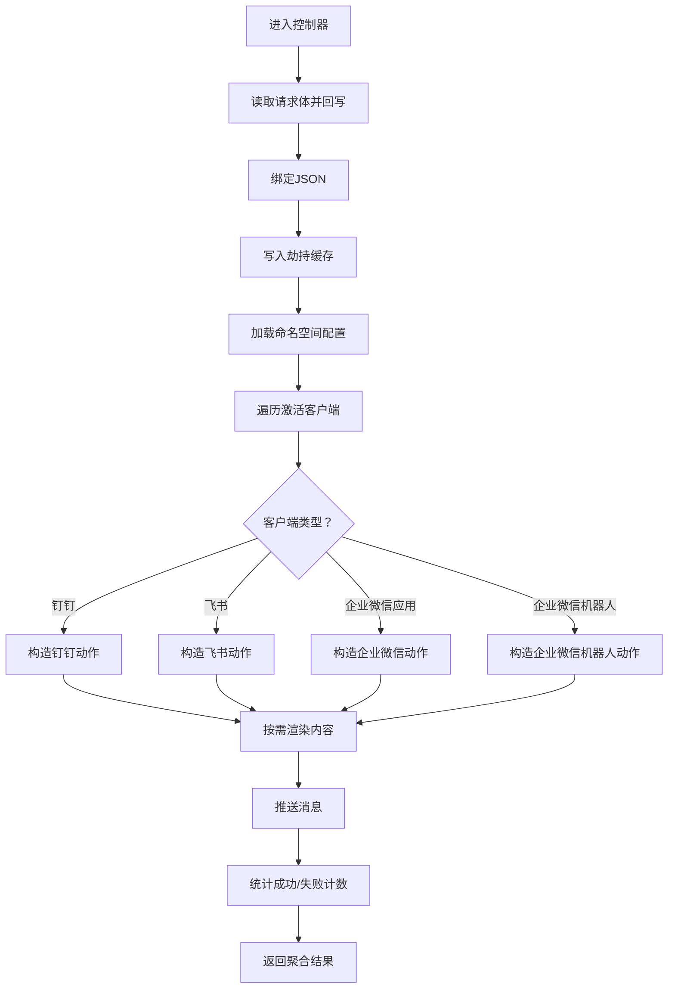
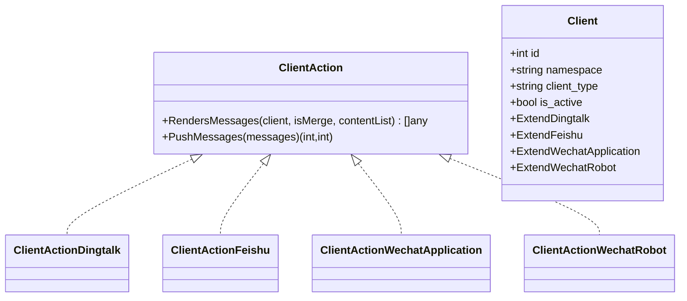
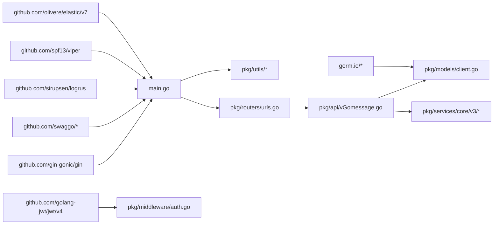

# 文件导航指南

<cite>
**本文引用的文件**
- [main.go](file://main.go)
- [cmd/uploads/main.go](file://cmd/uploads/main.go)
- [config/default.yaml](file://config/default.yaml)
- [pkg/routers/urls.go](file://pkg/routers/urls.go)
- [pkg/api/vGomessage.go](file://pkg/api/vGomessage.go)
- [pkg/middleware/auth.go](file://pkg/middleware/auth.go)
- [pkg/services/core/v3/interfaces.go](file://pkg/services/core/v3/interfaces.go)
- [pkg/models/client.go](file://pkg/models/client.go)
- [pkg/utils/initialize/cmd.go](file://pkg/utils/initialize/cmd.go)
- [pkg/utils/database/global.go](file://pkg/utils/database/global.go)
- [Makefile](file://Makefile)
- [docker/Dockerfile](file://docker/Dockerfile)
- [go.mod](file://go.mod)
- [vue/src/main.js](file://vue/src/main.js)
</cite>

## 目录
1. [简介](#简介)
2. [项目结构](#项目结构)
3. [核心组件](#核心组件)
4. [架构总览](#架构总览)
5. [详细组件分析](#详细组件分析)
6. [依赖关系分析](#依赖关系分析)
7. [性能考量](#性能考量)
8. [故障排查指南](#故障排查指南)
9. [结论](#结论)
10. [附录](#附录)

## 简介
本指南面向开发者，提供一份系统化的“文件导航”手册，帮助你快速定位与理解项目中的关键文件与职责边界，包括入口文件、配置、路由、API 控制器、中间件、服务层、模型与数据库、构建与部署脚本等。同时给出按功能场景的“查找路径”，以及搜索技巧与工具建议。

## 项目结构
项目采用“后端 Go + 前端 Vue”的双栈结构，后端以 Gin 为核心，通过统一入口启动服务，加载路由与中间件；前端通过构建产物作为静态资源嵌入后端；另有独立的上传发布工具用于打包与发布。

图表来源
- [main.go:1-56](file://main.go#L1-L56)
- [pkg/routers/urls.go:1-109](file://pkg/routers/urls.go#L1-L109)
- [pkg/api/vGomessage.go:1-173](file://pkg/api/vGomessage.go#L1-L173)
- [pkg/middleware/auth.go:1-62](file://pkg/middleware/auth.go#L1-L62)
- [pkg/services/core/v3/interfaces.go:1-11](file://pkg/services/core/v3/interfaces.go#L1-L11)
- [pkg/models/client.go:1-239](file://pkg/models/client.go#L1-L239)
- [pkg/utils/initialize/cmd.go:1-99](file://pkg/utils/initialize/cmd.go#L1-L99)
- [config/default.yaml:1-83](file://config/default.yaml#L1-L83)
- [Makefile:1-235](file://Makefile#L1-L235)
- [docker/Dockerfile:1-20](file://docker/Dockerfile#L1-L20)
- [vue/src/main.js:1-32](file://vue/src/main.js#L1-L32)

章节来源
- [main.go:1-56](file://main.go#L1-L56)
- [pkg/routers/urls.go:1-109](file://pkg/routers/urls.go#L1-L109)
- [Makefile:1-235](file://Makefile#L1-L235)

## 核心组件
- 入口与启动
  - 后端入口：[main.go:1-56](file://main.go#L1-L56)，负责初始化配置、命令行参数、日志、Swagger、Gin 模式与数据库，最后启动 HTTP 服务。
  - 发布上传工具：[cmd/uploads/main.go:1-307](file://cmd/uploads/main.go#L1-L307)，用于 GitHub Release 创建、资产上传与清理。
- 配置
  - 默认配置：[config/default.yaml:1-83](file://config/default.yaml#L1-L83)，涵盖全局环境、鉴权、服务监听、日志、数据库类型与连接参数等。
  - 命令行覆盖：[pkg/utils/initialize/cmd.go:1-99](file://pkg/utils/initialize/cmd.go#L1-L99)，支持 --env、--ginMode、--migrate、--log2es 等参数覆盖配置。
- 路由与中间件
  - 路由定义：[pkg/routers/urls.go:1-109](file://pkg/routers/urls.go#L1-L109)，注册静态资源、健康检查、首页、Swagger、命名空间数据入口、认证与业务 API。
  - 认证中间件：[pkg/middleware/auth.go:1-62](file://pkg/middleware/auth.go#L1-L62)，校验 JWT 并注入用户信息。
- API 控制器
  - 核心控制器：[pkg/api/vGomessage.go:1-173](file://pkg/api/vGomessage.go#L1-L173)，处理 /go/:namespace 的 GET/POST 请求，负责劫持、渲染、推送与统计。
- 服务层
  - 接口抽象：[pkg/services/core/v3/interfaces.go:1-11](file://pkg/services/core/v3/interfaces.go#L1-L11)，定义 ClientAction 接口，统一不同客户端的消息渲染与推送行为。
- 模型与数据库
  - 客户端模型：[pkg/models/client.go:1-239](file://pkg/models/client.go#L1-L239)，提供客户端 CRUD、激活状态管理与关联扩展信息。
  - 数据库客户端：[pkg/utils/database/global.go:1-36](file://pkg/utils/database/global.go#L1-L36)，统一管理 Default/Mysql/Sqlite3 客户端。
- 构建与部署
  - 构建脚本：[Makefile:1-235](file://Makefile#L1-L235)，包含前端构建、多平台编译、Swagger 生成、Docker 镜像与 Helm 打包、GitHub 包上传。
  - 容器镜像：[docker/Dockerfile:1-20](file://docker/Dockerfile#L1-L20)，Alpine 基础镜像，暴露 7077 端口，入口为二进制。

章节来源
- [main.go:13-35](file://main.go#L13-L35)
- [config/default.yaml:1-83](file://config/default.yaml#L1-L83)
- [pkg/utils/initialize/cmd.go:46-99](file://pkg/utils/initialize/cmd.go#L46-L99)
- [pkg/routers/urls.go:21-109](file://pkg/routers/urls.go#L21-L109)
- [pkg/middleware/auth.go:12-61](file://pkg/middleware/auth.go#L12-L61)
- [pkg/api/vGomessage.go:21-173](file://pkg/api/vGomessage.go#L21-L173)
- [pkg/services/core/v3/interfaces.go:7-11](file://pkg/services/core/v3/interfaces.go#L7-L11)
- [pkg/models/client.go:13-239](file://pkg/models/client.go#L13-L239)
- [pkg/utils/database/global.go:5-36](file://pkg/utils/database/global.go#L5-L36)
- [Makefile:67-160](file://Makefile#L67-L160)
- [docker/Dockerfile:1-20](file://docker/Dockerfile#L1-L20)

## 架构总览
后端以 Gin 为核心，通过统一入口初始化各子系统，路由层挂载中间件与 API，控制器负责业务流程编排，服务层抽象客户端动作，模型层负责数据持久化，配置与命令行参数贯穿启动阶段，前端静态资源由后端托管，构建脚本负责多平台打包与发布。

图表来源
- [main.go:37-55](file://main.go#L37-L55)
- [pkg/routers/urls.go:21-109](file://pkg/routers/urls.go#L21-L109)
- [pkg/middleware/auth.go:12-61](file://pkg/middleware/auth.go#L12-L61)
- [pkg/api/vGomessage.go:21-173](file://pkg/api/vGomessage.go#L21-L173)
- [pkg/services/core/v3/interfaces.go:7-11](file://pkg/services/core/v3/interfaces.go#L7-L11)
- [pkg/models/client.go:13-239](file://pkg/models/client.go#L13-L239)

## 详细组件分析

### 组件一：入口与启动流程
- 入口文件：[main.go:1-56](file://main.go#L1-L56)
  - 初始化顺序：配置 → 命令行参数 → 日志 → Swagger → Gin 模式 → 数据库
  - 启动服务：读取配置的服务地址与端口，启动 HTTP 服务
- 命令行参数覆盖：[pkg/utils/initialize/cmd.go:46-99](file://pkg/utils/initialize/cmd.go#L46-99)
  - 支持 --env、--ginMode、--migrate、--log2es，覆盖 viper 中的配置项
- 配置文件：[config/default.yaml:1-83](file://config/default.yaml#L1-L83)
  - 提供全局环境、鉴权密钥、服务监听、日志级别与目标、数据库类型与连接参数等

图表来源
- [main.go:13-35](file://main.go#L13-L35)
- [pkg/utils/initialize/cmd.go:46-99](file://pkg/utils/initialize/cmd.go#L46-L99)
- [config/default.yaml:1-83](file://config/default.yaml#L1-L83)
- [pkg/utils/database/global.go:14-35](file://pkg/utils/database/global.go#L14-L35)

章节来源
- [main.go:13-35](file://main.go#L13-L35)
- [pkg/utils/initialize/cmd.go:46-99](file://pkg/utils/initialize/cmd.go#L46-L99)
- [config/default.yaml:1-83](file://config/default.yaml#L1-L83)
- [pkg/utils/database/global.go:14-35](file://pkg/utils/database/global.go#L14-L35)

### 组件二：路由与中间件
- 路由定义：[pkg/routers/urls.go:1-109](file://pkg/routers/urls.go#L1-L109)
  - 注册静态资源、健康检查、首页、Swagger 文档
  - 数据入口：/go/:namespace 支持 GET/POST，结合命名空间中间件
  - 认证：/auth/login、/auth/logout、/auth/register
  - 业务 API：/api/v1 下的命名空间、模板、客户端、变量等
- 中间件：[pkg/middleware/auth.go:1-62](file://pkg/middleware/auth.go#L1-L62)
  - 校验 Authorization 头部，解析 JWT，校验有效性，注入用户名

图表来源
- [pkg/routers/urls.go:21-109](file://pkg/routers/urls.go#L21-L109)
- [pkg/middleware/auth.go:12-61](file://pkg/middleware/auth.go#L12-L61)

章节来源
- [pkg/routers/urls.go:21-109](file://pkg/routers/urls.go#L21-L109)
- [pkg/middleware/auth.go:12-61](file://pkg/middleware/auth.go#L12-L61)

### 组件三：API 控制器与核心流程
- 控制器：[pkg/api/vGomessage.go:1-173](file://pkg/api/vGomessage.go#L1-L173)
  - POST /go/:namespace：劫持请求体、绑定 JSON、写入缓存、获取命名空间配置、遍历激活客户端、渲染消息、推送并统计结果
  - GET /go/message：根据命名空间返回就绪状态
- 关键流程图

图表来源
- [pkg/api/vGomessage.go:21-173](file://pkg/api/vGomessage.go#L21-L173)
- [pkg/services/core/v3/interfaces.go:7-11](file://pkg/services/core/v3/interfaces.go#L7-L11)

章节来源
- [pkg/api/vGomessage.go:21-173](file://pkg/api/vGomessage.go#L21-L173)
- [pkg/services/core/v3/interfaces.go:7-11](file://pkg/services/core/v3/interfaces.go#L7-L11)

### 组件四：服务层接口与客户端动作
- 接口定义：[pkg/services/core/v3/interfaces.go:1-11](file://pkg/services/core/v3/interfaces.go#L1-L11)
  - ClientAction：统一定义 RendersMessages 与 PushMessages 两个方法，便于扩展不同客户端
- 模型与客户端：[pkg/models/client.go:1-239](file://pkg/models/client.go#L1-L239)
  - 客户端增删改查、激活状态切换、按类型读取扩展信息（钉钉/飞书/企业微信）

图表来源
- [pkg/services/core/v3/interfaces.go:7-11](file://pkg/services/core/v3/interfaces.go#L7-L11)
- [pkg/models/client.go:13-28](file://pkg/models/client.go#L13-L28)

章节来源
- [pkg/services/core/v3/interfaces.go:7-11](file://pkg/services/core/v3/interfaces.go#L7-L11)
- [pkg/models/client.go:13-239](file://pkg/models/client.go#L13-L239)

### 组件五：构建与部署
- 构建脚本：[Makefile:1-235](file://Makefile#L1-L235)
  - 目标：清理、依赖整理、Swagger 生成、前端构建、多平台编译、打包、Docker 镜像、Helm 打包、GitHub 包上传
- 容器镜像：[docker/Dockerfile:1-20](file://docker/Dockerfile#L1-L20)
  - 基于 Alpine，暴露 7077，复制构建产物，入口为二进制

章节来源
- [Makefile:67-160](file://Makefile#L67-L160)
- [Makefile:173-208](file://Makefile#L173-L208)
- [docker/Dockerfile:1-20](file://docker/Dockerfile#L1-L20)

## 依赖关系分析
- 模块依赖概览（节选关键依赖）
  - Gin Web 框架、Swagger 文档、JWT 鉴权、日志、Viper 配置、GORM 数据库、Elasticsearch 客户端等
- 依赖关系图

图表来源
- [go.mod:5-21](file://go.mod#L5-L21)
- [main.go:3-11](file://main.go#L3-L11)
- [pkg/middleware/auth.go:4-10](file://pkg/middleware/auth.go#L4-L10)
- [pkg/models/client.go:3-11](file://pkg/models/client.go#L3-L11)
- [pkg/api/vGomessage.go:3-19](file://pkg/api/vGomessage.go#L3-L19)

章节来源
- [go.mod:1-75](file://go.mod#L1-L75)

## 性能考量
- 启动顺序与初始化
  - 严格遵循“配置 → 命令行 → 日志 → Swagger → 模式 → 数据库”的顺序，避免后续组件因未初始化而失败
- 日志与可观测性
  - 使用 runtime/access/push 三类日志，必要时开启 log2es 将日志写入 ES，注意 ES 版本与凭据配置
- 数据库选择
  - 默认 sqlite3，适合轻量元数据存储；如需 MySQL，可在配置中启用并提供连接参数
- 推送性能
  - 控制器按激活客户端逐一渲染与推送，失败计数与原因收集有助于定位瓶颈
- 前端静态资源
  - 通过静态路由与模板加载，减少跨域与额外请求

[本节为通用指导，无需列出具体文件来源]

## 故障排查指南
- 启动失败
  - 检查命令行参数是否正确（--env、--ginMode、--migrate、--log2es），确认覆盖逻辑生效
  - 查看日志初始化是否成功，确认服务监听地址与端口
- 认证失败
  - 确认 Authorization 头是否存在且有效，JWT 密钥与签名算法一致
- 数据入口异常
  - 检查 /go/:namespace 路由是否命中，命名空间中间件是否正确传递
  - 核对客户端激活状态与类型，确保扩展信息完整
- 数据库问题
  - 确认 databaseType 与连接参数，必要时调整 --migrate 参数触发迁移
- 发布上传失败
  - 检查 GitHub 凭据环境变量，确认 Release 是否存在、是否需要先删除再重建

章节来源
- [pkg/utils/initialize/cmd.go:46-99](file://pkg/utils/initialize/cmd.go#L46-L99)
- [pkg/middleware/auth.go:12-61](file://pkg/middleware/auth.go#L12-L61)
- [pkg/routers/urls.go:21-109](file://pkg/routers/urls.go#L21-L109)
- [pkg/models/client.go:13-239](file://pkg/models/client.go#L13-L239)
- [config/default.yaml:47-83](file://config/default.yaml#L47-L83)
- [cmd/uploads/main.go:121-307](file://cmd/uploads/main.go#L121-L307)

## 结论
本指南提供了从入口到路由、从控制器到服务层、从模型到构建部署的全链路文件导航路径。建议开发者在新增 API、修改业务逻辑或调试问题时，先从入口与配置入手，再定位路由与中间件，最后深入到控制器与服务层，配合命令行参数与日志进行验证与优化。

[本节为总结性内容，无需列出具体文件来源]

## 附录

### 常见开发场景下的文件查找路径
- 添加新 API
  - 在路由层注册：[pkg/routers/urls.go:21-109](file://pkg/routers/urls.go#L21-L109)
  - 新增控制器方法：参考 [pkg/api/vGomessage.go:21-173](file://pkg/api/vGomessage.go#L21-L173)
  - 如需鉴权：在路由组中加入中间件，参考 [pkg/middleware/auth.go:12-61](file://pkg/middleware/auth.go#L12-L61)
- 修改业务逻辑
  - 控制器编排：[pkg/api/vGomessage.go:21-173](file://pkg/api/vGomessage.go#L21-L173)
  - 客户端动作扩展：实现 [pkg/services/core/v3/interfaces.go:7-11](file://pkg/services/core/v3/interfaces.go#L7-L11) 定义的方法
  - 数据持久化：参考 [pkg/models/client.go:13-239](file://pkg/models/client.go#L13-L239)
- 调试问题
  - 启动参数与配置覆盖：[pkg/utils/initialize/cmd.go:46-99](file://pkg/utils/initialize/cmd.go#L46-99)、[config/default.yaml:1-83](file://config/default.yaml#L1-L83)
  - 日志定位：检查 runtime/access/push 日志，必要时开启 log2es
  - 数据库：确认 databaseType 与连接参数，必要时使用 --migrate

### 搜索技巧与工具推荐
- IDE 快捷键
  - 跳转定义：GoTo Definition（如 VSCode 的 Ctrl+Click 或右键“转到定义”）
  - 查找用法：Find Usages（定位中间件、控制器、服务接口的调用方）
  - 结构视图：查看包内结构体、接口与方法
- 代码搜索命令
  - grep/ripgrep：按函数名、接口名、常量名搜索
  - git grep：在版本历史中检索关键字
- 依赖关系图
  - 使用 go list -deps 与 go mod graph 分析模块依赖
  - 使用工具如 golang.org/x/tools/cmd/digraph 或第三方可视化工具生成依赖图

### 前端集成与入口
- 前端入口：[vue/src/main.js:1-32](file://vue/src/main.js#L1-L32)
- 构建产物由后端托管：静态资源与模板加载见 [pkg/routers/urls.go:15-19](file://pkg/routers/urls.go#L15-L19)
- 构建脚本：[Makefile:77-82](file://Makefile#L77-82) 负责前端构建

章节来源
- [pkg/routers/urls.go:15-19](file://pkg/routers/urls.go#L15-L19)
- [vue/src/main.js:1-32](file://vue/src/main.js#L1-L32)
- [Makefile:77-82](file://Makefile#L77-L82)