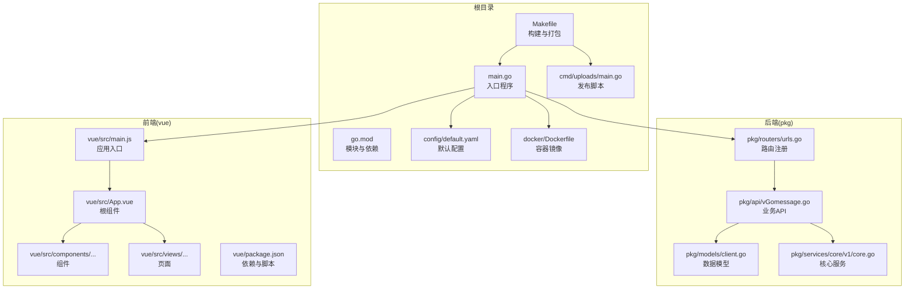
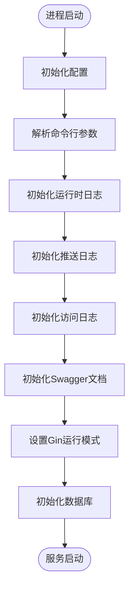
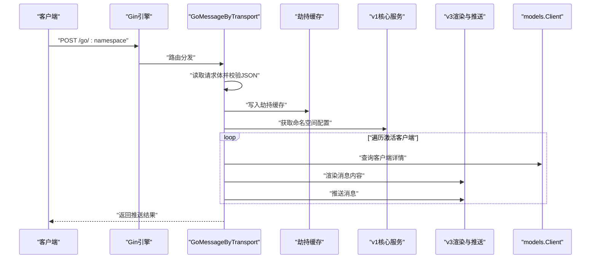

# 目录规范与命名约定

<cite>
**本文引用的文件**
- [main.go](file://main.go)
- [go.mod](file://go.mod)
- [config/default.yaml](file://config/default.yaml)
- [pkg/routers/urls.go](file://pkg/routers/urls.go)
- [pkg/api/vGomessage.go](file://pkg/api/vGomessage.go)
- [pkg/models/client.go](file://pkg/models/client.go)
- [pkg/services/core/v1/core.go](file://pkg/services/core/v1/core.go)
- [vue/src/main.js](file://vue/src/main.js)
- [vue/src/App.vue](file://vue/src/App.vue)
- [vue/src/components/clients/clientDingtalk.vue](file://vue/src/components/clients/clientDingtalk.vue)
- [vue/src/views/main/ViewClient.vue](file://vue/src/views/main/ViewClient.vue)
- [vue/package.json](file://vue/package.json)
- [Makefile](file://Makefile)
- [docker/Dockerfile](file://docker/Dockerfile)
- [cmd/uploads/main.go](file://cmd/uploads/main.go)
</cite>

## 目录与命名规范总览

本项目采用“前后端分离 + 多模块 Go 包”的工程化组织方式，目录与命名遵循以下原则：
- 后端以模块化包结构组织，按职责分层（API、中间件、模型、服务、工具、初始化等），文件名采用小写+下划线风格，便于检索与一致性。
- 前端采用 Vue 2 单页应用结构，组件与页面按功能域划分，组件命名采用帕斯卡命名法，文件以 .vue 结尾，样式作用域化。
- 配置文件统一放置于 config 目录，命名清晰表达用途；版本与打包流程通过 Makefile 统一管理。
- 文档与静态资源分别置于 docs 与 assets 目录，便于发布与维护。

## 项目结构概览

图表来源
- [main.go:1-56](file://main.go#L1-L56)
- [pkg/routers/urls.go:1-109](file://pkg/routers/urls.go#L1-L109)
- [pkg/api/vGomessage.go:1-173](file://pkg/api/vGomessage.go#L1-L173)
- [pkg/models/client.go:1-239](file://pkg/models/client.go#L1-L239)
- [pkg/services/core/v1/core.go:1-65](file://pkg/services/core/v1/core.go#L1-L65)
- [vue/src/main.js:1-32](file://vue/src/main.js#L1-L32)
- [vue/src/App.vue:1-132](file://vue/src/App.vue#L1-L132)
- [vue/package.json:1-54](file://vue/package.json#L1-L54)
- [Makefile:1-235](file://Makefile#L1-L235)
- [docker/Dockerfile:1-20](file://docker/Dockerfile#L1-L20)
- [cmd/uploads/main.go:1-307](file://cmd/uploads/main.go#L1-L307)

章节来源
- [main.go:1-56](file://main.go#L1-L56)
- [go.mod:1-75](file://go.mod#L1-L75)
- [Makefile:1-235](file://Makefile#L1-L235)

## Go 包命名与目录组织

- 包命名
  - 使用小写短语，避免缩写，体现领域含义。例如：pkg/api、pkg/models、pkg/services、pkg/middleware、pkg/utils。
  - 子模块按版本或能力细分，如 pkg/services/core/v1、pkg/services/core/v2、pkg/services/core/v3。
- 目录层级设计
  - 按职责分层：API 层负责对外接口与控制器职责；中间件层负责横切关注点；模型层负责数据结构与持久化；服务层负责业务逻辑与适配；工具层提供通用能力。
  - 模块内文件按功能划分，如 client 相关的 CRUD 放入 models/client.go，API 控制器放入 pkg/api/，渲染与推送逻辑放入 pkg/services/core/v3。
- 文件命名
  - Go 文件采用小写+下划线风格，如 client_get.go、client_post.go、core.go、urls.go，便于快速定位与统一检索。
  - 接口与结构体使用帕斯卡命名法，如 Client、ReadyClient，导出方法首字母大写。
- 依赖与模块
  - go.mod 明确模块名与依赖版本，确保可复现构建与安全升级。
  - 初始化顺序在 main 中明确，保证配置、日志、数据库等基础设施按序启动。

章节来源
- [pkg/routers/urls.go:1-109](file://pkg/routers/urls.go#L1-L109)
- [pkg/api/vGomessage.go:1-173](file://pkg/api/vGomessage.go#L1-L173)
- [pkg/models/client.go:1-239](file://pkg/models/client.go#L1-L239)
- [pkg/services/core/v1/core.go:1-65](file://pkg/services/core/v1/core.go#L1-L65)
- [go.mod:1-75](file://go.mod#L1-L75)

## 前端文件命名与组件组织

- 组件命名
  - 组件文件采用帕斯卡命名法，如 clientDingtalk.vue、ViewClient.vue，便于在模板中引用与 IDE 自动补全。
  - 组件目录按功能域划分，如 components/clients 下存放各平台客户端组件，views 下存放页面级组件。
- 文件组织
  - 根组件 App.vue 负责布局与全局状态注入；入口 main.js 负责插件注册与应用挂载。
  - 页面组件通过路由与 store 协同工作，组件内部通过 scoped 样式隔离样式影响。
- 依赖与脚本
  - package.json 统一管理依赖与脚本，构建产物通过 Makefile 注入后端 assets，形成一体化发布流程。

章节来源
- [vue/src/App.vue:1-132](file://vue/src/App.vue#L1-L132)
- [vue/src/main.js:1-32](file://vue/src/main.js#L1-L32)
- [vue/src/components/clients/clientDingtalk.vue:1-240](file://vue/src/components/clients/clientDingtalk.vue#L1-L240)
- [vue/src/views/main/ViewClient.vue:1-266](file://vue/src/views/main/ViewClient.vue#L1-L266)
- [vue/package.json:1-54](file://vue/package.json#L1-L54)

## 配置文件命名与版本控制策略

- 配置文件命名
  - default.yaml 作为默认配置文件，键名采用小驼峰或点分层级，清晰表达用途（如 service.host、log.level、databaseType）。
  - 不同环境可通过命令行参数覆盖配置，避免硬编码敏感信息。
- 版本控制与发布
  - Makefile 统一管理版本号与构建流程，支持多平台打包与 Docker 镜像构建。
  - 发布脚本 cmd/uploads/main.go 负责 GitHub Release 的创建、资产上传与清理，配合 Makefile 的 package_push 目标实现一键发布。
- 代码审查与质量
  - 前端 ESLint 规则在 package.json 中集中配置，确保代码风格一致。
  - 后端 Swagger 文档通过 swag 工具自动生成，提升接口可发现性与协作效率。

章节来源
- [config/default.yaml:1-83](file://config/default.yaml#L1-L83)
- [Makefile:1-235](file://Makefile#L1-L235)
- [cmd/uploads/main.go:1-307](file://cmd/uploads/main.go#L1-L307)
- [vue/package.json:1-54](file://vue/package.json#L1-L54)

## 代码文件组织原则（按功能模块与职责分离）

- 按功能模块划分
  - API 层：对外暴露 REST 接口，处理请求与响应，如 GoMessageByTransport、GoMessageByGet。
  - 模型层：定义数据结构与数据库映射，如 Client、ClientLite，以及 CRUD 方法。
  - 服务层：封装业务逻辑与适配器，如 v1.AssembledMessage、v3.RendersContentData。
  - 中间件层：统一处理跨域、鉴权、访问日志等横切关注点。
- 按职责分离
  - 路由注册集中在 routers/urls.go，便于集中管理与审计。
  - 初始化流程在 main 中按顺序执行，避免启动时序问题。
  - 日志、数据库、Swagger 等基础设施在 utils/initialize 与 utils/log 下统一初始化。

章节来源
- [pkg/api/vGomessage.go:1-173](file://pkg/api/vGomessage.go#L1-L173)
- [pkg/models/client.go:1-239](file://pkg/models/client.go#L1-L239)
- [pkg/services/core/v1/core.go:1-65](file://pkg/services/core/v1/core.go#L1-L65)
- [pkg/routers/urls.go:1-109](file://pkg/routers/urls.go#L1-L109)
- [main.go:13-35](file://main.go#L13-L35)

## 目录与命名约定清单

- 后端 Go 包
  - 目录：pkg/api、pkg/models、pkg/services/core/v1、pkg/services/core/v2、pkg/services/core/v3、pkg/middleware、pkg/utils
  - 文件：小写+下划线风格，如 client_get.go、client_post.go、core.go、urls.go
  - 类型：帕斯卡命名法，如 Client、ReadyClient
- 前端 Vue
  - 目录：src/components、src/views、src/plugins、src/router、src/store、src/service
  - 文件：帕斯卡命名法，如 clientDingtalk.vue、ViewClient.vue，页面以 View 前缀
  - 样式：scoped 样式隔离，避免全局污染
- 配置与资源
  - 配置：config/default.yaml，键名清晰表达用途
  - 静态资源：assets/vue/static、assets/docs
- 构建与发布
  - 构建：Makefile 统一版本与平台打包
  - 容器：docker/Dockerfile 定义基础镜像与入口
  - 发布：cmd/uploads/main.go 与 Makefile 的 package_push 目标

章节来源
- [pkg/routers/urls.go:1-109](file://pkg/routers/urls.go#L1-L109)
- [pkg/api/vGomessage.go:1-173](file://pkg/api/vGomessage.go#L1-L173)
- [pkg/models/client.go:1-239](file://pkg/models/client.go#L1-L239)
- [pkg/services/core/v1/core.go:1-65](file://pkg/services/core/v1/core.go#L1-L65)
- [vue/src/App.vue:1-132](file://vue/src/App.vue#L1-L132)
- [vue/src/components/clients/clientDingtalk.vue:1-240](file://vue/src/components/clients/clientDingtalk.vue#L1-L240)
- [vue/src/views/main/ViewClient.vue:1-266](file://vue/src/views/main/ViewClient.vue#L1-L266)
- [config/default.yaml:1-83](file://config/default.yaml#L1-L83)
- [Makefile:1-235](file://Makefile#L1-L235)
- [docker/Dockerfile:1-20](file://docker/Dockerfile#L1-L20)
- [cmd/uploads/main.go:1-307](file://cmd/uploads/main.go#L1-L307)

## 常见反模式与正确实践

- 反模式
  - 在 main 中混合初始化顺序，导致启动失败或行为异常
  - 将敏感配置写死在代码中，未通过配置文件或环境变量管理
  - 组件命名不规范，导致模板引用困难与 IDE 无法识别
  - 路由分散在多处，缺乏集中管理，难以维护
- 正确实践
  - 明确初始化顺序：InitConfig → InitCmd → InitRuntimeLog → InitPushLogger → InitAccessLog → InitSwagger → InitGinMode → InitDB
  - 使用 config/default.yaml 管理配置，必要时通过命令行参数覆盖
  - 组件与页面采用帕斯卡命名法，目录按功能域划分
  - 路由集中在 routers/urls.go，统一注册与中间件装配

章节来源
- [main.go:13-35](file://main.go#L13-L35)
- [config/default.yaml:1-83](file://config/default.yaml#L1-L83)
- [pkg/routers/urls.go:1-109](file://pkg/routers/urls.go#L1-L109)

## 关键流程图与时序图

### 启动流程（初始化顺序）

图表来源
- [main.go:13-35](file://main.go#L13-L35)

### API 请求处理时序（POST /go/:namespace）

图表来源
- [pkg/api/vGomessage.go:21-154](file://pkg/api/vGomessage.go#L21-L154)
- [pkg/models/client.go:162-210](file://pkg/models/client.go#L162-L210)
- [pkg/services/core/v1/core.go:34-64](file://pkg/services/core/v1/core.go#L34-L64)

## 性能与可维护性建议

- 后端
  - 服务层按版本拆分（v1/v2/v3），避免单文件膨胀，提升可维护性。
  - 使用 GORM 的结构体标签与索引优化查询性能。
- 前端
  - 组件按功能域拆分，减少跨组件耦合；使用 scoped 样式避免样式冲突。
  - 路由懒加载与按需引入第三方库，降低首屏体积。
- 构建与发布
  - Makefile 统一版本与平台打包，结合 Dockerfile 实现一致化部署。
  - 发布脚本 cmd/uploads/main.go 与 Makefile 的 package_push 目标配合，自动化发布流程。

章节来源
- [pkg/services/core/v1/core.go:1-65](file://pkg/services/core/v1/core.go#L1-L65)
- [vue/src/components/clients/clientDingtalk.vue:1-240](file://vue/src/components/clients/clientDingtalk.vue#L1-L240)
- [Makefile:1-235](file://Makefile#L1-L235)
- [docker/Dockerfile:1-20](file://docker/Dockerfile#L1-L20)
- [cmd/uploads/main.go:1-307](file://cmd/uploads/main.go#L1-L307)

## 结论

本项目通过清晰的目录与命名约定，实现了前后端分离与模块化组织，配合统一的构建与发布流程，提升了开发效率与可维护性。建议团队在后续迭代中持续遵循本文规范，避免反模式，保障代码质量与交付效率。