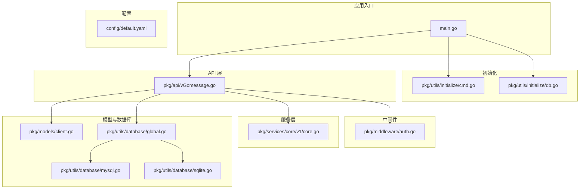
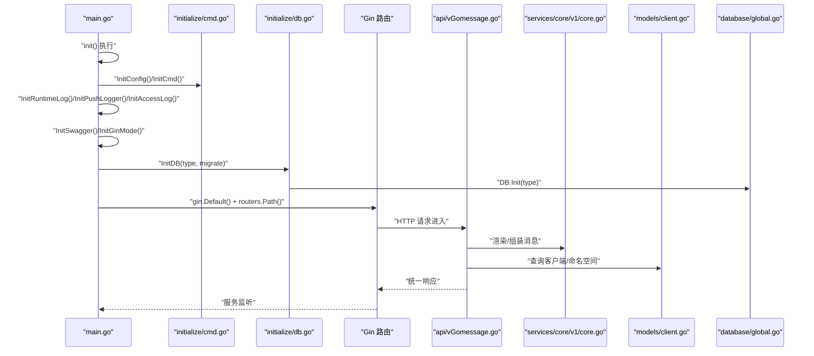
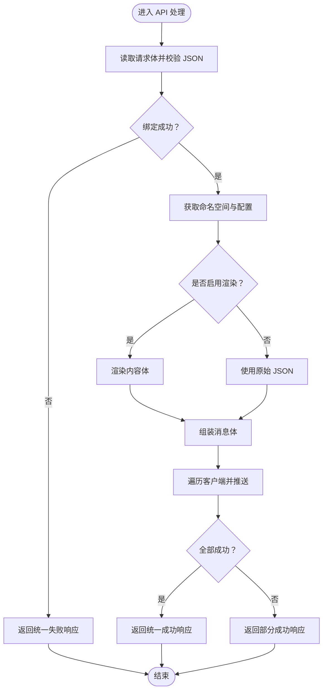
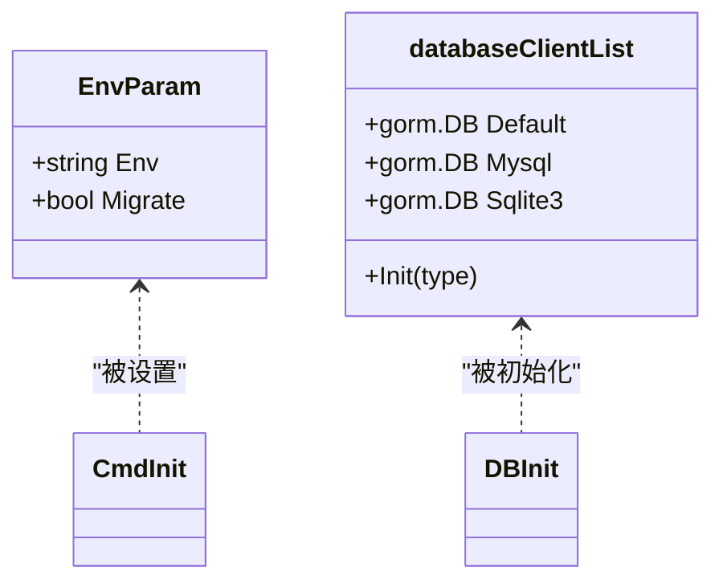
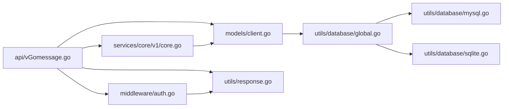

# 代码规范

<cite>
**本文档引用的文件**
- [main.go](file://main.go)
- [constants.go](file://pkg/utils/constants.go)
- [response.go](file://pkg/utils/response.go)
- [go.mod](file://go.mod)
- [default.yaml](file://config/default.yaml)
- [cmd.go](file://pkg/utils/initialize/cmd.go)
- [db.go](file://pkg/utils/initialize/db.go)
- [client.go](file://pkg/models/client.go)
- [core.go](file://pkg/services/core/v1/core.go)
- [auth.go](file://pkg/middleware/auth.go)
- [global.go](file://pkg/utils/database/global.go)
- [mysql.go](file://pkg/utils/database/mysql.go)
- [sqlite.go](file://pkg/utils/database/sqlite.go)
- [vGomessage.go](file://pkg/api/vGomessage.go)
- [Makefile](file://Makefile)
</cite>

## 目录
1. [简介](#简介)
2. [项目结构](#项目结构)
3. [核心组件](#核心组件)
4. [架构总览](#架构总览)
5. [详细组件分析](#详细组件分析)
6. [依赖分析](#依赖分析)
7. [性能考虑](#性能考虑)
8. [故障排查指南](#故障排查指南)
9. [结论](#结论)
10. [附录](#附录)

## 简介
本指南面向开发者，系统化阐述本项目的 Go 语言编码规范与最佳实践，涵盖命名约定、函数设计、错误处理、包与文件组织、注释规范、常量与错误码管理、统一响应格式、代码审查标准与流程，以及代码质量检查工具的使用建议。文档以仓库现有实现为依据，结合架构与模块职责，提供可操作的规范与示例路径。

## 项目结构
项目采用按功能域分层的包组织方式：
- cmd：应用入口与启动流程
- config：默认配置文件
- pkg：核心业务包
  - api：对外 HTTP 接口层
  - authorization：鉴权相关
  - middleware：中间件
  - models：数据模型与持久化
  - routers：路由注册
  - services：业务服务与渲染/推送逻辑
  - utils：工具库（日志、初始化、数据库、常量、响应模板等）
  - hijacking：数据劫持与缓存
- docker：容器化与 Helm 配置
- vue：前端静态资源与构建脚本
- 文档与 Wiki：部署与响应格式说明

**图表来源**
- [main.go:1-56](file://main.go#L1-L56)
- [cmd.go:1-99](file://pkg/utils/initialize/cmd.go#L1-L99)
- [db.go:1-60](file://pkg/utils/initialize/db.go#L1-L60)
- [vGomessage.go:1-173](file://pkg/api/vGomessage.go#L1-L173)
- [auth.go:1-62](file://pkg/middleware/auth.go#L1-L62)
- [core.go:1-65](file://pkg/services/core/v1/core.go#L1-L65)
- [client.go:1-239](file://pkg/models/client.go#L1-L239)
- [global.go:1-36](file://pkg/utils/database/global.go#L1-L36)
- [mysql.go:1-53](file://pkg/utils/database/mysql.go#L1-L53)
- [sqlite.go:1-48](file://pkg/utils/database/sqlite.go#L1-L48)

**章节来源**
- [main.go:1-56](file://main.go#L1-L56)
- [Makefile:1-233](file://Makefile#L1-L233)

## 核心组件
- 统一响应模板：定义统一的响应结构与成功/失败分支，便于前后端一致消费。
- 常量定义：集中管理客户端类型常量，避免魔法字符串。
- 初始化链路：配置加载、命令行参数覆盖、日志初始化、数据库初始化与迁移、Swagger/Gin 模式设置。
- 中间件：鉴权中间件，基于 JWT 校验与会话表校验。
- API 处理：接收请求、读取并校验 JSON、根据命名空间与配置组装消息并推送。
- 数据库抽象：通过统一的数据库客户端列表切换 MySQL/SQLite，支持多客户端并行。

**章节来源**
- [response.go:1-28](file://pkg/utils/response.go#L1-L28)
- [constants.go:1-9](file://pkg/utils/constants.go#L1-L9)
- [cmd.go:1-99](file://pkg/utils/initialize/cmd.go#L1-L99)
- [db.go:1-60](file://pkg/utils/initialize/db.go#L1-L60)
- [auth.go:1-62](file://pkg/middleware/auth.go#L1-L62)
- [vGomessage.go:1-173](file://pkg/api/vGomessage.go#L1-L173)
- [global.go:1-36](file://pkg/utils/database/global.go#L1-L36)

## 架构总览
应用启动时序遵循严格的初始化顺序，确保配置、日志、数据库与路由在服务启动前准备完毕。API 层通过中间件进行鉴权，再调用服务层进行消息渲染与推送，并将结果以统一响应返回。

**图表来源**
- [main.go:13-35](file://main.go#L13-L35)
- [cmd.go:46-99](file://pkg/utils/initialize/cmd.go#L46-L99)
- [db.go:11-48](file://pkg/utils/initialize/db.go#L11-L48)
- [vGomessage.go:24-154](file://pkg/api/vGomessage.go#L24-L154)
- [core.go:34-64](file://pkg/services/core/v1/core.go#L34-L64)
- [client.go:40-239](file://pkg/models/client.go#L40-L239)
- [global.go:14-35](file://pkg/utils/database/global.go#L14-L35)

## 详细组件分析

### 命名约定与包组织
- 包名：小写、简洁、语义明确；如 utils、models、services、middleware、api。
- 文件名：采用功能语义的小写短横线风格，如 client_get.go、client_post.go。
- 类型与导出标识符：首字母大写；内部实现使用小写包内可见标识符。
- 结构体字段：首字母大写用于 JSON 导出；内部字段使用小写并通过标签隐藏或选择性导出。
- 常量：集中于 utils 下的 constants.go，避免散落的魔法字符串。

**章节来源**
- [constants.go:1-9](file://pkg/utils/constants.go#L1-L9)
- [client.go:13-28](file://pkg/models/client.go#L13-L28)

### 函数设计与错误处理
- 错误传播：在模型层与服务层，遇到数据库错误或业务异常时直接返回错误，由上层决定处理策略。
- 统一响应：API 层使用统一响应模板，区分成功与失败分支，失败时附带错误详情与帮助链接。
- 中间件错误：鉴权中间件在异常情况下返回统一响应并终止请求链。
- 初始化错误：命令行参数校验失败时直接退出进程，保证启动一致性。

**图表来源**
- [vGomessage.go:24-154](file://pkg/api/vGomessage.go#L24-L154)
- [response.go:11-27](file://pkg/utils/response.go#L11-L27)

**章节来源**
- [vGomessage.go:33-61](file://pkg/api/vGomessage.go#L33-L61)
- [auth.go:12-61](file://pkg/middleware/auth.go#L12-L61)
- [response.go:1-28](file://pkg/utils/response.go#L1-L28)

### 常量定义与错误码管理
- 常量：客户端类型常量集中定义，避免硬编码字符串。
- 错误码：统一响应模板中使用 code 字段表示成功/失败（1 表示成功，0 表示失败），便于前端统一处理。
- 帮助信息：统一响应模板包含 help 字段，指向文档地址，便于排障。

**章节来源**
- [constants.go:3-8](file://pkg/utils/constants.go#L3-L8)
- [response.go:3-9](file://pkg/utils/response.go#L3-L9)

### 响应格式规范
- 成功响应：包含 code、msg、result、help。
- 失败响应：包含 code、msg、error、help。
- API 层在不同场景下返回成功或失败，失败时附带具体错误原因。

**章节来源**
- [response.go:11-27](file://pkg/utils/response.go#L11-L27)
- [vGomessage.go:144-153](file://pkg/api/vGomessage.go#L144-L153)

### 初始化与配置管理
- 配置加载：default.yaml 提供默认配置，支持环境、服务监听地址、日志、数据库类型与连接参数。
- 命令行覆盖：pflag 支持通过命令行参数覆盖配置项，优先级最高。
- 初始化顺序：配置 -> 命令行 -> 日志 -> Swagger/Gin 模式 -> 数据库初始化与迁移。
- 数据库切换：通过 databaseClientList 在运行时切换 MySQL/SQLite，保持上层调用一致。

**图表来源**
- [cmd.go:11-18](file://pkg/utils/initialize/cmd.go#L11-L18)
- [cmd.go:46-99](file://pkg/utils/initialize/cmd.go#L46-L99)
- [db.go:11-48](file://pkg/utils/initialize/db.go#L11-L48)
- [global.go:5-12](file://pkg/utils/database/global.go#L5-L12)
- [global.go:14-35](file://pkg/utils/database/global.go#L14-L35)

**章节来源**
- [default.yaml:1-83](file://config/default.yaml#L1-L83)
- [cmd.go:46-99](file://pkg/utils/initialize/cmd.go#L46-L99)
- [db.go:11-48](file://pkg/utils/initialize/db.go#L11-L48)
- [global.go:14-35](file://pkg/utils/database/global.go#L14-L35)

### 鉴权中间件与安全
- 中间件职责：从 Authorization 头提取 Token，校验签名与有效性，核对会话表状态，通过后注入用户信息。
- 异常处理：签名无效、令牌异常、无效令牌、已过期等情况均返回统一失败响应。

**章节来源**
- [auth.go:12-61](file://pkg/middleware/auth.go#L12-L61)

### 数据模型与业务逻辑
- 模型设计：结构体字段按需导出，使用 GORM 标签定义主键、索引与忽略字段。
- 业务方法：AddClient/UpdateClient/DeleteClient/GetClientById/ListClient 等方法封装 CRUD 与关联扩展表的处理。
- 客户端类型：通过常量与 switch 分支处理不同客户端类型的扩展信息与推送逻辑。

**章节来源**
- [client.go:13-28](file://pkg/models/client.go#L13-L28)
- [client.go:40-147](file://pkg/models/client.go#L40-L147)
- [client.go:162-239](file://pkg/models/client.go#L162-L239)
- [constants.go:3-8](file://pkg/utils/constants.go#L3-L8)

### 服务层与消息组装
- 服务层职责：根据命名空间与配置，组装不同客户端的消息体与推送地址。
- 组装流程：遍历激活客户端，按类型选择渲染或直传，最终调用客户端动作接口推送。

**章节来源**
- [core.go:25-32](file://pkg/services/core/v1/core.go#L25-L32)
- [core.go:34-64](file://pkg/services/core/v1/core.go#L34-L64)

## 依赖分析
- 外部依赖：Gin、Viper、Swag、JWT、Logrus、GORM、Elasticsearch 客户端等。
- 内部依赖：api 层依赖 models 与 services；services 依赖 models；middleware 依赖 utils 与 authorization；utils.database 抽象数据库访问。

**图表来源**
- [vGomessage.go:1-173](file://pkg/api/vGomessage.go#L1-L173)
- [client.go:1-239](file://pkg/models/client.go#L1-L239)
- [core.go:1-65](file://pkg/services/core/v1/core.go#L1-L65)
- [response.go:1-28](file://pkg/utils/response.go#L1-L28)
- [auth.go:1-62](file://pkg/middleware/auth.go#L1-L62)
- [global.go:1-36](file://pkg/utils/database/global.go#L1-L36)
- [mysql.go:1-53](file://pkg/utils/database/mysql.go#L1-L53)
- [sqlite.go:1-48](file://pkg/utils/database/sqlite.go#L1-L48)

**章节来源**
- [go.mod:1-75](file://go.mod#L1-L75)

## 性能考虑
- 数据库连接池：MySQL/SQLite 均配置最大空闲连接与最大打开连接数，合理设置连接生命周期。
- 日志级别：GORM 默认日志设为 Silent，减少 IO 压力。
- 初始化顺序：确保数据库与日志在服务启动前完成，避免运行时阻塞。
- 响应与错误：统一响应减少序列化开销，错误快速返回避免冗余处理。

**章节来源**
- [mysql.go:25-52](file://pkg/utils/database/mysql.go#L25-L52)
- [sqlite.go:17-47](file://pkg/utils/database/sqlite.go#L17-L47)
- [main.go:13-35](file://main.go#L13-L35)

## 故障排查指南
- 启动失败：检查命令行参数是否正确，确认 --env、--ginMode、--migrate、--log2es 参数与 default.yaml 的 global.env 是否匹配。
- 数据库问题：确认 databaseType 与对应配置项（sqlite3 或 mysql）正确，检查连接参数与权限。
- 鉴权失败：确认 Authorization 头是否存在且有效，检查会话表中 Token 状态。
- API 返回失败：查看统一响应中的 error 字段与 help 链接，定位具体失败原因。

**章节来源**
- [cmd.go:21-34](file://pkg/utils/initialize/cmd.go#L21-L34)
- [cmd.go:67-98](file://pkg/utils/initialize/cmd.go#L67-L98)
- [default.yaml:4-83](file://config/default.yaml#L4-L83)
- [auth.go:12-61](file://pkg/middleware/auth.go#L12-L61)
- [vGomessage.go:144-153](file://pkg/api/vGomessage.go#L144-L153)

## 结论
本项目在编码规范、包组织、错误处理与响应格式方面形成了清晰的一致性实践。建议在后续迭代中持续完善单元测试覆盖率、引入静态分析工具与 CI 规范，以进一步提升代码质量与可维护性。

## 附录

### 代码审查标准与流程
- 代码风格：遵循命名约定、注释规范与文件组织原则。
- 可读性：函数单一职责、错误处理显式、统一响应使用。
- 安全性：鉴权中间件必用、敏感配置通过命令行覆盖、JWT 密钥不可硬编码。
- 可靠性：初始化顺序正确、数据库迁移幂等、日志级别合理。
- 流程：提交前自检 + 单测 + Lint；PR 至少一名 reviewer；CI 通过后合并。

### 代码质量检查工具使用建议
- 代码格式化：使用 gofmt 或 goimports 保持一致性。
- 静态分析：golangci-lint（启用 errcheck、unused、gosec 等规则）。
- 文档：swag 生成 OpenAPI 文档，保持注释与文档同步。
- 构建与打包：Makefile 已内置多平台构建与 Docker/Helm 打包目标，建议在 CI 中复用。

**章节来源**
- [Makefile:67-72](file://Makefile#L67-L72)
- [Makefile:173-207](file://Makefile#L173-L207)