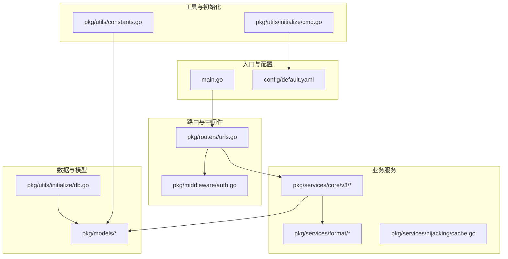
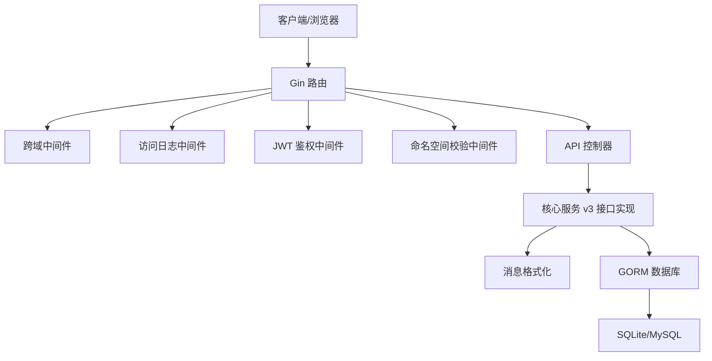
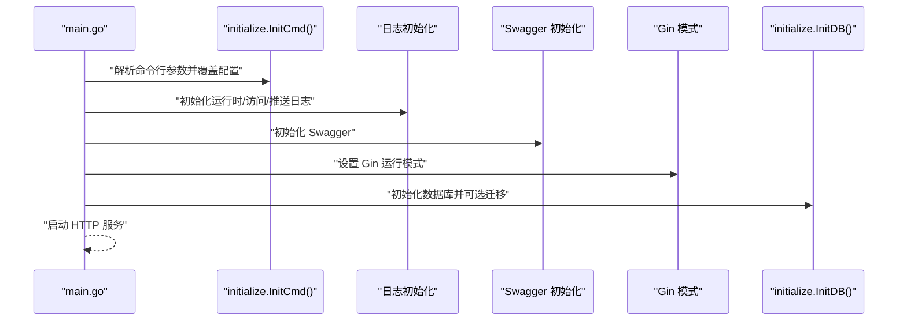
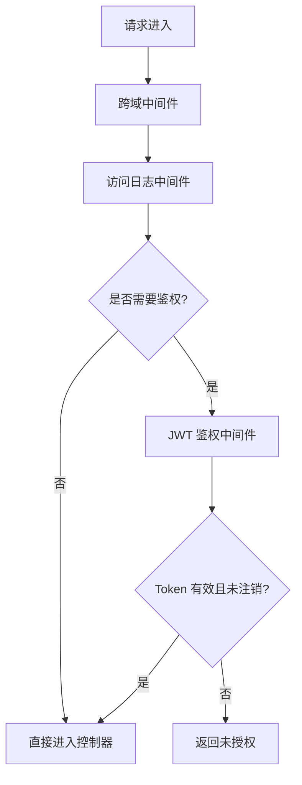
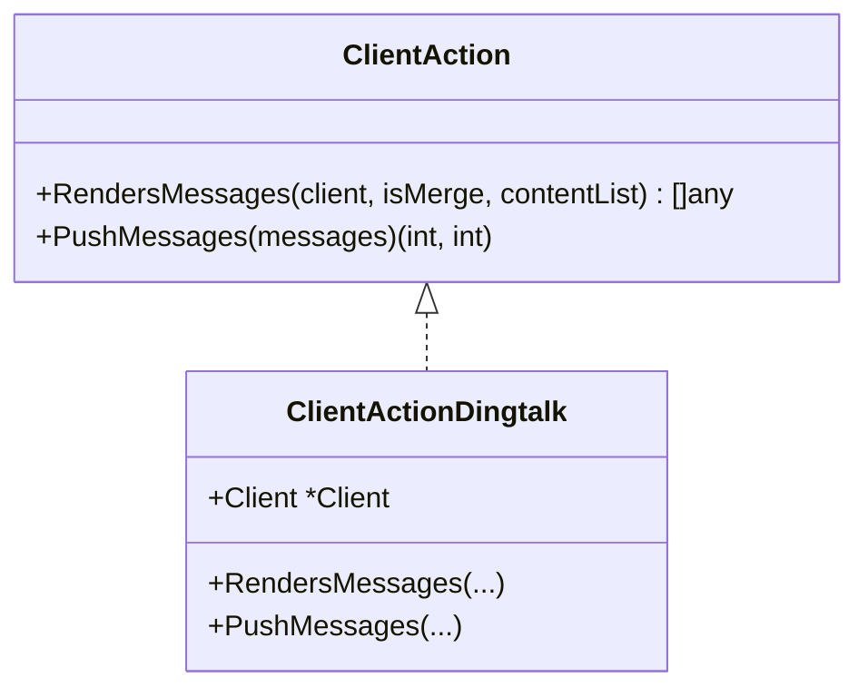
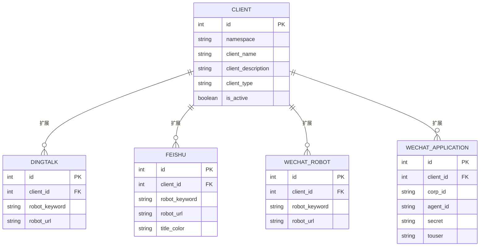
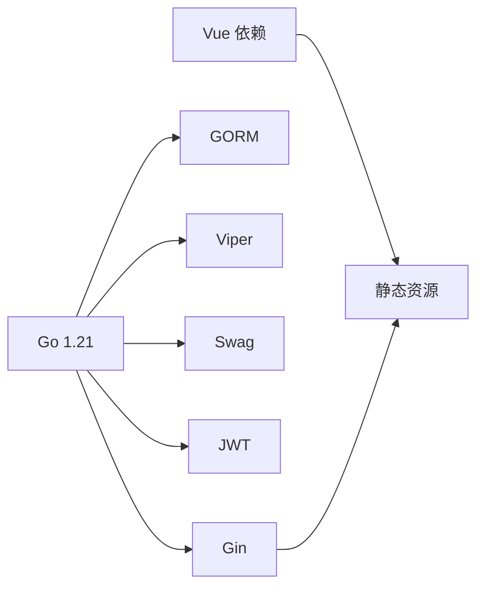

# 开发指南

<cite>
**本文引用的文件**
- [main.go](file://main.go)
- [go.mod](file://go.mod)
- [Makefile](file://Makefile)
- [config/default.yaml](file://config/default.yaml)
- [pkg/routers/urls.go](file://pkg/routers/urls.go)
- [pkg/utils/initialize/cmd.go](file://pkg/utils/initialize/cmd.go)
- [pkg/utils/initialize/db.go](file://pkg/utils/initialize/db.go)
- [pkg/services/core/v3/interfaces.go](file://pkg/services/core/v3/interfaces.go)
- [pkg/models/client.go](file://pkg/models/client.go)
- [pkg/middleware/auth.go](file://pkg/middleware/auth.go)
- [pkg/services/core/v3/dingtalk.go](file://pkg/services/core/v3/dingtalk.go)
- [pkg/utils/constants.go](file://pkg/utils/constants.go)
- [vue/package.json](file://vue/package.json)
- [.dockerignore](file://.dockerignore)
- [cmd/uploads/main.go](file://cmd/uploads/main.go)
</cite>

## 目录
1. [简介](#简介)
2. [项目结构](#项目结构)
3. [核心组件](#核心组件)
4. [架构总览](#架构总览)
5. [详细组件分析](#详细组件分析)
6. [依赖分析](#依赖分析)
7. [性能考虑](#性能考虑)
8. [故障排查指南](#故障排查指南)
9. [结论](#结论)
10. [附录](#附录)

## 简介
本开发指南面向希望参与 gomessage 项目的开发者，系统阐述代码结构与组织方式、开发环境搭建、构建与测试流程、代码规范与最佳实践、贡献流程、调试技巧以及扩展开发指引。项目采用 Go 语言实现后端服务，基于 Gin 框架提供 REST API，并通过 Swagger 提供在线文档；前端使用 Vue 2 技术栈，打包为静态资源嵌入后端。

## 项目结构
项目采用按职责分层的包结构组织，主要层次如下：
- cmd：命令入口，如上传发布包的独立程序
- config：默认配置文件
- docker：容器化与 Helm 发布相关
- pkg：核心业务代码
  - api：HTTP 接口控制器
  - authorization：鉴权与会话
  - middleware：中间件（鉴权、跨域、访问日志等）
  - models：数据模型与数据库交互
  - routers：路由注册
  - services：业务服务
    - core：消息推送核心（v1/v2/v3 多版本）
    - format：消息格式化
    - hijacking：缓存劫持
  - utils：通用工具与初始化
  - assets/docs：Swagger 文档
  - assets/vue：Vue 打包后的静态资源
- vue：前端源码与构建配置
- wiki：安装与使用文档

图表来源
- [main.go:1-56](file://main.go#L1-L56)
- [pkg/routers/urls.go:1-109](file://pkg/routers/urls.go#L1-L109)
- [pkg/utils/initialize/cmd.go:1-99](file://pkg/utils/initialize/cmd.go#L1-L99)
- [pkg/utils/initialize/db.go:1-60](file://pkg/utils/initialize/db.go#L1-L60)
- [pkg/services/core/v3/interfaces.go:1-11](file://pkg/services/core/v3/interfaces.go#L1-L11)
- [pkg/models/client.go:1-239](file://pkg/models/client.go#L1-L239)
- [pkg/utils/constants.go:1-9](file://pkg/utils/constants.go#L1-L9)

章节来源
- [main.go:1-56](file://main.go#L1-L56)
- [go.mod:1-75](file://go.mod#L1-L75)
- [Makefile:1-217](file://Makefile#L1-L217)
- [config/default.yaml:1-83](file://config/default.yaml#L1-L83)

## 核心组件
- 应用入口与初始化
  - main 函数负责初始化配置、命令行参数、日志、Swagger、Gin 模式与数据库，随后启动 HTTP 服务。
  - 初始化顺序严格：先配置，再命令行覆盖，再日志，再 Swagger，再 Gin 模式，最后数据库。
- 路由与中间件
  - 路由集中注册，包含健康检查、首页、Swagger、命名空间数据入口、鉴权接口、v1 API 等。
  - 中间件包括跨域、访问日志与命名空间校验、JWT 鉴权。
- 业务服务
  - v3 版本采用接口抽象不同客户端（钉钉、飞书、企业微信机器人等），统一渲染与推送流程。
  - format 子模块负责将消息内容打包为各平台协议格式。
- 数据模型与初始化
  - models 定义命名空间、模板、变量、客户端及其扩展信息。
  - initialize/db 负责数据库初始化与自动迁移，创建默认命名空间与管理员账户。

章节来源
- [main.go:13-35](file://main.go#L13-L35)
- [pkg/routers/urls.go:21-109](file://pkg/routers/urls.go#L21-L109)
- [pkg/middleware/auth.go:12-62](file://pkg/middleware/auth.go#L12-L62)
- [pkg/services/core/v3/interfaces.go:7-10](file://pkg/services/core/v3/interfaces.go#L7-L10)
- [pkg/utils/initialize/db.go:11-48](file://pkg/utils/initialize/db.go#L11-L48)
- [pkg/models/client.go:13-239](file://pkg/models/client.go#L13-L239)

## 架构总览
后端以 Gin 为核心，路由层负责请求接入与中间件链，业务层根据客户端类型实现统一接口，数据层通过 GORM 访问 SQLite/MySQL。前端 Vue 打包为静态资源，随后端一起提供。

图表来源
- [pkg/routers/urls.go:21-109](file://pkg/routers/urls.go#L21-L109)
- [pkg/middleware/auth.go:12-62](file://pkg/middleware/auth.go#L12-L62)
- [pkg/services/core/v3/interfaces.go:7-10](file://pkg/services/core/v3/interfaces.go#L7-L10)
- [pkg/utils/initialize/db.go:11-48](file://pkg/utils/initialize/db.go#L11-L48)

## 详细组件分析

### 组件一：应用启动与初始化流程
- 初始化顺序与职责
  - 初始化配置文件
  - 解析命令行参数并覆盖配置
  - 初始化运行时/访问/推送日志
  - 初始化 Swagger
  - 设置 Gin 运行模式
  - 初始化数据库并可选迁移
- 关键点
  - 命令行参数优先级最高，可覆盖配置项
  - 迁移开关决定是否对元数据表进行幂等迁移
  - 默认创建默认命名空间与管理员账户

图表来源
- [main.go:13-35](file://main.go#L13-L35)
- [pkg/utils/initialize/cmd.go:46-99](file://pkg/utils/initialize/cmd.go#L46-L99)
- [pkg/utils/initialize/db.go:11-48](file://pkg/utils/initialize/db.go#L11-L48)

章节来源
- [main.go:13-35](file://main.go#L13-L35)
- [pkg/utils/initialize/cmd.go:46-99](file://pkg/utils/initialize/cmd.go#L46-L99)
- [pkg/utils/initialize/db.go:11-48](file://pkg/utils/initialize/db.go#L11-L48)

### 组件二：路由与中间件
- 路由注册
  - 静态资源与首页
  - 健康检查与 Swagger
  - 命名空间数据入口（GET/POST）
  - 鉴权接口（登录/注册/登出）
  - v1 API（命名空间、模板、变量、客户端）
- 中间件
  - 跨域与访问日志
  - 命名空间校验
  - JWT 鉴权：校验 Token 是否存在、有效、未注销

图表来源
- [pkg/routers/urls.go:21-109](file://pkg/routers/urls.go#L21-L109)
- [pkg/middleware/auth.go:12-62](file://pkg/middleware/auth.go#L12-L62)

章节来源
- [pkg/routers/urls.go:21-109](file://pkg/routers/urls.go#L21-L109)
- [pkg/middleware/auth.go:12-62](file://pkg/middleware/auth.go#L12-L62)

### 组件三：消息推送核心（v3）
- 接口抽象
  - ClientAction 接口定义渲染与推送能力
- 实现示例：钉钉
  - RendersMessages：根据是否合并，将多条内容聚合或逐条渲染为平台消息
  - PushMessages：随机选择机器人地址并逐一推送，统计成功/失败数
- 与格式化模块协作
  - 使用 format 包装为平台协议消息体

图表来源
- [pkg/services/core/v3/interfaces.go:7-10](file://pkg/services/core/v3/interfaces.go#L7-L10)
- [pkg/services/core/v3/dingtalk.go:10-41](file://pkg/services/core/v3/dingtalk.go#L10-L41)

章节来源
- [pkg/services/core/v3/interfaces.go:7-10](file://pkg/services/core/v3/interfaces.go#L7-L10)
- [pkg/services/core/v3/dingtalk.go:14-40](file://pkg/services/core/v3/dingtalk.go#L14-L40)

### 组件四：数据模型与客户端管理
- Client 模型
  - 基础字段：命名空间、名称、描述、类型、启用状态
  - 扩展字段：按客户端类型关联具体平台配置（钉钉、飞书、企业微信机器人、企业微信应用）
- 客户端 CRUD 与激活状态切换
  - 新增/更新/删除/查询
  - 激活状态变更
- 客户端类型常量
  - 统一常量定义，避免魔法字符串

图表来源
- [pkg/models/client.go:13-239](file://pkg/models/client.go#L13-L239)
- [pkg/utils/constants.go:3-8](file://pkg/utils/constants.go#L3-L8)

章节来源
- [pkg/models/client.go:40-147](file://pkg/models/client.go#L40-L147)
- [pkg/models/client.go:155-210](file://pkg/models/client.go#L155-L210)
- [pkg/utils/constants.go:3-8](file://pkg/utils/constants.go#L3-L8)

### 组件五：构建与发布流程
- Makefile 目标
  - 清理、依赖整理、生成 Swagger、分别编译 macOS/Windows/Linux 产物、打包 tar.gz
  - 构建 Docker 镜像、推送镜像与 Helm Chart、上传 GitHub Release 包
- 上传脚本
  - cmd/uploads：根据版本号创建/更新 GitHub Release 并上传三平台压缩包，支持删除旧版本资产

```mermaid
flowchart TD
START(["开始"]) --> CLEAN["make clean"]
CLEAN --> DEPS["make start (go mod tidy)"]
DEPS --> SWAG["make swagger"]
SWAG --> BUILD["make build_mac/build_windows/build_linux"]
BUILD --> TAR["打包 tar.gz"]
TAR --> DOCKER["make docker / make docker_push"]
DOCKER --> HELM["make helm_push / make package_push"]
HELM --> END(["结束"])
subgraph "上传脚本"
U1["cmd/uploads/main.go<br/>创建/更新 Release 并上传资产"]
end
TAR --> U1
```

图表来源
- [Makefile:43-217](file://Makefile#L43-L217)
- [cmd/uploads/main.go:121-306](file://cmd/uploads/main.go#L121-L306)

章节来源
- [Makefile:43-217](file://Makefile#L43-L217)
- [cmd/uploads/main.go:121-306](file://cmd/uploads/main.go#L121-L306)

## 依赖分析
- 语言与框架
  - Go 1.21
  - Gin Web 框架
  - GORM ORM
  - Viper 配置
  - Swag Swagger
  - JWT 鉴权
- 前端依赖
  - Vue 2、Element UI、Axios 等
- 构建与打包
  - Makefile 统一编排
  - Dockerfile/Helm Chart 容器化与发布

图表来源
- [go.mod:5-21](file://go.mod#L5-L21)
- [vue/package.json:10-33](file://vue/package.json#L10-L33)

章节来源
- [go.mod:1-75](file://go.mod#L1-L75)
- [vue/package.json:1-54](file://vue/package.json#L1-L54)

## 性能考虑
- 日志与索引
  - 可选将日志写入 Elasticsearch，注意索引与查询性能
- 数据库
  - SQLite 适合轻量元数据存储；大体量过境数据建议走 ES
- 推送并发
  - v3 支持逐条推送并统计结果，可根据平台限流策略调整批量大小
- 编译优化
  - 使用 ldflags 去除符号与调试信息，减少二进制体积

## 故障排查指南
- 启动失败
  - 检查命令行参数与配置覆盖是否正确
  - 确认数据库类型与连接参数
- 鉴权失败
  - 确认 Authorization 请求头是否存在且未注销
  - 校验 JWT 密钥与签名算法
- 推送失败
  - 查看推送日志与平台返回
  - 检查客户端配置（机器人地址、关键字等）

章节来源
- [pkg/utils/initialize/cmd.go:67-98](file://pkg/utils/initialize/cmd.go#L67-L98)
- [pkg/middleware/auth.go:12-62](file://pkg/middleware/auth.go#L12-L62)
- [pkg/utils/initialize/db.go:22-48](file://pkg/utils/initialize/db.go#L22-L48)

## 结论
本指南提供了从项目结构、初始化流程、路由与中间件、消息推送核心、数据模型到构建与发布的全栈开发指引。建议开发者遵循既定的初始化顺序、中间件链与接口抽象，确保扩展与维护的一致性。

## 附录

### 开发环境搭建
- Go 环境
  - 安装 Go 1.21+
  - 配置 GOPROXY 以加速依赖下载
- 依赖管理
  - 使用 go mod tidy 同步依赖
- IDE 设置
  - 推荐使用 VS Code 并安装 Go、ESLint 插件
  - 前端使用 Vue 相关插件
- 前端构建
  - 安装 Node.js 与 npm/yarn
  - 在 vue 目录执行开发/构建命令

章节来源
- [go.mod:3](file://go.mod#L3)
- [vue/package.json:5-8](file://vue/package.json#L5-L8)

### 构建与测试
- 构建
  - 使用 Makefile 目标一键编译多平台产物
- 测试
  - 项目包含 *_test.go 文件，建议使用 go test 进行单元测试
- CI/CD
  - 可基于 Makefile 与 Dockerfile/Helm Chart 自动化流水线

章节来源
- [Makefile:43-146](file://Makefile#L43-L146)
- [.dockerignore:14-36](file://.dockerignore#L14-L36)

### 代码规范与最佳实践
- 命名约定
  - 包名小写，结构体首字母大写
  - 方法与字段遵循 Go 命名规范
- 注释规范
  - 公共接口与复杂逻辑需提供清晰注释
- 错误处理
  - 使用统一响应结构，避免吞掉错误
  - 对外部依赖（数据库、HTTP）进行超时与重试策略设计

### 贡献指南
- 分支管理
  - 主分支保护，功能开发在特性分支
- 提交规范
  - 使用清晰的提交信息，必要时附带 Issue 编号
- Pull Request
  - 提交 PR 前确保通过本地测试与 Lint

### 调试技巧与工具
- 热重载
  - 使用 air 工具进行热重载（参考 .air.toml）
- 断点调试
  - 使用 IDE 断点配合 Gin 调试模式
- 性能分析
  - 使用 Go pprof 分析 CPU/内存热点

### 扩展开发指引
- 新增消息平台支持
  - 实现 ClientAction 接口，提供 RendersMessages 与 PushMessages
  - 在 models 中新增平台扩展表并在 Client 中关联
  - 在 format 子模块中实现平台消息打包
- 自定义中间件
  - 在 middleware 目录新增中间件并在路由注册处接入
- 命名空间与权限
  - 通过 CheckNamespace 与 AuthMiddleware 保障资源隔离与鉴权

章节来源
- [pkg/services/core/v3/interfaces.go:7-10](file://pkg/services/core/v3/interfaces.go#L7-L10)
- [pkg/models/client.go:13-28](file://pkg/models/client.go#L13-L28)
- [pkg/services/core/v3/dingtalk.go:14-40](file://pkg/services/core/v3/dingtalk.go#L14-L40)