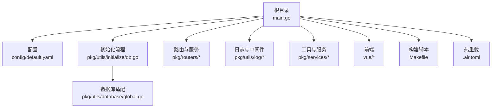
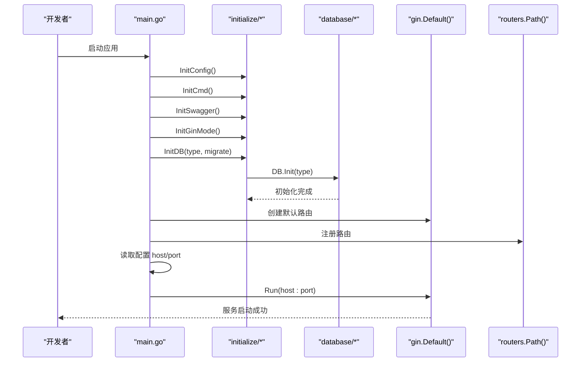
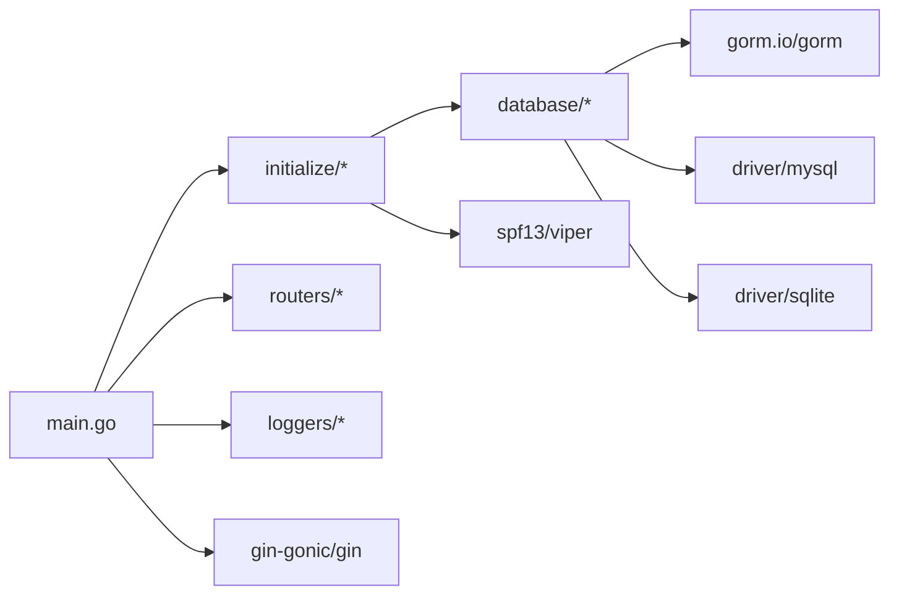

# 开发环境搭建

<cite>
**本文档引用的文件**
- [go.mod](file://go.mod)
- [go.sum](file://go.sum)
- [main.go](file://main.go)
- [config/default.yaml](file://config/default.yaml)
- [.air.toml](file://.air.toml)
- [Makefile](file://Makefile)
- [pkg/utils/database/global.go](file://pkg/utils/database/global.go)
- [pkg/utils/initialize/db.go](file://pkg/utils/initialize/db.go)
- [vue/package.json](file://vue/package.json)
- [README.md](file://README.md)
- [wiki/install_linux.md](file://wiki/install_linux.md)
- [docker/Dockerfile](file://docker/Dockerfile)
</cite>

## 目录
1. [简介](#简介)
2. [项目结构](#项目结构)
3. [核心组件](#核心组件)
4. [架构总览](#架构总览)
5. [详细组件分析](#详细组件分析)
6. [依赖关系分析](#依赖关系分析)
7. [性能考虑](#性能考虑)
8. [故障排查指南](#故障排查指南)
9. [结论](#结论)
10. [附录](#附录)

## 简介
本指南面向开发者，提供从零搭建 Go 1.21+ 开发环境的完整流程，涵盖：
- Go 1.21+ 安装与 GOPATH/GOROOT 配置
- 项目依赖安装与版本要求（Gin、GORM、JWT 等）
- IDE 配置建议（VS Code、GoLand）
- 热重载工具 air 的配置与使用
- 数据库环境准备（SQLite 与 MySQL）
- 环境验证步骤

## 项目结构
项目采用模块化分层组织，后端基于 Gin 框架，使用 GORM 进行数据库访问，配置通过 Viper 管理，前端为 Vue 2 项目。核心目录与文件：
- 后端主程序入口与初始化流程位于根目录
- 配置文件位于 config/default.yaml
- 数据库初始化与模型迁移逻辑位于 pkg/utils/database 与 pkg/utils/initialize
- 热重载配置位于 .air.toml
- 构建与打包脚本位于 Makefile
- 前端依赖位于 vue/package.json

图表来源
- [main.go:1-56](file://main.go#L1-L56)
- [config/default.yaml:1-83](file://config/default.yaml#L1-L83)
- [pkg/utils/initialize/db.go:1-60](file://pkg/utils/initialize/db.go#L1-L60)
- [pkg/utils/database/global.go:1-36](file://pkg/utils/database/global.go#L1-L36)

章节来源
- [main.go:1-56](file://main.go#L1-L56)
- [config/default.yaml:1-83](file://config/default.yaml#L1-L83)

## 核心组件
- 后端框架：Gin v1.9.0
- ORM：GORM v1.24.7-0.20230306060331-85eaf9eeda11 及驱动（MySQL v1.4.7、SQLite v1.4.3）
- JWT：golang-jwt/jwt/v4 v4.5.0
- 配置管理：spf13/viper v1.14.0
- 文档：swag v1.8.1（配合 gin-swagger）
- 日志：sirupsen/logrus v1.9.0
- 加密：golang.org/x/crypto v0.7.0
- 其他依赖：详见 go.mod

章节来源
- [go.mod:1-75](file://go.mod#L1-L75)

## 架构总览
后端启动流程概览：
- 初始化配置与命令行参数
- 初始化日志模块
- 初始化 Swagger 文档
- 设置 Gin 运行模式
- 初始化数据库（根据配置选择 SQLite 或 MySQL）
- 启动 HTTP 服务监听

图表来源
- [main.go:13-55](file://main.go#L13-L55)
- [pkg/utils/initialize/db.go:11-19](file://pkg/utils/initialize/db.go#L11-L19)
- [pkg/utils/database/global.go:14-35](file://pkg/utils/database/global.go#L14-L35)

章节来源
- [main.go:13-55](file://main.go#L13-L55)
- [pkg/utils/initialize/db.go:11-60](file://pkg/utils/initialize/db.go#L11-L60)
- [pkg/utils/database/global.go:14-36](file://pkg/utils/database/global.go#L14-L36)

## 详细组件分析

### Go 环境与版本要求
- Go 版本：1.21（go.mod 中明确声明）
- GOPATH/GOROOT：建议使用 Go 官方安装器自动配置；若手动设置，确保 GOPATH 与 GOROOT 指向正确的 Go 工作区与安装目录
- 依赖管理：使用 go mod，首次开发前执行 go mod tidy

章节来源
- [go.mod:3](file://go.mod#L3)
- [Makefile:61](file://Makefile#L61)

### 项目依赖安装与版本要求
- 核心依赖版本（节选）：
  - Gin v1.9.0
  - GORM v1.24.7-0.20230306060331-85eaf9eeda11
  - MySQL 驱动 v1.4.7
  - SQLite 驱动 v1.4.3
  - JWT v4.5.0
  - Viper v1.14.0
  - Swag v1.8.1
  - Logrus v1.9.0
  - Crypto v0.7.0
- 依赖锁定：go.mod 与 go.sum 已包含所有直接与间接依赖

章节来源
- [go.mod:5-21](file://go.mod#L5-L21)
- [go.sum:1-689](file://go.sum#L1-L689)

### 配置与数据库初始化
- 默认配置文件：config/default.yaml
  - 服务监听：host、port
  - 数据库类型：sqlite3 或 mysql
  - 日志级别与输出路径
  - JWT 密钥（生产环境务必修改）
- 数据库初始化：
  - 支持 sqlite3 与 mysql 两种驱动
  - 可通过命令行参数触发迁移（migrate=true）
  - 自动迁移包含命名空间、模板、变量、客户端、授权相关表

章节来源
- [config/default.yaml:1-83](file://config/default.yaml#L1-L83)
- [pkg/utils/initialize/db.go:11-60](file://pkg/utils/initialize/db.go#L11-L60)
- [pkg/utils/database/global.go:14-35](file://pkg/utils/database/global.go#L14-L35)

### 热重载工具 air 配置与使用
- air 配置文件：.air.toml
  - 构建命令：go build -o ./tmp/main ./main.go
  - 排除目录：assets、tmp、vendor、testdata、docs、logs、wiki
  - 排除文件：_test.go
  - 输出二进制：./tmp/main
  - 构建错误日志：build-errors.log
- 使用建议：
  - 在根目录执行 air，自动监听 Go 文件变更并重建
  - 修改配置文件后需重启 air 生效

章节来源
- [.air.toml:1-39](file://.air.toml#L1-L39)

### 前端依赖与开发环境
- 前端项目位于 vue/
- 依赖管理：npm（package.json）
- 常用脚本：
  - dev：vue-cli-service serve --mode development
  - build：vue-cli-service build --mode production
  - lint：vue-cli-service lint
- 建议：前端开发需 Node.js 与 npm 环境

章节来源
- [vue/package.json:1-54](file://vue/package.json#L1-L54)

### Docker 与构建脚本
- Dockerfile：基于 Alpine，暴露 7077 端口，ENTRYPOINT 指向二进制
- Makefile：提供跨平台编译、打包、Docker 镜像构建与推送、Helm Chart 打包等目标

章节来源
- [docker/Dockerfile:1-20](file://docker/Dockerfile#L1-L20)
- [Makefile:1-217](file://Makefile#L1-L217)

## 依赖关系分析
后端依赖关系图（节选）：
- main.go 依赖 initialize、routers、loggers
- initialize.InitDB 依赖 database.DB 与 models、authorization
- database.DB 根据配置选择 mysql 或 sqlite3 驱动

图表来源
- [main.go:3-11](file://main.go#L3-L11)
- [pkg/utils/initialize/db.go:3-9](file://pkg/utils/initialize/db.go#L3-L9)
- [pkg/utils/database/global.go:3](file://pkg/utils/database/global.go#L3)
- [go.mod:5-21](file://go.mod#L5-L21)

章节来源
- [main.go:3-11](file://main.go#L3-L11)
- [pkg/utils/initialize/db.go:3-9](file://pkg/utils/initialize/db.go#L3-L9)
- [pkg/utils/database/global.go:3](file://pkg/utils/database/global.go#L3)
- [go.mod:5-21](file://go.mod#L5-L21)

## 性能考虑
- 数据库连接池：SQLite 与 MySQL 配置了 MaxIdleConns 与 MaxOpenConns，建议结合实际并发调优
- 日志输出：支持文件与 Elasticsearch（log2es），生产环境建议启用 ES 并合理设置索引策略
- Gin 运行模式：可通过配置切换 debug/test/release，开发阶段建议使用 release 提升性能
- 前端静态资源：构建产物位于 vue/dist（由 vue-cli 生成），生产部署建议使用 Nginx/CDN

章节来源
- [config/default.yaml:58-76](file://config/default.yaml#L58-L76)
- [config/default.yaml:27-44](file://config/default.yaml#L27-L44)
- [main.go:33](file://main.go#L33)
- [vue/package.json:5-9](file://vue/package.json#L5-L9)

## 故障排查指南
- 启动失败（端口占用）
  - 检查 service.host 与 service.port 配置
  - 确认 7077 端口未被占用
- 数据库连接失败
  - 若使用 MySQL，检查 host、port、name、username、password、options
  - 若使用 SQLite，确认 data 目录可写
- Swagger 文档未生成
  - 执行 swag init -o assets/docs
- 热重载不生效
  - 确认 air 正常运行，排除目录与文件配置正确
- 前端开发异常
  - 确保 Node.js 与 npm 版本满足 package.json 要求
  - 清理 node_modules 并重新安装依赖

章节来源
- [config/default.yaml:19-76](file://config/default.yaml#L19-L76)
- [Makefile:68-72](file://Makefile#L68-L72)
- [.air.toml:10-21](file://.air.toml#L10-L21)
- [vue/package.json:1-54](file://vue/package.json#L1-L54)

## 结论
按照本指南完成 Go 1.21+ 环境、依赖、数据库与 IDE 配置后，即可通过 air 实现热重载开发，并通过 Makefile 与 Dockerfile 完成跨平台构建与部署。建议在生产环境中启用日志 ES 输出与严格的 JWT 密钥管理。

## 附录

### A. Go 1.21+ 安装与 GOPATH/GOROOT 设置
- 安装 Go：参考官方安装器，自动配置 GOPATH 与 GOROOT
- 验证安装：go version
- 初始化依赖：go mod tidy

章节来源
- [go.mod:3](file://go.mod#L3)
- [Makefile:61](file://Makefile#L61)

### B. 依赖安装与版本要求
- 直接依赖：见 go.mod
- 间接依赖：见 go.sum
- 建议：首次开发前执行 go mod tidy

章节来源
- [go.mod:5-21](file://go.mod#L5-L21)
- [go.sum:1-689](file://go.sum#L1-L689)

### C. IDE 配置建议
- VS Code
  - 插件：Go、Go Nightly、ESLint（前端）、Vue Language Features
  - 设置：go.toolsGopath、go.useLanguageServer、go.lintTool、go.vetTool
- GoLand
  - 项目结构：将仓库根目录设为项目根
  - 运行配置：新增 Go Build，目标 main.go，环境变量可设置为 config/default.yaml 所在目录

章节来源
- [main.go:1-56](file://main.go#L1-L56)

### D. 热重载工具 air 配置与使用
- 安装：go install github.com/cosmtrek/air@latest
- 运行：在项目根目录执行 air
- 配置：.air.toml（构建命令、排除目录、输出路径）

章节来源
- [.air.toml:1-39](file://.air.toml#L1-L39)

### E. 数据库环境准备
- SQLite
  - 默认路径：config/default.yaml 中 sqlite3.path
  - 首次运行自动创建数据库文件
- MySQL
  - 在 config/default.yaml 中启用 mysql 并填写连接参数
  - 使用 --migrate 参数触发数据库迁移

章节来源
- [config/default.yaml:52-76](file://config/default.yaml#L52-L76)
- [pkg/utils/initialize/db.go:22-48](file://pkg/utils/initialize/db.go#L22-L48)

### F. 环境验证步骤
- 后端
  - 启动：go run main.go 或 air
  - 访问：http://127.0.0.1:7077
  - Swagger：http://127.0.0.1:7077/swagger/index.html
- 前端
  - 安装依赖：npm install
  - 启动：npm run dev
  - 访问：http://127.0.0.1:8080
- 数据库
  - SQLite：确认 data/gomessage.db 存在
  - MySQL：确认连接参数正确且表结构已迁移

章节来源
- [README.md:68-86](file://README.md#L68-L86)
- [config/default.yaml:19-76](file://config/default.yaml#L19-L76)
- [vue/package.json:5-9](file://vue/package.json#L5-L9)